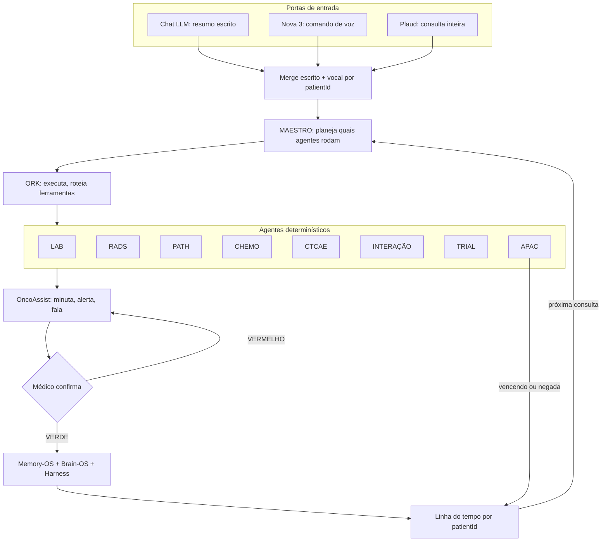

# OncoMind — Documento Final de Arquitetura Clínica (cerne)

> **Status:** DOCUMENTO-CERNE · **D-W9-71** (conteúdo) + **D-W9-72** (nomes, 2026-10-07).  
> Fonte clínica: Oct 5, 2026 · @Silas Jr.  
> **Nome:** o arquivo pode ainda dizer “WORK” no histórico; o território clínico **hoje é OncoMind** (projeto solo). **OncoGlobal** = só guarda-chuva (OncoMind + consultorio-docs + estatística HBem + QT HBem). **WORK×STUDY abolido** (D-W9-72).  
> Espelho: CONTEXTO · RADS · packs · `maestro.ts` / `ork.ts`.

## Mapa (D-W9-72)

```
ONCOGLOBAL (guarda-chuva)
 ├── OncoMind          ← este código / assistência clínica + OncoAssist
 ├── consultorio-docs   ← Mesa (backend legado mantido; fala com OncoMind)
 ├── estatística HBem
 └── QT HBem           (legado: Doctor_OS, Doctor_Suite)

OncoMind → OncoAssist → MAESTRO → ORK → agentes → Onco-Harness → MEMORY_OS ∥ BRAIN_OS
```

| Item | Decisão |
|---|---|
| MAESTRO | Evento → roteiro predefinido; desconhecido = null |
| ORK | Executa plano: paralelo, deps, timeout, retry, junta |
| APAC preenchida | Só a página/laudo APAC (um formulário) |
| C1 febre | Corte salão **>37,8** (D-W9-38); dual ≥ orientação = ainda proposta |
| C2 APAC | SSOT = dois campos sem conversor (**C**), até Silas reabrir |
| C3–C6 | Fechados (cirurgia 4; sem bloqueio clínico; dose 20/30/40) |
| Faturador | Ainda aberto (episódio × paciente) |

---

Oct 5, 2026 · @Silas Jr

## 0. Avisos de nome, escopo e conflitos que travam

**Este documento funde três fontes:** o planejamento OncoGlobal (LAB), as decisões do chat da esteira A-B-C-D-E e os modelos clínicos de saída do serviço (QT Hospital do Bem). Onde as fontes divergem, o conflito fica declarado. Nenhum lado foi escolhido em silêncio.

**Nome (D-W9-72).** Território clínico = **OncoMind** (projeto solo neste repo). **OncoGlobal** só nomeia o conjunto de projetos. A bipartição WORK/STUDY **não vale mais**. STUDY/ONCOMIND como “lado aprendizado” ficou absorvido: OncoAssist navega o território OncoMind e consulta BRAIN_OS/MEMORY_OS; não há segundo app “STUDY”.

**Princípio de topo:** menos clique, olhar o paciente; o app alerta e **nunca bloqueia**. Quem segura é o financeiro (antiglosa). O backend transfere, não traduz. Código leve não é tela morta.

**Conflitos que travam a implementação:**

| # | Conflito | Lado A | Lado B | Proposta |
| --- | --- | --- | --- | --- |
| C1 | Febre | Alerta clínico: febre **≥ 37,8 °C** (modelo do serviço) | Corte do salão: **acima de 37,8** (37,8 passa; 37,9 vai à fila) | Manter os dois, com papéis distintos: ≥ 37,8 = orientação ao paciente; > 37,8 = corte do salão. Decisão sua |
| C2 | Classe do tratamento × APAC | Você: QT DEFINITIVA \| NEO \| ADJUVANTE \| PALIATIVA | Finalidade APAC: PRÉVIA \| ADJUVANTE \| CURATIVA \| CONTROLE TEMPORÁRIO \| PALIATIVA | Se a classe clínica difere da finalidade APAC, alguém traduz. Ver seção 17 |
| C3 | Cirurgia | Chat: 3 classes | Agora: 4 classes (+ citorredutora) | A posição mais recente vale: 4 |
| C4 | RT | Chat: definitiva, neo, adjuvante, paliativa | Pedido atual: "definitiva, adjuvante…" (incompleto) | Manter as 4 até conferir o SIGTAP da RT |
| C5 | Bloqueio | OncoGlobal: nenhum caminho impede salvar ou aplicar | Chat: "campo obrigatório vazio não emite APAC" | Compatível: o clínico nunca bloqueia; só a emissão financeira espera o campo |
| C6 | Redução de dose | Chat (exemplo CTCAE): reduzir 25% | OncoGlobal: botão 20 \| 30 \| 40%, neste ciclo | OncoGlobal vale: 3 botões |

## 1. Comparação: planejamento OncoGlobal × decisões do chat

**Leitura geral:** os dois convergem na arquitetura (backend transfere, dado fora do código, alerta sem bloqueio). O chat é mais rico no **conteúdo clínico** (packs, classificações, CTCAE, APAC). O OncoGlobal é mais preciso na **operação do salão** (corte, fila, frente, dose, prazos). O documento final usa o OncoGlobal para a operação e o chat para o conteúdo.

| Tema | Planejamento OncoGlobal | Chat (esteira) | Situação |
| --- | --- | --- | --- |
| Backend | Transfere, não traduz | Transfere, não traduz; pesa em funções | Igual |
| Dado fora do código | Limiares, fila, sítios, prazos, dias 80/90, pacote | JSON: packs, limites, classificações | Igual |
| Bloqueio | Nunca bloqueia; financeiro segura | VERMELHO pede revisão; campo vazio não emite APAC | Compatível (C5) |
| Estados | Salão \| fila do médico \| frente | VERDE \| VERMELHO \| PENDENTE | Eixos diferentes; se somam (seção 4) |
| Corte clínico | PA > 16 ou < 9; FC > 120; Sat < 88; Hb < 8; N < 1.500; PLQ < 100.000; febre > 37,8; grau 3; ECOG 3–4 | N < 1.500; PLQ < 100k; Hb < 8; Cr ≥ 1,5×; INR > 1,5; TGP > 3× | Fundir: o OncoGlobal define o salão; o chat acrescenta Cr, INR, TGP como VERMELHO de revisão |
| Não é corte | FC < 50; ECOG 2 com tontura; grau 2 anota e fica | Não discutido | Só OncoGlobal |
| Ordem da fila | ECOG 4 → ECOG 3 → cama → cadeira → > 80 anos | Não discutido | Só OncoGlobal |
| Dose | Botão 20 \| 30 \| 40%, neste ciclo; sem peso = dose anterior | Função `calcularDose` determinística | Somam: o botão aplica, a função calcula |
| Peso vermelho | Fila da nutrição; QT no dia seguinte; minuta; imprime | Não discutido | Só OncoGlobal |
| APAC | Deriva da prescrição assinada; 90 dias; uma data; alerta no dia 80 | APAC retorna à clínica; validade puxa a reavaliação | Igual em espírito; o OncoGlobal fixa os números |
| Concomitante | QT + RT no mesmo período; cirurgia não entra | QT-RT = 2 registros, mesmo episódio | Igual |
| Prazos | Cirurgia a partir de 15 dias; QTRT a partir de 45 dias da última QT | Não discutido | Só OncoGlobal |
| Fases do ciclo | AC: ciclos 1, 2 e 4 com o médico; o 3 salta; 2 ciclos liberados | Não discutido | Só OncoGlobal |
| SIGTAP–TUSS | Par proibido | Dois arquivos separados | Igual |
| Trial | Não é caixa | Atributo de texto | Igual |
| Farmácia | Fora do corte | QT aparece, não gera farmácia | Igual |
| RT e CX na tela | Ficam no mapa, sem prioridade de tela | Classes definidas | Compatível: classificar sim, priorizar tela não |
| Marcador ausente | Luminal sem marcador alerta, não completa | Fármaco condicionado = PENDENTE | Igual |
| Medida ausente | Não se completa; foto sem escala omite o número | Dado ausente = PENDENTE | Igual |

## 2. Desenho do WORK

**Leitura do desenho:** três portas de entrada convergem num merge único; o MAESTRO decide quais agentes rodam; o ORK executa; os agentes devolvem propostas; o médico confirma; o dado volta ao histórico do paciente e alimenta a próxima consulta.



**Territórios:**

| Território | O que vive ali | Quem escreve |
| --- | --- | --- |
| OncoMind | Paciente, exames, tratamento, salão, APAC (página única), OncoAssist | Médico confirma; agentes propõem |
| consultorio-docs | Mesa / documentos operacionais (backend próprio) | Secretaria / fluxo Mesa; ponte com OncoMind |
| Secretaria (dados) | Demográficos (CNS, mãe, cidade, endereço), agenda | Secretaria; caixa em branco aloca |
| MEMORY_OS | Fatos, eventos, fontes, versões, decisões | Só após confirmação médica |
| BRAIN_OS | Contexto, conhecimento, playbooks, evidência | Curador; nunca LLM sozinha como fonte |
| JSON de dados | Limiares, fila, packs, prazos, classificações | Médico/curador |

## 3. Papéis e responsabilidades

**Regra de autoridade:** as IAs propõem. Dr. Silas decide. O médico valida, corrige e assina. Nenhum componente abaixo do médico tem poder de efeito clínico sozinho.

**Atenção:** a divisão entre MAESTRO e ORK abaixo é **proposta deste documento**. Nas conversas os dois aparecem juntos ("OncoAssist/MAESTRO → ORK → agentes"), sem fronteira definida. Confirme.

| Componente | O que faz | O que nunca faz | Analogia clínica |
| --- | --- | --- | --- |
| **Dr. Silas** | Decide; define regras e limiares; confirma o que vira dado | — | Chefe do serviço |
| **OncoAssist** | Face clínica: ouve, fala, minuta, avisa, alerta, prepara rascunho; consulta SBOC, ESMO, ASCO, PubMed, INCA, CONITEC, SIGTAP | Assinar; prescrever; liberar VERMELHO; escrever correção dentro do prontuário (correção vai no chat) | Residente sênior que prepara o caso |
| **MAESTRO** | Recebe um **evento** (ex. LAB_CHEGOU) e seleciona **roteiro predefinido** de agentes + dependências (`maestro.ts`). Evento desconhecido → sem plano | Inventar roteiro; usar LLM para escolher agentes; decidir conduta | Preceptor com tabela de plantão |
| **ORK** | Chama agentes; paralelo quando independente; espera deps; timeout; retry de certos erros; reúne resultados (`ork.ts`) | Escolher quais agentes entram no plano; interpretar clinicamente | Enfermagem que executa a prescrição |
| **Agentes determinísticos** | Uma função cada: entrada tipada → regra do JSON → saída tipada + estado | Usar LLM para decidir regra; completar dado ausente | Exame de laboratório: mesmo sangue, mesmo resultado |
| **LLMs (Claude, Grok, ChatGPT)** | Entrada via MCP: leem, extraem, redigem | Decidir regra clínica; ser fonte da verdade | Escrivão |

**Fluxo de autoridade:** Médico → OncoAssist → MAESTRO → ORK → agentes → (propostas sobem) → OncoAssist → médico confirma → memória.

## 4. Arquitetura e funcionalidades do app

**Esteira em ciclo (chat):** A Paciente → B Exames → C Tratamento → D Conduta/Retorno → E APAC → volta para A-B-C-D. A APAC é o resumo clínico estruturado; vencendo ou negada, ela realimenta a clínica. Nada é redigitado.

**Dois dutos e dois portões (chat):**

- **Duto 1, clínico:** o pack do sítio oferece imagem, molecular e esquema; não preenche; o que não veio fica vazio.
- **Duto 2, APAC:** campos do laudo; o backend lê o faturador e transfere o que o médico confirmou.
- **Portão 1, médico:** VERDE libera · VERMELHO revisa · PENDENTE espera.
- **Portão 2, autorizador:** PENDENTE · AUTORIZADO · NEGADO. Autorizado não nasce no app; negado não apaga.

**Operação do salão (OncoGlobal):**

| Etapa | Entrada | Saída | Regra |
| --- | --- | --- | --- |
| Caixa em branco | Texto ou print | Demográfico → secretaria; clínico → médico; alerta do que falta | Campo vazio não trava |
| Triagem | Sinais vitais, hemograma, ECOG, grau, queixa | Salão ou fila do médico | Corte → fila, a QT não começa. Igual ao limite passa |
| Frente | Cama, cadeira, > 80 anos | Atendida antes da fila | Fila vazia, o salão segue |
| Fila | Resultado da triagem | ECOG 4 → ECOG 3 → cama → cadeira → > 80; empate: ECOG maior, depois chegada | Ninguém escolhe à mão o que a ordem resolve |
| Salão | Nome, ciclo, prescrição, dose assinada | Aplicação ou bolsa parada | Enfermagem aplica sem o médico; alergia para na hora; vômito difícil para e espera |
| Peso vermelho | Peso alterado | Fila da nutrição; QT no dia seguinte; minuta; imprime; próximo | — |
| Dose | Botão 20 \| 30 \| 40% | Grava neste ciclo | Sem peso = dose anterior; nunca inventar peso |

**Como os dois eixos se somam:** o estado do dado (VERDE/VERMELHO/PENDENTE) diz **se o dado está bom**. O destino do paciente (salão/fila/frente) diz **para onde ele vai**. Um corte de triagem é VERMELHO no dado **e** fila no destino.

**Funções do backend (cada uma é uma escolha, nenhuma obriga):** `alocarCaixa(texto)` · `triar(vitais, labs, ECOG, grau)` · `ordenarFila(pacientes)` · `sugerirPack(sitio)` · `classificarCTCAE(sintoma, basal)` · `calcularDose(esquema, SC, ClCr)` · `aplicarReducao(20|30|40)` · `checarInteracoes(lista)` · `montarAPAC(caso)` · `alertarAPAC(dataEmissao)` · `compararRECIST(baseline, atual)` · `buscarTrials(caso)`.

## 5. Portas de entrada e fluxo chat + voz + Plaud

**Fluxo:** chat (resumo) → insere no app + voz (Nova 3, comando) + Plaud (consulta inteira) → merge escrito + vocal → Memory-OS + Brain-OS + Harness → retorno com análise longitudinal por patientId.

| Porta | O que entra | Exemplo | Para onde vai |
| --- | --- | --- | --- |
| Chat LLM | Resumo escrito, print, texto colado | Laudo de TC colado | Caixa em branco → aloca demográfico/clínico |
| Nova 3 (comando de voz) | Frase curta de ação | "Vou pedir uma TC de tórax" | Vira pendência de pedido (não executa sozinho) |
| Plaud | Consulta inteira gravada | 20 minutos de conversa | Reconcilia com o escrito; gera minuta |
| Sinais e sintomas | Queixa, sinais vitais, ECOG | "Diarreia 7x/dia, basal 2x" | Agente CTCAE + triagem |
| Exames com data | LABS, RADS | "Hb 7,8 em 03/10" | Agentes LAB e RADS; linha do tempo |
| PATH | Biópsia, peça, IHQ, biomarcadores | "HER2 2+, ISH amplificado" | Agente PATH; ativa fármaco condicionado |
| Tratamento | Esquema, ciclo, dose, finalidade | "FOLFOX C4, paliativa 1ª linha" | Agente CHEMO; APAC |
| Trials | Caso estruturado | EGFR ex19, ECOG 1, 2ª linha | Agente TRIAL; lista com link |

**Regras do merge:**

1. Cada informação entra com **data e fonte** (chat, voz ou Plaud).
2. Escrito e vocal concordam → um dado só.
3. Escrito e vocal divergem → **VERMELHO**, com as duas versões visíveis. Nunca escolher em silêncio.
4. Comando de voz vira **pendência de pedido**, não ação executada.
5. O que não foi dito nem escrito fica **vazio**. Nunca completar.
6. O identificador do paciente vem do cadastro (CNS ou carteirinha), nunca de semelhança de nome. Dois pacientes na mesma gravação → **VERMELHO** e separação manual.
7. Correções e alertas vão para o chat, nunca para o texto do prontuário.

## 6. Seguimento longitudinal e transversal

**Dois cortes do mesmo paciente:**

- **Longitudinal (interconsulta):** o filme. Cada evento datado entra na linha do tempo do patientId: diagnóstico, estádio, linha, ciclo, dose, toxicidade, exame, resposta, APAC. A pergunta é **como o paciente está mudando**.
- **Transversal (intraconsulta):** a fotografia. Na consulta de hoje, tudo o que existe é cruzado ao mesmo tempo: clínica + RADS + PATH + tratamento + APAC + trial. A pergunta é **tudo bate agora?**

**Linha do tempo (exemplo, cólon metastático):**

| Data | Evento | Fonte | Estado |
| --- | --- | --- | --- |
| D0 | Colonoscopia + biópsia: adenocarcinoma; RAS selvagem; MSS | PATH | VERDE |
| D7 | TC: metástases hepáticas | RADS | VERDE |
| D15 | FOLFOX + anti-EGFR, paliativa 1ª linha; APAC emitida | CHEMO/APAC | VERDE |
| D80 | Alerta: APAC vence no dia 90 | APAC | PENDENTE |
| D85 | TC de reavaliação: redução de 35% (RP) | RADS | VERDE |
| D86 | Neuropatia grau 2 por oxaliplatina | CTCAE | VERMELHO de revisão |
| D90 | Nova APAC, mantida 1ª linha | APAC | VERDE |

**Cruzamentos transversais que o app faz em toda consulta:**

| Cruzamento | O que compara | Divergência gera |
| --- | --- | --- |
| Clínica × RADS | Sintoma novo × imagem | Dor lombar + lesão vertebral → VERMELHO (compressão?) |
| RADS × PATH | Lateralidade, tamanho, sítio | Mama D na imagem, E no laudo → VERMELHO |
| PATH × tratamento | Biomarcador × fármaco | Trastuzumabe sem HER2 confirmado → PENDENTE |
| LABS × tratamento | Função renal × droga | ClCr baixo + cisplatina → VERMELHO |
| Tratamento × comorbidade | Contraindicação | Doxorrubicina + FEVE baixa → VERMELHO |
| Tratamento × medicamentos | Interação | Capecitabina + varfarina → VERMELHO |
| Tratamento × APAC | Finalidade, linha, esquema | Linha mudou e a APAC não → PENDENTE |
| Caso × trial | Critérios de inclusão | Elegível → lista com link |
| Longitudinal × hoje | Resposta, tendência | Hb caindo em 3 consultas → alerta |

## 7. Micro-prompts dos agentes determinísticos

**Formato comum a todos:** ENTRADA tipada → REGRA lida do JSON → SAÍDA tipada + ESTADO (VERDE | VERMELHO | PENDENTE) + motivo. **Nunca:** completar dado ausente, decidir conduta, assinar. Mesma entrada + mesma versão do JSON = mesma saída.

```text
AGENTE LAB
Entrada: exame, valor, unidade, data, basal (se houver), droga em uso.
Regra: limiares do JSON (corte do salão + risco de revisão).
Saída: valor | estado | motivo | grau CTCAE quando aplicável.
Nunca: converter unidade sem tabela; supor basal; usar exame sem data.
```

```text
AGENTE RADS
Entrada: laudo, tipo, data, exame prévio (se houver).
Regra: lista de emergências (seção 8); RECIST/iRECIST/Choi conforme a droga.
Saída: DATA–TIPO–RESUMO (T → TNM → invasão → M → comparação → ressecabilidade) | estado.
Nunca: emitir laudo; medir em foto sem escala; inventar a lesão-alvo.
```

```text
AGENTE PATH
Entrada: laudo de biópsia ou peça, IHQ, molecular.
Regra: extrair tipo, grau, lateralidade, cm, margens, peso, macroscopia, linfonodos, biomarcadores.
Saída: campos extraídos | biomarcadores → ativa ou não fármaco | estado.
Nunca: completar marcador; converter Gleason sem o laudo; lateralidade divergente = VERMELHO.
```

```text
AGENTE CHEMO
Entrada: esquema, ciclo, peso, altura, Cr, idade, dose assinada anterior.
Regra: SC, ClCr, dose do protocolo (JSON); botão de redução 20 | 30 | 40%.
Saída: dose calculada para conferência | ciclo liberado ou não | concomitância.
Nunca: alterar dose assinada sem o botão; inventar peso (sem peso = dose anterior).
```

```text
AGENTE CTCAE
Entrada: sintoma descrito, basal, droga, número da ocorrência.
Regra: grau = f(sintoma, basal); conduta = f(droga, grau, ocorrência).
Saída: termo CTCAE | grau | conduta sugerida para minuta.
Nunca: graduar sem basal quando o critério depende dele (fica PENDENTE).
```

```text
AGENTE INTERAÇÃO
Entrada: lista completa de medicamentos + oncológico.
Regra: tabela de interações relevantes (JSON).
Saída: semáforo VERDE | VERMELHO | PENDENTE + mecanismo + o que monitorar.
Nunca: suspender medicamento; lista incompleta = PENDENTE, nunca VERDE.
```

```text
AGENTE TRIAL
Entrada: CID, histologia, estádio, biomarcadores, linha, ECOG, comorbidades.
Regra: busca em registro público; compara critérios de inclusão e exclusão.
Saída: estudo | critério que bate | critério que falta | link do registro.
Nunca: inventar número de registro; afirmar elegibilidade final.
```

```text
AGENTE APAC
Entrada: prescrição assinada, CID, estádio, finalidade, esquema, data de emissão.
Regra: uma data só; alerta no dia 80; limite no dia 90.
Saída: campos da APAC | campos vazios listados | alerta de vencimento.
Nunca: calcular dose; editar prescrição assinada; emitir com campo obrigatório vazio.
```

```text
AGENTE TRIAGEM (salão)
Entrada: PA, FC, saturação, temperatura, Hb, neutrófilos, plaquetas, grau, ECOG.
Regra: corte do salão (JSON). Igual ao limite passa.
Saída: salão | fila do médico | frente; posição na fila.
Nunca: segundo corte de PA (14/9) ou FC (110) do fio antigo.
```

## 8. RADS: sinais de alarme e emergências radiológicas

**Regra:** qualquer achado abaixo no laudo → **VERMELHO**, com o trecho do laudo citado. O agente reconhece; o médico decide a conduta.

Operacional no código (D-W9-51/68): `corpus/rulesets/rads-emergencias.v1.json` · `docs/referencias/rads/EMERGENCIAS-RADIOLOGICAS-30.md`.

| Emergência | Achado no laudo (termos a reconhecer) | Clínica que acompanha | Por que é urgente |
| --- | --- | --- | --- |
| Compressão medular | Lesão vertebral com componente epidural; compressão do saco dural/medula; colapso vertebral | Dor lombar/dorsal, fraqueza, retenção urinária | Perda neurológica irreversível em horas |
| Metástase cerebral com efeito de massa | Edema perilesional; desvio da linha média; herniação; hidrocefalia | Cefaleia, vômito, déficit focal, convulsão | Herniação |
| Síndrome da veia cava superior | Compressão ou trombose da VCS; circulação colateral | Edema de face e membros superiores | Via aérea e drenagem venosa cerebral |
| TEP | Falha de enchimento em artéria pulmonar; sobrecarga de VD | Dispneia, taquicardia, dessaturação | Mortalidade alta; câncer aumenta risco |
| TVP / trombose tumoral | Trombo venoso; trombose portal | Edema de membro | Embolia |
| Obstrução intestinal | Distensão de alças; nível hidroaéreo; ponto de transição | Vômito, parada de eliminação | Isquemia, perfuração |
| Perfuração | Pneumoperitônio; ar livre | Abdome agudo | Peritonite (atenção ao bevacizumabe) |
| Tamponamento | Derrame pericárdico volumoso; colapso de câmaras direitas | Hipotensão, turgência jugular | Choque |
| Derrame pleural volumoso | Derrame com desvio do mediastino; atelectasia | Dispneia | Insuficiência respiratória |
| Obstrução de via aérea | Estenose traqueal/brônquica; atelectasia lobar | Estridor, dispneia | Asfixia |
| Hidronefrose bilateral (ou rim único) | Dilatação pielocalicial bilateral | Oligúria, Cr subindo | Insuficiência renal aguda |
| Obstrução biliar | Dilatação de vias biliares | Icterícia, colangite | Sepse; impede QT |
| Fratura patológica / risco iminente | Lesão lítica em osso de carga; cortical comprometida | Dor ao apoio | Fratura, imobilidade |
| Hemorragia | Sangramento tumoral; hematoma | Queda de Hb | Choque |
| Pneumonite | Opacidades em vidro fosco novas; padrão intersticial | Tosse seca, dispneia em uso de iO, T-DXd, everolimo, RT | Pode ser fatal |
| Progressão | Lesão nova; aumento ≥ 20% (RECIST) | — | Troca de linha; VERMELHO de revisão |

**Atenção:** na imunoterapia, a primeira imagem pode mostrar **pseudoprogressão**. iRECIST pede confirmação em nova imagem antes de declarar progressão.

## 9. LABS: achados de risco

**Dois níveis, sem subestados:** **corte do salão** (vai à fila, a QT não começa; limiares do OncoGlobal) e **VERMELHO de revisão** (o médico olha; não necessariamente para o ciclo). Os limiares ficam no JSON; os valores abaixo são o ponto de partida e devem ser conferidos pelo serviço.

| Achado | Corte do salão / VERMELHO | Emergência | Causas a lembrar | O que o app sugere conferir |
| --- | --- | --- | --- | --- |
| Neutropenia | N < 1.500 (corte) | N < 500 + febre = neutropenia febril | QT mielotóxica, CDK4/6, PARP | Temperatura, foco, MASCC (seção 15) |
| Neutropenia febril | Febre > 37,8 no salão (corte) | Qualquer febre com N < 1.000 | — | Antibiótico em até 1 hora: pronto-socorro, não salão |
| Plaquetopenia | PLQ < 100.000 (corte) | < 20.000 ou sangramento | Carboplatina, gencitabina, T-DM1, PARP | Sangramento, anticoagulante em uso |
| Anemia | Hb < 8 (corte) | < 7 ou sintomática | QT, sangramento, infiltração medular | Ferro, B12, sangramento oculto |
| Hipercalcemia | Ca corrigido > 12 (VERMELHO) | > 14 ou confusão/sonolência | Metástase óssea; PTHrP | Albumina; função renal; hidratação |
| Hiponatremia | Na < 130 (VERMELHO) | < 125 ou sintoma neurológico | SIADH, ciclofosfamida, cisplatina, vincristina | Osmolalidade |
| Hipercalemia | K > 5,5 (VERMELHO) | > 6,5 ou alteração no ECG | Lise tumoral, IR, IECA | ECG |
| Hipomagnesemia | Mg baixo (VERMELHO) | Arritmia, tetania | Cetuximabe, panitumumabe, cisplatina | Reposição antes do ciclo |
| Hipocalemia | K < 3,0 (VERMELHO) | Arritmia | Diarreia, abiraterona | ECG |
| Piora da função renal | Cr ≥ 1,5× basal ou + 0,3 em 48 h (KDIGO) | Oligúria, K alto | Cisplatina, MTX, contraste, hidronefrose | ClCr; ajuste; imagem |
| Lise tumoral | Ácido úrico, K e fósforo subindo; Ca caindo | Cr subindo, arritmia | Tumor volumoso quimiossensível | Hidratação; hipouricemiante |
| Hepatotoxicidade | TGP > 3× LSN (VERMELHO) | TGP > 3× + bilirrubina > 2× (Hy) | iO, TKI, metástase hepática | Imagem biliar; hepatite viral |
| INR alargado | > 1,5 sem anticoagulante (VERMELHO) | Sangramento | Varfarina + capecitabina/5-FU | Interação (seção 12) |
| Hiperglicemia | > 250 em jejum (VERMELHO) | Cetoacidose | Corticoide, alpelisibe, everolimo, iO | Glicemia seriada |
| Tireoide | TSH alterado | Tempestade / mixedema | iO, TKI anti-VEGF | TSH + T4L |
| Cortisol baixo | Cortisol baixo com Na baixo | Crise adrenal | iO | ACTH, cortisol |
| Troponina / CK | Elevação nova em iO | Miocardite | Anti-PD-1 ± anti-CTLA-4 | ECG, eco |
| Proteinúria | ≥ 2+ em fita | Síndrome nefrótica | Bevacizumabe, TKI anti-VEGF | Proteinúria 24 h |

## 10. Citotóxicos: cuidados e complicações

**Uso no app:** quando o agente CHEMO registra a droga, o pack carrega a coluna "monitorar" como pendência do ciclo e o agente CTCAE vigia a toxicidade típica.

| Droga | Complicação típica | Monitorar | Cuidado prático |
| --- | --- | --- | --- |
| Cisplatina | Nefro; oto; náusea; neuropatia; hipoMg | Cr/ClCr, Mg, K, Na | Hidratação + Mg; NK1; evitar aminoglicosídeo |
| Carboplatina | Plaquetopenia; mielotoxicidade | Hemograma; Cr (AUC/Calvert) | Hipersensibilidade após muitos ciclos |
| Oxaliplatina | Neuropatia (fria aguda; crônica) | Graduar a cada ciclo | Evitar frio; pausa se persistente |
| Doxorrubicina / epirrubicina | Cardio cumulativa; mucosite; extravasamento | FEVE; dose cumulativa | Somar todas as linhas; vesicante |
| Ciclofosfamida / ifosfamida | Cistite; ifos: encefalopatia | Urina, Cr, mental | Mesna; hidratação |
| 5-FU / capecitabina | Mucosite; diarreia; mão-pé; vasoespasmo | Hemograma; INR se varfarina | DPD; dor torácica = suspender |
| Irinotecano | Diarreia aguda/tardía; neutropenia | Diarreia por ciclo | Atropina; loperamida; UGT1A1*28 |
| Paclitaxel | Neuropatia; hipersensibilidade | Neuropatia | Pré-medicação |
| Docetaxel | Neutropenia febril; retenção hídrica | Hemograma; edema | Dexa; evitar se bilirrubina alta |
| Gencitabina | Mielo; pneumonite; SHU rara | Hemograma; tosse | Radiossensibilizante com RT |
| Pemetrexede | Mielo; mucosite; rash | Hemograma; ClCr | Folato + B12; dexa; evitar AINE |
| Metotrexato (alta) | Nefro; mucosite; hepato | Nível sérico; Cr | Leucovorina; alcalinizar |
| Etoposídeo | Mielo; hipotensão | Hemograma | Infusão lenta |
| Vincristina / vinorelbina | Neuropatia; íleo; extravasamento | Intestino; neuropatia | Nunca intratecal (vincristina) |
| Bleomicina | Fibrose pulmonar | CPF; dose cumulativa | Cuidado com O₂ alto |
| Trabectedina / eribulina | Hepato; mielo; neuropatia | Enzimas; hemograma | — |

## 11. Comorbidades e contraindicações

**Regra do app:** comorbidade × droga → **VERMELHO** com motivo. O app não proíbe nem troca: mostra o risco; o médico decide.

**Citotóxicos (resumo):** IR → cisplatina/MTX/pemetrexede/ifos/cape · perda auditiva → cisplatina · FEVE baixa → antraciclinas/5-FU · neuropatia prévia → oxali/taxanos/vincristina/cisplatina · hepato/bilirrubina → docetaxel/irinotecano/antraciclinas · pneumopatia → bleomicina/gencitabina · 3º espaço → MTX/pemetrexede · DPD → 5-FU/cape · gestação → quase todos · ECOG 3–4 → corte do salão.

**Alvo/TKI:** FEVE → trastuzumabe/pertuzumabe/T-DM1 · cirurgia/ferida → anti-VEGF · HAS/proteinúria → anti-VEGF · TEV arterial recente → anti-VEGF · QT longo → ribociclibe/osimertinibe/vandetanibe · DLI → T-DXd/osimertinibe/everolimo · diabetes → alpelisibe/everolimo · CYP3A4 forte → maioria TKI/CDK4/6 · citopenia → PARP/CDK4/6.

**Imunoterapia:** autoimune ativa · transplante sólido · corticoide imunossupressor · pneumonite/RT torácica · HBV/HCV não controladas · miocardite prévia · hipotireoidismo/DM1 controlados = vigilância, não contraindicação absoluta.

## 12. Interações medicamentosas e semáforo do OncoAssist

**Semáforo com 3 cores, sem amarelo:**

- **VERDE:** lista completa e nenhuma interação relevante.
- **VERMELHO:** interação relevante; OncoAssist informa mecanismo e o que monitorar; médico decide; app não suspende.
- **PENDENTE:** lista incompleta. **Nunca vira VERDE por omissão.**

"Amarelo" de outros sistemas → VERMELHO com "moderada" no motivo.

| Oncológico | Interage com | Mecanismo | Monitorar |
| --- | --- | --- | --- |
| Capecitabina / 5-FU | Varfarina | Potencializa | INR; preferir outro ACO |
| Capecitabina | Fenitoína | ↑ nível | Toxicidade neurológica |
| TKI, CDK4/6, taxanos, irinotecano, vincristina | Azólicos, claritromicina, ritonavir | Inibem CYP3A4 | Evitar ou ajustar |
| Idem | Carbamazepina, fenitoína, fenobarbital, rifampicina, erva-de-são-joão | Induzem CYP3A4 | Evitar |
| Erlotinibe, gefitinibe, pazopanibe, dasatinibe | IBP / antiácidos | ↓ absorção | Separar horários |
| Ribociclibe, osimertinibe, lapatinibe, vandetanibe | Ondansetrona, quinolonas, macrolídeos, haloperidol, amiodarona, metadona | QT longo | ECG; K, Mg |
| Metotrexato | AINE, IBP, SMX-TMP, penicilinas | ↓ eliminação | Nível MTX |
| Pemetrexede | AINE | ↓ eliminação | Suspender AINE perto da dose |
| Cisplatina | Aminoglicosídeos, furosemida alta, vancomicina | Nefro/oto aditiva | Cr; audição |
| Tamoxifeno | Fluoxetina, paroxetina, bupropiona | CYP2D6 | Outro antidepressivo |
| Enzalutamida, apalutamida | DOACs, varfarina, muitos | Indutores fortes | Revisar lista |
| Abiraterona | Espironolactona | Pode ativar AR | Evitar |
| Imunoterapia | Corticoide alto / imunossupressor | ↓ resposta | Só para irAE |
| Antraciclinas | Trastuzumabe | Cardio aditiva | FEVE |
| QT oral | Grapefruit, fitoterápicos | CYP3A4 | Orientar |

**Fonte da tabela:** ponto de partida. JSON real vem de base reconhecida, com versão registrada.

## 13. CTCAE: o médico descreve, o app gradua, o OncoAssist minuta

**Fluxo:** sintoma + basal → CTCAE termo/grau → minuta de conduta (droga × ocorrência) → médico confirma/edita/descarta.

**Regras:** grau = f(sintoma, basal), **não da droga**. Conduta = f(droga, grau, 1ª/2ª ocorrência). Versão CTCAE no JSON. Sem basal quando necessário → PENDENTE.

| Termo (CTCAE v5) | G1 | G2 | G3 | G4 |
| --- | --- | --- | --- | --- |
| Diarreia (acima do basal) | < 4/dia | 4–6/dia | ≥ 7/dia; internação | Risco de vida |
| Neutrófilos | < LIN a 1.500 | 1.000–1.499 | 500–999 | < 500 |
| Plaquetas | < LIN a 75.000 | 50.000–74.999 | 25.000–49.999 | < 25.000 |
| Anemia (Hb) | < LIN a 10 | 8–9,9 | < 8; transfusão | Risco de vida |
| Neuropatia sensitiva | Assintomática | Limita instrumental | Limita autocuidado | Risco de vida |
| Mucosite oral | Leve | Dor; dieta modificada | Não come | Risco de vida |
| Náusea | Perda de apetite | Ingestão reduzida | Suporte nutricional | — |
| Vômito | Sem intervenção | Hidratação ambulatorial | Sonda/NPT/internação | Risco de vida |
| Síndrome mão-pé | Sem dor | Com dor | Grave | — |
| TGP | > LSN a 3× | 3–5× | 5–20× | > 20× |
| Rash maculopapular | < 10% | 10–30% | > 30% | — |
| Neutropenia febril | — | — | N < 1.000 + febre | Risco de vida |

Conduta por droga fica no JSON do serviço. Minuta = rascunho; OncoAssist não prescreve.

## 14. Biópsia incisional, excisional e peça cirúrgica

| Tipo | O que o laudo pode trazer | O que não pode | Uso típico |
| --- | --- | --- | --- |
| PAAF / citologia | Células malignas; às vezes IHQ | Arquitetura, grau completo, margem | Linfonodo, tireoide, derrame |
| Core biopsy | Histologia, grau, IHQ, molecular | Tamanho total, margem, pT | Mama, próstata, fígado, pulmão |
| Incisional | Histologia, grau, IHQ, molecular | Margem, tamanho total, pT | Lesão grande, sarcoma |
| Excisional | Histologia, tamanho, margem estreita, Breslow | Estadiamento linfonodal | Melanoma diagnóstico, pele pequena |
| Peça cirúrgica | cm, margens mm, peso, LN, invasão, pT pN, ypTNM, regressão | — | Mastectomia, colectomia, etc. |

**Regras PATH:** (1) identificar tipo antes de extrair; (2) campo impossível → vazio por natureza, sem alerta; (3) campo possível ausente → VERMELHO; (4) pós-neo = **yp** + regressão; (5) lateralidade divergente → VERMELHO.

## 15. Classificações mais usadas e técnicas de PD-L1

| Classificação | Para quê | Leitura | Esteira |
| --- | --- | --- | --- |
| MASCC | Risco neutropenia febril | ≥ 21 baixo risco | D |
| Khorana | TEV antes da QT | 0 baixo; 1–2 interm.; ≥ 3 alto | C |
| Choi | Resposta GIST | ≥10% tamanho ou ≥15% UH | D |
| IMDC (Heng) | Rim metastático | 0 fav.; 1–2 interm.; ≥ 3 ruim | C |
| Adjuvant! Online | Benefício adjuvância | **Descontinuado**; mama → PREDICT | C |
| ECOG / KPS | Funcional | ECOG 3–4 = corte salão | A, triagem |
| RECIST 1.1 / iRECIST | Resposta | RC, RP, DE, PD | D |
| CTCAE | Toxicidade | Seção 13 | D |

**PD-L1:** trio **escore + anticorpo + valor**. Sem anticorpo → PENDENTE.

| Escore | Conta | Plataforma | Uso |
| --- | --- | --- | --- |
| TPS | Células tumorais | 22C3 | Pulmão |
| CPS | Tumorais + imunes / tumorais × 100 | 22C3 | Gástrico, colo, H&N, mama TN |
| IC | Área por células imunes | SP142 | Atezolizumabe |
| TPS/TC | Tumorais | SP263; 28-8 | Durva; nivo |

## 16. Trials: associação entre o caso e os estudos

- **Trial como referência** (atributo do tratamento): texto livre; nunca caixa.
- **Trial como oportunidade** (agente TRIAL): estudos abertos; registro oficial; "bate" ≠ elegibilidade final; biomarcador ausente → "falta", nunca elegível.

## 17. APAC: fluxo linear e estados

**Fluxo (sem tradução no backend):** dados do caso → resumo clínico → prescrição assinada → código SIGTAP → APAC.

**Regras:** deriva da prescrição assinada; não calcula dose; uma data (emissão); alerta dia **80**; limite dia **90**; campo obrigatório vazio não emite (financeiro). Volta autorizada/negada/vencendo realimenta a clínica.

| Modalidade | Estados | Faturamento |
| --- | --- | --- |
| QT | DEFINITIVA \| NEOADJUVANTE \| ADJUVANTE \| PALIATIVA | APAC |
| Cirurgia | CURATIVA \| PALIATIVA \| HIGIÊNICA \| CITORREDUTORA | AIH |
| RT | DEFINITIVA \| NEOADJUVANTE \| ADJUVANTE \| PALIATIVA | APAC; conferir SIGTAP |

**C2 — opções A / B / C** (ver quadro no topo). Este documento recomenda **A**. SSOT vigente = **C**. Escolha do Dr. Silas.

## 18. Estatística e modelos de saída (padrão QT Hospital do Bem)

**Princípio:** estatística sai da esteira. **1 paciente = 1 patientId**.

Indicadores: atendimentos · cortes · ciclos/reduções · toxicidade · APAC · negações · perfil · respostas · elegíveis a estudo.

**Modelos:** resumo de caso · receita VO (sem tramadol; dipirona/paracetamol SOS dor, nunca febre; dexa D-1 e D+1, nunca D+2) · FOLFOX/FOLFIRI em 2 dias consecutivos sem bomba · PENDÊNCIAS — COPIAR E COLAR · prontuário só argumentos médicos (correções no chat).

## 19. Pendências de decisão

**Travam o código:**

1. ~~Nome WORK~~ → **fechado D-W9-72** (OncoMind solo; OncoGlobal = guarda-chuva).
2. C1 febre: dual ≥ orientação / > corte? (corte >37,8 já vale)
3. C2 APAC: A (este doc) ou C (SSOT)?
4. RT no SIGTAP.
5. ~~MAESTRO × ORK~~ → **fechado D-W9-72** (evento→tabela / executor).
6. Faturador: episódio × paciente.

**Não travam (fonte):** interações versionadas · conduta CTCAE por esquema · limiares LABS revisão · modelos laudo/encaminhamento · CTCAE v6.

**Ordem:** F0 → F1 caixa → F2 triagem → F3 fila/frente → F4 salão/dose → F5 APAC → F6 concomitante/prazos → agentes depois.

**Saída do LAB:** 20 testes passam; caixa aloca sem travar; salão aplica ciclo liberado sem o médico.
