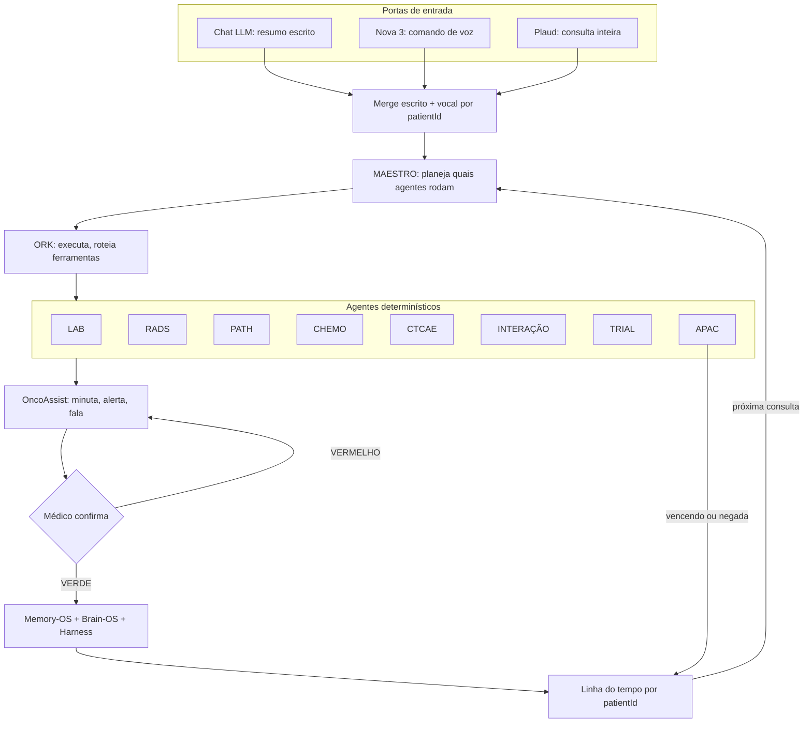

# Fonte M-AH · PLN-030 · 2026-10-07 · texto íntegro do Dr. Silas (documento datado 5 out 2026, de outro chat)

> Cópia literal do documento "OncoGlobal WORK — Documento Final de Arquitetura Clínica" (Oct 5, 2026 · @Silas Jr), colado pelo Dr. Silas em 2026-10-07. Sem dado de paciente. Não editar; correções viram nó novo no CHATPLAN.

# OncoGlobal WORK — Documento Final de Arquitetura Clínica

Oct 5, 2026 · @Silas Jr

## 0. Avisos de nome, escopo e conflitos que travam

**Este documento funde três fontes:** o planejamento OncoGlobal (LAB), as decisões do chat da esteira A-B-C-D-E e os modelos clínicos de saída do serviço (QT Hospital do Bem). Onde as fontes divergem, o conflito fica declarado. Nenhum lado foi escolhido em silêncio.

**Nome do território clínico.** O planejamento diz: "`oncomind` é nome errado e não entra" e "OncoGlobal é autônomo, não é filho de `ONCOMED`". O pedido fala em "ONCOMIND-WORK". Neste documento o território clínico se chama **WORK (OncoGlobal)**. O aprendizado (STUDY) fica fora deste corte. **Confirme o nome antes de qualquer repositório.**

**Princípio de topo (OncoGlobal):** menos clique, olhar o paciente; o app alerta e **nunca bloqueia**. Quem segura é o financeiro (antiglosa). O backend transfere, não traduz. Código leve não é tela morta.

**Conflitos que travam a implementação:**

| # | Conflito | Lado A | Lado B | Proposta |
| --- | --- | --- | --- | --- |
| C1 | Febre | Alerta clínico: febre **≥ 37,8 °C** (modelo do serviço) | Corte do salão: **acima de 37,8** (37,8 passa; 37,9 vai à fila) | Manter os dois, com papéis distintos: ≥ 37,8 = orientação ao paciente; > 37,8 = corte do salão. Decisão sua |
| C2 | Classe do tratamento × APAC | Você: QT DEFINITIVA \| NEO \| ADJUVANTE \| PALIATIVA | Finalidade APAC: PRÉVIA \| ADJUVANTE \| CURATIVA \| CONTROLE TEMPORÁRIO \| PALIATIVA | Se a classe clínica difere da finalidade APAC, alguém traduz. Ver seção 17 |
| C3 | Cirurgia | Chat: 3 classes | Agora: 4 classes (+ citorredutora) | A posição mais recente vale: 4 |
| C4 | RT | Chat: definitiva, neo, adjuvante, paliativa | Pedido atual: "definitiva, adjuvante…" (incompleto) | Manter as 4 até conferir o SIGTAP da RT |
| C5 | Bloqueio | OncoGlobal: nenhum caminho impede salvar ou aplicar | Chat: "campo obrigatório vazio não emite APAC" | Compatível: o clínico nunca bloqueia; só a emissão financeira espera o campo |
| C6 | Redução de dose | Chat (exemplo CTCAE): reduzir 25% | OncoGlobal: botão 20 \| 30 \| 40%, neste ciclo | OncoGlobal vale: 3 botões |

## 1. Comparação: planejamento OncoGlobal × decisões do chat

**Leitura geral:** os dois convergem na arquitetura (backend transfere, dado fora do código, alerta sem bloqueio). O chat é mais rico no **conteúdo clínico** (packs, classificações, CTCAE, APAC). O OncoGlobal é mais preciso na **operação do salão** (corte, fila, frente, dose, prazos). O documento final usa o OncoGlobal para a operação e o chat para o conteúdo.

| Tema | Planejamento OncoGlobal | Chat (esteira) | Situação |
| --- | --- | --- | --- |
| Backend | Transfere, não traduz | Transfere, não traduz; pesa em funções | Igual |
| Dado fora do código | Limiares, fila, sítios, prazos, dias 80/90, pacote | JSON: packs, limites, classificações | Igual |
| Bloqueio | Nunca bloqueia; financeiro segura | VERMELHO pede revisão; campo vazio não emite APAC | Compatível (C5) |
| Estados | Salão \| fila do médico \| frente | VERDE \| VERMELHO \| PENDENTE | Eixos diferentes; se somam (seção 4) |
| Corte clínico | PA > 16 ou < 9; FC > 120; Sat < 88; Hb < 8; N < 1.500; PLQ < 100.000; febre > 37,8; grau 3; ECOG 3–4 | N < 1.500; PLQ < 100k; Hb < 8; Cr ≥ 1,5×; INR > 1,5; TGP > 3× | Fundir: o OncoGlobal define o salão; o chat acrescenta Cr, INR, TGP como VERMELHO de revisão |
| Não é corte | FC < 50; ECOG 2 com tontura; grau 2 anota e fica | Não discutido | Só OncoGlobal |
| Ordem da fila | ECOG 4 → ECOG 3 → cama → cadeira → > 80 anos | Não discutido | Só OncoGlobal |
| Dose | Botão 20 \| 30 \| 40%, neste ciclo; sem peso = dose anterior | Função `calcularDose` determinística | Somam: o botão aplica, a função calcula |
| Peso vermelho | Fila da nutrição; QT no dia seguinte; minuta; imprime | Não discutido | Só OncoGlobal |
| APAC | Deriva da prescrição assinada; 90 dias; uma data; alerta no dia 80 | APAC retorna à clínica; validade puxa a reavaliação | Igual em espírito; o OncoGlobal fixa os números |
| Concomitante | QT + RT no mesmo período; cirurgia não entra | QT-RT = 2 registros, mesmo episódio | Igual |
| Prazos | Cirurgia a partir de 15 dias; QTRT a partir de 45 dias da última QT | Não discutido | Só OncoGlobal |
| Fases do ciclo | AC: ciclos 1, 2 e 4 com o médico; o 3 salta; 2 ciclos liberados | Não discutido | Só OncoGlobal |
| SIGTAP–TUSS | Par proibido | Dois arquivos separados | Igual |
| Trial | Não é caixa | Atributo de texto | Igual |
| Farmácia | Fora do corte | QT aparece, não gera farmácia | Igual |
| RT e CX na tela | Ficam no mapa, sem prioridade de tela | Classes definidas | Compatível: classificar sim, priorizar tela não |
| Marcador ausente | Luminal sem marcador alerta, não completa | Fármaco condicionado = PENDENTE | Igual |
| Medida ausente | Não se completa; foto sem escala omite o número | Dado ausente = PENDENTE | Igual |

## 2. Desenho do WORK

**Leitura do desenho:** três portas de entrada convergem num merge único; o MAESTRO decide quais agentes rodam; o ORK executa; os agentes devolvem propostas; o médico confirma; o dado volta ao histórico do paciente e alimenta a próxima consulta.



**Territórios:**

| Território | O que vive ali | Quem escreve |
| --- | --- | --- |
| WORK (OncoGlobal) | Paciente, exames, tratamento, salão, APAC | Médico confirma; agentes propõem |
| Secretaria | Dados demográficos (CNS, mãe, cidade, endereço), agenda | Secretaria; caixa em branco aloca |
| Memória | Histórico longitudinal por patientId | Só após confirmação médica |
| JSON de dados | Limiares, fila, packs, prazos, classificações | Médico/curador; nunca a LLM sozinha |
| STUDY | Fora deste corte | — |

## 3. Papéis e responsabilidades

**Regra de autoridade:** as IAs propõem. Dr. Silas decide. O médico valida, corrige e assina. Nenhum componente abaixo do médico tem poder de efeito clínico sozinho.

**Atenção:** a divisão entre MAESTRO e ORK abaixo é **proposta deste documento**. Nas conversas os dois aparecem juntos ("OncoAssist/MAESTRO → ORK → agentes"), sem fronteira definida. Confirme.

| Componente | O que faz | O que nunca faz | Analogia clínica |
| --- | --- | --- | --- |
| **Dr. Silas** | Decide; define regras e limiares; confirma o que vira dado | — | Chefe do serviço |
| **OncoAssist** | Face clínica: ouve, fala, minuta, avisa, alerta, prepara rascunho; consulta SBOC, ESMO, ASCO, PubMed, INCA, CONITEC, SIGTAP | Assinar; prescrever; liberar VERMELHO; escrever correção dentro do prontuário (correção vai no chat) | Residente sênior que prepara o caso |
| **MAESTRO** | Planeja a sessão: lê o merge, decide quais agentes rodam e em que ordem, junta as respostas | Executar ferramenta; decidir conduta | Preceptor que distribui as tarefas |
| **ORK** | Executa: chama os agentes, conectores, busca de dados; aplica limite de tempo; registra cada chamada | Interpretar; escolher entre agentes por conta própria | Enfermagem que executa a prescrição |
| **Agentes determinísticos** | Uma função cada: entrada tipada → regra do JSON → saída tipada + estado | Usar LLM para decidir regra; completar dado ausente | Exame de laboratório: mesmo sangue, mesmo resultado |
| **LLMs (Claude, Grok, ChatGPT)** | Entrada via MCP: leem, extraem, redigem | Decidir regra clínica; ser fonte da verdade | Escrivão |

**Fluxo de autoridade:** Médico → OncoAssist → MAESTRO → ORK → agentes → (propostas sobem) → OncoAssist → médico confirma → memória.

## 4. Arquitetura e funcionalidades do app

**Esteira em ciclo (chat):** A Paciente → B Exames → C Tratamento → D Conduta/Retorno → E APAC → volta para A-B-C-D. A APAC é o resumo clínico estruturado; vencendo ou negada, ela realimenta a clínica. Nada é redigitado.

**Dois dutos e dois portões (chat):**

- **Duto 1, clínico:** o pack do sítio oferece imagem, molecular e esquema; não preenche; o que não veio fica vazio.
- **Duto 2, APAC:** campos do laudo; o backend lê o faturador e transfere o que o médico confirmou.
- **Portão 1, médico:** VERDE libera · VERMELHO revisa · PENDENTE espera.
- **Portão 2, autorizador:** PENDENTE · AUTORIZADO · NEGADO. Autorizado não nasce no app; negado não apaga.

**Operação do salão (OncoGlobal):**

| Etapa | Entrada | Saída | Regra |
| --- | --- | --- | --- |
| Caixa em branco | Texto ou print | Demográfico → secretaria; clínico → médico; alerta do que falta | Campo vazio não trava |
| Triagem | Sinais vitais, hemograma, ECOG, grau, queixa | Salão ou fila do médico | Corte → fila, a QT não começa. Igual ao limite passa |
| Frente | Cama, cadeira, > 80 anos | Atendida antes da fila | Fila vazia, o salão segue |
| Fila | Resultado da triagem | ECOG 4 → ECOG 3 → cama → cadeira → > 80; empate: ECOG maior, depois chegada | Ninguém escolhe à mão o que a ordem resolve |
| Salão | Nome, ciclo, prescrição, dose assinada | Aplicação ou bolsa parada | Enfermagem aplica sem o médico; alergia para na hora; vômito difícil para e espera |
| Peso vermelho | Peso alterado | Fila da nutrição; QT no dia seguinte; minuta; imprime; próximo | — |
| Dose | Botão 20 \| 30 \| 40% | Grava neste ciclo | Sem peso = dose anterior; nunca inventar peso |

**Como os dois eixos se somam:** o estado do dado (VERDE/VERMELHO/PENDENTE) diz **se o dado está bom**. O destino do paciente (salão/fila/frente) diz **para onde ele vai**. Um corte de triagem é VERMELHO no dado **e** fila no destino.

**Funções do backend (cada uma é uma escolha, nenhuma obriga):** `alocarCaixa(texto)` · `triar(vitais, labs, ECOG, grau)` · `ordenarFila(pacientes)` · `sugerirPack(sitio)` · `classificarCTCAE(sintoma, basal)` · `calcularDose(esquema, SC, ClCr)` · `aplicarReducao(20|30|40)` · `checarInteracoes(lista)` · `montarAPAC(caso)` · `alertarAPAC(dataEmissao)` · `compararRECIST(baseline, atual)` · `buscarTrials(caso)`.

## 5. Portas de entrada e fluxo chat + voz + Plaud

**Fluxo:** chat (resumo) → insere no app + voz (Nova 3, comando) + Plaud (consulta inteira) → merge escrito + vocal → Memory-OS + Brain-OS + Harness → retorno com análise longitudinal por patientId.

| Porta | O que entra | Exemplo | Para onde vai |
| --- | --- | --- | --- |
| Chat LLM | Resumo escrito, print, texto colado | Laudo de TC colado | Caixa em branco → aloca demográfico/clínico |
| Nova 3 (comando de voz) | Frase curta de ação | "Vou pedir uma TC de tórax" | Vira pendência de pedido (não executa sozinho) |
| Plaud | Consulta inteira gravada | 20 minutos de conversa | Reconcilia com o escrito; gera minuta |
| Sinais e sintomas | Queixa, sinais vitais, ECOG | "Diarreia 7x/dia, basal 2x" | Agente CTCAE + triagem |
| Exames com data | LABS, RADS | "Hb 7,8 em 03/10" | Agentes LAB e RADS; linha do tempo |
| PATH | Biópsia, peça, IHQ, biomarcadores | "HER2 2+, ISH amplificado" | Agente PATH; ativa fármaco condicionado |
| Tratamento | Esquema, ciclo, dose, finalidade | "FOLFOX C4, paliativa 1ª linha" | Agente CHEMO; APAC |
| Trials | Caso estruturado | EGFR ex19, ECOG 1, 2ª linha | Agente TRIAL; lista com link |

**Regras do merge:**

1. Cada informação entra com **data e fonte** (chat, voz ou Plaud).
2. Escrito e vocal concordam → um dado só.
3. Escrito e vocal divergem (ex.: o texto diz HER2 negativo e a gravação diz positivo) → **VERMELHO**, com as duas versões visíveis. Nunca escolher em silêncio.
4. Comando de voz vira **pendência de pedido**, não ação executada.
5. O que não foi dito nem escrito fica **vazio**. Nunca completar.
6. O identificador do paciente vem do cadastro (CNS ou carteirinha), nunca de semelhança de nome. Dois pacientes na mesma gravação → **VERMELHO** e separação manual.
7. Correções e alertas vão para o chat, nunca para o texto do prontuário.

## 6. Seguimento longitudinal e transversal

**Dois cortes do mesmo paciente:**

- **Longitudinal (interconsulta):** o filme. Cada evento datado entra na linha do tempo do patientId: diagnóstico, estádio, linha, ciclo, dose, toxicidade, exame, resposta, APAC. A pergunta é **como o paciente está mudando**.
- **Transversal (intraconsulta):** a fotografia. Na consulta de hoje, tudo o que existe é cruzado ao mesmo tempo: clínica + RADS + PATH + tratamento + APAC + trial. A pergunta é **tudo bate agora?**

**Linha do tempo (exemplo, cólon metastático):**

| Data | Evento | Fonte | Estado |
| --- | --- | --- | --- |
| D0 | Colonoscopia + biópsia: adenocarcinoma; RAS selvagem; MSS | PATH | VERDE |
| D7 | TC: metástases hepáticas | RADS | VERDE |
| D15 | FOLFOX + anti-EGFR, paliativa 1ª linha; APAC emitida | CHEMO/APAC | VERDE |
| D80 | Alerta: APAC vence no dia 90 | APAC | PENDENTE |
| D85 | TC de reavaliação: redução de 35% (RP) | RADS | VERDE |
| D86 | Neuropatia grau 2 por oxaliplatina | CTCAE | VERMELHO de revisão |
| D90 | Nova APAC, mantida 1ª linha | APAC | VERDE |

**Cruzamentos transversais que o app faz em toda consulta:**

| Cruzamento | O que compara | Divergência gera |
| --- | --- | --- |
| Clínica × RADS | Sintoma novo × imagem | Dor lombar + lesão vertebral → VERMELHO (compressão?) |
| RADS × PATH | Lateralidade, tamanho, sítio | Mama D na imagem, E no laudo → VERMELHO |
| PATH × tratamento | Biomarcador × fármaco | Trastuzumabe sem HER2 confirmado → PENDENTE |
| LABS × tratamento | Função renal × droga | ClCr baixo + cisplatina → VERMELHO |
| Tratamento × comorbidade | Contraindicação | Doxorrubicina + FEVE baixa → VERMELHO |
| Tratamento × medicamentos | Interação | Capecitabina + varfarina → VERMELHO |
| Tratamento × APAC | Finalidade, linha, esquema | Linha mudou e a APAC não → PENDENTE |
| Caso × trial | Critérios de inclusão | Elegível → lista com link |
| Longitudinal × hoje | Resposta, tendência | Hb caindo em 3 consultas → alerta |

## 7. Micro-prompts dos agentes determinísticos

**Formato comum a todos:** ENTRADA tipada → REGRA lida do JSON → SAÍDA tipada + ESTADO (VERDE | VERMELHO | PENDENTE) + motivo. **Nunca:** completar dado ausente, decidir conduta, assinar. Mesma entrada + mesma versão do JSON = mesma saída.

```text
AGENTE LAB
Entrada: exame, valor, unidade, data, basal (se houver), droga em uso.
Regra: limiares do JSON (corte do salão + risco de revisão).
Saída: valor | estado | motivo | grau CTCAE quando aplicável.
Nunca: converter unidade sem tabela; supor basal; usar exame sem data.
```

```text
AGENTE RADS
Entrada: laudo, tipo, data, exame prévio (se houver).
Regra: lista de emergências (seção 8); RECIST/iRECIST/Choi conforme a droga.
Saída: DATA–TIPO–RESUMO (T → TNM → invasão → M → comparação → ressecabilidade) | estado.
Nunca: emitir laudo; medir em foto sem escala; inventar a lesão-alvo.
```

```text
AGENTE PATH
Entrada: laudo de biópsia ou peça, IHQ, molecular.
Regra: extrair tipo, grau, lateralidade, cm, margens, peso, macroscopia, linfonodos, biomarcadores.
Saída: campos extraídos | biomarcadores → ativa ou não fármaco | estado.
Nunca: completar marcador; converter Gleason sem o laudo; lateralidade divergente = VERMELHO.
```

```text
AGENTE CHEMO
Entrada: esquema, ciclo, peso, altura, Cr, idade, dose assinada anterior.
Regra: SC, ClCr, dose do protocolo (JSON); botão de redução 20 | 30 | 40%.
Saída: dose calculada para conferência | ciclo liberado ou não | concomitância.
Nunca: alterar dose assinada sem o botão; inventar peso (sem peso = dose anterior).
```

```text
AGENTE CTCAE
Entrada: sintoma descrito, basal, droga, número da ocorrência.
Regra: grau = f(sintoma, basal); conduta = f(droga, grau, ocorrência).
Saída: termo CTCAE | grau | conduta sugerida para minuta.
Nunca: graduar sem basal quando o critério depende dele (fica PENDENTE).
```

```text
AGENTE INTERAÇÃO
Entrada: lista completa de medicamentos + oncológico.
Regra: tabela de interações relevantes (JSON).
Saída: semáforo VERDE | VERMELHO | PENDENTE + mecanismo + o que monitorar.
Nunca: suspender medicamento; lista incompleta = PENDENTE, nunca VERDE.
```

```text
AGENTE TRIAL
Entrada: CID, histologia, estádio, biomarcadores, linha, ECOG, comorbidades.
Regra: busca em registro público; compara critérios de inclusão e exclusão.
Saída: estudo | critério que bate | critério que falta | link do registro.
Nunca: inventar número de registro; afirmar elegibilidade final.
```

```text
AGENTE APAC
Entrada: prescrição assinada, CID, estádio, finalidade, esquema, data de emissão.
Regra: uma data só; alerta no dia 80; limite no dia 90.
Saída: campos da APAC | campos vazios listados | alerta de vencimento.
Nunca: calcular dose; editar prescrição assinada; emitir com campo obrigatório vazio.
```

```text
AGENTE TRIAGEM (salão)
Entrada: PA, FC, saturação, temperatura, Hb, neutrófilos, plaquetas, grau, ECOG.
Regra: corte do salão (JSON). Igual ao limite passa.
Saída: salão | fila do médico | frente; posição na fila.
Nunca: segundo corte de PA (14/9) ou FC (110) do fio antigo.
```

## 8. RADS: sinais de alarme e emergências radiológicas

**Regra:** qualquer achado abaixo no laudo → **VERMELHO**, com o trecho do laudo citado. O agente reconhece; o médico decide a conduta.

| Emergência | Achado no laudo (termos a reconhecer) | Clínica que acompanha | Por que é urgente |
| --- | --- | --- | --- |
| Compressão medular | Lesão vertebral com componente epidural; compressão do saco dural/medula; colapso vertebral | Dor lombar/dorsal, fraqueza, retenção urinária | Perda neurológica irreversível em horas |
| Metástase cerebral com efeito de massa | Edema perilesional; desvio da linha média; herniação; hidrocefalia | Cefaleia, vômito, déficit focal, convulsão | Herniação |
| Síndrome da veia cava superior | Compressão ou trombose da VCS; circulação colateral | Edema de face e membros superiores | Via aérea e drenagem venosa cerebral |
| TEP | Falha de enchimento em artéria pulmonar; sobrecarga de VD | Dispneia, taquicardia, dessaturação | Mortalidade alta; câncer aumenta risco |
| TVP / trombose tumoral | Trombo venoso; trombose portal | Edema de membro | Embolia |
| Obstrução intestinal | Distensão de alças; nível hidroaéreo; ponto de transição | Vômito, parada de eliminação | Isquemia, perfuração |
| Perfuração | Pneumoperitônio; ar livre | Abdome agudo | Peritonite (atenção ao bevacizumabe) |
| Tamponamento | Derrame pericárdico volumoso; colapso de câmaras direitas | Hipotensão, turgência jugular | Choque |
| Derrame pleural volumoso | Derrame com desvio do mediastino; atelectasia | Dispneia | Insuficiência respiratória |
| Obstrução de via aérea | Estenose traqueal/brônquica; atelectasia lobar | Estridor, dispneia | Asfixia |
| Hidronefrose bilateral (ou rim único) | Dilatação pielocalicial bilateral | Oligúria, Cr subindo | Insuficiência renal aguda |
| Obstrução biliar | Dilatação de vias biliares | Icterícia, colangite | Sepse; impede QT |
| Fratura patológica / risco iminente | Lesão lítica em osso de carga; cortical comprometida | Dor ao apoio | Fratura, imobilidade |
| Hemorragia | Sangramento tumoral; hematoma | Queda de Hb | Choque |
| Pneumonite | Opacidades em vidro fosco novas; padrão intersticial | Tosse seca, dispneia em uso de iO, T-DXd, everolimo, RT | Pode ser fatal (pneumonite por iO ou por T-DXd) |
| Progressão | Lesão nova; aumento ≥ 20% (RECIST) | — | Troca de linha; não é emergência, mas é VERMELHO de revisão |

**Atenção:** na imunoterapia, a primeira imagem pode mostrar **pseudoprogressão**. iRECIST pede confirmação em nova imagem antes de declarar progressão.

## 9. LABS: achados de risco

**Dois níveis, sem subestados:** **corte do salão** (vai à fila, a QT não começa; limiares do OncoGlobal) e **VERMELHO de revisão** (o médico olha; não necessariamente para o ciclo). Os limiares ficam no JSON; os valores abaixo são o ponto de partida e devem ser conferidos pelo serviço.

| Achado | Corte do salão / VERMELHO | Emergência | Causas a lembrar | O que o app sugere conferir |
| --- | --- | --- | --- | --- |
| Neutropenia | N < 1.500 (corte) | N < 500 + febre = neutropenia febril | QT mielotóxica, CDK4/6, PARP | Temperatura, foco, MASCC (seção 15) |
| Neutropenia febril | Febre > 37,8 no salão (corte) | Qualquer febre com N < 1.000 | — | Antibiótico em até 1 hora: pronto-socorro, não salão |
| Plaquetopenia | PLQ < 100.000 (corte) | < 20.000 ou sangramento | Carboplatina, gencitabina, T-DM1, PARP | Sangramento, anticoagulante em uso |
| Anemia | Hb < 8 (corte) | < 7 ou sintomática | QT, sangramento, infiltração medular | Ferro, B12, sangramento oculto |
| Hipercalcemia | Ca corrigido > 12 (VERMELHO) | > 14 ou confusão/sonolência | Metástase óssea; PTHrP (escamosos, mama, rim) | Albumina para corrigir; função renal; hidratação |
| Hiponatremia | Na < 130 (VERMELHO) | < 125 ou sintoma neurológico | SIADH (pulmão de pequenas células), ciclofosfamida, cisplatina, vincristina | Osmolalidade; não corrigir rápido demais |
| Hipercalemia | K > 5,5 (VERMELHO) | > 6,5 ou alteração no ECG | Lise tumoral, insuficiência renal, IECA | ECG |
| Hipomagnesemia | Mg baixo (VERMELHO) | Arritmia, tetania | Cetuximabe, panitumumabe, cisplatina | Reposição antes do ciclo |
| Hipocalemia | K < 3,0 (VERMELHO) | Arritmia | Diarreia, abiraterona | ECG; QT longo associado |
| Piora da função renal | Cr ≥ 1,5× basal ou + 0,3 em 48 h (KDIGO) | Oligúria, K alto | Cisplatina, MTX, contraste, obstrução (hidronefrose) | ClCr; ajuste de dose; imagem das vias urinárias |
| Lise tumoral | Ácido úrico, K e fósforo subindo; Ca caindo | Cr subindo, arritmia, convulsão | Tumor volumoso e quimiossensível | Hidratação; hipouricemiante |
| Hepatotoxicidade | TGP > 3× LSN (VERMELHO) | TGP > 3× + bilirrubina > 2× (lei de Hy) | iO, TKI, metástase hepática, obstrução biliar | Imagem biliar; hepatite viral |
| INR alargado | > 1,5 sem anticoagulante (VERMELHO) | Sangramento | Varfarina + capecitabina/5-FU; insuficiência hepática | Interação (seção 12) |
| Hiperglicemia | > 250 em jejum (VERMELHO) | Cetoacidose | Corticoide, alpelisibe, everolimo, iO (diabetes autoimune) | Glicemia seriada |
| Tireoide | TSH alterado | Tempestade tireoidiana, mixedema | iO, TKI anti-VEGF | TSH + T4L |
| Cortisol baixo | Cortisol baixo com Na baixo | Crise adrenal | iO (hipofisite, adrenalite) | ACTH, cortisol |
| Troponina / CK | Elevação nova em iO | Miocardite (pode ser fatal) | Anti-PD-1 ± anti-CTLA-4 | ECG, ecocardiograma |
| Proteinúria | ≥ 2+ em fita | Síndrome nefrótica | Bevacizumabe, TKI anti-VEGF | Proteinúria de 24 h |

## 10. Citotóxicos: cuidados e complicações

**Uso no app:** quando o agente CHEMO registra a droga, o pack carrega a coluna "monitorar" como pendência do ciclo e o agente CTCAE passa a vigiar a toxicidade típica.

| Droga | Complicação típica | Monitorar | Cuidado prático |
| --- | --- | --- | --- |
| Cisplatina | Nefrotoxicidade; ototoxicidade; náusea intensa; neuropatia; hipomagnesemia | Cr/ClCr, Mg, K, Na; audiometria se queixa | Hidratação vigorosa com Mg; antiemético com NK1; evitar aminoglicosídeo |
| Carboplatina | Plaquetopenia; mielotoxicidade | Hemograma; Cr (dose por AUC/Calvert) | Reação de hipersensibilidade após muitos ciclos |
| Oxaliplatina | Neuropatia periférica (aguda ao frio; crônica cumulativa) | Graduar a neuropatia a cada ciclo | Evitar frio nos dias da infusão; pausa ou suspensão por neuropatia persistente |
| Doxorrubicina / epirrubicina | Cardiotoxicidade (dose cumulativa); mucosite; alopecia; extravasamento | FEVE basal e seriada; dose cumulativa | Somar a dose de todas as linhas; vesicante: acesso seguro |
| Ciclofosfamida / ifosfamida | Cistite hemorrágica; mielotoxicidade; ifosfamida: encefalopatia e nefrotoxicidade | Urina, função renal, estado mental | Mesna nas doses altas e na ifosfamida; hidratação |
| 5-FU / capecitabina | Mucosite; diarreia; síndrome mão-pé; vasoespasmo coronariano | Hemograma; INR se varfarina | Deficiência de DPD = toxicidade grave (testar quando disponível); dor torácica = suspender |
| Irinotecano | Diarreia aguda (colinérgica) e tardia; neutropenia | Diarreia por ciclo | Atropina na aguda; loperamida na tardia; UGT1A1\*28 aumenta toxicidade |
| Paclitaxel | Neuropatia; hipersensibilidade; alopecia; neutropenia | Neuropatia por ciclo | Pré-medicação; atenção na primeira e segunda infusões |
| Docetaxel | Neutropenia (febril); retenção hídrica; alterações ungueais; mucosite | Hemograma; peso/edema | Pré-medicação com dexametasona; evitar com bilirrubina alterada |
| Gencitabina | Mielotoxicidade; pneumonite; síndrome hemolítico-urêmica (rara) | Hemograma; tosse/dispneia | Radiossensibilizante intenso se concomitante com RT |
| Pemetrexede | Mielotoxicidade; mucosite; rash | Hemograma; ClCr | Ácido fólico + B12 obrigatórios; dexametasona; evitar AINE perto da dose |
| Metotrexato (dose alta) | Nefrotoxicidade; mucosite; hepatotoxicidade | Nível sérico; Cr | Resgate com leucovorina; alcalinizar urina; drenar terceiro espaço |
| Etoposídeo | Mielotoxicidade; hipotensão na infusão rápida | Hemograma | Infusão lenta |
| Vincristina / vinorelbina | Neuropatia; constipação/íleo; extravasamento | Hábito intestinal; neuropatia | Nunca intratecal (vincristina) |
| Bleomicina | Fibrose pulmonar (dose cumulativa) | Função pulmonar; dose cumulativa | Cuidado com oxigênio em alta concentração |
| Trabectedina / eribulina | Hepatotoxicidade; neutropenia; neuropatia (eribulina) | Enzimas hepáticas; hemograma | — |

## 11. Comorbidades e contraindicações

**Regra do app:** comorbidade cadastrada × droga proposta → **VERMELHO** com o motivo. O app não proíbe nem troca a droga: mostra o risco e o médico decide. Contraindicação relativa e absoluta ficam no mesmo estado; a diferença vai no texto do motivo.

**Citotóxicos**

| Comorbidade / situação | Droga em risco | Motivo |
| --- | --- | --- |
| Insuficiência renal (ClCr reduzido) | Cisplatina, MTX, pemetrexede, ifosfamida, capecitabina | Acúmulo e nefrotoxicidade; ajuste ou troca (ex.: cisplatina → carboplatina) |
| Perda auditiva prévia | Cisplatina | Ototoxicidade aditiva |
| Insuficiência cardíaca / FEVE reduzida | Antraciclinas; 5-FU (coronariopatia) | Cardiotoxicidade |
| Neuropatia prévia (diabetes, álcool, QT anterior) | Oxaliplatina, taxanos, vincristina, cisplatina | Neuropatia aditiva |
| Disfunção hepática / bilirrubina alta | Docetaxel, irinotecano, antraciclinas, vincristina | Metabolismo hepático; toxicidade grave |
| Pneumopatia / DLCO reduzida | Bleomicina, gencitabina | Toxicidade pulmonar |
| Derrame pleural ou ascite volumosos | MTX, pemetrexede | Acúmulo no terceiro espaço |
| Deficiência de DPD | 5-FU, capecitabina | Toxicidade grave, potencialmente fatal |
| Gestação | Praticamente todos | Teratogenicidade |
| ECOG 3–4 | QT de intensidade plena | Corte do salão; benefício duvidoso |

**Terapia alvo e TKI**

| Comorbidade / situação | Droga em risco | Motivo |
| --- | --- | --- |
| FEVE reduzida | Trastuzumabe, pertuzumabe, T-DM1 | Cardiotoxicidade (geralmente reversível) |
| Cirurgia recente ou programada; ferida aberta | Bevacizumabe, ramucirumabe, TKI anti-VEGF | Cicatrização; sangramento; perfuração |
| HAS não controlada; proteinúria | Anti-VEGF (bevacizumabe, sunitinibe, pazopanibe, lenvatinibe, cabozantinibe) | Piora da PA e da função renal |
| Evento trombótico arterial recente | Anti-VEGF | Novo evento |
| QT longo / arritmia | Ribociclibe, osimertinibe, vandetanibe, lapatinibe, crizotinibe | Arritmia |
| Doença pulmonar intersticial | T-DXd, osimertinibe, everolimo | Pneumonite potencialmente fatal |
| Diabetes descompensado | Alpelisibe, everolimo | Hiperglicemia grave |
| Uso de indutor ou inibidor forte do CYP3A4 | Maioria dos TKI e CDK4/6 | Nível sérico alterado (seção 12) |
| Citopenia prévia | Inibidores de PARP, CDK4/6 | Mielotoxicidade |

**Imunoterapia (anti-PD-1, anti-PD-L1, anti-CTLA-4)**

| Comorbidade / situação | Motivo |
| --- | --- |
| Doença autoimune ativa ou grave (lúpus, Crohn, miastenia, hepatite autoimune) | Ativação da doença |
| Transplante de órgão sólido | Rejeição do enxerto |
| Corticoide em dose imunossupressora (> 10 mg/dia de prednisona) | Reduz a eficácia; prefere-se reduzir antes |
| Pneumonite prévia ou RT torácica recente | Pneumonite |
| Hepatite B ou C não controladas | Reativação/hepatite |
| Miocardite prévia | Recorrência potencialmente fatal |
| Hipotireoidismo, diabetes tipo 1 controlados | Não contraindicam; exigem vigilância |

## 12. Interações medicamentosas e semáforo do OncoAssist

**Semáforo com 3 cores, sem amarelo** (regra do backend mínimo):

- **VERDE:** lista de medicamentos completa e nenhuma interação relevante na tabela.
- **VERMELHO:** interação relevante. O OncoAssist informa o mecanismo e o que monitorar. **O médico decide**; o app não suspende nada.
- **PENDENTE:** lista de medicamentos incompleta ou não informada. **Nunca vira VERDE por omissão.**

O "amarelo" de outros sistemas (interação moderada) vira VERMELHO com a palavra "moderada" no motivo. A gravidade fica no texto, não na cor.

| Oncológico | Interage com | Mecanismo | O que monitorar |
| --- | --- | --- | --- |
| Capecitabina / 5-FU | Varfarina | Potencializa o anticoagulante | INR frequente; preferir outro anticoagulante |
| Capecitabina | Fenitoína | Aumenta o nível da fenitoína | Nível sérico; toxicidade neurológica |
| TKI, CDK4/6, taxanos, irinotecano, vincristina | Azólicos (itraconazol, voriconazol, cetoconazol), claritromicina, ritonavir | Inibem CYP3A4 → mais toxicidade | Evitar ou ajustar dose |
| TKI, CDK4/6, taxanos, irinotecano | Carbamazepina, fenitoína, fenobarbital, rifampicina, erva-de-são-joão | Induzem CYP3A4 → menos eficácia | Evitar; trocar o anticonvulsivante |
| Erlotinibe, gefitinibe, pazopanibe, dasatinibe | IBP e antiácidos | Reduzem a absorção | Separar horários ou evitar |
| Ribociclibe, osimertinibe, lapatinibe, vandetanibe | Ondansetrona, quinolonas, macrolídeos, haloperidol, amiodarona, metadona | QT longo aditivo | ECG; eletrólitos (K, Mg) |
| Metotrexato | AINE, IBP, sulfametoxazol-trimetoprima, penicilinas | Reduzem a eliminação → toxicidade | Nível de MTX; evitar a associação |
| Pemetrexede | AINE | Reduz a eliminação | Suspender o AINE em torno da dose |
| Cisplatina | Aminoglicosídeos, furosemida em dose alta, vancomicina | Nefro e ototoxicidade aditivas | Cr; audição |
| Tamoxifeno | Fluoxetina, paroxetina, bupropiona | Inibem CYP2D6 → menos endoxifeno ativo | Preferir outro antidepressivo |
| Enzalutamida, apalutamida | Anticoagulantes orais diretos, varfarina, muitos outros | Indutores fortes → reduzem nível | Revisar a lista inteira |
| Abiraterona | Espironolactona | Pode ativar o receptor androgênico | Evitar |
| Imunoterapia | Corticoide em dose alta, imunossupressores | Reduz a resposta imune | Usar só para tratar evento imune |
| Antraciclinas | Trastuzumabe (sequencial ou concomitante) | Cardiotoxicidade aditiva | FEVE seriada |
| Qualquer QT oral | Suco de grapefruit, fitoterápicos | CYP3A4 | Orientar o paciente |

**Fonte da tabela:** a lista acima é o ponto de partida. A tabela real do JSON deve vir de base de interações reconhecida, com versão registrada.

## 13. CTCAE: o médico descreve, o app gradua, o OncoAssist minuta

**Fluxo:** médico escreve ou fala o sintoma + o basal → agente CTCAE devolve o termo e o grau → OncoAssist redige a minuta da conduta conforme a droga e a ocorrência → médico confirma, edita ou descarta.

**Regras:** o grau depende do sintoma e do basal, **não da droga**. A conduta depende da droga, do grau e de ser a 1ª ou a 2ª ocorrência. A versão do CTCAE (v5 hoje; v6 quando adotada) é dado do JSON. Sem basal quando o critério depende dele → PENDENTE.

| Termo (CTCAE v5) | G1 | G2 | G3 | G4 |
| --- | --- | --- | --- | --- |
| Diarreia (acima do basal) | < 4 evacuações/dia | 4–6/dia; limita atividade instrumental | ≥ 7/dia; incontinência; internação | Risco de vida |
| Neutrófilos | < LIN a 1.500 | 1.000–1.499 | 500–999 | < 500 |
| Plaquetas | < LIN a 75.000 | 50.000–74.999 | 25.000–49.999 | < 25.000 |
| Anemia (Hb) | < LIN a 10 | 8–9,9 | < 8; transfusão indicada | Risco de vida |
| Neuropatia sensitiva | Assintomática | Moderada; limita atividade instrumental | Grave; limita autocuidado | Risco de vida |
| Mucosite oral | Leve | Dor moderada; dieta modificada | Dor grave; não come | Risco de vida |
| Náusea | Perda de apetite | Ingestão reduzida sem perda de peso importante | Ingestão inadequada; suporte nutricional | — |
| Vômito | Sem intervenção | Hidratação venosa ambulatorial | Sonda, nutrição parenteral ou internação | Risco de vida |
| Síndrome mão-pé | Alteração sem dor | Com dor; limita atividade instrumental | Grave; limita autocuidado | — |
| TGP | > LSN a 3× | 3–5× | 5–20× | > 20× |
| Rash maculopapular | < 10% da superfície | 10–30% | > 30%; limita autocuidado | — |
| Neutropenia febril | — | — | N < 1.000 + febre | Risco de vida |

**Exemplo 1:** "Diarreia 7x/dia, basal 2x, em irinotecano, primeira vez." → aumento de 5 sobre o basal → **G2**. Minuta: suspender o ciclo até grau ≤ 1; loperamida 4 mg VO e depois 2 mg após cada evacuação líquida, máximo de 16 mg/dia; hidratação oral; retomar na mesma dose na 1ª ocorrência; sinais de alarme: febre, sangue, tontura.

**Exemplo 2:** "Formigamento nas mãos que atrapalha abotoar a roupa, em oxaliplatina." → limita atividade instrumental → **G2**. Minuta: avaliar redução ou pausa da oxaliplatina mantendo o 5-FU; reavaliar a cada ciclo; orientar a evitar frio.

**A conduta de cada droga** fica no JSON, por protocolo, conferida pelo serviço. A minuta é sempre rascunho: o OncoAssist não prescreve.

## 14. Biópsia incisional, excisional e peça cirúrgica

**Por que importa no app:** o tipo de amostra decide **quais campos o agente PATH pode extrair**. Pedir margem de uma biópsia incisional é pedir um dado que não existe; o campo fica vazio por natureza, não como pendência.

| Tipo | O que é | O que o laudo pode trazer | O que não pode trazer | Uso típico |
| --- | --- | --- | --- | --- |
| PAAF / citologia | Células aspiradas por agulha fina ou de líquido | Presença de células malignas; às vezes IHQ em bloco celular | Arquitetura, grau completo, invasão, margem | Linfonodo, tireoide, derrame pleural/ascite |
| Core biopsy (agulha grossa) | Cilindros de tecido | Histologia, grau, IHQ, molecular | Tamanho total do tumor, margem, pT | Mama, próstata, fígado, pulmão |
| Incisional | Retira **parte** da lesão | Histologia, grau, IHQ, molecular | Margem, tamanho total, pT | Lesão grande, sarcoma (planejada), pele extensa |
| Excisional | Retira a lesão **inteira**, com pouca margem | Histologia, tamanho, margem (estreita), Breslow no melanoma | Estadiamento linfonodal | Melanoma (diagnóstico), linfonodo, lesão pequena de pele |
| Peça cirúrgica | Ressecção oncológica com intenção terapêutica | Tamanho em cm, margens com distância em mm, peso, macroscopia, linfonodos (positivos/examinados), invasão angiolinfática e perineural, pT pN, ypTNM se pós-neoadjuvante, grau de regressão | — | Mastectomia, colectomia, prostatectomia, gastrectomia |

**Regras do agente PATH:**

1. Identificar o tipo de amostra antes de extrair qualquer campo.
2. Campo impossível para o tipo (margem em incisional) → vazio por natureza, sem alerta.
3. Campo possível e ausente (margem em peça) → **VERMELHO** (laudo incompleto).
4. Pós-neoadjuvante: o prefixo é **yp** e o grau de regressão entra no registro.
5. Lateralidade divergente entre PATH, RADS e prontuário → **VERMELHO** (risco de troca de lado ou de paciente).

## 15. Classificações mais usadas e técnicas de PD-L1

**Formato (decisão do chat):** CLASSIFICAÇÃO | O QUE DECIDE | 2 EXEMPLOS | ETAPA DA ESTEIRA. Os pesos e pontos ficam no JSON, com versão; conferir na fonte antes de usar em produção.

| Classificação | Para quê | Critérios | Leitura | Exemplos | Esteira |
| --- | --- | --- | --- | --- | --- |
| **MASCC** | Risco da neutropenia febril | Carga de sintomas, sem hipotensão, sem DPOC, tumor sólido ou sem fungo prévio, sem desidratação, ambulatorial, idade < 60 | Soma ≥ 21 = baixo risco | ≥ 21 → candidato a manejo oral; < 21 → internação | D (retorno) |
| **Khorana** | Risco de trombose antes da QT | Sítio (estômago, pâncreas = 2; pulmão, ginecológico, bexiga, testículo = 1); PLQ ≥ 350.000; Hb < 10 ou eritropoetina; leucócitos > 11.000; IMC ≥ 35 | 0 baixo; 1–2 intermediário; ≥ 3 alto | Pâncreas + PLQ alta → alto; mama sem fatores → baixo | C (antes do ciclo 1) |
| **Choi** | Resposta no GIST | Redução de tamanho ≥ 10% **ou** de densidade ≥ 15% (UH) | Resposta mesmo sem encolher | Lesão com necrose em imatinibe → resposta; aumento sem queda de densidade → progressão | D (imagem) |
| **IMDC (Heng)** | Prognóstico do rim metastático | KPS < 80; < 1 ano do diagnóstico ao tratamento; Hb baixa; cálcio alto; neutrófilos altos; plaquetas altas | 0 favorável; 1–2 intermediário; ≥ 3 ruim | 0 fatores → favorável; 3 fatores → ruim | C (1ª linha) |
| **Adjuvant! Online** | Benefício da adjuvância | Idade, tamanho, linfonodos, grau, receptores | **Descontinuado**; substituto usado na mama: PREDICT | Mama RE+ N0 → benefício pequeno da QT; N+ → maior | C (adjuvância) |
| **ECOG / KPS** | Capacidade funcional | ECOG 0–4; KPS 100–0% | ECOG 3–4 = corte do salão | ECOG 1 → esquema pleno; ECOG 3 → fila do médico | A, triagem |
| **RECIST 1.1 / iRECIST** | Resposta em tumor sólido / em iO | Soma dos diâmetros; iRECIST confirma progressão | RC, RP, DE, PD | RP → mantém; PD confirmada → troca de linha | D |
| **CTCAE** | Toxicidade | Termo + grau 1–5 | Seção 13 | Diarreia G2; neutropenia G4 | D |

**PD-L1: o anticorpo, a plataforma e o escore andam juntos.** Não são intercambiáveis sem validação local.

| Escore | O que conta | Anticorpo / plataforma | Onde se usa | Exemplos de corte |
| --- | --- | --- | --- | --- |
| **TPS** | % de células **tumorais** PD-L1+ | 22C3 (Dako) | Pulmão não pequenas células | ≥ 50% → pembrolizumabe isolado; ≥ 1% → com QT |
| **CPS** | Células tumorais + linfócitos + macrófagos PD-L1+ ÷ células tumorais viáveis × 100 | 22C3 (Dako) | Gástrico/esôfago, colo, cabeça e pescoço, mama triplo-negativa | Colo ≥ 1; cabeça e pescoço ≥ 1 e ≥ 20; mama TN ≥ 10 |
| **IC** | % da área do tumor ocupada por **células imunes** PD-L1+ | SP142 (Ventana) | Associado ao atezolizumabe | Corte definido pelo estudo de cada indicação |
| TPS/TC | Células tumorais | SP263 (Ventana); 28-8 (Dako) | Durvalumabe; nivolumabe | Conforme a indicação aprovada |

**Regra do agente PATH:** registrar sempre o **trio escore + anticorpo + valor**. PD-L1 sem o anticorpo → PENDENTE, porque o mesmo número pode significar coisas diferentes.

## 16. Trials: associação entre o caso e os estudos

**Dois usos diferentes de "trial", que não podem se misturar:**

- **Trial como referência** (atributo do tratamento): diz por que o esquema foi escolhido. Ex.: "FOLFOX adjuvante, 3 meses — IDEA". É texto livre; nunca vira caixa nem nível.
- **Trial como oportunidade** (busca ativa): estudos abertos em que este paciente pode entrar. É o agente TRIAL.

**Como o agente TRIAL cruza o caso:**

| Campo do caso | Critério do estudo que ele confere |
| --- | --- |
| CID + histologia | Tipo de tumor |
| Estádio / metastático ou não | Cenário (adjuvante, 1ª linha, refratário) |
| Biomarcadores (EGFR, ALK, HER2, KRAS G12C, MSI, PD-L1, claudina 18.2, BRCA) | Alvo molecular |
| Linha atual e tratamentos prévios | Linhas permitidas; exposição prévia que exclui |
| ECOG | Geralmente 0–1 |
| LABS (Cr, TGP, hemograma) | Função orgânica mínima |
| Comorbidades (metástase cerebral, autoimune, cardiopatia) | Critérios de exclusão |
| Cidade | Centros participantes |

**Saída para o médico (exemplo de formato):**

| Estudo | Fármaco | Bate | Falta | Link |
| --- | --- | --- | --- | --- |
| Nome do estudo | Fármaco em teste | Pulmão, EGFR ex19, 2ª linha, ECOG 1 | Confirmar metástase cerebral estável | Link do registro oficial |

**Exemplos de cruzamento que valem a busca (fármacos modernos):** pulmão com EGFR, ALK, RET, KRAS G12C · mama HER2-low ou HER2-ultralow (ADC anti-HER2) · gástrico com claudina 18.2 · tumor com MSI-H ou NTRK (aprovações agnósticas ao tumor) · pulmão de pequenas células (anti-DLL3) · mama e pulmão (ADC anti-TROP2).

**Regras:**

1. O número de registro e o link vêm **da busca em registro oficial** (ex.: ClinicalTrials.gov). Nunca da memória do modelo.
2. "Bate" não é elegibilidade final: o centro do estudo confirma.
3. Biomarcador ausente → o estudo aparece com "falta: biomarcador", nunca como elegível.
4. Trials como referência de desfecho (ex.: KEYNOTE-522, DESTINY-Breast) ficam no JSON com a fonte; os números de desfecho devem ser conferidos na publicação antes do uso.

## 17. APAC: fluxo linear e estados

**Fluxo (sem tradução no backend):** dados do caso → resumo clínico → prescrição assinada → código SIGTAP → APAC. Cada etapa só **transfere** o que a anterior confirmou.

**Regras do OncoGlobal:** a APAC deriva da prescrição assinada; **não calcula dose**; não edita a prescrição; tem **uma data só** (a emissão); alerta no **dia 80**; limite no **dia 90**; emite de novo. Campo obrigatório vazio não emite (quem segura é o financeiro, antiglosa). Na volta, autorizada, negada ou vencendo, a APAC realimenta a clínica.

**Estados por modalidade (máximo de 4, decisão sua):**

| Modalidade | Estados | Faturamento |
| --- | --- | --- |
| QT | DEFINITIVA \| NEOADJUVANTE \| ADJUVANTE \| PALIATIVA | APAC |
| Cirurgia | CURATIVA \| PALIATIVA \| HIGIÊNICA \| CITORREDUTORA | AIH (não é APAC) |
| RT | DEFINITIVA \| NEOADJUVANTE \| ADJUVANTE \| PALIATIVA (pedido atual veio incompleto; mantidas as 4 do chat) | APAC; finalidades a conferir no SIGTAP |

**Conflito C2 (precisa da sua decisão):** a finalidade da QT na APAC usa outras palavras (PRÉVIA, ADJUVANTE, CURATIVA, CONTROLE TEMPORÁRIO, PALIATIVA). Se o médico marca a classe clínica e o sistema converte para a APAC, o backend está traduzindo, o que a regra proíbe.

| Opção | Como fica | Prós | Contras |
| --- | --- | --- | --- |
| A. Um campo só, com as palavras da APAC e o sinônimo clínico ao lado | "PRÉVIA (neoadjuvante)", "CURATIVA (definitiva)" | Zero tradução; um clique | São 5 opções, porque a APAC separa paliativa de controle temporário |
| B. Um campo só, 4 classes clínicas; controle temporário = paliativa | Mais simples para o médico | 4 estados | O backend converte → risco de glosa |
| C. Dois campos: classe clínica + finalidade APAC | Cada um no seu vocabulário | Clareza | Dois cliques; duplicidade |

**Recomendação:** opção A. A regra dos 4 estados cede à exigência externa do faturamento, que é o único lugar onde o 5º estado muda o que acontece (aprovação ou glosa).

**Exemplos do ciclo:**

1. APAC paliativa FOLFOX 1ª linha emitida no dia 0 → dia 80: alerta → TC de reavaliação → progressão → 2ª linha → nova APAC já com a linha certa.
2. APAC negada por "estádio ausente" → volta como PENDENTE no bloco de exames → médico completa → reemite sem redigitar.

## 18. Estatística e modelos de saída (padrão QT Hospital do Bem)

**Princípio:** a estatística sai da esteira, sem digitação extra. Cada evento já tem data, patientId e estado; a estatística só conta. Regra do serviço: **1 paciente = 1 patientId**.

**Indicadores que a esteira gera sozinha:**

| Indicador | De onde sai | Para que serve |
| --- | --- | --- |
| Atendimentos por dia (salão, fila, frente) | Triagem | Dimensionar cadeiras e equipe |
| Cortes por motivo (PA, febre, Hb, neutrófilos, plaquetas, ECOG, grau 3) | Agente TRIAGEM | Ver onde a QT mais atrasa |
| Ciclos aplicados, adiados e com redução (20, 30, 40%) | Salão / CHEMO | Intensidade de dose real |
| Toxicidade por droga e grau | Agente CTCAE | Comparar esquemas no serviço |
| APAC emitidas, autorizadas, negadas, vencendo (dia 80) | Agente APAC | Antiglosa; fluxo de caixa |
| Motivos de negação | Portão 2 | Corrigir a causa na origem |
| Pacientes por tumor, estádio e finalidade | Bloco de tratamento | Perfil do serviço |
| Respostas (RP, DE, PD) por linha | Agente RADS | Desfecho real |
| Elegíveis a estudo | Agente TRIAL | Encaminhamento a pesquisa |

**Modelos de saída (padrão do serviço):**

- **Resumo de caso:** dados anagráficos (nome, idade) · dados clínicos gerais (AP, MUC, CX, alergia, HF, hábitos de vida, vacinação) · dados oncológicos (diagnóstico, estadiamento, TNM, CID, ECOG, com data) · exames em ordem cronológica (data–tipo–resumo; RADS | LABS | PATH) · conduta · pendências · trials resumidos + medicação disponível no SUS.
- **Receita de sintomáticos (VO):** pantoprazol, ondansetrona, metoclopramida, dimenidrinato, dexametasona D-1 e D+1 (nunca D+2), dipirona e paracetamol **SOS dor apenas** (nunca para febre: febre = pronto-socorro), loperamida, lactulose, simeticona. **Nunca tramadol.** Toda medicação com dose, via e intervalo.
- **FOLFOX/FOLFIRI neste serviço SUS:** dois dias consecutivos (D1 + D2, cerca de 6 h cada), sem bomba ambulatorial.
- **Laudo e encaminhamento:** seguem os modelos do serviço. Os modelos de laudo e de encaminhamento não foram enviados nesta conversa; entram no JSON de modelos quando forem anexados.
- **Fechamento obrigatório:** bloco "PENDÊNCIAS — COPIAR E COLAR", seco, uma ação por linha, agrupado por paciente, sem emoji.
- **Prontuário:** só argumentos médicos do paciente. Correções e alertas vão no chat, nunca no texto do prontuário.

## 19. Pendências de decisão

**Travam o código (decidir antes da fase F0 do OncoGlobal):**

1. **Nome:** território clínico = WORK (OncoGlobal)? "oncomind" sai de vez?
2. **C1, febre:** manter ≥ 37,8 como orientação ao paciente e > 37,8 como corte do salão?
3. **C2, APAC:** opção A (palavras da APAC com sinônimo clínico, 5 opções), B ou C?
4. **RT:** conferir as finalidades da RT no SIGTAP antes de fechar os estados.
5. **MAESTRO × ORK:** aceitar a divisão proposta (MAESTRO planeja, ORK executa)?
6. **Faturador por episódio ou por paciente** (paciente com SUS e plano ao mesmo tempo).

**Não travam, mas precisam de fonte:**

7. Tabela de interações: escolher a base reconhecida e registrar a versão.
8. Conduta por droga no CTCAE: protocolo do serviço para cada esquema.
9. Limiares de LABS de revisão (Ca, Na, K, Mg, Cr, TGP): conferir com o serviço.
10. Modelos de laudo e de encaminhamento: anexar para entrarem no JSON de modelos.
11. CTCAE v6: data de adoção no serviço.

**Ordem sugerida de implementação (fases do OncoGlobal):** F0 contrato testável (20 testes, sem tela) → F1 caixa aloca → F2 triagem e corte → F3 fila e frente → F4 salão e dose → F5 APAC com uma data → F6 concomitante e prazos. Os agentes LAB, RADS, PATH, CTCAE, INTERAÇÃO e TRIAL entram depois do F6, cada um como função opcional com seus próprios testes.

**Saída do LAB (OncoGlobal):** os 20 testes passam, a caixa aloca um texto sem travar e o salão aplica um ciclo liberado sem o médico.
