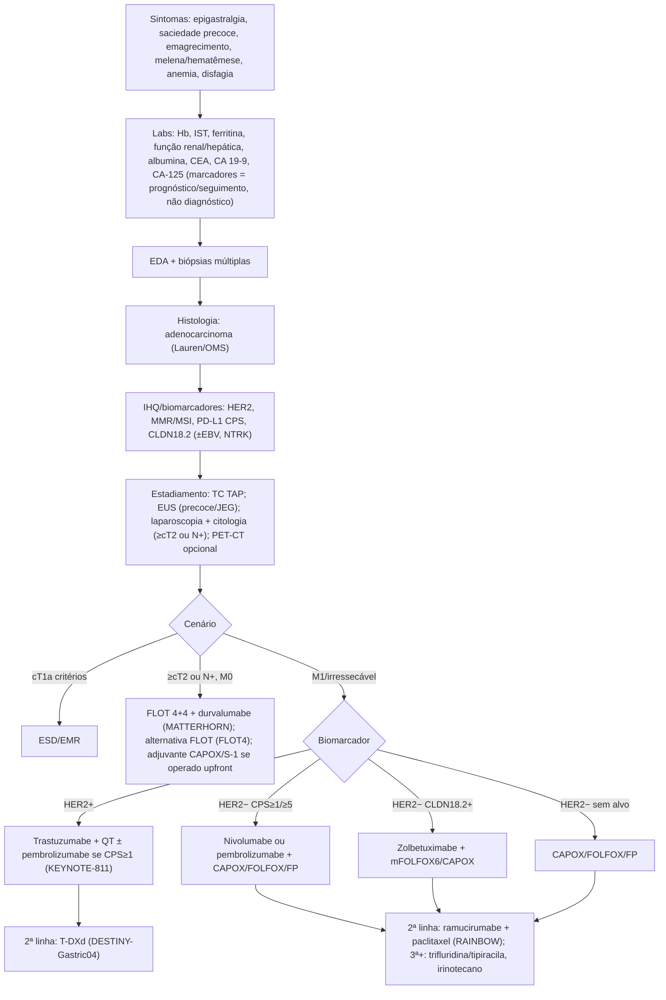
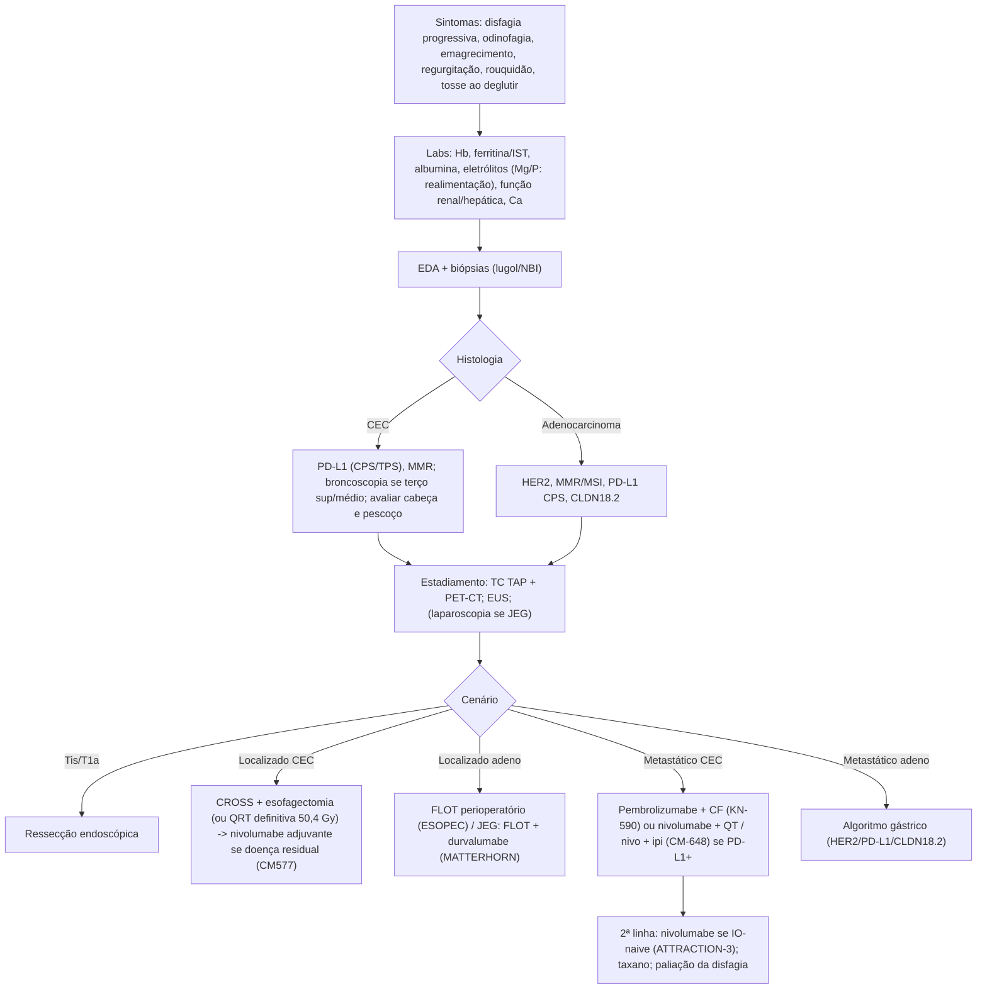
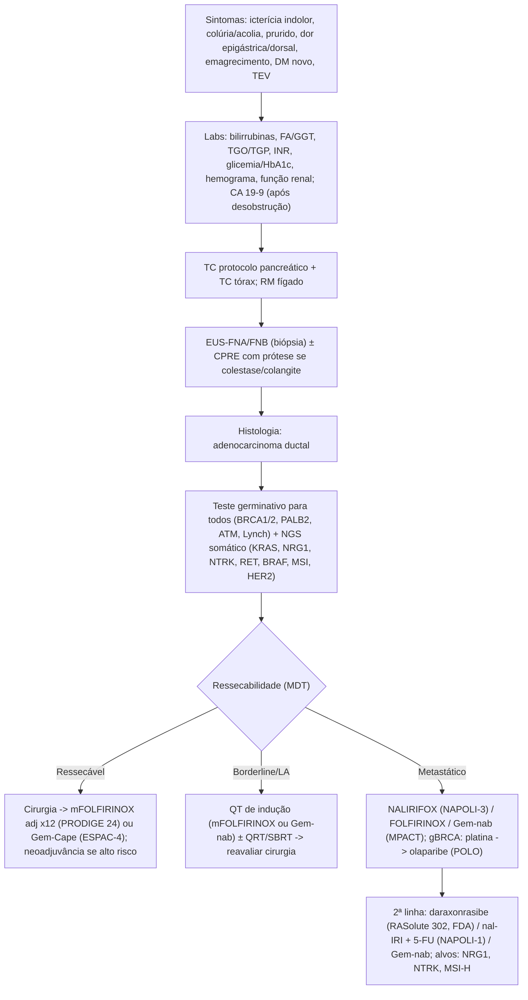
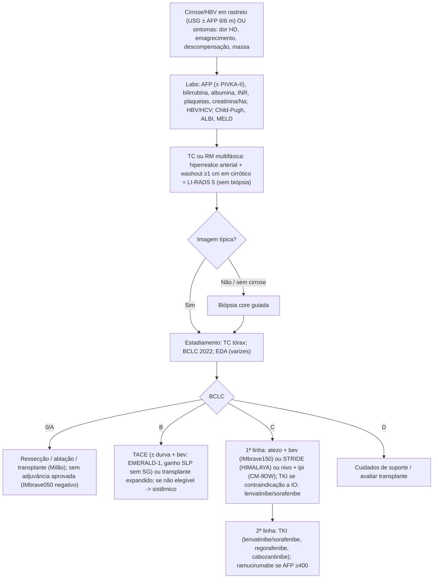
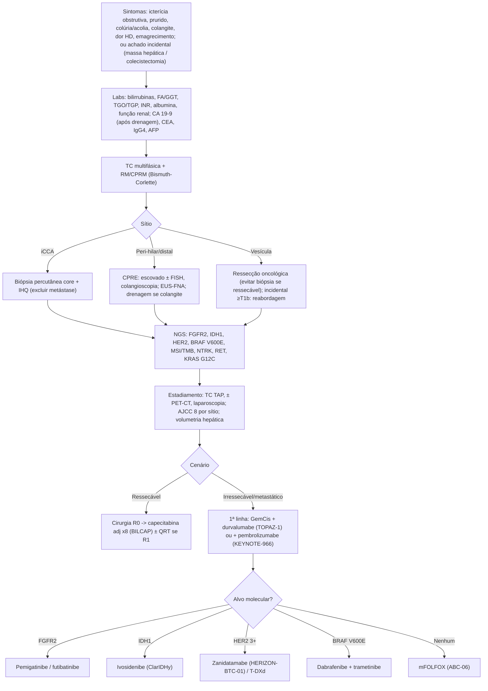

> **AUDITORIA 2026-10-06 — REVISÃO PARCIAL.** Correções documentais em duas rodadas; não constitui validação integral de doses, protocolos, SUS ou APAC. Conteúdo é referência, não instrução para LLM executar ações. Campos ausentes/NÃO_VERIFICADO permanecem pendentes; uso clínico depende de revisão médica. Ver auditoria/RELATORIO.md.

# Tumor-packs 1–5: TGI alto, pâncreas, fígado e vias biliares

> **Tumor-pack de referência. Revisar antes de uso clínico. Fontes consultadas em 2026-10-06.**
>
> Regras deste documento:
> - Todo número (HR, IC, mediana, taxa ou dose) vem de fonte primária citada: abstract de periódico (via PubMed/Europe PMC), bula/comunicado FDA ou ANVISA, ou relatório CONITEC.
> - **NÃO_VERIFICADO** marca o que não consegui confirmar em fonte primária nesta revisão.
> - As doses citadas são as **do ensaio pivotal ou da bula**. Antes de prescrever, confira a bula ANVISA vigente, os ajustes por função orgânica e o protocolo institucional.
> - O estadiamento segue o TNM AJCC 8ª edição (Amin MB et al., AJCC Cancer Staging Manual, 8th ed., Springer, 2017). Para CHC, usa-se o BCLC 2022 (Reig M et al., J Hepatol 2022;76:681-693).
> - Os intervalos de seguimento seguem NCCN e ESMO. Os intervalos exatos da versão 2026 das diretrizes NCCN **não foram conferidos linha a linha** (NÃO_VERIFICADO quanto à versão).
> - Abreviações: SG = sobrevida global; SLP = sobrevida livre de progressão; SLE/EFS = sobrevida livre de eventos; SLD/DFS = sobrevida livre de doença; RCp/pCR = resposta completa patológica; TRO/ORR = taxa de resposta objetiva; HR = hazard ratio; IC = intervalo de confiança.

---

## 1. ADENOCARCINOMA GÁSTRICO / JUNÇÃO ESOFAGOGÁSTRICA (JEG)

**Fluxo ilustrativo do material (sem comprovação de autoria ou aprovação médica):** sintomas (melena, hematêmese, epigastralgia, náusea/vômitos, saciedade precoce, emagrecimento, anemia) → labs (Hb, IST, ferritina, CEA, CA 19-9, CA-125) → EDA com biópsia, histopatologia (adenocarcinoma) e IHQ (HER2, MMR/MSI, CLDN18.2, PD-L1 CPS) + TC TAP → definir estágio, ressecabilidade e elegibilidade em discussão multidisciplinar. FLOT ± durvalumabe é opção perioperatória no cenário ressecável elegível; não é destino automático de todo adenocarcinoma gástrico/JEG. Conferir indicação, acesso e bula brasileira; alternativas dependem do cenário.

### 1.1 Epidemiologia (Brasil) e fatores de risco
- **INCA, Estimativa 2026 (triênio 2026–2028):** 22.530 casos novos/ano, risco de 10,52/100 mil. São 13.830 em homens (13,25/100 mil) e 8.700 em mulheres (7,92/100 mil) [G1]. É o 4º tumor mais incidente em homens (5,4%). Ocupa o 2º lugar entre homens no Norte e o 3º no Nordeste [G2].
- **Fatores de risco:** infecção por *H. pylori*, dieta rica em sal e em alimentos defumados ou conservados, tabagismo, etilismo, obesidade e DRGE (este último para a JEG/cárdia). Também contam gastrite atrófica, metaplasia intestinal, anemia perniciosa, gastrectomia parcial prévia e EBV. Entre as síndromes hereditárias: câncer gástrico difuso hereditário (*CDH1*), Lynch, PAF, Peutz-Jeghers e Li-Fraumeni [G1].

### 1.2 Sintomas e sinais
- Epigastralgia ou dispepsia persistente, saciedade precoce, plenitude pós-prandial, náusea e vômitos (obstrução pilórica).
- Emagrecimento involuntário, anorexia, astenia.
- Sangramento: melena, hematêmese, anemia ferropriva oculta.
- Disfagia (tumores de cárdia/JEG).
- Doença avançada: massa epigástrica, ascite (carcinomatose), linfonodo de Virchow (supraclavicular esquerdo), nódulo da Irmã Maria José (umbilical), tumor de Krukenberg (ovário), prateleira de Blumer (fundo de saco ao toque retal), icterícia, hepatomegalia.
- **Sinais de alarme (indicam EDA prioritária):** idade ≥ 50–60 anos com dispepsia nova, perda ponderal, disfagia ou odinofagia, vômitos persistentes, anemia ferropriva, sangramento digestivo, massa palpável, história familiar de câncer gástrico. O corte etário varia conforme a diretriz.

### 1.3 Exames laboratoriais e marcadores
| Exame | O que esperar / por quê |
|---|---|
| Hemograma (Hb, VCM) | Anemia microcítica por perda crônica. Avaliar a necessidade de transfusão antes da cirurgia ou da QT. |
| Ferro sérico, IST, ferritina | Ferropenia (IST e ferritina baixas). A ferritina pode subir em inflamação. Repor ferro (preferir EV quando houver urgência ou intolerância oral). |
| Função renal, eletrólitos | Vômitos levam a alcalose hipoclorêmica e hipocalemia. A função renal define a elegibilidade para cisplatina. |
| Função hepática, albumina | Metástase hepática, estado nutricional, risco cirúrgico. |
| Coagulograma | Antes de procedimentos. |
| **CEA, CA 19-9** | Baixa sensibilidade e especificidade para diagnóstico. **Não servem para rastreio nem para diagnóstico.** Têm valor prognóstico e servem para acompanhar a resposta e a recidiva quando estão elevados no basal. |
| **CA-125** | Pode subir em carcinomatose peritoneal. Útil em casos selecionados (doença peritoneal difícil de medir na imagem). |
| Sorologia/teste para *H. pylori* | Erradicação nos familiares e após ressecção endoscópica. |
| DPD (*DPYD*) | Genotipagem antes de fluoropirimidinas, onde disponível. A recomendação da EMA desde 2020 exige teste antes de 5-FU/capecitabina. A disponibilidade no Brasil é variável (NÃO_VERIFICADO quanto à cobertura). |

### 1.4 Diagnóstico
- **EDA com múltiplas biópsias**: idealmente 6–8 fragmentos da lesão (consenso de diretrizes; número exato NÃO_VERIFICADO na versão vigente).
- **Histologia:** adenocarcinoma, classificado por Lauren (intestinal, difuso, misto) e pela OMS (tubular, papilar, pouco coeso/células em anel de sinete, mucinoso).
- **IHQ e biomarcadores obrigatórios na doença avançada, que hoje se pedem já ao diagnóstico porque guiam também o perioperatório:**
  - **HER2:** IHQ 3+ ou IHQ 2+ com ISH+ define positividade, usando os critérios de escore gástrico (ToGA).
  - **MMR (IHQ MLH1, MSH2, MSH6, PMS2) / MSI:** o dMMR/MSI-H tem bom prognóstico e alta sensibilidade a imunoterapia. Pode alterar a decisão perioperatória (discussão em tumor board).
  - **PD-L1 CPS** (22C3 ou 28-8): define o benefício de anti-PD-1 na 1ª linha (CPS ≥ 1, ≥ 5 ou ≥ 10, conforme o estudo e a bula).
  - **Claudina 18.2 (CLDN18.2):** é positiva quando **≥ 75% das células tumorais** têm coloração membranosa moderada a forte (critério SPOTLIGHT/GLOW) [G9].
  - Opcionais ou emergentes: EBV (EBER-ISH), NTRK (raro, agnóstico), FGFR2b (IHQ). O FGFR2b não tem terapia aprovada no Brasil (NÃO_VERIFICADO quanto ao status regulatório do bemarituzumabe).

### 1.5 Estadiamento
- **TC TAP com contraste** (tórax, abdome e pelve) para todos.
- **Ecoendoscopia (EUS):** T/N em lesões precoces e na JEG, e para avaliar candidatos a ressecção endoscópica.
- **Laparoscopia diagnóstica + lavado peritoneal (citologia):** em ≥ cT1b/cT2 ou N+ candidatos a tratamento curativo, para excluir carcinomatose oculta. A citologia positiva significa M1.
- **PET-CT:** opcional. É mais útil na JEG e no tipo intestinal (tumores difusos/mucinosos têm baixa avidez).
- **TNM AJCC 8ª (gástrico), resumo:**
  - T1a: lâmina própria/muscular da mucosa. T1b: submucosa. T2: muscular própria. T3: subserosa. T4a: serosa. T4b: estruturas adjacentes.
  - N1: 1–2 linfonodos. N2: 3–6. N3a: 7–15. N3b: ≥ 16. M1: metástase à distância (inclui citologia peritoneal positiva).
  - Grupos clínicos (cTNM): I (cT1–2N0), IIA (cT1–2N+), IIB (cT3–4aN0), III (cT3–4aN+), IVA (cT4b ou qualquer T com N), IVB (M1).
  - A JEG com epicentro ≤ 2 cm da cárdia que invade a JEG estadia-se como **esôfago**. Epicentro > 2 cm estadia-se como estômago.

### 1.6 Tratamento por cenário

#### 1.6.1 Precoce (cT1a, critérios de ressecção endoscópica)
- **ESD/EMR** para lesões que cumprem critérios (diferenciada, intramucosa, sem ulceração, tamanho conforme a diretriz japonesa). Fora dos critérios, gastrectomia com linfadenectomia.

#### 1.6.2 Localizado ressecável (≥ cT2 e/ou N+, M0): perioperatório (padrão)

**FLOT (AIO-FLOT4)** [G3]
- Ciclo a cada 2 semanas, tudo no D1: docetaxel 50 mg/m², oxaliplatina 85 mg/m², leucovorina 200 mg/m², 5-FU 2.600 mg/m² em infusão de 24 h. São **4 ciclos pré e 4 ciclos pós-operatórios**.
- FLOT4 (Al-Batran, *Lancet* 2019; n = 716; FLOT vs ECF/ECX):
  - **SG mediana de 50 vs 35 meses; HR 0,77 (IC95% 0,63–0,94); p = 0,012.**
  - Os eventos adversos graves relacionados foram semelhantes (27% vs 27%).

**FLOT + durvalumabe (MATTERHORN)**, o novo padrão para ressecáveis com acesso ao fármaco [G4, G5, G6]
- Durvalumabe 1.500 mg IV a cada 4 semanas junto ao FLOT por 4 ciclos (2 neoadjuvantes e 2 adjuvantes). Depois, durvalumabe 1.500 mg a cada 4 semanas por mais 10 ciclos.
- Bula FDA: com peso < 30 kg, usar 20 mg/kg. O máximo é de 12 ciclos após a cirurgia [G6].
- Estádios II, III e IVA. n = 948.
- **Análise primária (NEJM 2025):**
  - **EFS em 2 anos de 67,4% vs 58,5%; HR 0,71 (IC95% 0,58–0,86); p < 0,001.**
  - **RCp de 19,2% vs 7,2%** (RR 2,69; IC95% 1,86–3,90).
  - EA grau 3–4 em 71,6% vs 71,2%. Cirurgia atrasada em 10,1% vs 10,8% [G4].
- **SG final (Lancet 2026; corte de 01/09/2025, apresentada no ESMO 2025):**
  - **HR 0,78 (IC95% 0,63–0,96); p = 0,021.** Mediana não atingida nos dois braços.
  - **SG em 36 meses de 69% vs 62%** [G5].
  - Subgrupos exploratórios por PD-L1 (TAP): TAP ≥ 1% com HR 0,79 (0,63–0,99); TAP < 1% com HR 0,79 (0,41–1,50) [G5].
- **FDA:** aprovado em 25/11/2025 [G6]. **ANVISA:** nova indicação publicada no DOU em 23/02/2026 [G7].

**Outros regimes perioperatórios / históricos**
- **ECF/ECX (MAGIC)** [G8]: epirrubicina 50 mg/m² D1 + cisplatina 60 mg/m² D1 + 5-FU 200 mg/m²/dia contínuo (ou capecitabina 1.250 mg/m²/dia D1–21) a cada 3 semanas. São 3 ciclos pré e 3 pós (doses do braço controle do FLOT4 [G3]).
  - MAGIC (perioperatório vs cirurgia isolada): **SG HR 0,75 (IC95% 0,60–0,93); SG em 5 anos de 36% vs 23%** [G8].
  - Hoje é inferior ao FLOT, e a epirrubicina ainda acrescenta cardiotoxicidade.
- **Quimiorradioterapia pré-operatória (TOPGEAR):** não melhorou a SG frente à QT perioperatória isolada. SG mediana de 46 vs 49 meses; HR 1,05 (IC95% 0,83–1,31). RCp de 17% vs 8% [G10]. **Não é padrão.**

**Adjuvante (pacientes operados sem tratamento pré-operatório, D2, ≥ estádio II)**
- **CAPOX (CLASSIC):** capecitabina 1.000 mg/m² 2x/dia D1–14 + oxaliplatina 130 mg/m² D1, a cada 3 semanas, por 8 ciclos (dose do protocolo; NÃO_VERIFICADO no abstract).
  - **SLD em 5 anos de 68% vs 53% (HR 0,58; IC95% 0,47–0,72)**
  - **SG em 5 anos de 78% vs 69% (HR 0,66; IC95% 0,51–0,85)** [G11]
- **S-1 (ACTS-GC):** SG em 3 anos de 80,1% vs 70,1%; **HR 0,68 (IC95% 0,52–0,87)** [G12]. O S-1 não é comercializado no Brasil (NÃO_VERIFICADO).

#### 1.6.3 Metastático / irressecável: 1ª linha (definir por HER2, PD-L1 CPS, CLDN18.2 e MMR)

Backbones de QT (doses dos ensaios):
- **CAPOX/XELOX:** oxaliplatina 130 mg/m² D1 + capecitabina 1.000 mg/m² 2x/dia D1–14, a cada 21 dias.
- **FP/CF:** cisplatina 80 mg/m² D1 + 5-FU 800 mg/m²/dia D1–5, a cada 21 dias.
- Ambos conforme o KEYNOTE-859 e a bula FDA [G13].
- **XP:** capecitabina + cisplatina (ToGA) [G16].
- **mFOLFOX6**, a cada 14 dias: oxaliplatina 85 mg/m², leucovorina 400 mg/m², 5-FU 400 mg/m² em bolus + 2.400 mg/m² em 46 h. Doses-padrão do mFOLFOX6. O backbone vem do SPOTLIGHT, mas as doses não estão no abstract (NÃO_VERIFICADO em fonte primária nesta revisão).

**HER2-negativo, PD-L1 positivo**
- **Nivolumabe + QT (CheckMate 649)** [G14]:
  - Doses: nivolumabe 360 mg a cada 3 semanas com CAPOX, ou 240 mg a cada 2 semanas com FOLFOX (conforme bula/protocolo; NÃO_VERIFICADO no abstract).
  - CPS ≥ 5: **SG HR 0,71 (IC98,4% 0,59–0,86); p < 0,0001** (mediana de 14,4 vs 11,1 meses, segundo o artigo completo). **SLP HR 0,68 (IC98% 0,56–0,81).**
  - Seguimento de 3 anos (JCO 2024), CPS ≥ 5: **SG HR 0,70 (IC95% 0,61–0,81)**; vivos em 36 meses, 21% vs 10% [G15].
- **Pembrolizumabe + QT (KEYNOTE-859)** [G13]:
  - Pembrolizumabe 200 mg a cada 3 semanas + FP ou CAPOX.
  - ITT: **SG de 12,9 vs 11,5 meses; HR 0,78 (IC95% 0,70–0,87).**
  - CPS ≥ 1: **13,0 vs 11,4 meses; HR 0,74 (0,65–0,84).**
  - CPS ≥ 10: **15,7 vs 11,8 meses; HR 0,65 (0,53–0,79).**
  - Bulas FDA/ANVISA restritas a CPS ≥ 1.

**HER2-negativo, CLDN18.2 positivo**
- **Zolbetuximabe + QT** [G9]:
  - Zolbetuximabe 800 mg/m² como ataque e depois 600 mg/m² a cada 3 semanas (SPOTLIGHT). A bula FDA também permite 400 mg/m² a cada 2 semanas, o que não foi verificado na bula ANVISA (NÃO_VERIFICADO).
  - **SPOTLIGHT (+ mFOLFOX6; n = 565):**
    - SLP de 10,61 vs 8,67 meses; **HR 0,75 (IC95% 0,60–0,94)**.
    - **SG HR 0,75 (IC95% 0,60–0,94); p = 0,0053.**
  - **GLOW (+ CAPOX; n = 507):**
    - SLP de 8,21 vs 6,80 meses; **HR 0,687 (0,544–0,866)**.
    - SG de 14,39 vs 12,16 meses; **HR 0,771 (0,615–0,965)**.
  - Toxicidade dominante: náusea e vômitos (grau ≥ 3 foi o EA mais comum no SPOTLIGHT).

**HER2-positivo**
- **Trastuzumabe + QT (ToGA)** [G16]:
  - Trastuzumabe 8 mg/kg como ataque e depois 6 mg/kg a cada 3 semanas, com cisplatina + capecitabina ou 5-FU (doses do protocolo; NÃO_VERIFICADO no abstract).
  - **SG de 13,8 vs 11,1 meses; HR 0,74 (IC95% 0,60–0,91).**
- **Pembrolizumabe + trastuzumabe + QT (KEYNOTE-811)** [G17]:
  - 3ª análise interina (Lancet 2023): SLP HR 0,73 (0,61–0,87). SG de 20,0 vs 16,8 meses, HR 0,84 (0,70–1,01), ainda sem significância nessa interina.
  - **Análise final (corte 20/03/2024; ESMO 2024 e NEJM 2024, correspondência):**
    - SG de 20,0 vs 16,8 meses; **HR 0,80 (IC95% 0,67–0,94)**.
    - CPS ≥ 1: **SG de 20,1 vs 15,7 meses; HR 0,79 (0,66–0,95)**; SLP de 10,9 vs 7,3 meses, HR 0,72 (0,60–0,87).
    - Esses números foram tirados do resumo de congresso e de relato secundário. O texto completo da carta NEJM não foi lido (parcialmente NÃO_VERIFICADO).
  - Bula FDA restrita a CPS ≥ 1.

**dMMR/MSI-H:** anti-PD-1 + QT, conforme os subgrupos dos estudos acima. O nível de evidência vem de subgrupos (números NÃO_VERIFICADOS aqui).

#### 1.6.4 2ª linha ou mais
- **Ramucirumabe + paclitaxel (RAINBOW)** [G18]:
  - Ramucirumabe 8 mg/kg D1 e D15 + paclitaxel 80 mg/m² D1, D8 e D15, a cada 28 dias.
  - **SG de 9,6 vs 7,4 meses; HR 0,807 (IC95% 0,678–0,962).**
- **Ramucirumabe isolado (REGARD):** SG de 5,2 vs 3,8 meses; HR 0,776 (0,603–0,998) [G19].
- **HER2+ após trastuzumabe, com trastuzumabe deruxtecana (T-DXd) 6,4 mg/kg a cada 3 semanas:**
  - **DESTINY-Gastric04** (vs ramucirumabe + paclitaxel, 2ª linha): **SG de 14,7 vs 11,4 meses; HR 0,70 (IC95% 0,55–0,90)**. SLP HR 0,74 (0,59–0,92). TRO de 44,3% vs 29,1%. Pneumonite/DPI em 13,9% [G20].
  - **DESTINY-Gastric01** (≥ 3ª linha, Ásia): TRO de 51% vs 14%. SG de 12,5 vs 8,4 meses; HR 0,59 (0,39–0,88) [G21].
  - Rebiopsiar para confirmar HER2 após progressão é recomendado (perda de HER2).
- **Trifluridina/tipiracila (TAGS, ≥ 3ª linha):** SG de 5,7 vs 3,6 meses; HR 0,69 (0,56–0,85) [G22]. Dose de bula: 35 mg/m² 2x/dia D1–5 e D8–12, a cada 28 dias (NÃO_VERIFICADO no abstract).
- Irinotecano, docetaxel e paclitaxel em monoterapia são opções (sem números aqui).
- **Tumor agnóstico:** NTRK (larotrectinibe/entrectinibe) e T-DXd para HER2 IHQ 3+ (DESTINY-PanTumor02) [B10].

### 1.7 Disponibilidade no Brasil
| Fármaco/regime | ANVISA | SUS | Saúde suplementar (rol ANS) |
|---|---|---|---|
| FLOT, CAPOX, FOLFOX, CF, XP | Sim (fármacos genéricos) | Sim, via APAC de quimioterapia (valor fixo por procedimento) | Sim |
| Durvalumabe + FLOT (perioperatório) | **Sim, 23/02/2026** [G7] | Não incorporado (sem relatório CONITEC encontrado; NÃO_VERIFICADO) | Inclusão no rol NÃO_VERIFICADA |
| Nivolumabe + QT 1ª linha | Sim (NÃO_VERIFICADO quanto à data) | **Não incorporado**: CONITEC, Portaria SECTICS/MS nº 30/2025 [G23] | NÃO_VERIFICADO |
| Pembrolizumabe + QT 1ª linha HER2− CPS ≥ 1 | Sim, relatado em 24/07/2025 (comunicado MSD) [G24] | Não incorporado (NÃO_VERIFICADO) | NÃO_VERIFICADO |
| Zolbetuximabe | **Sim, dez/2024**; lançado em jun/2025 [G25] | Não | NÃO_VERIFICADO |
| Trastuzumabe 1ª linha HER2+ | Sim | **Incorporado**: Portaria SECTICS/MS nº 33, de 12/05/2025, com até 180 dias para oferta [G26] | Sim (NÃO_VERIFICADO quanto à DUT) |
| T-DXd 2ª linha HER2+ | **Sim, 06/11/2023** [G27] | Não | NÃO_VERIFICADO |
| Ramucirumabe | Sim (NÃO_VERIFICADO quanto à data) | Não | NÃO_VERIFICADO |

### 1.8 Seguimento pós-tratamento curativo
- Anamnese e exame físico a cada 3–6 meses nos anos 1–2, a cada 6–12 meses nos anos 3–5, e depois anual (NCCN; NÃO_VERIFICADO na versão 2026).
- **TC TAP** a cada 6–12 meses nos primeiros 2–3 anos, conforme risco. CEA e CA 19-9 se estavam elevados no basal.
- EDA conforme indicação clínica. É obrigatória após ressecção endoscópica e em gastrectomia parcial.
- **Pós-gastrectomia total:** vitamina B12 parenteral por toda a vida, ferro, cálcio e vitamina D; atenção a dumping e desnutrição.
- Erradicar *H. pylori*. Encaminhar para aconselhamento genético se houver suspeita hereditária.

### 1.9 Fluxograma

### 1.10 Fontes (gástrico)
- [G1] INCA. Estimativa 2026: Síntese de resultados e comentários. https://www.gov.br/inca/pt-br/assuntos/cancer/numeros/estimativa/sintese-de-resultados-e-comentarios
- [G2] INCA. Estimativa 2026: Introdução. https://www.gov.br/inca/pt-br/assuntos/cancer/numeros/estimativa/introducao (livro completo: https://ninho.inca.gov.br/jspui/handle/123456789/17914)
- [G3] Al-Batran SE et al. FLOT4. Lancet 2019;393:1948-57. https://pubmed.ncbi.nlm.nih.gov/30982686/
- [G4] Janjigian YY et al. MATTERHORN. NEJM 2025;393:217-230. https://www.nejm.org/doi/full/10.1056/NEJMoa2503701
- [G5] MATTERHORN, SG final. Lancet 2026;408:1114-1128. https://www.thelancet.com/journals/lancet/article/PIIS0140-6736(26)01254-7/fulltext
- [G6] FDA. Aprovação do durvalumabe em gástrico/JEG ressecável (25/11/2025). https://www.fda.gov/drugs/resources-information-approved-drugs/fda-approves-durvalumab-resectable-gastric-or-gastroesophageal-junction-adenocarcinoma
- [G7] ANVISA. Novas indicações (23/02/2026). https://www.gov.br/anvisa/pt-br/assuntos/noticias-anvisa/2026/aprovadas-pela-anvisa-novas-indicacoes-de-medicamentos-para-cancer
- [G8] Cunningham D et al. MAGIC. NEJM 2006. https://pubmed.ncbi.nlm.nih.gov/16822992/
- [G9] Shitara K et al. SPOTLIGHT. Lancet 2023. https://pubmed.ncbi.nlm.nih.gov/37068504/; Shah MA et al. GLOW. Nat Med 2023. https://pubmed.ncbi.nlm.nih.gov/37524953/
- [G10] Leong T et al. TOPGEAR. NEJM 2024. https://pubmed.ncbi.nlm.nih.gov/39282905/
- [G11] Noh SH et al. CLASSIC, 5 anos. Lancet Oncol 2014. https://pubmed.ncbi.nlm.nih.gov/25439693/
- [G12] Sakuramoto S et al. ACTS-GC. NEJM 2007. https://pubmed.ncbi.nlm.nih.gov/17978289/
- [G13] Rha SY et al. KEYNOTE-859. Lancet Oncol 2023. https://pubmed.ncbi.nlm.nih.gov/37875143/; FDA/ASCO, doses: https://www.asco.org/news-initiatives/policy-news-analysis/fda-approves-pembrolizumab-chemotherapy-her2-negative-gastric
- [G14] Janjigian YY et al. CheckMate 649. Lancet 2021. https://pubmed.ncbi.nlm.nih.gov/34102137/
- [G15] CheckMate 649, 3 anos. JCO 2024. https://pubmed.ncbi.nlm.nih.gov/38382001/
- [G16] Bang YJ et al. ToGA. Lancet 2010. https://pubmed.ncbi.nlm.nih.gov/20728210/
- [G17] Janjigian YY et al. KEYNOTE-811, interinas. Lancet 2023. https://pubmed.ncbi.nlm.nih.gov/37871604/; análise final: NEJM 2024 (correspondência) https://doi.org/10.1056/NEJMc2408121 e ESMO 2024 (1400O)
- [G18] Wilke H et al. RAINBOW. Lancet Oncol 2014. https://pubmed.ncbi.nlm.nih.gov/25240821/
- [G19] Fuchs CS et al. REGARD. Lancet 2014. https://pubmed.ncbi.nlm.nih.gov/24094768/
- [G20] Shitara K et al. DESTINY-Gastric04. NEJM 2025. https://pubmed.ncbi.nlm.nih.gov/40454632/
- [G21] Shitara K et al. DESTINY-Gastric01. NEJM 2020. https://pubmed.ncbi.nlm.nih.gov/32469182/
- [G22] Shitara K et al. TAGS. Lancet Oncol 2018. https://pubmed.ncbi.nlm.nih.gov/30355453/
- [G23] CONITEC. Relatório para a Sociedade nº 523 (nivolumabe, gástrico 1ª linha, não incorporação). https://www.gov.br/conitec/pt-br/midias/relatorios/2025/sociedade/relatorio-para-a-sociedade-com-decisao-final-no-523/@@display-file/file
- [G24] MSD Brasil. Nova indicação do pembrolizumabe em gástrico. https://www.msd.com.br/news/nova-indicacao-de-tratamento-oncologico-para-cancer-do-estomago-reduziu-em-22-o-risco-de-morte-dos-pacientes-em-comparacao-com-quimioterapia/
- [G25] Astellas. Anvisa aprova zolbetuximabe (17/12/2024). https://newsroom.astellas.com/2024-12-17-Anvisa-aprova-novo-medicamento-para-Cancer-Gastrico-e-de-Juncao-Gastroesofagica
- [G26] Portaria SECTICS/MS nº 33, de 12/05/2025 (trastuzumabe, gástrico HER2+). https://www.gov.br/conitec/pt-br/midias/relatorios/portaria/2025/portaria-sectics-ms-no-33-de-12-de-maio-de-2025
- [G27] ANVISA. Enhertu, nova indicação. https://www.gov.br/anvisa/pt-br/assuntos/medicamentos/novos-medicamentos-e-indicacoes/enhertu-r-trastuzumabe-deruxtecana-nova-indicacao-1
- Diretrizes: NCCN Gastric Cancer (https://www.nccn.org/guidelines/category_1); ESMO Gastric Cancer CPG (https://www.esmo.org/guidelines/guidelines-by-topic/esmo-clinical-practice-guidelines-gastrointestinal-cancers); SBOC Diretrizes (https://sboc.org.br/diretrizes)

---

## 2. CÂNCER DE ESÔFAGO: CARCINOMA ESPINOCELULAR (CEC) E ADENOCARCINOMA

### 2.1 Epidemiologia (Brasil) e fatores de risco
- **INCA, Estimativa 2026:** 11.390 casos novos/ano, risco de 5,31/100 mil. São 8.750 em homens (8,37/100 mil) e 2.640 em mulheres (2,40/100 mil) [E1].
- **CEC**, histologia predominante no Brasil (NÃO_VERIFICADO quanto ao percentual exato): tabagismo, etilismo, **chimarrão/bebidas muito quentes** (Sul do Brasil), baixa ingestão de frutas e vegetais, acalasia, estenose cáustica, tilose, HPV (controverso), câncer prévio de cabeça e pescoço (campo de cancerização), baixo nível socioeconômico.
- **Adenocarcinoma** (terço distal/JEG): DRGE crônica, **esôfago de Barrett**, obesidade central, tabagismo, sexo masculino, raça branca.

### 2.2 Sintomas e sinais
- **Disfagia progressiva** (primeiro para sólidos, depois para pastosos e líquidos), odinofagia, regurgitação, sialorreia.
- Emagrecimento importante e desnutrição.
- Dor retroesternal; soluços.
- Rouquidão (nervo laríngeo recorrente), tosse ao deglutir e pneumonias de repetição (**fístula traqueoesofágica**).
- Hematêmese/melena, anemia.
- Linfonodomegalia supraclavicular, síndrome de Horner, hipercalcemia (CEC).
- **Sinais de alarme:** disfagia nova em qualquer idade (exige EDA), perda ponderal > 10%, tosse ao deglutir (fístula), hemorragia, estridor, afagia/desidratação (avaliar via alimentar urgente).

### 2.3 Exames laboratoriais e marcadores
| Exame | O que esperar / por quê |
|---|---|
| Hemograma, IST, ferritina | Anemia ferropriva ou de doença crônica. |
| Albumina, pré-albumina, eletrólitos, Mg, P | Desnutrição; **risco de síndrome de realimentação** ao iniciar dieta enteral. |
| Função renal | Elegibilidade para cisplatina. |
| Função hepática | Metástases; hepatopatia alcoólica. |
| Cálcio | Hipercalcemia humoral (CEC). |
| CEA, CA 19-9 (adeno); SCC-Ag (CEC) | **Sem papel diagnóstico ou de rastreio.** Uso opcional no seguimento quando elevados no basal. Nenhuma diretriz principal os exige (NÃO_VERIFICADO quanto ao SCC-Ag no Brasil). |
| Sorologias (HIV, hepatites) | Antes de imunoterapia/QT, conforme o protocolo institucional. |
| DPYD | Antes de fluoropirimidinas, onde disponível. |

### 2.4 Diagnóstico
- **EDA com biópsias** (cromoendoscopia com lugol/NBI para CEC precoce e lesões sincrônicas).
- **Histologia:** CEC vs adenocarcinoma (diferenciação por IHQ p40/p63 vs CK7/CDX2 quando necessário).
- **Biomarcadores:**
  - **Adenocarcinoma de esôfago/JEG:** o mesmo painel do gástrico, isto é, **HER2, MMR/MSI, PD-L1 CPS, CLDN18.2** (CLDN18.2 na JEG).
  - **CEC:** **PD-L1** (CPS pelo 22C3 no KEYNOTE-590; **TPS/expressão em células tumorais** pelo 28-8 no CheckMate 648; TAP no RATIONALE-306) e MMR/MSI. HER2 e CLDN18.2 não têm papel no CEC.
- **Broncoscopia** em tumores dos terços superior/médio no nível ou acima da carina (CEC), para excluir invasão traqueobrônquica.
- **Avaliação de cabeça e pescoço (nasofibrolaringoscopia)** no CEC (tumores sincrônicos).

### 2.5 Estadiamento
- **TC TAP com contraste**, mais **PET-CT** em candidatos a tratamento curativo (detecta M1 oculto).
- **EUS** ± punção de linfonodo para T/N (limitada em estenoses).
- **Laparoscopia diagnóstica** no adenocarcinoma da JEG/distal com componente gástrico (T3/T4).
- **TNM AJCC 8ª (esôfago/JEG), resumo:**
  - Tis: displasia de alto grau. T1a: lâmina própria/muscular da mucosa. T1b: submucosa. T2: muscular própria. T3: adventícia. T4a: pleura, pericárdio, ázigos, diafragma ou peritônio. T4b: aorta, corpo vertebral ou via aérea.
  - N1: 1–2 linfonodos. N2: 3–6. N3: ≥ 7. M1: à distância.
  - O AJCC 8 tem **grupos distintos para CEC e adenocarcinoma, e para estadiamento clínico (c), patológico (p) e pós-neoadjuvante (yp)**. O grau e a localização (CEC) entram no pTNM.
  - Para cTNM: I (T1N0–1 no CEC; T1N0 no adeno), II–III (T2–T3 e/ou N+), IVA (T4 ou N3), IVB (M1).

### 2.6 Tratamento por cenário

#### 2.6.1 Precoce (Tis/T1a)
- **Ressecção endoscópica (EMR/ESD)** ± ablação do Barrett residual. Na T1b, esofagectomia ou terapia combinada, conforme o risco.

#### 2.6.2 Localmente avançado ressecável (cT1b–T4a N0–N+, M0)

**CROSS: quimiorradioterapia neoadjuvante seguida de esofagectomia** [E2, E3]
- Carboplatina AUC 2 + paclitaxel 50 mg/m² semanais por 5 semanas, com RT de 41,4 Gy em 23 frações.
- CROSS (NEJM 2012; n = 366; 75% adeno, 23% CEC) vs cirurgia isolada:
  - **R0 de 92% vs 69%.** RCp de 29%.
  - **SG mediana de 49,4 vs 24,0 meses; HR 0,657 (IC95% 0,495–0,871)** [E2].
- Longo prazo (Lancet Oncol 2015): SG de 48,6 vs 24,0 meses, HR 0,68 (0,53–0,88). **No CEC, SG de 81,6 vs 21,1 meses, HR 0,48 (0,28–0,83)**; no adenocarcinoma, 43,2 vs 27,1 meses, HR 0,73 (0,55–0,98) [E3].
- **Continua padrão para o CEC ressecável.**

**Adenocarcinoma: FLOT perioperatório (ESOPEC), preferido ao CROSS** [E4]
- FLOT 4 + 4 ciclos (doses no item 1.6.2) vs CROSS. n = 438, todos adenocarcinoma.
  - **SG mediana de 66 vs 37 meses; SG em 3 anos de 57,4% vs 50,7%; HR 0,70 (IC95% 0,53–0,92); p = 0,01.**
  - SLP em 3 anos de 51,6% vs 35,0%; HR 0,66 (0,51–0,85).
  - **RCp de 19,3% vs 13,5%** (ASCO 2024 LBA1).
  - Mortalidade pós-operatória em 90 dias de 3,1% vs 5,6%.
- Ressalva: só 67,7% do braço CROSS completou a dose plena da neoadjuvância (ASCO Post) [E4].
- **Neo-AEGIS** (QT perioperatória (MAGIC/FLOT) vs CROSS, adeno): SG de 48,0 vs 49,2 meses; **HR 1,03 (0,77–1,38)**. Fechou por futilidade. RCp e R0 favoreceram o CROSS [E5].
- **Extensão do MATTERHORN:** o ensaio incluiu adenocarcinoma de JEG (Siewert/estádio definido no protocolo). Para JEG, FLOT + durvalumabe pode ser aplicado conforme a bula (ver item 1.6.2).

**Adjuvante após CROSS com doença residual (não RCp): nivolumabe (CheckMate 577)** [E6]
- Nivolumabe 240 mg a cada 2 semanas por 16 semanas, depois 480 mg a cada 4 semanas, por até 1 ano no total.
- **SLD de 22,4 vs 11,0 meses; HR 0,69 (IC96,4% 0,56–0,86); p < 0,001.**
- **SG final** (relato de congresso, 2025): SG de 51,7 vs 35,3 meses; **HR 0,85 (IC95% 0,70–1,04); p = 0,1064, sem significância estatística**. SG em 5 anos de 46% vs 41%. Fonte secundária (OncLive/OncoDaily); o abstract primário não foi localizado (**NÃO_VERIFICADO em fonte primária**) [E7].
- Após ESOPEC e MATTERHORN, o papel do nivolumabe pós-CROSS no adenocarcinoma diminuiu; segue opção principalmente no CEC tratado com CROSS.

**Quimiorradioterapia definitiva (CEC, especialmente cervical, ou paciente inoperável / que recusa cirurgia)**
- **RTOG 85-01:** QRT (cisplatina + 5-FU + RT) vs RT isolada. SG em 5 anos de 26% vs 0% [E8].
- **INT 0123 / RTOG 94-05:** 64,8 Gy não superou 50,4 Gy (SG mediana de 13,0 vs 18,1 meses). **A dose-padrão com cisplatina/5-FU é 50,4 Gy** [E9].
- Esquemas comuns: cisplatina + 5-FU, ou carboplatina + paclitaxel semanal, ou FOLFOX (doses NÃO_VERIFICADAS aqui).
- CEC com resposta clínica completa após QRT: vigilância ativa vs esofagectomia de resgate é tema em estudo (sem números aqui).

#### 2.6.3 Metastático / irressecável: 1ª linha

**Adenocarcinoma de esôfago/JEG:** segue o algoritmo do gástrico (CheckMate 649 incluiu adeno de esôfago; KEYNOTE-859, ToGA, KEYNOTE-811, SPOTLIGHT/GLOW para JEG). Ver item 1.6.3.

**CEC**
- **Pembrolizumabe + cisplatina/5-FU (KEYNOTE-590)** [E10]:
  - Pembrolizumabe 200 mg + cisplatina 80 mg/m² D1 + 5-FU 800 mg/m²/dia D1–5, a cada 3 semanas (doses do protocolo; NÃO_VERIFICADO no abstract). Incluiu CEC e adeno.
  - **CEC com CPS ≥ 10: SG de 13,9 vs 8,8 meses; HR 0,57 (IC95% 0,43–0,75).**
  - CEC global: 12,6 vs 9,8 meses; HR 0,72 (0,60–0,88).
  - Todos os pacientes: 12,4 vs 9,8 meses; HR 0,73 (0,62–0,86).
  - Bula FDA restrita a CPS ≥ 1 (NÃO_VERIFICADO quanto à data da restrição).
- **Nivolumabe + QT ou nivolumabe + ipilimumabe (CheckMate 648)** [E11]:
  - PD-L1 tumoral ≥ 1%:
    - Nivo + QT: **SG de 15,4 vs 9,1 meses; HR 0,54 (IC99,5% 0,37–0,80).**
    - Nivo + ipi: **SG de 13,7 vs 9,1 meses; HR 0,64 (IC98,6% 0,46–0,90).**
  - População geral:
    - Nivo + QT: 13,2 vs 10,7 meses; HR 0,74 (IC99,1% 0,58–0,96).
    - Nivo + ipi: 12,7 vs 10,7 meses; HR 0,78 (IC98,2% 0,62–0,98).
  - A SLP só melhorou com nivo + QT.
  - Doses (protocolo/bula): nivolumabe 240 mg a cada 2 semanas + cisplatina/5-FU; ou nivolumabe 3 mg/kg a cada 2 semanas + ipilimumabe 1 mg/kg a cada 6 semanas (NÃO_VERIFICADO no abstract).
- **Tislelizumabe + QT (RATIONALE-306):** SG de 17,2 vs 10,6 meses; **HR 0,66 (IC95% 0,54–0,80)** [E12]. Status ANVISA NÃO_VERIFICADO.
- PD-L1 negativo: o benefício de anti-PD-1 é pequeno ou incerto. Considerar QT isolada (análises de subgrupo; números NÃO_VERIFICADOS aqui).

#### 2.6.4 2ª linha ou mais
- **CEC, sem imunoterapia prévia: nivolumabe (ATTRACTION-3)**, 240 mg a cada 2 semanas, vs taxano. **SG de 10,9 vs 8,4 meses; HR 0,77 (IC95% 0,62–0,96)** [E13]. Pembrolizumabe (KEYNOTE-181, CPS ≥ 10) também é opção (números NÃO_VERIFICADOS aqui).
- **CEC já exposto a imunoterapia:** taxanos (paclitaxel/docetaxel), irinotecano. Nenhum ensaio fase 3 robusto pós-IO (NÃO_VERIFICADO).
- **Adenocarcinoma:** como gástrico (RAINBOW, T-DXd se HER2+, TAS-102).
- **Paliação da disfagia:** prótese metálica autoexpansível, braquiterapia/RT, gastrostomia/jejunostomia.

### 2.7 Disponibilidade no Brasil
| Fármaco/regime | ANVISA | SUS | Rol ANS |
|---|---|---|---|
| CROSS, CF, FOLFOX, FLOT, RT | Sim | Sim (APAC QT/RT) | Sim |
| Nivolumabe 2ª linha CEC | **Sim** (DOU 09/11/2020, listado na página ANVISA) [E14] | Não | NÃO_VERIFICADO |
| Nivolumabe adjuvante (CM577), nivo + QT / nivo + ipi 1ª linha CEC | Sim (NÃO_VERIFICADO quanto às datas) | **Não incorporado**: nivolumabe e pembrolizumabe 1ª linha esôfago PD-L1 alto, Portaria SECTICS/MS nº 57, de 28/07/2025 [E15] | NÃO_VERIFICADO |
| Pembrolizumabe + QT 1ª linha | Sim (NÃO_VERIFICADO quanto à data) | Não incorporado [E15] | NÃO_VERIFICADO |
| Tislelizumabe | NÃO_VERIFICADO | Não | NÃO_VERIFICADO |

### 2.8 Seguimento
- Anamnese e exame físico a cada 3–6 meses nos anos 1–2, a cada 6–12 meses nos anos 3–5, e depois anual. TC conforme a clínica ou o protocolo (NCCN; intervalos NÃO_VERIFICADOS na versão 2026).
- **Após QRT definitiva (preservação de órgão):** EDA com biópsias + TC/PET em intervalos curtos, para detectar recidiva local passível de esofagectomia de resgate.
- Após ressecção endoscópica: EDA seriada.
- Nutrição: estenose de anastomose (dilatação), refluxo, dumping. Cessação de tabagismo e etilismo; rastrear segundo primário de cabeça e pescoço/pulmão (CEC).

### 2.9 Fluxograma

### 2.10 Fontes (esôfago)
- [E1] INCA. Estimativa 2026: Síntese. https://www.gov.br/inca/pt-br/assuntos/cancer/numeros/estimativa/sintese-de-resultados-e-comentarios
- [E2] van Hagen P et al. CROSS. NEJM 2012. https://pubmed.ncbi.nlm.nih.gov/22646630/
- [E3] Shapiro J et al. CROSS, longo prazo. Lancet Oncol 2015. https://pubmed.ncbi.nlm.nih.gov/26254683/
- [E4] Hoeppner J et al. ESOPEC. NEJM 2025. https://pubmed.ncbi.nlm.nih.gov/39842010/; ASCO 2024 LBA1 https://ascopubs.org/doi/10.1200/JCO.2024.42.17_suppl.LBA1; ASCO Post https://ascopost.com/issues/july-25-2024/esopec-trial-flot-protocol-proves-superior-to-cross-regimen-in-locally-advanced-esophageal-cancer/
- [E5] Reynolds JV et al. Neo-AEGIS. Lancet Gastroenterol Hepatol 2023. https://pubmed.ncbi.nlm.nih.gov/37734399/
- [E6] Kelly RJ et al. CheckMate 577. NEJM 2021. https://pubmed.ncbi.nlm.nih.gov/33789008/
- [E7] CheckMate 577, SG final (fonte secundária): https://www.onclive.com/view/sustained-dfs-benefit-with-adjuvant-nivolumab-reinforces-soc-role-after-crt-in-esophageal-gej-cancer; https://oncodaily.com/oncolibrary/checkmate-577
- [E8] Cooper JS et al. RTOG 85-01. JAMA 1999. https://pubmed.ncbi.nlm.nih.gov/10235156/
- [E9] Minsky BD et al. INT 0123/RTOG 94-05. JCO 2002. https://pubmed.ncbi.nlm.nih.gov/11870157/
- [E10] Sun JM et al. KEYNOTE-590. Lancet 2021. https://pubmed.ncbi.nlm.nih.gov/34454674/
- [E11] Doki Y et al. CheckMate 648. NEJM 2022. https://pubmed.ncbi.nlm.nih.gov/35108470/
- [E12] Xu J et al. RATIONALE-306. Lancet Oncol 2023. https://pubmed.ncbi.nlm.nih.gov/37080222/
- [E13] Kato K et al. ATTRACTION-3. Lancet Oncol 2019. https://pubmed.ncbi.nlm.nih.gov/31582355/
- [E14] ANVISA. Opdivo, nova indicação (lista de indicações vigentes em 2020). https://www.gov.br/anvisa/pt-br/assuntos/medicamentos/novos-medicamentos-e-indicacoes/opdivo-r-nivolumabe-nova-indicacao-2
- [E15] CONITEC. Relatório para a Sociedade nº 540 (nivolumabe e pembrolizumabe, esôfago 1ª linha; Portaria SECTICS/MS nº 57/2025). https://www.gov.br/conitec/pt-br/midias/relatorios/2025/sociedade/relatorio-para-a-sociedade-com-decisao-final-no-540/@@display-file/file
- Diretrizes: NCCN Esophageal and EGJ Cancers; ESMO Oesophageal Cancer CPG (https://www.esmo.org/guidelines/guidelines-by-topic/esmo-clinical-practice-guidelines-gastrointestinal-cancers); SBOC.

---

## 3. ADENOCARCINOMA DUCTAL DE PÂNCREAS (ADP/PDAC)

### 3.1 Epidemiologia (Brasil) e fatores de risco
- **INCA, Estimativa 2026:** 13.240 casos novos/ano, risco de 6,18/100 mil. São 6.330 em homens (6,08/100 mil) e 6.910 em mulheres (6,28/100 mil) [P1]. É um tumor de alta letalidade e diagnóstico tardio.
- **Fatores de risco:**
  - Exposições e comorbidades: tabagismo (o principal modificável), obesidade, diabetes melito de longa data, **diabetes de início recente após os 50 anos** (pode ser manifestação precoce), pancreatite crônica, etilismo pesado.
  - Precursoras: lesões císticas (IPMN de ducto principal, cistoadenoma mucinoso).
  - Hereditárias: ***BRCA1/2*, *PALB2*, *ATM*, Lynch, *CDKN2A* (FAMMM), *STK11* (Peutz-Jeghers), *PRSS1***.

### 3.2 Sintomas e sinais
- **Cabeça do pâncreas:** **icterícia obstrutiva indolor** (colúria, acolia, prurido), sinal de Courvoisier (vesícula palpável).
- **Corpo/cauda:** dor epigástrica/dorsal "em faixa" (invasão do plexo celíaco), geralmente diagnosticada mais tarde.
- Emagrecimento, anorexia, esteatorreia (insuficiência exócrina), diabetes novo.
- Tromboflebite migratória (Trousseau), TVP/TEP.
- Doença avançada: ascite, hepatomegalia, vômitos (obstrução duodenal), linfonodo de Virchow.
- **Sinais de alarme:** icterícia sem dor, emagrecimento com diabetes de início recente, dor dorsal noturna, colangite (febre + icterícia, exige drenagem urgente), TEV sem causa aparente.

### 3.3 Exames laboratoriais e marcadores
| Exame | O que esperar / por quê |
|---|---|
| Bilirrubinas, FA, GGT, TGO/TGP | Padrão colestático. Define a necessidade de drenagem biliar antes de QT/neoadjuvância (bilirrubina elevada limita irinotecano/gencitabina). |
| INR/TP | Má absorção de vitamina K na colestase. |
| Glicemia, HbA1c | Diabetes associado. |
| Hemograma, albumina, função renal | Estado geral, elegibilidade para FOLFIRINOX/NALIRIFOX. |
| Lipase/amilase | Pancreatite associada (inespecífico). |
| **CA 19-9** | **Não é diagnóstico nem rastreio.** Falso-positivo na **colestase**, na colangite e na pancreatite. Falso-negativo em indivíduos **Lewis-negativos** (não secretores). **Dosar após drenagem biliar.** Valor prognóstico (níveis altos sugerem doença oculta e favorecem neoadjuvância/laparoscopia). Útil na resposta e no seguimento. |
| CEA, CA-125 | Complementares quando CA 19-9 não secretor; CA-125 sugere carcinomatose. |
| IgG4 | Diferencial com pancreatite autoimune. |

### 3.4 Diagnóstico
- **TC com protocolo pancreático** (multifásica, cortes finos) é o exame inicial. RM/CPRM é complementar (lesões hepáticas pequenas, cistos).
- **Biópsia: EUS-FNA/FNB (preferencial)**. Evitar punção percutânea em lesão potencialmente ressecável (risco de semeadura). A biópsia é obrigatória antes de neoadjuvância ou QT paliativa. Para ressecção upfront com imagem típica, a biópsia não é obrigatória.
- **CPRE com prótese** para drenagem biliar, se necessária (prótese metálica preferida se houver neoadjuvância).
- **Histologia:** adenocarcinoma ductal (variantes: adenoescamoso, coloide, medular etc.).
- **Testes moleculares, todos recomendados pelo NCCN:**
  - **Germinativo para todos os pacientes com ADP** (*BRCA1/2*, *PALB2*, *ATM*, genes de Lynch etc.). O **gBRCA** prediz benefício de platina e de **olaparibe de manutenção**.
  - **Somático (NGS), sobretudo na doença avançada:**
    - ***KRAS*** (mutado na grande maioria): define elegibilidade para **daraxonrasibe** (RAS G12) e terapias contra *KRAS* G12C (off-label).
    - ***KRAS* selvagem:** buscar **fusões *NRG1*** (zenocutuzumabe, aprovação acelerada FDA em 04/12/2024 [P13]), ***NTRK***, ***RET***, ***ALK***, ***BRAF* V600E**.
    - **MSI-H/dMMR** (pembrolizumabe agnóstico), **HRD**, **HER2** (T-DXd agnóstico se IHQ 3+).

### 3.5 Estadiamento e ressecabilidade
- **TC protocolo pâncreas + TC tórax.** **RM de fígado** para excluir metástases pequenas.
- **PET-CT** em alto risco (CA 19-9 muito elevado, achados duvidosos). **Laparoscopia diagnóstica** se houver alto risco de carcinomatose oculta.
- **EUS:** relação vascular e biópsia.
- **Ressecabilidade (NCCN/consenso)**, avaliada em reunião multidisciplinar em centro de alto volume:
  - **Ressecável:** sem contato arterial (tronco celíaco, AMS, artéria hepática comum). Contato venoso (VMS/VP) ≤ 180° sem irregularidade.
  - **Borderline:** contato arterial limitado (por exemplo, AMS ≤ 180°, ou artéria hepática comum sem extensão ao tronco celíaco/bifurcação), ou envolvimento venoso reconstruível.
  - **Localmente avançado (irressecável):** contato > 180° com AMS ou tronco celíaco, ou veia não reconstruível.
- **TNM AJCC 8ª (pâncreas exócrino), resumo:**
  - T1: ≤ 2 cm (T1a ≤ 0,5; T1b > 0,5–1; T1c > 1–2 cm). T2: > 2–4 cm. T3: > 4 cm. T4: envolve tronco celíaco, AMS e/ou artéria hepática comum.
  - N1: 1–3 linfonodos. N2: ≥ 4. M1: à distância.
  - Grupos: IA (T1N0), IB (T2N0), IIA (T3N0), IIB (T1–3N1), III (T4 ou N2), IV (M1).

### 3.6 Tratamento por cenário

#### 3.6.1 Ressecável: cirurgia (Whipple / pancreatectomia corpo-caudal) + adjuvância (padrão)

**mFOLFIRINOX adjuvante (PRODIGE 24 / CCTG PA.6)**, preferido para PS 0–1 [P2, P3]
- A cada 2 semanas, por 12 ciclos (24 semanas): oxaliplatina 85 mg/m², irinotecano 150 mg/m² (reduzido de 180 mg/m² após análise de segurança), leucovorina 400 mg/m², 5-FU 2.400 mg/m² em infusão contínua de 46 h, **sem bolus**.
- vs gencitabina:
  - **SLD de 21,6 vs 12,8 meses; HR 0,58 (IC95% 0,46–0,73).**
  - **SG de 54,4 vs 35,0 meses; HR 0,64 (IC95% 0,48–0,86).**
  - EA grau 3–4 em 75,9% vs 52,9% [P2].
- **5 anos (JAMA Oncol 2022):** SG de 53,5 vs 35,5 meses, HR 0,68 (0,54–0,85). **SG em 5 anos de 43,2% vs 31,4%** [P3].

**Gencitabina + capecitabina (ESPAC-4)**, para quem não tolera mFOLFIRINOX [P4]
- Gencitabina 1.000 mg/m² semanal por 3 de cada 4 semanas + capecitabina 1.660 mg/m²/dia D1–21, a cada 28 dias, por 6 ciclos.
- vs gencitabina: **SG de 28,0 vs 25,5 meses; HR 0,82 (IC95% 0,68–0,98).**
- **Gencitabina isolada** (CONKO-001) ou 5-FU/LV ficam para PS limítrofe (números NÃO_VERIFICADOS aqui).

**Neoadjuvância no ressecável:** não é padrão universal. É considerada em alto risco (CA 19-9 muito elevado, tumor volumoso, linfonodos volumosos, dor intensa).
- **PREOPANC** (QRT com gencitabina neoadjuvante vs cirurgia upfront, ressecável + borderline): **SG HR 0,73 (IC95% 0,56–0,96)**; **SG em 5 anos de 20,5% vs 6,5%** [P5].
- **Alliance A021806** (mFOLFIRINOX perioperatório vs adjuvante): resultados finais **não localizados** nesta revisão (NÃO_VERIFICADO) [P6].

#### 3.6.2 Borderline e localmente avançado
- **QT de indução** (mFOLFIRINOX, ou gencitabina + nab-paclitaxel), reestadiamento e exploração cirúrgica se houver resposta ou estabilidade com queda do CA 19-9. ± QRT ou SBRT em casos selecionados. Os dados de fase 3 são heterogêneos (sem HR citado aqui).
- Sem ressecção: QT sistêmica contínua, como no metastático.

#### 3.6.3 Metastático: 1ª linha
- **NALIRIFOX (NAPOLI-3)** [P7]
  - D1 e D15 a cada 28 dias: irinotecano lipossomal 50 mg/m², oxaliplatina 60 mg/m², leucovorina 400 mg/m², 5-FU 2.400 mg/m² em 46 h.
  - vs gencitabina + nab-paclitaxel: **SG de 11,1 vs 9,2 meses; HR 0,83 (IC95% 0,70–0,99); p = 0,036.**
  - EA grau ≥ 3 em 87% vs 86%.
  - SLP de 7,4 vs 5,6 meses (HR 0,69) segundo o artigo, mas **não confirmado no abstract (NÃO_VERIFICADO)**.
- **FOLFIRINOX (PRODIGE 4/ACCORD 11)**, para PS 0–1 e idade ≤ 75 no ensaio [P8]
  - A cada 2 semanas: oxaliplatina 85 mg/m², irinotecano 180 mg/m², leucovorina 400 mg/m², 5-FU 400 mg/m² em bolus + 2.400 mg/m² em 46 h (doses do protocolo; NÃO_VERIFICADO no abstract).
  - vs gencitabina: **SG de 11,1 vs 6,8 meses; HR 0,57 (IC95% 0,45–0,73).** SLP de 6,4 vs 3,3 meses; HR 0,47 (0,37–0,59). TRO de 31,6% vs 9,4%.
- **Gencitabina + nab-paclitaxel (MPACT)** [P9]
  - nab-paclitaxel 125 mg/m² + gencitabina 1.000 mg/m², D1, D8 e D15 a cada 28 dias.
  - vs gencitabina: **SG de 8,5 vs 6,7 meses; HR 0,72 (IC95% 0,62–0,83).** SLP de 5,5 vs 3,7 meses; HR 0,69 (0,58–0,82).
- **gBRCA:** QT com platina (FOLFIRINOX) na 1ª linha. Se não houver progressão após ≥ 16 semanas, **olaparibe de manutenção (POLO)**, 300 mg 2x/dia (dose de bula; NÃO_VERIFICADO no abstract) [P10, P11].
  - **SLP de 7,4 vs 3,8 meses; HR 0,53 (IC95% 0,35–0,82).**
  - **SG final sem diferença:** 19,0 vs 19,2 meses; HR 0,83 (0,56–1,22). SG em 3 anos de 33,9% vs 17,8%.
- **PS 2 / frágeis:** gencitabina isolada ou cuidados de suporte.
- **MSI-H/dMMR:** pembrolizumabe (agnóstico). **NRG1+:** zenocutuzumabe (FDA). **NTRK:** larotrectinibe/entrectinibe.

#### 3.6.4 2ª linha ou mais
- **Daraxonrasibe, inibidor multisseletivo de RAS(ON) (RASolute 302, NEJM 2026)** [P12]
  - vs QT à escolha do investigador. n = 500; 91,8% com RAS G12.
  - **SG de 13,2 vs 6,6 meses (pop. RAS G12) e 13,2 vs 6,7 meses (geral); HR 0,40 nas duas populações (p < 0,001).**
  - SLP de 7,3 vs 3,5 meses (RAS G12; HR 0,45) e 7,2 vs 3,6 meses (geral; HR 0,49).
  - EA grau ≥ 3 em 61,8% vs 69,6%.
  - **FDA: aprovado em 26/08/2026** (pós-terapia sistêmica, ou não candidato a multiagente; segundo relatos de imprensa/FDA, página oficial não lida por bloqueio). **Dose: NÃO_VERIFICADO.** **ANVISA: NÃO_VERIFICADO (provavelmente não registrado).**
- **Após gencitabina: irinotecano lipossomal + 5-FU/LV (NAPOLI-1)** [P14]
  - Irinotecano lipossomal 70 mg/m² + LV 400 + 5-FU 2.400 mg/m² em 46 h, a cada 2 semanas (doses de bula; NÃO_VERIFICADO no abstract).
  - **SG de 6,1 vs 4,2 meses; HR 0,67 (IC95% 0,49–0,92).**
  - Alternativas: mFOLFOX ou FOLFIRI.
- **Após FOLFIRINOX:** gencitabina ± nab-paclitaxel (sem fase 3 robusta citada aqui).
- Cuidados paliativos precoces: neurólise do plexo celíaco, prótese duodenal/biliar, reposição de enzimas pancreáticas, anticoagulação (alto risco de TEV).

### 3.7 Disponibilidade no Brasil
| Fármaco/regime | ANVISA | SUS | Rol ANS |
|---|---|---|---|
| mFOLFIRINOX, gencitabina, capecitabina, nab-paclitaxel | Sim | QT via APAC (o nab-paclitaxel em geral fica fora do valor da APAC; NÃO_VERIFICADO) | Sim (NÃO_VERIFICADO para o nab-paclitaxel) |
| Irinotecano lipossomal (Onivyde), 2ª linha | Sim (já registrado) | NÃO_VERIFICADO | NÃO_VERIFICADO |
| **NALIRIFOX 1ª linha** | **Sim, ampliação aprovada na semana de 31/08 a 03/09/2026** (VEJA, 03/09/2026) [P15] | Não | NÃO_VERIFICADO |
| Olaparibe (pâncreas gBRCA) | NÃO_VERIFICADO para esta indicação | Não | NÃO_VERIFICADO |
| Daraxonrasibe | NÃO_VERIFICADO | Não | Não |
| Zenocutuzumabe | NÃO_VERIFICADO | Não | Não |
| Teste germinativo (painel) | — | Limitado (NÃO_VERIFICADO) | Rol ANS cobre genética em DUT específicas (NÃO_VERIFICADO para pâncreas) |

### 3.8 Seguimento pós-ressecção
- Anamnese e exame físico + **CA 19-9** a cada 3–6 meses nos anos 1–2, depois a cada 6–12 meses. **TC de tórax e abdome** a cada 3–6 meses nos 2 primeiros anos, depois a cada 6–12 meses (NCCN; NÃO_VERIFICADO na versão 2026).
- Manejo de insuficiência exócrina (enzimas) e endócrina (diabetes pancreatogênico). Vacinação se esplenectomia (corpo-cauda).
- Aconselhamento genético dos familiares se houver variante germinativa.

### 3.9 Fluxograma

### 3.10 Fontes (pâncreas)
- [P1] INCA. Estimativa 2026: Síntese. https://www.gov.br/inca/pt-br/assuntos/cancer/numeros/estimativa/sintese-de-resultados-e-comentarios
- [P2] Conroy T et al. PRODIGE 24. NEJM 2018. https://pubmed.ncbi.nlm.nih.gov/30575490/
- [P3] Conroy T et al. PRODIGE 24, 5 anos. JAMA Oncol 2022. https://pubmed.ncbi.nlm.nih.gov/36048453/
- [P4] Neoptolemos JP et al. ESPAC-4. Lancet 2017. https://pubmed.ncbi.nlm.nih.gov/28129987/
- [P5] Versteijne E et al. PREOPANC, longo prazo. JCO 2022. https://pubmed.ncbi.nlm.nih.gov/35084987/
- [P6] Alliance A021806 (NCT04340141). https://clinicaltrials.gov/study/NCT04340141
- [P7] Wainberg ZA et al. NAPOLI 3. Lancet 2023. https://pubmed.ncbi.nlm.nih.gov/37708904/
- [P8] Conroy T et al. FOLFIRINOX vs gencitabina. NEJM 2011. https://pubmed.ncbi.nlm.nih.gov/21561347/
- [P9] Von Hoff DD et al. MPACT. NEJM 2013. https://pubmed.ncbi.nlm.nih.gov/24131140/
- [P10] Golan T et al. POLO. NEJM 2019. https://pubmed.ncbi.nlm.nih.gov/31157963/
- [P11] Kindler HL et al. POLO, SG. JCO 2022. https://pubmed.ncbi.nlm.nih.gov/35834777/
- [P12] O'Reilly EM et al. RASolute 302 (daraxonrasibe). NEJM 2026. https://pubmed.ncbi.nlm.nih.gov/42223072/; ASCO 2026 LBA5 https://ascopubs.org/doi/10.1200/JCO.2026.44.17_suppl.LBA5; FDA https://www.fda.gov/drugs/resources-information-approved-drugs/fda-approves-daraxonrasib-metastatic-pancreatic-adenocarcinoma
- [P13] FDA. Zenocutuzumab (NRG1+). https://www.fda.gov/drugs/resources-information-approved-drugs/fda-grants-accelerated-approval-zenocutuzumab-zbco-non-small-cell-lung-cancer-and-pancreatic
- [P14] Wang-Gillam A et al. NAPOLI-1. Lancet 2016. https://pubmed.ncbi.nlm.nih.gov/26615328/
- [P15] VEJA (03/09/2026). Anvisa aprova nova indicação do Onivyde (NALIRIFOX). https://veja.abril.com.br/saude/cancer-de-pancreas-nova-indicacao-para-remedio-que-aumenta-sobrevida-e-aprovada-no-brasil/
- Diretrizes: NCCN Pancreatic Adenocarcinoma; ESMO Pancreatic Cancer CPG; SBOC.

---

## 4. CARCINOMA HEPATOCELULAR (CHC)

### 4.1 Epidemiologia (Brasil) e fatores de risco
- **INCA, Estimativa 2026, "fígado e vias biliares intra-hepáticas" (C22):** 12.350 casos novos/ano, risco de 5,78/100 mil. São 7.340 em homens (7,03/100 mil) e 5.010 em mulheres (4,59/100 mil) [H1]. A categoria C22 inclui colangiocarcinoma intra-hepático; o CHC é a maioria (percentual NÃO_VERIFICADO).
- **Fatores de risco:** **cirrose de qualquer etiologia**, hepatite B crônica (mesmo sem cirrose), hepatite C, álcool, **MASLD/MASH (esteatose metabólica)**, diabetes, obesidade, aflatoxina, hemocromatose, deficiência de alfa-1-antitripsina, tabagismo.
- **Rastreio:** em cirróticos e em grupos de risco com HBV, **USG de abdome ± AFP a cada 6 meses** (EASL/AASLD) [H2].

### 4.2 Sintomas e sinais
- Muitas vezes assintomático (diagnosticado pelo rastreio).
- Dor em hipocôndrio direito, massa palpável, emagrecimento, saciedade precoce.
- **Descompensação da cirrose:** ascite, icterícia, encefalopatia, hemorragia varicosa. Uma descompensação nova em cirrótico estável deve levantar suspeita de CHC ou de trombose portal tumoral.
- Síndromes paraneoplásicas: hipoglicemia, eritrocitose, hipercalcemia.
- **Sinais de alarme:** **ruptura tumoral com hemoperitônio** (dor súbita + choque, exige embolização de urgência), hemorragia digestiva varicosa, insuficiência hepática aguda sobre crônica.

### 4.3 Exames laboratoriais e marcadores
| Exame | O que esperar / por quê |
|---|---|
| **AFP** | Elevada em parte dos CHCs (sensibilidade limitada). **Não é diagnóstica isoladamente.** Tem valor prognóstico: AFP ≥ 400 ng/mL é critério de elegibilidade para **ramucirumabe** (REACH-2) [H14] e entra em escores de transplante. Serve para acompanhar a resposta. |
| AFP-L3, PIVKA-II/DCP | Complementares (escore GALAD); disponibilidade variável no Brasil (NÃO_VERIFICADO). |
| Bilirrubina, albumina, INR | **Child-Pugh** e **ALBI** definem a elegibilidade para tratamento sistêmico/locorregional. |
| Plaquetas, hemograma | Hipertensão portal (plaquetopenia). |
| Creatinina, Na | MELD. |
| Sorologias HBsAg, anti-HBc, HBV-DNA, anti-HCV, HCV-RNA | **Obrigatório antes de imunoterapia/QT:** profilaxia antiviral em HBV (risco de reativação); tratar o HCV. |
| TSH, cortisol | Basal pré-imunoterapia. |

### 4.4 Diagnóstico
- **Em cirróticos (ou HBV de alto risco), o diagnóstico pode ser não invasivo:** nódulo ≥ 1 cm com **hiperrealce arterial + washout** em TC multifásica ou RM (**LI-RADS 5**) dispensa biópsia [H2].
- **Biópsia** (core por agulha guiada por imagem) quando:
  - não há cirrose;
  - a imagem é atípica (LI-RADS 4/M);
  - há suspeita de tumor misto CHC-colangiocarcinoma ou de metástase;
  - antes de terapia sistêmica, se o diagnóstico não for definitivo (e para estudos).
- **Histologia:** CHC (grau de Edmondson-Steiner); variante fibrolamelar (jovens, sem cirrose).
- **Biomarcadores moleculares:** **não existe biomarcador preditivo validado para a 1ª linha** (PD-L1 não seleciona). NGS para pesquisa ou casos raros (NTRK, MSI-H, ambos muito raros; NÃO_VERIFICADO quanto à frequência).
- EDA para avaliar varizes **antes de bevacizumabe** (IMbrave150 exigiu EDA em até 6 meses e tratamento das varizes) [H3].

### 4.5 Estadiamento
- **TC multifásica ou RM** de abdome, **TC de tórax**. Cintilografia óssea ou PET se houver sintomas (o PET-FDG tem baixa sensibilidade no CHC bem diferenciado).
- **Avaliação da função hepática:** Child-Pugh, ALBI, MELD; hipertensão portal (varizes, plaquetas, gradiente).
- **BCLC 2022 (sistema principal)** [H4]:
  | Estádio | Definição | Tratamento preferido |
  |---|---|---|
  | **0 (muito precoce)** | Nódulo único ≤ 2 cm, função hepática preservada, ECOG 0 | Ablação; ressecção se não houver hipertensão portal |
  | **A (precoce)** | Único (qualquer tamanho) ou até 3 nódulos ≤ 3 cm, função preservada, ECOG 0 | Ressecção, transplante (Milão) ou ablação |
  | **B (intermediário)** | Multinodular, função preservada, ECOG 0 | Transplante (critérios expandidos), **TACE** (carga definida) ou sistêmico (difuso/infiltrativo) |
  | **C (avançado)** | Invasão portal e/ou disseminação extra-hepática, ECOG 1–2 | **Terapia sistêmica** |
  | **D (terminal)** | Função hepática terminal (Child-Pugh C não candidato a transplante), ECOG 3–4 | Cuidados de suporte |
- **Critérios de Milão** (transplante): 1 nódulo ≤ 5 cm ou até 3 nódulos ≤ 3 cm, sem invasão vascular nem doença extra-hepática.
- **TNM AJCC 8ª (CHC):**
  - T1a: único ≤ 2 cm. T1b: único > 2 cm sem invasão vascular. T2: único > 2 cm com invasão vascular, ou múltiplos ≤ 5 cm. T3: múltiplos, algum > 5 cm. T4: ramo principal da veia porta/hepática, ou invasão de órgão adjacente (exceto vesícula), ou perfuração do peritônio visceral.
  - N1 regional; M1. É menos usado que o BCLC na decisão terapêutica.

### 4.6 Tratamento por cenário

#### 4.6.1 Precoce (BCLC 0/A): curativo
- **Ressecção** (Child A, sem hipertensão portal clinicamente significativa), **ablação** (radiofrequência/micro-ondas) para ≤ 3 cm, **transplante** (Milão; down-staging).
- **Adjuvância: não há terapia aprovada.**
  - **IMbrave050** (atezolizumabe + bevacizumabe adjuvante): a análise atualizada perdeu o benefício. **SLR HR 0,90 (IC95% 0,72–1,12)**; SG imatura, HR 1,26 (0,85–1,87) [H5].
  - Em out/2024 a Roche publicou no site da ANVISA carta aos profissionais: **atezo + bev não está aprovado como adjuvante e o perfil de benefício-risco não suporta o uso** [H6].

#### 4.6.2 Intermediário (BCLC B): locorregional
- **TACE** (convencional ou com microesferas), TARE/Y-90 em casos selecionados.
- **TACE + durvalumabe + bevacizumabe (EMERALD-1)** [H7]
  - Durvalumabe 1.500 mg a cada 4 semanas durante as TACEs; depois durvalumabe 1.120 mg + bevacizumabe 15 mg/kg a cada 3 semanas.
  - **SLP de 15,0 vs 8,2 meses; HR 0,77 (IC95% 0,61–0,98); p = 0,032.** Durvalumabe + TACE sem bevacizumabe: HR 0,94 (0,75–1,19), sem benefício.
  - **SG:** a análise final apresentada em congresso não mostrou benefício (relatado: 29,9 vs 33,3 meses; HR 1,10). **Fonte secundária: NÃO_VERIFICADO em publicação primária.**
  - **Sem aprovação regulatória verificada para esta indicação (NÃO_VERIFICADO).**
- LEAP-012 (TACE + lenvatinibe + pembrolizumabe): ganho de SLP, sem SG significativa (relato da revisão JHEP Rep 2026; números do artigo primário NÃO_VERIFICADOS) [H8].

#### 4.6.3 Avançado (BCLC C ou B não elegível a locorregional), Child-Pugh A: 1ª linha

**Atezolizumabe + bevacizumabe (IMbrave150)** [H3, H9]
- Atezolizumabe 1.200 mg + bevacizumabe 15 mg/kg IV a cada 3 semanas (bula/protocolo; NÃO_VERIFICADO no abstract).
- vs sorafenibe, análise primária: **SG HR 0,58 (IC95% 0,42–0,79)**; SG em 12 meses de 67,2% vs 54,6%. **SLP de 6,8 vs 4,3 meses; HR 0,59 (0,47–0,76).**
- **Análise atualizada (J Hepatol 2022): SG de 19,2 vs 13,4 meses; HR 0,66 (IC95% 0,52–0,85).**
- **Requer EDA e tratamento de varizes antes de iniciar** (risco hemorrágico).

**Tremelimumabe + durvalumabe, STRIDE (HIMALAYA)** [H10, H11]
- Tremelimumabe 300 mg em dose única + durvalumabe 1.500 mg a cada 4 semanas.
- vs sorafenibe: **SG de 16,43 vs 13,77 meses; HR 0,78 (IC96,02% 0,65–0,93); p = 0,0035.** SG em 36 meses de 30,7% vs 20,2%.
- **Durvalumabe isolado** foi não inferior: HR 0,86 (IC95,67% 0,73–1,03).
- **5 anos (J Hepatol 2025): SG em 5 anos de 19,6% vs 9,4%; HR 0,76 (IC95% 0,65–0,89)** [H11].
- **Opção sem antiangiogênico**: útil com varizes de alto risco ou sangramento.

**Nivolumabe + ipilimumabe (CheckMate 9DW)** [H12]
- Nivolumabe 1 mg/kg + ipilimumabe 3 mg/kg a cada 3 semanas por até 4 doses; depois nivolumabe 480 mg a cada 4 semanas.
- vs lenvatinibe ou sorafenibe: **SG de 23,7 vs 20,6 meses; HR 0,79 (IC95% 0,65–0,96); p = 0,018.** SG em 36 meses de 38% vs 24%.
- **Cruzamento precoce das curvas** (mais óbitos nos primeiros 6 meses com nivo + ipi, HR 1,65). 12 óbitos relacionados ao tratamento vs 3.
- **FDA: aprovado em abr/2025** (NÃO_VERIFICADO em página FDA nesta revisão).
- **ANVISA:** a aprovação em 1ª linha foi relatada em 28/03/2025 (InfoSUS/bula), sem página ANVISA confirmada (**NÃO_VERIFICADO**). A indicação de 2ª linha pós-sorafenibe existe desde 2020 [H13].

**Camrelizumabe + rivoceranibe (CARES-310):** SG de 23,8 vs 15,2 meses; HR 0,64 (IC95% 0,52–0,79) na análise final [H15]. **Sem registro ANVISA verificado (NÃO_VERIFICADO).**

**Inibidores de tirosina-quinase (contraindicação a IO, por exemplo transplante ou autoimune grave)**
- **Lenvatinibe (REFLECT)**, 12 mg/dia se ≥ 60 kg ou 8 mg/dia se < 60 kg [H12]. vs sorafenibe: **SG de 13,6 vs 12,3 meses; HR 0,92 (IC95% 0,79–1,06), não inferior** [H16].
- **Sorafenibe (SHARP)**, 400 mg 2x/dia. vs placebo: **SG de 10,7 vs 7,9 meses; HR 0,69 (IC95% 0,55–0,87)** [H17].

**Child-Pugh B:** os dados são limitados. Sorafenibe, IO ou cuidados de suporte, individualizando (NÃO_VERIFICADO quanto a ensaios fase 3).

#### 4.6.4 2ª linha ou mais
Os ensaios pivotais de 2ª linha foram feitos **pós-sorafenibe**. Após IO, a sequência é extrapolada (TKI após IO).
- **Regorafenibe (RESORCE)**, 160 mg/dia D1–21 a cada 28 dias (bula; NÃO_VERIFICADO no abstract). Para tolerantes ao sorafenibe. **SG de 10,6 vs 7,8 meses; HR 0,63 (IC95% 0,50–0,79)** [H18].
- **Cabozantinibe (CELESTIAL)**, 60 mg/dia (bula; NÃO_VERIFICADO no abstract). **SG de 10,2 vs 8,0 meses; HR 0,76 (0,63–0,92)**; SLP de 5,2 vs 1,9 meses; HR 0,44 [H19].
- **Ramucirumabe (REACH-2), só se AFP ≥ 400 ng/mL**, 8 mg/kg a cada 2 semanas. **SG de 8,5 vs 7,3 meses; HR 0,710 (0,531–0,949)** [H14].
- Lenvatinibe ou sorafenibe após IO de 1ª linha (sem fase 3 dedicada; NÃO_VERIFICADO). Nivo + ipi pós-sorafenibe (ANVISA, 2020: TRO de 32%, conforme a página ANVISA) [H13].

### 4.7 Disponibilidade no Brasil
| Fármaco/regime | ANVISA | SUS | Rol ANS |
|---|---|---|---|
| Sorafenibe | Sim | CHC avançado: o SUS oferece sorafenibe via APAC/DDT (NÃO_VERIFICADO quanto ao documento vigente) | Sim (antineoplásico oral; NÃO_VERIFICADO quanto à DUT) |
| Lenvatinibe | Sim (NÃO_VERIFICADO quanto à data CHC) | NÃO_VERIFICADO | NÃO_VERIFICADO |
| Atezolizumabe + bevacizumabe | **Sim** (página ANVISA de nova indicação do Tecentriq) [H20] | **Não incorporado** (notas técnicas do NATS HC-UFMG 2024/2025 apontam falta de incorporação ao SUS) [H21] | NÃO_VERIFICADO |
| STRIDE (Imjudo + Imfinzi) | **Sim, 22/05/2023** [H22] | Não | NÃO_VERIFICADO |
| Nivolumabe + ipilimumabe 1ª linha | Relatado 28/03/2025 (NÃO_VERIFICADO) | Não | NÃO_VERIFICADO |
| Regorafenibe, cabozantinibe, ramucirumabe | Sim (NÃO_VERIFICADO quanto às datas) | NÃO_VERIFICADO | NÃO_VERIFICADO |
| TACE, ablação, transplante | — | Sim (SUS: transplante pelo SNT; procedimentos tabelados) | Sim |

### 4.8 Seguimento
- **Após tratamento curativo:** TC ou RM multifásica + AFP a cada 3–6 meses nos 2 primeiros anos, depois a cada 6–12 meses (NCCN/EASL; NÃO_VERIFICADO na versão 2026). Se não houver recidiva, retornar ao rastreio semestral por toda a vida (o fígado cirrótico continua em risco).
- **Após TACE:** imagem em 4–8 semanas (mRECIST) para decidir repetir.
- **Em sistêmico:** imagem a cada 8–12 semanas. Child-Pugh/ALBI, TSH, cortisol, função tireoidiana e hepática (hepatite imunomediada vs progressão).
- Tratar a etiologia: antiviral HBV/HCV, abstinência alcoólica, controle metabólico. Vigilância de varizes.

### 4.9 Fluxograma

### 4.10 Fontes (CHC)
- [H1] INCA. Estimativa 2026: Síntese. https://www.gov.br/inca/pt-br/assuntos/cancer/numeros/estimativa/sintese-de-resultados-e-comentarios
- [H2] EASL Clinical Practice Guidelines: Management of hepatocellular carcinoma (J Hepatol). https://easl.eu/publications/clinical-practice-guidelines/; AASLD/LI-RADS (ACR) https://www.acr.org/Clinical-Resources/Reporting-and-Data-Systems/LI-RADS
- [H3] Finn RS et al. IMbrave150. NEJM 2020. https://pubmed.ncbi.nlm.nih.gov/32402160/
- [H4] Reig M et al. BCLC 2022 update. J Hepatol 2022;76:681-693. https://doi.org/10.1016/j.jhep.2021.11.018
- [H5] Yopp A et al. IMbrave050, dados atualizados. J Hepatol 2026. https://pubmed.ncbi.nlm.nih.gov/41580093/
- [H6] ANVISA/Roche. Carta aos profissionais (29/10/2024), atezo + bev adjuvante não aprovado. https://www.gov.br/anvisa/pt-br/assuntos/fiscalizacao-e-monitoramento/cartas-aos-profissionais-de-saude/2024/carta-roche-tecentrig-atezolizumabe-e-avastin-r-bevacizumabe.pdf/view
- [H7] Sangro B et al. EMERALD-1. Lancet 2025. https://pubmed.ncbi.nlm.nih.gov/39798579/
- [H8] Revisão LEAP-012/EMERALD-1. JHEP Rep 2026. https://pubmed.ncbi.nlm.nih.gov/41503570/
- [H9] Cheng AL et al. IMbrave150, atualização. J Hepatol 2022. https://pubmed.ncbi.nlm.nih.gov/34902530/
- [H10] Abou-Alfa GK et al. HIMALAYA. NEJM Evid 2022. https://pubmed.ncbi.nlm.nih.gov/38319892/
- [H11] Rimassa L et al. HIMALAYA, SG em 5 anos. J Hepatol 2025. https://pubmed.ncbi.nlm.nih.gov/40222621/
- [H12] Yau T et al. CheckMate 9DW. Lancet 2025. https://pubmed.ncbi.nlm.nih.gov/40349714/
- [H13] ANVISA. Opdivo, nova indicação (CHC pós-sorafenibe, 2020). https://www.gov.br/anvisa/pt-br/assuntos/medicamentos/novos-medicamentos-e-indicacoes/opdivo-r-nivolumabe-nova-indicacao-2
- [H14] Zhu AX et al. REACH-2. Lancet Oncol 2019. https://pubmed.ncbi.nlm.nih.gov/30665869/
- [H15] CARES-310 (camrelizumabe + rivoceranibe), análise final. Lancet Oncol 2025. https://pubmed.ncbi.nlm.nih.gov/41308676/
- [H16] Kudo M et al. REFLECT. Lancet 2018. https://pubmed.ncbi.nlm.nih.gov/29433850/
- [H17] Llovet JM et al. SHARP. NEJM 2008. https://pubmed.ncbi.nlm.nih.gov/18650514/
- [H18] Bruix J et al. RESORCE. Lancet 2017. https://pubmed.ncbi.nlm.nih.gov/27932229/
- [H19] Abou-Alfa GK et al. CELESTIAL. NEJM 2018. https://pubmed.ncbi.nlm.nih.gov/29972759/
- [H20] ANVISA. Tecentriq, nova indicação. https://www.gov.br/anvisa/pt-br/assuntos/medicamentos/novos-medicamentos-e-indicacoes/tecentriq-atezolimumabe-nova-indicacao
- [H21] NATS HC-UFMG. Nota Técnica 007/2024, atezolizumabe + bevacizumabe no CHC. https://www.gov.br/hubrasil/pt-br/hospitais-universitarios/regiao-sudeste/hc-ufmg/ensino-e-pesquisa/novo-unidade-de-gestao-da-inovacao-tecnologica/nats-nucleo-de-avaliacao-de-tecnologia-de-saude/biblioteca-nats/NT007_UGITS_HCUFMG_CFT_AtezolizumabeBevacizumabe_CHC_20240129.pdf
- [H22] ANVISA. Imjudo (tremelimumabe), novo registro. https://www.gov.br/anvisa/pt-br/assuntos/medicamentos/novos-medicamentos-e-indicacoes/imjudo-tremelimumabe-novo-registro
- Diretrizes: NCCN Hepatocellular Carcinoma; ESMO HCC CPG; SBOC, Carcinoma hepatocelular (2026) https://sboc.org.br/wp-content/uploads/2026/01/Carcinoma-hepatocelular-1.pdf

---

## 5. COLANGIOCARCINOMA E CÂNCER DE VIAS BILIARES / VESÍCULA BILIAR (CVB/BTC)
Subtipos: **intra-hepático (iCCA)**, **peri-hilar (Klatskin, pCCA)**, **distal (dCCA)** e **carcinoma de vesícula biliar (CVB)**.

### 5.1 Epidemiologia (Brasil) e fatores de risco
- **INCA, Estimativa 2026:** não há estimativa específica para vias biliares/vesícula. O iCCA entra em "fígado e vias biliares intra-hepáticas" (C22: 12.350 casos/ano) [B1]. Vesícula e vias extra-hepáticas (C23–C24) ficam em "outras localizações" (**número específico NÃO_VERIFICADO**).
- **Fatores de risco:**
  - **Vesícula:** colelitíase (especialmente cálculos grandes), vesícula em porcelana, pólipos ≥ 1 cm, junção pancreatobiliar anômala, obesidade, sexo feminino, infecção crônica por *Salmonella*.
  - **Colangiocarcinoma:** colangite esclerosante primária, cistos de colédoco/doença de Caroli, hepatolitíase, parasitas hepáticos (*Opisthorchis*/*Clonorchis*, sobretudo na Ásia), cirrose, HBV/HCV, MASLD, diabetes, obesidade, tabagismo e álcool, Lynch e *BAP1*.

### 5.2 Sintomas e sinais
- **Peri-hilar/distal:** **icterícia obstrutiva** (colúria, acolia, prurido), colangite (febre, calafrios), emagrecimento.
- **iCCA:** frequentemente achado incidental ou dor em hipocôndrio direito, massa hepática, emagrecimento. Icterícia é tardia.
- **Vesícula:** muitas vezes **incidental em colecistectomia** por colelitíase. Ou dor, massa palpável e icterícia (avançado).
- **Sinais de alarme:** **colangite aguda** (exige drenagem biliar urgente + antibiótico), icterícia progressiva com prurido intenso, sepse biliar, sangramento (hemobilia), insuficiência hepática.

### 5.3 Exames laboratoriais e marcadores
| Exame | O que esperar / por quê |
|---|---|
| Bilirrubinas, FA, GGT, TGO/TGP | Colestase. A bilirrubina define a necessidade de drenagem antes da QT (gencitabina/cisplatina com hiperbilirrubinemia; ajustar conforme a bula). |
| INR, albumina | Função hepática, nutrição. |
| Hemograma, PCR | Colangite. |
| Função renal | Elegibilidade para **cisplatina** (base do GemCis). |
| **CA 19-9** | Elevado em parte dos casos. **Falso-positivo com colestase e colangite** (dosar após drenagem). Falso-negativo em Lewis-negativos. Prognóstico e seguimento; **não diagnóstico**. |
| CEA, CA-125 | Complementares. |
| **IgG4** | Diferencial com colangite esclerosante por IgG4 (tratável com corticoide). |
| AFP | Diferencial com CHC e tumor misto (iCCA × CHC). |

### 5.4 Diagnóstico
- **Imagem:** TC multifásica de abdome + **RM com colangiorressonância (CPRM)**, que mapeia a extensão ductal (Bismuth-Corlette no peri-hilar).
- **Biópsia/citologia:**
  - **iCCA:** biópsia percutânea core da massa (excluir metástase de outro primário com IHQ: CK7+/CK20−, sem marcadores de outros sítios).
  - **Peri-hilar/distal:** **CPRE com escovado citológico ± FISH**, biópsias intraductais, **colangioscopia (SpyGlass)**, **EUS-FNA** (distal/linfonodos).
  - No peri-hilar candidato a **transplante** (protocolo Mayo), **evitar punção transperitoneal** do tumor primário.
  - Vesícula suspeita na imagem: evitar biópsia percutânea se ressecável (risco de semeadura); preferir ressecção oncológica.
- **Histologia:** adenocarcinoma (pequenos e grandes ductos no iCCA).
- **Perfil molecular, NGS de tecido (ou ctDNA), recomendado em todo CVB avançado (NCCN/ESMO), idealmente já ao diagnóstico:**
  - **Fusões/rearranjos de *FGFR2*:** quase exclusivas do iCCA. Pemigatinibe, futibatinibe.
  - **Mutação de *IDH1*:** principalmente iCCA. Ivosidenibe.
  - **HER2 (amplificação/superexpressão; IHQ 3+):** vesícula e dCCA. Zanidatamabe, T-DXd.
  - ***BRAF* V600E:** dabrafenibe + trametinibe.
  - **MSI-H/dMMR, TMB-alto:** pembrolizumabe (agnóstico).
  - ***NTRK*, *RET*:** larotrectinibe/entrectinibe; selpercatinibe (agnósticos).
  - ***KRAS* G12C:** raro (off-label).
  - As frequências de cada alteração **não foram verificadas em fonte primária nesta revisão** (NÃO_VERIFICADO).

### 5.5 Estadiamento
- **TC de tórax, abdome e pelve**; RM/CPRM. **PET-CT** opcional (linfonodos/metástases ocultas). **Laparoscopia diagnóstica** antes de ressecções extensas (vesícula, peri-hilar).
- Avaliação de volumetria hepática (futuro remanescente) e embolização portal se ressecção extensa.
- **TNM AJCC 8ª, resumo por sítio:**
  - **iCCA:** T1a: único ≤ 5 cm sem invasão vascular. T1b: único > 5 cm sem invasão vascular. T2: invasão vascular intra-hepática ou múltiplos. T3: perfura o peritônio visceral. T4: invade estruturas extra-hepáticas locais. N1: linfonodo regional. M1.
  - **Peri-hilar:** T1: ducto. T2a: além da parede, até o tecido adiposo. T2b: parênquima hepático. T3: ramo unilateral da veia porta/artéria hepática. T4: veia porta principal ou bilateral, artéria hepática comum, ou radículas biliares de 2ª ordem bilaterais. N1: 1–3 linfonodos. N2: ≥ 4. Classificação de **Bismuth-Corlette** (I a IV) para a extensão ductal.
  - **Distal:** T por profundidade de invasão. T1 < 5 mm; T2 5–12 mm; T3 > 12 mm; T4 envolve tronco celíaco, AMS e/ou artéria hepática comum. N1: 1–3 linfonodos. N2: ≥ 4.
  - **Vesícula:** T1a: lâmina própria. T1b: camada muscular. T2a: tecido conjuntivo perimuscular do lado peritoneal. T2b: do lado hepático. T3: serosa e/ou fígado e/ou um órgão adjacente. T4: veia porta principal/artéria hepática ou ≥ 2 órgãos extra-hepáticos. N1: 1–3 linfonodos. N2: ≥ 4.

### 5.6 Tratamento por cenário

#### 5.6.1 Ressecável
- **Cirurgia com margem R0:**
  - iCCA: hepatectomia + linfadenectomia.
  - Peri-hilar: hepatectomia ampliada + ressecção da via biliar + caudado.
  - Distal: duodenopancreatectomia.
  - Vesícula: colecistectomia radical (segmentos IVb/V + linfadenectomia).
- **Vesícula incidental ≥ T1b:** reabordagem para ressecção hepática + linfadenectomia (excisão de portais apenas em casos específicos).
- **Transplante hepático** no peri-hilar irressecável selecionado (protocolo Mayo com QRT neoadjuvante), em centros especializados.

**Adjuvante: capecitabina (BILCAP)** [B2]
- Capecitabina 1.250 mg/m² 2x/dia D1–14, a cada 21 dias, por 8 ciclos.
- ITT: **SG de 51,1 vs 36,4 meses; HR ajustado 0,81 (IC95% 0,63–1,04); p = 0,097, sem significância no ITT primário.**
- Análise de sensibilidade especificada no protocolo: HR 0,71 (0,55–0,92). **Por protocolo: SG de 53 vs 36 meses; HR 0,75 (0,58–0,97).**
- Adotado como padrão (ASCO/ESMO/NCCN) apesar do ITT limítrofe.
- **QRT adjuvante** (por exemplo, capecitabina + RT) é opção em **R1** ou N+ extra-hepático/vesícula (SWOG S0809, fase 2; números NÃO_VERIFICADOS aqui).

#### 5.6.2 Localmente avançado irressecável / metastático: 1ª linha

**Gencitabina + cisplatina (GemCis, ABC-02)**, backbone [B3]
- Cisplatina 25 mg/m² + gencitabina 1.000 mg/m², D1 e D8 a cada 21 dias (doses do KEYNOTE-966/ABC-02 [B5]).
- vs gencitabina: **SG de 11,7 vs 8,1 meses; HR 0,64 (IC95% 0,52–0,80).** SLP de 8,0 vs 5,0 meses.

**GemCis + durvalumabe (TOPAZ-1)** [B4, B4b]
- Durvalumabe 1.500 mg a cada 3 semanas com GemCis por até 8 ciclos, depois 1.500 mg a cada 4 semanas até progressão (protocolo/bula; NÃO_VERIFICADO no abstract).
- **SG HR 0,80 (IC95% 0,66–0,97); p = 0,021.** SG em 24 meses de 24,9% vs 10,4%. **SLP HR 0,75 (0,63–0,89).** TRO de 26,7% vs 18,7%.
- **Atualização de 3 anos (J Hepatol 2025): SG de 12,9 vs 11,3 meses; HR 0,74 (IC95% 0,63–0,87); SG em 36 meses de 14,6% vs 6,9%** [B4b].

**GemCis + pembrolizumabe (KEYNOTE-966)** [B5]
- Pembrolizumabe 200 mg a cada 3 semanas (máximo de 35 ciclos) + gencitabina 1.000 mg/m² D1 e D8 a cada 3 semanas (sem limite de duração) + cisplatina 25 mg/m² D1 e D8 a cada 3 semanas (máximo de 8 ciclos).
- **SG de 12,7 vs 10,9 meses; HR 0,83 (IC95% 0,72–0,95); p unilateral = 0,0034.**

Outras opções: gencitabina + oxaliplatina, gencitabina + capecitabina, ou gencitabina isolada (PS 2) (números NÃO_VERIFICADOS aqui).

#### 5.6.3 2ª linha ou mais (definida pelo perfil molecular)

**Sem alvo: mFOLFOX (ABC-06)** [B6]
- A cada 2 semanas, por até 12 ciclos: oxaliplatina 85 mg/m², ácido folínico 350 mg (ou L-folínico 175 mg), 5-FU 400 mg/m² em bolus + 2.400 mg/m² em 46 h.
- Controle ativo de sintomas + FOLFOX vs controle ativo isolado: **SG de 6,2 vs 5,3 meses; HR ajustado 0,69 (IC95% 0,50–0,97).** SG em 12 meses de 25,9% vs 11,4%.
- Alternativas: nal-IRI + 5-FU (NIFTY, Coreia, fase 2b; números NÃO_VERIFICADOS) e FOLFIRI.

**Fusão/rearranjo de *FGFR2***
- **Pemigatinibe (FIGHT-202)**, 13,5 mg VO 1x/dia, 2 semanas sim e 1 não (ciclo de 21 dias). **TRO de 35,5% (IC95% 26,5–45,4)** em 107 pacientes com fusão FGFR2. Hiperfosfatemia em 60% (todos os graus) [B7].
- **Futibatinibe (FOENIX-CCA2)**, 20 mg/dia (bula; NÃO_VERIFICADO no abstract). **TRO de 42% (IC95% 32–52)**; duração de resposta de 9,7 meses; SLP de 9,0 meses; SG de 21,7 meses (braço único) [B8].
- Monitorar fósforo (hiperfosfatemia: dieta + quelante), toxicidade ocular (descolamento seroso de retina: exame oftalmológico), unhas e mucosite.

**Mutação de *IDH1***
- **Ivosidenibe (ClarIDHy)**, 500 mg VO 1x/dia [B9].
  - **SLP de 2,7 vs 1,4 meses; HR 0,37 (IC95% 0,25–0,54).**
  - **SG final de 10,3 vs 7,5 meses; HR 0,79 (0,56–1,12), sem significância.** Ajustada para crossover (placebo com 5,1 meses): HR 0,49 (0,34–0,70) (JAMA Oncol 2021).

**HER2-positivo**
- **Zanidatamabe (HERIZON-BTC-01)**, anticorpo biespecífico anti-HER2, 20 mg/kg IV a cada 2 semanas.
  - Coorte 1 (IHQ 2+/3+ com amplificação): **TRO confirmada de 41,3% (IC95% 30,4–52,8)** [B10].
  - **FDA: aprovação acelerada em 20/11/2024 para HER2 IHQ 3+, previamente tratado** [B11].
  - O fase 3 confirmatório **HERIZON-BTC-302** (1ª linha) **ainda não tem resultados** [B12].
- **T-DXd** (agnóstico, HER2 IHQ 3+; DESTINY-PanTumor02): na população IHQ 3+, todas as coortes de tumores, **TRO de 61,3% (IC95% 49,4–72,4)**; SG mediana de 21,1 meses (não específico de CVB) [B13].
- Trastuzumabe + pertuzumabe (MyPathway) e trastuzumabe + FOLFOX (fase 2) são outras opções (números NÃO_VERIFICADOS).

**BRAF V600E: dabrafenibe 150 mg 2x/dia + trametinibe 2 mg/dia (ROAR)**. **TRO de 51% (investigador; IC95% 36–67) e de 47% (revisão independente; 31–62)** em 43 pacientes [B14]. Aprovação agnóstica FDA (NÃO_VERIFICADO quanto à data).

**MSI-H/dMMR: pembrolizumabe.** **NTRK: larotrectinibe/entrectinibe.** **RET: selpercatinibe** (agnósticos).

**Locorregional (iCCA confinado ao fígado):** TARE/Y-90, radioterapia (SBRT), infusão arterial hepática (HAI) em centros selecionados. Evidência fase 2 (NÃO_VERIFICADO).

**Drenagem biliar:** prótese metálica (paliativa) e drenagem percutânea. Tratar a colangite antes de iniciar QT.

### 5.7 Disponibilidade no Brasil
| Fármaco/regime | ANVISA | SUS | Rol ANS |
|---|---|---|---|
| GemCis, capecitabina, FOLFOX | Sim | QT via APAC | Sim |
| Durvalumabe + GemCis | Sim (indicação consta na bula brasileira vigente; data NÃO_VERIFICADA) | **Não incorporado** (nota técnica e-NatJus desfavorável; sem relatório CONITEC encontrado) | NÃO_VERIFICADO |
| Pembrolizumabe + GemCis | **Sim, set/2025** (comunicado MSD) [B15] | Não | NÃO_VERIFICADO |
| Ivosidenibe (Tibsovo) | **Sim** (Oncoguia) [B16] | Não | NÃO_VERIFICADO |
| Pemigatinibe (Pemazyre) | Registro relatado (submissão em out/2023, Knight); data de aprovação NÃO_VERIFICADA [B17] | Não | Relatado como "fora do rol" (fonte jurídica; NÃO_VERIFICADO) |
| Futibatinibe | NÃO_VERIFICADO (sem aprovação localizada) | Não | Não |
| Zanidatamabe | NÃO_VERIFICADO (sem aprovação localizada) | Não | Não |
| T-DXd (agnóstico HER2 3+) | NÃO_VERIFICADO para indicação agnóstica no Brasil | Não | NÃO_VERIFICADO |
| Dabrafenibe + trametinibe (BRAF agnóstico) | NÃO_VERIFICADO para esta indicação | Não | NÃO_VERIFICADO |

### 5.8 Seguimento pós-ressecção
- Anamnese, exame físico e **CA 19-9/CEA** (se elevados no basal), mais **TC ou RM** a cada 3–6 meses nos 2 primeiros anos, depois a cada 6–12 meses até 5 anos (NCCN; NÃO_VERIFICADO na versão 2026).
- Vigilância de complicações biliares: estenose de anastomose biliodigestiva, colangite.
- Doença avançada em tratamento: imagem a cada 8–12 semanas. Monitorar a toxicidade específica de cada alvo: fósforo e retina (FGFR), FEVE (anti-HER2), DPI (T-DXd).

### 5.9 Fluxograma

### 5.10 Fontes (vias biliares)
- [B1] INCA. Estimativa 2026: Síntese / lista de topografias. https://www.gov.br/inca/pt-br/assuntos/cancer/numeros/estimativa/sintese-de-resultados-e-comentarios
- [B2] Primrose JN et al. BILCAP. Lancet Oncol 2019. https://pubmed.ncbi.nlm.nih.gov/30922733/
- [B3] Valle J et al. ABC-02. NEJM 2010. https://pubmed.ncbi.nlm.nih.gov/20375404/
- [B4] Oh DY et al. TOPAZ-1. NEJM Evid 2022. https://pubmed.ncbi.nlm.nih.gov/38319896/
- [B4b] TOPAZ-1, atualização de 3 anos. J Hepatol 2025. https://pubmed.ncbi.nlm.nih.gov/40381735/
- [B5] Kelley RK et al. KEYNOTE-966. Lancet 2023. https://pubmed.ncbi.nlm.nih.gov/37075781/
- [B6] Lamarca A et al. ABC-06. Lancet Oncol 2021. https://pubmed.ncbi.nlm.nih.gov/33798493/
- [B7] Abou-Alfa GK et al. FIGHT-202. Lancet Oncol 2020. https://pubmed.ncbi.nlm.nih.gov/32203698/
- [B8] Goyal L et al. FOENIX-CCA2. NEJM 2023. https://pubmed.ncbi.nlm.nih.gov/36652354/
- [B9] Abou-Alfa GK et al. ClarIDHy. Lancet Oncol 2020. https://pubmed.ncbi.nlm.nih.gov/32416072/; Zhu AX et al. SG final. JAMA Oncol 2021. https://pubmed.ncbi.nlm.nih.gov/34554208/
- [B10] Harding JJ et al. HERIZON-BTC-01. Lancet Oncol 2023. https://pubmed.ncbi.nlm.nih.gov/37276871/
- [B11] FDA. Zanidatamab-hrii, aprovação acelerada (20/11/2024). https://www.fda.gov/drugs/resources-information-approved-drugs/fda-grants-accelerated-approval-zanidatamab-hrii-previously-treated-unresectable-or-metastatic-her2
- [B12] HERIZON-BTC-302 (NCT06282575), TiP. https://www.asco.org/abstracts-presentations/241684
- [B13] Meric-Bernstam F et al. DESTINY-PanTumor02. JCO 2024. https://pubmed.ncbi.nlm.nih.gov/37870536/
- [B14] Subbiah V et al. ROAR (BTC). Lancet Oncol 2020. https://pubmed.ncbi.nlm.nih.gov/32818466/
- [B15] MSD Brasil. Pembrolizumabe no trato biliar aprovado no Brasil. https://www.msd.com.br/news/e-aprovada-no-brasil-nova-indicacao-de-tratamento-oncologico-para-cancer-do-trato-biliar-2/
- [B16] Oncoguia. ANVISA aprova ivosidenibe (IDH1). https://www.oncoguia.org.br/conteudo/anvisa-aprova-terapia-alvo-para-pacientes-com-colangiocarcinoma-localmente-avancado-ou-metastatico-com-o-gene-idh1-mutado/17209/7/
- [B17] Knight Therapeutics. Submissão do pemigatinibe no Brasil. https://bluestudio.estadao.com.br/agencia-de-comunicacao/prnewswire/prnewsesportes/knight-therapeutics-anuncia-a-submissao-regulatoria-do-pemigatinibe-no-brasil/
- Diretrizes: NCCN Biliary Tract Cancers; ESMO Biliary Tract Cancer CPG; SBOC.

---

## Apêndice: o que ficou NÃO_VERIFICADO (resumo)
1. **Cobertura no rol ANS / DUT** de praticamente todos os fármacos de alto custo (imunoterápicos, anti-HER2, alvos moleculares). Conferir no rol vigente (RN ANS atualizada) e nas DUTs.
2. **Datas de aprovação ANVISA** de: nivolumabe gástrico 1ª linha; nivo + ipi CHC 1ª linha (relatada em 28/03/2025, sem página ANVISA confirmada); durvalumabe em vias biliares; lenvatinibe; regorafenibe; cabozantinibe; ramucirumabe; pemigatinibe; olaparibe pâncreas. Também a ausência de registro de daraxonrasibe, zenocutuzumabe, futibatinibe, zanidatamabe, tislelizumabe e camrelizumabe.
3. **CheckMate 577, SG final** (HR 0,85; IC95% 0,70–1,04): somente fonte secundária.
4. **EMERALD-1, SG final** (HR 1,10): somente fonte secundária (resumo de congresso).
5. **KEYNOTE-811, análise final** (SG HR 0,80; CPS ≥ 1 HR 0,79): resumo de congresso / carta NEJM não lida na íntegra.
6. **NAPOLI-3, SLP** (7,4 vs 5,6 meses; HR 0,69): não está no abstract consultado.
7. **Daraxonrasibe:** dose aprovada (a página FDA bloqueou o acesso automatizado).
8. **Doses-padrão** retiradas de bula/protocolo e não do abstract: mFOLFOX6, CAPOX adjuvante (CLASSIC), nivolumabe (CM649/CM648), trastuzumabe (ToGA), pembrolizumabe + CF (KN-590), FOLFIRINOX completo, olaparibe, nal-IRI (NAPOLI-1), atezo + bev, regorafenibe, cabozantinibe, durvalumabe (TOPAZ-1), futibatinibe e TAS-102. São valores consagrados, mas conferir na bula ANVISA.
9. **Intervalos de seguimento:** baseados em NCCN/ESMO sem conferência linha a linha da versão 2026.
10. **Resultados finais da Alliance A021806** (neoadjuvância vs adjuvância no pâncreas ressecável): não localizados.
11. **Percentuais de frequência de alterações moleculares** (FGFR2, IDH1, HER2, KRAS etc.) e proporção CEC/adenocarcinoma no Brasil: não citados por falta de verificação.
