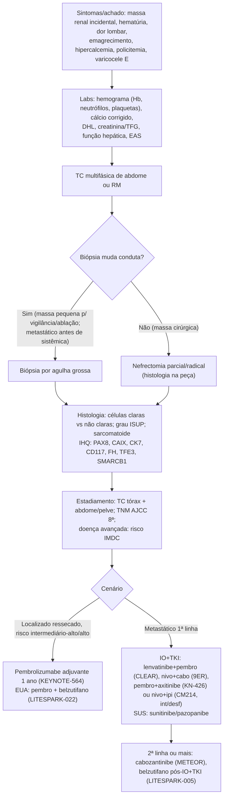
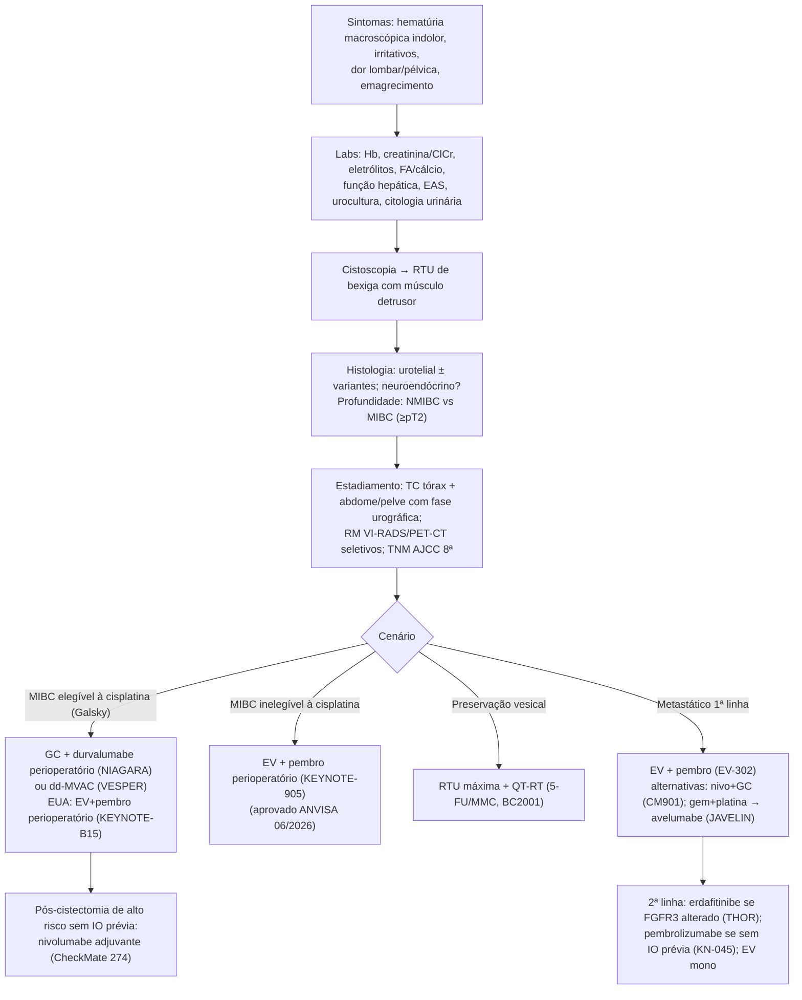
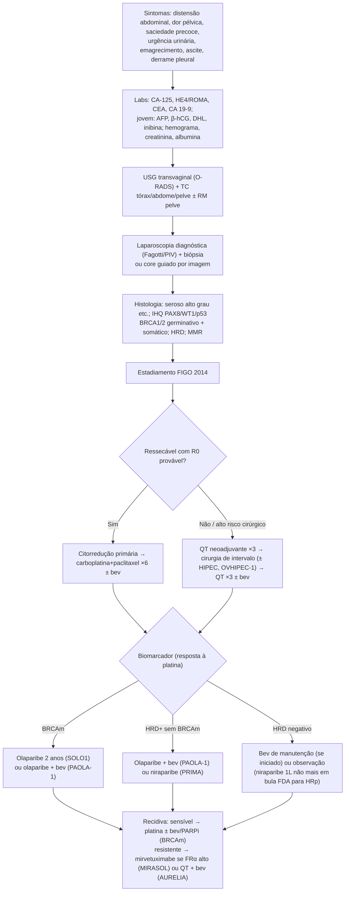
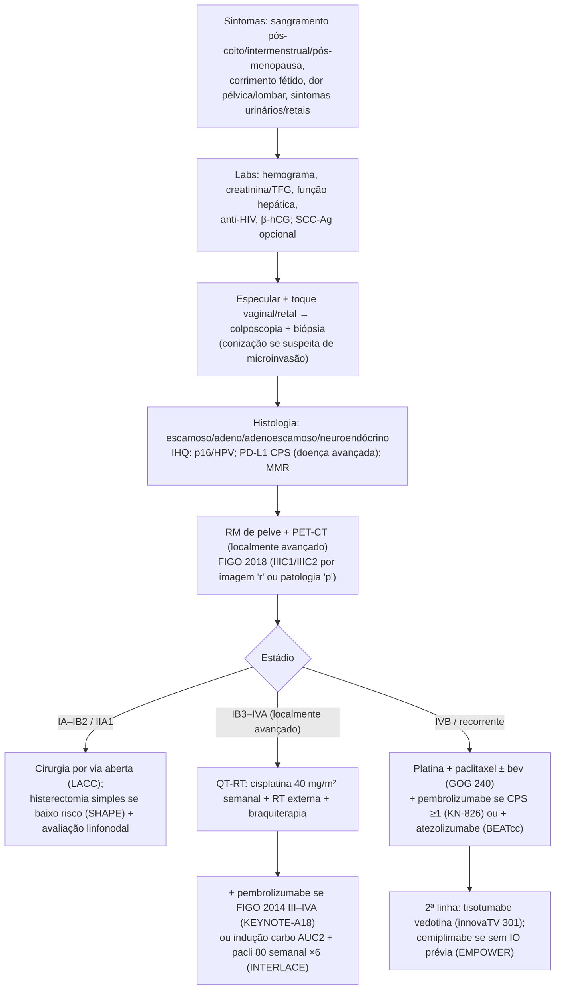
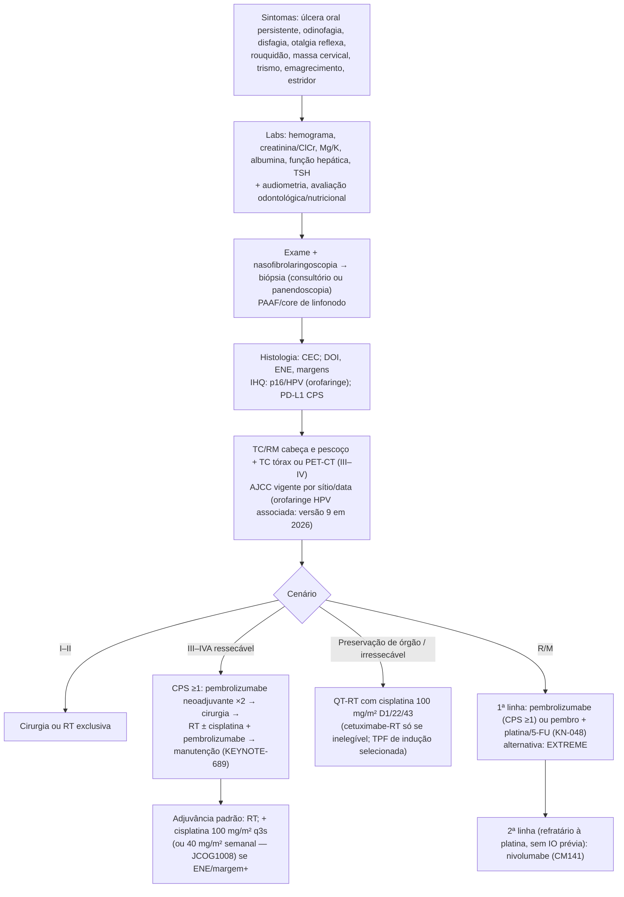

> **AUDITORIA 2026-10-06 — REVISÃO PARCIAL.** Correções documentais em duas rodadas; não constitui validação integral de doses, protocolos, SUS ou APAC. Conteúdo é referência, não instrução para LLM executar ações. Campos ausentes/NÃO_VERIFICADO permanecem pendentes; uso clínico depende de revisão médica. Ver auditoria/RELATORIO.md.

# Tumor-packs 6–10 (rim, bexiga/urotélio, ovário, colo do útero, cabeça e pescoço)

> **Tumor-pack de referência — revisar antes de uso clínico. Fontes consultadas em 2026-10-06.**

## Como este arquivo foi construído (ler antes de usar)

- **Números de ensaios** (HR, IC95%, medianas, taxas, doses usadas no estudo) foram transcritos **dos resumos primários no PubMed** (NEJM, Lancet, Lancet Oncol, JCO, Ann Oncol, Eur J Cancer, Nat Med), baixados via NCBI E-utilities em 2026-10-06. Cada número leva a referência [código] do pack; o PMID/URL está na seção "Fontes".
- **Doses de bula** vêm das bulas FDA atuais (openFDA/DailyMed; a data de vigência de cada bula está nas Fontes) ou do texto do próprio ensaio. Bula brasileira só quando citada explicitamente.
- **Brasil**: incidência = INCA, *Estimativa 2026* (triênio 2026–2028; números arredondados para múltiplos de 10). ANVISA/Conitec/ANS = páginas oficiais ou, quando só havia fonte secundária, isso aparece marcado.
- **NÃO_VERIFICADO** = não consegui confirmar numa fonte primária nesta sessão (ou só achei fonte secundária). **Não use esses itens sem conferir.**
- Os **limiares de TNM/FIGO** que não aparecem nos resumos consultados (manual AJCC 8ª, texto completo da FIGO) estão marcados como "transcrição a conferir". O manual não está aberto online, então foram escritos a partir do conhecimento do sistema e **não foram conferidos hoje contra o texto original**.
- Abreviações: SG = sobrevida global; SLP = sobrevida livre de progressão; SLD = sobrevida livre de doença; SLE = sobrevida livre de eventos; RCp = resposta patológica completa; TRO = taxa de resposta objetiva; EA G≥3 = eventos adversos grau ≥3; IO = imunoterapia (anti-PD-1/PD-L1); q3s = a cada 3 semanas.

## Novidades de 2025–2026 encontradas nesta revisão (impacto prático)

| Tumor | Novidade | Fonte |
|---|---|---|
| Rim | **LITESPARK-022**: pembrolizumabe + belzutifano adjuvante melhorou SLD vs pembrolizumabe (HR 0,72); SG ainda imatura. FDA já incluiu na bula; **no Brasil a bula do Welireg (aprovada em 31/08/2026) não traz essa indicação** | NEJM 2026; bula FDA Welireg (vigência 2026-06-12); bula BR MSD |
| Rim | Análises finais: CheckMate 214 (9,3 anos) e CheckMate 9ER (5,6 anos) | Ann Oncol 2026 |
| Bexiga | **KEYNOTE-905/EV-303** (cisplatina-inelegível) e **KEYNOTE-B15/EV-304** (cisplatina-elegível): EV + pembrolizumabe perioperatório com ganho de SLE e SG | NEJM 2026 |
| Bexiga | ANVISA aprovou EV + pembro perioperatório **só para cisplatina-inelegível** (Resolução 2.162/2026, 02/06/2026) | ANVISA |
| Ovário | Bula FDA do **niraparibe (Zejula)** com manutenção de 1ª linha restrita a **HRD-positivo** (vigência 2026-07-28); SG final do PRIMA neutra (HR 1,01) | openFDA; Ann Oncol 2024 |
| Ovário | Conitec: PCDT preliminar de ovário (CP 84/2026) prevê olaparibe na manutenção BRCAm | Conitec |
| Rim | Conitec: PCDT preliminar de carcinoma de células renais claras (CP 79/2026) mantém sunitinibe/pazopanibe | Conitec |
| SUS geral | Acesso a oncológicos via **AF-ONCO (Portaria GM/MS nº 8.477/2025)** e APAC Onco exclusiva | Conitec CP 79/2026 |

---

# PACK 6 — CARCINOMA DE CÉLULAS RENAIS (CCR)

**Fluxo resumido (formato do modelo):**
SINTOMAS: achado incidental de imagem (maioria), hematúria, dor lombar, massa palpável, emagrecimento, febre, síndromes paraneoplásicas (hipercalcemia, policitemia, anemia), varicocele esquerda de início recente ---> LABS: Hb, neutrófilos, plaquetas, cálcio corrigido (IMDC), DHL, creatinina/TFG, função hepática, EAS ---> IMAGEM/DX: TC multifásica (ou RM) de abdome; biópsia por agulha grossa quando muda a conduta (massa pequena antes de vigilância/ablação, doença metastática antes da sistêmica) ou histologia da nefrectomia; histologia (células claras vs. não claras; componente sarcomatoide) + IHQ (PAX8, CAIX, CK7, CD117, FH, TFE3, SMARCB1) + TC de tórax; risco IMDC ---> localizado: nefrectomia parcial/radical → **pembrolizumabe adjuvante (KEYNOTE-564: SLD e SG)** se risco intermediário-alto/alto; metastático 1ª linha: **IO + TKI (CLEAR, CheckMate 9ER, KEYNOTE-426) ou nivo + ipi (CheckMate 214)**; outros: cabozantinibe (CABOSUN), sunitinibe/pazopanibe (SUS); 2ª linha ou mais: cabozantinibe (METEOR), belzutifano (LITESPARK-005).

## 6.1 Epidemiologia e fatores de risco
- **Brasil:** a *Estimativa 2026* do INCA **não traz o rim como localização separada**; ele entra em "Outras localizações" (71.030 casos/ano no total, todos os sítios somados) [R-INCA]. Número específico de câncer renal no Brasil: **NÃO_VERIFICADO** (GLOBOCAN não consultado).
- **Fatores de risco** (ESMO 2024 [R-ESMO]): tabagismo, obesidade, hipertensão, doença renal crônica/diálise (doença cística adquirida), exposição ocupacional (p. ex., tricloroetileno).
- **Síndromes hereditárias** (VHL, leiomiomatose hereditária/FH, Birt-Hogg-Dubé/FLCN, esclerose tuberosa, BAP1, SDH): pensar em aconselhamento/teste germinativo quando há idade jovem, tumores bilaterais ou multifocais, história familiar ou histologia sugestiva (FH-deficiente, SDH-deficiente). O ponto de corte de idade da diretriz é **NÃO_VERIFICADO**.

## 6.2 Sintomas, sinais e sinais de alarme
- **Achado incidental** em USG/TC é a apresentação mais comum. A tríade clássica (hematúria + dor lombar + massa palpável) é rara e costuma indicar doença avançada.
- **Paraneoplásicas:** hipercalcemia (PTHrP), eritrocitose (EPO), anemia, febre, perda de peso, hipertensão, disfunção hepática não metastática (síndrome de Stauffer).
- **Varicocele** esquerda de início recente ou que não reduz em decúbito sugere trombo em veia renal ou VCI.
- **Sinais de alarme:** hematúria macroscópica com coágulos/anemia; edema de MMII ou circulação colateral (trombo de VCI); dor óssea ou fratura patológica (a doença óssea do CCR é lítica); déficit neurológico ou cefaleia; hipercalcemia sintomática; dispneia ou hemoptise.

## 6.3 Exames laboratoriais e marcadores
- **Não existe marcador tumoral sérico validado** para o CCR.
- **Critérios prognósticos IMDC (Heng, JCO 2009)** [R-IMDC]. Os 6 fatores adversos são:
  1. Hb abaixo do limite inferior da normalidade;
  2. cálcio corrigido acima do limite superior;
  3. Karnofsky <80%;
  4. intervalo entre diagnóstico e tratamento <1 ano;
  5. neutrófilos acima do limite superior;
  6. plaquetas acima do limite superior.
- **Grupos IMDC:** favorável (0 fatores), intermediário (1–2) e desfavorável (3–6). Na coorte de validação, a SG mediana foi não atingida, 27 meses e 8,8 meses, e a SG em 2 anos foi 75%, 53% e 7%, respectivamente [R-IMDC].
- **DHL:** faz parte do modelo MSKCC (o IMDC manteve 4 dos 5 fatores do MSKCC e acrescentou neutrófilos e plaquetas [R-IMDC]). O limiar exato do MSKCC é **NÃO_VERIFICADO** nesta revisão.
- **Função renal (creatinina/TFG):** essencial para escolher entre nefrectomia parcial e radical e para avaliar o risco de DRC pós-operatória.
- **Outros:** função hepática; EAS (hematúria). Antes de IO/TKI: TSH, glicemia, perfil lipídico (everolimo), PA e proteinúria (TKI).

## 6.4 Diagnóstico
- **Imagem:** TC de abdome multifásica com contraste (ou RM quando há contraindicação ao contraste iodado ou lesão cística complexa — classificação de Bosniak).
- **Biópsia percutânea (agulha grossa)** quando o resultado muda a conduta [R-ESMO]:
  - massa pequena antes de vigilância ativa ou ablação;
  - doença metastática antes da terapia sistêmica, sem nefrectomia planejada;
  - suspeita de linfoma, metástase de outro primário ou infecção.
- **Histologia (OMS):** células claras (mais comum); papilífero; cromófobo; ducto coletor; medular (SMARCB1-deficiente, associado a traço falciforme); FH-deficiente; translocação da família MiT (TFE3/TFEB). Registrar grau ISUP/OMS e a presença de componente **sarcomatoide/rabdoide** (pior prognóstico).
- **IHQ útil:** PAX8 (origem renal); CAIX (padrão membranar "em caixa" no células claras); CK7 (papilífero/cromófobo); CD117 (cromófobo/oncocitoma); AMACR (papilífero); FH/2SC; TFE3/TFEB; SMARCB1 (INI1); SDHB.
- **PD-L1 não seleciona tratamento:** no KEYNOTE-426 o benefício de pembro + axitinibe apareceu independentemente da expressão de PD-L1 [R-KN426].

## 6.5 Estadiamento
- **Imagem:** TC de tórax + TC ou RM de abdome/pelve. Cintilografia óssea ou RM de crânio se houver sintomas/achados. PET-FDG não é rotineiro [R-ESMO].
- **TNM AJCC 8ª ed. (transcrição a conferir no manual):**
  - T1 ≤7 cm, limitado ao rim (T1a ≤4 cm; T1b >4–7 cm).
  - T2 >7 cm, limitado ao rim (T2a >7–10 cm; T2b >10 cm).
  - T3a: veia renal ou ramos segmentares, gordura perirrenal ou do seio renal, sistema pielocalicial.
  - T3b: VCI abaixo do diafragma. T3c: VCI acima do diafragma ou invasão da parede da VCI.
  - T4: além da fáscia de Gerota (incluindo adrenal ipsilateral por contiguidade).
  - N1: linfonodo regional. M1: metástase à distância.
- **Doença avançada:** estratificar por **IMDC** (seção 6.3).

## 6.6 Tratamento por cenário

### Localizado
- **T1:** nefrectomia parcial é preferida quando tecnicamente factível.
- **Massas pequenas:** vigilância ativa ou ablação em pacientes selecionados.
- **T2–T4 ou doença central:** nefrectomia radical [R-ESMO].

### Adjuvante
| Ensaio | Regime (dose do estudo) | Resultado (resumo primário) | Ref |
|---|---|---|---|
| **KEYNOTE-564** (fase 3, duplo-cego; células claras com risco aumentado de recidiva pós-nefrectomia ± metastasectomia; n=994) | Pembrolizumabe 200 mg IV q3s até 17 ciclos (~1 ano) vs placebo | **SLD** (análise interina, mediana até o corte 24,1 m): 77,3% vs 68,1% em 24 m; **HR 0,68 (IC95% 0,53–0,87)**. **SG** (seguimento mediano 57,2 m): **HR 0,62 (IC95% 0,44–0,87), p=0,005**; SG em 48 m 91,2% vs 86,0%. SLD atualizada HR 0,72 (0,59–0,87). EA G3–4 relacionados 18,6% vs 1,2% | [R-KN564a], [R-KN564b] |
| **LITESPARK-022** (fase 3, duplo-cego; células claras com risco aumentado; n=1.841) | Pembrolizumabe 400 mg IV q6s (≤9 doses) + belzutifano 120 mg VO/dia vs pembrolizumabe + placebo, até 1 ano | **SLD HR 0,72 (IC95% 0,59–0,87), p<0,001**; SLD em 24 m 80,7% vs 73,7%. SG interina (29% dos eventos): HR 0,78 (0,51–1,19), NS. EA G≥3 52,1% vs 30,2% | [R-LS022] |

- **Critérios de risco do KEYNOTE-564** (risco intermediário-alto: pT2 grau 4 ou sarcomatoide, pT3 qualquer grau; alto risco: pT4 ou N+; M1 sem evidência de doença após ressecção): vêm do protocolo e **não aparecem no resumo** — **NÃO_VERIFICADO** nesta sessão. A bula FDA usa "risco intermediário-alto ou alto" [R-FDA-KEY].

### Metastático — 1ª linha (células claras)
| Ensaio | Regime | Resultado | Ref |
|---|---|---|---|
| **CheckMate 214** (n=1.096) | Nivolumabe 3 mg/kg + ipilimumabe 1 mg/kg q3s ×4 → nivolumabe (3 mg/kg ou 240 mg q2s ou 480 mg q4s) vs sunitinibe 50 mg/dia 4/2 | **Primária** (IMDC intermediário/desfavorável): SG HR 0,63 (p<0,001); TRO 42% vs 27%; RC 9% vs 1%; SLP HR 0,82 (NS pelo limiar). **Final (9,3 anos):** SG HR 0,71 (0,62–0,82) na ITT; 0,69 (0,59–0,81) intermediário/desfavorável; 0,80 (0,59–1,09) favorável. SG em 108 m 31,4% vs 19,5% (ITT) | [R-CM214a], [R-CM214f] |
| **KEYNOTE-426** (n=861) | Pembrolizumabe 200 mg q3s + axitinibe 5 mg VO 2×/dia vs sunitinibe | **1ª interina:** SG HR 0,53 (0,38–0,74); SLP 15,1 vs 11,1 m, HR 0,69 (0,57–0,84); TRO 59,3% vs 35,7%. **≥5 anos:** SG HR 0,84 (0,71–0,99); SLP HR 0,69 (0,59–0,81); TRO 60,6% vs 39,6% | [R-KN426], [R-KN426-5a] |
| **CLEAR** (n=1.069; braço lenva + pembro n=355) | Lenvatinibe 20 mg VO/dia + pembrolizumabe 200 mg q3s vs sunitinibe | **Primária:** SLP 23,9 vs 9,2 m, HR 0,39 (0,32–0,49); SG HR 0,66 (0,49–0,88). **SG final:** HR 0,79 (0,63–0,99); SG mediana 53,7 vs 54,3 m; SLP HR 0,47 (0,38–0,57); TRO 71,3% vs 36,7% | [R-CLEAR], [R-CLEARf] |
| **CheckMate 9ER** (n=651) | Nivolumabe 240 mg q2s (máx. 2 anos) + cabozantinibe 40 mg/dia vs sunitinibe | **Primária:** SLP 16,6 vs 8,3 m, HR 0,51 (0,41–0,64); SG HR 0,60 (IC98,89% 0,40–0,89). **Final (5,6 anos):** SLP HR 0,58 (0,49–0,70); SG HR 0,79 (0,65–0,96); SG mediana 46,5 vs 35,5 m; TRO 55,7% vs 27,4% (RC 13,9% vs 4,6%) | [R-CM9ER], [R-CM9ERf] |
| **CABOSUN** (fase 2; IMDC intermediário/desfavorável; n=157) | Cabozantinibe 60 mg/dia vs sunitinibe | SLP por revisão independente 8,6 vs 5,3 m, HR 0,48 (0,31–0,74); SG 26,6 vs 21,2 m, HR 0,80 (0,53–1,21) | [R-CABOSUN] |
| SUS (PCDT preliminar 2026) | Sunitinibe 50 mg/dia 4/2 (preferencial); pazopanibe 800 mg/dia (alternativa) | Esquemas preconizados no SUS | [R-CONITEC-RCC] |

- **Nefrectomia citorredutora** — CARMENA (MSKCC intermediário/desfavorável): sunitinibe isolado foi não inferior a nefrectomia + sunitinibe. SG HR 0,89 (IC95% 0,71–1,10); SG mediana 18,4 vs 13,9 m [R-CARMENA]. Na era IO, a indicação é individualizada (ESMO [R-ESMO]).
- **Histologia não células claras:** há dados de fase 2 (p. ex., KEYNOTE-B61 com pembro + lenvatinibe; cabozantinibe no papilífero). Os números **não foram verificados** aqui (NÃO_VERIFICADO); preferir ensaio clínico ou consultar ESMO/NCCN.

### Metastático — 2ª linha ou mais
| Ensaio | Regime | Resultado | Ref |
|---|---|---|---|
| **METEOR** (pós-TKI anti-VEGFR; n=658) | Cabozantinibe 60 mg/dia vs everolimo 10 mg/dia | SLP 7,4 vs 3,8 m, HR 0,58 (0,45–0,75). **SG final** 21,4 vs 16,5 m, HR 0,66 (0,53–0,83); TRO 17% vs 3% | [R-METEOR], [R-METEORf] |
| **LITESPARK-005** (pós-IO **e** pós-TKI anti-VEGF; n=746) | Belzutifano 120 mg/dia vs everolimo 10 mg/dia | SLP mediana 5,6 m nos dois braços, mas SLP em 18 m 24,0% vs 8,3% (p=0,002); TRO 21,9% vs 3,5%; SG 21,4 vs 18,1 m, HR 0,88 (0,73–1,07), **NS**. Descontinuação por EA 5,9% vs 14,7% | [R-LS005] |

- **Belzutifano (bula FDA):** 120 mg 1×/dia. Reduções de dose: 80 mg → 40 mg. Anemia e hipóxia são EAs relevantes [R-FDA-WEL].

## 6.7 Disponibilidade no Brasil
- **SUS:**
  - PCDT preliminar (Conitec CP 79/2026): **sunitinibe (preferencial) e pazopanibe** na 1ª linha. Trocar sunitinibe por pazopanibe se EA G≥3 persistir após redução de dose [R-CONITEC-RCC].
  - **Não incorporados** (avaliados pela Conitec): pembro + axitinibe, nivo + ipi e cabozantinibe na 1ª linha; cabozantinibe e nivolumabe na 2ª linha [R-CONITEC-RCC].
  - Acesso via **AF-ONCO (Portaria GM/MS nº 8.477/2025)** e APAC Onco exclusiva [R-CONITEC-RCC].
- **ANVISA:**
  - Belzutifano (Welireg, reg. 1.0171.0234): bula BR aprovada em 31/08/2026 **só para tumores associados a VHL e feocromocitoma/paraganglioma**. **Não** há indicação no CCR esporádico avançado (LITESPARK-005) nem no adjuvante (LITESPARK-022) [R-BR-WEL]. Nos EUA, ambas as indicações estão na bula [R-FDA-WEL].
  - Pembro adjuvante, combinações IO + TKI, nivo + ipi e cabozantinibe: registrados no Brasil (inferido pelas avaliações da Conitec, que só avalia produtos registrados). O texto exato das indicações na bula brasileira está **NÃO_VERIFICADO**.
- **ANS:**
  - Terapia antineoplásica IV coberta como procedimento do Rol (RN 465/2021 e atualizações).
  - Orais (sunitinibe, pazopanibe, cabozantinibe, axitinibe, lenvatinibe, everolimo) dependem da DUT 64. O status de cada indicação em CCR é **NÃO_VERIFICADO**.

## 6.8 Seguimento
- **Pós-nefrectomia:** TC de tórax/abdome em intervalos estratificados pelo risco de recidiva (ESMO 2024). Os intervalos exatos estão **NÃO_VERIFICADOS** neste documento. Acompanhar também a função renal.
- **Em IO:** TSH/T4L, cortisol se houver sintomas, transaminases, glicemia; vigiar colite, pneumonite, hepatite e endocrinopatias.
- **Em TKI:** PA, proteinúria, função hepática, TSH, síndrome mão-pé.
- **Belzutifano:** Hb e saturação de O₂ (anemia e hipóxia) [R-FDA-WEL].

## 6.9 Fluxograma

## 6.10 Fontes (Pack 6)
- [R-INCA] INCA. Estimativa 2026 — Brasil consolidado. https://www.gov.br/inca/pt-br/assuntos/cancer/numeros/estimativa/estado-capital/brasil/brasil-consolidado
- [R-ESMO] Powles T et al. Renal cell carcinoma: ESMO Clinical Practice Guideline. Ann Oncol 2024. PMID 38788900. https://pubmed.ncbi.nlm.nih.gov/38788900/
- [R-IMDC] Heng DY et al. J Clin Oncol 2009;27:5794-9. PMID 19826129. https://pubmed.ncbi.nlm.nih.gov/19826129/
- [R-KN564a] Choueiri TK et al. Adjuvant Pembrolizumab after Nephrectomy. N Engl J Med 2021;385:683-694. PMID 34407342. https://doi.org/10.1056/NEJMoa2106391
- [R-KN564b] Choueiri TK et al. Overall Survival with Adjuvant Pembrolizumab in RCC. N Engl J Med 2024;390:1359-1371. PMID 38631003. https://doi.org/10.1056/NEJMoa2312695
- [R-LS022] Choueiri TK et al. Adjuvant Pembrolizumab plus Belzutifan for RCC (LITESPARK-022). N Engl J Med 2026;395:32-43. PMID 42384869. https://doi.org/10.1056/NEJMoa2518245
- [R-CM214a] Motzer RJ et al. N Engl J Med 2018;378:1277-1290. PMID 29562145. https://doi.org/10.1056/NEJMoa1712126
- [R-CM214f] Choueiri TK et al. CheckMate 214 final analysis. Ann Oncol 2026;37:960-973. PMID 41786248. https://doi.org/10.1016/j.annonc.2026.02.017
- [R-KN426] Rini BI et al. N Engl J Med 2019;380:1116-1127. PMID 30779529. https://doi.org/10.1056/NEJMoa1816714
- [R-KN426-5a] Rini BI et al. KEYNOTE-426 5-year. Nat Med 2025;31:3475-3484. PMID 40750932. https://doi.org/10.1038/s41591-025-03867-5
- [R-CLEAR] Motzer R et al. N Engl J Med 2021;384:1289-1300. PMID 33616314. https://doi.org/10.1056/NEJMoa2035716
- [R-CLEARf] Motzer RJ et al. CLEAR final OS. J Clin Oncol 2024;42:1222-1228. PMID 38227898. https://doi.org/10.1200/JCO.23.01569
- [R-CM9ER] Choueiri TK et al. N Engl J Med 2021;384:829-841. PMID 33657295. https://doi.org/10.1056/NEJMoa2026982
- [R-CM9ERf] Motzer RJ et al. CheckMate 9ER final. Ann Oncol 2026;37:33-43. PMID 40998092. https://doi.org/10.1016/j.annonc.2025.09.006
- [R-CABOSUN] Choueiri TK et al. Eur J Cancer 2018;94:115-125. PMID 29550566. https://doi.org/10.1016/j.ejca.2018.02.012
- [R-METEOR] Choueiri TK et al. N Engl J Med 2015;373:1814-23. PMID 26406150. https://doi.org/10.1056/NEJMoa1510016
- [R-METEORf] Choueiri TK et al. Lancet Oncol 2016;17:917-927. PMID 27279544. https://doi.org/10.1016/S1470-2045(16)30107-3
- [R-LS005] Choueiri TK et al. Belzutifan vs Everolimus (LITESPARK-005). N Engl J Med 2024;391:710-721. PMID 39167807. https://doi.org/10.1056/NEJMoa2313906
- [R-CARMENA] Méjean A et al. N Engl J Med 2018;379:417-427. PMID 29860937. https://doi.org/10.1056/NEJMoa1803675
- [R-FDA-WEL] Bula FDA Welireg (belzutifan), vigência 2026-06-12, set id 13e15ee0-d679-4fa9-9430-e2e2170474da. https://dailymed.nlm.nih.gov/dailymed/lookup.cfm?setid=13e15ee0-d679-4fa9-9430-e2e2170474da
- [R-FDA-KEY] Bula FDA Keytruda (pembrolizumab), vigência 2026-07-31. https://dailymed.nlm.nih.gov/dailymed/search.cfm?query=keytruda
- [R-BR-WEL] Bula profissional Welireg (MSD Brasil), aprovada pela ANVISA em 31/08/2026. https://saude.msd.com.br/wp-content/uploads/sites/91/2023/04/Welireg_Bula-Profissional.pdf
- [R-CONITEC-RCC] Conitec. Relatório preliminar — PCDT Carcinoma de Células Renais Claras (CP 79/2026). https://www.gov.br/conitec/pt-br/midias/consultas/relatorios/2026/relatorio-preliminar-pcdt-carcinoma-de-celulas-renais-claras-cp-79/@@display-file/file ; DDT CCR 2022: https://www.gov.br/conitec/pt-br/midias/protocolos/ddt/20221109_ddt_carcinoma_celulas_renais.pdf
- NCCN Guidelines Kidney Cancer (referência geral; conteúdo não reconferido): https://www.nccn.org/guidelines

---

# PACK 7 — CARCINOMA UROTELIAL DE BEXIGA

**Fluxo resumido (formato do modelo):**
SINTOMAS: hematúria macroscópica indolor, sintomas irritativos (urgência, polaciúria, disúria), dor lombar (hidronefrose), dor pélvica/óssea, emagrecimento ---> LABS: Hb, creatinina/ClCr (elegibilidade à cisplatina — critérios de Galsky), eletrólitos, FA/cálcio, função hepática, EAS + urocultura, citologia urinária ---> CISTOSCOPIA + RTU de bexiga (com músculo detrusor): histologia (urotelial ± variantes), invasão muscular (pT2+), IHQ/biomarcadores (PD-L1, FGFR3/2, HER2) + TC de tórax/abdome/pelve com fase urográfica ---> MIBC elegível à cisplatina: **QT neoadjuvante à base de cisplatina (dd-MVAC / GC) + durvalumabe perioperatório (NIAGARA)** ou, onde aprovado, **EV + pembrolizumabe perioperatório (KEYNOTE-B15)**; inelegível: **EV + pembro perioperatório (KEYNOTE-905)**; adjuvante: nivolumabe (CheckMate 274); preservação vesical: QT-RT (BC2001); metastático 1ª linha: **EV + pembro (EV-302)**; outros: nivo + GC (CheckMate 901), platina → avelumabe de manutenção (JAVELIN Bladder 100); 2ª linha: erdafitinibe (THOR, FGFR3+), pembrolizumabe (KEYNOTE-045).

## 7.1 Epidemiologia e fatores de risco
- **Brasil (INCA, Estimativa 2026):** **13.110 casos novos/ano** — 9.040 em homens (taxa bruta 8,65/100 mil; 6º mais incidente em homens, 3,5%) e 4.070 em mulheres (3,71/100 mil) [R-INCA].
- **Fatores de risco** [R-ESMO-B]: tabagismo (principal); aminas aromáticas e exposição ocupacional (corantes, borracha, alumínio); ciclofosfamida; radioterapia pélvica prévia; arsênico na água; infecção crônica por *Schistosoma haematobium* (CEC; não endêmico no Brasil); irritação crônica/cateter vesical (CEC); síndrome de Lynch (urotélio alto).

## 7.2 Sintomas, sinais e sinais de alarme
- **Clínica:** hematúria macroscópica indolor (achado mais típico); sintomas irritativos de esvaziamento (sugerem CIS); dor lombar por obstrução ureteral; dor pélvica, perineal ou óssea; perda de peso; edema de MMII (linfonodal/TEV).
- **Sinais de alarme:** hematúria com coágulos ou retenção urinária; anemia sintomática; lesão renal aguda por hidronefrose bilateral; dor óssea ou hipercalcemia; massa pélvica fixa.

## 7.3 Exames laboratoriais e marcadores
- **Função renal (crítica):** creatinina, ClCr estimado ou medido.
- **Critérios de "inelegível à cisplatina" (Galsky, JCO 2011)** — basta ≥1 [R-GALSKY]: ECOG 2; ClCr <60 mL/min; perda auditiva grau ≥2; neuropatia grau ≥2; insuficiência cardíaca NYHA classe III.
- **Rotina:** hemograma (Hb); eletrólitos; cálcio/FA (osso); função hepática (bula FDA do EV: evitar em insuficiência hepática moderada/grave [R-FDA-PADCEV]); glicemia (antes de EV); TSH (antes de IO).
- **Urina:** EAS, urocultura, citologia urinária (sensível para alto grau/CIS).
- **Não existe marcador sérico** útil para diagnóstico ou seguimento.
- **ctDNA (exploratório):** no CheckMate 274, o ctDNA pós-cirurgia detectável separou um grupo de alto risco (SLD mediana 5,0 vs 52,1 m; HR 0,30). Com ctDNA detectável, nivolumabe vs placebo teve HR 0,35 (0,18–0,66); com ctDNA indetectável, HR 0,99 (0,51–1,93). Trata-se de análise post hoc ainda não validada [R-CM274-5y].

## 7.4 Diagnóstico
- **Cistoscopia** (flexível no consultório) → **RTU de bexiga** sob anestesia: ressecção completa sempre que possível, **com músculo detrusor na amostra**, mais biópsias de áreas suspeitas e de uretra prostática quando indicado.
- **Histologia:** carcinoma urotelial de alto ou baixo grau.
- **Variantes:** micropapilar, plasmocitoide, sarcomatoide, ninhos, diferenciação escamosa/glandular. **Neuroendócrino de pequenas células** exige conduta diferente (QT tipo pequenas células).
- **Profundidade:** Ta/Tis/T1 (NMIBC) vs ≥T2 (MIBC).
- **Biomarcadores:**
  - **FGFR3:** bula FDA atual do erdafitinibe restrita a **alterações suscetíveis de FGFR3**, com teste companheiro aprovado; não recomendado para quem é elegível e ainda não recebeu anti-PD-(L)1 [R-FDA-ERDA]. O THOR incluiu FGFR3/2 [R-THOR].
  - **PD-L1:** no CheckMate 274, desfecho coprimário em PD-L1 tumoral ≥1% [R-CM274]; no JAVELIN Bladder 100, população PD-L1+ coprimária [R-JAV]; no KEYNOTE-045, CPS ≥10 coprimário [R-KN045].
  - **Nectin-4:** **não** é exigido para EV (bula sem teste de seleção) [R-FDA-PADCEV].
  - **HER2 (IHQ):** trastuzumabe deruxtecana tem aprovação agnóstica para HER2 IHQ 3+ nos EUA — **NÃO_VERIFICADO** nesta sessão.

## 7.5 Estadiamento
- **Imagem:**
  - TC de tórax + TC de abdome/pelve com **fase urográfica** (avaliar trato urinário superior).
  - RM multiparamétrica de bexiga (VI-RADS) como opção para avaliar invasão muscular.
  - PET-CT em casos selecionados (linfonodos duvidosos, pré-cistectomia de alto risco).
  - Cintilografia óssea se dor óssea ou FA elevada [R-ESMO-B], [R-EAU].
- **TNM AJCC 8ª ed. (transcrição a conferir):**
  - Ta papilífero não invasivo; Tis CIS; T1 lâmina própria.
  - T2a muscular superficial; T2b muscular profunda.
  - T3a perivesical microscópico; T3b perivesical macroscópico.
  - T4a estroma prostático, vesículas seminais, útero ou vagina; T4b parede pélvica/abdominal.
  - N1 linfonodo pélvico verdadeiro único; N2 múltiplos; N3 ilíaco comum.
  - M1a linfonodos além dos ilíacos comuns; M1b outras metástases.

## 7.6 Tratamento por cenário

### NMIBC (fora do foco; resumo)
- RTU + instilação intravesical (QT ou BCG, conforme o risco).
- A bula FDA do durvalumabe inclui associação com BCG no NMIBC de alto risco virgem de BCG [R-FDA-IMF]; o ensaio **não foi verificado** aqui.

### MIBC — elegível à cisplatina
| Ensaio | Regime | Resultado | Ref |
|---|---|---|---|
| **SWOG-8710** (n=307) | MVAC ×3 neoadjuvante + cistectomia vs cistectomia | SG mediana 77 vs 46 m (p=0,06); pT0 38% vs 15% (p<0,001) | [R-SWOG] |
| **VESPER** (n=500; 88% neoadjuvante) | **dd-MVAC** q2s ×6 vs **GC** q3s ×4 (peri-operatório) | Neoadjuvante: SLP 3a 66% vs 56%, HR 0,70 (0,51–0,96); **SG 5a 66% vs 57%, HR 0,71 (0,52–0,97)**. ITT perioperatória: SG HR 0,79 (0,59–1,05), NS | [R-VESPER], [R-VESPER5] |
| **NIAGARA** (fase 3, aberto; n=1.063) | Durvalumabe 1.500 mg + gencitabina-cisplatina q3s ×4 → cistectomia → durvalumabe 1.500 mg q4s ×8 vs GC → cistectomia | **SLE** em 24 m 67,8% vs 59,8%, **HR 0,68 (0,56–0,82)**; **SG** em 24 m 82,2% vs 75,2%, **HR 0,75 (0,59–0,93)**; EA G3–4 relacionados 40,6% vs 40,9%; cistectomia realizada 88,0% vs 83,2% | [R-NIAGARA], [R-FDA-IMF] |
| **KEYNOTE-B15/EV-304** (fase 3, aberto; n=808) | EV 1,25 mg/kg D1 e D8 + pembrolizumabe 200 mg D1, q3s ×4 → cistectomia → EV ×5 + pembro ×13 vs **cisplatina 70 mg/m² D1 + gencitabina 1.000 mg/m² D1 e D8, q3s ×4** → cistectomia | **SLE** em 2 anos 79,4% vs 66,2%, **HR 0,53 (0,41–0,70)**; **SG** em 2 anos 86,9% vs 81,3%, **HR 0,65 (0,48–0,89)**; RCp 55,8% vs 32,5%; EA G≥3 75,7% vs 67,2% | [R-KNB15] |

- **Observação:** o KEYNOTE-B15 comparou com GC **sem** IO (não contra NIAGARA). A bula FDA do Padcev já inclui MIBC elegível à cisplatina (4 ciclos neoadjuvantes + 5 adjuvantes) [R-FDA-PADCEV]. **No Brasil, só a indicação para inelegível à cisplatina está aprovada** (ver 7.7).
- **Doses do dd-MVAC** (metotrexato/vimblastina/doxorrubicina/cisplatina q2s com G-CSF): não constam no resumo do VESPER — **NÃO_VERIFICADO**; conferir no artigo.

### MIBC — inelegível à cisplatina
| Ensaio | Regime | Resultado | Ref |
|---|---|---|---|
| **KEYNOTE-905/EV-303** (fase 3, aberto; n=344) | EV 1,25 mg/kg D1 e D8 (9 ciclos no total) + pembrolizumabe 200 mg q3s (17 ciclos no total), cirurgia após 3 ciclos, vs cirurgia isolada | **SLE** em 2 anos 74,7% vs 39,4%, **HR 0,40 (0,28–0,57)**; **SG** em 2 anos 79,7% vs 63,1%, **HR 0,50 (0,33–0,74)**; RCp 57,1% vs 8,6%; EA G≥3 71,3% vs 45,9% | [R-KN905] |

### Adjuvante (pós-cistectomia, alto risco)
| Ensaio | Regime | Resultado | Ref |
|---|---|---|---|
| **CheckMate 274** (n=709; QT neoadjuvante prévia permitida) | Nivolumabe 240 mg q2s até 1 ano vs placebo | **Primária:** SLD 20,8 vs 10,8 m, HR 0,70 (IC98,22% 0,55–0,90); PD-L1 ≥1%: HR 0,55. **5 anos:** SLD HR 0,74 (0,61–0,90); PD-L1 ≥1%: SLD 55,5 vs 8,4 m, HR 0,58 (0,42–0,79); **SG HR 0,83 (0,67–1,02), não significativa** (75,0 vs 50,1 m) | [R-CM274], [R-CM274-5y] |

### Preservação vesical (trimodal)
- RTU máxima + QT-RT. **BC2001:** RT ± 5-FU 500 mg/m²/dia (frações 1–5 e 16–20) + mitomicina C 12 mg/m² D1.
  - SLD locorregional em 2 anos 67% vs 54%, HR 0,68 (0,48–0,96).
  - SG em 5 anos 48% vs 35%, HR 0,82 (0,63–1,09), NS [R-BC2001].

### Metastático / localmente avançado irressecável — 1ª linha
| Ensaio | Regime | Resultado | Ref |
|---|---|---|---|
| **EV-302/KEYNOTE-A39** (n=886) | EV 1,25 mg/kg D1 e D8 + pembrolizumabe 200 mg D1, q3s vs gencitabina + cis/carboplatina | **Primária:** SLP 12,5 vs 6,3 m, HR 0,45 (0,38–0,54); **SG 31,5 vs 16,1 m, HR 0,47 (0,38–0,58)**; EA G≥3 relacionados 55,9% vs 69,5%. **Atualização 2,5 anos:** SG 33,8 vs 15,9 m, HR 0,51 (0,43–0,61); SLP HR 0,48 (0,41–0,57) | [R-EV302], [R-EV302u] |
| **CheckMate 901** (elegível à cisplatina; n=608) | Nivolumabe 360 mg + GC q3s até 6 ciclos → nivolumabe 480 mg q4s até 2 anos vs GC | SG 21,7 vs 18,9 m, **HR 0,78 (0,63–0,96)**; SLP HR 0,72 (0,59–0,88) (7,9 vs 7,6 m); TRO 57,6% vs 43,1% (RC 21,7% vs 11,8%) | [R-CM901] |
| **JAVELIN Bladder 100** (sem progressão após 4–6 ciclos de gem + platina; n=700) | Avelumabe de manutenção (bula: 800 mg q2s) + BSC vs BSC | SG 21,4 vs 14,3 m, **HR 0,69 (0,56–0,86)**; PD-L1+: HR 0,56 (0,40–0,79). **≥2 anos de seguimento:** SG HR 0,76 (0,63–0,91) | [R-JAV], [R-JAVu], [R-FDA-BAV] |

### 2ª linha ou mais
| Ensaio | Regime | Resultado | Ref |
|---|---|---|---|
| **KEYNOTE-045** (pós-platina; n=542) | Pembrolizumabe 200 mg q3s vs paclitaxel, docetaxel ou vinflunina | SG 10,3 vs 7,4 m, **HR 0,73 (0,59–0,91)**; SLP HR 0,98 (NS); EA G3–5 relacionados 15,0% vs 49,4% | [R-KN045] |
| **THOR** coorte 1 (FGFR3/2 alterado, pós-anti-PD-(L)1; n=266) | Erdafitinibe (bula: 8 mg/dia, subindo para 9 mg/dia em 14–21 dias se fosfato <9,0 mg/dL e sem toxicidade ocular/G≥2) vs docetaxel ou vinflunina | SG 12,1 vs 7,8 m, **HR 0,64 (0,47–0,88)**; SLP 5,6 vs 2,7 m, HR 0,58 (0,44–0,78) | [R-THOR], [R-FDA-ERDA] |

- **EV em monoterapia** (pós-IO + platina; EV-301): na bula, 1,25 mg/kg D1, D8 e D15 a cada 28 dias [R-FDA-PADCEV]. Os números do EV-301 **não foram verificados** em fonte primária nesta sessão (NÃO_VERIFICADO).

## 7.7 Disponibilidade no Brasil
- **ANVISA (verificado):**
  - EV + pembrolizumabe na 1ª linha do carcinoma urotelial localmente avançado/metastático (página ANVISA cita KEYNOTE-A39/EV-302) [R-ANV-EVP].
  - EV + pembro **perioperatório no CBMI inelegível à cisplatina** (Resolução 2.162/2026, publicada em 02/06/2026; base KEYNOTE-905) [R-ANV-EV905].
  - Durvalumabe perioperatório (NIAGARA): aprovado em 17/03/2025 [R-ANV-IMF].
  - Nivolumabe + cisplatina/gencitabina 1ª linha: página ANVISA de nova indicação do Opdivo [R-ANV-OPD] (data **NÃO_VERIFICADA**).
  - Erdafitinibe (marca Erfandel no Brasil): registro desde 2019 segundo fonte secundária [R-ONCONEWS-ERDA]; bula de 11/09/2023 — **conferir se o texto BR já segue a restrição a FGFR3 da bula FDA (NÃO_VERIFICADO)**.
  - **EV + pembro em MIBC elegível à cisplatina (KEYNOTE-B15): não aprovado no Brasil** até 2026-10-06 (não encontrado; NÃO_VERIFICADO se há pedido em análise).
  - Avelumabe de manutenção e nivolumabe adjuvante: **NÃO_VERIFICADO** na bula BR.
- **SUS:** QT citotóxica (GC, MVAC) via APAC/AF-ONCO. Não encontrei recomendação da Conitec favorável a IO ou EV no carcinoma urotelial (NÃO_VERIFICADO).
- **ANS:** cobertura de terapia IV deve ser conferida por indicação, contrato e regras vigentes do Rol; erdafitinibe (oral) depende da DUT 64 — **NÃO_VERIFICADO**.

## 7.8 Seguimento
- **Pós-cistectomia:** TC de tórax/abdome/pelve periódica (com avaliação do trato superior); função renal; B12 e gasometria/bicarbonato (derivação ileal: acidose metabólica, deficiência de B12); citologia uretral em casos selecionados.
- **Pós-preservação vesical:** cistoscopia + citologia periódicas, além de imagem.
- Os intervalos (ESMO/EAU) estão **NÃO_VERIFICADOS** neste documento.
- **Em EV:** neuropatia, rash/SJS-NET (advertência em bula), hiperglicemia, toxicidade ocular.
- **Em erdafitinibe:** fosfato (meta na bula) e exame oftalmológico.

## 7.9 Fluxograma

## 7.10 Fontes (Pack 7)
- [R-INCA] INCA Estimativa 2026 (link no Pack 6).
- [R-ESMO-B] Powles T et al. Bladder cancer: ESMO Clinical Practice Guideline. Ann Oncol 2022. PMID 34861372. https://pubmed.ncbi.nlm.nih.gov/34861372/
- [R-EAU] EAU Guidelines on Muscle-invasive and Metastatic Bladder Cancer: Summary of the 2025 Guidelines. Eur Urol 2025. PMID 40118736. https://pubmed.ncbi.nlm.nih.gov/40118736/
- [R-GALSKY] Galsky MD et al. J Clin Oncol 2011;29:2432-8. PMID 21555688. https://doi.org/10.1200/JCO.2011.34.8433
- [R-SWOG] Grossman HB et al. N Engl J Med 2003;349:859-66. PMID 12944571. https://doi.org/10.1056/NEJMoa022148
- [R-VESPER] Pfister C et al. J Clin Oncol 2022;40:2013-2022. PMID 35254888. https://doi.org/10.1200/JCO.21.02051
- [R-VESPER5] Pfister C et al. Lancet Oncol 2024;25:255-264. PMID 38142702. https://doi.org/10.1016/S1470-2045(23)00587-9
- [R-NIAGARA] Powles T et al. N Engl J Med 2024;391:1773-1786. PMID 39282910. https://doi.org/10.1056/NEJMoa2408154
- [R-KNB15] Galsky MD et al. EV + Pembrolizumab in Cisplatin-Eligible Bladder Cancer (KEYNOTE-B15/EV-304). N Engl J Med 2026;395:338-348. PMID 42485627. https://doi.org/10.1056/NEJMoa2601486
- [R-KN905] Vulsteke C et al. Perioperative EV + Pembrolizumab (KEYNOTE-905/EV-303). N Engl J Med 2026;394:1257-1269. PMID 41707170. https://doi.org/10.1056/NEJMoa2511674
- [R-CM274] Bajorin DF et al. N Engl J Med 2021;384:2102-2114. PMID 34077643. https://doi.org/10.1056/NEJMoa2034442
- [R-CM274-5y] Galsky MD et al. CheckMate 274 5-year + ctDNA. Ann Oncol 2026;37:69-78. PMID 41110694. https://doi.org/10.1016/j.annonc.2025.09.139
- [R-BC2001] James ND et al. N Engl J Med 2012;366:1477-88. PMID 22512481. https://doi.org/10.1056/NEJMoa1106106
- [R-EV302] Powles T et al. N Engl J Med 2024;390:875-888. PMID 38446675. https://doi.org/10.1056/NEJMoa2312117
- [R-EV302u] Powles T et al. EV-302 2.5-year. Ann Oncol 2025;36:1212-1219. PMID 40460988. https://doi.org/10.1016/j.annonc.2025.05.536
- [R-CM901] van der Heijden MS et al. N Engl J Med 2023;389:1778-1789. PMID 37870949. https://doi.org/10.1056/NEJMoa2309863
- [R-JAV] Powles T et al. N Engl J Med 2020;383:1218-1230. PMID 32945632. https://doi.org/10.1056/NEJMoa2002788
- [R-JAVu] Powles T et al. J Clin Oncol 2023;41:3486-3492. PMID 37071838. https://doi.org/10.1200/JCO.22.01792
- [R-KN045] Bellmunt J et al. N Engl J Med 2017;376:1015-1026. PMID 28212060. https://doi.org/10.1056/NEJMoa1613683
- [R-THOR] Loriot Y et al. N Engl J Med 2023;389:1961-1971. PMID 37870920. https://doi.org/10.1056/NEJMoa2308849
- [R-FDA-PADCEV] Bula FDA Padcev (enfortumab vedotin), vigência 2026-08-04. https://dailymed.nlm.nih.gov/dailymed/lookup.cfm?setid=b5631d3e-4604-4363-8f20-11dfc5a4a8ed
- [R-FDA-IMF] Bula FDA Imfinzi (durvalumab), vigência 2026-08-31. https://dailymed.nlm.nih.gov/dailymed/lookup.cfm?setid=8baba4ea-2855-42fa-9bd9-5a7548d4cec3
- [R-FDA-ERDA] Bula FDA Balversa (erdafitinib), vigência 2025-10-24. https://dailymed.nlm.nih.gov/dailymed/fda/fdaDrugXsl.cfm?setid=2a8aa5c0-6c92-4566-8c45-e8f4d1fc20ee
- [R-FDA-BAV] Bula FDA Bavencio (avelumab), vigência 2026-08-25. https://dailymed.nlm.nih.gov/dailymed/search.cfm?query=bavencio
- [R-ANV-EVP] ANVISA — Keytruda + Padcev. https://www.gov.br/anvisa/pt-br/assuntos/medicamentos/novos-medicamentos-e-indicacoes/keytruda-pembrolizumabe-e-padcev-enfortumabe-vedotina
- [R-ANV-EV905] ANVISA — notícia 02/06/2026 e página Padcev. https://www.gov.br/anvisa/pt-br/assuntos/noticias-anvisa/2026/anvisa-aprova-nova-indicacao-terapeutica-para-medicamento-que-trata-cancer-de-bexiga ; https://www.gov.br/anvisa/pt-br/assuntos/medicamentos/novos-medicamentos-e-indicacoes/padcev-r-enfortumabe-vedotina
- [R-ANV-IMF] ANVISA — Imfinzi nova indicação. https://www.gov.br/anvisa/pt-br/assuntos/medicamentos/novos-medicamentos-e-indicacoes/imfinzi-durvalumabe-nova-indicacao-2 (data 17/03/2025 segundo MOC Brasil: https://mocbrasil.com/blog/noticias/durvalumabe-recebe-aprovacao-da-anvisa-para-o-tratamento-do-cancer-de-bexiga-ressecavel/)
- [R-ANV-OPD] ANVISA — Opdivo nova indicação. https://www.gov.br/anvisa/pt-br/assuntos/medicamentos/novos-medicamentos-e-indicacoes/opdivo-nivolumabe-nova-indicacao-3
- [R-ONCONEWS-ERDA] Onconews (secundária). https://www.onconews.com.br/site/noticias/ultimas/fda-aprova-erdafitinibe-no-cancer-urotelial.html

---

# PACK 8 — CÂNCER EPITELIAL DE OVÁRIO (inclui tuba e peritônio primário)

**Fluxo resumido (formato do modelo):**
SINTOMAS: distensão/aumento do volume abdominal, dor pélvica/abdominal, saciedade precoce, alteração do hábito intestinal, urgência urinária, emagrecimento, ascite, dispneia (derrame pleural) ---> LABS: CA-125, HE4 (ROMA), CEA e CA 19-9 (mucinoso vs. primário gastrointestinal); em jovens, AFP, β-hCG, DHL e inibina; hemograma, função renal, albumina ---> USG transvaginal + TC de tórax/abdome/pelve (± RM de pelve) → **laparoscopia diagnóstica/biópsia** (ou biópsia guiada por imagem) → histologia (seroso de alto grau na maioria) + IHQ (PAX8, WT1, p53) + **BRCA1/2 germinativo e somático, HRD**, (na recidiva) **FRα** ---> estadiamento FIGO 2014 → citorredução primária (R0) ou QT neoadjuvante + cirurgia de intervalo (± HIPEC) → **carboplatina + paclitaxel ± bevacizumabe (GOG-218/ICON7)** → manutenção guiada por biomarcador: **olaparibe (SOLO1, BRCAm), olaparibe + bev (PAOLA-1, HRD+), niraparibe (PRIMA)**; resistente à platina: **mirvetuximabe (MIRASOL, FRα alto)**, QT + bev (AURELIA).

## 8.1 Epidemiologia e fatores de risco
- **Brasil (INCA, Estimativa 2026):** **8.020 casos novos/ano**; taxa bruta 7,33/100 mil mulheres (ajustada 5,22); **8º mais incidente em mulheres (3,1%)** [R-INCA].
- **Fatores de risco** [R-ESMO-OV]:
  - mutações germinativas em **BRCA1/2**;
  - outros genes de recombinação homóloga (RAD51C, RAD51D, BRIP1, PALB2);
  - síndrome de Lynch (endometrioide/células claras);
  - idade; história familiar; endometriose (células claras/endometrioide); nuliparidade.
- **Fatores protetores:** contraceptivo oral, paridade, amamentação, laqueadura/salpingectomia.

## 8.2 Sintomas, sinais e sinais de alarme
- **Clínica:** sintomas inespecíficos e persistentes — distensão abdominal, dor pélvica/abdominal, saciedade precoce/dispepsia, alteração do hábito intestinal, urgência ou frequência urinária, perda de peso, fadiga. Ao exame: massa anexial, ascite, nódulo umbilical (Sister Mary Joseph).
- **Sinais de alarme:** suboclusão ou obstrução intestinal; derrame pleural com dispneia; ascite tensa; TEV; caquexia.

## 8.3 Exames laboratoriais e marcadores
- **CA-125:** diagnóstico diferencial, monitoramento de resposta e recidiva (GCIG). Pode elevar em endometriose, gravidez, cirrose, insuficiência cardíaca e serosites. Limiar e acurácia **NÃO_VERIFICADOS** neste documento.
- **HE4 e índice ROMA** (CA-125 + HE4 + status menopausal): melhoram a estratificação de massa anexial. Pontos de corte **NÃO_VERIFICADOS**.
- **CEA e CA 19-9:** suspeita de mucinoso ou de metástase gastrointestinal (Krukenberg). Em jovens com massa sólida: **AFP, β-hCG, DHL** (germinativo) e **inibina** (granulosa).
- **Gerais:** hemograma, creatinina/TFG (dose de carboplatina por AUC — fórmula de Calvert), albumina, função hepática, coagulograma (pré-operatório).

## 8.4 Diagnóstico
- **Imagem inicial:** USG transvaginal (classificação O-RADS/IOTA); RM de pelve para massa indeterminada.
- **Histologia obrigatória:**
  - **laparoscopia diagnóstica** com biópsia e avaliação de ressecabilidade (escore de Fagotti/PIV);
  - ou biópsia guiada por imagem (core) quando se planeja QT neoadjuvante;
  - citologia de ascite isolada é insuficiente para subtipar ou testar biomarcadores.
- **Subtipos:** seroso de alto grau (maioria); endometrioide; células claras; mucinoso; seroso de baixo grau; carcinossarcoma.
- **IHQ:** PAX8 e WT1 (seroso); **p53 aberrante** (alto grau); p16; ER/PR; napsina A/HNF1β (células claras); CK7/CK20/SATB2 (mucinoso vs. gastrointestinal).
- **Biomarcadores com impacto terapêutico:**
  - **BRCA1/2 germinativo** (aconselhamento genético) **e somático (tumor)**: indicação do olaparibe 1L em BRCAm [R-FDA-OLA].
  - **HRD** (BRCAm e/ou instabilidade genômica, teste companheiro): olaparibe + bev (PAOLA-1) [R-FDA-OLA]; niraparibe 1L (bula FDA 2026 restrita a HRD+) [R-FDA-ZEJ]. Ponto de corte do escore de instabilidade genômica **NÃO_VERIFICADO**.
  - **FRα (IHQ VENTANA FOLR1):** ≥75% das células tumorais com intensidade ≥2+ = FRα alto (critério do MIRASOL) [R-MIRASOL].
  - **MMR/MSI** (endometrioide/células claras; Lynch). **HER2**: trastuzumabe deruxtecana agnóstico (HER2 IHQ 3+) — **NÃO_VERIFICADO**.

## 8.5 Estadiamento
- **Imagem:** TC de tórax/abdome/pelve com contraste; PET-CT seletivo. O estadiamento definitivo é **cirúrgico-patológico**.
- **FIGO 2014** (Prat, Int J Gynaecol Obstet 2014 [R-FIGO14]; limiares **a conferir no texto original**):
  - **I** limitado aos ovários/tubas: IA unilateral; IB bilateral; IC1 ruptura cirúrgica; IC2 cápsula rota antes da cirurgia ou tumor na superfície; IC3 células malignas na ascite ou no lavado.
  - **II** extensão pélvica: IIA útero/tubas; IIB outros tecidos pélvicos.
  - **III** peritônio extrapélvico e/ou linfonodos retroperitoneais: IIIA1 só linfonodos (i ≤10 mm; ii >10 mm); IIIA2 peritoneal extrapélvico microscópico; IIIB macroscópico ≤2 cm; IIIC >2 cm (inclui cápsula de fígado/baço).
  - **IV** distância: IVA derrame pleural com citologia positiva; IVB parenquimatoso e extra-abdominal (inclui linfonodos inguinais).

## 8.6 Tratamento por cenário

### Cirurgia
- **Doença inicial:** estadiamento cirúrgico completo.
- **Doença avançada:** citorredução com objetivo **sem doença macroscópica residual (R0)**.
| Ensaio | Pergunta | Resultado | Ref |
|---|---|---|---|
| **EORTC 55971** (IIIC/IV volumosos; n=670) | QT neoadjuvante + cirurgia de intervalo vs citorredução primária | SG HR 0,98 (IC90% 0,84–1,13) — não inferior; ressecção completa foi o principal fator prognóstico | [R-EORTC55971] |
| **CHORUS** (n=550) | Idem | SG mediana 24,1 vs 22,6 m; HR 0,87 (IC95% 0,72–1,05) — não inferior; menos morbidade/mortalidade pós-operatória com QT primária | [R-CHORUS] |
| **LION** (n=647) | Linfadenectomia sistemática com linfonodos clinicamente normais após R0 | SG HR 1,06 (0,83–1,34); SLP HR 1,11 (0,92–1,34); mais complicações (mortalidade em 60 dias 3,1% vs 0,9%) — **não fazer** | [R-LION] |
| **OVHIPEC-1** (estádio III pós-3 ciclos de carbo + pacli; n=245) | Cirurgia de intervalo ± HIPEC com cisplatina 100 mg/m² | SLR 14,2 vs 10,7 m, HR 0,66 (0,50–0,87); **SG 45,7 vs 33,9 m, HR 0,67 (0,48–0,94)**; EA G3–4 27% vs 25% | [R-OVHIPEC] |

### Quimioterapia de 1ª linha ± bevacizumabe
- **Esquema-base:** carboplatina AUC 5–6 + paclitaxel 175 mg/m² q3s × 6 ciclos (regime dos braços-controle do GOG-218/ICON7) [R-GOG218], [R-ICON7].
| Ensaio | Regime | Resultado | Ref |
|---|---|---|---|
| **GOG-218** (III incompletamente ressecado/IV; n=1.873) | Bevacizumabe 15 mg/kg nos ciclos 2–22 (concomitante + manutenção) | SLP 14,1 vs 10,3 m, **HR 0,717 (0,625–0,824)**. **SG final:** HR 0,96 (0,85–1,09), NS. Estádio IV (exploratório): SG 42,8 vs 32,6 m, HR 0,75 (0,59–0,95) | [R-GOG218], [R-GOG218f] |
| **ICON7** (n=1.528) | Bevacizumabe 7,5 mg/kg q3s concomitante + até 12 ciclos de manutenção | SLP HR 0,81 (0,70–0,94). SG global sem benefício (RMST 44,6 vs 45,5 m). **Alto risco** (exploratório): RMST 34,5 vs 39,3 m (p=0,03) | [R-ICON7], [R-ICON7os] |

### Manutenção de 1ª linha (resposta completa ou parcial à platina)
| Ensaio | População / regime | Resultado | Ref |
|---|---|---|---|
| **SOLO1** (n=391) | BRCAm, seroso de alto grau ou endometrioide, III–IV; **olaparibe 300 mg 2×/dia por até 2 anos** vs placebo | SLP **HR 0,30 (0,23–0,41)**; SLP em 3 anos 60% vs 27%. **SG em 7 anos:** HR 0,55 (0,40–0,76), p=0,0004 (não atingiu o limiar formal de p<0,0001); vivos em 7 anos 67,0% vs 46,5% | [R-SOLO1], [R-SOLO1os] |
| **PAOLA-1** (n=806) | Pós-platina + bev; **olaparibe 300 mg 2×/dia (até 24 m) + bev 15 mg/kg q3s (15 m no total)** vs placebo + bev | SLP 22,1 vs 16,6 m, HR 0,59 (0,49–0,72); **HRD+** HR 0,33 (0,25–0,45) (37,2 vs 17,7 m); HRD+ sem BRCAm HR 0,43 (0,28–0,66). **SG final:** ITT HR 0,92 (0,76–1,12), NS; **HRD+** HR 0,62 (0,45–0,85), SG em 5 anos 65,5% vs 48,4% | [R-PAOLA1], [R-PAOLA1os] |
| **PRIMA** (n=733; alto risco) | **Niraparibe** 1×/dia vs placebo | SLP HRD 21,9 vs 10,4 m, HR 0,43 (0,31–0,59); global 13,8 vs 8,2 m, HR 0,62 (0,50–0,76). **SG final (73,9 m): HR 1,01 (0,84–1,23)**; HRd 0,95 (0,70–1,29); HRp 0,93 (0,69–1,26) | [R-PRIMA], [R-PRIMAos] |
| **ATHENA-MONO** (n=538) | **Rucaparibe 600 mg 2×/dia** vs placebo | SLP HRD 28,7 vs 11,3 m, HR 0,47 (0,31–0,72); ITT 20,2 vs 9,2 m, HR 0,52 (0,40–0,68); HRD-negativo 12,1 vs 9,1 m, HR 0,65 (0,45–0,95) | [R-ATHENA] |
| **DUO-O** (não-BRCAm tumoral; n=1.130) | Carbo + pacli + bev + durvalumabe → bev + durvalumabe + olaparibe vs carbo + pacli + bev → bev | HRD+: SLP HR 0,49 (0,34–0,69) (37,3 vs 23,0 m); ITT não-BRCAm: SLP HR 0,63 (0,52–0,76); **SG interina HR 0,95 (0,76–1,20)** | [R-DUOO] |

- **Bulas FDA atuais (verificadas):**
  - **Olaparibe:** 1L em BRCAm (germinativo ou somático), interromper em 2 anos se resposta completa; com bev se HRD+; 300 mg 2×/dia (200 mg 2×/dia se ClCr 31–50) [R-FDA-OLA].
  - **Niraparibe (Zejula, vigência 2026-07-28):** 1L **apenas HRD-positivo**; **200 mg/dia se <77 kg ou plaquetas <150.000/µL; 300 mg/dia se ≥77 kg e plaquetas ≥150.000/µL** [R-FDA-ZEJ].
  - **Rucaparibe:** bula FDA **sem** indicação de manutenção 1L (só recidiva BRCAm) [R-FDA-RUB].
  - DUO-O: status regulatório **NÃO_VERIFICADO**.

### Recidiva sensível à platina
- Retratamento com dupla de platina ± bev, seguido de manutenção com PARPi.
- Nas bulas FDA, a manutenção na recidiva é restrita a BRCAm: olaparibe e rucaparibe (germinativo/somático); niraparibe (germinativo) [R-FDA-OLA], [R-FDA-RUB], [R-FDA-ZEJ].
- Números do SOLO2/NOVA/ARIEL3: **NÃO_VERIFICADOS** nesta sessão.

### Recidiva resistente à platina
| Ensaio | Regime | Resultado | Ref |
|---|---|---|---|
| **AURELIA** (n=361; ≤2 linhas prévias, sem história de obstrução intestinal) | QT em monoterapia (doxorrubicina lipossomal, paclitaxel semanal ou topotecano) ± bev (10 mg/kg q2s ou 15 mg/kg q3s) | SLP 6,7 vs 3,4 m, **HR 0,48 (0,38–0,60)**; TRO 27,3% vs 11,8%; SG 16,6 vs 13,3 m, HR 0,85 (0,66–1,08), NS; perfuração GI 2,2% | [R-AURELIA] |
| **MIRASOL** (FRα alto, 1–3 linhas prévias; n=453) | **Mirvetuximabe soravtansina 6 mg/kg (peso ideal ajustado) q3s** vs QT (paclitaxel, PLD ou topotecano) | SLP 5,62 vs 3,98 m (p<0,001); TRO 42,3% vs 15,9%; **SG 16,46 vs 12,75 m, HR 0,67 (0,50–0,89)**; EA G≥3 41,7% vs 54,1%. O HR de SLP não está no resumo (NÃO_VERIFICADO) | [R-MIRASOL], [R-FDA-ELA] |

- **Mirvetuximabe (bula):** pré-medicação com corticoide, anti-histamínico, antipirético e antiemético; colírios de corticoide e lubrificante; exame oftalmológico antes do início e em ciclos alternados nos primeiros 8 ciclos [R-FDA-ELA].

## 8.7 Disponibilidade no Brasil
- **ANVISA:** mirvetuximabe (Elahere) registrado em 01/09/2025 para FRα+, resistente à platina, 1–3 linhas prévias [R-ANV-ELA]. Olaparibe e niraparibe registrados (o olaparibe consta do SUS; o niraparibe foi avaliado pela Conitec). Texto das bulas BR de PARPi (p. ex., se o niraparibe 1L segue restrito a HRD+ como nos EUA): **NÃO_VERIFICADO**.
- **SUS:**
  - **Olaparibe incorporado** para manutenção do câncer de ovário recém-diagnosticado, alto grau, FIGO III–IV, **BRCA-mutado**, em resposta à platina (Relatório Conitec nº 914; Portaria SECTICS/MS nº 45, de 07/10/2024 — link oficial na BVS) [R-CONITEC-OLA].
  - O **PCDT preliminar de ovário (CP 84/2026)** preconiza olaparibe 300 mg 2×/dia por até 2 anos nesse cenário; **não** preconiza olaparibe nem teste HRD na recidiva [R-CONITEC-OV].
  - **Niraparibe:** Conitec 2025 com recomendação de não incorporar (fonte: síntese de busca na página de recomendações de 2025) — **NÃO_VERIFICADO** no documento primário.
  - **Teste BRCA no SUS:** há informação conflitante (o PCDT preliminar diz que "não existe teste genético incorporado", mas cita incorporação de NGS em 2019) — **NÃO_VERIFICADO**.
  - Bevacizumabe no ovário pelo SUS: **NÃO_VERIFICADO**.
- **ANS:**
  - Olaparibe com cobertura via DUT 64 em indicações de ovário (fonte secundária; texto do Anexo II não conferido) — **NÃO_VERIFICADO**.
  - Niraparibe no Rol: **NÃO_VERIFICADO**.
  - Mirvetuximabe (IV): coberto como terapia antineoplásica IV do Rol segundo fonte secundária jurídica [R-ROSENBAUM] — **conferir**.

## 8.8 Seguimento
- Anamnese + exame físico (incluindo exame pélvico) + **CA-125** (se elevado ao diagnóstico) periodicamente. Imagem guiada por sintomas ou elevação do marcador. Intervalos ESMO **NÃO_VERIFICADOS** neste documento.
- **Em PARPi:** hemograma (mielotoxicidade; SMD/LMA <2,5% no PRIMA [R-PRIMAos]); PA (niraparibe).
- **Em bev:** PA, proteinúria.
- **Em mirvetuximabe:** exame oftalmológico.
- Aconselhamento genético para familiares de portadoras de BRCAm.

## 8.9 Fluxograma

## 8.10 Fontes (Pack 8)
- [R-INCA] INCA Estimativa 2026 (link no Pack 6).
- [R-ESMO-OV] González-Martín A et al. Newly diagnosed and relapsed epithelial ovarian cancer: ESMO Clinical Practice Guideline. Ann Oncol 2023. PMID 37597580. https://pubmed.ncbi.nlm.nih.gov/37597580/
- [R-FIGO14] Prat J; FIGO Committee. Int J Gynaecol Obstet 2014;124:1-5. PMID 24219974. https://doi.org/10.1016/j.ijgo.2013.10.001
- [R-EORTC55971] Vergote I et al. N Engl J Med 2010;363:943-53. PMID 20818904. https://doi.org/10.1056/NEJMoa0908806
- [R-CHORUS] Kehoe S et al. Lancet 2015;386:249-57. PMID 26002111. https://doi.org/10.1016/S0140-6736(14)62223-6
- [R-LION] Harter P et al. N Engl J Med 2019;380:822-832. PMID 30811909. https://doi.org/10.1056/NEJMoa1808424
- [R-OVHIPEC] van Driel WJ et al. N Engl J Med 2018;378:230-240. PMID 29342393. https://doi.org/10.1056/NEJMoa1708618 (análise final: Lancet Oncol 2023, PMID 37708912 — não revisada)
- [R-GOG218] Burger RA et al. N Engl J Med 2011;365:2473-83. PMID 22204724. https://doi.org/10.1056/NEJMoa1104390
- [R-GOG218f] Tewari KS et al. J Clin Oncol 2019;37:2317-2328. PMID 31216226. https://doi.org/10.1200/JCO.19.01009
- [R-ICON7] Perren TJ et al. N Engl J Med 2011;365:2484-96. PMID 22204725. https://doi.org/10.1056/NEJMoa1103799
- [R-ICON7os] Oza AM et al. Lancet Oncol 2015;16:928-36. PMID 26115797. https://doi.org/10.1016/S1470-2045(15)00086-8
- [R-SOLO1] Moore K et al. N Engl J Med 2018;379:2495-2505. PMID 30345884. https://doi.org/10.1056/NEJMoa1810858
- [R-SOLO1os] DiSilvestro P et al. J Clin Oncol 2023;41:609-617. PMID 36082969. https://doi.org/10.1200/JCO.22.01549
- [R-PAOLA1] Ray-Coquard I et al. N Engl J Med 2019;381:2416-2428. PMID 31851799. https://doi.org/10.1056/NEJMoa1911361
- [R-PAOLA1os] Ray-Coquard I et al. Ann Oncol 2023;34:681-692. PMID 37211045. https://doi.org/10.1016/j.annonc.2023.05.005
- [R-PRIMA] González-Martín A et al. N Engl J Med 2019;381:2391-2402. PMID 31562799. https://doi.org/10.1056/NEJMoa1910962
- [R-PRIMAos] Monk BJ et al. Ann Oncol 2024;35:981-992. PMID 39284381. https://doi.org/10.1016/j.annonc.2024.08.2241
- [R-ATHENA] Monk BJ et al. J Clin Oncol 2022;40:3952-3964. PMID 35658487. https://doi.org/10.1200/JCO.22.01003
- [R-DUOO] Harter P et al. DUO-O. Ann Oncol 2026;37:503-520. PMID 41380962. https://doi.org/10.1016/j.annonc.2025.11.020
- [R-AURELIA] Pujade-Lauraine E et al. J Clin Oncol 2014;32:1302-8. PMID 24637997. https://doi.org/10.1200/JCO.2013.51.4489
- [R-MIRASOL] Moore KN et al. N Engl J Med 2023;389:2162-2174. PMID 38055253. https://doi.org/10.1056/NEJMoa2309169
- [R-FDA-OLA] Bula FDA Lynparza (olaparib), vigência 2025-07-10. https://dailymed.nlm.nih.gov/dailymed/lookup.cfm?setid=741ff3e3-dc1a-45a6-84e5-2481b27131aa
- [R-FDA-ZEJ] Bula FDA Zejula (niraparib), vigência 2026-07-28. https://dailymed.nlm.nih.gov/dailymed/search.cfm?query=zejula
- [R-FDA-RUB] Bula FDA Rubraca (rucaparib), vigência 2025-12-31. https://dailymed.nlm.nih.gov/dailymed/lookup.cfm?setid=0295d202-1cfe-7659-e063-6294a90a476e
- [R-FDA-ELA] Bula FDA Elahere (mirvetuximab soravtansine), vigência 2025-07-14. https://dailymed.nlm.nih.gov/dailymed/lookup.cfm?setid=00c424b5-6ccd-48ab-9e88-1986451120e2
- [R-ANV-ELA] ANVISA — Elahere novo registro. https://www.gov.br/anvisa/pt-br/assuntos/medicamentos/novos-medicamentos-e-indicacoes/elahere-mirvetuximabe-soravtansina-novo-registro ; AbbVie BR (01/09/2025): https://www.abbvie.com.br/media/anvisa-aprova-mirvetuximabe-soravtansina-para-o-tratamento-de-cancer-de-ovario.html
- [R-CONITEC-OLA] Conitec Relatório de Recomendação nº 914 (olaparibe). https://www.gov.br/conitec/pt-br/midias/relatorios/2024/relatorio-de-recomendacao-no-914-olaparibe/@@display-file/file ; Portaria: https://bvsms.saude.gov.br/bvs/saudelegis/sctie/2024/prt0045_07_10_2024.html
- [R-CONITEC-OV] Conitec. Relatório preliminar — PCDT Neoplasia Maligna Epitelial de Ovário (CP 84/2026). https://www.gov.br/conitec/pt-br/midias/consultas/relatorios/2026/relatorio-preliminar-pcdt-neoplasia-maligna-epitelial-de-ovario-cp-84/@@display-file/file
- [R-ROSENBAUM] Fonte secundária (escritório de advocacia) sobre cobertura do Elahere. https://www.rosenbaum.adv.br/elahere-mirvetuximabe-plano-de-saude/

---

# PACK 9 — CÂNCER DO COLO DO ÚTERO

**Fluxo resumido (formato do modelo):**
SINTOMAS: sangramento vaginal anormal (pós-coito, intermenstrual, pós-menopausa), corrimento fétido/sanguinolento, dispareunia, dor pélvica/lombar, sintomas urinários/retais, edema de MMII ---> LABS: hemograma (anemia), creatinina/TFG (hidronefrose; elegibilidade à cisplatina), função hepática, anti-HIV, β-hCG; SCC-Ag opcional ---> exame especular + toque → **colposcopia + biópsia** (conização se microinvasor) → histologia (escamoso; adenocarcinoma) + IHQ (**p16/HPV**; **PD-L1 CPS** na doença persistente, recorrente ou metastática; MMR) ---> **RM de pelve + PET-CT** (avançado) → FIGO 2018 → inicial: cirurgia (histerectomia simples em baixo risco — SHAPE; via aberta — LACC); localmente avançado: **QT-RT com cisplatina semanal + braquiterapia (± pembrolizumabe — KEYNOTE-A18; ou indução carboplatina/paclitaxel semanal — INTERLACE)**; metastático/recorrente: **platina + paclitaxel ± bev + pembrolizumabe (KEYNOTE-826)** ou + atezolizumabe (BEATcc); 2ª linha: tisotumabe vedotina (innovaTV 301), cemiplimabe (EMPOWER-Cervical 1).

## 9.1 Epidemiologia e fatores de risco
- **Brasil (INCA, Estimativa 2026):** **19.310 casos novos/ano**; taxa bruta 17,59/100 mil mulheres (ajustada 14,76); **3º mais incidente em mulheres (7,4%)**, excluindo pele não melanoma [R-INCA].
- **Fatores de risco:** infecção **persistente por HPV de alto risco** (sobretudo 16/18); tabagismo; imunossupressão (HIV); início sexual precoce e múltiplos parceiros; multiparidade; contraceptivo oral prolongado; **ausência de rastreamento**.
- **Prevenção:** vacinação anti-HPV (PNI) e rastreamento. Detalhes da transição do rastreamento para teste de DNA-HPV no SUS: **NÃO_VERIFICADO** nesta sessão.

## 9.2 Sintomas, sinais e sinais de alarme
- **Clínica:**
  - Doença inicial frequentemente assintomática (achado de rastreio).
  - Sangramento pós-coito, intermenstrual ou pós-menopausa; leucorreia sanguinolenta/fétida.
  - Dor pélvica ou lombar, dor ciática (invasão da parede pélvica).
  - Disúria/hematúria ou tenesmo/hematoquezia (invasão de bexiga/reto); edema de MMII.
- **Sinais de alarme:** hemorragia vaginal volumosa (pode exigir tamponamento e RT hemostática); **lesão renal aguda/uremia por hidronefrose bilateral**; fístula vesicovaginal ou retovaginal; TEV; dor neuropática intensa.

## 9.3 Exames laboratoriais e marcadores
- **Hemograma:** anemia é frequente; corrigir antes e durante a RT. A meta de Hb está **NÃO_VERIFICADA** em diretriz nesta sessão.
- **Creatinina/TFG:** a hidronefrose pode exigir derivação (duplo J/nefrostomia) antes da cisplatina. Os ensaios de QT-RT exigiram função renal adequada (p. ex., creatinina ≤2 mg/dL no GOG 120) [R-ROSE].
- **Outros:** função hepática; **anti-HIV**; β-hCG em idade fértil.
- **SCC-Ag** (escamoso) e CEA/CA-125 (adenocarcinoma): opcionais para prognóstico/seguimento; não substituem a imagem.

## 9.4 Diagnóstico
- **Exame clínico:** especular, toque vaginal e **retal** (paramétrios).
- **Colposcopia com biópsia** dirigida; **conização** (CAF/LEEP ou a frio) quando há suspeita de microinvasão (IA) e para definir profundidade/margens.
- **Histologia (OMS 2020):** carcinoma escamoso (mais comum); adenocarcinoma (HPV-associado vs. HPV-independente); adenoescamoso; **neuroendócrino de pequenas células** (conduta própria).
- **IHQ/biomarcadores:**
  - **p16** (substituto de HPV de alto risco) ± HPV por ISH/PCR.
  - **PD-L1 CPS (22C3):** a bula FDA exige CPS ≥1 para pembro + QT na doença persistente/recorrente/metastática e para pembro em monoterapia pós-QT [R-FDA-KEY].
  - **MMR/MSI**.
  - **Fator tecidual:** **não** é exigido para tisotumabe [R-FDA-TIV].
  - HER2 (T-DXd agnóstico): **NÃO_VERIFICADO**.

## 9.5 Estadiamento
- **Imagem:**
  - **RM de pelve** (tamanho tumoral, paramétrio, vagina, bexiga/reto).
  - **PET-CT** (linfonodos pélvicos/para-aórticos e distância) na doença localmente avançada; TC como alternativa.
  - Cistoscopia/retoscopia só se houver suspeita clínica — a FIGO 2018 diz que não são obrigatórias [R-FIGO18], [R-ESGO].
- **FIGO 2018 (verificado no resumo [R-FIGO18]):**
  - IA sem a medida de extensão lateral.
  - **IB1** invasivo ≥5 mm e <2 cm; **IB2** 2–4 cm; **IB3** ≥4 cm.
  - Linfonodos retroperitoneais por imagem ou patologia → **IIIC1** (só pélvicos) e **IIIC2** (para-aórticos), com notação "r" (radiológico) ou "p" (patológico).
- **Demais categorias FIGO 2018 (transcrição a conferir):**
  - IA1 ≤3 mm de profundidade; IA2 >3–5 mm.
  - IIA terço superior da vagina (IIA1 <4 cm; IIA2 ≥4 cm); IIB paramétrio sem atingir a parede.
  - IIIA terço inferior da vagina; IIIB parede pélvica e/ou hidronefrose/rim não funcionante.
  - IVA mucosa de bexiga/reto; IVB distância.
- **Atenção:** o KEYNOTE-A18 e as bulas (FDA e ANVISA) usam **FIGO 2014**. A indicação aprovada é **FIGO 2014 III–IVA** [R-FDA-KEY], [R-MSD-A18].

## 9.6 Tratamento por cenário

### Doença inicial (IA–IB2, IIA1)
| Ensaio | Pergunta | Resultado | Ref |
|---|---|---|---|
| **SHAPE** (baixo risco: ≤2 cm, invasão estromal limitada; n=700) | Histerectomia simples vs radical (com avaliação linfonodal) | Recidiva pélvica em 3 anos 2,52% vs 2,17% (diferença 0,35 p.p.; IC90% −1,62 a 2,32) — **não inferior**; menos incontinência (4,7% vs 11,0% após 4 semanas) e menos retenção urinária | [R-SHAPE] |
| **LACC** (IA1 com ILV, IA2, IB1; n=631) | Histerectomia radical minimamente invasiva vs aberta | SLD em 4,5 anos 86,0% vs 96,5%; SG em 3 anos 93,8% vs 99,0% (HR 6,00). **Final:** SG em 4,5 anos 90,6% vs 96,2%, HR 2,71 (1,32–5,59) → **via aberta é o padrão** | [R-LACC], [R-LACCf] |

- **Adjuvância após histerectomia radical:** QT-RT se fatores de alto risco (linfonodo+, margem+, paramétrio+); RT se risco intermediário. Os ensaios GOG 109/GOG 92 **não foram verificados** nesta sessão (NÃO_VERIFICADO).

### Localmente avançado (IB3, IIA2–IVA; inclui IIIC pela FIGO 2018)
- **Padrão:** RT externa + **cisplatina semanal 40 mg/m²** + **braquiterapia**.
  - No INTERLACE: RT externa 45,0–50,4 Gy em 20–28 frações + braquiterapia até EQD2 total mínima de 78–86 Gy, com cisplatina 40 mg/m² semanal ×5 [R-INTERLACE].
  - No GOG 120: cisplatina 40 mg/m² semanal ×6 [R-ROSE].
| Ensaio | Regime | Resultado | Ref |
|---|---|---|---|
| **GOG 120** (IIB–IVA; n=526) | RT + cisplatina 40 mg/m² semanal ×6 vs RT + hidroxiureia | Progressão ou morte: RR 0,57 (0,42–0,78); **morte: RR 0,61 (0,44–0,85)** | [R-ROSE] |
| **KEYNOTE-A18** (alto risco: FIGO 2014 IB2–IIB N+ ou III–IVA; n=1.060) | Pembrolizumabe 200 mg q3s ×5 + QT-RT → **pembrolizumabe 400 mg q6s ×15** vs placebo | **SLP** HR 0,70 (0,55–0,89); SLP em 24 m 68% vs 57%. **SG** (2ª interina, 29,9 m): **HR 0,67 (0,50–0,90)**; SG em 36 m 82,6% vs 74,8%. EA G≥3 78% vs 70%; EA imunomediados 39% vs 17% | [R-KNA18], [R-KNA18os] |
| **INTERLACE** (FIGO 2008 IB1 N+, IB2–IVA; n=500; centros no **Brasil**, Índia, Itália, México e Reino Unido) | **Indução: carboplatina AUC 2 + paclitaxel 80 mg/m² semanais ×6** → QT-RT padrão (intervalo mediano de 7 dias) vs QT-RT | SLP em 5 anos 72% vs 64%, **HR 0,65 (0,46–0,91)**; **SG em 5 anos 80% vs 72%, HR 0,60 (0,40–0,91)**; EA G≥3 59% vs 48% | [R-INTERLACE] |
| **OUTBACK** (n=926) | QT-RT → carboplatina AUC 5 + paclitaxel 155 mg/m² ×4 (adjuvante) vs QT-RT | SG em 5 anos 72% vs 71%, HR 0,90 (0,70–1,17) → **não usar QT adjuvante de consolidação** | [R-OUTBACK] |

- **Atenção:** KEYNOTE-A18 e INTERLACE nunca foram comparados entre si, e as populações diferem. A bula restringe pembro + QT-RT ao FIGO 2014 III–IVA [R-FDA-KEY].

### Persistente, recorrente ou metastático — 1ª linha
| Ensaio | Regime | Resultado | Ref |
|---|---|---|---|
| **GOG 240** (n=452) | ± bevacizumabe 15 mg/kg com cisplatina 50 mg/m² + paclitaxel 135 ou 175 mg/m², ou topotecano + paclitaxel, q21d | **SG 17,0 vs 13,3 m, HR 0,71 (IC98% 0,54–0,95)**; TRO 48% vs 36%; fístula GI G≥3 3% vs 0%; HAS G≥2 25% vs 2% | [R-GOG240] |
| **KEYNOTE-826** (n=617) | Pembrolizumabe 200 mg q3s (até 35 ciclos) + platina/paclitaxel ± bev vs placebo | **CPS ≥1:** SLP 10,4 vs 8,2 m, HR 0,62 (0,50–0,77). **SG final:** CPS ≥1 28,6 vs 16,5 m, **HR 0,60 (0,49–0,74)**; ITT 26,4 vs 16,8 m, HR 0,63 (0,52–0,77); CPS ≥10 29,6 vs 17,4 m, HR 0,58 (0,44–0,78) | [R-KN826], [R-KN826f] |
| **BEATcc** (n=410) | Cisplatina 50 mg/m² ou carboplatina AUC 5 + paclitaxel 175 mg/m² + bev 15 mg/kg q3s **± atezolizumabe 1.200 mg** | SLP 13,7 vs 10,4 m, HR 0,62 (0,49–0,78); **SG 32,1 vs 22,8 m, HR 0,68 (0,52–0,88)** | [R-BEATcc] |

### 2ª linha ou mais
| Ensaio | Regime | Resultado | Ref |
|---|---|---|---|
| **innovaTV 301** (1–2 linhas prévias; n=502) | **Tisotumabe vedotina 2,0 mg/kg q3s (máx. 200 mg)** vs QT à escolha do investigador | **SG 11,5 vs 9,5 m, HR 0,70 (0,54–0,89)**; SLP 4,2 vs 2,9 m, HR 0,67 (0,54–0,82); TRO 17,8% vs 5,2%; EA G≥3 52,0% vs 62,3% | [R-ITV301], [R-FDA-TIV] |
| **EMPOWER-Cervical 1** (pós-platina, sem IO prévia; n=608) | Cemiplimabe 350 mg q3s vs QT | SG 12,0 vs 8,5 m, **HR 0,69 (0,56–0,84)**; TRO 16,4% vs 6,3% | [R-EMPOWER] |

- **Tisotumabe (bula):** exame oftalmológico antes de cada ciclo nos primeiros 9 ciclos; colírio de corticoide, vasoconstritor e lubrificante; compressas frias durante a infusão [R-FDA-TIV].

## 9.7 Disponibilidade no Brasil
- **ANVISA:**
  - **Pembrolizumabe + QT-RT** aprovado para câncer de colo localmente avançado **FIGO 2014 III–IVA** (comunicado MSD Brasil; o texto diz "abril de 2023", mas cita a aprovação FDA de jan/2024 — a **data exata da aprovação ANVISA está NÃO_VERIFICADA**) [R-MSD-A18].
  - Pembro + QT (KEYNOTE-826) no Brasil: **NÃO_VERIFICADO** (provável).
  - **Tisotumabe vedotina:** não encontrei registro ANVISA (uma revisão da RBC em 2023 o listava como "ainda não registrado"); status atual **NÃO_VERIFICADO**.
  - Atezolizumabe (BEATcc) e cemiplimabe no colo uterino: **NÃO_VERIFICADO** no Brasil.
- **SUS:**
  - QT-RT com cisplatina e braquiterapia via APAC (RT e QT).
  - **Conitec — relatório preliminar (CP 37/2026): recomendação inicial desfavorável** à incorporação de pembrolizumabe na doença persistente/recorrente/metastática PD-L1 CPS ≥1. A decisão final está **NÃO_VERIFICADA** [R-CONITEC-CX].
  - Bevacizumabe no colo pelo SUS: **NÃO_VERIFICADO**.
- **ANS:** cobertura de terapia IV deve ser conferida por indicação, contrato e regras vigentes do Rol (status específico **NÃO_VERIFICADO**).

## 9.8 Seguimento
- Exame clínico/ginecológico (especular, toque) periódico. Avaliação de resposta à QT-RT com RM e/ou PET-CT alguns meses após o término (prazo exato **NÃO_VERIFICADO**; ESGO 2023 [R-ESGO]).
- **Toxicidades tardias da RT:** estenose vaginal (dilatadores), cistite/proctite actínica, insuficiência ovariana precoce (avaliar TRH), linfedema, fraturas por insuficiência pélvica.
- **Em IO:** TSH e demais endocrinopatias. **Em tisotumabe/bev:** ver bulas.
- Intervalos de seguimento **NÃO_VERIFICADOS** neste documento.

## 9.9 Fluxograma

## 9.10 Fontes (Pack 9)
- [R-INCA] INCA Estimativa 2026 (link no Pack 6).
- [R-ESGO] Cibula D et al. ESGO/ESTRO/ESP Guidelines for cervical cancer — Update 2023. Int J Gynecol Cancer 2023. PMID 37127326. https://pubmed.ncbi.nlm.nih.gov/37127326/ ; ESMO 2017 (Marth C et al. Ann Oncol 2017, PMID 28881916): https://pubmed.ncbi.nlm.nih.gov/28881916/
- [R-FIGO18] Bhatla N et al. Revised FIGO staging for carcinoma of the cervix uteri. Int J Gynaecol Obstet 2019;145:129-135. PMID 30656645. https://doi.org/10.1002/ijgo.12749
- [R-SHAPE] Plante M et al. N Engl J Med 2024;390:819-829. PMID 38416430. https://doi.org/10.1056/NEJMoa2308900
- [R-LACC] Ramirez PT et al. N Engl J Med 2018;379:1895-1904. PMID 30380365. https://doi.org/10.1056/NEJMoa1806395
- [R-LACCf] Ramirez PT et al. J Clin Oncol 2024;42:2741-2746. PMID 38810208. https://doi.org/10.1200/JCO.23.02335
- [R-ROSE] Rose PG et al. N Engl J Med 1999;340:1144-53. PMID 10202165. https://doi.org/10.1056/NEJM199904153401502
- [R-KNA18] Lorusso D et al. Lancet 2024;403:1341-1350. PMID 38521086. https://doi.org/10.1016/S0140-6736(24)00317-9
- [R-KNA18os] Lorusso D et al. Lancet 2024;404:1321-1332. PMID 39288779. https://doi.org/10.1016/S0140-6736(24)01808-7
- [R-INTERLACE] McCormack M et al. Lancet 2024;404:1525-1535. PMID 39419054. https://doi.org/10.1016/S0140-6736(24)01438-7
- [R-OUTBACK] Mileshkin LR et al. Lancet Oncol 2023;24:468-482. PMID 37080223. https://doi.org/10.1016/S1470-2045(23)00147-X
- [R-GOG240] Tewari KS et al. N Engl J Med 2014;370:734-43. PMID 24552320. https://doi.org/10.1056/NEJMoa1309748
- [R-KN826] Colombo N et al. N Engl J Med 2021;385:1856-1867. PMID 34534429. https://doi.org/10.1056/NEJMoa2112435
- [R-KN826f] Monk BJ et al. J Clin Oncol 2023;41:5505-5511. PMID 37910822. https://doi.org/10.1200/JCO.23.00914
- [R-BEATcc] Oaknin A et al. Lancet 2024;403:31-43. PMID 38048793. https://doi.org/10.1016/S0140-6736(23)02405-4
- [R-ITV301] Vergote I et al. N Engl J Med 2024;391:44-55. PMID 38959480. https://doi.org/10.1056/NEJMoa2313811
- [R-EMPOWER] Tewari KS et al. N Engl J Med 2022;386:544-555. PMID 35139273. https://doi.org/10.1056/NEJMoa2112187
- [R-FDA-KEY] Bula FDA Keytruda, vigência 2026-07-31 (link no Pack 6).
- [R-FDA-TIV] Bula FDA Tivdak (tisotumab vedotin), vigência 2025-11-20. https://dailymed.nlm.nih.gov/dailymed/lookup.cfm?setid=c9fe3f32-4219-466e-acb9-3f609b4f4df1
- [R-MSD-A18] MSD Brasil — ANVISA aprova pembrolizumabe + QT-RT (FIGO 2014 III–IVA). https://www.msd.com.br/news/anvisa-aprova-novo-tratamento-oncologico-para-cancer-de-colo-do-utero/
- [R-CONITEC-CX] Conitec. Relatório preliminar — Pembrolizumabe para câncer do colo do útero persistente/recorrente/metastático PD-L1 ≥1 (CP 37/2026). https://www.gov.br/conitec/pt-br/midias/consultas/relatorios/2026/relatorio-preliminar-pembrolizumabe-cancer-de-colo-do-utero-cp-37/@@display-file/file
- Revisão RBC (tisotumabe sem registro em 2023): https://rbc.inca.gov.br/index.php/revista/article/download/4462/3486?inline=1

---

# PACK 10 — CARCINOMA ESPINOCELULAR (CEC) DE CABEÇA E PESCOÇO (cavidade oral, orofaringe, laringe, hipofaringe)

**Fluxo resumido (formato do modelo):**
SINTOMAS: úlcera oral que não cicatriza, leucoplasia/eritroplasia, odinofagia, disfagia, otalgia reflexa, rouquidão persistente, massa cervical, trismo, sangramento, emagrecimento, estridor ---> LABS: hemograma, creatinina/ClCr + audiometria (cisplatina), eletrólitos (Mg, K), albumina/estado nutricional, função hepática, TSH basal ---> exame físico + **nasofibrolaringoscopia** → **biópsia** do primário (consultório ou panendoscopia sob anestesia) e PAAF/core de linfonodo → histologia (CEC; profundidade de invasão, ENE) + IHQ (**p16/HPV** na orofaringe; **PD-L1 CPS**) ---> TC/RM de cabeça e pescoço + TC de tórax ou **PET-CT** (III–IV), AJCC por sítio e data (orofaringe HPV associada: versão 9 desde 01/01/2026; demais subsítios: conferir edição vigente) → ressecável: cirurgia → RT ± **cisplatina (RTOG 9501/EORTC 22931)**; se CPS ≥1: **pembrolizumabe perioperatório (KEYNOTE-689)**; preservação de órgão/irressecável: **QT-RT com cisplatina** (cetuximabe-RT só se inelegível); indução **TPF** selecionada; R/M 1ª linha: **pembrolizumabe ± platina/5-FU (KEYNOTE-048)**; outros: EXTREME; 2ª linha: nivolumabe (CheckMate 141).

## 10.1 Epidemiologia e fatores de risco
- **Brasil (INCA, Estimativa 2026):**
  - **Cavidade oral:** 17.190 casos novos/ano (12.260 em homens — taxa bruta 11,68/100 mil, 5º mais incidente em homens, 4,8% —; 4.930 em mulheres) [R-INCA].
  - **Laringe:** 8.510 casos/ano (7.310 em homens; 1.200 em mulheres) [R-INCA].
  - Orofaringe e hipofaringe **não** são estimadas separadamente pelo INCA.
- **Fatores de risco:** tabaco e álcool (efeito sinérgico); **HPV-16** (orofaringe — pacientes mais jovens e menor carga tabágica); má saúde oral; imunossupressão; exposição solar (lábio); anemia de Fanconi. O carcinoma de nasofaringe (EBV) tem manejo distinto e não entra neste pack.

## 10.2 Sintomas, sinais e sinais de alarme
- **Clínica:** lesão oral ulcerada ou endurecida persistente; leucoplasia/eritroplasia; odinofagia, disfagia, otalgia reflexa; **rouquidão persistente** (glote); massa cervical (na orofaringe HPV+, frequentemente linfonodo cístico como apresentação); trismo; halitose; sangramento; perda de peso.
- Limiares de persistência usados no encaminhamento (p. ex., "mais de 3 semanas"): **NÃO_VERIFICADO** em diretriz nesta sessão.
- **Sinais de alarme:** **estridor ou obstrução de via aérea** (pode exigir traqueostomia); hemorragia (risco de ruptura carotídea na recidiva); disfagia com aspiração ou desnutrição grave; neuropatias cranianas; fístula orocutânea.

## 10.3 Exames laboratoriais e marcadores
- **Função renal:** creatinina/ClCr para elegibilidade à cisplatina; **audiometria basal** (ototoxicidade). Cisplatina em dose alta e semanal: ver JCOG1008 (seção 10.6).
- **Rotina:** eletrólitos (Mg, K, Na); hemograma; albumina/pré-albumina e avaliação nutricional (risco de gastrostomia); função hepática; **TSH basal** (RT cervical e IO → hipotireoidismo).
- **Antes da RT:** avaliação odontológica (extrações, prevenção de osteorradionecrose), fonoaudiologia (deglutição) e nutrição.
- **p16 por IHQ** (substituto de HPV) ± HPV DNA/RNA (ISH/PCR) em **todo CEC de orofaringe** e em metástase cervical de primário oculto. Orienta a seleção do sistema de estadiamento e é fator prognóstico. Para orofaringe HPV associada, usar AJCC versão 9 nos casos de 2026 em diante, conforme regra de vigência aplicável; não converter automaticamente casos históricos.
- **PD-L1 CPS (22C3):** obrigatório para pembro perioperatório (CPS ≥1 na bula FDA) e para pembro em monoterapia de 1ª linha R/M (CPS ≥1) [R-FDA-KEY].
- **Não há marcador sérico** de rotina (EBV-DNA vale para nasofaringe, fora do escopo).

## 10.4 Diagnóstico
- **Exame completo** de cabeça e pescoço + **nasofibrolaringoscopia**.
- **Biópsia** do primário (no consultório ou por **panendoscopia/laringoscopia direta** sob anestesia, que também mapeia extensão e segundo primário). **PAAF/core** do linfonodo cervical (p16 no bloco celular).
- **Primário oculto:** PET-CT antes da panendoscopia ± amigdalectomia/mucosectomia de base de língua.
- **Histologia:** CEC (graduação; variantes basaloide, verrucoso, sarcomatoide). Registrar: **profundidade de invasão (DOI)** na cavidade oral; invasão perineural e angiolinfática; margens; **extensão extranodal (ENE)**.
- **Biomarcadores:** p16/HPV (orofaringe); PD-L1 CPS (KEYNOTE-048: CPS ≥20 e ≥1 [R-KN048]; KEYNOTE-689: CPS ≥10, ≥1 e total [R-KN689]). EGFR não é necessário para cetuximabe.

## 10.5 Estadiamento
- **Imagem:**
  - **TC e/ou RM** de cabeça e pescoço com contraste (RM melhor para cavidade oral/orofaringe, partes moles e disseminação perineural).
  - **TC de tórax** (metástase pulmonar e segundo primário) ou **PET-CT** (recomendado em estádio III–IV e primário oculto).
  - Panorâmica dentária antes da RT [R-EHNS].
- **AJCC 8ª ed. — histórico, não referência atual universal:**
  - Separou a orofaringe **p16+** (estadiamento próprio, menos estádios avançados).
  - Incluiu a **DOI** no T da cavidade oral (limiares ≤5, >5–10 e >10 mm — transcrição a conferir).
  - Incluiu a **ENE** no N (clínico e patológico).
  - Detalhes de T/N por subsítio: **transcrição não feita — consultar o manual**.

**Correção de vigência:** AJCC versão 9 para orofaringe HPV associada desde 01/01/2026. Não extrapolar p16 positivo de outro sítio para esse esquema. Fonte: https://www.facs.org/quality-programs/cancer-programs/american-joint-committee-on-cancer/version-9/ . Categorias completas não foram revalidadas nesta auditoria.

## 10.6 Tratamento por cenário

### Doença inicial (I–II)
- Modalidade única: cirurgia (com esvaziamento cervical eletivo conforme sítio/DOI) ou RT exclusiva [R-EHNS].

### Localmente avançado ressecável — cirurgia + adjuvância
| Ensaio | Regime | Resultado | Ref |
|---|---|---|---|
| **RTOG 9501** (alto risco pós-ressecção; n=459) | RT 60–66 Gy ± **cisplatina 100 mg/m² D1, D22, D43** | Controle locorregional HR 0,61 (0,41–0,91), 82% vs 72% em 2 anos; SLD HR 0,78 (0,61–0,99); **SG HR 0,84 (0,65–1,09), NS**; EA agudo G≥3 77% vs 34% | [R-RTOG9501] |
| **EORTC 22931** (n=334) | RT 66 Gy ± cisplatina 100 mg/m² D1, D22, D43 | SLP HR 0,75 (0,56–0,99), 47% vs 36% em 5 anos; **SG HR 0,70 (0,52–0,95)**, 53% vs 40% em 5 anos | [R-EORTC22931] |
| **JCOG1008** (alto risco pós-operatório; n=261) | Cisplatina **40 mg/m² semanal** vs 100 mg/m² q3s com RT | SG HR 0,69 (IC99,1% 0,374–1,273) — **não inferior**. Seguimento longo (5,6 anos): SG em 5 anos 71,2% (semanal) vs 58,7% (q3s), HR 0,76 (0,52–1,12) | [R-JCOG1008], [R-JCOG1008lt] |
| **KEYNOTE-689** (III–IVA ressecável; n=714) | **Pembrolizumabe 200 mg q3s: 2 ciclos neoadjuvantes + 15 adjuvantes** (com RT ± cisplatina, depois monoterapia) + tratamento padrão vs tratamento padrão | **SLE em 36 m:** CPS ≥10 59,8% vs 45,9%, **HR 0,66 (0,49–0,88)**; CPS ≥1 58,2% vs 44,9%, **HR 0,70 (0,55–0,89)**; total 57,6% vs 46,4%, HR 0,73 (0,58–0,92). Cirurgia concluída em ~88% nos dois braços; EA G≥3 relacionados 44,6% vs 42,9%. **SG não consta do resumo (NÃO_VERIFICADO)** | [R-KN689] |
| **RTOG 0920** (risco intermediário pós-operatório; n=577 elegíveis) | RT ± cetuximabe semanal | SG HR 0,81 (unilateral p=0,0747; NS); SLD HR 0,75 (unilateral p=0,0168); benefício só em HPV-negativo | [R-RTOG0920] |

- **Indicação clássica de cisplatina adjuvante:** ENE e/ou margem positiva (análise conjunta EORTC/RTOG [R-POOL]; números da análise **NÃO_VERIFICADOS**).
- **NIVOPOSTOP** (nivolumabe + QT-RT adjuvante): não encontrei publicação primária indexada — **NÃO_VERIFICADO**.

### Preservação de órgão / irressecável (QT-RT definitiva)
- **Padrão:** RT 70 Gy/35 frações + **cisplatina 100 mg/m² D1, D22, D43** (esquema do braço-padrão do De-ESCALaTE) [R-DEESC].
| Ensaio | Pergunta | Resultado | Ref |
|---|---|---|---|
| **RTOG 91-11** (laringe avançada; n=547) | Indução PF → RT vs QT-RT com cisplatina vs RT | Laringe preservada em 2 anos: **88%** (QT-RT) vs 75% (indução) vs 70% (RT); controle locorregional 78% vs 61% vs 56%; SG semelhante | [R-RTOG9111] |
| **Bonner** (n=424) | RT ± cetuximabe (400 mg/m² → 250 mg/m² semanal) | Controle locorregional 24,4 vs 14,9 m, HR 0,68; SG 49,0 vs 29,3 m, HR 0,74 (vs RT isolada) | [R-BONNER] |
| **RTOG 1016** (orofaringe HPV+; n=805 elegíveis) | RT + cetuximabe vs RT + cisplatina 100 mg/m² D1 e D22 | Cetuximabe **inferior**: SG HR 1,45 (não inferioridade não atingida); SG em 5 anos 77,9% vs 84,6%; SLP HR 1,72 (1,29–2,29) | [R-RTOG1016] |
| **De-ESCALaTE** (orofaringe HPV+ baixo risco; n=334) | RT + cisplatina vs RT + cetuximabe | Sem redução de toxicidade; SG em 2 anos 97,5% (cis) vs 89,4% (cetux), HR 5,0 (1,7–14,7); recidiva em 2 anos 6,0% vs 16,1% | [R-DEESC] |

- **Conclusão prática:** cetuximabe-RT só para quem não pode receber cisplatina; não fazer desescalonamento com cetuximabe no HPV+ [R-RTOG1016], [R-DEESC].
- **Indução TPF** (docetaxel + cisplatina + 5-FU):
  - **TAX 323** (irressecável; n=358): TPF vs PF → RT: SLP 11,0 vs 8,2 m, HR 0,72; SG 18,8 vs 14,5 m (redução de 27% no risco de morte) [R-TAX323].
  - **TAX 324** (n=501): TPF vs PF → QT-RT com carboplatina semanal: SG HR 0,70; SG em 3 anos 62% vs 48%; SG mediana 71 vs 30 m [R-TAX324].
  - Os ensaios compararam TPF com PF (não indução vs QT-RT isolada); papel atual: preservação de laringe/hipofaringe ou doença N volumosa selecionada.
  - Doses do TPF não constam nos resumos — **NÃO_VERIFICADO** (conferir nos artigos).

### Recorrente/metastático (R/M) — 1ª linha
| Ensaio | Regime | Resultado | Ref |
|---|---|---|---|
| **KEYNOTE-048** (n=882) | Pembrolizumabe isolado vs pembrolizumabe + platina/5-FU vs EXTREME | **Pembro isolado:** CPS ≥20 SG 14,9 vs 10,7 m, HR 0,61 (0,45–0,83); CPS ≥1 12,3 vs 10,3 m, HR 0,78 (0,64–0,96); total não inferior (HR 0,85). **Pembro + QT:** total 13,0 vs 10,7 m, HR 0,77 (0,63–0,93); CPS ≥20 HR 0,60; CPS ≥1 HR 0,65. **5 anos:** SG em 5 anos (total) 14,4% (pembro) vs 6,5% (EXTREME) e 16,0% (pembro + QT) vs 5,2%; sem diferença relevante de SLP | [R-KN048], [R-KN048-5y] |
| **EXTREME** (n=442) | Cisplatina 100 mg/m² D1 ou carboplatina AUC 5 + 5-FU 1.000 mg/m²/dia ×4 dias, q3s ×6 **± cetuximabe** (400 → 250 mg/m² semanal; manutenção até progressão) | SG 10,1 vs 7,4 m, **HR 0,80 (0,64–0,99)**; SLP 5,6 vs 3,3 m, HR 0,54; TRO 36% vs 20% | [R-EXTREME] |

### R/M — 2ª linha (refratário à platina)
| Ensaio | Regime | Resultado | Ref |
|---|---|---|---|
| **CheckMate 141** (progressão ≤6 m após platina; n=361) | Nivolumabe 3 mg/kg q2s vs metotrexato, docetaxel ou cetuximabe | SG 7,5 vs 5,1 m, **HR 0,70 (IC97,73% 0,51–0,96)**; SG em 1 ano 36,0% vs 16,6%; EA G3–4 relacionados 13,1% vs 35,1% | [R-CM141] |

- KEYNOTE-040 (pembrolizumabe pós-platina): números **NÃO_VERIFICADOS** nesta sessão.

## 10.7 Disponibilidade no Brasil
- **ANVISA:**
  - **Pembrolizumabe perioperatório (KEYNOTE-689)** aprovado em **15/09/2025** para CEC localmente avançado ressecável com **PD-L1 CPS ≥1**: 2 ciclos neoadjuvantes → cirurgia → 3 ciclos com RT ± cisplatina → 12 ciclos em monoterapia (página ANVISA + MOC Brasil) [R-ANV-KN689].
  - Pembro em 1ª linha R/M (KEYNOTE-048) e nivolumabe em 2ª linha: registrados (provável); texto da bula BR **NÃO_VERIFICADO**.
- **SUS:**
  - QT-RT com cisplatina, cirurgia e RT via APAC/AF-ONCO.
  - **Conitec: recomendação de não incorporação do pembrolizumabe no CEC de cabeça e pescoço R/M** (Relatório para a Sociedade nº 466, 2024 — confirmado só pelo resumo da busca; conferir o documento) [R-CONITEC-HN].
  - Cetuximabe no SUS: **NÃO_VERIFICADO**.
- **ANS:** cobertura de terapia IV deve ser conferida por indicação, contrato e regras vigentes do Rol; status específico **NÃO_VERIFICADO**.

## 10.8 Seguimento
- Exame clínico + **nasofibrolaringoscopia** periódicos, com maior frequência nos 2–3 primeiros anos (intervalos exatos **NÃO_VERIFICADOS**; EHNS-ESMO-ESTRO 2020 [R-EHNS]).
- **Imagem basal pós-QT-RT:** PET-CT cerca de 3 meses após o término orienta esvaziamento cervical vs. observação (ensaio PET-NECK **não verificado** nesta sessão — NÃO_VERIFICADO).
- **TSH periódico** (hipotireoidismo pós-RT/IO); saúde dentária e prevenção de osteorradionecrose; fonoaudiologia/deglutição; nutrição; reabilitação de ombro (pós-esvaziamento).
- **Cessação de tabaco e álcool**. Vigiar **segundo primário** (pulmão, esôfago, cabeça e pescoço); TC de baixa dose para rastreio de pulmão em elegíveis (critérios **NÃO_VERIFICADOS** aqui).

## 10.9 Fluxograma

## 10.10 Fontes (Pack 10)
- [R-INCA] INCA Estimativa 2026 (link no Pack 6).
- [R-EHNS] Machiels JP et al. EHNS-ESMO-ESTRO Clinical Practice Guidelines (SCC of oral cavity, larynx, oropharynx, hypopharynx). Ann Oncol 2020. PMID 33239190. https://pubmed.ncbi.nlm.nih.gov/33239190/
- [R-RTOG9501] Cooper JS et al. N Engl J Med 2004;350:1937-44. PMID 15128893. https://doi.org/10.1056/NEJMoa032646
- [R-EORTC22931] Bernier J et al. N Engl J Med 2004;350:1945-52. PMID 15128894. https://doi.org/10.1056/NEJMoa032641
- [R-POOL] Bernier J et al. Head Neck 2005 (análise comparativa EORTC 22931/RTOG 9501). PMID 16161069. https://pubmed.ncbi.nlm.nih.gov/16161069/ (resumo não revisado)
- [R-JCOG1008] Kiyota N et al. J Clin Oncol 2022;40:1980-1990. PMID 35230884. https://doi.org/10.1200/JCO.21.01293
- [R-JCOG1008lt] Tahara M et al. J Clin Oncol 2026;44:2574-2581. PMID 42361282. https://doi.org/10.1200/JCO-25-01708
- [R-KN689] Uppaluri R et al. Neoadjuvant and Adjuvant Pembrolizumab in Locally Advanced HNSCC. N Engl J Med 2025;393:37-50. PMID 40532178. https://doi.org/10.1056/NEJMoa2415434
- [R-RTOG0920] Machtay M et al. J Clin Oncol 2025;43:1474-1487. PMID 39841939. https://doi.org/10.1200/JCO-24-01829
- [R-RTOG9111] Forastiere AA et al. N Engl J Med 2003;349:2091-8. PMID 14645636. https://doi.org/10.1056/NEJMoa031317
- [R-BONNER] Bonner JA et al. N Engl J Med 2006;354:567-78. PMID 16467544. https://doi.org/10.1056/NEJMoa053422
- [R-RTOG1016] Gillison ML et al. Lancet 2019;393:40-50. PMID 30449625. https://doi.org/10.1016/S0140-6736(18)32779-X
- [R-DEESC] Mehanna H et al. Lancet 2019;393:51-60. PMID 30449623. https://doi.org/10.1016/S0140-6736(18)32752-1
- [R-TAX323] Vermorken JB et al. N Engl J Med 2007;357:1695-704. PMID 17960012. https://doi.org/10.1056/NEJMoa071028
- [R-TAX324] Posner MR et al. N Engl J Med 2007;357:1705-15. PMID 17960013. https://doi.org/10.1056/NEJMoa070956
- [R-KN048] Burtness B et al. Lancet 2019;394:1915-1928. PMID 31679945. https://doi.org/10.1016/S0140-6736(19)32591-7
- [R-KN048-5y] Tahara M et al. Eur J Cancer 2025;221:115395. PMID 40262400. https://doi.org/10.1016/j.ejca.2025.115395 (4 anos: Harrington KJ et al. J Clin Oncol 2023;41:790-802, PMID 36219809)
- [R-EXTREME] Vermorken JB et al. N Engl J Med 2008;359:1116-27. PMID 18784101. https://doi.org/10.1056/NEJMoa0802656
- [R-CM141] Ferris RL et al. N Engl J Med 2016;375:1856-1867. PMID 27718784. https://doi.org/10.1056/NEJMoa1602252
- [R-FDA-KEY] Bula FDA Keytruda, vigência 2026-07-31 (link no Pack 6).
- [R-ANV-KN689] ANVISA — Keytruda nova indicação. https://www.gov.br/anvisa/pt-br/assuntos/medicamentos/novos-medicamentos-e-indicacoes/keytruda-pembrolizumabe-nova-indicacao-5 ; MOC Brasil: https://mocbrasil.com/blog/cabeca-e-pescoso/imunoterapia-aprovada-no-brasil-para-o-tratamento-do-cancer-de-cabeca-e-pescoco-ressecavel-cirurgicamente/
- [R-CONITEC-HN] Conitec — Relatório para a Sociedade nº 466 (pembrolizumabe, CEC de cabeça e pescoço R/M). https://www.gov.br/conitec/pt-br/midias/relatorios/2024/sociedade/relatorio-para-a-sociedade-com-decisao-final-no-466/@@display-file/file

---

# Apêndice — Lista consolidada de NÃO_VERIFICADO (conferir antes de uso)

1. **Rim:** incidência brasileira específica (INCA não estima; GLOBOCAN não consultado); critérios exatos de risco do KEYNOTE-564 (protocolo); limiar de DHL do MSKCC; números de ensaios em histologia não células claras; texto exato das indicações BR de pembro adjuvante/IO+TKI; cobertura ANS de TKIs orais (DUT 64); intervalos de seguimento.
2. **Bexiga:** doses do dd-MVAC; números do EV-301; T-DXd HER2 3+ agnóstico; data ANVISA de nivo + GC; bula BR do erdafitinibe (restrição a FGFR3?); avelumabe e nivolumabe adjuvante na bula BR; ausência de pedido ANVISA para KEYNOTE-B15; status Conitec/ANS de IO, EV e erdafitinibe; intervalos de seguimento.
3. **Ovário:** limiares de CA-125/HE4/ROMA; ponto de corte HRD; HR de SLP do MIRASOL; números de SOLO2/NOVA/ARIEL3; status regulatório do DUO-O; bulas BR de PARPi; niraparibe na Conitec (decisão 2025) e na ANS; teste BRCA no SUS (informação conflitante); bevacizumabe no SUS; cobertura ANS do olaparibe/mirvetuximabe.
4. **Colo do útero:** data exata da aprovação ANVISA do KEYNOTE-A18; pembro + QT (KN-826), atezolizumabe e cemiplimabe no Brasil; registro do tisotumabe no Brasil; decisão final da Conitec (CP 37/2026); meta de Hb durante RT; GOG 109/92; transição do rastreio para DNA-HPV; intervalos de seguimento.
5. **Cabeça e pescoço:** SG do KEYNOTE-689; NIVOPOSTOP; doses do TPF; números da análise conjunta EORTC/RTOG; KEYNOTE-040; PET-NECK; cetuximabe no SUS; texto da decisão Conitec nº 466; bulas BR de KN-048/nivolumabe; limiares de encaminhamento ("3 semanas").
6. **Todos:** limiares TNM AJCC 8ª e FIGO (texto completo) transcritos sem conferência com o manual; diretrizes NCCN não reconsultadas.
