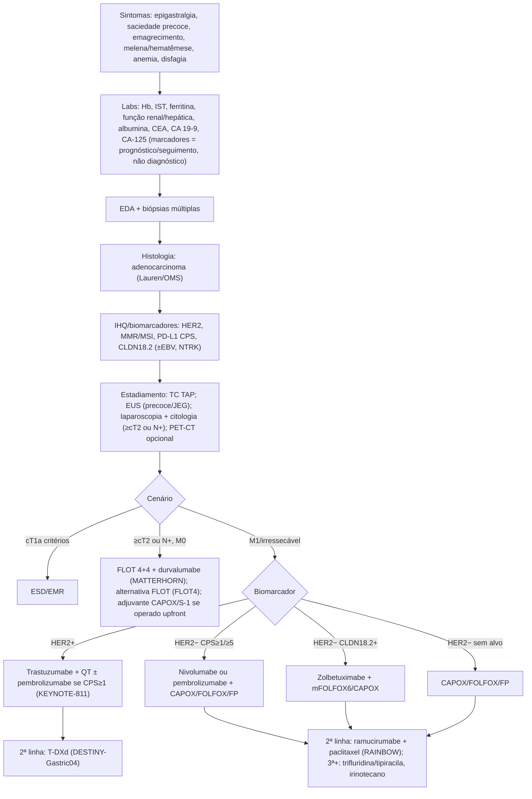
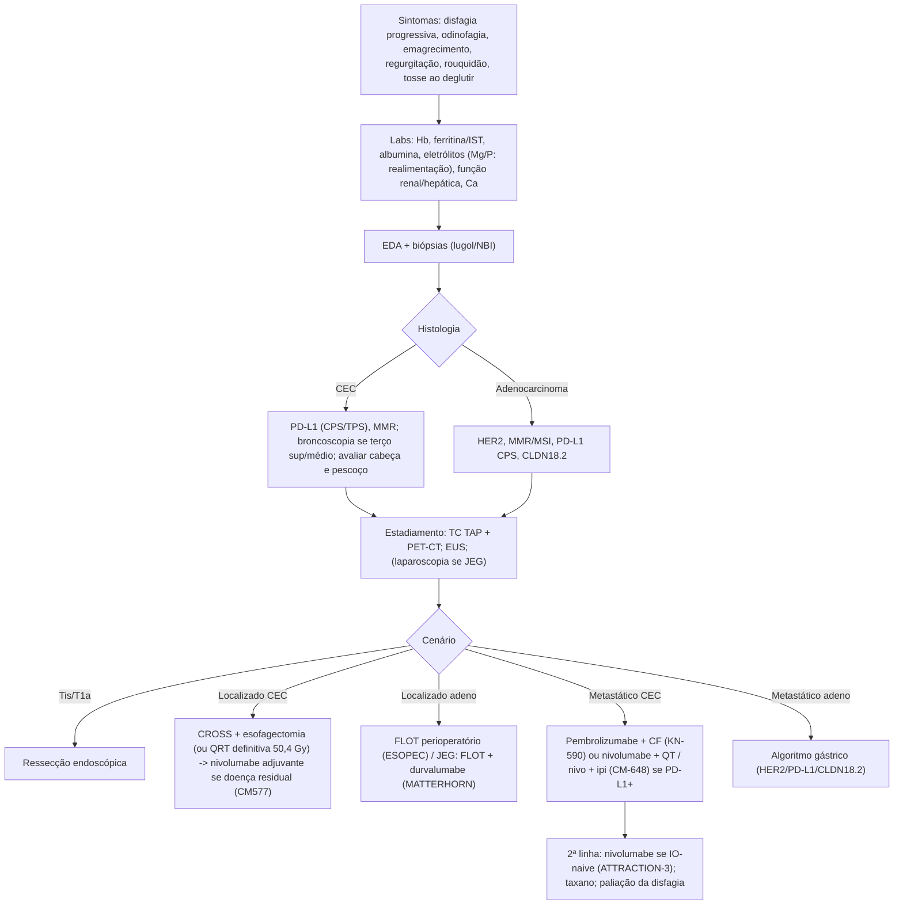
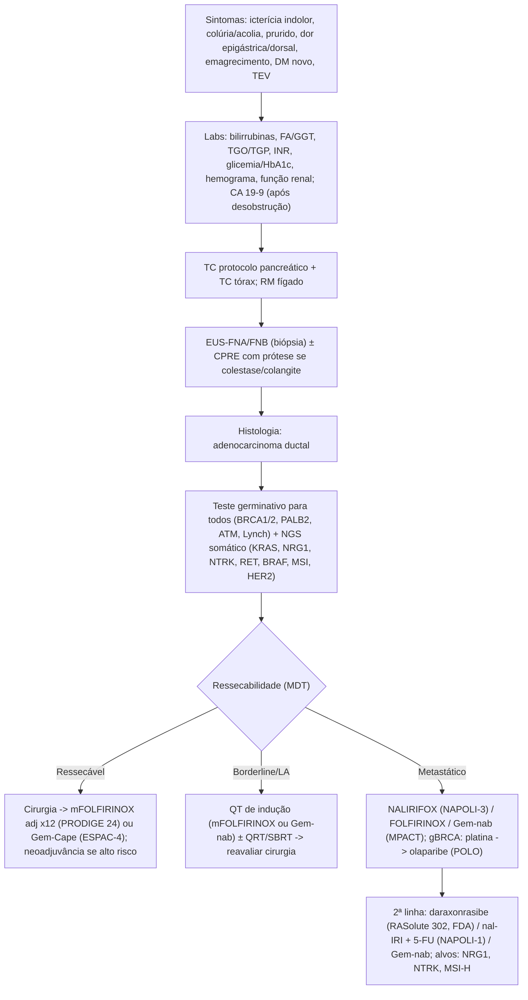
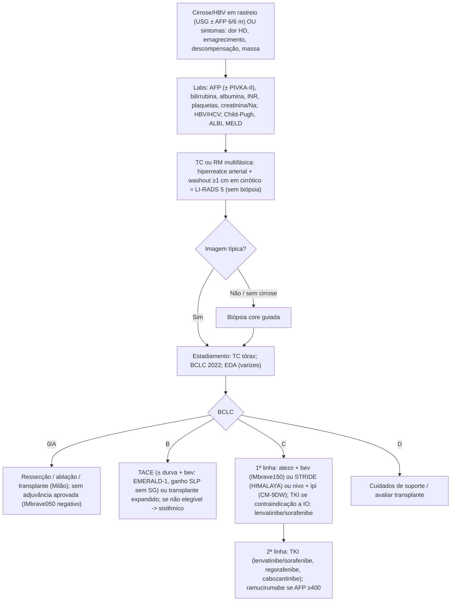
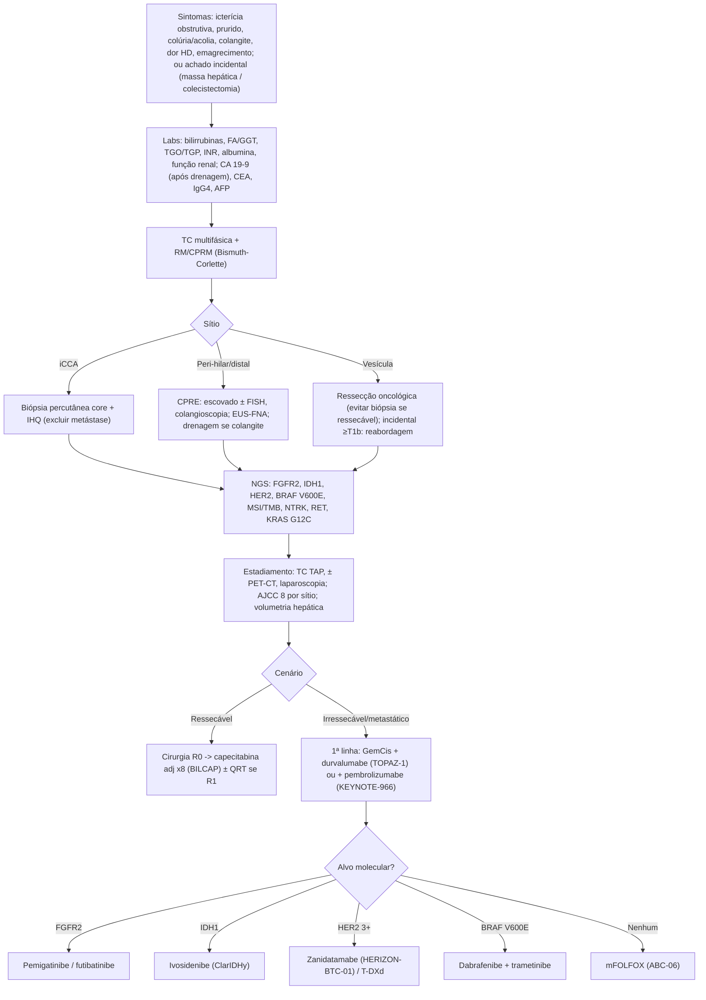
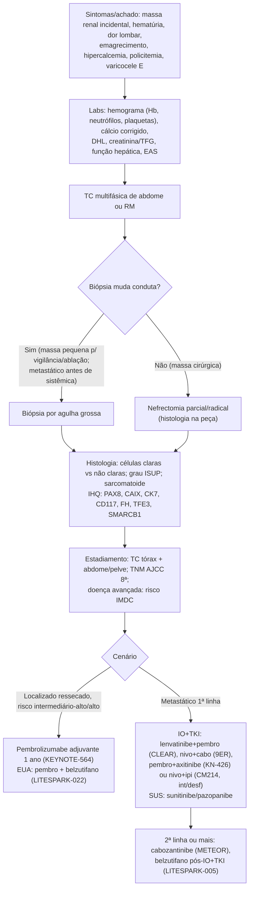
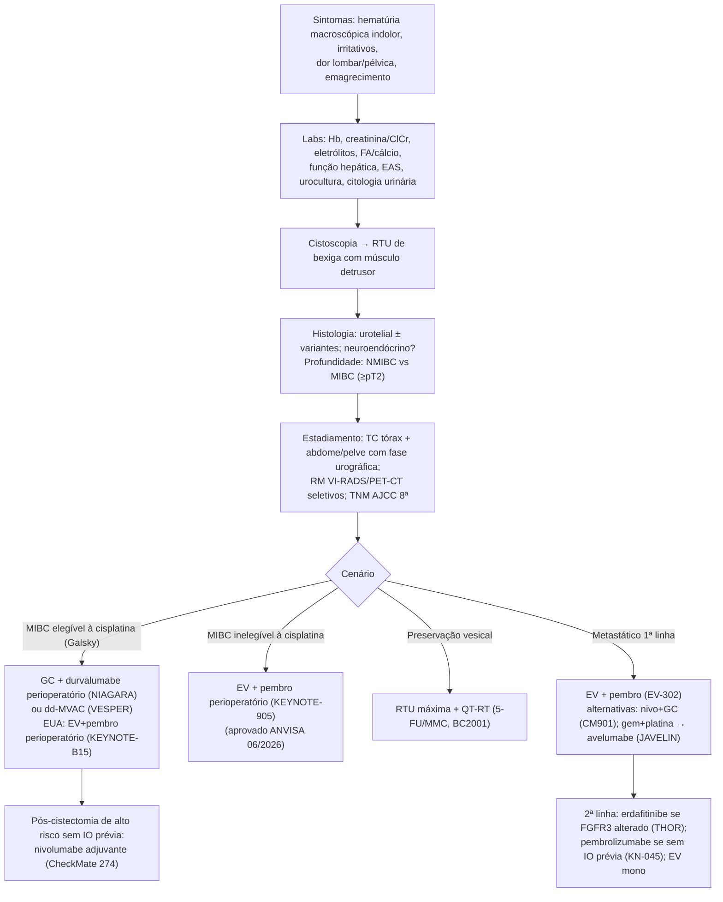
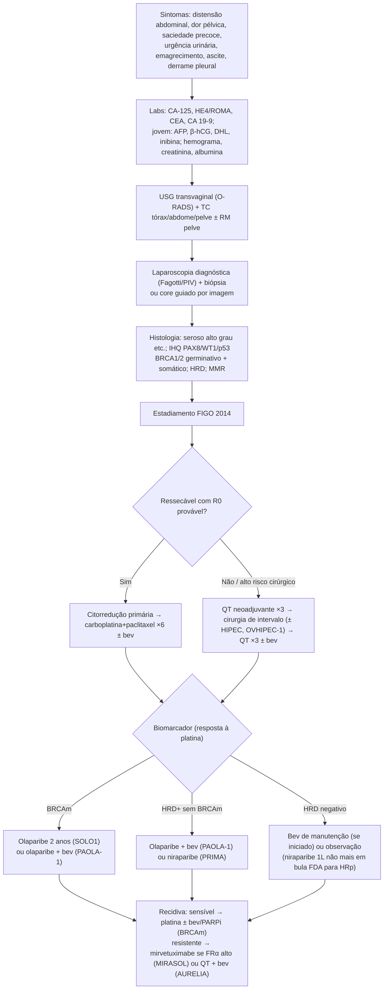
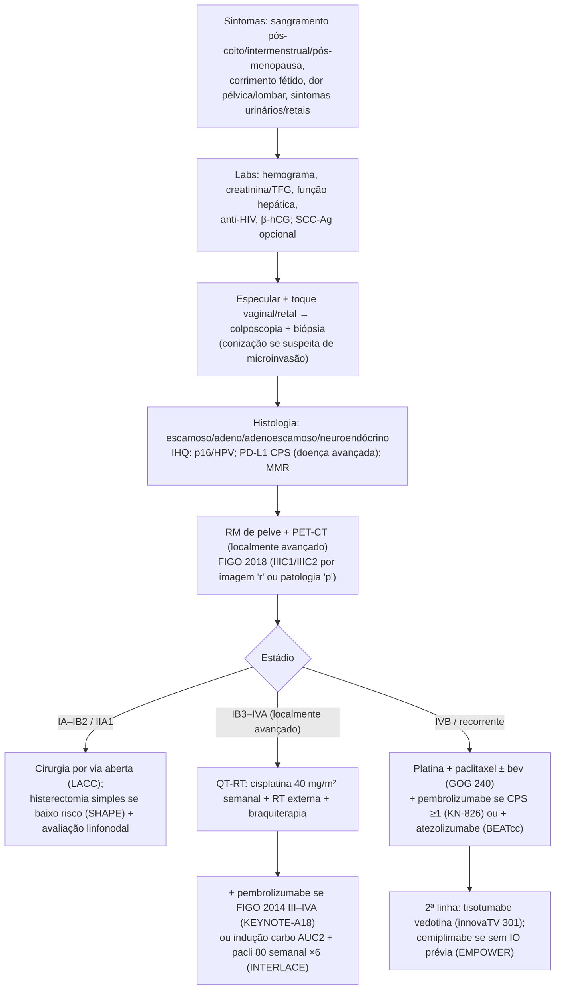
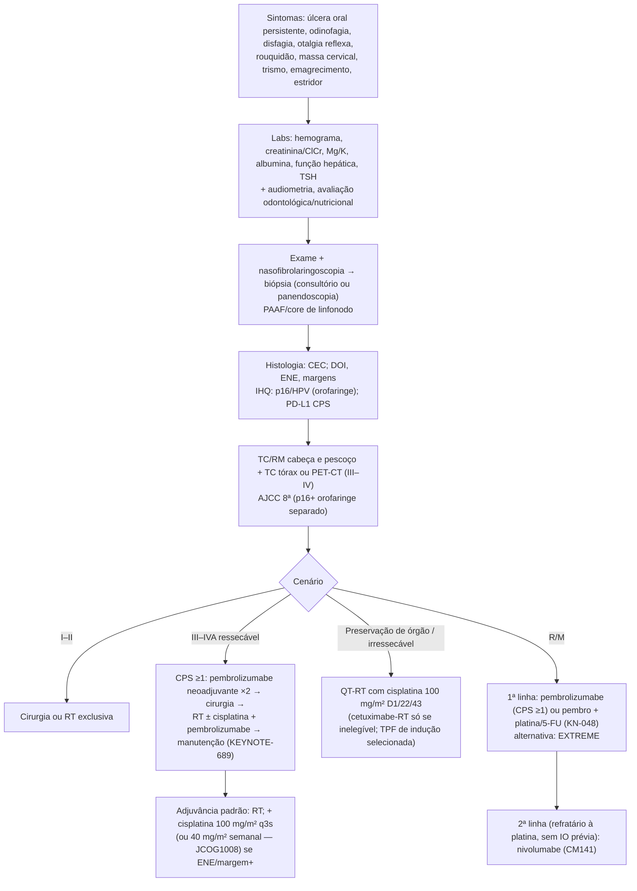

> **Material de referência — revisar antes de uso clínico.**

Compilação dos arquivos de referência 01–07 (fontes consultadas em 2026-10-06). O conteúdo clínico, números, doses, links e marcações NÃO_VERIFICADO foram mantidos exatamente como nos arquivos-fonte; apenas a montagem e a formatação foram ajustadas.

## Sumário {.unnumbered .unlisted}

1. [SIGTAP — 50 procedimentos](#sigtap)
2. [CTCAE v6 — 50 termos](#ctcae)
3. [Interações QT × fármacos — 30 interações](#interacoes)
4. [Receitas de doenças comuns — 50 receitas-modelo](#receitas)
5. [Comorbidades impeditivas de QT — 30 condições](#comorbidades)
6. [Tumor-packs — 10 tumores (gástrico, esôfago, pâncreas, CHC, vias biliares, rim, bexiga, ovário, colo do útero, cabeça e pescoço)](#tumor-packs)
7. [Pendências NÃO_VERIFICADO (resumo consolidado)](#pendencias)

# 1. SIGTAP — 50 procedimentos {#sigtap}

## SIGTAP — 50 procedimentos relevantes para a prática em oncologia clínica


### Competência utilizada: **09/2026**

- **Competência vigente no site:** a lista de competências da tela de consulta do SIGTAP (`/sec/procedimento/publicados/consultar`) mostrava **09/2026** como a mais recente quando consultei em 2026-10-06. A URL de detalhe com 10/2026 volta vazia, ou seja, essa competência ainda não estava publicada.
- **Fonte dos dados:** arquivo oficial `TabelaUnificada_202609_v2610050950.zip`, publicado em 05/10/2026 em `ftp://ftp2.datasus.gov.br/pub/sistemas/tup/downloads/`. Usei as tabelas `tb_procedimento`, `tb_grupo`, `tb_sub_grupo`, `tb_forma_organizacao`, `tb_registro`, `rl_procedimento_registro` e `tb_financiamento`. Todos os registros têm `DT_COMPETENCIA = 202609`.
- **Verificação dos links:** abri todos os 52 links (os 50 procedimentos e os 2 extras) no site oficial do SIGTAP em 2026-10-06. Todos retornaram HTTP 200 e exibiram o procedimento correto. Também conferi automaticamente o código, o nome, a competência 09/2026 e os valores SA/SH/SP: estão idênticos aos do arquivo oficial.
- **Padrão de link (confirmado):** `http://sigtap.datasus.gov.br/tabela-unificada/app/sec/procedimento/exibir/<código 10 dígitos>/<MM>/<AAAA>`
  - **Atenção:** o SIGTAP exige "acesso público" (sessão anônima). Em um navegador sem sessão aberta, o link pode levar primeiro à página inicial. Nesse caso, clique em **"Acessar o Sigtap"**: o site redireciona para o procedimento. Página de busca alternativa: http://sigtap.datasus.gov.br/tabela-unificada/app/sec/procedimento/publicados/consultar
- **Valores (R$):** SA = Serviço Ambulatorial (equivale ao "Total Ambulatorial"); SH = Serviço Hospitalar; SP = Serviço Profissional; Total Hosp. = SH + SP. Os valores de QT/RT em APAC são por competência (mês). Os valores de AIH são por internação/procedimento.
- **Instrumento de registro:** como consta no SIGTAP (BPA consolidado/individualizado, APAC principal/secundário, AIH principal/especial/secundário).
- **Não encontrado:** **CA 19-9** não tem código específico no SIGTAP 09/2026. Busquei "CA 19", "19-9" e "marcador tumoral" no nome e na descrição dos procedimentos, sem resultado. Também não há código de CA 15-3 com esse nome. Não inventei código para nenhum deles.
- **Recorte:** QT/hormonioterapia/RT de oncologia clínica (subgrupo 03.04), com ênfase em estômago, esôfago, pâncreas, fígado/vias biliares, rim, bexiga/urotélio, ovário, colo uterino e cabeça e pescoço; consulta especializada; diagnóstico (02.xx); cirurgias oncológicas (04.16). Linhas de hematologia ficaram de fora.

### Resumo por categoria

| Categoria | Qtde |
|---|---|
| Consulta (03.01) | 1 |
| Quimio/hormonioterapia e gerais em oncologia (03.04) | 23 |
| Radioterapia (03.04.01) | 2 |
| Diagnóstico (02.xx) | 16 |
| Cirurgia em oncologia (04.16) | 8 |
| **Total** | **50** |

### Tabela resumida

| # | Código | Procedimento | SA | SH | SP | Total Hosp. | Instrumento | Link |
|---|---|---|---|---|---|---|---|---|
| 1 | 03.01.01.007-2 | CONSULTA MEDICA EM ATENÇÃO ESPECIALIZADA | R$ 10,00 | R$ 0,00 | R$ 0,00 | R$ 0,00 | BPA (Consolidado); BPA (Individualizado); APAC (Proc. Secundário) | [SIGTAP](http://sigtap.datasus.gov.br/tabela-unificada/app/sec/procedimento/exibir/0301010072/09/2026) |
| 2 | 03.04.02.004-4 | QUIMIOTERAPIA DO ADENOCARCINOMA DE ESTÔMAGO AVANÇADO | R$ 571,50 | R$ 0,00 | R$ 0,00 | R$ 0,00 | APAC (Proc. Principal) | [SIGTAP](http://sigtap.datasus.gov.br/tabela-unificada/app/sec/procedimento/exibir/0304020044/09/2026) |
| 3 | 03.04.04.017-7 | QUIMIOTERAPIA DO ADENOCARCINOMA DE ESTÔMAGO (PRÉ-OPERATÓRIA) | R$ 1.300,00 | R$ 0,00 | R$ 0,00 | R$ 0,00 | APAC (Proc. Principal) | [SIGTAP](http://sigtap.datasus.gov.br/tabela-unificada/app/sec/procedimento/exibir/0304040177/09/2026) |
| 4 | 03.04.05.025-3 | QUIMIOTERAPIA DO ADENOCARCINOMA DE ESTÔMAGO (PÓS OPERATÓRIA) | R$ 571,50 | R$ 0,00 | R$ 0,00 | R$ 0,00 | APAC (Proc. Principal) | [SIGTAP](http://sigtap.datasus.gov.br/tabela-unificada/app/sec/procedimento/exibir/0304050253/09/2026) |
| 5 | 03.04.02.017-6 | QUIMIOTERAPIA DO CARCINOMA EPIDERMÓIDE / ADENOCARCINOMA DE ESÔFAGO AVANÇADO | R$ 571,50 | R$ 0,00 | R$ 0,00 | R$ 0,00 | APAC (Proc. Principal) | [SIGTAP](http://sigtap.datasus.gov.br/tabela-unificada/app/sec/procedimento/exibir/0304020176/09/2026) |
| 6 | 03.04.04.011-8 | QUIMIOTERAPIA DE CARCINOMA EPIDERMÓIDE / ADENOCARCINOMA DE ESÔFAGO | R$ 1.300,00 | R$ 0,00 | R$ 0,00 | R$ 0,00 | APAC (Proc. Principal) | [SIGTAP](http://sigtap.datasus.gov.br/tabela-unificada/app/sec/procedimento/exibir/0304040118/09/2026) |
| 7 | 03.04.02.005-2 | QUIMIOTERAPIA DO ADENOCARCINOMA DE PÂNCREAS AVANÇADO | R$ 1.986,00 | R$ 0,00 | R$ 0,00 | R$ 0,00 | APAC (Proc. Principal) | [SIGTAP](http://sigtap.datasus.gov.br/tabela-unificada/app/sec/procedimento/exibir/0304020052/09/2026) |
| 8 | 03.04.02.038-9 | QUIMIOTERAPIA DE CARCINOMA DO FÍGADO OU DO TRATO BILIAR AVANÇADO | R$ 571,50 | R$ 0,00 | R$ 0,00 | R$ 0,00 | APAC (Proc. Principal) | [SIGTAP](http://sigtap.datasus.gov.br/tabela-unificada/app/sec/procedimento/exibir/0304020389/09/2026) |
| 9 | 03.04.02.016-8 | QUIMIOTERAPIA DO CARCINOMA DE RIM AVANÇADO | R$ 3.311,50 | R$ 0,00 | R$ 0,00 | R$ 0,00 | APAC (Proc. Principal) | [SIGTAP](http://sigtap.datasus.gov.br/tabela-unificada/app/sec/procedimento/exibir/0304020168/09/2026) |
| 10 | 03.04.02.040-0 | QUIMIOTERAPIA DE CARCINOMA UROTELIAL AVANÇADO | R$ 1.300,00 | R$ 0,00 | R$ 0,00 | R$ 0,00 | APAC (Proc. Principal) | [SIGTAP](http://sigtap.datasus.gov.br/tabela-unificada/app/sec/procedimento/exibir/0304020400/09/2026) |
| 11 | 03.04.04.007-0 | QUIMIOTERAPIA DO CARCINOMA DE BEXIGA | R$ 1.300,00 | R$ 0,00 | R$ 0,00 | R$ 0,00 | APAC (Proc. Principal) | [SIGTAP](http://sigtap.datasus.gov.br/tabela-unificada/app/sec/procedimento/exibir/0304040070/09/2026) |
| 12 | 03.04.02.027-3 | QUIMIOTERAPIA DE NEOPLASIA MALIGNA EPITELIAL DE OVÁRIO OU DE TUBA UTERINA AVANÇADA -1ª LINHA. | R$ 1.450,00 | R$ 0,00 | R$ 0,00 | R$ 0,00 | APAC (Proc. Principal) | [SIGTAP](http://sigtap.datasus.gov.br/tabela-unificada/app/sec/procedimento/exibir/0304020273/09/2026) |
| 13 | 03.04.04.014-2 | QUIMIOTERAPIA DE NEOPLASIA MALIGNA EPITELIAL DE OVÁRIO OU DA TUBA UTERINA - 1ª LINHA | R$ 1.450,00 | R$ 0,00 | R$ 0,00 | R$ 0,00 | APAC (Proc. Principal) | [SIGTAP](http://sigtap.datasus.gov.br/tabela-unificada/app/sec/procedimento/exibir/0304040142/09/2026) |
| 14 | 03.04.05.020-2 | QUIMIOTERAPIA DE NEOPLASIA MALIGNA EPITELIAL DE OVÁRIO OU DA TUBA UTERINA | R$ 1.450,00 | R$ 0,00 | R$ 0,00 | R$ 0,00 | APAC (Proc. Principal) | [SIGTAP](http://sigtap.datasus.gov.br/tabela-unificada/app/sec/procedimento/exibir/0304050202/09/2026) |
| 15 | 03.04.02.018-4 | QUIMIOTERAPIA DA NEOPLASIA MALIGNA AVANÇADA DO COLO OU DO CORPO UTERINO AVANÇADO, VULVA E VAGINA. | R$ 571,50 | R$ 0,00 | R$ 0,00 | R$ 0,00 | APAC (Proc. Principal) | [SIGTAP](http://sigtap.datasus.gov.br/tabela-unificada/app/sec/procedimento/exibir/0304020184/09/2026) |
| 16 | 03.04.04.004-5 | QUIMIOTERAPIA DO CARCINOMA EPIDERMÓIDE / ADENOCARCINOMA DO COLO UTERINO | R$ 1.300,00 | R$ 0,00 | R$ 0,00 | R$ 0,00 | APAC (Proc. Principal) | [SIGTAP](http://sigtap.datasus.gov.br/tabela-unificada/app/sec/procedimento/exibir/0304040045/09/2026) |
| 17 | 03.04.02.020-6 | QUIMIOTERAPIA DO CARCINOMA EPIDERMÓIDE DE CABEÇA E PESCOÇO AVANÇADO | R$ 800,00 | R$ 0,00 | R$ 0,00 | R$ 0,00 | APAC (Proc. Principal) | [SIGTAP](http://sigtap.datasus.gov.br/tabela-unificada/app/sec/procedimento/exibir/0304020206/09/2026) |
| 18 | 03.04.04.006-1 | QUIMIOTERAPIA DO CARCINOMA EPIDERMÓIDE DE SEIO PARA-NASAL/ LARINGE / HIPOFARINGE/ OROFARINGE /CAVIDADE ORAL | R$ 1.300,00 | R$ 0,00 | R$ 0,00 | R$ 0,00 | APAC (Proc. Principal) | [SIGTAP](http://sigtap.datasus.gov.br/tabela-unificada/app/sec/procedimento/exibir/0304040061/09/2026) |
| 19 | 03.04.02.015-0 | QUIMIOTERAPIA DO CARCINOMA DE NASOFARINGE AVANÇADO | R$ 571,50 | R$ 0,00 | R$ 0,00 | R$ 0,00 | APAC (Proc. Principal) | [SIGTAP](http://sigtap.datasus.gov.br/tabela-unificada/app/sec/procedimento/exibir/0304020150/09/2026) |
| 20 | 03.04.02.001-0 | QUIMIOTERAPIA DO ADENOCARCINOMA DE COLON AVANÇADO -1ª LINHA | R$ 2.224,00 | R$ 0,00 | R$ 0,00 | R$ 0,00 | APAC (Proc. Principal) | [SIGTAP](http://sigtap.datasus.gov.br/tabela-unificada/app/sec/procedimento/exibir/0304020010/09/2026) |
| 21 | 03.04.02.021-4 | QUIMIOTERAPIA DO CARCINOMA PULMONAR DE CÉLULAS NÃO PEQUENAS AVANÇADO | R$ 1.100,00 | R$ 0,00 | R$ 0,00 | R$ 0,00 | APAC (Proc. Principal) | [SIGTAP](http://sigtap.datasus.gov.br/tabela-unificada/app/sec/procedimento/exibir/0304020214/09/2026) |
| 22 | 03.04.02.007-9 | HORMONIOTERAPIA DO ADENOCARCINOMA DE PRÓSTATA AVANÇADO - 1ª LINHA | R$ 301,50 | R$ 0,00 | R$ 0,00 | R$ 0,00 | APAC (Proc. Principal) | [SIGTAP](http://sigtap.datasus.gov.br/tabela-unificada/app/sec/procedimento/exibir/0304020079/09/2026) |
| 23 | 03.04.01.037-5 | RADIOTERAPIA DO APARELHO DIGESTIVO | R$ 4.148,00 | R$ 0,00 | R$ 0,00 | R$ 0,00 | APAC (Proc. Principal) | [SIGTAP](http://sigtap.datasus.gov.br/tabela-unificada/app/sec/procedimento/exibir/0304010375/09/2026) |
| 24 | 03.04.01.036-7 | RADIOTERAPIA DE CABEÇA E PESCOÇO | R$ 4.168,00 | R$ 0,00 | R$ 0,00 | R$ 0,00 | APAC (Proc. Principal) | [SIGTAP](http://sigtap.datasus.gov.br/tabela-unificada/app/sec/procedimento/exibir/0304010367/09/2026) |
| 25 | 03.04.08.007-1 | INIBIDOR DA OSTEÓLISE | R$ 449,50 | R$ 0,00 | R$ 0,00 | R$ 0,00 | APAC (Proc. Principal); APAC (Proc. Secundário) | [SIGTAP](http://sigtap.datasus.gov.br/tabela-unificada/app/sec/procedimento/exibir/0304080071/09/2026) |
| 26 | 03.04.10.001-3 | TRATAMENTO DE INTERCORRÊNCIAS CLÍNICAS DE PACIENTE ONCOLÓGICO | R$ 0,00 | R$ 37,78 | R$ 8,15 | R$ 45,93 | AIH (Proc. Principal) | [SIGTAP](http://sigtap.datasus.gov.br/tabela-unificada/app/sec/procedimento/exibir/0304100013/09/2026) |
| 27 | 02.01.01.054-2 | BIOPSIA PERCUTÂNEA ORIENTADA POR TOMOGRAFIA COMPUTADORIZADA / ULTRASSONOGRAFIA / RESSONÂNCIA MAGNÉTICA / RAIO X | R$ 97,00 | R$ 97,00 | R$ 0,00 | R$ 97,00 | BPA (Individualizado); AIH (Proc. Especial) | [SIGTAP](http://sigtap.datasus.gov.br/tabela-unificada/app/sec/procedimento/exibir/0201010542/09/2026) |
| 28 | 02.01.01.021-6 | BIOPSIA DE FIGADO POR PUNCAO | R$ 71,15 | R$ 71,15 | R$ 0,00 | R$ 71,15 | BPA (Individualizado); AIH (Proc. Especial) | [SIGTAP](http://sigtap.datasus.gov.br/tabela-unificada/app/sec/procedimento/exibir/0201010216/09/2026) |
| 29 | 02.03.02.003-0 | EXAME ANATOMO-PATOLÓGICO PARA CONGELAMENTO / PARAFINA POR PEÇA CIRURGICA OU POR BIOPSIA (EXCETO COLO UTERINO E MAMA) | R$ 40,78 | R$ 40,78 | R$ 0,00 | R$ 40,78 | BPA (Individualizado); AIH (Proc. Especial); APAC (Proc. Secundário) | [SIGTAP](http://sigtap.datasus.gov.br/tabela-unificada/app/sec/procedimento/exibir/0203020030/09/2026) |
| 30 | 02.03.02.004-9 | IMUNOHISTOQUIMICA DE NEOPLASIAS MALIGNAS (POR MARCADOR) | R$ 131,52 | R$ 131,52 | R$ 0,00 | R$ 131,52 | BPA (Individualizado); AIH (Proc. Especial); APAC (Proc. Secundário) | [SIGTAP](http://sigtap.datasus.gov.br/tabela-unificada/app/sec/procedimento/exibir/0203020049/09/2026) |
| 31 | 02.06.02.003-1 | TOMOGRAFIA COMPUTADORIZADA DE TORAX | R$ 136,41 | R$ 136,41 | R$ 0,00 | R$ 136,41 | BPA (Individualizado); AIH (Proc. Especial); APAC (Proc. Principal); APAC (Proc. Secundário) | [SIGTAP](http://sigtap.datasus.gov.br/tabela-unificada/app/sec/procedimento/exibir/0206020031/09/2026) |
| 32 | 02.06.03.001-0 | TOMOGRAFIA COMPUTADORIZADA DE ABDOMEN SUPERIOR | R$ 138,63 | R$ 138,63 | R$ 0,00 | R$ 138,63 | BPA (Individualizado); AIH (Proc. Especial); APAC (Proc. Principal); APAC (Proc. Secundário) | [SIGTAP](http://sigtap.datasus.gov.br/tabela-unificada/app/sec/procedimento/exibir/0206030010/09/2026) |
| 33 | 02.06.03.003-7 | TOMOGRAFIA COMPUTADORIZADA DE PELVE / BACIA / ABDOMEN INFERIOR | R$ 138,63 | R$ 138,63 | R$ 0,00 | R$ 138,63 | BPA (Individualizado); AIH (Proc. Especial); APAC (Proc. Principal); APAC (Proc. Secundário) | [SIGTAP](http://sigtap.datasus.gov.br/tabela-unificada/app/sec/procedimento/exibir/0206030037/09/2026) |
| 34 | 02.07.03.001-4 | RESSONANCIA MAGNETICA DE ABDOMEN SUPERIOR | R$ 268,75 | R$ 268,75 | R$ 0,00 | R$ 268,75 | BPA (Individualizado); AIH (Proc. Especial); APAC (Proc. Principal) | [SIGTAP](http://sigtap.datasus.gov.br/tabela-unificada/app/sec/procedimento/exibir/0207030014/09/2026) |
| 35 | 02.08.05.003-5 | CINTILOGRAFIA DE OSSOS COM OU SEM FLUXO SANGUÍNEO (CORPO INTEIRO) | R$ 190,99 | R$ 190,99 | R$ 0,00 | R$ 190,99 | BPA (Individualizado); AIH (Proc. Especial); APAC (Proc. Principal) | [SIGTAP](http://sigtap.datasus.gov.br/tabela-unificada/app/sec/procedimento/exibir/0208050035/09/2026) |
| 36 | 02.06.01.009-5 | TOMOGRAFIA POR EMISSÃO DE PÓSITRONS (PET-CT) | R$ 2.107,22 | R$ 0,00 | R$ 0,00 | R$ 0,00 | APAC (Proc. Principal) | [SIGTAP](http://sigtap.datasus.gov.br/tabela-unificada/app/sec/procedimento/exibir/0206010095/09/2026) |
| 37 | 02.09.01.003-7 | ESOFAGOGASTRODUODENOSCOPIA | R$ 48,16 | R$ 48,16 | R$ 0,00 | R$ 48,16 | BPA (Individualizado); AIH (Proc. Especial); APAC (Proc. Principal); APAC (Proc. Secundário) | [SIGTAP](http://sigtap.datasus.gov.br/tabela-unificada/app/sec/procedimento/exibir/0209010037/09/2026) |
| 38 | 02.09.01.002-9 | COLONOSCOPIA (COLOSCOPIA) | R$ 112,66 | R$ 112,66 | R$ 0,00 | R$ 112,66 | BPA (Individualizado); AIH (Proc. Especial); APAC (Proc. Principal); APAC (Proc. Secundário) | [SIGTAP](http://sigtap.datasus.gov.br/tabela-unificada/app/sec/procedimento/exibir/0209010029/09/2026) |
| 39 | 02.02.03.096-2 | PESQUISA DE ANTIGENO CARCINOEMBRIONARIO (CEA) | R$ 13,35 | R$ 0,00 | R$ 0,00 | R$ 0,00 | BPA (Consolidado); BPA (Individualizado); AIH (Proc. Secundário) | [SIGTAP](http://sigtap.datasus.gov.br/tabela-unificada/app/sec/procedimento/exibir/0202030962/09/2026) |
| 40 | 02.02.03.121-7 | DOSAGEM DO ANTÍGENO CA 125 | R$ 13,35 | R$ 0,00 | R$ 0,00 | R$ 0,00 | BPA (Consolidado); BPA (Individualizado) | [SIGTAP](http://sigtap.datasus.gov.br/tabela-unificada/app/sec/procedimento/exibir/0202031217/09/2026) |
| 41 | 02.02.03.009-1 | DOSAGEM DE ALFA-FETOPROTEINA | R$ 15,06 | R$ 0,00 | R$ 0,00 | R$ 0,00 | BPA (Consolidado); BPA (Individualizado); AIH (Proc. Secundário) | [SIGTAP](http://sigtap.datasus.gov.br/tabela-unificada/app/sec/procedimento/exibir/0202030091/09/2026) |
| 42 | 02.02.03.010-5 | DOSAGEM DE ANTIGENO PROSTATICO ESPECIFICO (PSA) | R$ 16,42 | R$ 0,00 | R$ 0,00 | R$ 0,00 | BPA (Consolidado); BPA (Individualizado); AIH (Proc. Secundário); APAC (Proc. Secundário) | [SIGTAP](http://sigtap.datasus.gov.br/tabela-unificada/app/sec/procedimento/exibir/0202030105/09/2026) |
| 43 | 04.16.04.007-1 | GASTRECTOMIA TOTAL EM ONCOLOGIA | R$ 0,00 | R$ 2.762,03 | R$ 732,25 | R$ 3.494,28 | AIH (Proc. Principal) | [SIGTAP](http://sigtap.datasus.gov.br/tabela-unificada/app/sec/procedimento/exibir/0416040071/09/2026) |
| 44 | 04.16.04.003-9 | ESOFAGOGASTRECTOMIA COM TORACOTOMIA EM ONCOLOGIA | R$ 0,00 | R$ 4.156,05 | R$ 1.220,48 | R$ 5.376,53 | AIH (Proc. Principal) | [SIGTAP](http://sigtap.datasus.gov.br/tabela-unificada/app/sec/procedimento/exibir/0416040039/09/2026) |
| 45 | 04.16.04.012-8 | DUODENOPANCREATECTOMIA EM ONCOLOGIA | R$ 0,00 | R$ 4.300,74 | R$ 1.206,29 | R$ 5.507,03 | AIH (Proc. Principal) | [SIGTAP](http://sigtap.datasus.gov.br/tabela-unificada/app/sec/procedimento/exibir/0416040128/09/2026) |
| 46 | 04.16.04.010-1 | HEPATECTOMIA PARCIAL EM ONCOLOGIA | R$ 0,00 | R$ 1.584,43 | R$ 541,01 | R$ 2.125,44 | AIH (Proc. Principal) | [SIGTAP](http://sigtap.datasus.gov.br/tabela-unificada/app/sec/procedimento/exibir/0416040101/09/2026) |
| 47 | 04.16.01.007-5 | NEFRECTOMIA TOTAL EM ONCOLOGIA | R$ 0,00 | R$ 1.316,39 | R$ 436,91 | R$ 1.753,30 | AIH (Proc. Principal) | [SIGTAP](http://sigtap.datasus.gov.br/tabela-unificada/app/sec/procedimento/exibir/0416010075/09/2026) |
| 48 | 04.16.01.002-4 | CISTECTOMIA COM DERIVACAO EM 1SÓ TEMPO EM ONCOLOGIA | R$ 0,00 | R$ 3.167,58 | R$ 894,87 | R$ 4.062,45 | AIH (Proc. Principal) | [SIGTAP](http://sigtap.datasus.gov.br/tabela-unificada/app/sec/procedimento/exibir/0416010024/09/2026) |
| 49 | 04.16.06.006-4 | HISTERECTOMIA TOTAL AMPLIADA EM ONCOLOGIA | R$ 0,00 | R$ 4.238,50 | R$ 1.164,93 | R$ 5.403,43 | AIH (Proc. Principal) | [SIGTAP](http://sigtap.datasus.gov.br/tabela-unificada/app/sec/procedimento/exibir/0416060064/09/2026) |
| 50 | 04.16.03.026-2 | LARINGECTOMIA TOTAL EM ONCOLOGIA | R$ 0,00 | R$ 4.605,92 | R$ 1.212,76 | R$ 5.818,68 | AIH (Proc. Principal) | [SIGTAP](http://sigtap.datasus.gov.br/tabela-unificada/app/sec/procedimento/exibir/0416030262/09/2026) |

### Detalhe com caminho completo na hierarquia

#### 1. 03.01.01.007-2 — CONSULTA MEDICA EM ATENÇÃO ESPECIALIZADA
- **Categoria:** Consulta
- **Caminho:** Grupo 03 - Procedimentos clínicos > Subgrupo 01 - Consultas / Atendimentos / Acompanhamentos > Forma de organização 01 - Consultas médicas/outros profissionais  de nivel superior > Procedimento 03.01.01.007-2 - CONSULTA MEDICA EM ATENÇÃO ESPECIALIZADA
- **Valores (09/2026):** SA R$ 10,00 | SH R$ 0,00 | SP R$ 0,00 | Total hospitalar R$ 0,00
- **Instrumento de registro:** BPA (Consolidado); BPA (Individualizado); APAC (Proc. Secundário)
- **Financiamento:** Média e Alta Complexidade (MAC)
- **Link:** http://sigtap.datasus.gov.br/tabela-unificada/app/sec/procedimento/exibir/0301010072/09/2026 (verificado em 2026-10-06: SIM)

#### 2. 03.04.02.004-4 — QUIMIOTERAPIA DO ADENOCARCINOMA DE ESTÔMAGO AVANÇADO
- **Categoria:** QT paliativa – estômago
- **Caminho:** Grupo 03 - Procedimentos clínicos > Subgrupo 04 - Tratamento em oncologia > Forma de organização 02 - Quimioterapia paliativa - adulto > Procedimento 03.04.02.004-4 - QUIMIOTERAPIA DO ADENOCARCINOMA DE ESTÔMAGO AVANÇADO
- **Valores (09/2026):** SA R$ 571,50 | SH R$ 0,00 | SP R$ 0,00 | Total hospitalar R$ 0,00
- **Instrumento de registro:** APAC (Proc. Principal)
- **Financiamento:** Média e Alta Complexidade (MAC)
- **Link:** http://sigtap.datasus.gov.br/tabela-unificada/app/sec/procedimento/exibir/0304020044/09/2026 (verificado em 2026-10-06: SIM)

#### 3. 03.04.04.017-7 — QUIMIOTERAPIA DO ADENOCARCINOMA DE ESTÔMAGO (PRÉ-OPERATÓRIA)
- **Categoria:** QT prévia – estômago
- **Caminho:** Grupo 03 - Procedimentos clínicos > Subgrupo 04 - Tratamento em oncologia > Forma de organização 04 - Quimioterapia prévia (neoadjuvante/citorredutora)- adulto > Procedimento 03.04.04.017-7 - QUIMIOTERAPIA DO ADENOCARCINOMA DE ESTÔMAGO (PRÉ-OPERATÓRIA)
- **Valores (09/2026):** SA R$ 1.300,00 | SH R$ 0,00 | SP R$ 0,00 | Total hospitalar R$ 0,00
- **Instrumento de registro:** APAC (Proc. Principal)
- **Financiamento:** Média e Alta Complexidade (MAC)
- **Link:** http://sigtap.datasus.gov.br/tabela-unificada/app/sec/procedimento/exibir/0304040177/09/2026 (verificado em 2026-10-06: SIM)

#### 4. 03.04.05.025-3 — QUIMIOTERAPIA DO ADENOCARCINOMA DE ESTÔMAGO (PÓS OPERATÓRIA)
- **Categoria:** QT adjuvante – estômago
- **Caminho:** Grupo 03 - Procedimentos clínicos > Subgrupo 04 - Tratamento em oncologia > Forma de organização 05 - Quimioterapia adjuvante (profilática) - adulto > Procedimento 03.04.05.025-3 - QUIMIOTERAPIA DO ADENOCARCINOMA DE ESTÔMAGO (PÓS OPERATÓRIA)
- **Valores (09/2026):** SA R$ 571,50 | SH R$ 0,00 | SP R$ 0,00 | Total hospitalar R$ 0,00
- **Instrumento de registro:** APAC (Proc. Principal)
- **Financiamento:** Média e Alta Complexidade (MAC)
- **Link:** http://sigtap.datasus.gov.br/tabela-unificada/app/sec/procedimento/exibir/0304050253/09/2026 (verificado em 2026-10-06: SIM)

#### 5. 03.04.02.017-6 — QUIMIOTERAPIA DO CARCINOMA EPIDERMÓIDE / ADENOCARCINOMA DE ESÔFAGO AVANÇADO
- **Categoria:** QT paliativa – esôfago
- **Caminho:** Grupo 03 - Procedimentos clínicos > Subgrupo 04 - Tratamento em oncologia > Forma de organização 02 - Quimioterapia paliativa - adulto > Procedimento 03.04.02.017-6 - QUIMIOTERAPIA DO CARCINOMA EPIDERMÓIDE / ADENOCARCINOMA DE ESÔFAGO AVANÇADO
- **Valores (09/2026):** SA R$ 571,50 | SH R$ 0,00 | SP R$ 0,00 | Total hospitalar R$ 0,00
- **Instrumento de registro:** APAC (Proc. Principal)
- **Financiamento:** Média e Alta Complexidade (MAC)
- **Link:** http://sigtap.datasus.gov.br/tabela-unificada/app/sec/procedimento/exibir/0304020176/09/2026 (verificado em 2026-10-06: SIM)

#### 6. 03.04.04.011-8 — QUIMIOTERAPIA DE CARCINOMA EPIDERMÓIDE / ADENOCARCINOMA DE ESÔFAGO
- **Categoria:** QT prévia – esôfago
- **Caminho:** Grupo 03 - Procedimentos clínicos > Subgrupo 04 - Tratamento em oncologia > Forma de organização 04 - Quimioterapia prévia (neoadjuvante/citorredutora)- adulto > Procedimento 03.04.04.011-8 - QUIMIOTERAPIA DE CARCINOMA EPIDERMÓIDE / ADENOCARCINOMA DE ESÔFAGO
- **Valores (09/2026):** SA R$ 1.300,00 | SH R$ 0,00 | SP R$ 0,00 | Total hospitalar R$ 0,00
- **Instrumento de registro:** APAC (Proc. Principal)
- **Financiamento:** Média e Alta Complexidade (MAC)
- **Link:** http://sigtap.datasus.gov.br/tabela-unificada/app/sec/procedimento/exibir/0304040118/09/2026 (verificado em 2026-10-06: SIM)

#### 7. 03.04.02.005-2 — QUIMIOTERAPIA DO ADENOCARCINOMA DE PÂNCREAS AVANÇADO
- **Categoria:** QT paliativa – pâncreas
- **Caminho:** Grupo 03 - Procedimentos clínicos > Subgrupo 04 - Tratamento em oncologia > Forma de organização 02 - Quimioterapia paliativa - adulto > Procedimento 03.04.02.005-2 - QUIMIOTERAPIA DO ADENOCARCINOMA DE PÂNCREAS AVANÇADO
- **Valores (09/2026):** SA R$ 1.986,00 | SH R$ 0,00 | SP R$ 0,00 | Total hospitalar R$ 0,00
- **Instrumento de registro:** APAC (Proc. Principal)
- **Financiamento:** Média e Alta Complexidade (MAC)
- **Link:** http://sigtap.datasus.gov.br/tabela-unificada/app/sec/procedimento/exibir/0304020052/09/2026 (verificado em 2026-10-06: SIM)

#### 8. 03.04.02.038-9 — QUIMIOTERAPIA DE CARCINOMA DO FÍGADO OU DO TRATO BILIAR AVANÇADO
- **Categoria:** QT paliativa – fígado/vias biliares
- **Caminho:** Grupo 03 - Procedimentos clínicos > Subgrupo 04 - Tratamento em oncologia > Forma de organização 02 - Quimioterapia paliativa - adulto > Procedimento 03.04.02.038-9 - QUIMIOTERAPIA DE CARCINOMA DO FÍGADO OU DO TRATO BILIAR AVANÇADO
- **Valores (09/2026):** SA R$ 571,50 | SH R$ 0,00 | SP R$ 0,00 | Total hospitalar R$ 0,00
- **Instrumento de registro:** APAC (Proc. Principal)
- **Financiamento:** Média e Alta Complexidade (MAC)
- **Link:** http://sigtap.datasus.gov.br/tabela-unificada/app/sec/procedimento/exibir/0304020389/09/2026 (verificado em 2026-10-06: SIM)

#### 9. 03.04.02.016-8 — QUIMIOTERAPIA DO CARCINOMA DE RIM AVANÇADO
- **Categoria:** QT paliativa – rim
- **Caminho:** Grupo 03 - Procedimentos clínicos > Subgrupo 04 - Tratamento em oncologia > Forma de organização 02 - Quimioterapia paliativa - adulto > Procedimento 03.04.02.016-8 - QUIMIOTERAPIA DO CARCINOMA DE RIM AVANÇADO
- **Valores (09/2026):** SA R$ 3.311,50 | SH R$ 0,00 | SP R$ 0,00 | Total hospitalar R$ 0,00
- **Instrumento de registro:** APAC (Proc. Principal)
- **Financiamento:** Média e Alta Complexidade (MAC)
- **Link:** http://sigtap.datasus.gov.br/tabela-unificada/app/sec/procedimento/exibir/0304020168/09/2026 (verificado em 2026-10-06: SIM)

#### 10. 03.04.02.040-0 — QUIMIOTERAPIA DE CARCINOMA UROTELIAL AVANÇADO
- **Categoria:** QT paliativa – urotelial
- **Caminho:** Grupo 03 - Procedimentos clínicos > Subgrupo 04 - Tratamento em oncologia > Forma de organização 02 - Quimioterapia paliativa - adulto > Procedimento 03.04.02.040-0 - QUIMIOTERAPIA DE CARCINOMA UROTELIAL AVANÇADO
- **Valores (09/2026):** SA R$ 1.300,00 | SH R$ 0,00 | SP R$ 0,00 | Total hospitalar R$ 0,00
- **Instrumento de registro:** APAC (Proc. Principal)
- **Financiamento:** Média e Alta Complexidade (MAC)
- **Link:** http://sigtap.datasus.gov.br/tabela-unificada/app/sec/procedimento/exibir/0304020400/09/2026 (verificado em 2026-10-06: SIM)

#### 11. 03.04.04.007-0 — QUIMIOTERAPIA DO CARCINOMA DE BEXIGA
- **Categoria:** QT prévia – bexiga
- **Caminho:** Grupo 03 - Procedimentos clínicos > Subgrupo 04 - Tratamento em oncologia > Forma de organização 04 - Quimioterapia prévia (neoadjuvante/citorredutora)- adulto > Procedimento 03.04.04.007-0 - QUIMIOTERAPIA DO CARCINOMA DE BEXIGA
- **Valores (09/2026):** SA R$ 1.300,00 | SH R$ 0,00 | SP R$ 0,00 | Total hospitalar R$ 0,00
- **Instrumento de registro:** APAC (Proc. Principal)
- **Financiamento:** Média e Alta Complexidade (MAC)
- **Link:** http://sigtap.datasus.gov.br/tabela-unificada/app/sec/procedimento/exibir/0304040070/09/2026 (verificado em 2026-10-06: SIM)

#### 12. 03.04.02.027-3 — QUIMIOTERAPIA DE NEOPLASIA MALIGNA EPITELIAL DE OVÁRIO OU DE TUBA UTERINA AVANÇADA -1ª LINHA.
- **Categoria:** QT paliativa – ovário 1ª linha
- **Caminho:** Grupo 03 - Procedimentos clínicos > Subgrupo 04 - Tratamento em oncologia > Forma de organização 02 - Quimioterapia paliativa - adulto > Procedimento 03.04.02.027-3 - QUIMIOTERAPIA DE NEOPLASIA MALIGNA EPITELIAL DE OVÁRIO OU DE TUBA UTERINA AVANÇADA -1ª LINHA.
- **Valores (09/2026):** SA R$ 1.450,00 | SH R$ 0,00 | SP R$ 0,00 | Total hospitalar R$ 0,00
- **Instrumento de registro:** APAC (Proc. Principal)
- **Financiamento:** Média e Alta Complexidade (MAC)
- **Link:** http://sigtap.datasus.gov.br/tabela-unificada/app/sec/procedimento/exibir/0304020273/09/2026 (verificado em 2026-10-06: SIM)

#### 13. 03.04.04.014-2 — QUIMIOTERAPIA DE NEOPLASIA MALIGNA EPITELIAL DE OVÁRIO OU DA TUBA UTERINA - 1ª LINHA
- **Categoria:** QT prévia – ovário 1ª linha
- **Caminho:** Grupo 03 - Procedimentos clínicos > Subgrupo 04 - Tratamento em oncologia > Forma de organização 04 - Quimioterapia prévia (neoadjuvante/citorredutora)- adulto > Procedimento 03.04.04.014-2 - QUIMIOTERAPIA DE NEOPLASIA MALIGNA EPITELIAL DE OVÁRIO OU DA TUBA UTERINA - 1ª LINHA
- **Valores (09/2026):** SA R$ 1.450,00 | SH R$ 0,00 | SP R$ 0,00 | Total hospitalar R$ 0,00
- **Instrumento de registro:** APAC (Proc. Principal)
- **Financiamento:** Média e Alta Complexidade (MAC)
- **Link:** http://sigtap.datasus.gov.br/tabela-unificada/app/sec/procedimento/exibir/0304040142/09/2026 (verificado em 2026-10-06: SIM)

#### 14. 03.04.05.020-2 — QUIMIOTERAPIA DE NEOPLASIA MALIGNA EPITELIAL DE OVÁRIO OU DA TUBA UTERINA
- **Categoria:** QT adjuvante – ovário
- **Caminho:** Grupo 03 - Procedimentos clínicos > Subgrupo 04 - Tratamento em oncologia > Forma de organização 05 - Quimioterapia adjuvante (profilática) - adulto > Procedimento 03.04.05.020-2 - QUIMIOTERAPIA DE NEOPLASIA MALIGNA EPITELIAL DE OVÁRIO OU DA TUBA UTERINA
- **Valores (09/2026):** SA R$ 1.450,00 | SH R$ 0,00 | SP R$ 0,00 | Total hospitalar R$ 0,00
- **Instrumento de registro:** APAC (Proc. Principal)
- **Financiamento:** Média e Alta Complexidade (MAC)
- **Link:** http://sigtap.datasus.gov.br/tabela-unificada/app/sec/procedimento/exibir/0304050202/09/2026 (verificado em 2026-10-06: SIM)

#### 15. 03.04.02.018-4 — QUIMIOTERAPIA DA NEOPLASIA MALIGNA AVANÇADA DO COLO OU DO CORPO UTERINO AVANÇADO, VULVA E VAGINA.
- **Categoria:** QT paliativa – colo/corpo uterino, vulva, vagina
- **Caminho:** Grupo 03 - Procedimentos clínicos > Subgrupo 04 - Tratamento em oncologia > Forma de organização 02 - Quimioterapia paliativa - adulto > Procedimento 03.04.02.018-4 - QUIMIOTERAPIA DA NEOPLASIA MALIGNA AVANÇADA DO COLO OU DO CORPO UTERINO AVANÇADO, VULVA E VAGINA.
- **Valores (09/2026):** SA R$ 571,50 | SH R$ 0,00 | SP R$ 0,00 | Total hospitalar R$ 0,00
- **Instrumento de registro:** APAC (Proc. Principal)
- **Financiamento:** Média e Alta Complexidade (MAC)
- **Link:** http://sigtap.datasus.gov.br/tabela-unificada/app/sec/procedimento/exibir/0304020184/09/2026 (verificado em 2026-10-06: SIM)

#### 16. 03.04.04.004-5 — QUIMIOTERAPIA DO CARCINOMA EPIDERMÓIDE / ADENOCARCINOMA DO COLO UTERINO
- **Categoria:** QT prévia – colo uterino
- **Caminho:** Grupo 03 - Procedimentos clínicos > Subgrupo 04 - Tratamento em oncologia > Forma de organização 04 - Quimioterapia prévia (neoadjuvante/citorredutora)- adulto > Procedimento 03.04.04.004-5 - QUIMIOTERAPIA DO CARCINOMA EPIDERMÓIDE / ADENOCARCINOMA DO COLO UTERINO
- **Valores (09/2026):** SA R$ 1.300,00 | SH R$ 0,00 | SP R$ 0,00 | Total hospitalar R$ 0,00
- **Instrumento de registro:** APAC (Proc. Principal)
- **Financiamento:** Média e Alta Complexidade (MAC)
- **Link:** http://sigtap.datasus.gov.br/tabela-unificada/app/sec/procedimento/exibir/0304040045/09/2026 (verificado em 2026-10-06: SIM)

#### 17. 03.04.02.020-6 — QUIMIOTERAPIA DO CARCINOMA EPIDERMÓIDE DE CABEÇA E PESCOÇO AVANÇADO
- **Categoria:** QT paliativa – cabeça e pescoço
- **Caminho:** Grupo 03 - Procedimentos clínicos > Subgrupo 04 - Tratamento em oncologia > Forma de organização 02 - Quimioterapia paliativa - adulto > Procedimento 03.04.02.020-6 - QUIMIOTERAPIA DO CARCINOMA EPIDERMÓIDE DE CABEÇA E PESCOÇO AVANÇADO
- **Valores (09/2026):** SA R$ 800,00 | SH R$ 0,00 | SP R$ 0,00 | Total hospitalar R$ 0,00
- **Instrumento de registro:** APAC (Proc. Principal)
- **Financiamento:** Média e Alta Complexidade (MAC)
- **Link:** http://sigtap.datasus.gov.br/tabela-unificada/app/sec/procedimento/exibir/0304020206/09/2026 (verificado em 2026-10-06: SIM)

#### 18. 03.04.04.006-1 — QUIMIOTERAPIA DO CARCINOMA EPIDERMÓIDE DE SEIO PARA-NASAL/ LARINGE / HIPOFARINGE/ OROFARINGE /CAVIDADE ORAL
- **Categoria:** QT prévia – cabeça e pescoço
- **Caminho:** Grupo 03 - Procedimentos clínicos > Subgrupo 04 - Tratamento em oncologia > Forma de organização 04 - Quimioterapia prévia (neoadjuvante/citorredutora)- adulto > Procedimento 03.04.04.006-1 - QUIMIOTERAPIA DO CARCINOMA EPIDERMÓIDE DE SEIO PARA-NASAL/ LARINGE / HIPOFARINGE/ OROFARINGE /CAVIDADE ORAL
- **Valores (09/2026):** SA R$ 1.300,00 | SH R$ 0,00 | SP R$ 0,00 | Total hospitalar R$ 0,00
- **Instrumento de registro:** APAC (Proc. Principal)
- **Financiamento:** Média e Alta Complexidade (MAC)
- **Link:** http://sigtap.datasus.gov.br/tabela-unificada/app/sec/procedimento/exibir/0304040061/09/2026 (verificado em 2026-10-06: SIM)

#### 19. 03.04.02.015-0 — QUIMIOTERAPIA DO CARCINOMA DE NASOFARINGE AVANÇADO
- **Categoria:** QT paliativa – nasofaringe
- **Caminho:** Grupo 03 - Procedimentos clínicos > Subgrupo 04 - Tratamento em oncologia > Forma de organização 02 - Quimioterapia paliativa - adulto > Procedimento 03.04.02.015-0 - QUIMIOTERAPIA DO CARCINOMA DE NASOFARINGE AVANÇADO
- **Valores (09/2026):** SA R$ 571,50 | SH R$ 0,00 | SP R$ 0,00 | Total hospitalar R$ 0,00
- **Instrumento de registro:** APAC (Proc. Principal)
- **Financiamento:** Média e Alta Complexidade (MAC)
- **Link:** http://sigtap.datasus.gov.br/tabela-unificada/app/sec/procedimento/exibir/0304020150/09/2026 (verificado em 2026-10-06: SIM)

#### 20. 03.04.02.001-0 — QUIMIOTERAPIA DO ADENOCARCINOMA DE COLON AVANÇADO -1ª LINHA
- **Categoria:** QT paliativa – cólon 1ª linha
- **Caminho:** Grupo 03 - Procedimentos clínicos > Subgrupo 04 - Tratamento em oncologia > Forma de organização 02 - Quimioterapia paliativa - adulto > Procedimento 03.04.02.001-0 - QUIMIOTERAPIA DO ADENOCARCINOMA DE COLON AVANÇADO -1ª LINHA
- **Valores (09/2026):** SA R$ 2.224,00 | SH R$ 0,00 | SP R$ 0,00 | Total hospitalar R$ 0,00
- **Instrumento de registro:** APAC (Proc. Principal)
- **Financiamento:** Média e Alta Complexidade (MAC)
- **Link:** http://sigtap.datasus.gov.br/tabela-unificada/app/sec/procedimento/exibir/0304020010/09/2026 (verificado em 2026-10-06: SIM)

#### 21. 03.04.02.021-4 — QUIMIOTERAPIA DO CARCINOMA PULMONAR DE CÉLULAS NÃO PEQUENAS AVANÇADO
- **Categoria:** QT paliativa – CPCNP
- **Caminho:** Grupo 03 - Procedimentos clínicos > Subgrupo 04 - Tratamento em oncologia > Forma de organização 02 - Quimioterapia paliativa - adulto > Procedimento 03.04.02.021-4 - QUIMIOTERAPIA DO CARCINOMA PULMONAR DE CÉLULAS NÃO PEQUENAS AVANÇADO
- **Valores (09/2026):** SA R$ 1.100,00 | SH R$ 0,00 | SP R$ 0,00 | Total hospitalar R$ 0,00
- **Instrumento de registro:** APAC (Proc. Principal)
- **Financiamento:** Média e Alta Complexidade (MAC)
- **Link:** http://sigtap.datasus.gov.br/tabela-unificada/app/sec/procedimento/exibir/0304020214/09/2026 (verificado em 2026-10-06: SIM)

#### 22. 03.04.02.007-9 — HORMONIOTERAPIA DO ADENOCARCINOMA DE PRÓSTATA AVANÇADO - 1ª LINHA
- **Categoria:** Hormonioterapia – próstata
- **Caminho:** Grupo 03 - Procedimentos clínicos > Subgrupo 04 - Tratamento em oncologia > Forma de organização 02 - Quimioterapia paliativa - adulto > Procedimento 03.04.02.007-9 - HORMONIOTERAPIA DO ADENOCARCINOMA DE PRÓSTATA AVANÇADO - 1ª LINHA
- **Valores (09/2026):** SA R$ 301,50 | SH R$ 0,00 | SP R$ 0,00 | Total hospitalar R$ 0,00
- **Instrumento de registro:** APAC (Proc. Principal)
- **Financiamento:** Média e Alta Complexidade (MAC)
- **Link:** http://sigtap.datasus.gov.br/tabela-unificada/app/sec/procedimento/exibir/0304020079/09/2026 (verificado em 2026-10-06: SIM)

#### 23. 03.04.01.037-5 — RADIOTERAPIA DO APARELHO DIGESTIVO
- **Categoria:** Radioterapia – aparelho digestivo
- **Caminho:** Grupo 03 - Procedimentos clínicos > Subgrupo 04 - Tratamento em oncologia > Forma de organização 01 - Radioterapia > Procedimento 03.04.01.037-5 - RADIOTERAPIA DO APARELHO DIGESTIVO
- **Valores (09/2026):** SA R$ 4.148,00 | SH R$ 0,00 | SP R$ 0,00 | Total hospitalar R$ 0,00
- **Instrumento de registro:** APAC (Proc. Principal)
- **Financiamento:** Fundo de Ações Estratégicas e Compensações (FAEC)
- **Link:** http://sigtap.datasus.gov.br/tabela-unificada/app/sec/procedimento/exibir/0304010375/09/2026 (verificado em 2026-10-06: SIM)

#### 24. 03.04.01.036-7 — RADIOTERAPIA DE CABEÇA E PESCOÇO
- **Categoria:** Radioterapia – cabeça e pescoço
- **Caminho:** Grupo 03 - Procedimentos clínicos > Subgrupo 04 - Tratamento em oncologia > Forma de organização 01 - Radioterapia > Procedimento 03.04.01.036-7 - RADIOTERAPIA DE CABEÇA E PESCOÇO
- **Valores (09/2026):** SA R$ 4.168,00 | SH R$ 0,00 | SP R$ 0,00 | Total hospitalar R$ 0,00
- **Instrumento de registro:** APAC (Proc. Principal)
- **Financiamento:** Fundo de Ações Estratégicas e Compensações (FAEC)
- **Link:** http://sigtap.datasus.gov.br/tabela-unificada/app/sec/procedimento/exibir/0304010367/09/2026 (verificado em 2026-10-06: SIM)

#### 25. 03.04.08.007-1 — INIBIDOR DA OSTEÓLISE
- **Categoria:** Procedimento especial – inibidor da osteólise
- **Caminho:** Grupo 03 - Procedimentos clínicos > Subgrupo 04 - Tratamento em oncologia > Forma de organização 08 - Quimioterapia - procedimentos especiais > Procedimento 03.04.08.007-1 - INIBIDOR DA OSTEÓLISE
- **Valores (09/2026):** SA R$ 449,50 | SH R$ 0,00 | SP R$ 0,00 | Total hospitalar R$ 0,00
- **Instrumento de registro:** APAC (Proc. Principal); APAC (Proc. Secundário)
- **Financiamento:** Média e Alta Complexidade (MAC)
- **Link:** http://sigtap.datasus.gov.br/tabela-unificada/app/sec/procedimento/exibir/0304080071/09/2026 (verificado em 2026-10-06: SIM)

#### 26. 03.04.10.001-3 — TRATAMENTO DE INTERCORRÊNCIAS CLÍNICAS DE PACIENTE ONCOLÓGICO
- **Categoria:** Internação – intercorrência clínica oncológica
- **Caminho:** Grupo 03 - Procedimentos clínicos > Subgrupo 04 - Tratamento em oncologia > Forma de organização 10 - Gerais em oncologia > Procedimento 03.04.10.001-3 - TRATAMENTO DE INTERCORRÊNCIAS CLÍNICAS DE PACIENTE ONCOLÓGICO
- **Valores (09/2026):** SA R$ 0,00 | SH R$ 37,78 | SP R$ 8,15 | Total hospitalar R$ 45,93
- **Instrumento de registro:** AIH (Proc. Principal)
- **Financiamento:** Média e Alta Complexidade (MAC)
- **Link:** http://sigtap.datasus.gov.br/tabela-unificada/app/sec/procedimento/exibir/0304100013/09/2026 (verificado em 2026-10-06: SIM)

#### 27. 02.01.01.054-2 — BIOPSIA PERCUTÂNEA ORIENTADA POR TOMOGRAFIA COMPUTADORIZADA / ULTRASSONOGRAFIA / RESSONÂNCIA MAGNÉTICA / RAIO X
- **Categoria:** Biópsia guiada por imagem
- **Caminho:** Grupo 02 - Procedimentos com finalidade diagnóstica > Subgrupo 01 - Coleta de material > Forma de organização 01 - Coleta de material por meio de punção/biópsia > Procedimento 02.01.01.054-2 - BIOPSIA PERCUTÂNEA ORIENTADA POR TOMOGRAFIA COMPUTADORIZADA / ULTRASSONOGRAFIA / RESSONÂNCIA MAGNÉTICA / RAIO X
- **Valores (09/2026):** SA R$ 97,00 | SH R$ 97,00 | SP R$ 0,00 | Total hospitalar R$ 97,00
- **Instrumento de registro:** BPA (Individualizado); AIH (Proc. Especial)
- **Financiamento:** Média e Alta Complexidade (MAC)
- **Link:** http://sigtap.datasus.gov.br/tabela-unificada/app/sec/procedimento/exibir/0201010542/09/2026 (verificado em 2026-10-06: SIM)

#### 28. 02.01.01.021-6 — BIOPSIA DE FIGADO POR PUNCAO
- **Categoria:** Biópsia hepática
- **Caminho:** Grupo 02 - Procedimentos com finalidade diagnóstica > Subgrupo 01 - Coleta de material > Forma de organização 01 - Coleta de material por meio de punção/biópsia > Procedimento 02.01.01.021-6 - BIOPSIA DE FIGADO POR PUNCAO
- **Valores (09/2026):** SA R$ 71,15 | SH R$ 71,15 | SP R$ 0,00 | Total hospitalar R$ 71,15
- **Instrumento de registro:** BPA (Individualizado); AIH (Proc. Especial)
- **Financiamento:** Média e Alta Complexidade (MAC)
- **Link:** http://sigtap.datasus.gov.br/tabela-unificada/app/sec/procedimento/exibir/0201010216/09/2026 (verificado em 2026-10-06: SIM)

#### 29. 02.03.02.003-0 — EXAME ANATOMO-PATOLÓGICO PARA CONGELAMENTO / PARAFINA POR PEÇA CIRURGICA OU POR BIOPSIA (EXCETO COLO UTERINO E MAMA)
- **Categoria:** Anatomopatológico
- **Caminho:** Grupo 02 - Procedimentos com finalidade diagnóstica > Subgrupo 03 - Diagnóstico por anatomia patológica e citopatologia > Forma de organização 02 - Exames anatomopatológicos > Procedimento 02.03.02.003-0 - EXAME ANATOMO-PATOLÓGICO PARA CONGELAMENTO / PARAFINA POR PEÇA CIRURGICA OU POR BIOPSIA (EXCETO COLO UTERINO E MAMA)
- **Valores (09/2026):** SA R$ 40,78 | SH R$ 40,78 | SP R$ 0,00 | Total hospitalar R$ 40,78
- **Instrumento de registro:** BPA (Individualizado); AIH (Proc. Especial); APAC (Proc. Secundário)
- **Financiamento:** Média e Alta Complexidade (MAC)
- **Link:** http://sigtap.datasus.gov.br/tabela-unificada/app/sec/procedimento/exibir/0203020030/09/2026 (verificado em 2026-10-06: SIM)

#### 30. 02.03.02.004-9 — IMUNOHISTOQUIMICA DE NEOPLASIAS MALIGNAS (POR MARCADOR)
- **Categoria:** Imuno-histoquímica
- **Caminho:** Grupo 02 - Procedimentos com finalidade diagnóstica > Subgrupo 03 - Diagnóstico por anatomia patológica e citopatologia > Forma de organização 02 - Exames anatomopatológicos > Procedimento 02.03.02.004-9 - IMUNOHISTOQUIMICA DE NEOPLASIAS MALIGNAS (POR MARCADOR)
- **Valores (09/2026):** SA R$ 131,52 | SH R$ 131,52 | SP R$ 0,00 | Total hospitalar R$ 131,52
- **Instrumento de registro:** BPA (Individualizado); AIH (Proc. Especial); APAC (Proc. Secundário)
- **Financiamento:** Média e Alta Complexidade (MAC)
- **Link:** http://sigtap.datasus.gov.br/tabela-unificada/app/sec/procedimento/exibir/0203020049/09/2026 (verificado em 2026-10-06: SIM)

#### 31. 02.06.02.003-1 — TOMOGRAFIA COMPUTADORIZADA DE TORAX
- **Categoria:** TC tórax
- **Caminho:** Grupo 02 - Procedimentos com finalidade diagnóstica > Subgrupo 06 - Diagnóstico por tomografia > Forma de organização 02 - Tomografia do torax e membros superiores > Procedimento 02.06.02.003-1 - TOMOGRAFIA COMPUTADORIZADA DE TORAX
- **Valores (09/2026):** SA R$ 136,41 | SH R$ 136,41 | SP R$ 0,00 | Total hospitalar R$ 136,41
- **Instrumento de registro:** BPA (Individualizado); AIH (Proc. Especial); APAC (Proc. Principal); APAC (Proc. Secundário)
- **Financiamento:** Média e Alta Complexidade (MAC)
- **Link:** http://sigtap.datasus.gov.br/tabela-unificada/app/sec/procedimento/exibir/0206020031/09/2026 (verificado em 2026-10-06: SIM)

#### 32. 02.06.03.001-0 — TOMOGRAFIA COMPUTADORIZADA DE ABDOMEN SUPERIOR
- **Categoria:** TC abdome superior
- **Caminho:** Grupo 02 - Procedimentos com finalidade diagnóstica > Subgrupo 06 - Diagnóstico por tomografia > Forma de organização 03 - Tomografia do abdomen, pelve e membros inferiores > Procedimento 02.06.03.001-0 - TOMOGRAFIA COMPUTADORIZADA DE ABDOMEN SUPERIOR
- **Valores (09/2026):** SA R$ 138,63 | SH R$ 138,63 | SP R$ 0,00 | Total hospitalar R$ 138,63
- **Instrumento de registro:** BPA (Individualizado); AIH (Proc. Especial); APAC (Proc. Principal); APAC (Proc. Secundário)
- **Financiamento:** Média e Alta Complexidade (MAC)
- **Link:** http://sigtap.datasus.gov.br/tabela-unificada/app/sec/procedimento/exibir/0206030010/09/2026 (verificado em 2026-10-06: SIM)

#### 33. 02.06.03.003-7 — TOMOGRAFIA COMPUTADORIZADA DE PELVE / BACIA / ABDOMEN INFERIOR
- **Categoria:** TC pelve
- **Caminho:** Grupo 02 - Procedimentos com finalidade diagnóstica > Subgrupo 06 - Diagnóstico por tomografia > Forma de organização 03 - Tomografia do abdomen, pelve e membros inferiores > Procedimento 02.06.03.003-7 - TOMOGRAFIA COMPUTADORIZADA DE PELVE / BACIA / ABDOMEN INFERIOR
- **Valores (09/2026):** SA R$ 138,63 | SH R$ 138,63 | SP R$ 0,00 | Total hospitalar R$ 138,63
- **Instrumento de registro:** BPA (Individualizado); AIH (Proc. Especial); APAC (Proc. Principal); APAC (Proc. Secundário)
- **Financiamento:** Média e Alta Complexidade (MAC)
- **Link:** http://sigtap.datasus.gov.br/tabela-unificada/app/sec/procedimento/exibir/0206030037/09/2026 (verificado em 2026-10-06: SIM)

#### 34. 02.07.03.001-4 — RESSONANCIA MAGNETICA DE ABDOMEN SUPERIOR
- **Categoria:** RM abdome superior
- **Caminho:** Grupo 02 - Procedimentos com finalidade diagnóstica > Subgrupo 07 - Diagnóstico por ressonância magnética > Forma de organização 03 - RM do abdomen, pelve e membros inferiores > Procedimento 02.07.03.001-4 - RESSONANCIA MAGNETICA DE ABDOMEN SUPERIOR
- **Valores (09/2026):** SA R$ 268,75 | SH R$ 268,75 | SP R$ 0,00 | Total hospitalar R$ 268,75
- **Instrumento de registro:** BPA (Individualizado); AIH (Proc. Especial); APAC (Proc. Principal)
- **Financiamento:** Média e Alta Complexidade (MAC)
- **Link:** http://sigtap.datasus.gov.br/tabela-unificada/app/sec/procedimento/exibir/0207030014/09/2026 (verificado em 2026-10-06: SIM)

#### 35. 02.08.05.003-5 — CINTILOGRAFIA DE OSSOS COM OU SEM FLUXO SANGUÍNEO (CORPO INTEIRO)
- **Categoria:** Cintilografia óssea
- **Caminho:** Grupo 02 - Procedimentos com finalidade diagnóstica > Subgrupo 08 - Diagnóstico por medicina nuclear in vivo > Forma de organização 05 - Aparelho esquelético > Procedimento 02.08.05.003-5 - CINTILOGRAFIA DE OSSOS COM OU SEM FLUXO SANGUÍNEO (CORPO INTEIRO)
- **Valores (09/2026):** SA R$ 190,99 | SH R$ 190,99 | SP R$ 0,00 | Total hospitalar R$ 190,99
- **Instrumento de registro:** BPA (Individualizado); AIH (Proc. Especial); APAC (Proc. Principal)
- **Financiamento:** Média e Alta Complexidade (MAC)
- **Link:** http://sigtap.datasus.gov.br/tabela-unificada/app/sec/procedimento/exibir/0208050035/09/2026 (verificado em 2026-10-06: SIM)

#### 36. 02.06.01.009-5 — TOMOGRAFIA POR EMISSÃO DE PÓSITRONS (PET-CT)
- **Categoria:** PET-CT
- **Caminho:** Grupo 02 - Procedimentos com finalidade diagnóstica > Subgrupo 06 - Diagnóstico por tomografia > Forma de organização 01 - Tomografia da cabeça, pescoço e coluna vertebral > Procedimento 02.06.01.009-5 - TOMOGRAFIA POR EMISSÃO DE PÓSITRONS (PET-CT)
- **Valores (09/2026):** SA R$ 2.107,22 | SH R$ 0,00 | SP R$ 0,00 | Total hospitalar R$ 0,00
- **Instrumento de registro:** APAC (Proc. Principal)
- **Financiamento:** Média e Alta Complexidade (MAC)
- **Link:** http://sigtap.datasus.gov.br/tabela-unificada/app/sec/procedimento/exibir/0206010095/09/2026 (verificado em 2026-10-06: SIM)

#### 37. 02.09.01.003-7 — ESOFAGOGASTRODUODENOSCOPIA
- **Categoria:** EDA
- **Caminho:** Grupo 02 - Procedimentos com finalidade diagnóstica > Subgrupo 09 - Diagnóstico por endoscopia > Forma de organização 01 - Aparelho digestivo > Procedimento 02.09.01.003-7 - ESOFAGOGASTRODUODENOSCOPIA
- **Valores (09/2026):** SA R$ 48,16 | SH R$ 48,16 | SP R$ 0,00 | Total hospitalar R$ 48,16
- **Instrumento de registro:** BPA (Individualizado); AIH (Proc. Especial); APAC (Proc. Principal); APAC (Proc. Secundário)
- **Financiamento:** Média e Alta Complexidade (MAC)
- **Link:** http://sigtap.datasus.gov.br/tabela-unificada/app/sec/procedimento/exibir/0209010037/09/2026 (verificado em 2026-10-06: SIM)

#### 38. 02.09.01.002-9 — COLONOSCOPIA (COLOSCOPIA)
- **Categoria:** Colonoscopia
- **Caminho:** Grupo 02 - Procedimentos com finalidade diagnóstica > Subgrupo 09 - Diagnóstico por endoscopia > Forma de organização 01 - Aparelho digestivo > Procedimento 02.09.01.002-9 - COLONOSCOPIA (COLOSCOPIA)
- **Valores (09/2026):** SA R$ 112,66 | SH R$ 112,66 | SP R$ 0,00 | Total hospitalar R$ 112,66
- **Instrumento de registro:** BPA (Individualizado); AIH (Proc. Especial); APAC (Proc. Principal); APAC (Proc. Secundário)
- **Financiamento:** Média e Alta Complexidade (MAC)
- **Link:** http://sigtap.datasus.gov.br/tabela-unificada/app/sec/procedimento/exibir/0209010029/09/2026 (verificado em 2026-10-06: SIM)

#### 39. 02.02.03.096-2 — PESQUISA DE ANTIGENO CARCINOEMBRIONARIO (CEA)
- **Categoria:** Marcador – CEA
- **Caminho:** Grupo 02 - Procedimentos com finalidade diagnóstica > Subgrupo 02 - Diagnóstico em laboratório clínico > Forma de organização 03 - Exames sorológicos e imunológicos > Procedimento 02.02.03.096-2 - PESQUISA DE ANTIGENO CARCINOEMBRIONARIO (CEA)
- **Valores (09/2026):** SA R$ 13,35 | SH R$ 0,00 | SP R$ 0,00 | Total hospitalar R$ 0,00
- **Instrumento de registro:** BPA (Consolidado); BPA (Individualizado); AIH (Proc. Secundário)
- **Financiamento:** Média e Alta Complexidade (MAC)
- **Link:** http://sigtap.datasus.gov.br/tabela-unificada/app/sec/procedimento/exibir/0202030962/09/2026 (verificado em 2026-10-06: SIM)

#### 40. 02.02.03.121-7 — DOSAGEM DO ANTÍGENO CA 125
- **Categoria:** Marcador – CA 125
- **Caminho:** Grupo 02 - Procedimentos com finalidade diagnóstica > Subgrupo 02 - Diagnóstico em laboratório clínico > Forma de organização 03 - Exames sorológicos e imunológicos > Procedimento 02.02.03.121-7 - DOSAGEM DO ANTÍGENO CA 125
- **Valores (09/2026):** SA R$ 13,35 | SH R$ 0,00 | SP R$ 0,00 | Total hospitalar R$ 0,00
- **Instrumento de registro:** BPA (Consolidado); BPA (Individualizado)
- **Financiamento:** Média e Alta Complexidade (MAC)
- **Link:** http://sigtap.datasus.gov.br/tabela-unificada/app/sec/procedimento/exibir/0202031217/09/2026 (verificado em 2026-10-06: SIM)

#### 41. 02.02.03.009-1 — DOSAGEM DE ALFA-FETOPROTEINA
- **Categoria:** Marcador – AFP
- **Caminho:** Grupo 02 - Procedimentos com finalidade diagnóstica > Subgrupo 02 - Diagnóstico em laboratório clínico > Forma de organização 03 - Exames sorológicos e imunológicos > Procedimento 02.02.03.009-1 - DOSAGEM DE ALFA-FETOPROTEINA
- **Valores (09/2026):** SA R$ 15,06 | SH R$ 0,00 | SP R$ 0,00 | Total hospitalar R$ 0,00
- **Instrumento de registro:** BPA (Consolidado); BPA (Individualizado); AIH (Proc. Secundário)
- **Financiamento:** Média e Alta Complexidade (MAC)
- **Link:** http://sigtap.datasus.gov.br/tabela-unificada/app/sec/procedimento/exibir/0202030091/09/2026 (verificado em 2026-10-06: SIM)

#### 42. 02.02.03.010-5 — DOSAGEM DE ANTIGENO PROSTATICO ESPECIFICO (PSA)
- **Categoria:** Marcador – PSA
- **Caminho:** Grupo 02 - Procedimentos com finalidade diagnóstica > Subgrupo 02 - Diagnóstico em laboratório clínico > Forma de organização 03 - Exames sorológicos e imunológicos > Procedimento 02.02.03.010-5 - DOSAGEM DE ANTIGENO PROSTATICO ESPECIFICO (PSA)
- **Valores (09/2026):** SA R$ 16,42 | SH R$ 0,00 | SP R$ 0,00 | Total hospitalar R$ 0,00
- **Instrumento de registro:** BPA (Consolidado); BPA (Individualizado); AIH (Proc. Secundário); APAC (Proc. Secundário)
- **Financiamento:** Média e Alta Complexidade (MAC)
- **Link:** http://sigtap.datasus.gov.br/tabela-unificada/app/sec/procedimento/exibir/0202030105/09/2026 (verificado em 2026-10-06: SIM)

#### 43. 04.16.04.007-1 — GASTRECTOMIA TOTAL EM ONCOLOGIA
- **Categoria:** Cirurgia oncológica – estômago
- **Caminho:** Grupo 04 - Procedimentos cirúrgicos > Subgrupo 16 - Cirurgia em oncologia > Forma de organização 04 - Esôfago-gastro duodenal e vísceras anexas e outros orgãos intra-abdominais > Procedimento 04.16.04.007-1 - GASTRECTOMIA TOTAL EM ONCOLOGIA
- **Valores (09/2026):** SA R$ 0,00 | SH R$ 2.762,03 | SP R$ 732,25 | Total hospitalar R$ 3.494,28
- **Instrumento de registro:** AIH (Proc. Principal)
- **Financiamento:** Média e Alta Complexidade (MAC)
- **Link:** http://sigtap.datasus.gov.br/tabela-unificada/app/sec/procedimento/exibir/0416040071/09/2026 (verificado em 2026-10-06: SIM)

#### 44. 04.16.04.003-9 — ESOFAGOGASTRECTOMIA COM TORACOTOMIA EM ONCOLOGIA
- **Categoria:** Cirurgia oncológica – esôfago
- **Caminho:** Grupo 04 - Procedimentos cirúrgicos > Subgrupo 16 - Cirurgia em oncologia > Forma de organização 04 - Esôfago-gastro duodenal e vísceras anexas e outros orgãos intra-abdominais > Procedimento 04.16.04.003-9 - ESOFAGOGASTRECTOMIA COM TORACOTOMIA EM ONCOLOGIA
- **Valores (09/2026):** SA R$ 0,00 | SH R$ 4.156,05 | SP R$ 1.220,48 | Total hospitalar R$ 5.376,53
- **Instrumento de registro:** AIH (Proc. Principal)
- **Financiamento:** Média e Alta Complexidade (MAC)
- **Link:** http://sigtap.datasus.gov.br/tabela-unificada/app/sec/procedimento/exibir/0416040039/09/2026 (verificado em 2026-10-06: SIM)

#### 45. 04.16.04.012-8 — DUODENOPANCREATECTOMIA EM ONCOLOGIA
- **Categoria:** Cirurgia oncológica – pâncreas
- **Caminho:** Grupo 04 - Procedimentos cirúrgicos > Subgrupo 16 - Cirurgia em oncologia > Forma de organização 04 - Esôfago-gastro duodenal e vísceras anexas e outros orgãos intra-abdominais > Procedimento 04.16.04.012-8 - DUODENOPANCREATECTOMIA EM ONCOLOGIA
- **Valores (09/2026):** SA R$ 0,00 | SH R$ 4.300,74 | SP R$ 1.206,29 | Total hospitalar R$ 5.507,03
- **Instrumento de registro:** AIH (Proc. Principal)
- **Financiamento:** Média e Alta Complexidade (MAC)
- **Link:** http://sigtap.datasus.gov.br/tabela-unificada/app/sec/procedimento/exibir/0416040128/09/2026 (verificado em 2026-10-06: SIM)

#### 46. 04.16.04.010-1 — HEPATECTOMIA PARCIAL EM ONCOLOGIA
- **Categoria:** Cirurgia oncológica – fígado
- **Caminho:** Grupo 04 - Procedimentos cirúrgicos > Subgrupo 16 - Cirurgia em oncologia > Forma de organização 04 - Esôfago-gastro duodenal e vísceras anexas e outros orgãos intra-abdominais > Procedimento 04.16.04.010-1 - HEPATECTOMIA PARCIAL EM ONCOLOGIA
- **Valores (09/2026):** SA R$ 0,00 | SH R$ 1.584,43 | SP R$ 541,01 | Total hospitalar R$ 2.125,44
- **Instrumento de registro:** AIH (Proc. Principal)
- **Financiamento:** Média e Alta Complexidade (MAC)
- **Link:** http://sigtap.datasus.gov.br/tabela-unificada/app/sec/procedimento/exibir/0416040101/09/2026 (verificado em 2026-10-06: SIM)

#### 47. 04.16.01.007-5 — NEFRECTOMIA TOTAL EM ONCOLOGIA
- **Categoria:** Cirurgia oncológica – rim
- **Caminho:** Grupo 04 - Procedimentos cirúrgicos > Subgrupo 16 - Cirurgia em oncologia > Forma de organização 01 - Urologia > Procedimento 04.16.01.007-5 - NEFRECTOMIA TOTAL EM ONCOLOGIA
- **Valores (09/2026):** SA R$ 0,00 | SH R$ 1.316,39 | SP R$ 436,91 | Total hospitalar R$ 1.753,30
- **Instrumento de registro:** AIH (Proc. Principal)
- **Financiamento:** Média e Alta Complexidade (MAC)
- **Link:** http://sigtap.datasus.gov.br/tabela-unificada/app/sec/procedimento/exibir/0416010075/09/2026 (verificado em 2026-10-06: SIM)

#### 48. 04.16.01.002-4 — CISTECTOMIA COM DERIVACAO EM 1SÓ TEMPO EM ONCOLOGIA
- **Categoria:** Cirurgia oncológica – bexiga
- **Caminho:** Grupo 04 - Procedimentos cirúrgicos > Subgrupo 16 - Cirurgia em oncologia > Forma de organização 01 - Urologia > Procedimento 04.16.01.002-4 - CISTECTOMIA COM DERIVACAO EM 1SÓ TEMPO EM ONCOLOGIA
- **Valores (09/2026):** SA R$ 0,00 | SH R$ 3.167,58 | SP R$ 894,87 | Total hospitalar R$ 4.062,45
- **Instrumento de registro:** AIH (Proc. Principal)
- **Financiamento:** Média e Alta Complexidade (MAC)
- **Link:** http://sigtap.datasus.gov.br/tabela-unificada/app/sec/procedimento/exibir/0416010024/09/2026 (verificado em 2026-10-06: SIM)

#### 49. 04.16.06.006-4 — HISTERECTOMIA TOTAL AMPLIADA EM ONCOLOGIA
- **Categoria:** Cirurgia oncológica – colo uterino
- **Caminho:** Grupo 04 - Procedimentos cirúrgicos > Subgrupo 16 - Cirurgia em oncologia > Forma de organização 06 - Ginecologia > Procedimento 04.16.06.006-4 - HISTERECTOMIA TOTAL AMPLIADA EM ONCOLOGIA
- **Valores (09/2026):** SA R$ 0,00 | SH R$ 4.238,50 | SP R$ 1.164,93 | Total hospitalar R$ 5.403,43
- **Instrumento de registro:** AIH (Proc. Principal)
- **Financiamento:** Média e Alta Complexidade (MAC)
- **Link:** http://sigtap.datasus.gov.br/tabela-unificada/app/sec/procedimento/exibir/0416060064/09/2026 (verificado em 2026-10-06: SIM)

#### 50. 04.16.03.026-2 — LARINGECTOMIA TOTAL EM ONCOLOGIA
- **Categoria:** Cirurgia oncológica – laringe
- **Caminho:** Grupo 04 - Procedimentos cirúrgicos > Subgrupo 16 - Cirurgia em oncologia > Forma de organização 03 - Cabeça e pescoço > Procedimento 04.16.03.026-2 - LARINGECTOMIA TOTAL EM ONCOLOGIA
- **Valores (09/2026):** SA R$ 0,00 | SH R$ 4.605,92 | SP R$ 1.212,76 | Total hospitalar R$ 5.818,68
- **Instrumento de registro:** AIH (Proc. Principal)
- **Financiamento:** Média e Alta Complexidade (MAC)
- **Link:** http://sigtap.datasus.gov.br/tabela-unificada/app/sec/procedimento/exibir/0416030262/09/2026 (verificado em 2026-10-06: SIM)


### Extras (fora dos 50) úteis para checagem pré-QT

#### Extra. 02.05.01.003-2 — ECOCARDIOGRAFIA TRANSTORACICA
- **Categoria:** Ecocardiografia (FEVE antes de antraciclina/trastuzumabe)
- **Caminho:** Grupo 02 - Procedimentos com finalidade diagnóstica > Subgrupo 05 - Diagnóstico por ultrasonografia > Forma de organização 01 - Ultra-sonografias do sistema circulatório (qualquer região anatômica) > Procedimento 02.05.01.003-2 - ECOCARDIOGRAFIA TRANSTORACICA
- **Valores (09/2026):** SA R$ 67,86 | SH R$ 67,86 | SP R$ 0,00 | Total hospitalar R$ 67,86
- **Instrumento de registro:** BPA (Individualizado); AIH (Proc. Especial); APAC (Proc. Principal); APAC (Proc. Secundário)
- **Financiamento:** Média e Alta Complexidade (MAC)
- **Link:** http://sigtap.datasus.gov.br/tabela-unificada/app/sec/procedimento/exibir/0205010032/09/2026 (verificado em 2026-10-06: SIM)

#### Extra. 02.11.07.004-1 — AUDIOMETRIA TONAL LIMIAR (VIA AEREA / OSSEA)
- **Categoria:** Audiometria (baseline antes de cisplatina)
- **Caminho:** Grupo 02 - Procedimentos com finalidade diagnóstica > Subgrupo 11 - Métodos diagnósticos em especialidades > Forma de organização 07 - Diagnóstico em otorrinolaringologia/fonoaudiologia > Procedimento 02.11.07.004-1 - AUDIOMETRIA TONAL LIMIAR (VIA AEREA / OSSEA)
- **Valores (09/2026):** SA R$ 21,00 | SH R$ 0,00 | SP R$ 0,00 | Total hospitalar R$ 0,00
- **Instrumento de registro:** BPA (Consolidado); BPA (Individualizado); AIH (Proc. Secundário); APAC (Proc. Secundário)
- **Financiamento:** Média e Alta Complexidade (MAC)
- **Link:** http://sigtap.datasus.gov.br/tabela-unificada/app/sec/procedimento/exibir/0211070041/09/2026 (verificado em 2026-10-06: SIM)


### Fontes
1. SIGTAP: Sistema de Gerenciamento da Tabela de Procedimentos, Medicamentos e OPM do SUS (DATASUS/MS), página inicial: http://sigtap.datasus.gov.br/tabela-unificada/app/sec/inicio.jsp (consultada em 2026-10-06).
2. SIGTAP, consulta de procedimentos (lista de competências; a mais recente é 09/2026): http://sigtap.datasus.gov.br/tabela-unificada/app/sec/procedimento/publicados/consultar
3. DATASUS, arquivo da Tabela Unificada, competência 09/2026: ftp://ftp2.datasus.gov.br/pub/sistemas/tup/downloads/TabelaUnificada_202609_v2610050950.zip (2.156.082 bytes, publicado em 05/10/2026).
4. Páginas de detalhe de cada procedimento no SIGTAP (links na tabela; todos verificados em 2026-10-06).


# 2. CTCAE v6 — 50 termos {#ctcae}

## CTCAE v6.0 — 50 termos selecionados para oncologia clínica (QT, imunoterapia, terapia-alvo)

### 1. Versão utilizada e verificação

- **Versão usada: CTCAE v6.0 (MedDRA 28.0)** — a v6.0 EXISTE e está oficialmente publicada pelo NCI/CTEP. Não foi necessário recorrer à v5.0.
- **Data de publicação:** 22 de julho de 2025 (capa do *CTCAE v6.0 Quick Reference*, PDF oficial). A página de Adverse Events do CTEP informa: *"The current Common Terminology Criteria for Adverse Events (CTCAE) v6.0 was released in 2025."*
- **Como foi verificado:** a URL indicada (`https://ctep.cancer.gov/protocoldevelopment/electronic_applications/ctc.htm`) hoje redireciona para `https://dctd.cancer.gov/research/ctep-trials/trial-development`, que lista "CTCAE v6 (2025) (Excel)". A página `https://dctd.cancer.gov/research/ctep-trials/for-sites/adverse-events` lista "CTCAE v6.0 (2025, MedDRA 28.0) (Excel) — includes a tracked changes document and mapping to v5.0", o Quick Reference em PDF e um FAQ.
- **Arquivo-fonte baixado:** `https://dctd.cancer.gov/research/ctep-trials/trial-development/ctcae-v6.0.xlsx` (HTTP Last-Modified: 21/01/2026; metadados do arquivo: criado em 12/03/2025, modificado em 20/01/2026). SHA-256 do arquivo baixado: `4d7b4fcfdcb25c45a23b02c07fcb20eab7f284b23862e4e4e64bb8823c2f440b`. Cópia local: `/workspace/onco-ref/src/ctcae-v6.0.xlsx`.
- **Errata:** a aba *Errata* do Excel lista correções datadas de 20/01/2026 (p. ex., Creatinine increased G2/G3, Thrombocytopenia G4, Vomiting G2, Pneumonia [definição]). Os textos abaixo vêm da aba *CTCAE v6.0 Clean Copy*, que já contém as versões corrigidas (conferido para Creatinine increased e Thrombocytopenia).
- **Implementação (FAQ NCI, 09/09/2025):** a v6.0 pode ser usada de imediato em qualquer estudo, exceto estudos NCI CTEP/DCP; estudos CTEP/DCP em andamento continuam na v5.0. A v6.0 será obrigatória para novos estudos CTEP/DCP cujo *build* no Rave comece após o Rave ALS 7.2 (previsto provisoriamente para julho de 2026). A página do CTEP cita como meta de implementação 1º de janeiro de 2026 para estudos novos. O CTCAE v7.0 está previsto para 2027–2030.

### 2. Como ler este arquivo

- **Termo em inglês, SOC e textos dos graus em inglês** = cópia exata do Excel oficial (no CSV, colunas `*_en`).
- **Tradução PT-BR** = tradução fiel feita para este material (**não existe tradução oficial do NCI para o português**). Valores numéricos foram mantidos exatamente como no original (ponto decimal, `>=`, `<=`, `x 10^9/L`). O nome do SOC em português é tradução livre, não a tradução oficial MedDRA.
- Abreviações: AVD = atividades de vida diária (*instrumental* = preparar refeições, fazer compras, usar telefone, gerir dinheiro; *autocuidado* = banhar-se, vestir-se, alimentar-se, usar o banheiro, tomar medicações); LIN/LSN = limite inferior/superior da normalidade (LLN/ULN); NPT = nutrição parenteral total (TPN); SC = superfície corporal (BSA); CAN = contagem absoluta de neutrófilos (ANC).
- No CTCAE, o ponto e vírgula (;) significa "ou"; o traço (-) significa grau não disponível.
- **"Fármacos típicos associados" NÃO faz parte do CTCAE**: é curadoria clínica geral (associações classicamente descritas). Confirmar na bula específica antes de usar.
- Lista: **50 termos principais** + **5 termos complementares** (Heart failure, Acute kidney injury, Diabetes mellitus, Weight gain, Insomnia), mantidos à parte porque, no CTCAE, são termos distintos daqueles escolhidos para os itens IC/FEVE, creatinina/LRA e hiperglicemia, ou ficaram fora do corte de 50.

### 3. Mudanças da v6.0 que afetam termos de uso diário em oncologia (fonte: aba "CTCAE v5.0 to v6.0 Mapping")

| Termo v5.0 | Situação na v6.0 | Termo v6.0 a usar |
|---|---|---|
| Rash acneiform | Excluído (Deletion) | Rash maculo-papular (mapeamento oficial de todos os graus; nota de navegação sugere considerar também *Pustular drug eruption*) |
| Platelet count decreased | Excluído | Thrombocytopenia (SOC Blood and lymphatic system disorders) |
| Thromboembolic event | Excluído | Venous thromboembolism (arterial: Arterial thromboembolism) |
| Ejection fraction decreased | Excluído | Left ventricular dysfunction (G4 da v5 mapeado para G3 da v6) |
| Edema limbs | Excluído | Peripheral edema |
| Lung infection | Excluído | Pneumonia |
| Hypertension | Grau 1 excluído; G2–G4 redefinidos | Hypertension (começa no G2) |
| Hyperglycemia | Grau 5 excluído | Hyperglycemia (G5 → 'Metabolism and nutrition disorders - Other, specify'); considerar Diabetes mellitus (termo novo) |

### 4. Índice dos termos

| # | Lista | Termo (EN, exato) | Tradução PT-BR | SOC (EN) | Código LLT MedDRA |
|---|---|---|---|---|---|
| 1 | principal | Nausea | Náusea | Gastrointestinal disorders | 10028813 |
| 2 | principal | Vomiting | Vômito | Gastrointestinal disorders | 10047700 |
| 3 | principal | Diarrhea | Diarreia | Gastrointestinal disorders | 10012727 |
| 4 | principal | Constipation | Constipação | Gastrointestinal disorders | 10010774 |
| 5 | principal | Mucositis oral | Mucosite oral | Gastrointestinal disorders | 10028130 |
| 6 | principal | Anorexia | Anorexia (perda de apetite) | Metabolism and nutrition disorders | 10002646 |
| 7 | principal | Fatigue | Fadiga | General disorders and administration site conditions | 10016256 |
| 8 | principal | Alopecia | Alopecia | Skin and subcutaneous tissue disorders | 10001760 |
| 9 | principal | Peripheral sensory neuropathy | Neuropatia sensitiva periférica | Nervous system disorders | 10034620 |
| 10 | principal | Palmar-plantar erythrodysesthesia syndrome | Síndrome de eritrodisestesia palmoplantar (síndrome mão-pé) | Skin and subcutaneous tissue disorders | 10054524 |
| 11 | principal | Rash maculo-papular | Erupção (rash) maculopapular [substitui 'Rash acneiform' da v5.0] | Skin and subcutaneous tissue disorders | 10037868 |
| 12 | principal | Pruritus | Prurido | Skin and subcutaneous tissue disorders | 10037087 |
| 13 | principal | Neutrophil count decreased | Contagem de neutrófilos diminuída (neutropenia) | Investigations | 10029366 |
| 14 | principal | Anemia | Anemia | Blood and lymphatic system disorders | 10002272 |
| 15 | principal | Thrombocytopenia | Trombocitopenia (plaquetopenia) [substitui 'Platelet count decreased' da v5.0] | Blood and lymphatic system disorders | 10043554 |
| 16 | principal | Febrile neutropenia | Neutropenia febril | Blood and lymphatic system disorders | 10016288 |
| 17 | principal | Hypomagnesemia | Hipomagnesemia | Metabolism and nutrition disorders | 10021028 |
| 18 | principal | Hypokalemia | Hipocalemia | Metabolism and nutrition disorders | 10021018 |
| 19 | principal | Hyponatremia | Hiponatremia | Metabolism and nutrition disorders | 10021038 |
| 20 | principal | Creatinine increased | Creatinina aumentada | Investigations | 10011368 |
| 21 | principal | Alanine aminotransferase increased | Alanina aminotransferase (ALT/TGP) aumentada | Investigations | 10001551 |
| 22 | principal | Aspartate aminotransferase increased | Aspartato aminotransferase (AST/TGO) aumentada | Investigations | 10003481 |
| 23 | principal | Blood bilirubin increased | Bilirrubina sanguínea aumentada | Investigations | 10005364 |
| 24 | principal | Hypertension | Hipertensão arterial | Vascular disorders | 10020772 |
| 25 | principal | Venous thromboembolism | Tromboembolismo venoso [substitui 'Thromboembolic event' da v5.0] | Vascular disorders | 10066899 |
| 26 | principal | Left ventricular dysfunction | Disfunção ventricular esquerda [absorve 'Ejection fraction decreased' da v5.0] | Cardiac disorders | 10049694 |
| 27 | principal | Electrocardiogram QT corrected interval prolonged | Intervalo QT corrigido prolongado no eletrocardiograma | Investigations | 10014383 |
| 28 | principal | Pneumonitis | Pneumonite | Respiratory, thoracic and mediastinal disorders | 10035742 |
| 29 | principal | Colitis | Colite | Gastrointestinal disorders | 10009887 |
| 30 | principal | Hypothyroidism | Hipotireoidismo | Endocrine disorders | 10021114 |
| 31 | principal | Hyperthyroidism | Hipertireoidismo | Endocrine disorders | 10020850 |
| 32 | principal | Adrenal insufficiency | Insuficiência adrenal | Endocrine disorders | 10001367 |
| 33 | principal | Hypophysitis | Hipofisite | Endocrine disorders | 10062767 |
| 34 | principal | Hyperglycemia | Hiperglicemia | Metabolism and nutrition disorders | 10020639 |
| 35 | principal | Arthralgia | Artralgia | Musculoskeletal and connective tissue disorders | 10003239 |
| 36 | principal | Myalgia | Mialgia | Musculoskeletal and connective tissue disorders | 10028411 |
| 37 | principal | Tinnitus | Zumbido | Ear and labyrinth disorders | 10043882 |
| 38 | principal | Hearing impaired | Perda auditiva (audição comprometida) | Ear and labyrinth disorders | 10019245 |
| 39 | principal | Dysgeusia | Disgeusia | Nervous system disorders | 10013911 |
| 40 | principal | Epistaxis | Epistaxe | Respiratory, thoracic and mediastinal disorders | 10015090 |
| 41 | principal | Infusion related reaction | Reação relacionada à infusão | Injury, poisoning and procedural complications | 10051792 |
| 42 | principal | Allergic reaction | Reação alérgica (hipersensibilidade) | Immune system disorders | 10001718 |
| 43 | principal | Peripheral edema | Edema periférico [substitui 'Edema limbs' da v5.0] | General disorders and administration site conditions | 10034570 |
| 44 | principal | Headache | Cefaleia | Nervous system disorders | 10019211 |
| 45 | principal | Dizziness | Tontura | Nervous system disorders | 10013573 |
| 46 | principal | Fever | Febre | General disorders and administration site conditions | 10016558 |
| 47 | principal | Sepsis | Sepse [proxy para 'infecção' — o CTCAE não tem termo genérico 'Infection'] | Infections and infestations | 10040047 |
| 48 | principal | Infusion site extravasation | Extravasamento no local de infusão | General disorders and administration site conditions | 10064774 |
| 49 | principal | Photosensitivity | Fotossensibilidade | Skin and subcutaneous tissue disorders | 10034966 |
| 50 | principal | Paronychia | Paroníquia | Infections and infestations | 10034016 |
| 51 | complementar | Heart failure | Insuficiência cardíaca | Cardiac disorders | 10019279 |
| 52 | complementar | Acute kidney injury | Lesão renal aguda | Renal and urinary disorders | 10069339 |
| 53 | complementar | Diabetes mellitus | Diabetes mellitus | Metabolism and nutrition disorders | 10012601 |
| 54 | complementar | Weight gain | Ganho de peso | Investigations | 10047896 |
| 55 | complementar | Insomnia | Insônia | Psychiatric disorders | 10022437 |

### 5. Termos com graus 1–5 (texto oficial em inglês + tradução fiel)

#### 1. Nausea — Náusea

- **SOC:** Gastrointestinal disorders (Distúrbios gastrointestinais) · **LLT MedDRA:** 10028813 · **Mudança v6.0:** Addition: Navigational Note; Clarification: Grade 2
- **Definição (EN):** A disorder characterized by a queasy sensation and/or the urge to vomit.
- **Definição (PT):** Distúrbio caracterizado por sensação de enjoo e/ou vontade de vomitar.
- **Nota de navegação:** Consider Gastrointestinal disorders: Enterocolitis, Gastritis and/or Endocrine disorders: Adrenal insufficiency, Hypophysitis. — *Considerar Distúrbios gastrointestinais: Enterocolite, Gastrite e/ou Distúrbios endócrinos: Insuficiência adrenal, Hipofisite.*
- **Fármacos típicos associados (curadoria, não CTCAE):** Cisplatina, carboplatina, antraciclinas, ciclofosfamida, irinotecano; iPARP (olaparibe, niraparibe); trastuzumabe deruxtecana

| Grau | Texto oficial (EN) | Tradução PT-BR |
|---|---|---|
| 1 | Loss of appetite without alteration in eating habits | Perda de apetite sem alteração dos hábitos alimentares |
| 2 | Oral intake decreased without significant weight loss, dehydration or malnutrition; IV intervention indicated | Ingestão oral diminuída sem perda de peso significativa, desidratação ou desnutrição; intervenção IV indicada |
| 3 | Inadequate oral caloric or fluid intake; tube feeding, TPN, or hospitalization indicated | Ingestão oral calórica ou hídrica inadequada; alimentação por sonda, NPT ou hospitalização indicada |
| 4 | - | - |
| 5 | - | - |

#### 2. Vomiting — Vômito

- **SOC:** Gastrointestinal disorders (Distúrbios gastrointestinais) · **LLT MedDRA:** 10047700 · **Mudança v6.0:** Addition: Navigational Note; Clarification: Grade 2, 3
- **Definição (EN):** A disorder characterized by the reflexive act of ejecting the contents of the stomach through the mouth.
- **Definição (PT):** Distúrbio caracterizado pelo ato reflexo de expelir o conteúdo do estômago pela boca.
- **Nota de navegação:** Consider Gastrointestinal disorders: Enterocolitis, Gastritis and/or Endocrine disorders: Adrenal insufficiency, Hypophysitis. — *Considerar Distúrbios gastrointestinais: Enterocolite, Gastrite e/ou Distúrbios endócrinos: Insuficiência adrenal, Hipofisite.*
- **Fármacos típicos associados (curadoria, não CTCAE):** Cisplatina, carboplatina, antraciclinas, ciclofosfamida, irinotecano; iPARP

| Grau | Texto oficial (EN) | Tradução PT-BR |
|---|---|---|
| 1 | Intervention not indicated | Intervenção não indicada |
| 2 | Initiation of outpatient IV hydration; medical intervention indicated | Início de hidratação IV ambulatorial; intervenção médica indicada |
| 3 | Initiation of tube feeding, or TPN; hospitalization indicated | Início de alimentação por sonda ou NPT; hospitalização indicada |
| 4 | Life-threatening consequences | Consequências com risco à vida |
| 5 | Death | Óbito |

#### 3. Diarrhea — Diarreia

- **SOC:** Gastrointestinal disorders (Distúrbios gastrointestinais) · **LLT MedDRA:** 10012727 · **Mudança v6.0:** Addition: Navigational Note; Clarification: Grade 1, 2, 3
- **Definição (EN):** A disorder characterized by an increase in frequency and/or loose or watery bowel movements.
- **Definição (PT):** Distúrbio caracterizado por aumento da frequência e/ou evacuações amolecidas ou aquosas.
- **Nota de navegação:** Consider Gastrointestinal disorders: Colitis, Enterocolitis. — *Considerar Distúrbios gastrointestinais: Colite, Enterocolite.*
- **Fármacos típicos associados (curadoria, não CTCAE):** Irinotecano, 5-FU/capecitabina; TKIs anti-HER/EGFR (lapatinibe, neratinibe, afatinibe); abemaciclibe; ICI (avaliar colite)

| Grau | Texto oficial (EN) | Tradução PT-BR |
|---|---|---|
| 1 | Change in consistency or frequency | Alteração na consistência ou frequência |
| 2 | Increase of 4 - 6 stools per day over baseline; moderate increase in ostomy output compared to baseline; limiting instrumental ADL or mild/moderate impact on age-appropriate normal daily activity (pediatric); change in consistency or frequency AND limiting instrumental ADL or mild/moderate impact on age-appropriate normal daily activity (pediatric) | Aumento de 4 - 6 evacuações por dia em relação ao basal; aumento moderado do débito da ostomia em relação ao basal; limitando AVD instrumental ou impacto leve/moderado na atividade diária normal apropriada para a idade (pediátrico); alteração na consistência ou frequência E limitando AVD instrumental ou impacto leve/moderado na atividade diária normal apropriada para a idade (pediátrico) |
| 3 | Increase of >=7 stools per day over baseline; hospitalization indicated; severe increase in ostomy output compared to baseline; requires IV intervention; limiting self-care ADL or severe impact on age-appropriate normal daily activity (pediatric) | Aumento de >=7 evacuações por dia em relação ao basal; hospitalização indicada; aumento grave do débito da ostomia em relação ao basal; requer intervenção IV; limitando AVD de autocuidado ou impacto grave na atividade diária normal apropriada para a idade (pediátrico) |
| 4 | Life-threatening consequences; urgent intervention indicated | Consequências com risco à vida; intervenção urgente indicada |
| 5 | Death | Óbito |

#### 4. Constipation — Constipação

- **SOC:** Gastrointestinal disorders (Distúrbios gastrointestinais) · **LLT MedDRA:** 10010774 · **Mudança v6.0:** Clarification: Grade 2, 3
- **Definição (EN):** A disorder characterized by irregular and infrequent or difficult evacuation of the bowels.
- **Definição (PT):** Distúrbio caracterizado por evacuação intestinal irregular e infrequente ou difícil.
- **Fármacos típicos associados (curadoria, não CTCAE):** Alcaloides da vinca (vinorelbina, vincristina); medicações de suporte (antagonistas 5-HT3, opioides)

| Grau | Texto oficial (EN) | Tradução PT-BR |
|---|---|---|
| 1 | Occasional or intermittent symptoms; occasional use of stool softeners, laxatives, dietary modification, or enema | Sintomas ocasionais ou intermitentes; uso ocasional de emolientes fecais, laxantes, modificação dietética ou enema |
| 2 | Persistent symptoms with regular use of laxatives or enemas; limiting instrumental ADL or mild/moderate impact on age-appropriate normal daily activity (pediatric) | Sintomas persistentes com uso regular de laxantes ou enemas; limitando AVD instrumental ou impacto leve/moderado na atividade diária normal apropriada para a idade (pediátrico) |
| 3 | Obstipation with manual evacuation indicated; limiting self-care ADL or severe impact on age-appropriate normal daily activity (pediatric) | Obstipação com indicação de evacuação manual; limitando AVD de autocuidado ou impacto grave na atividade diária normal apropriada para a idade (pediátrico) |
| 4 | Life-threatening consequences; urgent intervention indicated | Consequências com risco à vida; intervenção urgente indicada |
| 5 | Death | Óbito |

#### 5. Mucositis oral — Mucosite oral

- **SOC:** Gastrointestinal disorders (Distúrbios gastrointestinais) · **LLT MedDRA:** 10028130 · **Mudança v6.0:** No Change
- **Definição (EN):** A disorder characterized by ulceration or inflammation of the oral mucosal.
- **Definição (PT):** Distúrbio caracterizado por ulceração ou inflamação da mucosa oral.
- **Fármacos típicos associados (curadoria, não CTCAE):** 5-FU (bolus), capecitabina, antraciclinas, docetaxel, metotrexato; everolimo (estomatite); afatinibe

| Grau | Texto oficial (EN) | Tradução PT-BR |
|---|---|---|
| 1 | Asymptomatic or mild symptoms; intervention not indicated | Assintomático ou sintomas leves; intervenção não indicada |
| 2 | Moderate pain or ulcer that does not interfere with oral intake; modified diet indicated | Dor moderada ou úlcera que não interfere na ingestão oral; dieta modificada indicada |
| 3 | Severe pain; interfering with oral intake | Dor intensa; interferindo na ingestão oral |
| 4 | Life-threatening consequences; urgent intervention indicated | Consequências com risco à vida; intervenção urgente indicada |
| 5 | Death | Óbito |

#### 6. Anorexia — Anorexia (perda de apetite)

- **SOC:** Metabolism and nutrition disorders (Distúrbios do metabolismo e da nutrição) · **LLT MedDRA:** 10002646 · **Mudança v6.0:** No Change
- **Definição (EN):** A disorder characterized by a loss of appetite.
- **Definição (PT):** Distúrbio caracterizado por perda de apetite.
- **Fármacos típicos associados (curadoria, não CTCAE):** Cisplatina; TKIs multialvo (sunitinibe, cabozantinibe, lenvatinibe); ICI (descartar insuficiência adrenal/hipofisite)

| Grau | Texto oficial (EN) | Tradução PT-BR |
|---|---|---|
| 1 | Loss of appetite without alteration in eating habits | Perda de apetite sem alteração dos hábitos alimentares |
| 2 | Oral intake altered without significant weight loss or malnutrition; oral nutritional supplements indicated | Ingestão oral alterada sem perda de peso significativa ou desnutrição; suplementos nutricionais orais indicados |
| 3 | Associated with significant weight loss or malnutrition (e.g., inadequate oral caloric and/or fluid intake); tube feeding or TPN indicated | Associada a perda de peso significativa ou desnutrição (p. ex., ingestão oral calórica e/ou hídrica inadequada); alimentação por sonda ou NPT indicada |
| 4 | Life-threatening consequences; urgent intervention indicated | Consequências com risco à vida; intervenção urgente indicada |
| 5 | Death | Óbito |

#### 7. Fatigue — Fadiga

- **SOC:** General disorders and administration site conditions (Distúrbios gerais e condições no local de administração) · **LLT MedDRA:** 10016256 · **Mudança v6.0:** Addition: Navigational Note; Clarification: Grade 2, 3
- **Definição (EN):** A disorder characterized by a state of generalized weakness with a pronounced inability to summon sufficient energy to accomplish daily activities.
- **Definição (PT):** Distúrbio caracterizado por um estado de fraqueza generalizada com acentuada incapacidade de reunir energia suficiente para realizar as atividades diárias.
- **Nota de navegação:** Record final diagnosis/cause once determined. — *Registrar o diagnóstico/causa final quando determinado.*
- **Fármacos típicos associados (curadoria, não CTCAE):** Quimioterapia citotóxica em geral; TKIs anti-VEGFR; ICI; abiraterona, enzalutamida

| Grau | Texto oficial (EN) | Tradução PT-BR |
|---|---|---|
| 1 | Fatigue relieved by rest | Fadiga aliviada pelo repouso |
| 2 | Fatigue not relieved by rest; limiting instrumental ADL or mild/moderate impact on age-appropriate normal daily activity (pediatric) | Fadiga não aliviada pelo repouso; limitando AVD instrumental ou impacto leve/moderado na atividade diária normal apropriada para a idade (pediátrico) |
| 3 | Fatigue not relieved by rest, limiting self-care ADL or severe impact on age-appropriate normal daily activity (pediatric) | Fadiga não aliviada pelo repouso, limitando AVD de autocuidado ou impacto grave na atividade diária normal apropriada para a idade (pediátrico) |
| 4 | - | - |
| 5 | - | - |

#### 8. Alopecia — Alopecia

- **SOC:** Skin and subcutaneous tissue disorders (Distúrbios da pele e do tecido subcutâneo) · **LLT MedDRA:** 10001760 · **Mudança v6.0:** No Change
- **Definição (EN):** A disorder characterized by a decrease in density of hair compared to normal for a given individual at a given age and body location.
- **Definição (PT):** Distúrbio caracterizado por diminuição da densidade de cabelos/pelos em comparação ao normal para um dado indivíduo em determinada idade e localização corporal.
- **Fármacos típicos associados (curadoria, não CTCAE):** Taxanos (paclitaxel, docetaxel), antraciclinas, ciclofosfamida, irinotecano, etoposídeo

| Grau | Texto oficial (EN) | Tradução PT-BR |
|---|---|---|
| 1 | Hair loss of <50% of normal for that individual that is not obvious from a distance but only on close inspection; a different hair style may be required to cover the hair loss but it does not require a wig or hair piece to camouflage | Perda de cabelo/pelos <50% do normal para o indivíduo, que não é evidente à distância, apenas à inspeção próxima; pode ser necessário um penteado diferente para disfarçar a perda, mas não requer peruca ou aplique para camuflá-la |
| 2 | Hair loss of >=50% normal for that individual that is readily apparent to others; a wig or hair piece is necessary if the patient desires to completely camouflage the hair loss; associated with psychosocial impact | Perda de cabelo/pelos >=50% do normal para o indivíduo, facilmente perceptível por outros; peruca ou aplique é necessário se o paciente desejar camuflar completamente a perda; associada a impacto psicossocial |
| 3 | - | - |
| 4 | - | - |
| 5 | - | - |

#### 9. Peripheral sensory neuropathy — Neuropatia sensitiva periférica

- **SOC:** Nervous system disorders (Distúrbios do sistema nervoso) · **LLT MedDRA:** 10034620 · **Mudança v6.0:** Clarification: Grade 1, 2, 3
- **Definição (EN):** A disorder characterized by damage or dysfunction of the peripheral sensory nerves.
- **Definição (PT):** Distúrbio caracterizado por dano ou disfunção dos nervos sensitivos periféricos.
- **Fármacos típicos associados (curadoria, não CTCAE):** Oxaliplatina, cisplatina, paclitaxel, nab-paclitaxel, docetaxel, eribulina, vinorelbina; enfortumabe vedotina

| Grau | Texto oficial (EN) | Tradução PT-BR |
|---|---|---|
| 1 | Mild symptoms | Sintomas leves |
| 2 | Moderate symptoms; limiting instrumental ADL or mild/moderate impact on age-appropriate normal daily activity (pediatric) | Sintomas moderados; limitando AVD instrumental ou impacto leve/moderado na atividade diária normal apropriada para a idade (pediátrico) |
| 3 | Severe symptoms; limiting self-care ADL or severe impact on age-appropriate normal daily activity (pediatric) | Sintomas graves; limitando AVD de autocuidado ou impacto grave na atividade diária normal apropriada para a idade (pediátrico) |
| 4 | Life-threatening consequences; urgent intervention indicated | Consequências com risco à vida; intervenção urgente indicada |
| 5 | - | - |

#### 10. Palmar-plantar erythrodysesthesia syndrome — Síndrome de eritrodisestesia palmoplantar (síndrome mão-pé)

- **SOC:** Skin and subcutaneous tissue disorders (Distúrbios da pele e do tecido subcutâneo) · **LLT MedDRA:** 10054524 · **Mudança v6.0:** Clarification: Grade 2, 3
- **Definição (EN):** A disorder characterized by redness, marked discomfort, swelling, and tingling in the palms of the hands or the soles of the feet. Also known as Hand-Foot Syndrome.
- **Definição (PT):** Distúrbio caracterizado por vermelhidão, desconforto acentuado, inchaço e formigamento nas palmas das mãos ou plantas dos pés. Também conhecida como síndrome mão-pé.
- **Fármacos típicos associados (curadoria, não CTCAE):** Capecitabina, 5-FU infusional, doxorrubicina lipossomal; TKIs multialvo (sorafenibe, regorafenibe, sunitinibe, cabozantinibe — reação mão-pé)

| Grau | Texto oficial (EN) | Tradução PT-BR |
|---|---|---|
| 1 | Minimal skin changes or dermatitis (e.g., erythema, edema, or hyperkeratosis) without pain | Alterações cutâneas mínimas ou dermatite (p. ex., eritema, edema ou hiperceratose) sem dor |
| 2 | Skin changes (e.g., peeling, blisters, bleeding, fissures, edema, or hyperkeratosis) with pain; limiting instrumental ADL or mild/moderate impact on age-appropriate normal daily activity (pediatric) | Alterações cutâneas (p. ex., descamação, bolhas, sangramento, fissuras, edema ou hiperceratose) com dor; limitando AVD instrumental ou impacto leve/moderado na atividade diária normal apropriada para a idade (pediátrico) |
| 3 | Severe skin changes (e.g., peeling, blisters, bleeding, fissures, edema, or hyperkeratosis) with pain; limiting self-care ADL or severe impact on age-appropriate normal daily activity (pediatric) | Alterações cutâneas graves (p. ex., descamação, bolhas, sangramento, fissuras, edema ou hiperceratose) com dor; limitando AVD de autocuidado ou impacto grave na atividade diária normal apropriada para a idade (pediátrico) |
| 4 | - | - |
| 5 | - | - |

#### 11. Rash maculo-papular — Erupção (rash) maculopapular [substitui 'Rash acneiform' da v5.0]

- **SOC:** Skin and subcutaneous tissue disorders (Distúrbios da pele e do tecido subcutâneo) · **LLT MedDRA:** 10037868 · **Mudança v6.0:** Addition: Grade 4, 5, Navigational Note; Clarification: Grade 1, 2, 3, Definition
- **Definição (EN):** A disorder characterized by the presence of macules (flat) and papules (elevated). Also known as morbilliform rash, it is one of the most common cutaneous adverse events, frequently affecting the upper trunk, spreading centripetally and associated with pruritis.
- **Definição (PT):** Distúrbio caracterizado pela presença de máculas (planas) e pápulas (elevadas). Também conhecida como erupção morbiliforme, é um dos eventos adversos cutâneos mais comuns, afetando frequentemente a parte superior do tronco, com disseminação centrípeta, e associada a prurido.
- **Nota de navegação:** Consider Skin and subcutaneous tissue disorders: Pustular drug eruption. — *Considerar Distúrbios da pele e do tecido subcutâneo: Erupção pustulosa por fármaco (Pustular drug eruption).*
- **Fármacos típicos associados (curadoria, não CTCAE):** ICI; anti-EGFR (cetuximabe, panitumumabe) e TKIs EGFR (erlotinibe, gefitinibe, afatinibe, osimertinibe) — o termo v5.0 'Rash acneiform' foi excluído e mapeado oficialmente para este termo

| Grau | Texto oficial (EN) | Tradução PT-BR |
|---|---|---|
| 1 | Asymptomatic | Assintomático |
| 2 | Mild symptoms | Sintomas leves |
| 3 | Macules/papules covering >50% BSA; moderate or severe symptoms | Máculas/pápulas cobrindo >50% da SC; sintomas moderados ou graves |
| 4 | Life-threatening consequences; urgent intervention indicated | Consequências com risco à vida; intervenção urgente indicada |
| 5 | Death | Óbito |

#### 12. Pruritus — Prurido

- **SOC:** Skin and subcutaneous tissue disorders (Distúrbios da pele e do tecido subcutâneo) · **LLT MedDRA:** 10037087 · **Mudança v6.0:** Clarification: Grade 2, 3
- **Definição (EN):** A disorder characterized by an intense itching sensation.
- **Definição (PT):** Distúrbio caracterizado por sensação intensa de coceira.
- **Fármacos típicos associados (curadoria, não CTCAE):** ICI; anti-EGFR; TKIs EGFR

| Grau | Texto oficial (EN) | Tradução PT-BR |
|---|---|---|
| 1 | Mild or localized; topical intervention indicated | Leve ou localizado; intervenção tópica indicada |
| 2 | Widespread and intermittent; skin changes from scratching (e.g., edema, papulation, excoriations, lichenification, oozing/crusts); oral intervention indicated; limiting instrumental ADL or mild/moderate impact on age-appropriate normal daily activity (pediatric) | Disseminado e intermitente; alterações cutâneas por coçadura (p. ex., edema, papulação, escoriações, liquenificação, exsudação/crostas); intervenção oral indicada; limitando AVD instrumental ou impacto leve/moderado na atividade diária normal apropriada para a idade (pediátrico) |
| 3 | Widespread and constant; systemic corticosteroid or immunosuppressive therapy indicated; limiting sleep or self-care ADL or severe impact on age-appropriate normal daily activity (pediatric) | Disseminado e constante; corticosteroide sistêmico ou terapia imunossupressora indicados; limitando o sono ou AVD de autocuidado ou impacto grave na atividade diária normal apropriada para a idade (pediátrico) |
| 4 | - | - |
| 5 | - | - |

#### 13. Neutrophil count decreased — Contagem de neutrófilos diminuída (neutropenia)

- **SOC:** Investigations (Investigações (exames)) · **LLT MedDRA:** 10029366 · **Mudança v6.0:** Clarification: Grade 1, 2, 3, 4, Definition
- **Definição (EN):** A finding based on laboratory test results that indicate a decrease in number of neutrophils (ANC) in a blood specimen.
- **Definição (PT):** Achado baseado em resultados laboratoriais que indicam diminuição do número de neutrófilos (CAN) em uma amostra de sangue.
- **Fármacos típicos associados (curadoria, não CTCAE):** Docetaxel, paclitaxel, antraciclinas, ciclofosfamida, irinotecano, topotecano, gencitabina, carboplatina; inibidores de CDK4/6 (palbociclibe, ribociclibe)

| Grau | Texto oficial (EN) | Tradução PT-BR |
|---|---|---|
| 1 | <1500 - 1000/mm3; <1.5 - 1.0 x 10^9/L | <1500 - 1000/mm3; <1.5 - 1.0 x 10^9/L |
| 2 | <1000 - 500/mm3; <1.0 - 0.5 x 10^9/L | <1000 - 500/mm3; <1.0 - 0.5 x 10^9/L |
| 3 | <500 - 100/mm3; <0.5 - 0.1 x 10^9/L | <500 - 100/mm3; <0.5 - 0.1 x 10^9/L |
| 4 | <100/mm3; <0.1 x 10^9/L | <100/mm3; <0.1 x 10^9/L |
| 5 | - | - |

#### 14. Anemia — Anemia

- **SOC:** Blood and lymphatic system disorders (Distúrbios do sangue e do sistema linfático) · **LLT MedDRA:** 10002272 · **Mudança v6.0:** Clarification: Grade 2
- **Definição (EN):** A disorder characterized by a reduction in the amount of hemoglobin in 100 ml of blood. Signs and symptoms of anemia may include pallor of the skin and mucous membranes, shortness of breath, palpitations of the heart, soft systolic murmurs, lethargy, and fatigability.
- **Definição (PT):** Distúrbio caracterizado por redução da quantidade de hemoglobina em 100 ml de sangue. Sinais e sintomas de anemia podem incluir palidez da pele e das mucosas, falta de ar, palpitações, sopros sistólicos suaves, letargia e fatigabilidade.
- **Fármacos típicos associados (curadoria, não CTCAE):** Platinas, gencitabina; iPARP (olaparibe, niraparibe); quimioterapia citotóxica em geral

| Grau | Texto oficial (EN) | Tradução PT-BR |
|---|---|---|
| 1 | Hemoglobin (Hgb) <LLN - 10.0 g/dL; <LLN - 6.2 mmol/L; <LLN - 100 g/L | Hemoglobina (Hb) <LIN - 10.0 g/dL; <LIN - 6.2 mmol/L; <LIN - 100 g/L |
| 2 | Hgb <10.0 - 8.0 g/dL; <6.2 - 4.9 mmol/L; <100 - 80 g/L | Hb <10.0 - 8.0 g/dL; <6.2 - 4.9 mmol/L; <100 - 80 g/L |
| 3 | Hgb <8.0 g/dL; <4.9 mmol/L; <80 g/L; transfusion indicated | Hb <8.0 g/dL; <4.9 mmol/L; <80 g/L; transfusão indicada |
| 4 | Life-threatening consequences; urgent intervention indicated | Consequências com risco à vida; intervenção urgente indicada |
| 5 | Death | Óbito |

#### 15. Thrombocytopenia — Trombocitopenia (plaquetopenia) [substitui 'Platelet count decreased' da v5.0]

- **SOC:** Blood and lymphatic system disorders (Distúrbios do sangue e do sistema linfático) · **LLT MedDRA:** 10043554 · **Mudança v6.0:** Addition: Term
- **Definição (EN):** A disorder characterized by a decrease in number of platelets in a blood specimen.
- **Definição (PT):** Distúrbio caracterizado por diminuição do número de plaquetas em uma amostra de sangue.
- **Fármacos típicos associados (curadoria, não CTCAE):** Carboplatina, gencitabina; niraparibe; trastuzumabe entansina; temozolomida

| Grau | Texto oficial (EN) | Tradução PT-BR |
|---|---|---|
| 1 | <LLN - 75,000/mm3; <LLN - 75.0 x 10^9/L | <LIN - 75,000/mm3; <LIN - 75.0 x 10^9/L |
| 2 | <75,000 - 50,000/mm3; <75.0 - 50.0 x 10^9/L | <75,000 - 50,000/mm3; <75.0 - 50.0 x 10^9/L |
| 3 | <50,000 - 10,000/mm3; <50.0 - 10.0 x 10^9/L; transfusion indicated | <50,000 - 10,000/mm3; <50.0 - 10.0 x 10^9/L; transfusão indicada |
| 4 | <10,000/mm3; <10.0 x 10^9/L; life-threatening consequences; urgent intervention indicated | <10,000/mm3; <10.0 x 10^9/L; consequências com risco à vida; intervenção urgente indicada |
| 5 | Death | Óbito |

#### 16. Febrile neutropenia — Neutropenia febril

- **SOC:** Blood and lymphatic system disorders (Distúrbios do sangue e do sistema linfático) · **LLT MedDRA:** 10016288 · **Mudança v6.0:** Clarification: Definition
- **Definição (EN):** A disorder characterized by an ANC <1000/mm3 and a single temperature of >38.3 degrees C (101 degrees F) or a sustained temperature of >=38 degrees C (100.4 degrees F) for more than one hour.
- **Definição (PT):** Distúrbio caracterizado por CAN <1000/mm3 e temperatura única >38.3 graus C (101 graus F) ou temperatura sustentada >=38 graus C (100.4 graus F) por mais de uma hora.
- **Fármacos típicos associados (curadoria, não CTCAE):** Docetaxel; esquemas com antraciclina + taxano (p. ex., TAC); FOLFIRINOX; topotecano

| Grau | Texto oficial (EN) | Tradução PT-BR |
|---|---|---|
| 1 | - | - |
| 2 | - | - |
| 3 | ANC <1000/mm3 with a single temperature of >38.3 degrees C (101 degrees F) or a sustained temperature of >=38 degrees C (100.4 degrees F) for more than one hour | CAN <1000/mm3 com temperatura única >38.3 graus C (101 graus F) ou temperatura sustentada >=38 graus C (100.4 graus F) por mais de uma hora |
| 4 | Life-threatening consequences; urgent intervention indicated | Consequências com risco à vida; intervenção urgente indicada |
| 5 | Death | Óbito |

#### 17. Hypomagnesemia — Hipomagnesemia

- **SOC:** Metabolism and nutrition disorders (Distúrbios do metabolismo e da nutrição) · **LLT MedDRA:** 10021028 · **Mudança v6.0:** No Change
- **Definição (EN):** A disorder characterized by laboratory test results that indicate a low concentration of magnesium in the blood.
- **Definição (PT):** Distúrbio caracterizado por resultados laboratoriais que indicam baixa concentração de magnésio no sangue.
- **Fármacos típicos associados (curadoria, não CTCAE):** Cetuximabe, panitumumabe; cisplatina

| Grau | Texto oficial (EN) | Tradução PT-BR |
|---|---|---|
| 1 | <LLN - 1.2 mg/dL; <LLN - 0.5 mmol/L | <LIN - 1.2 mg/dL; <LIN - 0.5 mmol/L |
| 2 | <1.2 - 0.9 mg/dL; <0.5 - 0.4 mmol/L | <1.2 - 0.9 mg/dL; <0.5 - 0.4 mmol/L |
| 3 | <0.9 - 0.7 mg/dL; <0.4 - 0.3 mmol/L | <0.9 - 0.7 mg/dL; <0.4 - 0.3 mmol/L |
| 4 | <0.7 mg/dL; <0.3 mmol/L; life-threatening consequences | <0.7 mg/dL; <0.3 mmol/L; consequências com risco à vida |
| 5 | Death | Óbito |

#### 18. Hypokalemia — Hipocalemia

- **SOC:** Metabolism and nutrition disorders (Distúrbios do metabolismo e da nutrição) · **LLT MedDRA:** 10021018 · **Mudança v6.0:** No Change
- **Definição (EN):** A disorder characterized by laboratory test results that indicate a low concentration of potassium in the blood.
- **Definição (PT):** Distúrbio caracterizado por resultados laboratoriais que indicam baixa concentração de potássio no sangue.
- **Fármacos típicos associados (curadoria, não CTCAE):** Cisplatina (perda tubular); diarreia por irinotecano/fluoropirimidinas; abiraterona (excesso mineralocorticoide)

| Grau | Texto oficial (EN) | Tradução PT-BR |
|---|---|---|
| 1 | <LLN - 3.0 mmol/L | <LIN - 3.0 mmol/L |
| 2 | Symptomatic with <LLN - 3.0 mmol/L; intervention indicated | Sintomático com <LIN - 3.0 mmol/L; intervenção indicada |
| 3 | <3.0 - 2.5 mmol/L; hospitalization indicated | <3.0 - 2.5 mmol/L; hospitalização indicada |
| 4 | <2.5 mmol/L; life-threatening consequences | <2.5 mmol/L; consequências com risco à vida |
| 5 | Death | Óbito |

#### 19. Hyponatremia — Hiponatremia

- **SOC:** Metabolism and nutrition disorders (Distúrbios do metabolismo e da nutrição) · **LLT MedDRA:** 10021038 · **Mudança v6.0:** Clarification: Grade 2, 3
- **Definição (EN):** A disorder characterized by laboratory test results that indicate a low concentration of sodium in the blood.
- **Definição (PT):** Distúrbio caracterizado por resultados laboratoriais que indicam baixa concentração de sódio no sangue.
- **Fármacos típicos associados (curadoria, não CTCAE):** Cisplatina; ciclofosfamida e alcaloides da vinca (SIADH); ICI (insuficiência adrenal/hipofisite)

| Grau | Texto oficial (EN) | Tradução PT-BR |
|---|---|---|
| 1 | <LLN - 130 mmol/L | <LIN - 130 mmol/L |
| 2 | 125 - <130 mmol/L and asymptomatic | 125 - <130 mmol/L e assintomático |
| 3 | 125 - <130 mmol/L symptomatic; 120 - <125 mmol/L regardless of symptoms | 125 - <130 mmol/L sintomático; 120 - <125 mmol/L independentemente dos sintomas |
| 4 | <120 mmol/L; life-threatening consequences | <120 mmol/L; consequências com risco à vida |
| 5 | Death | Óbito |

#### 20. Creatinine increased — Creatinina aumentada

- **SOC:** Investigations (Investigações (exames)) · **LLT MedDRA:** 10011368 · **Mudança v6.0:** Clarification: Grade 2, 3, Navigational Note
- **Definição (EN):** A finding based on laboratory test results that indicate increased levels of creatinine in a biological specimen.
- **Definição (PT):** Achado baseado em resultados laboratoriais que indicam níveis aumentados de creatinina em uma amostra biológica.
- **Nota de navegação:** Consider Renal and urinary disorders: Acute kidney injury, Glomerulonephritis, Tubulointerstitial nephritis. — *Considerar Distúrbios renais e urinários: Lesão renal aguda, Glomerulonefrite, Nefrite tubulointersticial.*
- **Fármacos típicos associados (curadoria, não CTCAE):** Cisplatina, pemetrexede, ifosfamida, metotrexato em alta dose; ICI (nefrite); ácido zoledrônico

| Grau | Texto oficial (EN) | Tradução PT-BR |
|---|---|---|
| 1 | >ULN - 1.5 x ULN | >LSN - 1.5 x LSN |
| 2 | >1.5 - 3.0 x baseline if baseline is below LLN; >1.5 - 3.0 x ULN | >1.5 - 3.0 x o basal se o basal estiver abaixo do LIN; >1.5 - 3.0 x LSN |
| 3 | >3.0 x baseline if baseline is below LLN; >3.0 - 6.0 x ULN | >3.0 x o basal se o basal estiver abaixo do LIN; >3.0 - 6.0 x LSN |
| 4 | >6.0 x ULN | >6.0 x LSN |
| 5 | - | - |

#### 21. Alanine aminotransferase increased — Alanina aminotransferase (ALT/TGP) aumentada

- **SOC:** Investigations (Investigações (exames)) · **LLT MedDRA:** 10001551 · **Mudança v6.0:** Clarification: Grade 1, 2, 3, 4, Navigational Note
- **Definição (EN):** A finding based on laboratory test results that indicate an increase in the level of alanine aminotransferase (ALT or SGPT) in the blood specimen.
- **Definição (PT):** Achado baseado em resultados laboratoriais que indicam aumento do nível de alanina aminotransferase (ALT ou TGP) na amostra de sangue.
- **Nota de navegação:** Consider Hepatobiliary disorders: Hepatic failure. Report Autoimmune hepatitis under Hepatobiliary disorders: Other, specify. — *Considerar Distúrbios hepatobiliares: Insuficiência hepática. Notificar hepatite autoimune em Distúrbios hepatobiliares: Outro, especificar.*
- **Fármacos típicos associados (curadoria, não CTCAE):** ICI (hepatite imunomediada); pazopanibe, lapatinibe, regorafenibe; trastuzumabe entansina

| Grau | Texto oficial (EN) | Tradução PT-BR |
|---|---|---|
| 1 | >ULN - 3.0 x ULN if baseline was normal or less than normal; 1.0 - 1.5 x baseline if baseline was >ULN | >LSN - 3.0 x LSN se o basal era normal ou abaixo do normal; 1.0 - 1.5 x o basal se o basal era >LSN |
| 2 | >3.0 - 5.0 x ULN if baseline was normal or less than normal; >1.5 - 2.0 x baseline if baseline was >ULN | >3.0 - 5.0 x LSN se o basal era normal ou abaixo do normal; >1.5 - 2.0 x o basal se o basal era >LSN |
| 3 | >5.0 - 20.0 x ULN if baseline was normal or less than normal; >2.0 - 4.0 x baseline if baseline was >ULN up to 5 x ULN | >5.0 - 20.0 x LSN se o basal era normal ou abaixo do normal; >2.0 - 4.0 x o basal se o basal era >LSN, até 5 x LSN |
| 4 | >20.0 x ULN if baseline was normal or less than normal; >4.0 x baseline if baseline was >ULN | >20.0 x LSN se o basal era normal ou abaixo do normal; >4.0 x o basal se o basal era >LSN |
| 5 | - | - |

#### 22. Aspartate aminotransferase increased — Aspartato aminotransferase (AST/TGO) aumentada

- **SOC:** Investigations (Investigações (exames)) · **LLT MedDRA:** 10003481 · **Mudança v6.0:** Clarification: Grade 1, 2, 3, 4, Navigational Note
- **Definição (EN):** A finding based on laboratory test results that indicate an increase in the level of aspartate aminotransferase (AST or SGOT) in a blood specimen.
- **Definição (PT):** Achado baseado em resultados laboratoriais que indicam aumento do nível de aspartato aminotransferase (AST ou TGO) em uma amostra de sangue.
- **Nota de navegação:** Consider Hepatobiliary disorders: Hepatic failure. Report Autoimmune hepatitis under Hepatobiliary disorders: Other, specify. — *Considerar Distúrbios hepatobiliares: Insuficiência hepática. Notificar hepatite autoimune em Distúrbios hepatobiliares: Outro, especificar.*
- **Fármacos típicos associados (curadoria, não CTCAE):** ICI (hepatite imunomediada); pazopanibe, lapatinibe, regorafenibe; trastuzumabe entansina

| Grau | Texto oficial (EN) | Tradução PT-BR |
|---|---|---|
| 1 | >ULN - 3.0 x ULN if baseline was normal or less than normal; 1.0 - 1.5 x baseline if baseline was >ULN | >LSN - 3.0 x LSN se o basal era normal ou abaixo do normal; 1.0 - 1.5 x o basal se o basal era >LSN |
| 2 | >3.0 - 5.0 x ULN if baseline was normal or less than normal; >1.5 - 2.0 x baseline if baseline was >ULN | >3.0 - 5.0 x LSN se o basal era normal ou abaixo do normal; >1.5 - 2.0 x o basal se o basal era >LSN |
| 3 | >5.0 - 20.0 x ULN if baseline was normal or less than normal; >2.0 - 4.0 x baseline if baseline was >ULN up to 5 x ULN | >5.0 - 20.0 x LSN se o basal era normal ou abaixo do normal; >2.0 - 4.0 x o basal se o basal era >LSN, até 5 x LSN |
| 4 | >20.0 x ULN if baseline was normal or less than normal; >4.0 x baseline if baseline was >ULN | >20.0 x LSN se o basal era normal ou abaixo do normal; >4.0 x o basal se o basal era >LSN |
| 5 | - | - |

#### 23. Blood bilirubin increased — Bilirrubina sanguínea aumentada

- **SOC:** Investigations (Investigações (exames)) · **LLT MedDRA:** 10005364 · **Mudança v6.0:** Clarification: Grade 1, 2, 3, 4, Definition, Navigational Note
- **Definição (EN):** A finding based on laboratory test results that indicate an abnormally high level of total bilirubin in the blood. Excess bilirubin is associated with jaundice.
- **Definição (PT):** Achado baseado em resultados laboratoriais que indicam nível anormalmente elevado de bilirrubina total no sangue. O excesso de bilirrubina está associado a icterícia.
- **Nota de navegação:** Consider Hepatobiliary disorders: Hepatic failure. Report Autoimmune hepatitis under Hepatobiliary disorders: Other, specify. — *Considerar Distúrbios hepatobiliares: Insuficiência hepática. Notificar hepatite autoimune em Distúrbios hepatobiliares: Outro, especificar.*
- **Fármacos típicos associados (curadoria, não CTCAE):** Pazopanibe, regorafenibe; ICI (hepatite imunomediada)

| Grau | Texto oficial (EN) | Tradução PT-BR |
|---|---|---|
| 1 | >ULN - 1.5 x ULN if baseline was normal or less than normal; 1.0 - 1.5 x baseline if baseline was >ULN | >LSN - 1.5 x LSN se o basal era normal ou abaixo do normal; 1.0 - 1.5 x o basal se o basal era >LSN |
| 2 | >1.5 - 3.0 x ULN if baseline was normal or less than normal; >1.5 - 2.5 x baseline if baseline was >ULN | >1.5 - 3.0 x LSN se o basal era normal ou abaixo do normal; >1.5 - 2.5 x o basal se o basal era >LSN |
| 3 | >3.0 - 10.0 x ULN if baseline was normal or less than normal; >2.5 - 10.0 x baseline if baseline was >ULN | >3.0 - 10.0 x LSN se o basal era normal ou abaixo do normal; >2.5 - 10.0 x o basal se o basal era >LSN |
| 4 | >10.0 x ULN if baseline was normal or less than normal; >10.0 x baseline if baseline was >ULN | >10.0 x LSN se o basal era normal ou abaixo do normal; >10.0 x o basal se o basal era >LSN |
| 5 | - | - |

#### 24. Hypertension — Hipertensão arterial

- **SOC:** Vascular disorders (Distúrbios vasculares) · **LLT MedDRA:** 10020772 · **Mudança v6.0:** Clarification: Grade 2, 3, 4; Deletion: Grade 1
- **Definição (EN):** A disorder characterized by a pathological increase in blood pressure.
- **Definição (PT):** Distúrbio caracterizado por aumento patológico da pressão arterial.
- **Fármacos típicos associados (curadoria, não CTCAE):** Bevacizumabe, ramucirumabe; TKIs anti-VEGFR (sunitinibe, pazopanibe, sorafenibe, regorafenibe, cabozantinibe, lenvatinibe, axitinibe); abiraterona

| Grau | Texto oficial (EN) | Tradução PT-BR |
|---|---|---|
| 1 | - | - |
| 2 | Adult: Systolic BP 140 - 159 mmHg or diastolic BP 90 - 99 mmHg; recurrent or persistent;  Pediatric and adolescent: Recurrent or persistent (>=24 hrs) BP >ULN; monotherapy indicated; systolic and /or diastolic BP between the 95th percentile and 5 mmHg above the 99th percentile;  Adolescent: Systolic between 130 - 139 or diastolic between 80 - 89 even if <95th percentile | Adulto: PA sistólica 140 - 159 mmHg ou PA diastólica 90 - 99 mmHg; recorrente ou persistente; Pediátrico e adolescente: PA >LSN recorrente ou persistente (>=24 h); monoterapia indicada; PA sistólica e/ou diastólica entre o percentil 95 e 5 mmHg acima do percentil 99; Adolescente: sistólica entre 130 - 139 ou diastólica entre 80 - 89 mesmo se <percentil 95 |
| 3 | Adult: Systolic BP 160 - 179 mmHg or diastolic BP 100 - 109 mmHg persisting over 1 hour; SBP >140 and plus either increase in SBP >20 mmHg or increase MAP >15 mmHg from baseline;  Pediatric and adolescent: Systolic and/or diastolic >5 mmHg above the 99th percentile | Adulto: PA sistólica 160 - 179 mmHg ou PA diastólica 100 - 109 mmHg persistindo por mais de 1 hora; PAS >140 e mais aumento da PAS >20 mmHg ou aumento da PAM >15 mmHg em relação ao basal; Pediátrico e adolescente: sistólica e/ou diastólica >5 mmHg acima do percentil 99 |
| 4 | Adult and Pediatric: SBP≥180 or DBP ≥110 mmHg persisting over 1 hour; BP associated with acute hypertension mediated organ damage; life-threatening consequences (e.g., malignant hypertension, transient or permanent neurologic deficit, hypertensive crisis); urgent intervention indicated | Adulto e pediátrico: PAS >=180 ou PAD >=110 mmHg persistindo por mais de 1 hora; PA associada a lesão aguda de órgão-alvo mediada por hipertensão; consequências com risco à vida (p. ex., hipertensão maligna, déficit neurológico transitório ou permanente, crise hipertensiva); intervenção urgente indicada |
| 5 | Death | Óbito |

#### 25. Venous thromboembolism — Tromboembolismo venoso [substitui 'Thromboembolic event' da v5.0]

- **SOC:** Vascular disorders (Distúrbios vasculares) · **LLT MedDRA:** 10066899 · **Mudança v6.0:** Addition: Term
- **Definição (EN):** A disorder characterized by occlusion of a vessel by a thrombus that has migrated from a distal site via the blood stream (for example, deep vein thrombosis (DVT), pulmonary embolism (PE), etc.).
- **Definição (PT):** Distúrbio caracterizado por oclusão de um vaso por um trombo que migrou de um local distal através da corrente sanguínea (por exemplo, trombose venosa profunda (TVP), embolia pulmonar (EP) etc.).
- **Nota de navegação:** Consider Nervous system disorders: Stroke, Transient ischemic attacks for CNS-related events. Use Vascular disorders: Arterial thromboembolism for arterial thrombi. Use Injury, poisoning and procedural complications: Vascular access complication if related to a catheter. — *Considerar Distúrbios do sistema nervoso: AVC, Ataques isquêmicos transitórios para eventos relacionados ao SNC. Usar Distúrbios vasculares: Tromboembolismo arterial para trombos arteriais. Usar Lesões, intoxicações e complicações de procedimentos: Complicação de acesso vascular se relacionado a cateter.*
- **Fármacos típicos associados (curadoria, não CTCAE):** Cisplatina; tamoxifeno; bevacizumabe; (risco basal elevado pelo próprio câncer)

| Grau | Texto oficial (EN) | Tradução PT-BR |
|---|---|---|
| 1 | Medical intervention not indicated (e.g., superficial thrombosis) | Intervenção médica não indicada (p. ex., trombose superficial) |
| 2 | Medical intervention indicated | Intervenção médica indicada |
| 3 | Urgent medical intervention indicated | Intervenção médica urgente indicada |
| 4 | Life-threatening consequences with hemodynamic or neurologic instability | Consequências com risco à vida com instabilidade hemodinâmica ou neurológica |
| 5 | Death | Óbito |

#### 26. Left ventricular dysfunction — Disfunção ventricular esquerda [absorve 'Ejection fraction decreased' da v5.0]

- **SOC:** Cardiac disorders (Distúrbios cardíacos) · **LLT MedDRA:** 10049694 · **Mudança v6.0:** Addition: Term
- **Definição (EN):** A disorder characterized by an ASYMPTOMATIC abnormality of cardiac function.
- **Definição (PT):** Distúrbio caracterizado por anormalidade ASSINTOMÁTICA da função cardíaca.
- **Nota de navegação:** If symptomatic, consider Cardiac disorders: Heart failure. — *Se sintomático, considerar Distúrbios cardíacos: Insuficiência cardíaca.*
- **Fármacos típicos associados (curadoria, não CTCAE):** Antraciclinas (doxorrubicina, epirrubicina); trastuzumabe, pertuzumabe, trastuzumabe entansina, trastuzumabe deruxtecana

| Grau | Texto oficial (EN) | Tradução PT-BR |
|---|---|---|
| 1 | Left ventricular ejection fraction (LVEF) ≥50% AND one or more of the following: 1) New relative decline in Global Longitudinal Strain (GLS) >15% from baseline 2) New rise in cardiac biomarkers | Fração de ejeção do ventrículo esquerdo (FEVE) >=50% E um ou mais dos seguintes: 1) Nova queda relativa do strain longitudinal global (SLG/GLS) >15% em relação ao basal; 2) Nova elevação de biomarcadores cardíacos |
| 2 | LVEF 40 - 49% AND one or more of the following: 1) LVEF reduction by ≥10% 2) New relative decline in GLS >15% from baseline 3) New rise in cardiac biomarkers | FEVE 40 - 49% E um ou mais dos seguintes: 1) Redução da FEVE >=10%; 2) Nova queda relativa do SLG >15% em relação ao basal; 3) Nova elevação de biomarcadores cardíacos |
| 3 | New LVEF reduction to <40% | Nova redução da FEVE para <40% |
| 4 | - | - |
| 5 | - | - |

#### 27. Electrocardiogram QT corrected interval prolonged — Intervalo QT corrigido prolongado no eletrocardiograma

- **SOC:** Investigations (Investigações (exames)) · **LLT MedDRA:** 10014383 · **Mudança v6.0:** Addition: Navigational Note; Clarification: Grade 3, 4
- **Definição (EN):** A finding of a cardiac dysrhythmia characterized by an abnormally long corrected QT interval.
- **Definição (PT):** Achado de disritmia cardíaca caracterizada por intervalo QT corrigido anormalmente longo.
- **Nota de navegação:** Consider Cardiac disorders: Ventricular arrhythmia, Ventricular fibrillation, Ventricular tachycardia. — *Considerar Distúrbios cardíacos: Arritmia ventricular, Fibrilação ventricular, Taquicardia ventricular.*
- **Fármacos típicos associados (curadoria, não CTCAE):** Ribociclibe, vandetanibe, osimertinibe, pazopanibe, sunitinibe, lapatinibe; suporte: antagonistas 5-HT3 (ondansetrona)

| Grau | Texto oficial (EN) | Tradução PT-BR |
|---|---|---|
| 1 | Average QTc 450 - 480 ms | QTc médio 450 - 480 ms |
| 2 | Average QTc 481 - 500 ms | QTc médio 481 - 500 ms |
| 3 | Average QTc >500 ms; >60 ms change from baseline | QTc médio >500 ms; alteração >60 ms em relação ao basal |
| 4 | Life-threatening consequences; Torsade de pointes; polymorphic ventricular tachycardia | Consequências com risco à vida; torsade de pointes; taquicardia ventricular polimórfica |
| 5 | - | - |

#### 28. Pneumonitis — Pneumonite

- **SOC:** Respiratory, thoracic and mediastinal disorders (Distúrbios respiratórios, torácicos e do mediastino) · **LLT MedDRA:** 10035742 · **Mudança v6.0:** Clarification: Grade 2, 3
- **Definição (EN):** A disorder characterized by inflammation focally or diffusely affecting the lung parenchyma.
- **Definição (PT):** Distúrbio caracterizado por inflamação que afeta focal ou difusamente o parênquima pulmonar.
- **Fármacos típicos associados (curadoria, não CTCAE):** ICI; trastuzumabe deruxtecana (DPI/pneumonite); TKIs EGFR (osimertinibe etc.); everolimo; gencitabina; bleomicina

| Grau | Texto oficial (EN) | Tradução PT-BR |
|---|---|---|
| 1 | Asymptomatic; clinical or diagnostic observations only; intervention not indicated | Assintomático; apenas observações clínicas ou diagnósticas; intervenção não indicada |
| 2 | Symptomatic; medical intervention indicated; limiting instrumental ADL or mild/moderate impact on age-appropriate normal daily activity (pediatric) | Sintomático; intervenção médica indicada; limitando AVD instrumental ou impacto leve/moderado na atividade diária normal apropriada para a idade (pediátrico) |
| 3 | Severe symptoms; oxygen indicated; limiting self-care ADL or severe impact on age-appropriate normal daily activity (pediatric) | Sintomas graves; oxigênio indicado; limitando AVD de autocuidado ou impacto grave na atividade diária normal apropriada para a idade (pediátrico) |
| 4 | Life-threatening respiratory compromise; urgent intervention indicated (e.g., tracheotomy or intubation) | Comprometimento respiratório com risco à vida; intervenção urgente indicada (p. ex., traqueostomia ou intubação) |
| 5 | Death | Óbito |

#### 29. Colitis — Colite

- **SOC:** Gastrointestinal disorders (Distúrbios gastrointestinais) · **LLT MedDRA:** 10009887 · **Mudança v6.0:** No Change
- **Definição (EN):** A disorder characterized by inflammation of the colon.
- **Definição (PT):** Distúrbio caracterizado por inflamação do cólon.
- **Fármacos típicos associados (curadoria, não CTCAE):** ICI (anti-CTLA-4 > anti-PD-1/PD-L1)

| Grau | Texto oficial (EN) | Tradução PT-BR |
|---|---|---|
| 1 | Asymptomatic; clinical or diagnostic observations only; intervention not indicated | Assintomático; apenas observações clínicas ou diagnósticas; intervenção não indicada |
| 2 | Abdominal pain; mucus or blood in stool | Dor abdominal; muco ou sangue nas fezes |
| 3 | Severe abdominal pain; peritoneal signs | Dor abdominal intensa; sinais peritoneais |
| 4 | Life-threatening consequences; urgent intervention indicated | Consequências com risco à vida; intervenção urgente indicada |
| 5 | Death | Óbito |

#### 30. Hypothyroidism — Hipotireoidismo

- **SOC:** Endocrine disorders (Distúrbios endócrinos) · **LLT MedDRA:** 10021114 · **Mudança v6.0:** Addition: Navigational Note; Clarification: Grade 2, 3
- **Definição (EN):** A disorder characterized by a decrease in production of thyroid hormone by the thyroid gland.
- **Definição (PT):** Distúrbio caracterizado por diminuição da produção de hormônio tireoidiano pela glândula tireoide.
- **Nota de navegação:** Consider Endocrine disorders: Hypophysitis. — *Considerar Distúrbios endócrinos: Hipofisite.*
- **Fármacos típicos associados (curadoria, não CTCAE):** ICI; TKIs anti-VEGFR (sunitinibe, lenvatinibe, cabozantinibe, axitinibe)

| Grau | Texto oficial (EN) | Tradução PT-BR |
|---|---|---|
| 1 | Asymptomatic; clinical or diagnostic observations only; intervention not indicated | Assintomático; apenas observações clínicas ou diagnósticas; intervenção não indicada |
| 2 | Symptomatic; thyroid replacement initiated; increase in current thyroid replacement therapy; limiting instrumental ADL or mild/moderate impact on age-appropriate normal daily activity (pediatric) | Sintomático; reposição de hormônio tireoidiano iniciada; aumento da terapia de reposição tireoidiana em curso; limitando AVD instrumental ou impacto leve/moderado na atividade diária normal apropriada para a idade (pediátrico) |
| 3 | Severe symptoms; hospitalization indicated; limiting self-care ADL or severe impact on age-appropriate normal daily activity (pediatric) | Sintomas graves; hospitalização indicada; limitando AVD de autocuidado ou impacto grave na atividade diária normal apropriada para a idade (pediátrico) |
| 4 | Life-threatening consequences; urgent intervention indicated | Consequências com risco à vida; intervenção urgente indicada |
| 5 | Death | Óbito |

#### 31. Hyperthyroidism — Hipertireoidismo

- **SOC:** Endocrine disorders (Distúrbios endócrinos) · **LLT MedDRA:** 10020850 · **Mudança v6.0:** Clarification: Grade 2, 3
- **Definição (EN):** A disorder characterized by excessive levels of thyroid hormone in the body. Common causes include an overactive thyroid gland or thyroid hormone overdose.
- **Definição (PT):** Distúrbio caracterizado por níveis excessivos de hormônio tireoidiano no organismo. Causas comuns incluem glândula tireoide hiperativa ou superdosagem de hormônio tireoidiano.
- **Fármacos típicos associados (curadoria, não CTCAE):** ICI (fase tireotóxica de tireoidite)

| Grau | Texto oficial (EN) | Tradução PT-BR |
|---|---|---|
| 1 | Asymptomatic; clinical or diagnostic observations only; intervention not indicated | Assintomático; apenas observações clínicas ou diagnósticas; intervenção não indicada |
| 2 | Symptomatic; thyroid suppression therapy indicated; limiting instrumental ADL or mild/moderate impact on age-appropriate normal daily activity (pediatric) | Sintomático; terapia supressora da tireoide indicada; limitando AVD instrumental ou impacto leve/moderado na atividade diária normal apropriada para a idade (pediátrico) |
| 3 | Severe symptoms; hospitalization indicated; limiting self-care ADL or severe impact on age-appropriate normal daily activity (pediatric) | Sintomas graves; hospitalização indicada; limitando AVD de autocuidado ou impacto grave na atividade diária normal apropriada para a idade (pediátrico) |
| 4 | Life-threatening consequences; urgent intervention indicated | Consequências com risco à vida; intervenção urgente indicada |
| 5 | Death | Óbito |

#### 32. Adrenal insufficiency — Insuficiência adrenal

- **SOC:** Endocrine disorders (Distúrbios endócrinos) · **LLT MedDRA:** 10001367 · **Mudança v6.0:** No Change
- **Definição (EN):** A disorder characterized by the adrenal cortex not producing enough of the hormone cortisol and in some cases, the hormone aldosterone. It may be due to a disorder of the adrenal cortex as in Addison's disease or primary adrenal insufficiency.
- **Definição (PT):** Distúrbio caracterizado pela produção insuficiente do hormônio cortisol e, em alguns casos, do hormônio aldosterona pelo córtex adrenal. Pode ser decorrente de um distúrbio do córtex adrenal, como na doença de Addison ou insuficiência adrenal primária.
- **Fármacos típicos associados (curadoria, não CTCAE):** ICI; suspensão abrupta de corticoterapia prolongada

| Grau | Texto oficial (EN) | Tradução PT-BR |
|---|---|---|
| 1 | Asymptomatic; clinical or diagnostic observations only; intervention not indicated | Assintomático; apenas observações clínicas ou diagnósticas; intervenção não indicada |
| 2 | Moderate symptoms; medical intervention indicated | Sintomas moderados; intervenção médica indicada |
| 3 | Severe symptoms; hospitalization indicated | Sintomas graves; hospitalização indicada |
| 4 | Life-threatening consequences; urgent intervention indicated | Consequências com risco à vida; intervenção urgente indicada |
| 5 | Death | Óbito |

#### 33. Hypophysitis — Hipofisite

- **SOC:** Endocrine disorders (Distúrbios endócrinos) · **LLT MedDRA:** 10062767 · **Mudança v6.0:** Clarification: Grade 2, 3
- **Definição (EN):** A disorder characterized by inflammation and cellular infiltration of the pituitary gland.
- **Definição (PT):** Distúrbio caracterizado por inflamação e infiltração celular da hipófise.
- **Fármacos típicos associados (curadoria, não CTCAE):** Ipilimumabe (anti-CTLA-4) > anti-PD-1/PD-L1

| Grau | Texto oficial (EN) | Tradução PT-BR |
|---|---|---|
| 1 | Asymptomatic or mild symptoms; clinical or diagnostic observations only; intervention not indicated | Assintomático ou sintomas leves; apenas observações clínicas ou diagnósticas; intervenção não indicada |
| 2 | Moderate; minimal, local or noninvasive intervention indicated; limiting instrumental ADL or mild/moderate impact on age-appropriate normal daily activity (pediatric) | Moderado; intervenção mínima, local ou não invasiva indicada; limitando AVD instrumental ou impacto leve/moderado na atividade diária normal apropriada para a idade (pediátrico) |
| 3 | Severe or medically significant but not immediately life-threatening; hospitalization or prolongation of existing hospitalization indicated; limiting self-care ADL or severe impact on age-appropriate normal daily activity (pediatric) | Grave ou clinicamente significativo, mas sem risco imediato à vida; hospitalização ou prolongamento de hospitalização existente indicado; limitando AVD de autocuidado ou impacto grave na atividade diária normal apropriada para a idade (pediátrico) |
| 4 | Life-threatening consequences; urgent intervention indicated | Consequências com risco à vida; intervenção urgente indicada |
| 5 | Death | Óbito |

#### 34. Hyperglycemia — Hiperglicemia

- **SOC:** Metabolism and nutrition disorders (Distúrbios do metabolismo e da nutrição) · **LLT MedDRA:** 10020639 · **Mudança v6.0:** Addition: Navigational Note; Deletion: Grade 5; Clarification: Grade 1, 2, 3, 4, Definition
- **Definição (EN):** A condition characterized by laboratory test results that indicate a confirmed, short lasting and unexpected elevation in the concentration of blood sugar (glycemia).
- **Definição (PT):** Condição caracterizada por resultados laboratoriais que indicam elevação confirmada, de curta duração e inesperada da concentração de açúcar no sangue (glicemia).
- **Nota de navegação:** Consider Metabolism and nutrition disorders: Diabetes mellitus. — *Considerar Distúrbios do metabolismo e da nutrição: Diabetes mellitus.*
- **Fármacos típicos associados (curadoria, não CTCAE):** Corticosteroides; alpelisibe, capivasertibe; everolimo; ICI (diabetes autoimune — ver 'Diabetes mellitus')

| Grau | Texto oficial (EN) | Tradução PT-BR |
|---|---|---|
| 1 | Fasting glucose value >ULN - 160 mg/dL; Fasting glucose value >ULN - 8.9 mmol/L | Glicemia de jejum >LSN - 160 mg/dL; glicemia de jejum >LSN - 8.9 mmol/L |
| 2 | Fasting glucose value >160 - 250 mg/dL; Fasting glucose value >8.9 - 13.9 mmol/L | Glicemia de jejum >160 - 250 mg/dL; glicemia de jejum >8.9 - 13.9 mmol/L |
| 3 | >250 - 500 mg/dL; >13.9 - 27.8 mmol/L; hospitalization indicated | >250 - 500 mg/dL; >13.9 - 27.8 mmol/L; hospitalização indicada |
| 4 | >500 mg/dL; >27.8 mmol/L; life-threatening consequences | >500 mg/dL; >27.8 mmol/L; consequências com risco à vida |
| 5 | - | - |

#### 35. Arthralgia — Artralgia

- **SOC:** Musculoskeletal and connective tissue disorders (Distúrbios musculoesqueléticos e do tecido conjuntivo) · **LLT MedDRA:** 10003239 · **Mudança v6.0:** Addition: Navigational Note; Clarification: Grade 2, 3
- **Definição (EN):** A disorder characterized by a sensation of marked discomfort in a joint.
- **Definição (PT):** Distúrbio caracterizado por sensação de desconforto acentuado em uma articulação.
- **Nota de navegação:** Report Inflammatory arthritis as Musculoskeletal and connective tissue disorder - Other, specify (Inflammatory arthritis). — *Notificar artrite inflamatória como Distúrbio musculoesquelético e do tecido conjuntivo - Outro, especificar (Artrite inflamatória).*
- **Fármacos típicos associados (curadoria, não CTCAE):** Inibidores de aromatase; taxanos; ICI; G-CSF (suporte)

| Grau | Texto oficial (EN) | Tradução PT-BR |
|---|---|---|
| 1 | Mild pain | Dor leve |
| 2 | Moderate pain; limiting instrumental ADL or mild/moderate impact on age-appropriate normal daily activity (pediatric) | Dor moderada; limitando AVD instrumental ou impacto leve/moderado na atividade diária normal apropriada para a idade (pediátrico) |
| 3 | Severe pain; limiting self-care ADL or severe impact on age-appropriate normal daily activity (pediatric) | Dor intensa; limitando AVD de autocuidado ou impacto grave na atividade diária normal apropriada para a idade (pediátrico) |
| 4 | - | - |
| 5 | - | - |

#### 36. Myalgia — Mialgia

- **SOC:** Musculoskeletal and connective tissue disorders (Distúrbios musculoesqueléticos e do tecido conjuntivo) · **LLT MedDRA:** 10028411 · **Mudança v6.0:** Addition: Navigational Note; Clarification: Grade 2, 3
- **Definição (EN):** A disorder characterized by marked discomfort sensation originating from a muscle or group of muscles.
- **Definição (PT):** Distúrbio caracterizado por sensação de desconforto acentuado originada de um músculo ou grupo de músculos.
- **Nota de navegação:** Record final diagnosis/cause once determined. — *Registrar o diagnóstico/causa final quando determinado.*
- **Fármacos típicos associados (curadoria, não CTCAE):** Paclitaxel/taxanos; ICI (considerar miosite); G-CSF (suporte)

| Grau | Texto oficial (EN) | Tradução PT-BR |
|---|---|---|
| 1 | Mild pain | Dor leve |
| 2 | Moderate pain; limiting instrumental ADL or mild/moderate impact on age-appropriate normal daily activity (pediatric) | Dor moderada; limitando AVD instrumental ou impacto leve/moderado na atividade diária normal apropriada para a idade (pediátrico) |
| 3 | Severe pain; limiting self-care ADL or severe impact on age-appropriate normal daily activity (pediatric) | Dor intensa; limitando AVD de autocuidado ou impacto grave na atividade diária normal apropriada para a idade (pediátrico) |
| 4 | - | - |
| 5 | - | - |

#### 37. Tinnitus — Zumbido

- **SOC:** Ear and labyrinth disorders (Distúrbios do ouvido e do labirinto) · **LLT MedDRA:** 10043882 · **Mudança v6.0:** Clarification: Grade 2, 3
- **Definição (EN):** A disorder characterized by noise in the ears, such as ringing, buzzing, roaring or clicking.
- **Definição (PT):** Distúrbio caracterizado por ruído nos ouvidos, como zumbido, chiado, rugido ou estalido.
- **Fármacos típicos associados (curadoria, não CTCAE):** Cisplatina

| Grau | Texto oficial (EN) | Tradução PT-BR |
|---|---|---|
| 1 | Mild symptoms; intervention not indicated | Sintomas leves; intervenção não indicada |
| 2 | Moderate symptoms; limiting instrumental ADL or mild/moderate impact on age-appropriate normal daily activity (pediatric) | Sintomas moderados; limitando AVD instrumental ou impacto leve/moderado na atividade diária normal apropriada para a idade (pediátrico) |
| 3 | Severe symptoms; limiting self-care ADL or severe impact on age-appropriate normal daily activity (pediatric) | Sintomas graves; limitando AVD de autocuidado ou impacto grave na atividade diária normal apropriada para a idade (pediátrico) |
| 4 | - | - |
| 5 | - | - |

#### 38. Hearing impaired — Perda auditiva (audição comprometida)

- **SOC:** Ear and labyrinth disorders (Distúrbios do ouvido e do labirinto) · **LLT MedDRA:** 10019245 · **Mudança v6.0:** Clarification: Grade 1, 2, 3, 4
- **Definição (EN):** A disorder characterized by partial or complete loss of the ability to detect or understand sounds resulting from damage to ear structures.
- **Definição (PT):** Distúrbio caracterizado por perda parcial ou completa da capacidade de detectar ou compreender sons, resultante de dano às estruturas da orelha.
- **Fármacos típicos associados (curadoria, não CTCAE):** Cisplatina (dose-cumulativa); carboplatina em menor grau

| Grau | Texto oficial (EN) | Tradução PT-BR |
|---|---|---|
| 1 | Adult: Subjective change in hearing in the absence of documented hearing loss; threshold shift of 15 - 25 dB averaged at 2 contiguous test frequencies in at least one ear (on a 1, 2, 4, 3, 6, and 8 kHz audiogram);  Pediatric (on a 1, 2, 3, 4, 6, and 8 kHz audiogram): Threshold shift >20 dB hearing loss (HL) (i.e., 25 dB HL or greater); sensorineural hearing loss (SNHL) above 4 kHz (i.e., 6 or 8 kHz) in at least one ear | Adulto: alteração subjetiva da audição na ausência de perda auditiva documentada; mudança de limiar de 15 - 25 dB na média de 2 frequências de teste contíguas em pelo menos uma orelha (em audiograma de 1, 2, 4, 3, 6 e 8 kHz [ordem conforme o original]); Pediátrico (em audiograma de 1, 2, 3, 4, 6 e 8 kHz): mudança de limiar >20 dB de perda auditiva (HL) (i.e., 25 dB HL ou mais); perda auditiva neurossensorial (PANS) acima de 4 kHz (i.e., 6 ou 8 kHz) em pelo menos uma orelha |
| 2 | Adult: Hearing loss not requiring hearing aid; intervention not indicated; limiting instrumental ADL; threshold shift of >25 dB averaged at 2 contiguous test frequencies in at least one ear (on a 1, 2, 3, 4, 6, and 8 kHz audiogram);  Pediatric (on a 1, 2, 3, 4, 6, and 8 kHz audiogram): Threshold shift >20 dB at 4 kHz in at least one ear; mild/moderate impact on age-appropriate normal daily activity | Adulto: perda auditiva que não requer aparelho auditivo; intervenção não indicada; limitando AVD instrumental; mudança de limiar >25 dB na média de 2 frequências de teste contíguas em pelo menos uma orelha (em audiograma de 1, 2, 3, 4, 6 e 8 kHz); Pediátrico (em audiograma de 1, 2, 3, 4, 6 e 8 kHz): mudança de limiar >20 dB em 4 kHz em pelo menos uma orelha; impacto leve/moderado na atividade diária normal apropriada para a idade |
| 3 | Adult: Hearing loss requiring hearing aid; intervention indicated; limiting self-care ADL; threshold shift of >25 dB averaged at 3 contiguous test frequencies in at least one ear(on a 1, 2, 3, 4, 6, and 8 kHz audiogram);  Pediatric (on a 1, 2, 3, 4, 6, and 8 kHz audiogram): Hearing loss sufficient to indicate therapeutic intervention, including hearing aids; threshold shift >20 dB at 2 to <4 kHz in at least one ear; severe impact on age-appropriate normal daily activity | Adulto: perda auditiva que requer aparelho auditivo; intervenção indicada; limitando AVD de autocuidado; mudança de limiar >25 dB na média de 3 frequências de teste contíguas em pelo menos uma orelha (em audiograma de 1, 2, 3, 4, 6 e 8 kHz); Pediátrico (em audiograma de 1, 2, 3, 4, 6 e 8 kHz): perda auditiva suficiente para indicar intervenção terapêutica, incluindo aparelhos auditivos; mudança de limiar >20 dB de 2 a <4 kHz em pelo menos uma orelha; impacto grave na atividade diária normal apropriada para a idade |
| 4 | Adult: Nonservicable hearing; decrease in hearing to profound bilateral loss (absolute threshold >80 dB HL at 2 kHz and above);  Pediatric: Audiologic indication for cochlear implant; >40 dB HL (i.e., 45 dB HL or more); SNHL at 2 kHz and above | Adulto: audição não funcional (nonserviceable); diminuição da audição até perda bilateral profunda (limiar absoluto >80 dB HL em 2 kHz e acima); Pediátrico: indicação audiológica de implante coclear; >40 dB HL (i.e., 45 dB HL ou mais); PANS em 2 kHz e acima |
| 5 | - | - |

#### 39. Dysgeusia — Disgeusia

- **SOC:** Nervous system disorders (Distúrbios do sistema nervoso) · **LLT MedDRA:** 10013911 · **Mudança v6.0:** No Change
- **Definição (EN):** A disorder characterized by abnormal sensual experience with the taste of foodstuffs; it can be related to a decrease in the sense of smell.
- **Definição (PT):** Distúrbio caracterizado por experiência sensorial anormal com o sabor dos alimentos; pode estar relacionada a diminuição do olfato.
- **Fármacos típicos associados (curadoria, não CTCAE):** Quimioterapia citotóxica (platinas, taxanos); TKIs (sunitinibe, cabozantinibe); inibidores de Hedgehog (vismodegibe)

| Grau | Texto oficial (EN) | Tradução PT-BR |
|---|---|---|
| 1 | Altered taste but no change in diet | Paladar alterado, mas sem mudança na dieta |
| 2 | Altered taste with change in diet (e.g., oral supplements); noxious or unpleasant taste; loss of taste | Paladar alterado com mudança na dieta (p. ex., suplementos orais); gosto nocivo ou desagradável; perda do paladar |
| 3 | - | - |
| 4 | - | - |
| 5 | - | - |

#### 40. Epistaxis — Epistaxe

- **SOC:** Respiratory, thoracic and mediastinal disorders (Distúrbios respiratórios, torácicos e do mediastino) · **LLT MedDRA:** 10015090 · **Mudança v6.0:** No Change
- **Definição (EN):** A disorder characterized by bleeding from the nose.
- **Definição (PT):** Distúrbio caracterizado por sangramento nasal.
- **Fármacos típicos associados (curadoria, não CTCAE):** Bevacizumabe, ramucirumabe, TKIs anti-VEGFR; plaquetopenia

| Grau | Texto oficial (EN) | Tradução PT-BR |
|---|---|---|
| 1 | Mild symptoms; intervention not indicated | Sintomas leves; intervenção não indicada |
| 2 | Moderate symptoms; medical intervention indicated (e.g., nasal packing, cauterization; topical vasoconstrictors) | Sintomas moderados; intervenção médica indicada (p. ex., tamponamento nasal, cauterização; vasoconstritores tópicos) |
| 3 | Transfusion; invasive intervention indicated (e.g., hemostasis of bleeding site) | Transfusão; intervenção invasiva indicada (p. ex., hemostasia do local de sangramento) |
| 4 | Life-threatening consequences; urgent intervention indicated | Consequências com risco à vida; intervenção urgente indicada |
| 5 | Death | Óbito |

#### 41. Infusion related reaction — Reação relacionada à infusão

- **SOC:** Injury, poisoning and procedural complications (Lesões, intoxicações e complicações de procedimentos) · **LLT MedDRA:** 10051792 · **Mudança v6.0:** Addition: Navigational Note
- **Definição (EN):** A disorder characterized by adverse reaction to the infusion of pharmacological or biological substances.
- **Definição (PT):** Distúrbio caracterizado por reação adversa à infusão de substâncias farmacológicas ou biológicas.
- **Nota de navegação:** If the reaction is an allergic reaction related to an agent, consider reporting as Immune system disorders: Allergic reaction. Do not report both. — *Se a reação for uma reação alérgica relacionada a um agente, considerar notificar como Distúrbios do sistema imune: Reação alérgica. Não notificar ambos.*
- **Fármacos típicos associados (curadoria, não CTCAE):** Paclitaxel, docetaxel; oxaliplatina; cetuximabe; trastuzumabe; amivantamabe

| Grau | Texto oficial (EN) | Tradução PT-BR |
|---|---|---|
| 1 | Mild transient reaction; infusion interruption not indicated; intervention not indicated | Reação transitória leve; interrupção da infusão não indicada; intervenção não indicada |
| 2 | Therapy or infusion interruption indicated but responds promptly to symptomatic treatment (e.g., antihistamines, NSAIDS, narcotics, IV fluids); prophylactic medications indicated for <=24 hrs | Interrupção da terapia ou da infusão indicada, mas com resposta rápida ao tratamento sintomático (p. ex., anti-histamínicos, AINEs, narcóticos, fluidos IV); medicações profiláticas indicadas por <=24 h |
| 3 | Prolonged (e.g., not rapidly responsive to symptomatic medication and/or brief interruption of infusion); recurrence of symptoms following initial improvement; hospitalization indicated for clinical sequelae | Prolongada (p. ex., sem resposta rápida à medicação sintomática e/ou à breve interrupção da infusão); recorrência dos sintomas após melhora inicial; hospitalização indicada para sequelas clínicas |
| 4 | Life-threatening consequences; urgent intervention indicated | Consequências com risco à vida; intervenção urgente indicada |
| 5 | Death | Óbito |

#### 42. Allergic reaction — Reação alérgica (hipersensibilidade)

- **SOC:** Immune system disorders (Distúrbios do sistema imune) · **LLT MedDRA:** 10001718 · **Mudança v6.0:** Clarification: Grade 3, Definition, Navigational Note
- **Definição (EN):** A disorder characterized by an adverse general response from exposure to an allergen.
- **Definição (PT):** Distúrbio caracterizado por resposta geral adversa decorrente da exposição a um alérgeno.
- **Nota de navegação:** If related to infusion, consider Injury, poisoning and procedural complications: Infusion related reaction. If related to immunization, consider Injury, poisoning and procedural complications: Systemic post-immunization reaction. Do not report both. — *Se relacionada à infusão, considerar Lesões, intoxicações e complicações de procedimentos: Reação relacionada à infusão. Se relacionada a imunização, considerar Lesões, intoxicações e complicações de procedimentos: Reação sistêmica pós-imunização. Não notificar ambos.*
- **Fármacos típicos associados (curadoria, não CTCAE):** Carboplatina (após múltiplos ciclos), oxaliplatina, taxanos

| Grau | Texto oficial (EN) | Tradução PT-BR |
|---|---|---|
| 1 | Systemic intervention not indicated | Intervenção sistêmica não indicada |
| 2 | Oral intervention indicated | Intervenção oral indicada |
| 3 | Bronchospasm; hospitalization indicated for clinical sequelae; IV intervention indicated | Broncoespasmo; hospitalização indicada para sequelas clínicas; intervenção IV indicada |
| 4 | Life-threatening consequences; urgent intervention indicated | Consequências com risco à vida; intervenção urgente indicada |
| 5 | Death | Óbito |

#### 43. Peripheral edema — Edema periférico [substitui 'Edema limbs' da v5.0]

- **SOC:** General disorders and administration site conditions (Distúrbios gerais e condições no local de administração) · **LLT MedDRA:** 10034570 · **Mudança v6.0:** Addition: Term
- **Definição (EN):** A disorder characterized by swelling due to excessive fluid accumulation in the body periphery.
- **Definição (PT):** Distúrbio caracterizado por inchaço devido a acúmulo excessivo de líquido na periferia do corpo.
- **Nota de navegação:** Consider Cardiac disorders: Heart failure; Record final diagnosis/cause once determined. — *Considerar Distúrbios cardíacos: Insuficiência cardíaca; registrar o diagnóstico/causa final quando determinado.*
- **Fármacos típicos associados (curadoria, não CTCAE):** Docetaxel (retenção hídrica); inibidores de MET (capmatinibe, tepotinibe); corticosteroides

| Grau | Texto oficial (EN) | Tradução PT-BR |
|---|---|---|
| 1 | Swelling or obscuration of anatomic architecture on close inspection | Inchaço ou apagamento da arquitetura anatômica à inspeção próxima |
| 2 | Readily apparent obscuration of anatomic architecture; obliteration of skin folds; readily apparent deviation from normal anatomic contour; limiting instrumental ADL or mild/moderate impact on age-appropriate normal daily activity (pediatric) | Apagamento da arquitetura anatômica facilmente perceptível; obliteração das pregas cutâneas; desvio do contorno anatômico normal facilmente perceptível; limitando AVD instrumental ou impacto leve/moderado na atividade diária normal apropriada para a idade (pediátrico) |
| 3 | Gross deviation from normal anatomic contour; limiting self-care ADL or severe impact on age-appropriate normal daily activity (pediatric) | Desvio grosseiro do contorno anatômico normal; limitando AVD de autocuidado ou impacto grave na atividade diária normal apropriada para a idade (pediátrico) |
| 4 | - | - |
| 5 | - | - |

#### 44. Headache — Cefaleia

- **SOC:** Nervous system disorders (Distúrbios do sistema nervoso) · **LLT MedDRA:** 10019211 · **Mudança v6.0:** Clarification: Grade 2, 3
- **Definição (EN):** A disorder characterized by a sensation of marked discomfort in various parts of the head, not confined to the area of distribution of any nerve.
- **Definição (PT):** Distúrbio caracterizado por sensação de desconforto acentuado em várias partes da cabeça, não restrita à área de distribuição de qualquer nervo.
- **Fármacos típicos associados (curadoria, não CTCAE):** Antagonistas 5-HT3 (suporte); TKIs; ICI (descartar hipofisite)

| Grau | Texto oficial (EN) | Tradução PT-BR |
|---|---|---|
| 1 | Mild pain | Dor leve |
| 2 | Moderate pain; limiting instrumental ADL or mild/moderate impact on age-appropriate normal daily activity (pediatric) | Dor moderada; limitando AVD instrumental ou impacto leve/moderado na atividade diária normal apropriada para a idade (pediátrico) |
| 3 | Severe pain; limiting self-care ADL or severe impact on age-appropriate normal daily activity (pediatric) | Dor intensa; limitando AVD de autocuidado ou impacto grave na atividade diária normal apropriada para a idade (pediátrico) |
| 4 | - | - |
| 5 | - | - |

#### 45. Dizziness — Tontura

- **SOC:** Nervous system disorders (Distúrbios do sistema nervoso) · **LLT MedDRA:** 10013573 · **Mudança v6.0:** Addition: Navigational Note; Clarification: Grade 2, 3
- **Definição (EN):** A disorder characterized by a disturbing sensation of lightheadedness, unsteadiness, giddiness, spinning or rocking.
- **Definição (PT):** Distúrbio caracterizado por sensação perturbadora de cabeça leve, instabilidade, atordoamento, giro ou balanço.
- **Nota de navegação:** Record final diagnosis/cause once determined. — *Registrar o diagnóstico/causa final quando determinado.*
- **Fármacos típicos associados (curadoria, não CTCAE):** Antiandrogênicos de nova geração (enzalutamida, apalutamida — quedas); medicações de suporte

| Grau | Texto oficial (EN) | Tradução PT-BR |
|---|---|---|
| 1 | Mild unsteadiness or sensation of movement | Instabilidade leve ou sensação de movimento |
| 2 | Moderate unsteadiness or sensation of movement; limiting instrumental ADL or mild/moderate impact on age-appropriate normal daily activity (pediatric) | Instabilidade moderada ou sensação de movimento; limitando AVD instrumental ou impacto leve/moderado na atividade diária normal apropriada para a idade (pediátrico) |
| 3 | Severe unsteadiness or sensation of movement; limiting self-care ADL or severe impact on age-appropriate normal daily activity (pediatric) | Instabilidade grave ou sensação de movimento; limitando AVD de autocuidado ou impacto grave na atividade diária normal apropriada para a idade (pediátrico) |
| 4 | - | - |
| 5 | - | - |

#### 46. Fever — Febre

- **SOC:** General disorders and administration site conditions (Distúrbios gerais e condições no local de administração) · **LLT MedDRA:** 10016558 · **Mudança v6.0:** Addition: Navigational Note
- **Definição (EN):** A disorder characterized by elevation of the body's temperature above the upper limit of normal.
- **Definição (PT):** Distúrbio caracterizado por elevação da temperatura corporal acima do limite superior da normalidade.
- **Nota de navegação:** Consider Injury, poisoning and procedural complications: Infusion related reaction. — *Considerar Lesões, intoxicações e complicações de procedimentos: Reação relacionada à infusão.*
- **Fármacos típicos associados (curadoria, não CTCAE):** Gencitabina; ICI; bleomicina; infecção/neutropenia febril (considerar)

| Grau | Texto oficial (EN) | Tradução PT-BR |
|---|---|---|
| 1 | 38.0 - 39.0 degrees C (100.4 - 102.2 degrees F) | 38.0 - 39.0 graus C (100.4 - 102.2 graus F) |
| 2 | >39.0 - 40.0 degrees C (102.3 - 104.0 degrees F) | >39.0 - 40.0 graus C (102.3 - 104.0 graus F) |
| 3 | >40.0 degrees C (>104.0 degrees F) for <=24 hrs | >40.0 graus C (>104.0 graus F) por <=24 h |
| 4 | >40.0 degrees C (>104.0 degrees F) for >24 hrs | >40.0 graus C (>104.0 graus F) por >24 h |
| 5 | Death | Óbito |

#### 47. Sepsis — Sepse [proxy para 'infecção' — o CTCAE não tem termo genérico 'Infection']

- **SOC:** Infections and infestations (Infecções e infestações) · **LLT MedDRA:** 10040047 · **Mudança v6.0:** Clarification: Grade 3, 4, Definition, Navigational Note
- **Definição (EN):** A disorder characterized by the presence of pathogenic microorganisms in the blood stream that cause varying degrees of organ dysfunction due to a dysregulated host response to infection.
- **Definição (PT):** Distúrbio caracterizado pela presença de microrganismos patogênicos na corrente sanguínea que causam graus variados de disfunção orgânica devido a uma resposta desregulada do hospedeiro à infecção.
- **Nota de navegação:** Consider Infections and infestations: Bacteremia (Grade 2). — *Considerar Infecções e infestações: Bacteremia (Grau 2).*
- **Fármacos típicos associados (curadoria, não CTCAE):** Qualquer quimioterapia mielossupressora (associada a neutropenia)

| Grau | Texto oficial (EN) | Tradução PT-BR |
|---|---|---|
| 1 | - | - |
| 2 | - | - |
| 3 | IV intervention indicated | Intervenção IV indicada |
| 4 | Life-threatening consequences | Consequências com risco à vida |
| 5 | Death | Óbito |

#### 48. Infusion site extravasation — Extravasamento no local de infusão

- **SOC:** General disorders and administration site conditions (Distúrbios gerais e condições no local de administração) · **LLT MedDRA:** 10064774 · **Mudança v6.0:** No Change
- **Definição (EN):** A disorder characterized by leakage of the infusion into the surrounding tissue. Signs and symptoms may include induration, erythema, swelling, burning sensation and marked discomfort at the infusion site.
- **Definição (PT):** Distúrbio caracterizado por extravasamento da infusão para o tecido circundante. Sinais e sintomas podem incluir induração, eritema, inchaço, sensação de queimação e desconforto acentuado no local da infusão.
- **Fármacos típicos associados (curadoria, não CTCAE):** Vesicantes: antraciclinas (doxorrubicina, epirrubicina), alcaloides da vinca, mitomicina; também taxanos e oxaliplatina

| Grau | Texto oficial (EN) | Tradução PT-BR |
|---|---|---|
| 1 | Painless edema | Edema indolor |
| 2 | Erythema with associated symptoms (e.g., edema, pain, induration, phlebitis) | Eritema com sintomas associados (p. ex., edema, dor, induração, flebite) |
| 3 | Ulceration or necrosis; severe tissue damage; operative intervention indicated | Ulceração ou necrose; dano tecidual grave; intervenção cirúrgica indicada |
| 4 | Life-threatening consequences; urgent intervention indicated | Consequências com risco à vida; intervenção urgente indicada |
| 5 | Death | Óbito |

#### 49. Photosensitivity — Fotossensibilidade

- **SOC:** Skin and subcutaneous tissue disorders (Distúrbios da pele e do tecido subcutâneo) · **LLT MedDRA:** 10034966 · **Mudança v6.0:** Clarification: Grade 1, 2, 3
- **Definição (EN):** A disorder characterized by an increase in sensitivity of the skin to light.
- **Definição (PT):** Distúrbio caracterizado por aumento da sensibilidade da pele à luz.
- **Fármacos típicos associados (curadoria, não CTCAE):** Vemurafenibe; 5-FU/capecitabina; vandetanibe; metotrexato

| Grau | Texto oficial (EN) | Tradução PT-BR |
|---|---|---|
| 1 | Painless erythema | Eritema indolor |
| 2 | Tender erythema | Eritema doloroso ao toque |
| 3 | Erythema with blistering; oral corticosteroid therapy indicated; pain control indicated (e.g., narcotics or NSAIDs) | Eritema com bolhas; corticoterapia oral indicada; controle da dor indicado (p. ex., narcóticos ou AINEs) |
| 4 | Life-threatening consequences; urgent intervention indicated | Consequências com risco à vida; intervenção urgente indicada |
| 5 | Death | Óbito |

#### 50. Paronychia — Paroníquia

- **SOC:** Infections and infestations (Infecções e infestações) · **LLT MedDRA:** 10034016 · **Mudança v6.0:** Clarification: Grade 2, 3
- **Definição (EN):** A disorder characterized by an infectious process involving the soft tissues around the nail.
- **Definição (PT):** Distúrbio caracterizado por processo infeccioso envolvendo os tecidos moles ao redor da unha.
- **Fármacos típicos associados (curadoria, não CTCAE):** Anti-EGFR (cetuximabe, panitumumabe); TKIs EGFR (erlotinibe, gefitinibe, afatinibe, osimertinibe); docetaxel

| Grau | Texto oficial (EN) | Tradução PT-BR |
|---|---|---|
| 1 | Nail fold edema or erythema; disruption of the cuticle | Edema ou eritema da prega ungueal; ruptura da cutícula |
| 2 | Local intervention indicated; oral intervention indicated (e.g., antibiotic, antifungal, antiviral); nail fold edema or erythema with pain; associated with discharge or nail plate separation; limiting instrumental ADL or mild/moderate impact on age-appropriate normal daily activity (pediatric) | Intervenção local indicada; intervenção oral indicada (p. ex., antibiótico, antifúngico, antiviral); edema ou eritema da prega ungueal com dor; associada a secreção ou descolamento da lâmina ungueal; limitando AVD instrumental ou impacto leve/moderado na atividade diária normal apropriada para a idade (pediátrico) |
| 3 | Operative intervention indicated; IV antibiotics indicated; limiting self-care ADL or severe impact on age-appropriate normal daily activity (pediatric) | Intervenção cirúrgica indicada; antibióticos IV indicados; limitando AVD de autocuidado ou impacto grave na atividade diária normal apropriada para a idade (pediátrico) |
| 4 | - | - |
| 5 | - | - |

---

### 6. Termos complementares (fora dos 50)

#### 51. Heart failure — Insuficiência cardíaca

- **SOC:** Cardiac disorders (Distúrbios cardíacos) · **LLT MedDRA:** 10019279 · **Mudança v6.0:** Clarification: Grade 1, 2, 3, 4, Navigational Note
- **Definição (EN):** A disorder characterized by the inability of the heart to pump blood at an adequate volume to meet tissue metabolic requirements, or, the ability to do so only at an elevation in the filling pressure.
- **Definição (PT):** Distúrbio caracterizado pela incapacidade do coração de bombear sangue em volume adequado para atender às necessidades metabólicas dos tecidos ou pela capacidade de fazê-lo apenas com elevação da pressão de enchimento.
- **Nota de navegação:** If asymptomatic, consider Cardiac disorders: Left ventricular dysfunction. — *Se assintomático, considerar Distúrbios cardíacos: Disfunção ventricular esquerda.*
- **Fármacos típicos associados (curadoria, não CTCAE):** Antraciclinas; trastuzumabe e outros anti-HER2; ICI (miocardite); TKIs anti-VEGFR (sunitinibe)

| Grau | Texto oficial (EN) | Tradução PT-BR |
|---|---|---|
| 1 | Mild symptoms; no initiation or intensification of treatment | Sintomas leves; sem início ou intensificação de tratamento |
| 2 | Outpatient initiation or intensification of treatment | Início ou intensificação de tratamento em regime ambulatorial |
| 3 | Hospitalization indicated | Hospitalização indicada |
| 4 | Requiring inotropic support, mechanical circulatory support, or consideration of cardiac transplantation | Necessidade de suporte inotrópico, suporte circulatório mecânico ou consideração de transplante cardíaco |
| 5 | Death | Óbito |

#### 52. Acute kidney injury — Lesão renal aguda

- **SOC:** Renal and urinary disorders (Distúrbios renais e urinários) · **LLT MedDRA:** 10069339 · **Mudança v6.0:** Clarification: Definition, Navigational Note
- **Definição (EN):** A disorder characterized by the acute loss of renal function (within 2 weeks).
- **Definição (PT):** Distúrbio caracterizado pela perda aguda da função renal (em até 2 semanas).
- **Nota de navegação:** Consider Investigations: Creatinine increased; Renal and urinary disorders: Tubulointerstitial nephritis. — *Considerar Investigações: Creatinina aumentada; Distúrbios renais e urinários: Nefrite tubulointersticial.*
- **Fármacos típicos associados (curadoria, não CTCAE):** Cisplatina, ifosfamida, pemetrexede, metotrexato em alta dose; ICI (nefrite)

| Grau | Texto oficial (EN) | Tradução PT-BR |
|---|---|---|
| 1 | - | - |
| 2 | - | - |
| 3 | Hospitalization indicated | Hospitalização indicada |
| 4 | Life-threatening consequences; dialysis indicated | Consequências com risco à vida; diálise indicada |
| 5 | Death | Óbito |

#### 53. Diabetes mellitus — Diabetes mellitus

- **SOC:** Metabolism and nutrition disorders (Distúrbios do metabolismo e da nutrição) · **LLT MedDRA:** 10012601 · **Mudança v6.0:** Addition: Term
- **Definição (EN):** A disorder characterized by increased Hgb A1C that may result in organ damage.
- **Definição (PT):** Distúrbio caracterizado por HbA1c aumentada que pode resultar em dano a órgãos.
- **Nota de navegação:** Consider Metabolism and nutrition disorders: Hyperglycemia. — *Considerar Distúrbios do metabolismo e da nutrição: Hiperglicemia.*
- **Fármacos típicos associados (curadoria, não CTCAE):** ICI (diabetes autoimune); corticosteroides; alpelisibe

| Grau | Texto oficial (EN) | Tradução PT-BR |
|---|---|---|
| 1 | Abnormal glucose above baseline; diet changes only; no change in baseline diabetic management | Glicose anormal acima do basal; apenas mudanças dietéticas; sem mudança no manejo basal do diabetes |
| 2 | Oral antiglycemic agent initiated; insulin sliding scale initiated | Antiglicemiante oral iniciado; escala móvel de insulina iniciada |
| 3 | Insulin therapy initiated or increased; hospitalization indicated | Insulinoterapia iniciada ou aumentada; hospitalização indicada |
| 4 | Life-threatening consequences; urgent intervention indicated; diabetic ketoacidosis | Consequências com risco à vida; intervenção urgente indicada; cetoacidose diabética |
| 5 | Death | Óbito |

#### 54. Weight gain — Ganho de peso

- **SOC:** Investigations (Investigações (exames)) · **LLT MedDRA:** 10047896 · **Mudança v6.0:** Clarification: Definition; Deletion: Navigational Note
- **Definição (EN):** A finding characterized by an unexpected or abnormal increase in overall body weight; for pediatrics, percentages represent the absolute increase above that expected from the baseline growth curve (not change in growth percentiles).
- **Definição (PT):** Achado caracterizado por aumento inesperado ou anormal do peso corporal total; em pediatria, os percentuais representam o aumento absoluto acima do esperado pela curva de crescimento basal (não a mudança de percentis de crescimento).
- **Fármacos típicos associados (curadoria, não CTCAE):** Corticosteroides; acetato de megestrol

| Grau | Texto oficial (EN) | Tradução PT-BR |
|---|---|---|
| 1 | 5 - <10% from baseline | 5 - <10% em relação ao basal |
| 2 | 10 - <20% from baseline | 10 - <20% em relação ao basal |
| 3 | >=20% from baseline | >=20% em relação ao basal |
| 4 | - | - |
| 5 | - | - |

#### 55. Insomnia — Insônia

- **SOC:** Psychiatric disorders (Distúrbios psiquiátricos) · **LLT MedDRA:** 10022437 · **Mudança v6.0:** No Change
- **Definição (EN):** A disorder characterized by difficulty in falling asleep and/or remaining asleep.
- **Definição (PT):** Distúrbio caracterizado por dificuldade em adormecer e/ou permanecer dormindo.
- **Fármacos típicos associados (curadoria, não CTCAE):** Corticosteroides (dexametasona como antiemético/pré-medicação)

| Grau | Texto oficial (EN) | Tradução PT-BR |
|---|---|---|
| 1 | Mild difficulty falling asleep, staying asleep or waking up early | Dificuldade leve para adormecer, manter o sono ou despertar precoce |
| 2 | Moderate difficulty falling asleep, staying asleep or waking up early | Dificuldade moderada para adormecer, manter o sono ou despertar precoce |
| 3 | Severe difficulty in falling asleep, staying asleep or waking up early | Dificuldade grave para adormecer, manter o sono ou despertar precoce |
| 4 | - | - |
| 5 | - | - |

### 7. Itens não verificados / limitações

- **Traduções:** não há tradução oficial do CTCAE v6.0 para PT-BR publicada pelo NCI; as traduções aqui são fiéis, porém não oficiais. Para notificação formal/estudos, usar o texto em inglês.
- **Nomes de SOC em português:** tradução livre — NÃO_VERIFICADO contra a tradução oficial MedDRA PT-BR (acesso à terminologia MedDRA traduzida exige licença).
- **"Infecção"**: o CTCAE não possui um termo genérico "Infection"; infecções são registradas por sítio (p. ex., Pneumonia, Urinary tract infection, Skin infection) ou como Sepsis/Bacteremia. Usou-se **Sepsis** como representante; Paronychia também é do SOC Infections and infestations.
- **"Hipersensibilidade"**: não há termo "Hypersensitivity" isolado no CTCAE v6.0; usou-se **Allergic reaction** (há também *Anaphylaxis* no SOC Immune system disorders, não incluído).
- **Hearing impaired, Grau 1 (adulto):** o original traz a sequência de frequências "1, 2, 4, 3, 6, and 8 kHz" (provável erro tipográfico do original, mantido como está).
- **Rash maculo-papular:** a definição original usa a grafia "pruritis" (sic).
- **Coluna de fármacos típicos:** curadoria geral; não verificada item a item contra bulas neste arquivo.

### 8. Fontes (consultadas em 2026-10-06)

1. NCI/CTEP — Trial Development (antiga URL ctc.htm redireciona para cá): https://dctd.cancer.gov/research/ctep-trials/trial-development
2. NCI/CTEP — Adverse Events / CTCAE: https://dctd.cancer.gov/research/ctep-trials/for-sites/adverse-events
3. CTCAE v6.0 (Excel, MedDRA 28.0; abas Publication Notes, Clean Copy, Tracked Changes, v5.0→v6.0 Mapping, Errata): https://dctd.cancer.gov/research/ctep-trials/trial-development/ctcae-v6.0.xlsx
4. CTCAE v6.0 Quick Reference (PDF; "Published July 22, 2025"): https://dctd.cancer.gov/research/ctep-trials/for-sites/adverse-events/ctcae-v6.pdf
5. CTCAE v6.0 Implementation FAQs (PDF, 09/09/2025): https://dctd.cancer.gov/research/ctep-trials/for-sites/adverse-events/ctcae-v6-faq.pdf


# 3. Interações QT × fármacos — 30 interações {#interacoes}

## 30 interações medicamentosas — antineoplásicos de oncologia clínica (tumores sólidos)

Escopo: agentes de tumores sólidos (fluoropirimidinas, platinas, taxanos, irinotecano, pemetrexede, antraciclinas, TKIs, inibidores de CDK4/6, hormonioterapia, iPARP, imunoterapia). **Agentes de uso hematológico foram excluídos.**

### Legenda

- **Gravidade (classificação editorial derivada da redação da bula):** *Contraindicada* = bula diz "must not"/"contraindicated"/"do not administer" (às vezes com ressalva de ausência de alternativa); *Maior* = "avoid"/"not recommended" ou risco de dano grave/perda de eficácia; *Moderada* = "monitor"/"consider dose adjustment" ou evidência apenas observacional.
- **Nível de evidência (escala própria):** *A* = estudo clínico de interação farmacocinética dedicado ou ensaio clínico; *B* = relatos de casos/dados clínicos não controlados ou estudo observacional; *C* = mecanismo/extrapolação, recomendação regulatória sem dado quantitativo; *OBSERVACIONAL* = apenas associação em coortes (destacado conforme solicitado).
- **"Conduta inferida"** = sugestão editorial lógica, **não** escrita na bula/artigo — sinalizada explicitamente.
- Fontes regulatórias: bulas FDA via DailyMed (versão vigente em 2026-10-06; data de revisão indicada) e SmPC da EMA. **Bulas ANVISA não foram consultadas** (ver limitações).

### Índice

| # | Antineoplásico | Fármaco interagente | Gravidade | Evidência |
|---|---|---|---|---|
| 1 | Capecitabina; 5-FU | Varfarina e outros antagonistas da vitamina K (cumarínicos, p. ex., femprocumona) | Maior | A |
| 2 | Capecitabina | Fenitoína | Moderada | B |
| 3 | Capecitabina; 5-FU; tegafur (fluoropirimidinas) | Brivudina (antiviral; inibidor da DPD) | Contraindicada | B |
| 4 | Capecitabina | Alopurinol | Maior | C |
| 5 | Tamoxifeno | Inibidores fortes de CYP2D6: paroxetina, fluoxetina, bupropiona (também quinidina, terbinafina) | Maior (potencial perda de eficácia; evidência clínica conflitante) | B |
| 6 | Tamoxifeno | Varfarina / anticoagulantes cumarínicos | Contraindicada (se a indicação for redução de risco em alto risco ou CDIS) / Maior (tratamento adjuvante ou metastático) | B |
| 7 | Tamoxifeno | Inibidores de aromatase (letrozol, anastrozol) | Maior | A |
| 8 | Irinotecano | Inibidores fortes de CYP3A4 (cetoconazol, claritromicina, itraconazol, voriconazol, ritonavir, nelfinavir etc.) e/ou inibidores de UGT1A1 (atazanavir, genfibrozila, indinavir) | Contraindicada (salvo ausência de alternativa terapêutica) | A |
| 9 | Irinotecano | Indutores fortes de CYP3A4: fenitoína, fenobarbital, carbamazepina, rifampicina, rifabutina, erva-de-são-joão | Contraindicada (salvo ausência de alternativa terapêutica) | A |
| 10 | Cisplatina; carboplatina | Aminoglicosídeos (e outros ototóxicos, p. ex., vancomicina) | Maior | B |
| 11 | Pemetrexede | AINEs (ibuprofeno; AAS em dose alta >1,3 g/dia; AINEs de meia-vida longa, p. ex., piroxicam) | Maior | A |
| 12 | Paclitaxel | Clopidogrel | Moderada a maior | B |
| 13 | Docetaxel | Inibidores fortes de CYP3A4 (cetoconazol, itraconazol, claritromicina, ritonavir e outros inibidores de protease, voriconazol etc.) | Maior | A |
| 14 | Doxorrubicina (antraciclinas) | Trastuzumabe | Maior | A/B |
| 15 | Erlotinibe | Inibidores da bomba de prótons (omeprazol etc.); antagonistas H2; antiácidos | Maior | A |
| 16 | Gefitinibe | Inibidores da bomba de prótons; antagonistas H2; antiácidos | Maior | A |
| 17 | Pazopanibe | Redutores de acidez gástrica (IBP, p. ex., esomeprazol; antagonistas H2) | Maior | A |
| 18 | TKIs com prolongamento de QT: pazopanibe, sunitinibe, osimertinibe | Fármacos que prolongam o QT/QTc (especialmente os com risco conhecido de torsades de pointes) | Maior (pazopanibe, osimertinibe) / Moderada (sunitinibe) | C |
| 19 | Osimertinibe | Indutores fortes de CYP3A (rifampicina, carbamazepina, fenitoína, erva-de-são-joão) | Maior | A |
| 20 | Sunitinibe | Inibidores fortes de CYP3A4 (p. ex., cetoconazol) / indutores fortes (p. ex., rifampicina) | Moderada a maior | A |
| 21 | Cabozantinibe (comprimidos Cabometyx) | Inibidores fortes de CYP3A4 (cetoconazol, toranja) / indutores fortes ou moderados (rifampicina, erva-de-são-joão) | Maior | A |
| 22 | Ribociclibe | Fármacos que prolongam o QT (p. ex., antiarrítmicos) e inibidores fortes de CYP3A | Maior | CYP3A: A (PK). QT: C (farmacodinâmica; risco intrínseco documentado em bula) |
| 23 | Palbociclibe | Inibidores fortes de CYP3A (itraconazol, cetoconazol, claritromicina, posaconazol, voriconazol, ritonavir; toranja) | Maior | A |
| 24 | Abiraterona | Indutores fortes de CYP3A4 (rifampicina, fenitoína, carbamazepina, fenobarbital, rifabutina, erva-de-são-joão) | Maior | A |
| 25 | Abiraterona | Substratos de CYP2D6 com índice terapêutico estreito (p. ex., tioridazina); substratos de CYP2C8 | Maior | A |
| 26 | Abiraterona | Espironolactona | Moderada (uso não recomendado) | C |
| 27 | Enzalutamida | Substratos de CYP3A4, CYP2C9 ou CYP2C19 em que pequena queda de concentração causa falha terapêutica (p. ex., midazolam, varfarina, omeprazol; também imunossupressores e anticoagulantes diretos — avaliar a bula de cada um) | Maior | A |
| 28 | Olaparibe (comprimidos) | Inibidores fortes (itraconazol, claritromicina etc.) ou moderados (fluconazol etc.) de CYP3A | Maior | A |
| 29 | Inibidores de checkpoint imune (anti-PD-1/PD-L1) | Corticosteroides sistêmicos basais (≥10 mg/dia de prednisona-equivalente no início do ICI) | Moderada (associação observacional; causalidade não estabelecida) | OBSERVACIONAL |
| 30 | Inibidores de checkpoint imune (anti-PD-1/PD-L1 ± anti-CTLA-4) | Antibióticos sistêmicos (sobretudo de amplo espectro) próximos ao início do ICI | Moderada (associação observacional; causalidade não estabelecida) | OBSERVACIONAL |

### Interações detalhadas

#### 1. Capecitabina; 5-FU + Varfarina e outros antagonistas da vitamina K (cumarínicos, p. ex., femprocumona)

- **Mecanismo:** Capecitabina aumenta a exposição a substratos de CYP2C9 (provável inibição de CYP2C9 pela fluoropirimidina/metabólitos). Estudo de interação (EMA): S-varfarina AUC +57% e INR +91%. Bula FDA do 5-FU: tempos de coagulação elevados relatados com varfarina; mecanismo provavelmente inibição de CYP2C9.
- **Efeito clínico:** Alteração de parâmetros de coagulação e/ou sangramento, incluindo óbito; pode surgir em poucos dias após o início e até 1 mês após a suspensão da capecitabina.
- **Gravidade:** Maior
- **Conduta:** Monitorar INR/TP com maior frequência e ajustar a dose do antagonista da vitamina K conforme a bula deste (FDA Xeloda 7.2; EMA 4.4/4.5).
- **Nível de evidência:** A — estudo farmacocinético de interação + relatos pós-comercialização (incluindo óbitos)
- **Fonte(s):** [Xeloda (capecitabina) — bula FDA/DailyMed, rev. 02/2026, seções 5.1, 7.1–7.3, 12.3](https://dailymed.nlm.nih.gov/dailymed/drugInfo.cfm?setid=e702d84d-7162-4751-bf37-d724cc7e45a5); [Xeloda — SmPC EMA (EPAR product information), seções 4.3, 4.4, 4.5](https://www.ema.europa.eu/en/documents/product-information/xeloda-epar-product-information_en.pdf); [Fluorouracil injeção (Alembic) — bula FDA/DailyMed, rev. 09/2026, seção 7.1](https://dailymed.nlm.nih.gov/dailymed/drugInfo.cfm?setid=6b34cbf2-66f9-48a4-b41f-deb84ba8e8c4)

#### 2. Capecitabina + Fenitoína

- **Mecanismo:** Capecitabina pode aumentar a exposição à fenitoína (substrato de CYP2C9).
- **Efeito clínico:** Aumento das concentrações de fenitoína com sintomas de intoxicação (casos isolados relatados — EMA 4.5).
- **Gravidade:** Moderada
- **Conduta:** Monitorar de perto os níveis séricos de fenitoína e ajustar a dose de fenitoína conforme a bula desta (FDA 7.2; EMA 4.5).
- **Nível de evidência:** B — relatos de casos; sem estudo formal de interação
- **Fonte(s):** [Xeloda (capecitabina) — bula FDA/DailyMed, rev. 02/2026, seções 5.1, 7.1–7.3, 12.3](https://dailymed.nlm.nih.gov/dailymed/drugInfo.cfm?setid=e702d84d-7162-4751-bf37-d724cc7e45a5); [Xeloda — SmPC EMA (EPAR product information), seções 4.3, 4.4, 4.5](https://www.ema.europa.eu/en/documents/product-information/xeloda-epar-product-information_en.pdf)

#### 3. Capecitabina; 5-FU; tegafur (fluoropirimidinas) + Brivudina (antiviral; inibidor da DPD)

- **Mecanismo:** Brivudina inibe a di-hidropirimidina desidrogenase (DPD), enzima de catabolismo das fluoropirimidinas.
- **Efeito clínico:** Aumento da toxicidade das fluoropirimidinas, potencialmente fatal; casos fatais relatados.
- **Gravidade:** Contraindicada
- **Conduta:** Não coadministrar (contraindicação EMA 4.3). Intervalo mínimo de 4 semanas entre o fim da brivudina e o início da capecitabina; a brivudina só pode ser iniciada 24 h após a última dose de capecitabina. Em administração acidental: hospitalização imediata e medidas para prevenir infecção sistêmica e desidratação (EMA 4.4).
- **Nível de evidência:** B — relatos de casos fatais + mecanismo enzimático estabelecido
- **Observações:** Brivudina não é comercializada nos EUA (não aparece na bula FDA). Sorivudina (citada no pedido) NÃO_VERIFICADO: não aparece nas bulas consultadas. Disponibilidade de brivudina no Brasil: NÃO_VERIFICADO.
- **Fonte(s):** [Xeloda — SmPC EMA (EPAR product information), seções 4.3, 4.4, 4.5](https://www.ema.europa.eu/en/documents/product-information/xeloda-epar-product-information_en.pdf)

#### 4. Capecitabina + Alopurinol

- **Mecanismo:** Alopurinol pode diminuir a conversão da capecitabina aos metabólitos ativos (FdUMP, FUTP) (FDA 12.3). EMA: interação observada com 5-FU, com possível redução de eficácia.
- **Efeito clínico:** Possível redução da eficácia antitumoral.
- **Gravidade:** Maior
- **Conduta:** Evitar o uso concomitante de alopurinol com capecitabina (FDA 7.1; EMA 4.5).
- **Nível de evidência:** C — magnitude clínica não quantificada nas bulas; recomendação regulatória
- **Fonte(s):** [Xeloda (capecitabina) — bula FDA/DailyMed, rev. 02/2026, seções 5.1, 7.1–7.3, 12.3](https://dailymed.nlm.nih.gov/dailymed/drugInfo.cfm?setid=e702d84d-7162-4751-bf37-d724cc7e45a5); [Xeloda — SmPC EMA (EPAR product information), seções 4.3, 4.4, 4.5](https://www.ema.europa.eu/en/documents/product-information/xeloda-epar-product-information_en.pdf)

#### 5. Tamoxifeno + Inibidores fortes de CYP2D6: paroxetina, fluoxetina, bupropiona (também quinidina, terbinafina)

- **Mecanismo:** CYP2D6 é a enzima-chave na formação de endoxifeno (metabólito ~30–100× mais potente). Inibidores fortes reduzem o endoxifeno: 8,8 vs 31,4 ng/mL em metabolizadores normais (Soltamox 12.3), nível semelhante ao de metabolizadores lentos. Paroxetina, fluoxetina, bupropiona, quinidina e terbinafina são classificadas pela FDA como inibidores fortes de CYP2D6.
- **Efeito clínico:** Possível redução da eficácia do tamoxifeno. Evidência conflitante: a bula diz que o impacto "não está bem estabelecido" (alguns estudos mostram redução de eficácia, outros não). Coorte de Kelly 2010 (n=2.430): sobreposição de paroxetina em 25%, 50% e 75% do tempo de tamoxifeno associada a aumentos de 24%, 54% e 91% no risco de morte por câncer de mama.
- **Gravidade:** Maior (potencial perda de eficácia; evidência clínica conflitante)
- **Conduta:** A bula não define conduta específica. Conduta inferida (não é texto de bula): quando houver alternativa, evitar inibidores fortes de CYP2D6 durante o tamoxifeno; a tabela da FDA classifica sertralina e escitalopram como inibidores FRACOS de CYP2D6.
- **Nível de evidência:** B — PK clínica consistente (redução de endoxifeno); desfechos clínicos apenas observacionais e conflitantes
- **Fonte(s):** [Soltamox (tamoxifeno solução oral) — bula FDA/DailyMed, rev. 12/2021, seções 4, 7.1–7.4, 12.3](https://dailymed.nlm.nih.gov/dailymed/drugInfo.cfm?setid=1e6ff055-590c-41e6-9530-1fdf04cdbd02); [FDA — Examples of Drugs that Interact with CYP Enzymes and Transporter Systems (tabela)](https://www.fda.gov/drugs/drug-interactions-labeling/healthcare-professionals-fdas-examples-drugs-interact-cyp-enzymes-and-transporter-systems); [Kelly CM et al. Selective serotonin reuptake inhibitors and breast cancer mortality in women receiving tamoxifen: a population based cohort study. BMJ. 2010;340:c693. doi:10.1136/bmj.c693](https://pubmed.ncbi.nlm.nih.gov/20142325/); [Stearns V et al. Active tamoxifen metabolite plasma concentrations after coadministration of tamoxifen and the SSRI paroxetine. J Natl Cancer Inst. 2003;95(23):1758-64. doi:10.1093/jnci/djg108](https://pubmed.ncbi.nlm.nih.gov/14652237/)

#### 6. Tamoxifeno + Varfarina / anticoagulantes cumarínicos

- **Mecanismo:** Mecanismo não detalhado na bula; aumento acentuado do efeito anticoagulante.
- **Efeito clínico:** Aumento significativo do efeito anticoagulante (risco de sangramento).
- **Gravidade:** Contraindicada (se a indicação for redução de risco em alto risco ou CDIS) / Maior (tratamento adjuvante ou metastático)
- **Conduta:** Contraindicado em quem precisa de varfarina quando a indicação é redução da incidência de câncer de mama em alto risco ou redução de risco após CDIS. No tratamento adjuvante/metastático: monitorar de perto os índices de coagulação (TP/INR).
- **Nível de evidência:** B — relatos clínicos citados em bula
- **Fonte(s):** [Soltamox (tamoxifeno solução oral) — bula FDA/DailyMed, rev. 12/2021, seções 4, 7.1–7.4, 12.3](https://dailymed.nlm.nih.gov/dailymed/drugInfo.cfm?setid=1e6ff055-590c-41e6-9530-1fdf04cdbd02); [Tamoxifeno comprimidos (Mylan) — bula FDA/DailyMed (formato antigo), Contraindicações/Precauções](https://dailymed.nlm.nih.gov/dailymed/drugInfo.cfm?setid=7ee3d3d2-85d1-4018-8e70-5ed8a64ae1f0)

#### 7. Tamoxifeno + Inibidores de aromatase (letrozol, anastrozol)

- **Mecanismo:** Tamoxifeno reduz a concentração plasmática do letrozol em 38% e do anastrozol em 27% (concentração do tamoxifeno inalterada).
- **Efeito clínico:** Redução da exposição ao IA; no ATAC, a combinação anastrozol + tamoxifeno não teve benefício sobre o tamoxifeno isolado.
- **Gravidade:** Maior
- **Conduta:** Não usar em combinação (Soltamox 7.1). Uso sequencial é possível: a bula do Femara informa que a eficácia do letrozol não é prejudicada se iniciado imediatamente após o tamoxifeno.
- **Nível de evidência:** A — estudos farmacocinéticos + ensaio randomizado (ATAC)
- **Fonte(s):** [Soltamox (tamoxifeno solução oral) — bula FDA/DailyMed, rev. 12/2021, seções 4, 7.1–7.4, 12.3](https://dailymed.nlm.nih.gov/dailymed/drugInfo.cfm?setid=1e6ff055-590c-41e6-9530-1fdf04cdbd02); [Femara (letrozol) — bula FDA/DailyMed, rev. 06/2026, seção 7](https://dailymed.nlm.nih.gov/dailymed/drugInfo.cfm?setid=82b77d74-085f-45ac-a7dd-1f5c038bf406)

#### 8. Irinotecano + Inibidores fortes de CYP3A4 (cetoconazol, claritromicina, itraconazol, voriconazol, ritonavir, nelfinavir etc.) e/ou inibidores de UGT1A1 (atazanavir, genfibrozila, indinavir)

- **Mecanismo:** Irinotecano é metabolizado por CYP3A4; o SN-38 (metabólito ativo) é glucuronidado pela UGT1A1. Cetoconazol (inibidor de CYP3A4 e UGT1A1) aumentou a exposição a irinotecano e SN-38.
- **Efeito clínico:** Aumento da exposição sistêmica a irinotecano/SN-38 → maior toxicidade (diarreia, neutropenia).
- **Gravidade:** Contraindicada (salvo ausência de alternativa terapêutica)
- **Conduta:** Suspender inibidores fortes de CYP3A4 pelo menos 1 semana antes de iniciar o irinotecano. Não administrar inibidores fortes de CYP3A4 ou de UGT1A1 com irinotecano, a menos que não haja alternativa terapêutica.
- **Nível de evidência:** A — dados clínicos com cetoconazol; demais inibidores por extrapolação
- **Fonte(s):** [Camptosar (irinotecano) — bula FDA/DailyMed, rev. 05/2026, seções 7.2–7.3](https://dailymed.nlm.nih.gov/dailymed/drugInfo.cfm?setid=e518dfc6-7e93-4fee-a66c-51e1ab71c056)

#### 9. Irinotecano + Indutores fortes de CYP3A4: fenitoína, fenobarbital, carbamazepina, rifampicina, rifabutina, erva-de-são-joão

- **Mecanismo:** Indução de CYP3A4 → exposição a irinotecano e SN-38 substancialmente reduzida (adultos e crianças em uso de anticonvulsivantes indutores).
- **Efeito clínico:** Perda de eficácia; a dose inicial adequada nesses pacientes não foi definida.
- **Gravidade:** Contraindicada (salvo ausência de alternativa terapêutica)
- **Conduta:** Considerar substituir por terapias não indutoras pelo menos 2 semanas antes de iniciar o irinotecano. Não administrar indutores fortes de CYP3A4 com irinotecano, a menos que não haja alternativa.
- **Nível de evidência:** A — dados clínicos de exposição com anticonvulsivantes indutores e erva-de-são-joão
- **Fonte(s):** [Camptosar (irinotecano) — bula FDA/DailyMed, rev. 05/2026, seções 7.2–7.3](https://dailymed.nlm.nih.gov/dailymed/drugInfo.cfm?setid=e518dfc6-7e93-4fee-a66c-51e1ab71c056)

#### 10. Cisplatina; carboplatina + Aminoglicosídeos (e outros ototóxicos, p. ex., vancomicina)

- **Mecanismo:** Toxicidade aditiva: a nefrotoxicidade cumulativa da cisplatina é potencializada por aminoglicosídeos; o risco de ototoxicidade aumenta com outros fármacos ototóxicos (aminoglicosídeos, vancomicina). Carboplatina + aminoglicosídeos: aumento de toxicidade renal e/ou audiológica.
- **Efeito clínico:** Insuficiência renal; perda auditiva (alta frequência) e zumbido.
- **Gravidade:** Maior
- **Conduta:** Evitar quando houver alternativa (conduta inferida). Bula da cisplatina: medir creatinina, ureia, ClCr, Mg, Na, K e Ca antes do início e antes de cada ciclo; audiometria antes do início, antes de cada dose e por vários anos após. Carboplatina: "cautela" quando o paciente recebe ambos.
- **Nível de evidência:** B — dados clínicos/relatos citados em bula
- **Observações:** Diuréticos de alça (furosemida, ácido etacrínico) + cisplatina (ototoxicidade): NÃO_VERIFICADO — não constam nas bulas FDA consultadas; não incluído como interação de bula.
- **Fonte(s):** [Cisplatina injeção (Hikma) — bula FDA/DailyMed, rev. 11/2025, Warnings (Nefrotoxicidade/Ototoxicidade), Precautions](https://dailymed.nlm.nih.gov/dailymed/drugInfo.cfm?setid=76aea034-6d58-4390-a164-36aa09c1f101); [Carboplatina injeção (Natco) — bula FDA/DailyMed, rev. 07/2026, Warnings/Precautions](https://dailymed.nlm.nih.gov/dailymed/drugInfo.cfm?setid=4c89cedc-e48b-445c-ad05-54dbe60e4fb0)

#### 11. Pemetrexede + AINEs (ibuprofeno; AAS em dose alta >1,3 g/dia; AINEs de meia-vida longa, p. ex., piroxicam)

- **Mecanismo:** Redução da eliminação renal do pemetrexede → aumento da AUC (demonstrado com ibuprofeno).
- **Efeito clínico:** Mais mielossupressão e toxicidade renal e gastrointestinal, sobretudo com insuficiência renal leve a moderada.
- **Gravidade:** Maior
- **Conduta:** ClCr 45–79 mL/min: evitar ibuprofeno (FDA) ou AINEs/AAS >1,3 g/dia (EMA) por 2 dias antes, no dia e por 2 dias após o pemetrexede. AINEs de meia-vida longa: interromper pelo menos 5 dias antes, no dia e pelo menos 2 dias após (EMA). Se o uso for inevitável, monitorar mielossupressão e toxicidade renal/GI. ClCr ≥80: cautela com doses altas de AINE (ibuprofeno >1.600 mg/dia) ou AAS >1,3 g/dia (EMA).
- **Nível de evidência:** A — estudo farmacocinético com ibuprofeno; C para AINEs de meia-vida longa (recomendação por ausência de dados)
- **Fonte(s):** [Alimta (pemetrexede) — bula FDA/DailyMed, rev. 05/2023, seções 2.5, 5.6, 7](https://dailymed.nlm.nih.gov/dailymed/drugInfo.cfm?setid=f5a860f3-37ec-429c-ae04-9c88d7c55c08); [Alimta — SmPC EMA, seções 4.4 e 4.5](https://www.ema.europa.eu/en/documents/product-information/alimta-epar-product-information_en.pdf)

#### 12. Paclitaxel + Clopidogrel

- **Mecanismo:** Paclitaxel é eliminado principalmente via CYP2C8. O metabólito acil-β-glucuronídeo do clopidogrel é inibidor forte de CYP2C8 (bula Plavix). Obs.: a tabela da FDA classifica o clopidogrel como inibidor MODERADO de CYP2C8 (discrepância entre fontes).
- **Efeito clínico:** Mais neuropatia periférica grave. Agergaard 2017 (48 casos vs 88 controles em uso de AAS): HR 1,7 (IC95% 0,9–3,0) no total e HR 2,3 (IC95% 1,1–4,5) em regimes de paclitaxel de dose alta.
- **Gravidade:** Moderada a maior
- **Conduta:** A bula do paclitaxel recomenda cautela com inibidores de CYP2C8 (cita genfibrozila) e de CYP3A4. Conduta inferida: monitorar neuropatia de perto; discutir com a cardiologia um antiplaquetário alternativo quando clinicamente aceitável.
- **Nível de evidência:** B — estudo farmacoepidemiológico retrospectivo + mecanismo PK estabelecido
- **Fonte(s):** [Paclitaxel injeção (Hospira) — bula FDA/DailyMed, rev. 07/2026, Clinical Pharmacology/Precautions (Drug Interactions)](https://dailymed.nlm.nih.gov/dailymed/drugInfo.cfm?setid=ea28753a-8631-460a-bfdc-b101eb8ac84a); [Plavix (clopidogrel) — bula FDA/DailyMed, rev. 05/2025, seção 7.8 e 12.3](https://dailymed.nlm.nih.gov/dailymed/drugInfo.cfm?setid=de8b0b67-eb25-4684-83b5-7ad785314227); [Agergaard K et al. Clopidogrel-Paclitaxel Drug-Drug Interaction: A Pharmacoepidemiologic Study. Clin Pharmacol Ther. 2017;102(3):547-553. doi:10.1002/cpt.674](https://pubmed.ncbi.nlm.nih.gov/28224612/); [FDA — Examples of Drugs that Interact with CYP Enzymes and Transporter Systems (tabela)](https://www.fda.gov/drugs/drug-interactions-labeling/healthcare-professionals-fdas-examples-drugs-interact-cyp-enzymes-and-transporter-systems)

#### 13. Docetaxel + Inibidores fortes de CYP3A4 (cetoconazol, itraconazol, claritromicina, ritonavir e outros inibidores de protease, voriconazol etc.)

- **Mecanismo:** Docetaxel é substrato de CYP3A4; o cetoconazol aumentou a AUC normalizada pela dose em 2,2× e reduziu a depuração em 49%.
- **Efeito clínico:** Aumento da exposição → maior toxicidade (neutropenia etc.).
- **Gravidade:** Maior
- **Conduta:** Evitar. Se o inibidor forte for inevitável: monitorar toxicidade de perto e considerar redução de 50% da dose de docetaxel (extrapolação de estudo PK com 7 pacientes; sem dados clínicos de ajuste).
- **Nível de evidência:** A — estudo farmacocinético (n=7)
- **Fonte(s):** [Docetaxel injeção (Baxter) — bula FDA/DailyMed, rev. 08/2025, seções 2.7, 7, 12.3](https://dailymed.nlm.nih.gov/dailymed/drugInfo.cfm?setid=654319ae-e5f9-4a6a-b566-201923153b6e)

#### 14. Doxorrubicina (antraciclinas) + Trastuzumabe

- **Mecanismo:** Cardiotoxicidade farmacodinâmica aditiva; meia-vida longa (washout) do trastuzumabe.
- **Efeito clínico:** Aumento do risco de disfunção cardíaca / insuficiência cardíaca.
- **Gravidade:** Maior
- **Conduta:** Evitar a administração concomitante (bula da doxorrubicina 7.2). Se possível, evitar antraciclinas por até 7 meses após suspender o trastuzumabe; se usadas, monitorar de perto a função cardíaca (bula Herceptin 7).
- **Nível de evidência:** A/B — dados de ensaios clínicos citados nas bulas
- **Fonte(s):** [Adriamycin (doxorrubicina, Hikma) — bula FDA/DailyMed, rev. 04/2024, seções 7.1–7.3](https://dailymed.nlm.nih.gov/dailymed/drugInfo.cfm?setid=0f153c1e-efce-4276-8273-d9e4c8455d16); [Herceptin (trastuzumabe) — bula FDA/DailyMed, rev. 05/2026, seção 7](https://dailymed.nlm.nih.gov/dailymed/drugInfo.cfm?setid=492dbdb2-077e-4064-bff3-372d6af0a7a2)

#### 15. Erlotinibe + Inibidores da bomba de prótons (omeprazol etc.); antagonistas H2; antiácidos

- **Mecanismo:** Solubilidade pH-dependente. Omeprazol: AUC −46% e Cmax −61%. Ranitidina 300 mg 2 h antes: AUC −33%.
- **Efeito clínico:** Menor exposição → possível perda de eficácia; aumentar a dose não compensa.
- **Gravidade:** Maior
- **Conduta:** IBP: evitar se possível. Antagonista H2: tomar o erlotinibe 10 h após a dose do anti-H2. Antiácidos: separar as doses por várias horas.
- **Nível de evidência:** A — estudos farmacocinéticos
- **Fonte(s):** [Erlotinibe comprimidos (Camber) — bula FDA/DailyMed, rev. 06/2024, seções 2.4, 7, 12.3](https://dailymed.nlm.nih.gov/dailymed/drugInfo.cfm?setid=a3b2d622-b4d5-4819-862b-f8fd3adcec6f)

#### 16. Gefitinibe + Inibidores da bomba de prótons; antagonistas H2; antiácidos

- **Mecanismo:** Elevação do pH gástrico reduz a absorção. Ranitidina em dose alta + bicarbonato (pH >5): AUC do gefitinibe −47%.
- **Efeito clínico:** Menor exposição → possível perda de eficácia.
- **Gravidade:** Maior
- **Conduta:** Evitar IBP se possível; se necessário, tomar o gefitinibe 12 h após a última dose ou 12 h antes da próxima dose do IBP. Anti-H2 ou antiácido: tomar o gefitinibe 6 h antes ou 6 h depois.
- **Nível de evidência:** A — estudo farmacocinético em voluntários
- **Fonte(s):** [Iressa (gefitinibe) — bula FDA/DailyMed, rev. 02/2023, seções 7.1, 12.3](https://dailymed.nlm.nih.gov/dailymed/drugInfo.cfm?setid=827d60e8-7e07-41b7-c28b-49ef1c4a5a41)

#### 17. Pazopanibe + Redutores de acidez gástrica (IBP, p. ex., esomeprazol; antagonistas H2)

- **Mecanismo:** Esomeprazol reduziu a exposição ao pazopanibe em cerca de 40% (AUC e Cmax).
- **Efeito clínico:** Menor exposição → possível perda de eficácia.
- **Gravidade:** Maior
- **Conduta:** Evitar. Se inevitável, preferir antiácidos de curta ação em vez de IBP/anti-H2, separando as doses por várias horas.
- **Nível de evidência:** A — estudo farmacocinético
- **Fonte(s):** [Votrient (pazopanibe) — bula FDA/DailyMed, rev. 12/2025, seções 2.4, 7.4, 7.5, 12.3](https://dailymed.nlm.nih.gov/dailymed/drugInfo.cfm?setid=eeaaaf38-fb86-4d9f-a19d-0f61daac2fd7)

#### 18. TKIs com prolongamento de QT: pazopanibe, sunitinibe, osimertinibe + Fármacos que prolongam o QT/QTc (especialmente os com risco conhecido de torsades de pointes)

- **Mecanismo:** Efeito farmacodinâmico aditivo sobre a repolarização ventricular (os três TKIs têm advertência de prolongamento do QTc).
- **Efeito clínico:** Prolongamento do QTc, risco de torsades de pointes.
- **Gravidade:** Maior (pazopanibe, osimertinibe) / Moderada (sunitinibe)
- **Conduta:** Pazopanibe: evitar a coadministração. Osimertinibe: quando viável, evitar fármacos com risco conhecido de TdP; se não for possível, ECG periódico (efeito da combinação desconhecido). Sunitinibe: monitorar o QT com ECGs mais frequentes.
- **Nível de evidência:** C — farmacodinâmica/advertência de classe; sem estudos formais da combinação
- **Fonte(s):** [Votrient (pazopanibe) — bula FDA/DailyMed, rev. 12/2025, seções 2.4, 7.4, 7.5, 12.3](https://dailymed.nlm.nih.gov/dailymed/drugInfo.cfm?setid=eeaaaf38-fb86-4d9f-a19d-0f61daac2fd7); [Tagrisso (osimertinibe) — bula FDA/DailyMed, rev. 09/2026, seções 2.5, 7.1, 7.3, 12.3](https://dailymed.nlm.nih.gov/dailymed/drugInfo.cfm?setid=5e81b4a7-b971-45e1-9c31-29cea8c87ce7); [Sutent (sunitinibe) — bula FDA/DailyMed, rev. 02/2026, seções 2.5, 7.1, 7.2, 12.3](https://dailymed.nlm.nih.gov/dailymed/drugInfo.cfm?setid=43a4d7f8-48ae-4a63-9108-2fa8e3ea9d9c)

#### 19. Osimertinibe + Indutores fortes de CYP3A (rifampicina, carbamazepina, fenitoína, erva-de-são-joão)

- **Mecanismo:** Rifampicina 600 mg/dia por 21 dias reduziu a AUC do osimertinibe no estado de equilíbrio em 78%.
- **Efeito clínico:** Redução da exposição → possível perda de eficácia.
- **Gravidade:** Maior
- **Conduta:** Evitar. Se inevitável, aumentar o osimertinibe para 160 mg/dia. Sem ajuste para indutores moderados/fracos de CYP3A.
- **Nível de evidência:** A — estudo farmacocinético em pacientes
- **Fonte(s):** [Tagrisso (osimertinibe) — bula FDA/DailyMed, rev. 09/2026, seções 2.5, 7.1, 7.3, 12.3](https://dailymed.nlm.nih.gov/dailymed/drugInfo.cfm?setid=5e81b4a7-b971-45e1-9c31-29cea8c87ce7)

#### 20. Sunitinibe + Inibidores fortes de CYP3A4 (p. ex., cetoconazol) / indutores fortes (p. ex., rifampicina)

- **Mecanismo:** Cetoconazol: Cmax e AUC combinadas (sunitinibe + metabólito ativo) +49% e +51%. Rifampicina: −23% e −46%.
- **Efeito clínico:** Inibidor: mais toxicidade. Indutor: possível perda de eficácia.
- **Gravidade:** Moderada a maior
- **Conduta:** Escolher alternativa sem inibição/indução. Inibidor forte inevitável: considerar reduzir a dose para o mínimo de 37,5 mg/dia (GIST/CCR, esquema 4/2) ou 25 mg/dia (pNET). Indutor forte inevitável: considerar aumentar até o máximo de 87,5 mg/dia (GIST/CCR, 4/2) ou 62,5 mg/dia (pNET), com monitoramento cuidadoso.
- **Nível de evidência:** A — estudos farmacocinéticos em voluntários
- **Fonte(s):** [Sutent (sunitinibe) — bula FDA/DailyMed, rev. 02/2026, seções 2.5, 7.1, 7.2, 12.3](https://dailymed.nlm.nih.gov/dailymed/drugInfo.cfm?setid=43a4d7f8-48ae-4a63-9108-2fa8e3ea9d9c)

#### 21. Cabozantinibe (comprimidos Cabometyx) + Inibidores fortes de CYP3A4 (cetoconazol, toranja) / indutores fortes ou moderados (rifampicina, erva-de-são-joão)

- **Mecanismo:** Cetoconazol: AUC do cabozantinibe +38%. Rifampicina: AUC −77%.
- **Efeito clínico:** Inibidor: mais reações adversas. Indutor: possível perda de eficácia.
- **Gravidade:** Maior
- **Conduta:** Evitar. Inibidor forte inevitável: reduzir 20 mg/dia (p. ex., 60→40 mg). Indutor forte/moderado inevitável: aumentar 20 mg/dia conforme tolerado (máximo de 80 mg/dia). Retomar a dose anterior 2–3 dias após suspender o inibidor/indutor. Evitar toranja e erva-de-são-joão.
- **Nível de evidência:** A — estudos farmacocinéticos (formulação em cápsula)
- **Observações:** Esomeprazol não teve efeito clinicamente significativo sobre o cabozantinibe (bula 12.3).
- **Fonte(s):** [Cabometyx (cabozantinibe) — bula FDA/DailyMed, rev. 10/2025, seções 2.4, 2.5, 7.1, 12.3](https://dailymed.nlm.nih.gov/dailymed/drugInfo.cfm?setid=3850cce2-6137-42e5-a792-d318c4a4b3b5)

#### 22. Ribociclibe + Fármacos que prolongam o QT (p. ex., antiarrítmicos) e inibidores fortes de CYP3A

- **Mecanismo:** QT: efeito aditivo ao prolongamento de QTcF dose/concentração-dependente do ribociclibe. CYP3A: inibidores fortes aumentam a exposição ao ribociclibe (e, portanto, o QTcF).
- **Efeito clínico:** Prolongamento do QTc / arritmia; mais toxicidade.
- **Gravidade:** Maior
- **Conduta:** Evitar fármacos que prolongam o QT; se inevitável, ECG ao iniciar, durante o uso concomitante e conforme indicação clínica. Inibidor forte de CYP3A inevitável: reduzir o ribociclibe para 200 mg/dia (câncer de mama inicial) ou 400 mg/dia (avançado/metastático). Evitar também indutores fortes de CYP3A.
- **Nível de evidência:** CYP3A: A (PK). QT: C (farmacodinâmica; risco intrínseco documentado em bula)
- **Fonte(s):** [Kisqali (ribociclibe) — bula FDA/DailyMed, rev. 07/2026, seções 2.2, 5.3, 7.1, 7.4](https://dailymed.nlm.nih.gov/dailymed/drugInfo.cfm?setid=aaeaef94-f3f5-4367-8ea2-b181d7be2da8)

#### 23. Palbociclibe + Inibidores fortes de CYP3A (itraconazol, cetoconazol, claritromicina, posaconazol, voriconazol, ritonavir; toranja)

- **Mecanismo:** Itraconazol aumentou a AUC do palbociclibe em ~87% (Cmax +34%).
- **Efeito clínico:** Mais toxicidade (neutropenia).
- **Gravidade:** Maior
- **Conduta:** Evitar (inclusive toranja). Se inevitável, reduzir para 75 mg 1×/dia; após suspender o inibidor (3–5 meias-vidas deste), retornar à dose anterior.
- **Nível de evidência:** A — estudo farmacocinético
- **Observações:** Evitar também indutores fortes de CYP3A (rifampicina reduziu a AUC em 85%).
- **Fonte(s):** [Ibrance (palbociclibe) comprimidos — bula FDA/DailyMed, rev. 07/2026, seções 2.2, 7.1, 12.3](https://dailymed.nlm.nih.gov/dailymed/drugInfo.cfm?setid=fecbdd7d-b729-41b5-9872-231b8fe104ce)

#### 24. Abiraterona + Indutores fortes de CYP3A4 (rifampicina, fenitoína, carbamazepina, fenobarbital, rifabutina, erva-de-são-joão)

- **Mecanismo:** Rifampicina reduziu a exposição à abiraterona em 55%. (O cetoconazol, inibidor forte, não teve efeito clinicamente relevante.)
- **Efeito clínico:** Possível perda de eficácia.
- **Gravidade:** Maior
- **Conduta:** Evitar. Se necessário, aumentar a frequência para 1.000 mg 2×/dia somente durante a coadministração; ao suspender o indutor, voltar à dose e à frequência anteriores.
- **Nível de evidência:** A — estudo farmacocinético dedicado
- **Fonte(s):** [Zytiga (abiraterona) — bula FDA/DailyMed, rev. 03/2025, seções 2.5, 7.1, 7.2](https://dailymed.nlm.nih.gov/dailymed/drugInfo.cfm?setid=4e338e89-3cf2-48eb-b6e2-a06c608c6513)

#### 25. Abiraterona + Substratos de CYP2D6 com índice terapêutico estreito (p. ex., tioridazina); substratos de CYP2C8

- **Mecanismo:** Abiraterona inibe CYP2D6 e CYP2C8. Dextrometorfano: Cmax e AUC 2,8× e 2,9×. Pioglitazona (CYP2C8): AUC +46%.
- **Efeito clínico:** Aumento da exposição/toxicidade do substrato.
- **Gravidade:** Maior
- **Conduta:** Evitar substratos de CYP2D6 de índice estreito; sem alternativa, usar com cautela e considerar reduzir a dose do substrato. Substratos de CYP2C8 de índice estreito: monitorar toxicidade.
- **Nível de evidência:** A — estudos farmacocinéticos
- **Fonte(s):** [Zytiga (abiraterona) — bula FDA/DailyMed, rev. 03/2025, seções 2.5, 7.1, 7.2](https://dailymed.nlm.nih.gov/dailymed/drugInfo.cfm?setid=4e338e89-3cf2-48eb-b6e2-a06c608c6513)

#### 26. Abiraterona + Espironolactona

- **Mecanismo:** Espironolactona liga-se ao receptor androgênico e pode aumentar o PSA.
- **Efeito clínico:** Possível elevação do PSA/interferência na resposta; espironolactona não foi permitida nos estudos pivotais.
- **Gravidade:** Moderada (uso não recomendado)
- **Conduta:** Uso concomitante não recomendado (SmPC EMA 4.5). Para hipertensão/hipocalemia por excesso mineralocorticoide, escolher outro agente (conduta inferida).
- **Nível de evidência:** C — racional farmacológico + exclusão nos ensaios; sem estudo de interação
- **Observações:** Não consta na seção 7 da bula FDA consultada (Zytiga, rev. 03/2025).
- **Fonte(s):** [Zytiga — SmPC EMA, seções 4.5 e 5.1](https://www.ema.europa.eu/en/documents/product-information/zytiga-epar-product-information_en.pdf)

#### 27. Enzalutamida + Substratos de CYP3A4, CYP2C9 ou CYP2C19 em que pequena queda de concentração causa falha terapêutica (p. ex., midazolam, varfarina, omeprazol; também imunossupressores e anticoagulantes diretos — avaliar a bula de cada um)

- **Mecanismo:** Enzalutamida é indutora forte de CYP3A4 e moderada de CYP2C9/CYP2C19. Midazolam: AUC −86%. S-varfarina: AUC −56%. Omeprazol: AUC −72%.
- **Efeito clínico:** Falha terapêutica do fármaco concomitante; se houver metabólitos ativos, a exposição a eles pode aumentar.
- **Gravidade:** Maior
- **Conduta:** Evitar esses substratos; se inevitável, aumentar a dose do substrato conforme a bula dele (com varfarina: monitorar INR — conduta inferida).
- **Nível de evidência:** A — estudos farmacocinéticos
- **Observações:** Relacionada (não contada): genfibrozila (inibidor forte de CYP2C8) aumenta a AUC de enzalutamida + N-desmetil 2,2× → evitar; se inevitável, enzalutamida 80 mg/dia. Indutor forte de CYP3A4 inevitável: 160→240 mg/dia.
- **Fonte(s):** [Xtandi (enzalutamida) — bula FDA/DailyMed, rev. 07/2026, seções 2.3, 7.1, 7.2, 12.3](https://dailymed.nlm.nih.gov/dailymed/drugInfo.cfm?setid=b129fdc9-1d8e-425c-a5a9-8a2ed36dfbdf)

#### 28. Olaparibe (comprimidos) + Inibidores fortes (itraconazol, claritromicina etc.) ou moderados (fluconazol etc.) de CYP3A

- **Mecanismo:** Itraconazol: Cmax +42% e AUC +170%. Fluconazol (moderado): AUC prevista +121%.
- **Efeito clínico:** Mais reações adversas (mielossupressão etc.).
- **Gravidade:** Maior
- **Conduta:** Evitar. Se inevitável: 100 mg 2×/dia com inibidor forte; 150 mg 2×/dia com inibidor moderado. Evitar também indutores fortes/moderados de CYP3A (sem ajuste de dose proposto).
- **Nível de evidência:** A — estudo farmacocinético (itraconazol) + modelagem (fluconazol)
- **Fonte(s):** [Lynparza (olaparibe) comprimidos — bula FDA/DailyMed, rev. 07/2025, seções 2.4, 7.2, 12.3](https://dailymed.nlm.nih.gov/dailymed/drugInfo.cfm?setid=741ff3e3-dc1a-45a6-84e5-2481b27131aa)

#### 29. Inibidores de checkpoint imune (anti-PD-1/PD-L1) + Corticosteroides sistêmicos basais (≥10 mg/dia de prednisona-equivalente no início do ICI)

- **Mecanismo:** Hipótese: imunossupressão reduziria a resposta antitumoral mediada por linfócitos T. Interação farmacodinâmica, não farmacocinética.
- **Efeito clínico:** Arbour 2018 (CPNPC, n=640; 14% com ≥10 mg/dia): associação com menor TRO, SLP e SG; na análise multivariada, SLP HR 1,3 e SG HR 1,7. Ricciuti 2019 (n=650): pior desfecho apenas quando o corticoide era por indicação paliativa ligada ao câncer, e não por indicações não oncológicas → forte confundimento por prognóstico.
- **Gravidade:** Moderada (associação observacional; causalidade não estabelecida)
- **Conduta:** Conduta inferida (não é texto de bula): revisar a necessidade de corticoide basal ≥10 mg/dia antes de iniciar o ICI e evitá-lo quando não for essencial. Esses estudos avaliaram uso basal; não se aplicam ao corticoide para tratar eventos imunomediados, que é recomendado pela bula (p. ex., Keytruda).
- **Nível de evidência:** OBSERVACIONAL — coortes retrospectivas; sem ECR
- **Observações:** A bula FDA do pembrolizumabe não contém seção de interações medicamentosas.
- **Fonte(s):** [Arbour KC et al. Impact of Baseline Steroids on Efficacy of PD-1 and PD-L1 Blockade in Patients With NSCLC. J Clin Oncol. 2018;36(28):2872-2878. doi:10.1200/JCO.2018.79.0006](https://pubmed.ncbi.nlm.nih.gov/30125216/); [Ricciuti B et al. ICI Outcomes for Patients With NSCLC Receiving Baseline Corticosteroids for Palliative Versus Nonpalliative Indications. J Clin Oncol. 2019;37(22):1927-1934. doi:10.1200/JCO.19.00189](https://pubmed.ncbi.nlm.nih.gov/31206316/); [Keytruda (pembrolizumabe) — bula FDA/DailyMed, rev. 07/2026 (sem seção de interações medicamentosas)](https://dailymed.nlm.nih.gov/dailymed/drugInfo.cfm?setid=9333c79b-d487-4538-a9f0-71b91a02b287)

#### 30. Inibidores de checkpoint imune (anti-PD-1/PD-L1 ± anti-CTLA-4) + Antibióticos sistêmicos (sobretudo de amplo espectro) próximos ao início do ICI

- **Mecanismo:** Hipótese: disbiose intestinal reduziria a resposta ao ICI (Routy 2018: dados pré-clínicos e clínicos de microbioma).
- **Efeito clínico:** Derosa 2018 (CCR n=121; CPNPC n=239): antibiótico nos 30 dias antes do ICI associado a SLP e SG menores (CPNPC: SG mediana 7,9 vs 24,6 meses, HR 4,4). Pinato 2019 (coorte prospectiva, n=196): antibiótico PRÉVIO, mas não concomitante, associado a pior SG (HR multivariado 3,4) e mais refratariedade primária.
- **Gravidade:** Moderada (associação observacional; causalidade não estabelecida)
- **Conduta:** Conduta inferida: não suspender nem adiar antibiótico clinicamente indicado; evitar antibióticos sem indicação clara (p. ex., profilaxias desnecessárias) perto do início do ICI.
- **Nível de evidência:** OBSERVACIONAL — coortes retrospectivas/prospectivas; sem ECR
- **Fonte(s):** [Routy B et al. Gut microbiome influences efficacy of PD-1-based immunotherapy against epithelial tumors. Science. 2018;359(6371):91-97. doi:10.1126/science.aan3706](https://pubmed.ncbi.nlm.nih.gov/29097494/); [Derosa L et al. Negative association of antibiotics on clinical activity of ICI in patients with advanced RCC and NSCLC. Ann Oncol. 2018;29(6):1437-1444. doi:10.1093/annonc/mdy103](https://pubmed.ncbi.nlm.nih.gov/29617710/); [Pinato DJ et al. Association of Prior Antibiotic Treatment With Survival and Response to ICI Therapy in Patients With Cancer. JAMA Oncol. 2019;5(12):1774-1778. doi:10.1001/jamaoncol.2019.2785](https://pubmed.ncbi.nlm.nih.gov/31513236/)

### Itens não verificados / limitações

- **Sorivudina** (pedido original): NÃO_VERIFICADO — não aparece nas bulas FDA/EMA consultadas; apenas a brivudina está documentada (SmPC EMA Xeloda).
- **Cisplatina + diuréticos de alça** (ototoxicidade): NÃO_VERIFICADO nas bulas consultadas — não incluído como interação de bula.
- **Bulas ANVISA**: não consultadas nesta versão (o Bulário Eletrônico não foi acessado). As bulas brasileiras podem ter redação/doses diferentes — conferir antes do uso clínico. Disponibilidade de brivudina no Brasil: NÃO_VERIFICADO.
- **Gravidade e nível de evidência** são classificações editoriais (critérios na legenda), não categorias oficiais da FDA/EMA.
- **Clopidogrel como inibidor de CYP2C8:** "forte" pela bula do Plavix (metabólito glucuronídeo) vs "moderado" pela tabela da FDA — discrepância registrada.
- Algumas bulas de genéricos (cisplatina, carboplatina, paclitaxel, tamoxifeno Mylan) estão no formato antigo, sem seção 7 estruturada; usaram-se as seções Warnings/Precautions.
- Regorafenibe + indutores/inibidores fortes de CYP3A4 (evitar ambos — bula Stivarga) foi verificado, mas ficou fora do corte de 30.

### Fontes (consultadas em 2026-10-06)

1. Xeloda (capecitabina) — bula FDA/DailyMed, rev. 02/2026, seções 5.1, 7.1–7.3, 12.3 — https://dailymed.nlm.nih.gov/dailymed/drugInfo.cfm?setid=e702d84d-7162-4751-bf37-d724cc7e45a5
2. Xeloda — SmPC EMA (EPAR product information), seções 4.3, 4.4, 4.5 — https://www.ema.europa.eu/en/documents/product-information/xeloda-epar-product-information_en.pdf
3. Fluorouracil injeção (Alembic) — bula FDA/DailyMed, rev. 09/2026, seção 7.1 — https://dailymed.nlm.nih.gov/dailymed/drugInfo.cfm?setid=6b34cbf2-66f9-48a4-b41f-deb84ba8e8c4
4. Soltamox (tamoxifeno solução oral) — bula FDA/DailyMed, rev. 12/2021, seções 4, 7.1–7.4, 12.3 — https://dailymed.nlm.nih.gov/dailymed/drugInfo.cfm?setid=1e6ff055-590c-41e6-9530-1fdf04cdbd02
5. FDA — Examples of Drugs that Interact with CYP Enzymes and Transporter Systems (tabela) — https://www.fda.gov/drugs/drug-interactions-labeling/healthcare-professionals-fdas-examples-drugs-interact-cyp-enzymes-and-transporter-systems
6. Kelly CM et al. Selective serotonin reuptake inhibitors and breast cancer mortality in women receiving tamoxifen: a population based cohort study. BMJ. 2010;340:c693. doi:10.1136/bmj.c693 — https://pubmed.ncbi.nlm.nih.gov/20142325/
7. Stearns V et al. Active tamoxifen metabolite plasma concentrations after coadministration of tamoxifen and the SSRI paroxetine. J Natl Cancer Inst. 2003;95(23):1758-64. doi:10.1093/jnci/djg108 — https://pubmed.ncbi.nlm.nih.gov/14652237/
8. Tamoxifeno comprimidos (Mylan) — bula FDA/DailyMed (formato antigo), Contraindicações/Precauções — https://dailymed.nlm.nih.gov/dailymed/drugInfo.cfm?setid=7ee3d3d2-85d1-4018-8e70-5ed8a64ae1f0
9. Femara (letrozol) — bula FDA/DailyMed, rev. 06/2026, seção 7 — https://dailymed.nlm.nih.gov/dailymed/drugInfo.cfm?setid=82b77d74-085f-45ac-a7dd-1f5c038bf406
10. Camptosar (irinotecano) — bula FDA/DailyMed, rev. 05/2026, seções 7.2–7.3 — https://dailymed.nlm.nih.gov/dailymed/drugInfo.cfm?setid=e518dfc6-7e93-4fee-a66c-51e1ab71c056
11. Cisplatina injeção (Hikma) — bula FDA/DailyMed, rev. 11/2025, Warnings (Nefrotoxicidade/Ototoxicidade), Precautions — https://dailymed.nlm.nih.gov/dailymed/drugInfo.cfm?setid=76aea034-6d58-4390-a164-36aa09c1f101
12. Carboplatina injeção (Natco) — bula FDA/DailyMed, rev. 07/2026, Warnings/Precautions — https://dailymed.nlm.nih.gov/dailymed/drugInfo.cfm?setid=4c89cedc-e48b-445c-ad05-54dbe60e4fb0
13. Alimta (pemetrexede) — bula FDA/DailyMed, rev. 05/2023, seções 2.5, 5.6, 7 — https://dailymed.nlm.nih.gov/dailymed/drugInfo.cfm?setid=f5a860f3-37ec-429c-ae04-9c88d7c55c08
14. Alimta — SmPC EMA, seções 4.4 e 4.5 — https://www.ema.europa.eu/en/documents/product-information/alimta-epar-product-information_en.pdf
15. Paclitaxel injeção (Hospira) — bula FDA/DailyMed, rev. 07/2026, Clinical Pharmacology/Precautions (Drug Interactions) — https://dailymed.nlm.nih.gov/dailymed/drugInfo.cfm?setid=ea28753a-8631-460a-bfdc-b101eb8ac84a
16. Plavix (clopidogrel) — bula FDA/DailyMed, rev. 05/2025, seção 7.8 e 12.3 — https://dailymed.nlm.nih.gov/dailymed/drugInfo.cfm?setid=de8b0b67-eb25-4684-83b5-7ad785314227
17. Agergaard K et al. Clopidogrel-Paclitaxel Drug-Drug Interaction: A Pharmacoepidemiologic Study. Clin Pharmacol Ther. 2017;102(3):547-553. doi:10.1002/cpt.674 — https://pubmed.ncbi.nlm.nih.gov/28224612/
18. Docetaxel injeção (Baxter) — bula FDA/DailyMed, rev. 08/2025, seções 2.7, 7, 12.3 — https://dailymed.nlm.nih.gov/dailymed/drugInfo.cfm?setid=654319ae-e5f9-4a6a-b566-201923153b6e
19. Adriamycin (doxorrubicina, Hikma) — bula FDA/DailyMed, rev. 04/2024, seções 7.1–7.3 — https://dailymed.nlm.nih.gov/dailymed/drugInfo.cfm?setid=0f153c1e-efce-4276-8273-d9e4c8455d16
20. Herceptin (trastuzumabe) — bula FDA/DailyMed, rev. 05/2026, seção 7 — https://dailymed.nlm.nih.gov/dailymed/drugInfo.cfm?setid=492dbdb2-077e-4064-bff3-372d6af0a7a2
21. Erlotinibe comprimidos (Camber) — bula FDA/DailyMed, rev. 06/2024, seções 2.4, 7, 12.3 — https://dailymed.nlm.nih.gov/dailymed/drugInfo.cfm?setid=a3b2d622-b4d5-4819-862b-f8fd3adcec6f
22. Iressa (gefitinibe) — bula FDA/DailyMed, rev. 02/2023, seções 7.1, 12.3 — https://dailymed.nlm.nih.gov/dailymed/drugInfo.cfm?setid=827d60e8-7e07-41b7-c28b-49ef1c4a5a41
23. Votrient (pazopanibe) — bula FDA/DailyMed, rev. 12/2025, seções 2.4, 7.4, 7.5, 12.3 — https://dailymed.nlm.nih.gov/dailymed/drugInfo.cfm?setid=eeaaaf38-fb86-4d9f-a19d-0f61daac2fd7
24. Tagrisso (osimertinibe) — bula FDA/DailyMed, rev. 09/2026, seções 2.5, 7.1, 7.3, 12.3 — https://dailymed.nlm.nih.gov/dailymed/drugInfo.cfm?setid=5e81b4a7-b971-45e1-9c31-29cea8c87ce7
25. Sutent (sunitinibe) — bula FDA/DailyMed, rev. 02/2026, seções 2.5, 7.1, 7.2, 12.3 — https://dailymed.nlm.nih.gov/dailymed/drugInfo.cfm?setid=43a4d7f8-48ae-4a63-9108-2fa8e3ea9d9c
26. Cabometyx (cabozantinibe) — bula FDA/DailyMed, rev. 10/2025, seções 2.4, 2.5, 7.1, 12.3 — https://dailymed.nlm.nih.gov/dailymed/drugInfo.cfm?setid=3850cce2-6137-42e5-a792-d318c4a4b3b5
27. Kisqali (ribociclibe) — bula FDA/DailyMed, rev. 07/2026, seções 2.2, 5.3, 7.1, 7.4 — https://dailymed.nlm.nih.gov/dailymed/drugInfo.cfm?setid=aaeaef94-f3f5-4367-8ea2-b181d7be2da8
28. Ibrance (palbociclibe) comprimidos — bula FDA/DailyMed, rev. 07/2026, seções 2.2, 7.1, 12.3 — https://dailymed.nlm.nih.gov/dailymed/drugInfo.cfm?setid=fecbdd7d-b729-41b5-9872-231b8fe104ce
29. Zytiga (abiraterona) — bula FDA/DailyMed, rev. 03/2025, seções 2.5, 7.1, 7.2 — https://dailymed.nlm.nih.gov/dailymed/drugInfo.cfm?setid=4e338e89-3cf2-48eb-b6e2-a06c608c6513
30. Zytiga — SmPC EMA, seções 4.5 e 5.1 — https://www.ema.europa.eu/en/documents/product-information/zytiga-epar-product-information_en.pdf
31. Xtandi (enzalutamida) — bula FDA/DailyMed, rev. 07/2026, seções 2.3, 7.1, 7.2, 12.3 — https://dailymed.nlm.nih.gov/dailymed/drugInfo.cfm?setid=b129fdc9-1d8e-425c-a5a9-8a2ed36dfbdf
32. Lynparza (olaparibe) comprimidos — bula FDA/DailyMed, rev. 07/2025, seções 2.4, 7.2, 12.3 — https://dailymed.nlm.nih.gov/dailymed/drugInfo.cfm?setid=741ff3e3-dc1a-45a6-84e5-2481b27131aa
33. Arbour KC et al. Impact of Baseline Steroids on Efficacy of PD-1 and PD-L1 Blockade in Patients With NSCLC. J Clin Oncol. 2018;36(28):2872-2878. doi:10.1200/JCO.2018.79.0006 — https://pubmed.ncbi.nlm.nih.gov/30125216/
34. Ricciuti B et al. ICI Outcomes for Patients With NSCLC Receiving Baseline Corticosteroids for Palliative Versus Nonpalliative Indications. J Clin Oncol. 2019;37(22):1927-1934. doi:10.1200/JCO.19.00189 — https://pubmed.ncbi.nlm.nih.gov/31206316/
35. Keytruda (pembrolizumabe) — bula FDA/DailyMed, rev. 07/2026 (sem seção de interações medicamentosas) — https://dailymed.nlm.nih.gov/dailymed/drugInfo.cfm?setid=9333c79b-d487-4538-a9f0-71b91a02b287
36. Routy B et al. Gut microbiome influences efficacy of PD-1-based immunotherapy against epithelial tumors. Science. 2018;359(6371):91-97. doi:10.1126/science.aan3706 — https://pubmed.ncbi.nlm.nih.gov/29097494/
37. Derosa L et al. Negative association of antibiotics on clinical activity of ICI in patients with advanced RCC and NSCLC. Ann Oncol. 2018;29(6):1437-1444. doi:10.1093/annonc/mdy103 — https://pubmed.ncbi.nlm.nih.gov/29617710/
38. Pinato DJ et al. Association of Prior Antibiotic Treatment With Survival and Response to ICI Therapy in Patients With Cancer. JAMA Oncol. 2019;5(12):1774-1778. doi:10.1001/jamaoncol.2019.2785 — https://pubmed.ncbi.nlm.nih.gov/31513236/
39. Stivarga (regorafenibe) — bula FDA/DailyMed, rev. 02/2026, seção 7 — https://dailymed.nlm.nih.gov/dailymed/drugInfo.cfm?setid=824f19c9-0546-4a8a-8d8f-c4055c04f7c7 (citado nas limitações)


# 4. Receitas de doenças comuns — 50 receitas-modelo {#receitas}

## 04 — Receitas-modelo para doenças comuns em adultos (Brasil)

> **Receitas-modelo de referência — não substituem avaliação individual; conferir alergias, função renal/hepática e interações com antineoplásicos. Fontes consultadas em 2026-10-06.**

**Escopo:** 50 prescrições-modelo para adultos não gestantes, em formato de receita. Todas as doses e esquemas vêm de fonte citada (PCDT/MS, RENAME 2024, FTN/MS, diretrizes de sociedades brasileiras e, quando necessário, IDSA/ESMO/ASCO/NICE/bula). Quando o esquema depende de peso ou de função renal, a fonte informa o ajuste e ele está indicado.

---

### Legenda — tipos de receituário (Brasil)

| Sigla usada | Significado | Base legal |
|---|---|---|
| **SIMPLES** | Receita comum (1 via). Para medicamento isento de prescrição (MIP), a receita é só orientação. | — |
| **ANTIMICROBIANO** | Receita em **2 vias** (a 2ª fica retida na farmácia), com nome, idade e sexo do paciente, DCB, dose, forma, posologia e quantidade. **Validade de 10 dias**; em uso contínuo, pode ser usada por até 90 dias se indicar a quantidade para cada 30 dias. Lista de substâncias: IN 360/2025 (inclui amoxicilina, ácido clavulânico, azitromicina, claritromicina, cefalexina, ciprofloxacino, levofloxacino, metronidazol, nitrofurantoína, fosfomicina, tetraciclina, tobramicina, penicilina G, neomicina etc.; **não** inclui antifúngicos, antivirais nem antiparasitários como albendazol, ivermectina e permetrina). | RDC 471/2021 + IN 360/2025 |
| **C1** | **Receita de Controle Especial em 2 vias** (branca), com quantidade em algarismos e por extenso. **Validade de 30 dias**. Quantidade máxima para **60 dias** de tratamento (**6 meses** para anticonvulsivantes, como o topiramato). | Portaria SVS/MS 344/1998, arts. 52 e 59 |
| **A2-adendo** | Codeína (≤100 mg por unidade) e tramadol (≤100 mg por unidade): **Receita de Controle Especial em 2 vias**. | Portaria 344/98, lista A2, adendos 2 e 3 (RDC 877/2024) |
| **B1 (azul)** | **Notificação de Receita B** (azul), com prescritor cadastrado na Vigilância Sanitária, **validade de 30 dias** e no máximo 60 dias de tratamento. Desde 01/08/2024, **todo zolpidem**, em qualquer dose, exige notificação B. | Portaria 344/98, art. 46; RDC 871/2024 |

**SUS:** "Sim — Básico/Estratégico/Especializado" indica o componente da Assistência Farmacêutica na RENAME 2024. "Não" quer dizer que o fármaco ou a apresentação não consta da RENAME 2024.

### Alertas transversais para paciente oncológico em quimioterapia (aplicar a todas as receitas)
- **Febre (≥38 °C) em paciente com risco de neutropenia** segue o protocolo de neutropenia febril (emergência) e não estas receitas ambulatoriais. Paracetamol e dipirona podem **mascarar febre**.
- **Plaquetopenia e neutropenia:** evitar injeção IM (ex.: penicilina benzatina, B12 IM), supositório, enema e AINE quando as plaquetas estiverem baixas ou houver neutropenia.
- **Interações:** inibidores de CYP3A4/P-gp (claritromicina, fluconazol e outros azóis) e indutores interagem com vários antineoplásicos orais, como os inibidores de tirosina-quinase (TKIs). Somar fármacos que prolongam o QT (ondansetrona, macrolídeos, quinolonas, azóis, escitalopram, alguns TKIs) exige ECG e checagem de K/Mg.
- **Função renal:** confirmar a TFG antes de prescrever nitrofurantoína, metformina, AINE, alopurinol, colchicina, oseltamivir, aciclovir ou valaciclovir, duloxetina e alendronato.

---

## A. INFECÇÕES

#### 1. Cistite aguda não complicada (mulher não gestante) — CID-10 N30.0
```
USO ORAL
1. Nitrofurantoína 100 mg cápsula ............................ 20 cápsulas
   Tomar 1 cápsula via oral de 6/6 horas, com alimento, por 5 dias.
   OU (alternativa)
1. Fosfomicina trometamol 3 g envelope ........................ 1 envelope
   Dissolver 1 envelope em meio copo d'água e tomar em dose única, à noite, após esvaziar a bexiga.
```
**Orientações:** hidratação, não segurar a urina, urinar após relação sexual. Urocultura não é obrigatória no episódio não complicado; colher se for recorrente ou complicada.
**Receituário:** ANTIMICROBIANO (2 vias, validade 10 dias).
**Alertas:** a FTN contraindica a nitrofurantoína na insuficiência renal; os Critérios de Beers 2023 recomendam evitar se ClCr <30 mL/min. Risco de toxicidade pulmonar e hepática e de neuropatia periférica (cuidado com neuropatia por taxano/platina/vinca). Hemólise na deficiência de G6PD. Fluoroquinolonas não são 1ª linha. **Onco:** paciente imunossuprimido em QT **não** se enquadra como "não complicada"; colher urocultura e considerar ITU complicada.
**SUS:** nitrofurantoína 100 mg — Sim (Básico). Fosfomicina — Não.
**Fonte:** Fiocruz/IFF, Infecção do Trato Urinário, 2021 — https://portaldeboaspraticas.iff.fiocruz.br/wp-content/uploads/2024/09/Infeccao-do-trato-urinario-2021.pdf ; BVS APS — https://aps-repo.bvs.br/aps/qual-o-tratamento-para-infeccao-do-trato-urinario-itu-nao-complicada-em-mulheres/ ; FTN 2010 (nitrofurantoína) — https://bvsms.saude.gov.br/bvs/publicacoes/formulario_terapeutico_nacional_2010.pdf

#### 2. Faringoamigdalite estreptocócica — CID-10 J02.0
```
USO ORAL
1. Amoxicilina 500 mg cápsula .................................. 20 cápsulas
   Tomar 1 cápsula via oral de 12/12 horas por 10 dias.
   OU
USO INTRAMUSCULAR
1. Benzilpenicilina benzatina 1.200.000 UI ...................... 1 frasco-ampola
   Aplicar 1.200.000 UI IM profunda, dose única (em unidade de saúde).
```
**Orientações:** analgésico e antitérmico, líquidos. Confirmar com escore clínico e/ou teste rápido antes de tratar.
**Receituário:** ANTIMICROBIANO (2 vias, validade 10 dias).
**Alertas:** alergia a penicilina. A penicilina benzatina deve ser aplicada em local preparado para anafilaxia. **Onco:** IM contraindicada na plaquetopenia. Na mucosite ou na neutropenia, investigar outras causas de odinofagia (Candida, HSV).
**SUS:** amoxicilina 500 mg — Sim (Básico). Benzilpenicilina benzatina 1.200.000 UI — Sim (Básico).
**Fonte:** IDSA 2012 (Shulman) — https://academic.oup.com/cid/article/55/10/e86/321183 (amoxicilina: 25 mg/kg, máx. 500 mg, 2x/dia, ou 50 mg/kg, máx. 1 g, 1x/dia, por 10 dias) ; FTN 2010 (benzatina 1.200.000 UI IM dose única para faringite no adulto).

#### 3. Rinossinusite bacteriana aguda — CID-10 J01.9
```
USO ORAL
1. Amoxicilina + clavulanato de potássio 500 mg + 125 mg comprimido ...... 21 comprimidos
   Tomar 1 comprimido via oral de 8/8 horas por 7 dias (adultos: 5 a 7 dias).
   (alternativa: 875 mg + 125 mg de 12/12 horas)
USO NASAL
2. Cloreto de sódio 0,9% solução nasal .......................... 1 frasco
   Lavar as narinas 3 a 4 vezes ao dia.
```
**Orientações:** antibiótico só se sintomas ≥10 dias sem melhora, quadro grave ou piora após melhora inicial ("double sickening").
**Receituário:** ANTIMICROBIANO (2 vias, validade 10 dias).
**Alertas:** diarreia e risco de *C. difficile*; hepatotoxicidade colestática do clavulanato. **Onco:** sinusite em neutropênico grave levanta suspeita de fungo invasivo (avaliação urgente).
**SUS:** amoxicilina + clavulanato 500/125 mg — Sim (Básico). Soro fisiológico nasal 0,9% — Sim (Básico).
**Fonte:** IDSA 2012 (Chow) — https://academic.oup.com/cid/article/54/8/e72/367144

#### 4. Otite externa aguda bacteriana — CID-10 H60.3
```
USO OTOLÓGICO
1. Ciprofloxacino 2 mg/mL + hidrocortisona 10 mg/mL suspensão otológica ... 1 frasco (5 mL)
   Agitar. Instilar 3 gotas na orelha afetada de 12/12 horas por 7 dias.
   Deitar com a orelha afetada para cima e permanecer assim por pelo menos 30 segundos.
```
**Orientações:** manter o ouvido seco (tampão com algodão e vaselina no banho), não usar hastes flexíveis. Analgesia.
**Receituário:** ANTIMICROBIANO (contém ciprofloxacino; 2 vias, validade 10 dias).
**Alertas:** não usar se houver suspeita de perfuração timpânica, otite média, infecção fúngica ou viral. **Onco:** em diabético ou imunossuprimido com dor desproporcional, pensar em otite externa maligna (necrotizante).
**SUS:** essa associação — Não. A RENAME tem polimixina B + neomicina + fluocinolona + lidocaína solução otológica (Básico), mas sem posologia verificada nas fontes desta pesquisa.
**Fonte:** bula Otociriax® (ciprofloxacino 2 mg/mL + hidrocortisona 10 mg/mL) — https://fqmgrupo.com.br/fqmfarma/userfiles/products/17786927286a04b27817b3b.pdf ; AAO-HNS 2014 (gotas tópicas como tratamento inicial) — https://journals.sagepub.com/doi/10.1177/0194599813514365

#### 5. Pneumonia adquirida na comunidade, tratamento ambulatorial (paciente com câncer/comorbidade) — CID-10 J18.9
```
USO ORAL
1. Amoxicilina + clavulanato de potássio 875 mg + 125 mg comprimido ...... 14 comprimidos
   Tomar 1 comprimido via oral de 12/12 horas por 7 dias.
2. Azitromicina 500 mg comprimido ............................... 1 comprimido
   Tomar 1 comprimido via oral no 1º dia.
3. Azitromicina 250 mg comprimido ............................... 4 comprimidos
   Tomar 1 comprimido via oral 1 vez ao dia do 2º ao 5º dia.
```
*Sem comorbidades (SBPT):* amoxicilina 500 mg de 8/8 h por 7 dias (dose da FTN) **ou** azitromicina 500 mg 1x/dia por 3 a 5 dias.
*Alergia a beta-lactâmico (SBPT/IDSA-ATS):* levofloxacino 500 a 750 mg 1x/dia por 5 a 7 dias.
**Orientações:** reavaliar em 48 a 72 h. Hidratação. Sinais de alarme: dispneia, SpO2 <92%, confusão.
**Receituário:** ANTIMICROBIANO (2 vias, validade 10 dias).
**Alertas:** a SBPT lista **câncer** entre as comorbidades que indicam beta-lactâmico + macrolídeo. Azitromicina e levofloxacino prolongam o QT (atenção a ondansetrona e TKIs). **Onco:** paciente neutropênico ou com CURB-65 alto segue para avaliação hospitalar. Considerar pneumonite por imunoterapia ou radioterapia no diagnóstico diferencial.
**SUS:** amoxicilina + clavulanato — Sim (Básico, apresentação 500/125 mg). Azitromicina 500 mg — Sim (Básico/Estratégico). Levofloxacino — Sim (na RENAME).
**Fonte:** SBPT 2018 (Quadros 5 e 6) — https://jbp.org.br/Content/imagebank/pdf/2018_44_5_16_portugues.pdf ; IDSA/ATS 2019 (amoxicilina-clavulanato 875/125 de 12/12 h + azitromicina 500 mg no D1 e 250 mg do D2 ao D5) — https://www.atsjournals.org/doi/10.1164/rccm.201908-1581ST

#### 6. Celulite não purulenta — CID-10 L03.1
```
USO ORAL
1. Cefalexina 500 mg comprimido ................................. 20 comprimidos
   Tomar 1 comprimido via oral de 6/6 horas por 5 dias (prolongar se não houver melhora).
```
**Orientações:** elevar o membro, demarcar a borda da lesão, tratar porta de entrada (intertrigo, tinea pedis).
**Receituário:** ANTIMICROBIANO (2 vias, validade 10 dias).
**Alertas:** ajustar intervalo na insuficiência renal grave. **Onco:** linfedema pós-esvaziamento axilar ou inguinal predispõe a recorrência. Neutropenia, sinais sistêmicos ou progressão rápida indicam internação.
**SUS:** cefalexina 500 mg — Sim (Básico).
**Fonte:** IDSA 2014 (Stevens) — https://academic.oup.com/cid/article/59/2/e10/2895845 ; FTN 2010 (cefalexina 250 a 500 mg de 6/6 h).

#### 7. Infecção por *Helicobacter pylori* (erradicação) — CID-10 B96.8 + K29.7
```
USO ORAL (14 dias) — 1ª linha, V Consenso Brasileiro (quádrupla com bismuto)
1. Omeprazol 20 mg cápsula ...................................... 56 cápsulas
   Tomar 2 cápsulas (40 mg) via oral de 12/12 horas, 30-60 min antes do café e do jantar.
2. Subcitrato de bismuto 240 mg (manipulado) .................... 28 cápsulas
   Tomar 1 cápsula via oral de 12/12 horas.
3. Metronidazol 400 mg comprimido ............................... 56 comprimidos
   Tomar 1 comprimido via oral de 6/6 horas.
4. Cloridrato de tetraciclina 500 mg cápsula .................... 56 cápsulas
   Tomar 1 cápsula via oral de 6/6 horas.
```
*Alternativa (IV Consenso 2018; no V Consenso passou a recomendação fraca):* omeprazol 20 mg + amoxicilina 1 g + claritromicina 500 mg, todos de 12/12 h por 14 dias. O V Consenso prefere esse esquema com vonoprazana 20 mg de 12/12 h e/ou com bismuto.
**Orientações:** não ingerir álcool durante o tratamento e até 72 h depois (metronidazol). Tomar a tetraciclina longe de leite, cálcio e ferro. Confirmar erradicação ≥4 semanas após o antibiótico e ≥14 dias sem IBP.
**Receituário:** ANTIMICROBIANO (metronidazol, tetraciclina, amoxicilina, claritromicina; 2 vias, validade 10 dias).
**Alertas:** a doxiciclina **não** substitui a tetraciclina. **Onco:** a claritromicina é inibidor forte de CYP3A4 (TKIs, taxanos, alcaloides da vinca, estatinas) e prolonga o QT. Metronidazol: possível aumento da toxicidade de fluoropirimidinas (5-FU/capecitabina) e da neuropatia periférica.
**SUS:** omeprazol, metronidazol 400 mg, amoxicilina e claritromicina — Sim (Básico). Bismuto e tetraciclina oral — Não.
**Fonte:** V Consenso Brasileiro sobre *H. pylori* (Arq Gastroenterol 2026, Tabela 3) — https://www.scielo.br/j/ag/a/G9BpZdBB8tHTKdF9b5nmSbp/abstract/?lang=pt ; IV Consenso — https://www.scielo.br/j/ag/a/DQtggHCHth5R6xx75G8tVtC/abstract/?lang=pt

#### 8. Candidíase vulvovaginal não complicada — CID-10 B37.3
```
USO VAGINAL — 1ª opção (PCDT IST)
1. Nitrato de miconazol 2% creme vaginal ........................ 1 bisnaga com aplicadores
   Aplicar 1 aplicador cheio via vaginal à noite, ao deitar, por 7 dias.
USO ORAL — 2ª opção
1. Fluconazol 150 mg cápsula .................................... 1 cápsula
   Tomar 1 cápsula via oral em dose única.
```
*Recorrente (PCDT):* fluconazol 150 mg nos dias 1, 4 e 7, depois 150 mg 1x/semana por 6 meses.
**Orientações:** roupas íntimas de algodão, evitar duchas. Parceria só é tratada se sintomática.
**Receituário:** SIMPLES (antifúngico fora da IN 360/2025).
**Alertas:** fluconazol inibe CYP2C9/3A4 (varfarina, TKIs) e prolonga o QT. Na gestação, só tratamento vaginal. **Onco:** episódios frequentes durante corticoide ou antibiótico; checar glicemia.
**SUS:** miconazol creme vaginal 2% e fluconazol 150 mg — Sim (Básico).
**Fonte:** PCDT IST 2022 (Quadro 33) — https://www.gov.br/aids/pt-br/central-de-conteudo/pcdts/2022/ist/pcdt-ist-2022_isbn-1.pdf

#### 9. Candidíase orofaríngea — CID-10 B37.0
```
USO ORAL (leve)
1. Nistatina 100.000 UI/mL suspensão oral ....................... 2 frascos de 50 mL
   Bochechar 5 mL (500.000 UI), manter na boca o maior tempo possível e engolir, de 6/6 horas,
   por 7 a 14 dias (manter até 48 h após o desaparecimento das lesões).
   OU (moderada a grave)
1. Fluconazol 100 mg cápsula .................................... 14 cápsulas
   Tomar 1 a 2 cápsulas (100-200 mg) via oral 1 vez ao dia por 7 a 14 dias.
```
**Orientações:** higiene oral; remover e higienizar próteses à noite; bochechar água após corticoide inalatório.
**Receituário:** SIMPLES.
**Alertas:** fluconazol interage com antineoplásicos (CYP3A4/2C9) e prolonga o QT; ajustar se ClCr ≤50 mL/min. **Onco:** muito frequente na mucosite e na radioterapia de cabeça e pescoço. Disfagia sugere candidíase esofágica, que exige outro esquema.
**SUS:** nistatina suspensão e fluconazol 100 mg — Sim (Básico).
**Fonte:** FTN 2010 (nistatina 400.000 a 600.000 UI de 6/6 h) ; IDSA Candidíase 2016 (Pappas: nistatina 4 a 6 mL 4x/dia ou fluconazol 100 a 200 mg/dia, 7 a 14 dias) — https://academic.oup.com/cid/article/62/4/e1/2462830

#### 10. Vaginose bacteriana — CID-10 N76.0 + B96.8
```
USO ORAL
1. Metronidazol 250 mg comprimido ............................... 28 comprimidos
   Tomar 2 comprimidos via oral de 12/12 horas por 7 dias.
   OU
USO VAGINAL
1. Metronidazol gel vaginal 100 mg/g ............................ 1 bisnaga com aplicadores
   Aplicar 1 aplicador cheio via vaginal à noite, ao deitar, por 5 dias.
```
**Orientações:** não ingerir álcool durante o tratamento e até 24 a 72 h depois. Não há necessidade de tratar a parceria.
**Receituário:** ANTIMICROBIANO (metronidazol; 2 vias, validade 10 dias).
**Alertas:** efeito antabuse; neuropatia periférica em uso prolongado. **Onco:** interação descrita com fluoropirimidinas e varfarina.
**SUS:** metronidazol 250 mg e gel vaginal — Sim (Básico).
**Fonte:** PCDT IST 2022 (Quadro 34) — https://www.gov.br/aids/pt-br/central-de-conteudo/pcdts/2022/ist/pcdt-ist-2022_isbn-1.pdf

#### 11. Herpes-zóster — CID-10 B02.9
```
USO ORAL
1. Valaciclovir 500 mg comprimido ............................... 42 comprimidos
   Tomar 2 comprimidos (1 g) via oral de 8/8 horas por 7 dias.
   OU (opção SUS)
1. Aciclovir 200 mg comprimido .................................. 140 comprimidos
   Tomar 4 comprimidos (800 mg) via oral 5 vezes ao dia (de 4/4 h, pulando a madrugada) por 7 dias.
```
**Orientações:** iniciar idealmente em até 72 h. Manter as lesões limpas e secas. Analgesia (ver item 36).
**Receituário:** SIMPLES (antivirais fora da IN 360/2025).
**Alertas:** ajustar dose pela TFG (nefrotoxicidade e neurotoxicidade, sobretudo em idosos), hidratar bem. **Onco:** imunossuprimido com doença disseminada, oftálmica ou visceral precisa de aciclovir IV (FTN: 10 mg/kg de 8/8 h). Considerar profilaxia antiviral em protocolos com inibidor de proteassoma ou análogo de purina.
**SUS:** aciclovir 200 mg — Sim (Básico). Valaciclovir — Não.
**Fonte:** FTN 2010 (aciclovir no herpes-zóster: 800 mg 5x/dia por 7 a 10 dias) ; Dworkin et al., IDSA 2007 (valaciclovir 1 g 3x/dia por 7 dias) — https://academic.oup.com/cid/article/44/Supplement_1/S1/321542

#### 12. Herpes labial (herpes simples mucocutâneo) — CID-10 B00.1
```
USO ORAL
1. Aciclovir 200 mg comprimido .................................. 25 comprimidos
   Tomar 1 comprimido via oral 5 vezes ao dia (de 4/4 h, pulando a madrugada) por 5 dias.
   [Imunodeprimido: 400 mg (2 comprimidos) 5 vezes ao dia por 5 dias — 50 comprimidos]
```
**Orientações:** iniciar nos pródromos. Evitar contato com as lesões; protetor solar labial.
**Receituário:** SIMPLES.
**Alertas:** ajustar pela TFG. **Onco:** em QT ou TCTH as lesões podem ser extensas e confundidas com mucosite; colher PCR se houver dúvida.
**SUS:** aciclovir 200 mg comprimido e creme 5% — Sim (Básico).
**Fonte:** FTN 2010 (aciclovir: HSV mucocutâneo 200 mg 5x/dia por 5 dias; imunodeprimido 400 mg 5x/dia).

#### 13. Escabiose — CID-10 B86
```
USO TÓPICO
1. Permetrina 5% loção .......................................... 1 frasco
   Aplicar na pele limpa do pescoço às solas dos pés e deixar agir por 8 a 12 horas (à noite);
   depois enxaguar bem. Reaplicar nas mãos se forem lavadas antes de 8 h.
   Repetir a aplicação após 14 dias.
   OU
USO ORAL
1. Ivermectina 6 mg comprimido .................................. conforme peso
   Tomar 200 mcg/kg via oral em dose única (ex.: 60 kg = 12 mg = 2 comprimidos), em jejum.
```
**Orientações:** tratar contactantes domiciliares ao mesmo tempo (a FTN aconselha tratar todos da família). Lavar roupas de cama e de uso em água quente; isolar em saco fechado o que não puder ser lavado.
**Receituário:** SIMPLES.
**Alertas:** prurido pode persistir 2 a 4 semanas após cura. **Onco:** sarna crostosa em imunossuprimido exige tratamento combinado e isolamento.
**SUS:** permetrina 5% e ivermectina 6 mg — Sim (Básico).
**Fonte:** FTN 2010 (permetrina 5%: deixar 8 a 12 h e repetir após 14 dias na escabiose; ivermectina 200 mcg/kg).

#### 14. Pediculose da cabeça — CID-10 B85.0
```
USO TÓPICO
1. Permetrina 1% loção .......................................... 1 frasco
   Aplicar nos cabelos recém-lavados e ainda úmidos, saturando couro cabeludo e cabelo;
   deixar agir 10 minutos e enxaguar. Remover as lêndeas com pente fino. Repetir após 7 dias.
```
**Orientações:** examinar e tratar contactantes; lavar pentes, bonés e roupas de cama.
**Receituário:** SIMPLES.
**Alertas:** alternativa oral pela FTN: ivermectina 200 mcg/kg em dose única, repetida conforme esquema.
**SUS:** permetrina 1% — Sim (Básico).
**Fonte:** FTN 2010 (permetrina 1% — pediculose do couro cabeludo).

#### 15. Helmintíases intestinais (ascaridíase, ancilostomíase, enterobíase) — CID-10 B77.9 / B76.9 / B80 / B82.0
```
USO ORAL
1. Albendazol 400 mg comprimido mastigável ...................... 1 comprimido
   Mastigar 1 comprimido via oral em dose única.
   Enterobíase: repetir em 2 a 3 semanas. Tricuríase: 400 mg 1 vez ao dia por 3 dias.
```
**Orientações:** lavar as mãos, unhas curtas, higiene dos alimentos; na enterobíase, tratar a família.
**Receituário:** SIMPLES.
**Alertas:** evitar na gestação. Elevação de transaminases em uso prolongado.
**SUS:** albendazol 400 mg — Sim (Básico/Estratégico).
**Fonte:** FTN 2010 (albendazol).

#### 16. Giardíase — CID-10 A07.1
```
USO ORAL
1. Metronidazol 250 mg comprimido ............................... 21 comprimidos
   Tomar 1 comprimido via oral de 8/8 horas por 7 dias.
```
*Alternativa (FTN):* albendazol 400 mg 1x/dia por 5 dias.
**Orientações:** não ingerir álcool; higiene das mãos; água tratada.
**Receituário:** ANTIMICROBIANO (metronidazol; 2 vias, validade 10 dias). O albendazol vai em receita SIMPLES.
**Alertas:** ver item 10 (antabuse, neuropatia, fluoropirimidinas).
**SUS:** metronidazol 250 mg e albendazol — Sim (Básico).
**Fonte:** PCDT IST 2022 (*Giardia lamblia*: metronidazol 250 mg de 8/8 h por 7 dias) ; FTN 2010 (metronidazol 250 mg de 8/8 h por 5 a 7 dias; albendazol 400 mg/dia por 5 dias).

#### 17. Estrongiloidíase — CID-10 B78.9
```
USO ORAL
1. Ivermectina 6 mg comprimido .................................. conforme peso
   Tomar 200 mcg/kg via oral 1 vez ao dia por 1 a 2 dias (ex.: 60 kg = 12 mg = 2 comprimidos/dia).
   Imunodeprimido: repetir o esquema após 2 semanas.
```
**Orientações:** controle parasitológico de fezes.
**Receituário:** SIMPLES.
**Alertas:** **Onco:** antes de corticoide em dose alta (antiemético, pré-medicação, imunoterapia), quimioterapia intensiva ou TCTH em paciente de área endêmica (Brasil), considerar rastreio ou tratamento pelo risco de hiperinfecção ou estrongiloidíase disseminada.
**SUS:** ivermectina 6 mg — Sim (Básico).
**Fonte:** FTN 2010 (ivermectina na estrongiloidíase: 200 mcg/kg em dose única ou por 2 dias; em imunodeprimidos, repetir após 2 semanas).

#### 18. Gastroenterite aguda (desidratação leve ou sem desidratação) — CID-10 A09
```
USO ORAL
1. Sais para reidratação oral (envelope) ........................ 10 envelopes
   Diluir 1 envelope em 1 litro de água filtrada ou fervida. Beber 200 a 400 mL após cada
   evacuação líquida, enquanto durar a diarreia.
```
**Orientações:** manter a alimentação habitual em pequenas porções. Procurar atendimento se houver sangue nas fezes, febre alta, vômitos persistentes ou sinais de desidratação. Antibiótico não é rotina.
**Receituário:** SIMPLES (MIP).
**Alertas:** evitar antidiarreico se houver febre ou disenteria. **Onco:** diarreia em QT (fluoropirimidina, irinotecano, inibidores de CDK4/6, imunoterapia) segue o item 39 e os protocolos específicos. Investigar *C. difficile* após antibiótico.
**SUS:** sais para reidratação oral — Sim (Básico).
**Fonte:** FTN 2010 (SRO no adulto: 200 a 400 mL após cada episódio) ; IDSA 2017 (diarreia infecciosa) — https://academic.oup.com/cid/article/65/12/e45/4557073

#### 19. Influenza (síndrome gripal em paciente de grupo de risco) — CID-10 J11.1
```
USO ORAL
1. Fosfato de oseltamivir 75 mg cápsula ......................... 10 cápsulas
   Tomar 1 cápsula via oral de 12/12 horas por 5 dias.
```
Ajuste renal (Guia MS): ClCr >30 a 60 mL/min, 30 mg de 12/12 h; >10 a 30, 30 mg 1x/dia; hemodiálise, 30 mg após cada sessão.
**Orientações:** iniciar de preferência em até 48 h, mas tratar grupo de risco mesmo depois disso. Etiqueta respiratória. Retornar se houver dispneia.
**Receituário:** SIMPLES.
**Alertas:** náusea (tomar com alimento). **Onco:** imunossuprimidos e pessoas com câncer estão no grupo de risco. Vacinar contra influenza (vacina inativada).
**SUS:** oseltamivir 75 mg — Sim (Estratégico).
**Fonte:** Guia de Manejo e Tratamento de Influenza 2023, MS — https://bvsms.saude.gov.br/bvs/publicacoes/guia_manejo_tratamento_influenza_2023.pdf

#### 20. Conjuntivite bacteriana aguda — CID-10 H10.0
```
USO OFTÁLMICO
1. Tobramicina 0,3% (3 mg/mL) colírio ........................... 1 frasco (5 mL)
   Pingar 1 a 2 gotas no(s) olho(s) afetado(s) de 4/4 horas por 5 a 7 dias.
```
**Orientações:** limpar a secreção com soro fisiológico; lavar as mãos; não compartilhar toalhas; suspender lentes de contato.
**Receituário:** ANTIMICROBIANO (tobramicina está na IN 360/2025; 2 vias, validade 10 dias).
**Alertas:** dor ocular intensa, baixa visual ou fotofobia exigem oftalmologista. **Onco:** conjuntivite e olho seco também ocorrem com alguns antineoplásicos (ex.: inibidores de MEK/EGFR, conjugados anticorpo-fármaco); considerar avaliação oftalmológica.
**SUS:** tobramicina colírio — Não. A RENAME tem gentamicina 5 mg/mL colírio e tetraciclina pomada oftálmica (Básico), mas a posologia da FTN para a gentamicina é inespecífica ("a cada hora, enquanto necessário").
**Fonte:** bula FDA/DailyMed, tobramicina 0,3% (leve a moderada: 1 a 2 gotas de 4/4 h) — https://dailymed.nlm.nih.gov/dailymed/drugInfo.cfm?setid=73119111-c8a5-4415-83ad-2ccde56590b0 ; AAO Conjunctivitis PPP 2023 — https://www.aao.org/education/preferred-practice-pattern/conjunctivitis-ppp-2023

---

## B. DOENÇAS CRÔNICAS

#### 21. Hipertensão arterial sistêmica — CID-10 I10
```
USO ORAL — USO CONTÍNUO
1. Losartana potássica 50 mg comprimido ......................... 30 comprimidos
   Tomar 1 comprimido via oral 1 vez ao dia.
2. Besilato de anlodipino 5 mg comprimido ....................... 30 comprimidos
   Tomar 1 comprimido via oral 1 vez ao dia.
```
*Faixas da Diretriz 2025:* losartana 50 a 100 mg/dia, anlodipino 2,5 a 10 mg/dia, clortalidona 12,5 a 25 mg/dia; hidroclorotiazida 12,5 a 25 mg (FTN).
**Orientações:** meta de PA <130/80 mmHg; sódio <2 g/dia; atividade física; perda de peso; limitar álcool; MAPA ou MRPA.
**Receituário:** SIMPLES.
**Alertas:** losartana: K e creatinina em 1 a 2 semanas; contraindicada na gestação. Anlodipino: edema maleolar. **Onco:** antiangiogênicos (bevacizumabe, TKIs anti-VEGF) causam ou agravam HAS; os BRA ou IECA são boa opção se houver proteinúria. Cuidado com hipercalemia na associação com trimetoprima ou cisplatina com nefropatia.
**SUS:** losartana 50 mg, anlodipino 5/10 mg e hidroclorotiazida 12,5/25 mg — Sim (Básico).
**Fonte:** Diretriz Brasileira de Hipertensão Arterial 2025 (SBC/SBH/SBN) — https://abccardiol.org/wp-content/uploads/articles_xml/0066-782X-abc-122-09-e20250624/0066-782X-abc-122-09-e20250624.pdf ; FTN 2010.

#### 22. Diabetes melito tipo 2 — CID-10 E11.9
```
USO ORAL — USO CONTÍNUO
1. Cloridrato de metformina 850 mg comprimido ................... 60 comprimidos
   Tomar 1 comprimido via oral após o jantar por 5 a 7 dias; se bem tolerado, passar para
   1 comprimido após o café da manhã e 1 após o jantar.
   (Dose máxima: 850 mg 3x/dia = 2.550 mg/dia)
```
*Intensificação (PCDT):* gliclazida LP 30 a 120 mg 1x/dia. Dapagliflozina 10 mg 1x/dia (≥40 anos com doença cardiovascular estabelecida ou homens ≥55 e mulheres ≥60 anos com alto risco cardiovascular).
**Orientações:** dieta, atividade física, HbA1c a cada 3 a 6 meses, rastrear retinopatia, nefropatia e pé diabético.
**Receituário:** SIMPLES.
**Alertas:** metformina contraindicada se TFG <30 mL/min/1,73 m²; suspender em internação, sepse ou hipoperfusão e conforme o protocolo institucional de contraste iodado; uso prolongado reduz B12. Dapagliflozina: não indicada se TFG <25; risco de cetoacidose euglicêmica. **Onco:** hiperglicemia por dexametasona (antiemese) e por inibidores de PI3K/mTOR. Anorexia ou vômitos por QT aumentam o risco de hipoglicemia com sulfonilureia.
**SUS:** metformina 500/850 mg, gliclazida LP e dapagliflozina 10 mg — Sim (Básico; dapagliflozina conforme PCDT).
**Fonte:** PCDT Diabete Melito Tipo 2 (Portaria SECTICS/MS nº 7/2024) — https://www.gov.br/conitec/pt-br/midias/protocolos/PCDTDM2.pdf

#### 23. Dislipidemia (prevenção cardiovascular) — CID-10 E78.5
```
USO ORAL — USO CONTÍNUO
1. Sinvastatina 40 mg comprimido ................................ 30 comprimidos
   Tomar 1 comprimido via oral 1 vez ao dia, à noite.
   [Alto e muito alto risco (estatina de alta intensidade): atorvastatina 40-80 mg 1x/dia]
```
**Orientações:** dieta pobre em gordura saturada, atividade física, cessar tabagismo. Perfil lipídico em 4 a 12 semanas, depois a cada 6 a 12 meses. As metas de LDL-c dependem do risco (Diretriz 2025).
**Receituário:** SIMPLES.
**Alertas:** a sinvastatina é estatina de **moderada** intensidade. Mialgia e miopatia: o risco aumenta com inibidores de CYP3A4 (claritromicina, azóis, alguns TKIs), com fibratos e na insuficiência renal grave (FTN: dose máxima de 10 mg nesses casos). **Onco:** preferir atorvastatina ou rosuvastatina (menos interação) quando houver antineoplásico inibidor de CYP3A4.
**SUS:** sinvastatina 10/20/40 mg — Sim (Básico). Atorvastatina — Sim (Especializado, PCDT Dislipidemia).
**Fonte:** Diretriz Brasileira de Dislipidemias e Prevenção da Aterosclerose 2025 (SBC) — https://abccardiol.org/wp-content/uploads/articles_xml/0066-782X-abc-122-09-e20250640/0066-782X-abc-122-09-e20250640.pdf ; FTN 2010 (sinvastatina 20 a 40 mg à noite).

#### 24. Hipotireoidismo primário — CID-10 E03.9
```
USO ORAL — USO CONTÍNUO
1. Levotiroxina sódica 50 mcg comprimido ........................ 30 comprimidos
   Tomar 1 comprimido via oral em jejum, 30 minutos antes do café da manhã.
   Ajustar 25-50 mcg a cada 3-4 semanas conforme TSH (manutenção usual 100-200 mcg/dia).
   [>50 anos, cardiopata ou hipotireoidismo grave: iniciar 25 mcg/dia e aumentar 25 mcg a cada 4-6 semanas]
```
**Orientações:** sempre em jejum e no mesmo horário; TSH 6 a 8 semanas após cada ajuste.
**Receituário:** SIMPLES.
**Alertas:** separar ≥4 h de cálcio, ferro, antiácido e sequestrante; IBP reduz a absorção. **Onco:** hipotireoidismo é frequente com inibidores de checkpoint (anti-PD-1/PD-L1, anti-CTLA-4), TKIs (sunitinibe, lenvatinibe) e radioterapia cervical. Em hipotireoidismo central ou hipofisite, repor corticoide **antes** da levotiroxina.
**SUS:** levotiroxina 12,5 a 100 mcg — Sim (Básico).
**Fonte:** FTN 2010 (levotiroxina) ; análise comparativa das diretrizes de hipotireoidismo (Arch Endocrinol Metab/SBEM; dose plena de 1,6 a 1,8 mcg/kg/dia; idosos e cardiopatas iniciam 12,5 a 25 mcg) — https://www.scielo.br/j/abem/a/RP3KKBbHqbpvKNHwfSj5Dpp/?lang=pt

#### 25. Doença do refluxo gastroesofágico — CID-10 K21.9
```
USO ORAL
1. Omeprazol 20 mg cápsula ...................................... 56 cápsulas
   Tomar 1 cápsula via oral em jejum, 30 minutos antes do café da manhã, por 4 a 8 semanas.
```
**Orientações:** elevar a cabeceira, evitar refeição 2 a 3 h antes de deitar, perder peso, reduzir álcool, tabaco e gatilhos alimentares.
**Receituário:** SIMPLES.
**Alertas:** uso prolongado: B12, magnésio, fraturas, *C. difficile*. **Onco:** IBP **reduz a absorção** de vários TKIs (erlotinibe, dasatinibe, pazopanibe e outros) e da capecitabina (dado controverso); revisar a bula do antineoplásico.
**SUS:** omeprazol 10/20 mg — Sim (Básico).
**Fonte:** FTN 2010 (omeprazol: DRGE 20 mg/dia por 4 semanas; esofagite 4 a 8 semanas).

#### 26. Asma (manutenção e alívio, etapas 3-4) — CID-10 J45.9
```
USO INALATÓRIO — USO CONTÍNUO
1. Fumarato de formoterol + budesonida 6 mcg/200 mcg pó para inalação ..... 1 inalador (60 doses)
   Inalar 1 dose de 12/12 horas e mais 1 dose se houver sintomas (alívio).
   Máximo de 12 inalações por dia (72 mcg de formoterol).
```
*Crise (PCDT):* prednisona 40 a 60 mg/dia VO por até 7 dias, sem necessidade de redução gradual.
**Orientações:** técnica inalatória revisada a cada consulta; plano de ação escrito; evitar gatilhos; vacinar contra influenza e pneumococo; enxaguar a boca após o uso.
**Receituário:** SIMPLES.
**Alertas:** formoterol: tremor e taquicardia. Corticoide inalatório: candidíase oral. **Onco:** dispneia nova em paciente com câncer pode ser TEP, derrame, linfangite ou pneumonite (imunoterapia, bleomicina, radioterapia); não atribuir automaticamente à asma.
**SUS:** formoterol + budesonida 6/200 e 12/400 — Sim (Especializado, PCDT Asma). Budesonida e beclometasona inalatórias e salbutamol — Sim (Básico).
**Fonte:** PCDT Asma (Portaria Conjunta SAES/SECTICS nº 32/2023) — https://www.gov.br/conitec/pt-br/midias/relatorios/portaria/2023/portaria-conjunta-saes-sectics-no-32-pcdt-asma.pdf

#### 27. Doença pulmonar obstrutiva crônica — CID-10 J44.9
```
USO INALATÓRIO — USO CONTÍNUO
1. Brometo de umeclidínio + trifenatato de vilanterol 62,5 mcg/25 mcg pó inalante ... 1 inalador (30 doses)
   Inalar 1 dose 1 vez ao dia, sempre no mesmo horário.
2. Sulfato de salbutamol 100 mcg/dose aerossol .................. 1 frasco (200 doses)
   Inalar 2 a 4 jatos, com espaçador, a cada 4-6 horas se houver falta de ar (resgate).
```
**Orientações:** **cessar tabagismo**; reabilitação pulmonar; vacinas (influenza, pneumococo, VSR quando disponível).
**Receituário:** SIMPLES.
**Alertas:** antimuscarínico: retenção urinária e glaucoma de ângulo fechado. **Onco:** DPOC e câncer de pulmão coexistem com frequência; a espirometria é necessária antes de cirurgia ou radioterapia torácica.
**SUS:** umeclidínio/vilanterol — Sim (Especializado, PCDT DPOC). Salbutamol aerossol — Sim (Básico).
**Fonte:** PCDT DPOC (Portaria Conjunta SAES/SECTICS nº 29/2025, Quadro 6) — https://www.gov.br/conitec/pt-br/midias/protocolos/pcdt-da-doenca-pulmonar-obstrutiva-cronica

#### 28. Gota — crise aguda — CID-10 M10.9
```
USO ORAL
1. Colchicina 0,5 mg comprimido ................................. 20 comprimidos
   1º dia: tomar 2 comprimidos (1 mg) e, 1 hora depois, mais 1 comprimido (0,5 mg).
   A partir de 12 h depois: 1 comprimido de 12/12 horas até a resolução da crise.
   OU
1. Prednisona 20 mg comprimido .................................. 10 comprimidos
   Tomar 30-35 mg/dia (ex.: 1 1/2 comprimido) via oral por 3 a 5 dias.
   OU
1. Naproxeno 500 mg comprimido .................................. 14 comprimidos
   Tomar 1 comprimido via oral de 12/12 horas, com alimento, até a resolução (curto prazo).
```
**Orientações:** gelo local, repouso articular; não suspender o alopurinol se já estiver em uso.
**Receituário:** SIMPLES.
**Alertas:** colchicina: evitar com inibidores fortes de CYP3A4/P-gp (claritromicina, azóis, ciclosporina) e ajustar na insuficiência renal ou hepática. AINE: evitar na DRC, IC e úlcera e com anticoagulante. **Onco:** AINE e colchicina são contraindicados na plaquetopenia ou mielossupressão (colchicina também é mielotóxica). Hiperuricemia por lise tumoral tem manejo próprio (hidratação, alopurinol ou rasburicase).
**SUS:** colchicina — Não. Prednisona 5/20 mg — Sim (Básico). Naproxeno — Sim (Especializado, PCDT Dor Crônica); ibuprofeno 600 mg — Sim (Básico).
**Fonte:** EULAR 2016 (Richette; colchicina 1 mg + 0,5 mg 1 h depois no D1; prednisolona 30 a 35 mg/dia por 3 a 5 dias) — https://ard.bmj.com/content/76/1/29 ; ACR 2020 (FitzGerald) — https://acrjournals.onlinelibrary.wiley.com/doi/10.1002/acr.24180 ; RBMFC 2017 (manejo da gota na APS) — https://rbmfc.org.br/rbmfc/article/view/1344 ; PCDT Dor Crônica (naproxeno 500 mg de 12/12 h).

#### 29. Gota — terapia hipouricemiante (crises recorrentes, tofos) — CID-10 M10.0 / E79.0
```
USO ORAL — USO CONTÍNUO
1. Alopurinol 100 mg comprimido ................................. 30 comprimidos
   Tomar 1 comprimido via oral 1 vez ao dia, após refeição. Aumentar 100 mg a cada 2-4 semanas
   até ácido úrico <6 mg/dL (<5 mg/dL se houver tofos). Dose máxima de 800 mg/dia.
   [DRC estágio 4: iniciar com 50 mg/dia]
2. Colchicina 0,5 mg comprimido ................................. 30 comprimidos
   Tomar 1 comprimido via oral 1 vez ao dia (profilaxia de crise), começando 2 semanas antes do
   alopurinol e mantendo por 3 a 6 meses após a estabilização do ácido úrico.
   [TFG <35 mL/min: 0,5 mg a cada 2-3 dias]
```
**Orientações:** perder peso, reduzir álcool (sobretudo cerveja), refrigerante com frutose e carnes vermelhas e frutos do mar; dosar ácido úrico a cada 2 a 5 semanas na titulação.
**Receituário:** SIMPLES.
**Alertas:** alopurinol: suspender se houver rash (risco de SJS/DRESS; HLA-B*5801). **Onco:** **interação grave com azatioprina e 6-mercaptopurina** (reduzir a dose destas a 25-33% ou evitar). A bula da capecitabina recomenda evitar o uso concomitante com alopurinol. Na prevenção de lise tumoral, o alopurinol tem esquema próprio.
**SUS:** alopurinol 100/300 mg — Sim (Básico). Colchicina — Não.
**Fonte:** TelessaúdeRS/BVS APS (gota: alopurinol 100 mg/dia com aumento de 100 mg a cada 2 a 4 semanas, máx. 800 mg; DRC 4 com 50 mg; profilaxia com colchicina 0,5 mg/dia) — https://aps-repo.bvs.br/aps/como-tratar-gota-na-atencao-primaria-a-saude/ ; FTN 2010 (alopurinol).

#### 30. Osteoporose pós-menopausa — CID-10 M81.0
```
USO ORAL — USO CONTÍNUO
1. Alendronato de sódio 70 mg comprimido ........................ 4 comprimidos
   Tomar 1 comprimido 1 vez por semana, em jejum, com 1 copo cheio (200 mL) de água;
   permanecer sentado ou em pé e sem se alimentar por 30-60 minutos.
2. Carbonato de cálcio 1.250 mg (500 mg de Ca) + colecalciferol 400 UI comprimido ..... 60 comprimidos
   Tomar 1 comprimido via oral de 12/12 horas, após as refeições.
```
*PCDT:* cálcio total (dieta + suplemento) de 1.000 a 1.200 mg/dia (máx. 1.400; ≤500 mg por tomada); vitamina D 800 a 1.000 UI/dia (≥60 anos, até 2.000 UI).
**Orientações:** exercício resistido e de equilíbrio, prevenir quedas, cessar tabagismo, reduzir álcool; DXA de controle.
**Receituário:** SIMPLES.
**Alertas:** alendronato: evitar se ClCr <35 mL/min (FTN), em esofagopatia ou se o paciente não consegue ficar ereto. Separar do cálcio por ≥30 min. **Onco:** inibidores de aromatase e privação androgênica aceleram a perda óssea. Bisfosfonato tem **risco de osteonecrose de mandíbula**, por isso fazer avaliação odontológica antes. Ácido zoledrônico e denosumabe para metástase óssea seguem esquema oncológico próprio.
**SUS:** alendronato 70 mg e carbonato de cálcio + colecalciferol — Sim (Básico).
**Fonte:** PCDT Osteoporose (Portaria Conjunta SAES/SECTICS nº 22/2025, que revogou a nº 19/2023; doses de cálcio, vitamina D e alendronato idênticas nas duas versões) — https://www.gov.br/conitec/pt-br/midias/protocolos/portaria-no-22-pcdt-da-osteoporose.pdf ; FTN 2010 (alendronato).

#### 31. Episódio depressivo moderado — CID-10 F32.1
```
USO ORAL
1. Cloridrato de fluoxetina 20 mg cápsula ....................... 60 cápsulas (sessenta)
   Tomar 1 cápsula via oral pela manhã. Manter por pelo menos 6 meses após a remissão.
   [Idosos: iniciar 10 mg]
```
**Orientações:** psicoterapia, atividade física, higiene do sono; reavaliar em 2 a 4 semanas; avaliar risco de suicídio.
**Receituário:** **C1** (Receita de Controle Especial, 2 vias, quantidade por extenso, validade 30 dias, máximo 60 dias).
**Alertas:** síndrome serotoninérgica com tramadol, triptanos, linezolida e ondansetrona em dose alta. Hiponatremia em idosos. Risco de sangramento com AINE ou anticoagulante. **Onco:** a fluoxetina (assim como a paroxetina) é inibidor forte de CYP2D6 e **reduz a ativação do tamoxifeno**; para quem usa tamoxifeno, preferir venlafaxina, escitalopram ou citalopram.
**SUS:** fluoxetina 20 mg — Sim (Básico).
**Fonte:** FTN 2010 (fluoxetina 20 mg/dia) ; CANMAT 2023 (manter ≥6 a 12 meses) — https://journals.sagepub.com/doi/10.1177/07067437241245384

#### 32. Transtorno de ansiedade generalizada — CID-10 F41.1
```
USO ORAL
1. Oxalato de escitalopram 10 mg comprimido ..................... 60 comprimidos (sessenta)
   Tomar 1 comprimido via oral 1 vez ao dia. Pode-se aumentar para 20 mg/dia após ≥1 semana.
   [Idosos: 10 mg/dia]
```
**Orientações:** psicoterapia (TCC), atividade física, reduzir cafeína e álcool.
**Receituário:** **C1** (2 vias, validade 30 dias, máximo 60 dias).
**Alertas:** **prolonga o QT** (dose-dependente; atenção a ondansetrona, macrolídeos, quinolonas e TKIs). Hiponatremia. **Onco:** é uma das opções preferidas com tamoxifeno (fraco inibidor de CYP2D6).
**SUS:** escitalopram — Não (a RENAME tem fluoxetina, amitriptilina, nortriptilina e clomipramina).
**Fonte:** bula FDA/DailyMed escitalopram (TAG: 10 mg/dia, aumentar para 20 após ≥1 semana) — https://dailymed.nlm.nih.gov/dailymed/search.cfm?labeltype=all&query=escitalopram ; NICE CG113 (ISRS 1ª linha no TAG) — https://www.nice.org.uk/guidance/cg113

#### 33. Insônia — CID-10 F51.0 / G47.0
```
USO ORAL (curto prazo)
1. Hemitartarato de zolpidem 5 mg comprimido .................... 28 comprimidos (vinte e oito)
   Tomar 1 comprimido via oral imediatamente ao deitar, apenas se for dormir ≥7-8 h, por no máximo 4 semanas.
   [Dose máxima de 10 mg em adulto jovem; idosos e mulheres: 5 mg]
   OU (insônia de manutenção / com sintomas depressivos)
1. Cloridrato de trazodona 50 mg comprimido ..................... 30 comprimidos (trinta)
   Tomar 1 comprimido via oral ao deitar (faixa de 25 a 150 mg).
```
**Orientações (1ª linha = TCC-I):** horários regulares, sair da cama se não dormir em ~20 min, evitar telas, cafeína após as 14 h e álcool; cama só para dormir.
**Receituário:** zolpidem: **Notificação de Receita B1 (azul)**, em qualquer dose, desde 01/08/2024 (RDC 871/2024). Trazodona: **C1** (2 vias).
**Alertas:** zolpidem: comportamentos complexos do sono, quedas, dependência; somatório com opioides e álcool. Trazodona: hipotensão ortostática, priapismo, QT. **Onco:** insônia por dexametasona (preferir tomar o corticoide pela manhã), dor ou ansiedade; tratar a causa.
**SUS:** zolpidem e trazodona — Não.
**Fonte:** Consenso Brasileiro de Insônia 2023 (ABS; TCC-I 1ª linha, zolpidem e trazodona) — https://absono.com.br/wp-content/uploads/2024/07/30332-Consenso-Brasileiro-de-Insonia.pdf (PubMed: https://pubmed.ncbi.nlm.nih.gov/38370879/) ; Anvisa — zolpidem passa a exigir Notificação B (RDC 871/2024) — https://www.gov.br/anvisa/pt-br/assuntos/noticias-anvisa/2024/medicamento-zolpidem-tera-alteracao-no-tipo-de-receita-para-prescricao-e-venda

#### 34. Enxaqueca — tratamento da crise — CID-10 G43.9
```
USO ORAL
1. Dipirona monoidratada 500 mg comprimido ...................... 20 comprimidos
   Tomar 2 comprimidos (1 g) via oral no início da dor; pode repetir (máximo 3 g/dia, ou seja, 6 comprimidos).
2. Cloridrato de metoclopramida 10 mg comprimido ................ 10 comprimidos
   Tomar 1 comprimido via oral se houver náusea, 15-20 minutos antes do analgésico.
   OU (crise moderada a grave)
1. Succinato de sumatriptana 50 mg comprimido ................... 6 comprimidos
   Tomar 1 comprimido no início da dor; se houver resposta parcial, repetir após 2 h.
   Se 50 mg for insuficiente, usar 100 mg nas próximas crises. Máximo de 200 mg/dia.
```
**Orientações:** diário de cefaleia; limitar analgésico a <10 a 15 dias por mês (risco de cefaleia por uso excessivo de medicamentos); sono regular; hidratação.
**Receituário:** SIMPLES.
**Alertas:** triptano é contraindicado em DAC, AVC, HAS não controlada e gestação; síndrome serotoninérgica com ISRS ou IRSN. Dipirona: agranulocitose. **Onco:** dipirona é mielotóxica e mascara febre; cefaleia nova ou de padrão diferente em paciente oncológico exige **imagem** (metástase cerebral, trombose venosa).
**SUS:** dipirona 500 mg e metoclopramida 10 mg — Sim (Básico). Sumatriptana — Não.
**Fonte:** Consenso da Sociedade Brasileira de Cefaleia, tratamento da crise migranosa (2016/2018) — https://sbcefaleia.com.br/images/file%205.pdf

#### 35. Enxaqueca — profilaxia (≥4 crises/mês ou incapacitante) — CID-10 G43.9
```
USO ORAL — USO CONTÍNUO
1. Cloridrato de propranolol 40 mg comprimido ................... 60 comprimidos
   Tomar 1 comprimido via oral de 12/12 horas (manutenção 80-160 mg/dia; máximo 240 mg/dia).
   OU
1. Cloridrato de amitriptilina 25 mg comprimido ................. 30 comprimidos (trinta)
   Tomar 1 comprimido via oral à noite (iniciar 10-25 mg; pode chegar a 75 mg/dia).
   OU
1. Topiramato 25 mg comprimido .................................. 60 comprimidos
   Titular até 50-200 mg/dia, divididos em 2 tomadas.
```
**Orientações:** avaliar a resposta após 2 a 3 meses; diário de crises.
**Receituário:** propranolol: SIMPLES. Amitriptilina: **C1** (2 vias, 60 dias). Topiramato: **C1** (anticonvulsivante, até 6 meses de tratamento).
**Alertas:** propranolol: evitar na asma, DPOC grave, bradicardia e DM com hipoglicemias. Amitriptilina: efeito anticolinérgico, QT, ganho de peso. Topiramato: parestesia, cálculo renal, glaucoma agudo, teratogênico, reduz o efeito do anticoncepcional oral em dose alta. **Onco:** amitriptilina soma QT e obstipação (opioides, vinca).
**SUS:** propranolol 40 mg e amitriptilina 25 mg — Sim (Básico). Topiramato — Sim (Especializado, epilepsia; não para enxaqueca).
**Fonte:** FTN 2010 (propranolol 40 mg 2 a 3x/dia, 80 a 160 mg/dia; amitriptilina 10 a 25 mg à noite) ; Consenso SBCe 2022 de profilaxia da migrânea, parte I (Arq Neuro-Psiquiatr) — https://pmc.ncbi.nlm.nih.gov/articles/PMC9703891/

---

## C. CONDIÇÕES SINTOMÁTICAS E DE SUPORTE ONCOLÓGICO

#### 36. Dor aguda ou crônica leve a moderada — CID-10 R52.9 / R52.2
```
USO ORAL
1. Dipirona monoidratada 500 mg comprimido ...................... 30 comprimidos
   Tomar 1 a 2 comprimidos via oral até de 6/6 horas, se houver dor.
   E/OU
2. Paracetamol 500 mg comprimido ................................ 30 comprimidos
   Tomar 1 a 2 comprimidos via oral 3 a 4 vezes ao dia, se houver dor (máximo 4 g/dia).
   Se a dor persistir moderada (degrau 2):
3. Fosfato de codeína 30 mg comprimido .......................... 30 comprimidos (trinta)
   Tomar 1 a 2 comprimidos via oral 3 a 4 vezes ao dia (máximo 360 mg/dia).
```
**Orientações:** escala de dor; calor ou frio local; atividade conforme tolerância. Prescrever laxante junto com o opioide (item 37).
**Receituário:** dipirona e paracetamol: SIMPLES. **Codeína: Receita de Controle Especial em 2 vias** (lista A2, adendo; ≤100 mg por unidade).
**Alertas:** paracetamol: máx. 4 g/dia, reduzir na hepatopatia ou etilismo. Codeína: metabolizadores ultrarrápidos de CYP2D6, constipação, sedação; evitar na insuficiência renal grave. **Onco:** dor oncológica moderada a intensa segue a escada da OMS (morfina, oxicodona, metadona: Notificação A amarela). Dipirona e paracetamol mascaram febre em neutropênicos.
**SUS:** dipirona 500 mg e paracetamol 500 mg — Sim (Básico). Codeína 30 mg — Sim (Especializado, PCDT Dor Crônica).
**Fonte:** PCDT Dor Crônica (Portaria Conjunta SAES/SAPS/SECTICS nº 1/2024) — https://www.gov.br/conitec/pt-br/midias/protocolos/dorcronica-1.pdf

#### 37. Constipação intestinal (inclusive induzida por opioide) — CID-10 K59.0
```
USO ORAL
1. Lactulose 667 mg/mL xarope .................................. 1 frasco (120 mL)
   Tomar 15 a 30 mL via oral 1 a 2 vezes ao dia; ajustar para 1 a 2 evacuações pastosas/dia.
   Se insuficiente, associar:
2. Bisacodil 5 mg comprimido .................................... 20 comprimidos
   Tomar 2 a 4 comprimidos (10-20 mg) via oral à noite.
   [Alternativa: macrogol 3350 14-28 g/dia diluído em água]
```
**Orientações:** líquidos, fibras se houver boa ingestão hídrica, mobilização, privacidade e horário regular.
**Receituário:** SIMPLES.
**Alertas:** excluir obstrução intestinal ou fecaloma antes de laxante estimulante. **Onco:** com opioide, prescrever laxante de forma profilática e contínua. Vincristina e antagonistas de 5-HT3 constipam. **Não** usar supositório ou enema em neutropenia ou plaquetopenia.
**SUS:** lactulose — Sim (Básico). Bisacodil e macrogol — Não.
**Fonte:** INCA, Cuidados Paliativos Oncológicos — controle de sintomas: constipação (Quadro 3) — https://www.inca.gov.br/publicacoes/manuais/cuidados-paliativos-oncologicos-controle-de-sintomas ; ESMO 2018 (constipação em câncer; Larkin) — https://www.annalsofoncology.org/article/S0923-7534(19)31720-8/fulltext

#### 38. Náusea e vômitos (não relacionados à QT) — CID-10 R11
```
USO ORAL
1. Cloridrato de metoclopramida 10 mg comprimido ................ 15 comprimidos
   Tomar 1 comprimido via oral até 3 vezes ao dia, 30 minutos antes das refeições,
   por no máximo 5 dias (máximo 30 mg/dia).
   OU
1. Cloridrato de ondansetrona 8 mg comprimido ................... 10 comprimidos
   Tomar 1 comprimido via oral de 12/12 horas, se houver náusea.
```
**Orientações:** refeições pequenas e frequentes, alimentos frios ou secos, hidratação fracionada.
**Receituário:** SIMPLES.
**Alertas:** metoclopramida: sintomas extrapiramidais e discinesia tardia (por isso a limitação a 5 dias pela EMA); reduzir na insuficiência renal; evitar se houver obstrução. Ondansetrona: QT e constipação. **Onco:** **náusea induzida por QT segue protocolo antiemético próprio** (MASCC/ESMO, ASCO, NCCN, conforme o risco emetogênico). Considerar hipercalcemia, metástase cerebral, suboclusão ou opioide como causa.
**SUS:** metoclopramida 10 mg e ondansetrona 4/8 mg — Sim (Básico).
**Fonte:** EMA 2013, restrição da metoclopramida (até 10 mg 3x/dia, máx. 5 dias) — https://www.ema.europa.eu/en/medicines/human/referrals/metoclopramide-containing-medicines ; FTN 2010 (ondansetrona 8 mg de 12/12 h).

#### 39. Diarreia aguda não infecciosa ou induzida por QT (grau 1-2, sem sinais de alarme) — CID-10 K52.1 / A09
```
USO ORAL
1. Cloridrato de loperamida 2 mg comprimido ..................... 16 comprimidos
   Tomar 2 comprimidos (4 mg) de início e depois 1 comprimido (2 mg) a cada 4 horas ou após
   cada evacuação líquida. Máximo de 16 mg/dia (8 comprimidos).
2. Sais para reidratação oral ................................... 10 envelopes
   Diluir 1 envelope em 1 L de água; beber após cada evacuação.
```
**Orientações:** dieta leve, evitar lactose, álcool, cafeína e alimentos gordurosos; ingerir 2 a 3 L de líquidos por dia.
**Receituário:** SIMPLES.
**Alertas:** **não** usar se houver febre, sangue nas fezes, suspeita de *C. difficile* ou neutropenia febril. **Onco:** irinotecano tem esquema próprio de loperamida em dose alta (diarreia tardia). Diarreia por imunoterapia (colite) exige graduação CTCAE e corticoide, não só loperamida. Grau ≥3 ou diarreia com febre: avaliação imediata.
**SUS:** loperamida — Não. SRO — Sim (Básico).
**Fonte:** ESMO 2018, diarreia em pacientes com câncer (Bossi; loperamida 4 mg e depois 2 mg a cada 4 h ou após cada evacuação, máx. 16 mg/dia) — https://www.annalsofoncology.org/article/S0923-7534(19)31717-8/fulltext

#### 40. Dispepsia funcional ou não investigada — CID-10 K30
```
USO ORAL
1. Omeprazol 20 mg cápsula ...................................... 28 a 56 cápsulas
   Tomar 1 cápsula via oral em jejum, 30 minutos antes do café, por 4 a 8 semanas.
```
**Orientações:** pesquisar e tratar *H. pylori* (estratégia de testar e tratar, item 7). Endoscopia se idade ≥60 anos ou houver sinais de alarme (perda de peso, disfagia, anemia, vômitos persistentes, sangramento).
**Receituário:** SIMPLES.
**Alertas:** ver item 25. **Onco:** dispepsia nova com sinais de alarme é investigada para neoplasia gástrica; atenção à absorção de TKIs.
**SUS:** omeprazol — Sim (Básico).
**Fonte:** ACG/CAG 2017, dispepsia (Moayyedi) — https://journals.lww.com/ajg/fulltext/2017/07000/acg_and_cag_clinical_guideline__management_of.11.aspx ; FTN 2010 (omeprazol 20 mg/dia).

#### 41. Rinite alérgica — CID-10 J30.4
```
USO NASAL — USO CONTÍNUO
1. Dipropionato de beclometasona 50 mcg/dose spray nasal ........ 1 frasco
   Aplicar 2 jatos em cada narina de 12/12 horas; após controle, reduzir para 1 jato em cada narina de 12/12 horas.
USO ORAL
2. Loratadina 10 mg comprimido .................................. 30 comprimidos
   Tomar 1 comprimido via oral 1 vez ao dia, se houver sintomas.
   [ClCr <30 mL/min ou hepatopatia grave: 10 mg em dias alternados]
```
**Orientações:** controle ambiental (ácaros, mofo, poeira), lavagem nasal com soro fisiológico.
**Receituário:** SIMPLES.
**Alertas:** técnica correta (jato voltado para fora do septo); epistaxe. **Onco:** em plaquetopenia, atenção à epistaxe.
**SUS:** beclometasona 50 mcg nasal e loratadina 10 mg — Sim (Básico).
**Fonte:** FTN 2010 (beclometasona nasal 100 mcg 2x/dia por narina; loratadina 10 mg/dia, com ajuste renal e hepático).

#### 42. Urticária aguda — CID-10 L50.9
```
USO ORAL
1. Loratadina 10 mg comprimido .................................. 14 comprimidos
   Tomar 1 comprimido via oral 1 vez ao dia por 7 a 14 dias.
   [Se refratária: o EAACI permite até 4x a dose padrão de anti-H1 de 2ª geração, sob supervisão]
```
**Orientações:** identificar e evitar o gatilho (fármaco, alimento, infecção); evitar AINE se houver exacerbação. Procurar emergência se houver angioedema de glote, dispneia ou hipotensão.
**Receituário:** SIMPLES.
**Alertas:** ajuste renal (ver item 41). **Onco:** urticária ou rash após infusão pode ser reação de hipersensibilidade a antineoplásico (taxanos, platinas, anticorpos monoclonais); registrar e graduar.
**SUS:** loratadina 10 mg — Sim (Básico).
**Fonte:** FTN 2010 (loratadina) ; Diretriz EAACI/GA²LEN/EuroGuiDerm/APAAACI 2022 de urticária (Zuberbier) — https://onlinelibrary.wiley.com/doi/10.1111/all.15090

#### 43. Dermatite de contato ou eczema agudo localizado — CID-10 L30.9 / L25.9
```
USO TÓPICO
1. Acetato de hidrocortisona 1% creme ........................... 1 bisnaga (30 g)
   Aplicar fina camada na área afetada 1 a 2 vezes ao dia por 1 a 2 semanas (face e dobras).
   OU (corpo, lesão mais intensa)
1. Acetato de dexametasona 0,1% creme ........................... 1 bisnaga (10 g)
   Aplicar fina camada 3 a 4 vezes ao dia por curto período.
```
**Orientações:** afastar o agente causal; emolientes; banhos mornos e curtos; sabonete neutro.
**Receituário:** SIMPLES.
**Alertas:** corticoide tópico prolongado causa atrofia; evitar potência alta na face. **Onco:** rash acneiforme por anti-EGFR (cetuximabe, panitumumabe, erlotinibe) e síndrome mão-pé (capecitabina) têm manejo próprio; dermatite por radioterapia segue protocolo do serviço.
**SUS:** hidrocortisona 1% creme e dexametasona 0,1% creme — Sim (Básico).
**Fonte:** FTN 2010 (hidrocortisona creme 1%; dexametasona creme 0,1%).

#### 44. Lombalgia aguda inespecífica — CID-10 M54.5
```
USO ORAL
1. Ibuprofeno 400 mg comprimido ................................. 21 comprimidos
   Tomar 1 comprimido via oral de 8/8 horas, com alimento, pelo menor tempo possível (reavaliar em 7 dias).
2. Cloridrato de ciclobenzaprina 5 mg comprimido ................ 15 comprimidos
   Tomar 1 comprimido via oral de 8/8 horas, se houver espasmo, por no máximo 2 a 3 semanas.
```
**Orientações:** manter-se ativo (evitar repouso no leito), calor local; exercícios orientados; a maioria melhora em 4 a 6 semanas.
**Receituário:** SIMPLES.
**Alertas:** AINE: evitar na DRC, IC, úlcera, anticoagulação e idosos frágeis. Ciclobenzaprina: sedação, efeito anticolinérgico, síndrome serotoninérgica com ISRS ou tramadol. **Onco: sinal de alarme**: dor lombar nova em paciente com câncer (mama, próstata, pulmão, rim, mieloma) é **metástase vertebral ou compressão medular** até prova em contrário (dor noturna, déficit neurológico, retenção urinária indicam RM urgente). AINE é contraindicado na plaquetopenia.
**SUS:** ibuprofeno 200/300/600 mg — Sim (Básico). Ciclobenzaprina — Não.
**Fonte:** PCDT Dor Crônica (AINE pelo menor tempo possível) ; bula DailyMed ciclobenzaprina (5 mg 3x/dia, uso por 2 a 3 semanas) — https://dailymed.nlm.nih.gov/dailymed/search.cfm?labeltype=all&query=cyclobenzaprine ; ACP 2017 (Qaseem; AINE ou relaxante muscular na lombalgia aguda) — https://www.acpjournals.org/doi/10.7326/M16-2367

#### 45. Anemia ferropriva — CID-10 D50.9
```
USO ORAL
1. Sulfato ferroso 40 mg de ferro elementar comprimido .......... 30 comprimidos
   Tomar 1 comprimido via oral 1 vez ao dia, de preferência em jejum ou 1 h antes da refeição
   (em dias alternados se houver intolerância). Manter por 3 meses após a normalização da Hb.
```
**Orientações:** investigar a causa (sangramento digestivo ou ginecológico; endoscopia ou colonoscopia em homens e mulheres pós-menopausa). Tomar com suco de fruta cítrica; evitar chá, café e leite junto.
**Receituário:** SIMPLES.
**Alertas:** fezes escuras, constipação, epigastralgia. Separar de levotiroxina, quinolonas e tetraciclinas. **Onco:** anemia em QT tem várias causas (mielossupressão, inflamação, deficiência funcional de ferro); avaliar ferritina e saturação de transferrina. Ferro IV é preferido na deficiência funcional ou se houver intolerância ou má absorção.
**SUS:** sulfato ferroso 40 mg Fe — Sim (Básico).
**Fonte:** BSG 2021, anemia ferropriva (Snook; 1 comprimido/dia ou em dias alternados, manter 3 meses após normalização) — https://gut.bmj.com/content/70/11/2030 ; FTN 2010 (sulfato ferroso).

#### 46. Deficiência de vitamina B12 — CID-10 E53.8 / D51.9
```
USO ORAL (sem déficit neurológico, absorção preservada)
1. Cianocobalamina 1.000 mcg comprimido ......................... 30 comprimidos
   Tomar 1 a 2 comprimidos (1.000-2.000 mcg) via oral 1 vez ao dia.
   OU
USO INTRAMUSCULAR (déficit neurológico, anemia perniciosa, má absorção)
1. Cianocobalamina 1.000 mcg/mL ampola ........................... conforme esquema
   Aplicar 1 mg IM 1 a 4 vezes por semana até a correção hematológica; depois 1 mg IM por mês.
```
**Orientações:** investigar a causa (metformina, IBP, gastrectomia, anemia perniciosa, dieta vegana). Controle de hemograma e B12.
**Receituário:** SIMPLES.
**Alertas:** **Onco:** IM é contraindicada na plaquetopenia (preferir VO em dose alta). Pemetrexede exige B12 IM profilática (1.000 mcg a cada 9 semanas) e ácido fólico, conforme a bula. Pós-gastrectomia total requer reposição por toda a vida.
**SUS:** cianocobalamina injetável 500 mcg/mL — Sim (Básico). Comprimido oral de 1.000 mcg — Não. (A hidroxocobalamina da RENAME, 5 g, é antídoto do cianeto.)
**Fonte:** Manual MSD Profissional 2024, deficiência de vitamina B12 — https://www.msdmanuals.com/pt/profissional/dist%C3%BArbios-nutricionais/defici%C3%AAncia-depend%C3%AAncia-e-toxicidade-das-vitaminas/defici%C3%AAncia-de-vitamina-b12

#### 47. Hipovitaminose D (deficiência) — CID-10 E55.9
```
USO ORAL
1. Colecalciferol 50.000 UI cápsula ............................. 8 cápsulas
   Tomar 1 cápsula via oral 1 vez por semana, com refeição gordurosa, por 8 semanas
   (≈7.000 UI/dia). Depois, manutenção com 400-2.000 UI/dia (idosos: 1.000-2.000 UI/dia).
```
**Orientações:** exposição solar moderada; dosar 25(OH)D após 3 meses; não há indicação de rastreio universal.
**Receituário:** SIMPLES.
**Alertas:** hipercalcemia ou hipercalciúria com doses excessivas; cuidado na sarcoidose ou com nefrolitíase. **Onco:** **não** suplementar sem dosar cálcio em paciente com risco de hipercalcemia maligna (metástase óssea, mieloma, PTHrP).
**SUS:** colecalciferol isolado — Não. Carbonato de cálcio + colecalciferol 400 UI — Sim (Básico).
**Fonte:** Recomendações da SBEM para diagnóstico e tratamento da hipovitaminose D (Maeda et al., Arq Bras Endocrinol Metab 2014; 50.000 UI/semana por 8 semanas ou 7.000 UI/dia, depois manutenção) — https://www.scielo.br/j/abem/a/Wxtf5dfVtKtjKWDhW8f7rhp/ ; PCDT Osteoporose 2025 (vitamina D: 800 a 1.000 UI/dia ou 7.000 UI/semana; ≥60 anos até 2.000 UI/dia).

#### 48. Tosse aguda seca (pós-viral) — CID-10 R05
```
USO ORAL
1. Bromidrato de dextrometorfano 15 mg/5 mL xarope .............. 1 frasco (120 mL)
   Tomar 10 mL (30 mg) via oral a cada 6 a 8 horas, se houver tosse. Máximo de 4 doses em 24 h.
```
**Orientações:** mel (1 colher de sopa) e líquidos mornos; a maioria resolve em até 3 semanas. Procurar atendimento se houver febre persistente, dispneia, hemoptise ou tosse >3 semanas.
**Receituário:** SIMPLES (MIP).
**Alertas:** **contraindicado com IMAO** (incluindo linezolida e **procarbazina**) pelo risco de síndrome serotoninérgica; cautela com ISRS. **Onco:** tosse persistente em paciente oncológico pode ser pneumonite (imunoterapia, radioterapia), progressão tumoral, derrame, TEP ou tosse por IECA.
**SUS:** dextrometorfano — Não.
**Fonte:** bula FDA/DailyMed dextrometorfano (adultos: 30 mg a cada 6 a 8 h, máx. 120 mg/24 h) — https://dailymed.nlm.nih.gov/dailymed/search.cfm?labeltype=all&query=dextromethorphan ; NICE NG120 (tosse aguda: mel e autocuidado) — https://www.nice.org.uk/guidance/ng120

#### 49. Doença hemorroidária — crise — CID-10 I84.9
```
USO ORAL
1. Diosmina 900 mg + hesperidina 100 mg (FFPM 1.000 mg) comprimido ...... 18 comprimidos
   Tomar 3 comprimidos ao dia por 4 dias e depois 2 comprimidos ao dia por 3 dias.
```
**Orientações:** fibras (25 a 30 g/dia) e líquidos, não fazer força ao evacuar, não permanecer muito tempo no vaso, banho de assento morno.
**Receituário:** SIMPLES.
**Alertas:** sangramento retal exige exclusão de neoplasia colorretal (colonoscopia conforme idade e risco). **Onco:** em plaquetopenia ou neutropenia, evitar manipulação, supositório e procedimento; a dor perianal em neutropênico pode ser abscesso.
**SUS:** FFPM — Não.
**Fonte:** ESCP 2020, guideline de doença hemorroidária (van Tol; flavonoides na crise) — https://onlinelibrary.wiley.com/doi/10.1111/codi.14975 ; esquema posológico da FFPM 1.000 mg na crise (revisão Sheikh et al., 2020) — https://pmc.ncbi.nlm.nih.gov/articles/PMC7467450/

#### 50. Neuropatia periférica dolorosa induzida por quimioterapia — CID-10 G62.0
```
USO ORAL — USO CONTÍNUO
1. Cloridrato de duloxetina 30 mg cápsula ....................... 60 cápsulas (sessenta)
   Tomar 1 cápsula via oral 1 vez ao dia por 1 semana; depois 2 cápsulas (60 mg) 1 vez ao dia.
```
**Orientações:** proteger mãos e pés (calçados adequados, testar a temperatura da água), prevenir quedas, fisioterapia e exercício. Graduar pelo CTCAE e discutir ajuste de dose do agente causador (taxanos, oxaliplatina, vinca, bortezomibe).
**Receituário:** **C1** (2 vias, validade 30 dias, máximo 60 dias).
**Alertas:** evitar se ClCr <30 mL/min ou houver hepatopatia; náusea inicial; síndrome serotoninérgica; reduzir gradualmente ao suspender. Interação: inibidor moderado de CYP2D6 (tamoxifeno: preferir outra opção ou monitorar). Não há evidência para prevenção da neuropatia.
**SUS:** duloxetina — Não (a RENAME tem amitriptilina e gabapentina, sem evidência robusta para essa neuropatia).
**Fonte:** ASCO 2020, prevenção e manejo da neuropatia induzida por QT (Loprinzi; duloxetina é o único agente com evidência para tratamento) — https://ascopubs.org/doi/10.1200/JCO.20.01399

---

### Transparência — itens com verificação parcial

| Item | O que não foi verificado diretamente | Como foi tratado |
|---|---|---|
| 28 (gota, colchicina) | A continuação após o D1 (0,5 mg de 12/12 h a partir de 12 h) vem de EULAR 2016 e ACR 2020 em versão consolidada; o texto completo da RBMFC 2017 não abriu (falha de TLS). | Dose do D1 (1 mg + 0,5 mg em 1 h) consistente entre EULAR e ACR; a colchicina não está na RENAME. |
| 47 (vitamina D) | O texto completo da SBEM 2014 (SciELO) não carregou (bloqueio ou timeout); o esquema de 50.000 UI/semana × 8 vem do resumo e da busca. | A manutenção foi conferida no PCDT Osteoporose 2025 (800 a 1.000 UI/dia ou 7.000 UI/semana; ≥60 anos até 2.000 UI/dia). |
| 2, 3, 5, 6, 9, 11, 18, 28, 38, 42, 44, 49 | Doses de IDSA, IDSA/ATS, EULAR, ACR, EMA, EAACI, ACP e ESCP citadas a partir da recomendação publicada (resumo ou tabela), sem baixar o PDF integral (vários bloqueiam robôs com HTTP 403). | Sempre que possível, cruzadas com a FTN 2010 (amoxicilina, cefalexina, aciclovir, ondansetrona, loratadina). |
| 4 (otite externa) | A solução otológica da RENAME (polimixina B + neomicina + fluocinolona + lidocaína) **não teve posologia localizada** em fonte oficial. | Receita-modelo feita com ciprofloxacino + hidrocortisona (bula), fora do SUS. |
| 20 (conjuntivite) | A gentamicina colírio (RENAME) tem posologia inespecífica na FTN. | Usada a tobramicina (bula FDA), fora do SUS. |
| 44 (lombalgia) | O PCDT diz "menor tempo possível"; a reavaliação em 7 dias é decisão de seguimento, não dose de diretriz. | Indicado explicitamente na receita. |
| 33 (insônia) | Trazodona 50 mg (faixa de 25 a 150 mg) e zolpidem 5 a 10 mg conforme o Consenso ABS 2023 (via resumo e nota oficial da ABS). | O regime de receituário foi confirmado pela Anvisa (RDC 871/2024). |
| 23 e 21 (diretrizes SBC 2025) | As faixas de dose vêm das diretrizes e da FTN; as metas de LDL-c por categoria de risco não foram transcritas. | Ver a diretriz original para as metas. |
| SUS (todos) | A disponibilidade foi checada na RENAME 2024 (texto completo). A RENAME 2026 não foi conferida. | Os componentes Básico, Estratégico e Especializado foram indicados conforme a RENAME 2024. |

**Nenhum esquema foi inventado:** onde a fonte dá faixa de dose, a receita usa um valor dentro da faixa e mostra a faixa completa.

---

### Fontes (consultadas em 2026-10-06)

**Regulação e listas oficiais**
1. RENAME 2024 — https://bvsms.saude.gov.br/bvs/publicacoes/relacao_nacional_medicamentos_2024.pdf
2. Formulário Terapêutico Nacional 2010 (FTN) — https://bvsms.saude.gov.br/bvs/publicacoes/formulario_terapeutico_nacional_2010.pdf
3. Anvisa RDC 471/2021 (antimicrobianos) — https://bvsms.saude.gov.br/bvs/saudelegis/anvisa/2020/rdc0471_23_02_2021.pdf
4. Anvisa IN 360/2025 (lista de antimicrobianos) — https://www.in.gov.br/web/dou/-/instrucao-normativa-in-n-360-de-23-de-abril-de-2025-625476355
5. Portaria SVS/MS 344/1998 (controle especial) — https://bvsms.saude.gov.br/bvs/saudelegis/svs/1998/prt0344_12_05_1998_rep.html
6. Anvisa — zolpidem passa a exigir Notificação B (RDC 871/2024) — https://www.gov.br/anvisa/pt-br/assuntos/noticias-anvisa/2024/medicamento-zolpidem-tera-alteracao-no-tipo-de-receita-para-prescricao-e-venda
7. RDC 871/2024 (texto) — https://www.gov.br/anvisa/pt-br/assuntos/medicamentos/controlados/arquivos/RDC8712024.pdf/@@display-file/file

**PCDT, guias e protocolos do Ministério da Saúde / INCA / APS**
8. PCDT IST 2022 — https://www.gov.br/aids/pt-br/central-de-conteudo/pcdts/2022/ist/pcdt-ist-2022_isbn-1.pdf
9. PCDT Diabete Melito tipo 2 (2024) — https://www.gov.br/conitec/pt-br/midias/protocolos/PCDTDM2.pdf
10. PCDT Asma (2023) — https://www.gov.br/conitec/pt-br/midias/relatorios/portaria/2023/portaria-conjunta-saes-sectics-no-32-pcdt-asma.pdf
11. PCDT DPOC (2025) — https://www.gov.br/conitec/pt-br/midias/protocolos/pcdt-da-doenca-pulmonar-obstrutiva-cronica
12. PCDT Osteoporose (2025) — https://www.gov.br/conitec/pt-br/midias/protocolos/portaria-no-22-pcdt-da-osteoporose.pdf
13. PCDT Dor Crônica (2024) — https://www.gov.br/conitec/pt-br/midias/protocolos/dorcronica-1.pdf
14. Guia de Manejo e Tratamento de Influenza 2023 (MS) — https://bvsms.saude.gov.br/bvs/publicacoes/guia_manejo_tratamento_influenza_2023.pdf
15. INCA — Cuidados paliativos oncológicos: controle de sintomas — https://www.inca.gov.br/publicacoes/manuais/cuidados-paliativos-oncologicos-controle-de-sintomas
16. Fiocruz/IFF — Infecção do trato urinário (2021) — https://portaldeboaspraticas.iff.fiocruz.br/wp-content/uploads/2024/09/Infeccao-do-trato-urinario-2021.pdf
17. BVS APS — ITU não complicada em mulheres — https://aps-repo.bvs.br/aps/qual-o-tratamento-para-infeccao-do-trato-urinario-itu-nao-complicada-em-mulheres/
18. BVS APS / TelessaúdeRS — gota na APS — https://aps-repo.bvs.br/aps/como-tratar-gota-na-atencao-primaria-a-saude/

**Diretrizes de sociedades brasileiras**
19. SBPT 2018 — PAC no adulto — https://jbp.org.br/Content/imagebank/pdf/2018_44_5_16_portugues.pdf
20. Diretriz Brasileira de Hipertensão Arterial 2025 (SBC/SBH/SBN) — https://abccardiol.org/wp-content/uploads/articles_xml/0066-782X-abc-122-09-e20250624/0066-782X-abc-122-09-e20250624.pdf
21. Diretriz Brasileira de Dislipidemias 2025 (SBC) — https://abccardiol.org/wp-content/uploads/articles_xml/0066-782X-abc-122-09-e20250640/0066-782X-abc-122-09-e20250640.pdf
22. V Consenso Brasileiro sobre *H. pylori* (2026) — https://www.scielo.br/j/ag/a/G9BpZdBB8tHTKdF9b5nmSbp/abstract/?lang=pt
23. IV Consenso Brasileiro sobre *H. pylori* — https://www.scielo.br/j/ag/a/DQtggHCHth5R6xx75G8tVtC/abstract/?lang=pt
24. Hipotireoidismo — diretrizes comparadas (Arch Endocrinol Metab) — https://www.scielo.br/j/abem/a/RP3KKBbHqbpvKNHwfSj5Dpp/?lang=pt
25. SBEM 2014 — hipovitaminose D (Maeda et al.) — https://www.scielo.br/j/abem/a/Wxtf5dfVtKtjKWDhW8f7rhp/
26. Sociedade Brasileira de Cefaleia — tratamento da crise migranosa — https://sbcefaleia.com.br/images/file%205.pdf
27. SBCe 2022 — profilaxia da migrânea, parte I — https://pmc.ncbi.nlm.nih.gov/articles/PMC9703891/
28. Consenso Brasileiro de Insônia 2023 (ABS) — https://absono.com.br/wp-content/uploads/2024/07/30332-Consenso-Brasileiro-de-Insonia.pdf
29. RBMFC 2017 — manejo da gota na APS — https://rbmfc.org.br/rbmfc/article/view/1344 (texto completo não acessado)

**Diretrizes internacionais, bulas e referências**
30. IDSA 2012 — faringite estreptocócica (Shulman) — https://academic.oup.com/cid/article/55/10/e86/321183
31. IDSA 2012 — rinossinusite (Chow) — https://academic.oup.com/cid/article/54/8/e72/367144
32. IDSA 2014 — infecções de pele e partes moles (Stevens) — https://academic.oup.com/cid/article/59/2/e10/2895845
33. IDSA 2016 — candidíase (Pappas) — https://academic.oup.com/cid/article/62/4/e1/2462830
34. IDSA 2017 — diarreia infecciosa — https://academic.oup.com/cid/article/65/12/e45/4557073
35. IDSA 2007 — herpes-zóster (Dworkin) — https://academic.oup.com/cid/article/44/Supplement_1/S1/321542
36. ATS/IDSA 2019 — PAC — https://www.atsjournals.org/doi/10.1164/rccm.201908-1581ST
37. AAO-HNS 2014 — otite externa aguda — https://journals.sagepub.com/doi/10.1177/0194599813514365
38. Bula Otociriax® (ciprofloxacino + hidrocortisona) — https://fqmgrupo.com.br/fqmfarma/userfiles/products/17786927286a04b27817b3b.pdf
39. DailyMed — tobramicina colírio 0,3% — https://dailymed.nlm.nih.gov/dailymed/drugInfo.cfm?setid=73119111-c8a5-4415-83ad-2ccde56590b0
40. AAO — Conjunctivitis PPP 2023 — https://www.aao.org/education/preferred-practice-pattern/conjunctivitis-ppp-2023
41. EULAR 2016 — gota (Richette) — https://ard.bmj.com/content/76/1/29
42. ACR 2020 — gota (FitzGerald) — https://acrjournals.onlinelibrary.wiley.com/doi/10.1002/acr.24180
43. CANMAT 2023 — depressão — https://journals.sagepub.com/doi/10.1177/07067437241245384
44. DailyMed — escitalopram — https://dailymed.nlm.nih.gov/dailymed/search.cfm?labeltype=all&query=escitalopram
45. NICE CG113 — ansiedade generalizada — https://www.nice.org.uk/guidance/cg113
46. EMA 2013 — metoclopramida — https://www.ema.europa.eu/en/medicines/human/referrals/metoclopramide-containing-medicines
47. ESMO 2018 — constipação em câncer (Larkin) — https://www.annalsofoncology.org/article/S0923-7534(19)31720-8/fulltext
48. ESMO 2018 — diarreia em câncer (Bossi) — https://www.annalsofoncology.org/article/S0923-7534(19)31717-8/fulltext
49. ACG/CAG 2017 — dispepsia — https://journals.lww.com/ajg/fulltext/2017/07000/acg_and_cag_clinical_guideline__management_of.11.aspx
50. EAACI/GA²LEN 2022 — urticária — https://onlinelibrary.wiley.com/doi/10.1111/all.15090
51. DailyMed — ciclobenzaprina — https://dailymed.nlm.nih.gov/dailymed/search.cfm?labeltype=all&query=cyclobenzaprine
52. ACP 2017 — lombalgia (Qaseem) — https://www.acpjournals.org/doi/10.7326/M16-2367
53. BSG 2021 — anemia ferropriva (Snook) — https://gut.bmj.com/content/70/11/2030
54. Manual MSD Profissional — deficiência de vitamina B12 — https://www.msdmanuals.com/pt/profissional/dist%C3%BArbios-nutricionais/defici%C3%AAncia-depend%C3%AAncia-e-toxicidade-das-vitaminas/defici%C3%AAncia-de-vitamina-b12
55. DailyMed — dextrometorfano — https://dailymed.nlm.nih.gov/dailymed/search.cfm?labeltype=all&query=dextromethorphan
56. NICE NG120 — tosse aguda — https://www.nice.org.uk/guidance/ng120
57. ESCP 2020 — doença hemorroidária (van Tol) — https://onlinelibrary.wiley.com/doi/10.1111/codi.14975
58. FFPM na doença hemorroidária (revisão, 2020) — https://pmc.ncbi.nlm.nih.gov/articles/PMC7467450/
59. ASCO 2020 — neuropatia induzida por quimioterapia (Loprinzi) — https://ascopubs.org/doi/10.1200/JCO.20.01399


# 5. Comorbidades impeditivas de QT — 30 condições {#comorbidades}

## 30 comorbidades/condições que contraindicam, exigem adiar ou exigem ajuste da terapia antineoplásica sistêmica (oncologia clínica — tumores sólidos)


### Como ler esta tabela
- **Absoluta:** a bula (FDA/EMA) traz o item como *contraindicação* ou manda "não administrar/evitar/descontinuar definitivamente". **Relativa:** a bula ou a diretriz manda adiar, reduzir dose, considerar alternativa ou ter cautela; a decisão é individual.
- Graus de toxicidade (neuropatia, perda auditiva, pneumonite etc.) seguem o CTCAE, como nas fontes.
- Cada critério numérico foi conferido no texto da fonte citada na linha (bula no DailyMed/FDA, RCM da EMA, diretriz ou consenso). Abri todas as URLs em 2026-10-06 e todas responderam.
- Recorte: oncologia clínica de tumores sólidos. Hematologia ficou de fora. Os exemplos de esquemas citam tumores do foco (TGI alto, pâncreas, fígado/vias biliares, rim/bexiga, ovário/colo, cabeça e pescoço) quando aplicável.
- **ANVISA:** não consultei o Bulário Eletrônico da ANVISA nesta versão. As bulas brasileiras dos genéricos/similares podem ter outra redação. **NÃO_VERIFICADO** contra a bula ANVISA.
- Siglas: ClCr = clearance de creatinina (Cockcroft-Gault); LSN = limite superior da normalidade; LIN = limite inferior da normalidade; FEVE = fração de ejeção do VE; ICI = inibidor de checkpoint imune; TEA = tromboembolismo arterial; T-DXd = trastuzumabe deruxtecana.

### Tabela

| # | Condição | Critério objetivo | Absoluta / Relativa | Fármacos / classes afetados | Conduta | Fonte (URL) |
|---|---|---|---|---|---|---|
| 1 | Performance status ruim | **ECOG 3–4**, sem benefício de terapias prévias baseadas em evidência e sem evidência forte de benefício de tratamento adicional | Relativa (recomendação forte de **não** tratar) | Terapia antineoplásica dirigida ao câncer em tumores sólidos (QT citotóxica e demais) | Não iniciar terapia antineoplásica; priorizar cuidados paliativos e de suporte. Obs.: **ECOG 2** já é critério de inelegibilidade à **cisplatina** no consenso de Galsky (ver #2) | [S1] ASCO Top Five 2012: https://doi.org/10.1200/JCO.2012.42.8375 · resumo: https://ascopost.com/issues/may-1-2012/constructing-a-top-five-list-in-oncology/ · [S2] https://pubmed.ncbi.nlm.nih.gov/21555688/ |
| 2 | Disfunção renal e cisplatina | **ClCr < 60 mL/min** | Relativa (define paciente "inelegível à cisplatina"; a bula FDA não traz contraindicação renal formal) | Cisplatina (p.ex., esquemas com cisplatina em bexiga/urotélio, cabeça e pescoço, colo uterino, esôfago/estômago) | Considerar esquema alternativo ou redução de dose (bula: "considerar tratamentos alternativos ou reduções de dose" se o ClCr estiver comprometido); hidratação adequada; monitorar função renal e eletrólitos | [S2] Galsky JCO 2011: https://pubmed.ncbi.nlm.nih.gov/21555688/ · [S3] bula cisplatina: https://dailymed.nlm.nih.gov/dailymed/drugInfo.cfm?setid=508496cb-3441-46b3-a4fe-e0d440e6adc6 |
| 3 | Perda auditiva | **Perda auditiva grau ≥ 2** (audiometria) | Relativa | Cisplatina | Considerar esquema sem cisplatina. Bula: ototoxicidade cumulativa, considerar monitorização audiométrica e vestibular | [S2] https://pubmed.ncbi.nlm.nih.gov/21555688/ · [S3] https://dailymed.nlm.nih.gov/dailymed/drugInfo.cfm?setid=508496cb-3441-46b3-a4fe-e0d440e6adc6 |
| 4 | Neuropatia periférica e platinas | **Neuropatia grau ≥ 2** (cisplatina). Oxaliplatina: **grau 2 persistente / grau 3 persistente / grau 4** | Relativa (grau 4 com oxaliplatina: descontinuar) | Cisplatina; oxaliplatina (FOLFOX/CAPOX, FLOT, FOLFIRINOX) | Cisplatina: grau ≥2 = inelegível (Galsky); bula: considerar descontinuação definitiva no grau 3–4. Oxaliplatina (tabela da bula para adjuvância de cólon): grau 2 persistente → considerar reduzir para 75 mg/m²; grau 3 persistente → considerar descontinuar; grau 4 → descontinuar | [S2] https://pubmed.ncbi.nlm.nih.gov/21555688/ · [S3] https://dailymed.nlm.nih.gov/dailymed/drugInfo.cfm?setid=508496cb-3441-46b3-a4fe-e0d440e6adc6 · [S4] bula oxaliplatina: https://dailymed.nlm.nih.gov/dailymed/drugInfo.cfm?setid=e51a62ba-d163-4c57-835c-8c86cf097e40 |
| 5 | Neuropatia periférica e taxanos | Docetaxel: **neuropatia grau ≥ 3**. Paclitaxel: **sintomatologia neuropática grave** | Docetaxel grau ≥3: descontinuar (absoluta para continuar). Paclitaxel: relativa | Docetaxel, paclitaxel | Docetaxel: descontinuar completamente no grau ≥3. Paclitaxel: reduzir a dose em 20% em todos os ciclos seguintes | [S5] bula docetaxel: https://dailymed.nlm.nih.gov/dailymed/drugInfo.cfm?setid=2fb017fd-e55e-43ef-9024-07f2d412b37b · [S6] bula paclitaxel: https://dailymed.nlm.nih.gov/dailymed/drugInfo.cfm?setid=e4be6cbf-72b9-4f7f-9b1b-459b2d35961a |
| 6 | Insuficiência cardíaca | **Insuficiência miocárdica grave** (doxorrubicina). **ICC NYHA classe III** (critério de Galsky para cisplatina) | Absoluta (doxorrubicina) / Relativa (cisplatina) | Antraciclinas (doxorrubicina); cisplatina | Doxorrubicina: contraindicada. Cisplatina: NYHA III = inelegível, considerar alternativa. Avaliação cardiológica | [S7] bula doxorrubicina: https://dailymed.nlm.nih.gov/dailymed/drugInfo.cfm?setid=1fd148fb-0fbc-4b6f-b790-23546fb46a71 · [S2] https://pubmed.ncbi.nlm.nih.gov/21555688/ |
| 7 | FEVE reduzida antes de antraciclina | **FEVE < 50% basal** | Relativa (alto risco) | Antraciclinas | Paciente de alto risco: usar antraciclina com cautela (risco de cardiotoxicidade irreversível recorrente/progressiva). Se houver alternativa aceitável sem antraciclina, considerar. Bula: avaliar FEVE antes, durante e após o tratamento | [S8] ESMO 2020 (Curigliano, cardio-oncologia): https://pmc.ncbi.nlm.nih.gov/articles/PMC8019325/ · [S7] https://dailymed.nlm.nih.gov/dailymed/drugInfo.cfm?setid=1fd148fb-0fbc-4b6f-b790-23546fb46a71 |
| 8 | Queda de FEVE com anti-HER2 | Trastuzumabe: queda absoluta da **FEVE ≥ 16 pontos** em relação ao basal **ou** FEVE **< LIN** com queda **≥ 10 pontos** | Relativa (suspensão temporária); descontinuação definitiva se persistir | Trastuzumabe (p.ex., gástrico HER2+) | Suspender por ≥ 4 semanas. Retomar se, em 4–8 semanas, a FEVE voltar ao normal com queda ≤ 15 pontos. Descontinuar definitivamente se a queda persistir > 8 semanas ou se houver > 3 suspensões por cardiomiopatia. Avaliar FEVE antes e durante | [S9] bula Herceptin: https://dailymed.nlm.nih.gov/dailymed/drugInfo.cfm?setid=492dbdb2-077e-4064-bff3-372d6af0a7a2 |
| 9 | IAM recente / tromboembolismo arterial | **IAM nas últimas 4–6 semanas** (doxorrubicina); **TEA grave** (bevacizumabe) | Absoluta (doxorrubicina); descontinuar (bevacizumabe) | Doxorrubicina; bevacizumabe | Doxorrubicina: contraindicada. Bevacizumabe: descontinuar se ocorrer TEA grave | [S7] https://dailymed.nlm.nih.gov/dailymed/drugInfo.cfm?setid=1fd148fb-0fbc-4b6f-b790-23546fb46a71 · [S22] bula Avastin: https://dailymed.nlm.nih.gov/dailymed/drugInfo.cfm?setid=939b5d1f-9fb2-4499-80ef-0607aa6b114e |
| 10 | Cardiotoxicidade por fluoropirimidina / doença coronariana | Angina, IAM/isquemia, arritmia ou IC durante 5-FU/capecitabina; DAC prévia aumenta o risco | Relativa | 5-FU, capecitabina | Suspender a fluoropirimidina. A segurança da retomada após resolução **não está estabelecida**: considerar esquema sem fluoropirimidina. Risco maior com infusão contínua e com DAC | [S10] bula fluorouracil: https://dailymed.nlm.nih.gov/dailymed/drugInfo.cfm?setid=6b34cbf2-66f9-48a4-b41f-deb84ba8e8c4 · [S13] bula Xeloda (FDA): https://dailymed.nlm.nih.gov/dailymed/drugInfo.cfm?setid=e702d84d-7162-4751-bf37-d724cc7e45a5 |
| 11 | Neutropenia | **Neutrófilos < 1.500/mm³** | Absoluta para docetaxel e paclitaxel (contraindicação em bula); relativa (adiar) para os demais | Docetaxel; paclitaxel (tumores sólidos); gemcitabina (D1, ovário com carboplatina); oxaliplatina | Não administrar/adiar até recuperação. Docetaxel: não retratar até neutrófilos > 1.500. Gemcitabina: adiar o ciclo no D1 se < 1.500. Oxaliplatina: após neutropenia grau 4/neutropenia febril, adiar até ≥ 1,5 × 10⁹/L e reduzir para 75 mg/m² | [S5] https://dailymed.nlm.nih.gov/dailymed/drugInfo.cfm?setid=2fb017fd-e55e-43ef-9024-07f2d412b37b · [S6] https://dailymed.nlm.nih.gov/dailymed/drugInfo.cfm?setid=e4be6cbf-72b9-4f7f-9b1b-459b2d35961a · [S11] bula gemcitabina: https://dailymed.nlm.nih.gov/dailymed/drugInfo.cfm?setid=e18ed1cb-7dd0-4001-bfda-17d1f4587fb8 · [S4] https://dailymed.nlm.nih.gov/dailymed/drugInfo.cfm?setid=e51a62ba-d163-4c57-835c-8c86cf097e40 |
| 12 | Plaquetopenia | **Plaquetas < 100.000/mm³** (docetaxel, gemcitabina); **< 75.000/mm³** (oxaliplatina) | Relativa (adiar) | Docetaxel; gemcitabina; oxaliplatina | Docetaxel: evitar retratar até plaquetas > 100.000. Gemcitabina (ovário): adiar no D1 se < 100.000; D8 com 75.000–99.999 → 50% da dose; < 75.000 → suspender a dose. Oxaliplatina: adiar até ≥ 75 × 10⁹/L e reduzir para 75 mg/m² (após plaquetopenia grau 3–4) | [S5] https://dailymed.nlm.nih.gov/dailymed/drugInfo.cfm?setid=2fb017fd-e55e-43ef-9024-07f2d412b37b · [S11] https://dailymed.nlm.nih.gov/dailymed/drugInfo.cfm?setid=e18ed1cb-7dd0-4001-bfda-17d1f4587fb8 · [S4] https://dailymed.nlm.nih.gov/dailymed/drugInfo.cfm?setid=e51a62ba-d163-4c57-835c-8c86cf097e40 |
| 13 | Disfunção hepática e docetaxel | **Bilirrubina > LSN**, ou **AST/ALT > 1,5× LSN com FA > 2,5× LSN** | Absoluta (bula, boxed warning: "evitar o uso") | Docetaxel (p.ex., FLOT, DCF) | Não usar docetaxel; trocar o esquema. Função hepática antes de cada ciclo | [S5] https://dailymed.nlm.nih.gov/dailymed/drugInfo.cfm?setid=2fb017fd-e55e-43ef-9024-07f2d412b37b |
| 14 | Insuficiência hepática grave | **Child-Pugh C ou bilirrubina > 5 mg/dL** (doxorrubicina); "insuficiência hepática grave" (capecitabina, EMA) | Absoluta | Doxorrubicina; capecitabina (RCM EMA) | Contraindicadas; escolher outro esquema | [S7] https://dailymed.nlm.nih.gov/dailymed/drugInfo.cfm?setid=1fd148fb-0fbc-4b6f-b790-23546fb46a71 · [S14] RCM Xeloda (EMA): https://www.ema.europa.eu/en/documents/product-information/xeloda-epar-product-information_en.pdf |
| 15 | Risco de toxicidade grave ao irinotecano | **Bilirrubina > 2 mg/dL**; genótipo **UGT1A1 \*28/\*28, \*6/\*6 ou \*6/\*28** | Relativa | Irinotecano (FOLFIRI, FOLFIRINOX, outros) | Bilirrubina > 2 mg/dL: a bula **não recomenda dose** (dados insuficientes). Bilirrubina aumentada: considerar dose inicial menor. UGT1A1 homozigoto/heterozigoto composto: reduzir a dose inicial em pelo menos 1 nível | [S12] bula Camptosar: https://dailymed.nlm.nih.gov/dailymed/drugInfo.cfm?setid=e518dfc6-7e93-4fee-a66c-51e1ab71c056 |
| 16 | Deficiência de DPD | **Deficiência completa de DPD** (variantes DPYD homozigotas ou heterozigotas compostas) | Absoluta (EMA: contraindicação; FDA: boxed warning, "evitar o uso") | 5-FU, capecitabina | Genotipar DPYD antes de iniciar (FDA), salvo se o tratamento for imediatamente necessário. Deficiência completa: não usar. Heterozigotos para variantes como c.1905+1G>A, c.1679T>G, c.2846A>T e c.1236G>A/HapB3 têm risco aumentado de toxicidade grave (EMA): considerar dose inicial reduzida conforme o RCM | [S10] https://dailymed.nlm.nih.gov/dailymed/drugInfo.cfm?setid=6b34cbf2-66f9-48a4-b41f-deb84ba8e8c4 · [S13] https://dailymed.nlm.nih.gov/dailymed/drugInfo.cfm?setid=e702d84d-7162-4751-bf37-d724cc7e45a5 · [S14] https://www.ema.europa.eu/en/documents/product-information/xeloda-epar-product-information_en.pdf |
| 17 | Uso de brivudina | Tratamento **recente ou concomitante com brivudina** (antiviral para herpes-zóster) | Absoluta (interação fatal relatada) | Capecitabina (RCM EMA) | Não coadministrar. Intervalo **≥ 4 semanas** entre o fim da brivudina e o início da capecitabina. Brivudina pode começar 24 h após a última dose de capecitabina | [S14] https://www.ema.europa.eu/en/documents/product-information/xeloda-epar-product-information_en.pdf |
| 18 | Disfunção renal (outros fármacos) | Pemetrexede: **ClCr < 45 mL/min**. Capecitabina: **ClCr < 30 mL/min** (e 30–50). Oxaliplatina: **ClCr < 30 mL/min** | Capecitabina < 30: absoluta (EMA) / dose não estabelecida (FDA). Pemetrexede < 45: sem dose recomendada. Oxaliplatina: relativa (ajuste) | Pemetrexede; capecitabina; oxaliplatina | Pemetrexede: não há dose recomendada com ClCr < 45. Capecitabina: contraindicada com ClCr < 30 (EMA); com ClCr 30–50, reduzir para 75% se a dose inicial for 1.250 mg/m². Oxaliplatina: com ClCr < 30, reduzir para 65 mg/m² | [S15] bula Alimta: https://dailymed.nlm.nih.gov/dailymed/drugInfo.cfm?setid=f5a860f3-37ec-429c-ae04-9c88d7c55c08 · [S14] https://www.ema.europa.eu/en/documents/product-information/xeloda-epar-product-information_en.pdf · [S13] https://dailymed.nlm.nih.gov/dailymed/drugInfo.cfm?setid=e702d84d-7162-4751-bf37-d724cc7e45a5 · [S4] https://dailymed.nlm.nih.gov/dailymed/drugInfo.cfm?setid=e51a62ba-d163-4c57-835c-8c86cf097e40 |
| 19 | Hipersensibilidade grave prévia | Reação grave prévia ao fármaco ou ao excipiente | Absoluta | Cisplatina; oxaliplatina (**qualquer platina**); paclitaxel (óleo de rícino polioxil 35); docetaxel (polissorbato 80); capecitabina/5-FU (hipersensibilidade grave a fluoropirimidina) | Não reexpor: trocar o agente | [S3] https://dailymed.nlm.nih.gov/dailymed/drugInfo.cfm?setid=508496cb-3441-46b3-a4fe-e0d440e6adc6 · [S4] https://dailymed.nlm.nih.gov/dailymed/drugInfo.cfm?setid=e51a62ba-d163-4c57-835c-8c86cf097e40 · [S6] https://dailymed.nlm.nih.gov/dailymed/drugInfo.cfm?setid=e4be6cbf-72b9-4f7f-9b1b-459b2d35961a · [S5] https://dailymed.nlm.nih.gov/dailymed/drugInfo.cfm?setid=2fb017fd-e55e-43ef-9024-07f2d412b37b · [S13] https://dailymed.nlm.nih.gov/dailymed/drugInfo.cfm?setid=e702d84d-7162-4751-bf37-d724cc7e45a5 |
| 20 | Gestação | **1º trimestre** | Absoluta no 1º trimestre (ESMO [IV, D]). Capecitabina: contraindicada em toda a gestação e na lactação (EMA) | QT citotóxica em geral | Não administrar QT no 1º trimestre (malformações em até 20%). Se a QT não puder esperar, a ESMO cita a interrupção da gestação [IV, B]. **No Brasil, isso depende da lei: Código Penal, art. 128.** A partir do 2º trimestre, QT possível com seleção de agentes; evitar após a 33ª semana; deixar 3 semanas entre a última dose e o parto | [S16] ESMO 2013 (Peccatori): https://doi.org/10.1093/annonc/mdt199 (PubMed https://pubmed.ncbi.nlm.nih.gov/23813932/) · [S14] https://www.ema.europa.eu/en/documents/product-information/xeloda-epar-product-information_en.pdf |
| 21 | Hepatite B | **HBsAg+** (crônica) ou **HBsAg− / anti-HBc+** (prévia) | Não impede nem adia a terapia, mas **exige profilaxia/monitorização** | Toda terapia antineoplásica sistêmica (hormonioterapia isolada = baixo risco) | Rastrear HBsAg, anti-HBc (total ou IgG) e anti-HBs **sem atrasar** a terapia. HBV crônica: profilaxia antiviral durante e por ≥ 12 meses após o fim do tratamento. HBV prévia: profilaxia em terapias de alto risco (p.ex., anti-CD20, TCTH); nas demais, monitorar HBsAg e ALT e tratar se houver reativação | [S17] ASCO PCO 2020 (Hwang): https://pmc.ncbi.nlm.nih.gov/articles/PMC11828660/ |
| 22 | Infecção ativa grave / não controlada | Infecção ativa que exige terapia sistêmica (critério de exclusão dos estudos pivotais de ICI) | Relativa (adiar) | QT citotóxica (mielossupressora); ICI | Adiar até controle da infecção. Bula da doxorrubicina: mielossupressão grave pode causar infecção grave, choque séptico e óbito. Estudos do pembrolizumabe excluíram infecção ativa que exigia terapia sistêmica. **Não há contraindicação formal em bula.** O critério vem dos estudos e da bula | [S7] https://dailymed.nlm.nih.gov/dailymed/drugInfo.cfm?setid=1fd148fb-0fbc-4b6f-b790-23546fb46a71 · [S18] bula Keytruda: https://dailymed.nlm.nih.gov/dailymed/drugInfo.cfm?setid=9333c79b-d487-4538-a9f0-71b91a02b287 |
| 23 | Função pulmonar comprometida | Pneumopatia significativa / função pulmonar comprometida; risco maior com **idade > 70 anos** e **dose cumulativa > 400 U** | Relativa ("cautela extrema") | Bleomicina (p.ex., BEP em tumor germinativo) | Considerar esquema sem bleomicina; monitorar com radiografias frequentes; atenção à dose cumulativa e à função renal | [S21] bula bleomicina: https://dailymed.nlm.nih.gov/dailymed/drugInfo.cfm?setid=640602f9-a7df-46f0-a9b1-19c471008bee |
| 24 | Doença pulmonar intersticial / pneumonite | **DPI/pneumonite sintomática (grau ≥ 2)**; grau 1 assintomática | T-DXd grau ≥2: absoluta (descontinuar definitivamente). ICI: relativa | Trastuzumabe deruxtecana (p.ex., gástrico HER2+); ICI | T-DXd: grau ≥2 → descontinuar e iniciar corticoide; grau 1 → interromper até grau 0. ICI: estudos do pembrolizumabe excluíram pacientes com história de DPI, então os dados de segurança são limitados | [S20] bula Enhertu: https://dailymed.nlm.nih.gov/dailymed/drugInfo.cfm?setid=7e67e73e-ddf4-4e4d-8b50-09d7514910b6 · [S18] https://dailymed.nlm.nih.gov/dailymed/drugInfo.cfm?setid=9333c79b-d487-4538-a9f0-71b91a02b287 |
| 25 | Doença autoimune ativa | **Doença autoimune ativa** ou condição que exige imunossupressão sistêmica | Relativa | ICI (pembrolizumabe, nivolumabe e outros anti-PD-1/PD-L1) | Esses pacientes foram **inelegíveis** nos estudos pivotais, então a segurança não está estabelecida. Decisão individual, com o especialista da doença de base e monitorização estreita de eventos imunomediados | [S18] https://dailymed.nlm.nih.gov/dailymed/drugInfo.cfm?setid=9333c79b-d487-4538-a9f0-71b91a02b287 · [S19] bula Opdivo: https://dailymed.nlm.nih.gov/dailymed/drugInfo.cfm?setid=f570b9c4-6846-4de2-abfa-4d0a4ae4e394 |
| 26 | Transplante de órgão sólido | Receptor de transplante de órgão sólido (ou de córnea) | Relativa (risco de rejeição) | ICI | A bula lista rejeição de enxerto de órgão sólido entre as reações imunomediadas. Discutir risco-benefício com a equipe de transplante; orientar o paciente sobre sinais de rejeição | [S18] https://dailymed.nlm.nih.gov/dailymed/drugInfo.cfm?setid=9333c79b-d487-4538-a9f0-71b91a02b287 |
| 27 | Hipertensão não controlada / proteinúria | **HAS grave não controlada**; crise ou encefalopatia hipertensiva; **proteinúria ≥ 2 g/24 h**; síndrome nefrótica | Relativa (suspender até controle). Crise/encefalopatia hipertensiva e síndrome nefrótica: descontinuar | Bevacizumabe (CHC com atezolizumabe, colorretal, ovário, colo uterino) | HAS não controlada: suspender até controle. Crise/encefalopatia hipertensiva: descontinuar. Proteinúria ≥ 2 g/24 h: suspender até < 2 g/24 h. Síndrome nefrótica: descontinuar | [S22] https://dailymed.nlm.nih.gov/dailymed/drugInfo.cfm?setid=939b5d1f-9fb2-4499-80ef-0607aa6b114e |
| 28 | Cirurgia recente / ferida não cicatrizada | **< 28 dias** após cirurgia maior, ou ferida não cicatrizada | Absoluta (temporária) | Bevacizumabe | Não administrar por 28 dias após cirurgia maior e até a cicatrização adequada; suspender ≥ 28 dias antes de cirurgia eletiva | [S22] https://dailymed.nlm.nih.gov/dailymed/drugInfo.cfm?setid=939b5d1f-9fb2-4499-80ef-0607aa6b114e |
| 29 | Sangramento / perfuração / varizes | **Hemoptise recente ≥ 2,5 mL** (½ colher de chá); hemorragia grau 3–4; perfuração GI ou fístula; CHC com varizes não tratadas ou sangramento varicoso < 6 meses | Absoluta (perfuração GI de qualquer grau e hemorragia grau 3–4: descontinuar; hemoptise recente: não administrar). Varizes: sem dados de segurança | Bevacizumabe (inclusive atezolizumabe + bevacizumabe no CHC) | Hemoptise ≥ 2,5 mL: suspender/não iniciar. Perfuração/fístula traqueoesofágica: descontinuar. CHC: avaliar varizes nos 6 meses anteriores ao início e tratar antes de começar | [S22] https://dailymed.nlm.nih.gov/dailymed/drugInfo.cfm?setid=939b5d1f-9fb2-4499-80ef-0607aa6b114e |
| 30 | Hepatopatia descompensada no CHC | **BCLC-D**: PS > 2 e/ou função hepática comprometida (descompensação: icterícia, ascite, encefalopatia) sem opção de transplante | Relativa forte (a terapia sistêmica não é indicada) | Terapia sistêmica do CHC (ICI ± bevacizumabe, TKIs) | BCLC-D: cuidados de suporte. A terapia sistêmica fica para BCLC-C (PS ≤ 2 **e** função hepática preservada) ou B selecionado | [S23] BCLC 2022 (Reig): https://pmc.ncbi.nlm.nih.gov/articles/PMC8866082/ |

### Observação adicional (fora das 30)
- **Idosos ≥ 65 anos:** a ASCO (atualização 2023) recomenda avaliação geriátrica (AG) para todos os pacientes com mais de 65 anos que vão iniciar terapia sistêmica. O manejo guiado pela AG reduziu a toxicidade da QT em ensaios randomizados (GAP70+, GAIN). Não é contraindicação, mas é ferramenta para ajustar a intensidade do tratamento. Fonte: [S24] https://pmc.ncbi.nlm.nih.gov/articles/PMC12803700/

### Limitações e itens não verificados
- **NCCN:** não consultei as diretrizes, que exigem login.
- **ESC 2022 (cardio-oncologia, DOI 10.1093/eurheartj/ehac244):** o texto completo ficou inacessível daqui. Para o limiar de FEVE < 50%, usei o consenso ESMO 2020 [S8], cujo texto conferi.
- **Diretrizes de toxicidade de ICI:** ESMO 2022 (DOI 10.1016/j.annonc.2022.10.001) e ASCO 2021 (DOI 10.1200/JCO.21.01440) existem (Crossref), mas não consegui ler o texto completo. As linhas 24–26 se apoiam só nas bulas FDA, que conferi.
- **Bulas:** as bulas FDA de genéricos (cisplatina, docetaxel, paclitaxel, oxaliplatina, gemcitabina, doxorrubicina, fluorouracil, bleomicina) são de um fabricante específico no DailyMed. Outros fabricantes e a bula ANVISA podem ter redação diferente.
- **"Infecção ativa grave" (linha 22):** não aparece como contraindicação formal em nenhuma bula consultada. O critério vem da exclusão nos estudos e do risco descrito em bula.

### Fontes (todas acessadas em 2026-10-06)
- [S1] Schnipper LE et al. ASCO Top Five list for oncology. J Clin Oncol 2012;30:1715-24. https://doi.org/10.1200/JCO.2012.42.8375 (PubMed https://pubmed.ncbi.nlm.nih.gov/22493340/). Resumo verificado em ASCO Post: https://ascopost.com/issues/may-1-2012/constructing-a-top-five-list-in-oncology/
- [S2] Galsky MD et al. Treatment of patients with metastatic urothelial cancer "unfit" for cisplatin-based chemotherapy. J Clin Oncol 2011;29:2432-8. https://pubmed.ncbi.nlm.nih.gov/21555688/ (DOI 10.1200/JCO.2011.34.8433)
- [S3] Cisplatina, bula FDA (WG Critical Care), DailyMed: https://dailymed.nlm.nih.gov/dailymed/drugInfo.cfm?setid=508496cb-3441-46b3-a4fe-e0d440e6adc6
- [S4] Oxaliplatina, bula FDA (Hospira), DailyMed: https://dailymed.nlm.nih.gov/dailymed/drugInfo.cfm?setid=e51a62ba-d163-4c57-835c-8c86cf097e40
- [S5] Docetaxel, bula FDA (Mylan), DailyMed: https://dailymed.nlm.nih.gov/dailymed/drugInfo.cfm?setid=2fb017fd-e55e-43ef-9024-07f2d412b37b
- [S6] Paclitaxel, bula FDA (Teva), DailyMed: https://dailymed.nlm.nih.gov/dailymed/drugInfo.cfm?setid=e4be6cbf-72b9-4f7f-9b1b-459b2d35961a
- [S7] Doxorrubicina (cloridrato, convencional), bula FDA (Pfizer), DailyMed: https://dailymed.nlm.nih.gov/dailymed/drugInfo.cfm?setid=1fd148fb-0fbc-4b6f-b790-23546fb46a71
- [S8] Curigliano G et al. Management of cardiac disease in cancer patients throughout oncological treatment: ESMO consensus recommendations. Ann Oncol 2020. https://pmc.ncbi.nlm.nih.gov/articles/PMC8019325/ (DOI 10.1016/j.annonc.2019.10.023)
- [S9] Herceptin (trastuzumabe), bula FDA (Genentech), DailyMed: https://dailymed.nlm.nih.gov/dailymed/drugInfo.cfm?setid=492dbdb2-077e-4064-bff3-372d6af0a7a2
- [S10] Fluorouracil, bula FDA (Alembic), DailyMed: https://dailymed.nlm.nih.gov/dailymed/drugInfo.cfm?setid=6b34cbf2-66f9-48a4-b41f-deb84ba8e8c4
- [S11] Gemcitabina, bula FDA (Hospira), DailyMed: https://dailymed.nlm.nih.gov/dailymed/drugInfo.cfm?setid=e18ed1cb-7dd0-4001-bfda-17d1f4587fb8
- [S12] Camptosar (irinotecano), bula FDA (Pfizer/Pharmacia & Upjohn), DailyMed: https://dailymed.nlm.nih.gov/dailymed/drugInfo.cfm?setid=e518dfc6-7e93-4fee-a66c-51e1ab71c056
- [S13] Xeloda (capecitabina), bula FDA (H2-Pharma), DailyMed: https://dailymed.nlm.nih.gov/dailymed/drugInfo.cfm?setid=e702d84d-7162-4751-bf37-d724cc7e45a5
- [S14] Xeloda (capecitabina), Resumo das Características do Medicamento, EMA: https://www.ema.europa.eu/en/documents/product-information/xeloda-epar-product-information_en.pdf
- [S15] Alimta (pemetrexede), bula FDA (Eli Lilly), DailyMed: https://dailymed.nlm.nih.gov/dailymed/drugInfo.cfm?setid=f5a860f3-37ec-429c-ae04-9c88d7c55c08
- [S16] Peccatori FA et al. Cancer, pregnancy and fertility: ESMO Clinical Practice Guidelines. Ann Oncol 2013;24(Suppl 6):vi160-70. https://doi.org/10.1093/annonc/mdt199 (PubMed https://pubmed.ncbi.nlm.nih.gov/23813932/)
- [S17] Hwang JP et al. Hepatitis B Virus Screening and Management for Patients With Cancer Prior to Therapy: ASCO Provisional Clinical Opinion Update. J Clin Oncol 2020;38:3698-3715. https://pmc.ncbi.nlm.nih.gov/articles/PMC11828660/ (DOI 10.1200/JCO.20.01757)
- [S18] Keytruda (pembrolizumabe), bula FDA (Merck), DailyMed: https://dailymed.nlm.nih.gov/dailymed/drugInfo.cfm?setid=9333c79b-d487-4538-a9f0-71b91a02b287
- [S19] Opdivo (nivolumabe), bula FDA (BMS/E.R. Squibb), DailyMed: https://dailymed.nlm.nih.gov/dailymed/drugInfo.cfm?setid=f570b9c4-6846-4de2-abfa-4d0a4ae4e394
- [S20] Enhertu (trastuzumabe deruxtecana), bula FDA (Daiichi Sankyo), DailyMed: https://dailymed.nlm.nih.gov/dailymed/drugInfo.cfm?setid=7e67e73e-ddf4-4e4d-8b50-09d7514910b6
- [S21] Bleomicina, bula FDA (Meitheal), DailyMed: https://dailymed.nlm.nih.gov/dailymed/drugInfo.cfm?setid=640602f9-a7df-46f0-a9b1-19c471008bee
- [S22] Avastin (bevacizumabe), bula FDA (Genentech), DailyMed: https://dailymed.nlm.nih.gov/dailymed/drugInfo.cfm?setid=939b5d1f-9fb2-4499-80ef-0607aa6b114e
- [S23] Reig M et al. BCLC strategy for prognosis prediction and treatment recommendation: The 2022 update. J Hepatol 2022;76:681-693. https://pmc.ncbi.nlm.nih.gov/articles/PMC8866082/ (DOI 10.1016/j.jhep.2021.11.018)
- [S24] Dale W et al. Practical Assessment and Management of Vulnerabilities in Older Patients Receiving Systemic Cancer Therapy: ASCO Guideline Update. J Clin Oncol 2023;41:4293-4312. https://pmc.ncbi.nlm.nih.gov/articles/PMC12803700/ (DOI 10.1200/JCO.23.00933)


# 6. Tumor-packs — 10 tumores (gástrico, esôfago, pâncreas, CHC, vias biliares, rim, bexiga, ovário, colo do útero, cabeça e pescoço) {#tumor-packs}

## Tumor-packs 1–5: TGI alto, pâncreas, fígado e vias biliares

> Regras deste documento:
> - Todo número (HR, IC, mediana, taxa ou dose) vem de fonte primária citada: abstract de periódico (via PubMed/Europe PMC), bula/comunicado FDA ou ANVISA, ou relatório CONITEC.
> - **NÃO_VERIFICADO** marca o que não consegui confirmar em fonte primária nesta revisão.
> - As doses citadas são as **do ensaio pivotal ou da bula**. Antes de prescrever, confira a bula ANVISA vigente, os ajustes por função orgânica e o protocolo institucional.
> - O estadiamento segue o TNM AJCC 8ª edição (Amin MB et al., AJCC Cancer Staging Manual, 8th ed., Springer, 2017). Para CHC, usa-se o BCLC 2022 (Reig M et al., J Hepatol 2022;76:681-693).
> - Os intervalos de seguimento seguem NCCN e ESMO. Os intervalos exatos da versão 2026 das diretrizes NCCN **não foram conferidos linha a linha** (NÃO_VERIFICADO quanto à versão).
> - Abreviações: SG = sobrevida global; SLP = sobrevida livre de progressão; SLE/EFS = sobrevida livre de eventos; SLD/DFS = sobrevida livre de doença; RCp/pCR = resposta completa patológica; TRO/ORR = taxa de resposta objetiva; HR = hazard ratio; IC = intervalo de confiança.

---

### 1. ADENOCARCINOMA GÁSTRICO / JUNÇÃO ESOFAGOGÁSTRICA (JEG)

**Fluxo-modelo (Dr. Silas):** sintomas (melena, hematêmese, epigastralgia, náusea/vômitos, saciedade precoce, emagrecimento, anemia) → labs (Hb, IST, ferritina, CEA, CA 19-9, CA-125) → EDA com biópsia, histopatologia (adenocarcinoma) e IHQ (HER2, MMR/MSI, CLDN18.2, PD-L1 CPS) + TC TAP → FLOT (AIO-FLOT4) + durvalumabe (MATTERHORN). Alternativas: CF, XP, ECF etc.

#### 1.1 Epidemiologia (Brasil) e fatores de risco
- **INCA, Estimativa 2026 (triênio 2026–2028):** 22.530 casos novos/ano, risco de 10,52/100 mil. São 13.830 em homens (13,25/100 mil) e 8.700 em mulheres (7,92/100 mil) [G1]. É o 4º tumor mais incidente em homens (5,4%). Ocupa o 2º lugar entre homens no Norte e o 3º no Nordeste [G2].
- **Fatores de risco:** infecção por *H. pylori*, dieta rica em sal e em alimentos defumados ou conservados, tabagismo, etilismo, obesidade e DRGE (este último para a JEG/cárdia). Também contam gastrite atrófica, metaplasia intestinal, anemia perniciosa, gastrectomia parcial prévia e EBV. Entre as síndromes hereditárias: câncer gástrico difuso hereditário (*CDH1*), Lynch, PAF, Peutz-Jeghers e Li-Fraumeni [G1].

#### 1.2 Sintomas e sinais
- Epigastralgia ou dispepsia persistente, saciedade precoce, plenitude pós-prandial, náusea e vômitos (obstrução pilórica).
- Emagrecimento involuntário, anorexia, astenia.
- Sangramento: melena, hematêmese, anemia ferropriva oculta.
- Disfagia (tumores de cárdia/JEG).
- Doença avançada: massa epigástrica, ascite (carcinomatose), linfonodo de Virchow (supraclavicular esquerdo), nódulo da Irmã Maria José (umbilical), tumor de Krukenberg (ovário), prateleira de Blumer (fundo de saco ao toque retal), icterícia, hepatomegalia.
- **Sinais de alarme (indicam EDA prioritária):** idade ≥ 50–60 anos com dispepsia nova, perda ponderal, disfagia ou odinofagia, vômitos persistentes, anemia ferropriva, sangramento digestivo, massa palpável, história familiar de câncer gástrico. O corte etário varia conforme a diretriz.

#### 1.3 Exames laboratoriais e marcadores
| Exame | O que esperar / por quê |
|---|---|
| Hemograma (Hb, VCM) | Anemia microcítica por perda crônica. Avaliar a necessidade de transfusão antes da cirurgia ou da QT. |
| Ferro sérico, IST, ferritina | Ferropenia (IST e ferritina baixas). A ferritina pode subir em inflamação. Repor ferro (preferir EV quando houver urgência ou intolerância oral). |
| Função renal, eletrólitos | Vômitos levam a alcalose hipoclorêmica e hipocalemia. A função renal define a elegibilidade para cisplatina. |
| Função hepática, albumina | Metástase hepática, estado nutricional, risco cirúrgico. |
| Coagulograma | Antes de procedimentos. |
| **CEA, CA 19-9** | Baixa sensibilidade e especificidade para diagnóstico. **Não servem para rastreio nem para diagnóstico.** Têm valor prognóstico e servem para acompanhar a resposta e a recidiva quando estão elevados no basal. |
| **CA-125** | Pode subir em carcinomatose peritoneal. Útil em casos selecionados (doença peritoneal difícil de medir na imagem). |
| Sorologia/teste para *H. pylori* | Erradicação nos familiares e após ressecção endoscópica. |
| DPD (*DPYD*) | Genotipagem antes de fluoropirimidinas, onde disponível. A recomendação da EMA desde 2020 exige teste antes de 5-FU/capecitabina. A disponibilidade no Brasil é variável (NÃO_VERIFICADO quanto à cobertura). |

#### 1.4 Diagnóstico
- **EDA com múltiplas biópsias**: idealmente 6–8 fragmentos da lesão (consenso de diretrizes; número exato NÃO_VERIFICADO na versão vigente).
- **Histologia:** adenocarcinoma, classificado por Lauren (intestinal, difuso, misto) e pela OMS (tubular, papilar, pouco coeso/células em anel de sinete, mucinoso).
- **IHQ e biomarcadores obrigatórios na doença avançada, que hoje se pedem já ao diagnóstico porque guiam também o perioperatório:**
  - **HER2:** IHQ 3+ ou IHQ 2+ com ISH+ define positividade, usando os critérios de escore gástrico (ToGA).
  - **MMR (IHQ MLH1, MSH2, MSH6, PMS2) / MSI:** o dMMR/MSI-H tem bom prognóstico e alta sensibilidade a imunoterapia. Pode alterar a decisão perioperatória (discussão em tumor board).
  - **PD-L1 CPS** (22C3 ou 28-8): define o benefício de anti-PD-1 na 1ª linha (CPS ≥ 1, ≥ 5 ou ≥ 10, conforme o estudo e a bula).
  - **Claudina 18.2 (CLDN18.2):** é positiva quando **≥ 75% das células tumorais** têm coloração membranosa moderada a forte (critério SPOTLIGHT/GLOW) [G9].
  - Opcionais ou emergentes: EBV (EBER-ISH), NTRK (raro, agnóstico), FGFR2b (IHQ). O FGFR2b não tem terapia aprovada no Brasil (NÃO_VERIFICADO quanto ao status regulatório do bemarituzumabe).

#### 1.5 Estadiamento
- **TC TAP com contraste** (tórax, abdome e pelve) para todos.
- **Ecoendoscopia (EUS):** T/N em lesões precoces e na JEG, e para avaliar candidatos a ressecção endoscópica.
- **Laparoscopia diagnóstica + lavado peritoneal (citologia):** em ≥ cT1b/cT2 ou N+ candidatos a tratamento curativo, para excluir carcinomatose oculta. A citologia positiva significa M1.
- **PET-CT:** opcional. É mais útil na JEG e no tipo intestinal (tumores difusos/mucinosos têm baixa avidez).
- **TNM AJCC 8ª (gástrico), resumo:**
  - T1a: lâmina própria/muscular da mucosa. T1b: submucosa. T2: muscular própria. T3: subserosa. T4a: serosa. T4b: estruturas adjacentes.
  - N1: 1–2 linfonodos. N2: 3–6. N3a: 7–15. N3b: ≥ 16. M1: metástase à distância (inclui citologia peritoneal positiva).
  - Grupos clínicos (cTNM): I (cT1–2N0), IIA (cT1–2N+), IIB (cT3–4aN0), III (cT3–4aN+), IVA (cT4b ou qualquer T com N), IVB (M1).
  - A JEG com epicentro ≤ 2 cm da cárdia que invade a JEG estadia-se como **esôfago**. Epicentro > 2 cm estadia-se como estômago.

#### 1.6 Tratamento por cenário

##### 1.6.1 Precoce (cT1a, critérios de ressecção endoscópica)
- **ESD/EMR** para lesões que cumprem critérios (diferenciada, intramucosa, sem ulceração, tamanho conforme a diretriz japonesa). Fora dos critérios, gastrectomia com linfadenectomia.

##### 1.6.2 Localizado ressecável (≥ cT2 e/ou N+, M0): perioperatório (padrão)

**FLOT (AIO-FLOT4)** [G3]
- Ciclo a cada 2 semanas, tudo no D1: docetaxel 50 mg/m², oxaliplatina 85 mg/m², leucovorina 200 mg/m², 5-FU 2.600 mg/m² em infusão de 24 h. São **4 ciclos pré e 4 ciclos pós-operatórios**.
- FLOT4 (Al-Batran, *Lancet* 2019; n = 716; FLOT vs ECF/ECX):
  - **SG mediana de 50 vs 35 meses; HR 0,77 (IC95% 0,63–0,94); p = 0,012.**
  - Os eventos adversos graves relacionados foram semelhantes (27% vs 27%).

**FLOT + durvalumabe (MATTERHORN)**, o novo padrão para ressecáveis com acesso ao fármaco [G4, G5, G6]
- Durvalumabe 1.500 mg IV a cada 4 semanas junto ao FLOT por 4 ciclos (2 neoadjuvantes e 2 adjuvantes). Depois, durvalumabe 1.500 mg a cada 4 semanas por mais 10 ciclos.
- Bula FDA: com peso < 30 kg, usar 20 mg/kg. O máximo é de 12 ciclos após a cirurgia [G6].
- Estádios II, III e IVA. n = 948.
- **Análise primária (NEJM 2025):**
  - **EFS em 2 anos de 67,4% vs 58,5%; HR 0,71 (IC95% 0,58–0,86); p < 0,001.**
  - **RCp de 19,2% vs 7,2%** (RR 2,69; IC95% 1,86–3,90).
  - EA grau 3–4 em 71,6% vs 71,2%. Cirurgia atrasada em 10,1% vs 10,8% [G4].
- **SG final (Lancet 2026; corte de 01/09/2025, apresentada no ESMO 2025):**
  - **HR 0,78 (IC95% 0,63–0,96); p = 0,021.** Mediana não atingida nos dois braços.
  - **SG em 36 meses de 69% vs 62%** [G5].
  - Subgrupos exploratórios por PD-L1 (TAP): TAP ≥ 1% com HR 0,79 (0,63–0,99); TAP < 1% com HR 0,79 (0,41–1,50) [G5].
- **FDA:** aprovado em 25/11/2025 [G6]. **ANVISA:** nova indicação publicada no DOU em 23/02/2026 [G7].

**Outros regimes perioperatórios / históricos**
- **ECF/ECX (MAGIC)** [G8]: epirrubicina 50 mg/m² D1 + cisplatina 60 mg/m² D1 + 5-FU 200 mg/m²/dia contínuo (ou capecitabina 1.250 mg/m²/dia D1–21) a cada 3 semanas. São 3 ciclos pré e 3 pós (doses do braço controle do FLOT4 [G3]).
  - MAGIC (perioperatório vs cirurgia isolada): **SG HR 0,75 (IC95% 0,60–0,93); SG em 5 anos de 36% vs 23%** [G8].
  - Hoje é inferior ao FLOT, e a epirrubicina ainda acrescenta cardiotoxicidade.
- **Quimiorradioterapia pré-operatória (TOPGEAR):** não melhorou a SG frente à QT perioperatória isolada. SG mediana de 46 vs 49 meses; HR 1,05 (IC95% 0,83–1,31). RCp de 17% vs 8% [G10]. **Não é padrão.**

**Adjuvante (pacientes operados sem tratamento pré-operatório, D2, ≥ estádio II)**
- **CAPOX (CLASSIC):** capecitabina 1.000 mg/m² 2x/dia D1–14 + oxaliplatina 130 mg/m² D1, a cada 3 semanas, por 8 ciclos (dose do protocolo; NÃO_VERIFICADO no abstract).
  - **SLD em 5 anos de 68% vs 53% (HR 0,58; IC95% 0,47–0,72)**
  - **SG em 5 anos de 78% vs 69% (HR 0,66; IC95% 0,51–0,85)** [G11]
- **S-1 (ACTS-GC):** SG em 3 anos de 80,1% vs 70,1%; **HR 0,68 (IC95% 0,52–0,87)** [G12]. O S-1 não é comercializado no Brasil (NÃO_VERIFICADO).

##### 1.6.3 Metastático / irressecável: 1ª linha (definir por HER2, PD-L1 CPS, CLDN18.2 e MMR)

Backbones de QT (doses dos ensaios):
- **CAPOX/XELOX:** oxaliplatina 130 mg/m² D1 + capecitabina 1.000 mg/m² 2x/dia D1–14, a cada 21 dias.
- **FP/CF:** cisplatina 80 mg/m² D1 + 5-FU 800 mg/m²/dia D1–5, a cada 21 dias.
- Ambos conforme o KEYNOTE-859 e a bula FDA [G13].
- **XP:** capecitabina + cisplatina (ToGA) [G16].
- **mFOLFOX6**, a cada 14 dias: oxaliplatina 85 mg/m², leucovorina 400 mg/m², 5-FU 400 mg/m² em bolus + 2.400 mg/m² em 46 h. Doses-padrão do mFOLFOX6. O backbone vem do SPOTLIGHT, mas as doses não estão no abstract (NÃO_VERIFICADO em fonte primária nesta revisão).

**HER2-negativo, PD-L1 positivo**
- **Nivolumabe + QT (CheckMate 649)** [G14]:
  - Doses: nivolumabe 360 mg a cada 3 semanas com CAPOX, ou 240 mg a cada 2 semanas com FOLFOX (conforme bula/protocolo; NÃO_VERIFICADO no abstract).
  - CPS ≥ 5: **SG HR 0,71 (IC98,4% 0,59–0,86); p < 0,0001** (mediana de 14,4 vs 11,1 meses, segundo o artigo completo). **SLP HR 0,68 (IC98% 0,56–0,81).**
  - Seguimento de 3 anos (JCO 2024), CPS ≥ 5: **SG HR 0,70 (IC95% 0,61–0,81)**; vivos em 36 meses, 21% vs 10% [G15].
- **Pembrolizumabe + QT (KEYNOTE-859)** [G13]:
  - Pembrolizumabe 200 mg a cada 3 semanas + FP ou CAPOX.
  - ITT: **SG de 12,9 vs 11,5 meses; HR 0,78 (IC95% 0,70–0,87).**
  - CPS ≥ 1: **13,0 vs 11,4 meses; HR 0,74 (0,65–0,84).**
  - CPS ≥ 10: **15,7 vs 11,8 meses; HR 0,65 (0,53–0,79).**
  - Bulas FDA/ANVISA restritas a CPS ≥ 1.

**HER2-negativo, CLDN18.2 positivo**
- **Zolbetuximabe + QT** [G9]:
  - Zolbetuximabe 800 mg/m² como ataque e depois 600 mg/m² a cada 3 semanas (SPOTLIGHT). A bula FDA também permite 400 mg/m² a cada 2 semanas, o que não foi verificado na bula ANVISA (NÃO_VERIFICADO).
  - **SPOTLIGHT (+ mFOLFOX6; n = 565):**
    - SLP de 10,61 vs 8,67 meses; **HR 0,75 (IC95% 0,60–0,94)**.
    - **SG HR 0,75 (IC95% 0,60–0,94); p = 0,0053.**
  - **GLOW (+ CAPOX; n = 507):**
    - SLP de 8,21 vs 6,80 meses; **HR 0,687 (0,544–0,866)**.
    - SG de 14,39 vs 12,16 meses; **HR 0,771 (0,615–0,965)**.
  - Toxicidade dominante: náusea e vômitos (grau ≥ 3 foi o EA mais comum no SPOTLIGHT).

**HER2-positivo**
- **Trastuzumabe + QT (ToGA)** [G16]:
  - Trastuzumabe 8 mg/kg como ataque e depois 6 mg/kg a cada 3 semanas, com cisplatina + capecitabina ou 5-FU (doses do protocolo; NÃO_VERIFICADO no abstract).
  - **SG de 13,8 vs 11,1 meses; HR 0,74 (IC95% 0,60–0,91).**
- **Pembrolizumabe + trastuzumabe + QT (KEYNOTE-811)** [G17]:
  - 3ª análise interina (Lancet 2023): SLP HR 0,73 (0,61–0,87). SG de 20,0 vs 16,8 meses, HR 0,84 (0,70–1,01), ainda sem significância nessa interina.
  - **Análise final (corte 20/03/2024; ESMO 2024 e NEJM 2024, correspondência):**
    - SG de 20,0 vs 16,8 meses; **HR 0,80 (IC95% 0,67–0,94)**.
    - CPS ≥ 1: **SG de 20,1 vs 15,7 meses; HR 0,79 (0,66–0,95)**; SLP de 10,9 vs 7,3 meses, HR 0,72 (0,60–0,87).
    - Esses números foram tirados do resumo de congresso e de relato secundário. O texto completo da carta NEJM não foi lido (parcialmente NÃO_VERIFICADO).
  - Bula FDA restrita a CPS ≥ 1.

**dMMR/MSI-H:** anti-PD-1 + QT, conforme os subgrupos dos estudos acima. O nível de evidência vem de subgrupos (números NÃO_VERIFICADOS aqui).

##### 1.6.4 2ª linha ou mais
- **Ramucirumabe + paclitaxel (RAINBOW)** [G18]:
  - Ramucirumabe 8 mg/kg D1 e D15 + paclitaxel 80 mg/m² D1, D8 e D15, a cada 28 dias.
  - **SG de 9,6 vs 7,4 meses; HR 0,807 (IC95% 0,678–0,962).**
- **Ramucirumabe isolado (REGARD):** SG de 5,2 vs 3,8 meses; HR 0,776 (0,603–0,998) [G19].
- **HER2+ após trastuzumabe, com trastuzumabe deruxtecana (T-DXd) 6,4 mg/kg a cada 3 semanas:**
  - **DESTINY-Gastric04** (vs ramucirumabe + paclitaxel, 2ª linha): **SG de 14,7 vs 11,4 meses; HR 0,70 (IC95% 0,55–0,90)**. SLP HR 0,74 (0,59–0,92). TRO de 44,3% vs 29,1%. Pneumonite/DPI em 13,9% [G20].
  - **DESTINY-Gastric01** (≥ 3ª linha, Ásia): TRO de 51% vs 14%. SG de 12,5 vs 8,4 meses; HR 0,59 (0,39–0,88) [G21].
  - Rebiopsiar para confirmar HER2 após progressão é recomendado (perda de HER2).
- **Trifluridina/tipiracila (TAGS, ≥ 3ª linha):** SG de 5,7 vs 3,6 meses; HR 0,69 (0,56–0,85) [G22]. Dose de bula: 35 mg/m² 2x/dia D1–5 e D8–12, a cada 28 dias (NÃO_VERIFICADO no abstract).
- Irinotecano, docetaxel e paclitaxel em monoterapia são opções (sem números aqui).
- **Tumor agnóstico:** NTRK (larotrectinibe/entrectinibe) e T-DXd para HER2 IHQ 3+ (DESTINY-PanTumor02) [B10].

#### 1.7 Disponibilidade no Brasil
| Fármaco/regime | ANVISA | SUS | Saúde suplementar (rol ANS) |
|---|---|---|---|
| FLOT, CAPOX, FOLFOX, CF, XP | Sim (fármacos genéricos) | Sim, via APAC de quimioterapia (valor fixo por procedimento) | Sim |
| Durvalumabe + FLOT (perioperatório) | **Sim, 23/02/2026** [G7] | Não incorporado (sem relatório CONITEC encontrado; NÃO_VERIFICADO) | Inclusão no rol NÃO_VERIFICADA |
| Nivolumabe + QT 1ª linha | Sim (NÃO_VERIFICADO quanto à data) | **Não incorporado**: CONITEC, Portaria SECTICS/MS nº 30/2025 [G23] | NÃO_VERIFICADO |
| Pembrolizumabe + QT 1ª linha HER2− CPS ≥ 1 | Sim, relatado em 24/07/2025 (comunicado MSD) [G24] | Não incorporado (NÃO_VERIFICADO) | NÃO_VERIFICADO |
| Zolbetuximabe | **Sim, dez/2024**; lançado em jun/2025 [G25] | Não | NÃO_VERIFICADO |
| Trastuzumabe 1ª linha HER2+ | Sim | **Incorporado**: Portaria SECTICS/MS nº 33, de 12/05/2025, com até 180 dias para oferta [G26] | Sim (NÃO_VERIFICADO quanto à DUT) |
| T-DXd 2ª linha HER2+ | **Sim, 06/11/2023** [G27] | Não | NÃO_VERIFICADO |
| Ramucirumabe | Sim (NÃO_VERIFICADO quanto à data) | Não | NÃO_VERIFICADO |

#### 1.8 Seguimento pós-tratamento curativo
- Anamnese e exame físico a cada 3–6 meses nos anos 1–2, a cada 6–12 meses nos anos 3–5, e depois anual (NCCN; NÃO_VERIFICADO na versão 2026).
- **TC TAP** a cada 6–12 meses nos primeiros 2–3 anos, conforme risco. CEA e CA 19-9 se estavam elevados no basal.
- EDA conforme indicação clínica. É obrigatória após ressecção endoscópica e em gastrectomia parcial.
- **Pós-gastrectomia total:** vitamina B12 parenteral por toda a vida, ferro, cálcio e vitamina D; atenção a dumping e desnutrição.
- Erradicar *H. pylori*. Encaminhar para aconselhamento genético se houver suspeita hereditária.

#### 1.9 Fluxograma


#### 1.10 Fontes (gástrico)
- [G1] INCA. Estimativa 2026: Síntese de resultados e comentários. https://www.gov.br/inca/pt-br/assuntos/cancer/numeros/estimativa/sintese-de-resultados-e-comentarios
- [G2] INCA. Estimativa 2026: Introdução. https://www.gov.br/inca/pt-br/assuntos/cancer/numeros/estimativa/introducao (livro completo: https://ninho.inca.gov.br/jspui/handle/123456789/17914)
- [G3] Al-Batran SE et al. FLOT4. Lancet 2019;393:1948-57. https://pubmed.ncbi.nlm.nih.gov/30982686/
- [G4] Janjigian YY et al. MATTERHORN. NEJM 2025;393:217-230. https://www.nejm.org/doi/full/10.1056/NEJMoa2503701
- [G5] MATTERHORN, SG final. Lancet 2026;408:1114-1128. https://www.thelancet.com/journals/lancet/article/PIIS0140-6736(26)01254-7/fulltext
- [G6] FDA. Aprovação do durvalumabe em gástrico/JEG ressecável (25/11/2025). https://www.fda.gov/drugs/resources-information-approved-drugs/fda-approves-durvalumab-resectable-gastric-or-gastroesophageal-junction-adenocarcinoma
- [G7] ANVISA. Novas indicações (23/02/2026). https://www.gov.br/anvisa/pt-br/assuntos/noticias-anvisa/2026/aprovadas-pela-anvisa-novas-indicacoes-de-medicamentos-para-cancer
- [G8] Cunningham D et al. MAGIC. NEJM 2006. https://pubmed.ncbi.nlm.nih.gov/16822992/
- [G9] Shitara K et al. SPOTLIGHT. Lancet 2023. https://pubmed.ncbi.nlm.nih.gov/37068504/; Shah MA et al. GLOW. Nat Med 2023. https://pubmed.ncbi.nlm.nih.gov/37524953/
- [G10] Leong T et al. TOPGEAR. NEJM 2024. https://pubmed.ncbi.nlm.nih.gov/39282905/
- [G11] Noh SH et al. CLASSIC, 5 anos. Lancet Oncol 2014. https://pubmed.ncbi.nlm.nih.gov/25439693/
- [G12] Sakuramoto S et al. ACTS-GC. NEJM 2007. https://pubmed.ncbi.nlm.nih.gov/17978289/
- [G13] Rha SY et al. KEYNOTE-859. Lancet Oncol 2023. https://pubmed.ncbi.nlm.nih.gov/37875143/; FDA/ASCO, doses: https://www.asco.org/news-initiatives/policy-news-analysis/fda-approves-pembrolizumab-chemotherapy-her2-negative-gastric
- [G14] Janjigian YY et al. CheckMate 649. Lancet 2021. https://pubmed.ncbi.nlm.nih.gov/34102137/
- [G15] CheckMate 649, 3 anos. JCO 2024. https://pubmed.ncbi.nlm.nih.gov/38382001/
- [G16] Bang YJ et al. ToGA. Lancet 2010. https://pubmed.ncbi.nlm.nih.gov/20728210/
- [G17] Janjigian YY et al. KEYNOTE-811, interinas. Lancet 2023. https://pubmed.ncbi.nlm.nih.gov/37871604/; análise final: NEJM 2024 (correspondência) https://doi.org/10.1056/NEJMc2408121 e ESMO 2024 (1400O)
- [G18] Wilke H et al. RAINBOW. Lancet Oncol 2014. https://pubmed.ncbi.nlm.nih.gov/25240821/
- [G19] Fuchs CS et al. REGARD. Lancet 2014. https://pubmed.ncbi.nlm.nih.gov/24094768/
- [G20] Shitara K et al. DESTINY-Gastric04. NEJM 2025. https://pubmed.ncbi.nlm.nih.gov/40454632/
- [G21] Shitara K et al. DESTINY-Gastric01. NEJM 2020. https://pubmed.ncbi.nlm.nih.gov/32469182/
- [G22] Shitara K et al. TAGS. Lancet Oncol 2018. https://pubmed.ncbi.nlm.nih.gov/30355453/
- [G23] CONITEC. Relatório para a Sociedade nº 523 (nivolumabe, gástrico 1ª linha, não incorporação). https://www.gov.br/conitec/pt-br/midias/relatorios/2025/sociedade/relatorio-para-a-sociedade-com-decisao-final-no-523/@@display-file/file
- [G24] MSD Brasil. Nova indicação do pembrolizumabe em gástrico. https://www.msd.com.br/news/nova-indicacao-de-tratamento-oncologico-para-cancer-do-estomago-reduziu-em-22-o-risco-de-morte-dos-pacientes-em-comparacao-com-quimioterapia/
- [G25] Astellas. Anvisa aprova zolbetuximabe (17/12/2024). https://newsroom.astellas.com/2024-12-17-Anvisa-aprova-novo-medicamento-para-Cancer-Gastrico-e-de-Juncao-Gastroesofagica
- [G26] Portaria SECTICS/MS nº 33, de 12/05/2025 (trastuzumabe, gástrico HER2+). https://www.gov.br/conitec/pt-br/midias/relatorios/portaria/2025/portaria-sectics-ms-no-33-de-12-de-maio-de-2025
- [G27] ANVISA. Enhertu, nova indicação. https://www.gov.br/anvisa/pt-br/assuntos/medicamentos/novos-medicamentos-e-indicacoes/enhertu-r-trastuzumabe-deruxtecana-nova-indicacao-1
- Diretrizes: NCCN Gastric Cancer (https://www.nccn.org/guidelines/category_1); ESMO Gastric Cancer CPG (https://www.esmo.org/guidelines/guidelines-by-topic/esmo-clinical-practice-guidelines-gastrointestinal-cancers); SBOC Diretrizes (https://sboc.org.br/diretrizes)

---

### 2. CÂNCER DE ESÔFAGO: CARCINOMA ESPINOCELULAR (CEC) E ADENOCARCINOMA

#### 2.1 Epidemiologia (Brasil) e fatores de risco
- **INCA, Estimativa 2026:** 11.390 casos novos/ano, risco de 5,31/100 mil. São 8.750 em homens (8,37/100 mil) e 2.640 em mulheres (2,40/100 mil) [E1].
- **CEC**, histologia predominante no Brasil (NÃO_VERIFICADO quanto ao percentual exato): tabagismo, etilismo, **chimarrão/bebidas muito quentes** (Sul do Brasil), baixa ingestão de frutas e vegetais, acalasia, estenose cáustica, tilose, HPV (controverso), câncer prévio de cabeça e pescoço (campo de cancerização), baixo nível socioeconômico.
- **Adenocarcinoma** (terço distal/JEG): DRGE crônica, **esôfago de Barrett**, obesidade central, tabagismo, sexo masculino, raça branca.

#### 2.2 Sintomas e sinais
- **Disfagia progressiva** (primeiro para sólidos, depois para pastosos e líquidos), odinofagia, regurgitação, sialorreia.
- Emagrecimento importante e desnutrição.
- Dor retroesternal; soluços.
- Rouquidão (nervo laríngeo recorrente), tosse ao deglutir e pneumonias de repetição (**fístula traqueoesofágica**).
- Hematêmese/melena, anemia.
- Linfonodomegalia supraclavicular, síndrome de Horner, hipercalcemia (CEC).
- **Sinais de alarme:** disfagia nova em qualquer idade (exige EDA), perda ponderal > 10%, tosse ao deglutir (fístula), hemorragia, estridor, afagia/desidratação (avaliar via alimentar urgente).

#### 2.3 Exames laboratoriais e marcadores
| Exame | O que esperar / por quê |
|---|---|
| Hemograma, IST, ferritina | Anemia ferropriva ou de doença crônica. |
| Albumina, pré-albumina, eletrólitos, Mg, P | Desnutrição; **risco de síndrome de realimentação** ao iniciar dieta enteral. |
| Função renal | Elegibilidade para cisplatina. |
| Função hepática | Metástases; hepatopatia alcoólica. |
| Cálcio | Hipercalcemia humoral (CEC). |
| CEA, CA 19-9 (adeno); SCC-Ag (CEC) | **Sem papel diagnóstico ou de rastreio.** Uso opcional no seguimento quando elevados no basal. Nenhuma diretriz principal os exige (NÃO_VERIFICADO quanto ao SCC-Ag no Brasil). |
| Sorologias (HIV, hepatites) | Antes de imunoterapia/QT, conforme o protocolo institucional. |
| DPYD | Antes de fluoropirimidinas, onde disponível. |

#### 2.4 Diagnóstico
- **EDA com biópsias** (cromoendoscopia com lugol/NBI para CEC precoce e lesões sincrônicas).
- **Histologia:** CEC vs adenocarcinoma (diferenciação por IHQ p40/p63 vs CK7/CDX2 quando necessário).
- **Biomarcadores:**
  - **Adenocarcinoma de esôfago/JEG:** o mesmo painel do gástrico, isto é, **HER2, MMR/MSI, PD-L1 CPS, CLDN18.2** (CLDN18.2 na JEG).
  - **CEC:** **PD-L1** (CPS pelo 22C3 no KEYNOTE-590; **TPS/expressão em células tumorais** pelo 28-8 no CheckMate 648; TAP no RATIONALE-306) e MMR/MSI. HER2 e CLDN18.2 não têm papel no CEC.
- **Broncoscopia** em tumores dos terços superior/médio no nível ou acima da carina (CEC), para excluir invasão traqueobrônquica.
- **Avaliação de cabeça e pescoço (nasofibrolaringoscopia)** no CEC (tumores sincrônicos).

#### 2.5 Estadiamento
- **TC TAP com contraste**, mais **PET-CT** em candidatos a tratamento curativo (detecta M1 oculto).
- **EUS** ± punção de linfonodo para T/N (limitada em estenoses).
- **Laparoscopia diagnóstica** no adenocarcinoma da JEG/distal com componente gástrico (T3/T4).
- **TNM AJCC 8ª (esôfago/JEG), resumo:**
  - Tis: displasia de alto grau. T1a: lâmina própria/muscular da mucosa. T1b: submucosa. T2: muscular própria. T3: adventícia. T4a: pleura, pericárdio, ázigos, diafragma ou peritônio. T4b: aorta, corpo vertebral ou via aérea.
  - N1: 1–2 linfonodos. N2: 3–6. N3: ≥ 7. M1: à distância.
  - O AJCC 8 tem **grupos distintos para CEC e adenocarcinoma, e para estadiamento clínico (c), patológico (p) e pós-neoadjuvante (yp)**. O grau e a localização (CEC) entram no pTNM.
  - Para cTNM: I (T1N0–1 no CEC; T1N0 no adeno), II–III (T2–T3 e/ou N+), IVA (T4 ou N3), IVB (M1).

#### 2.6 Tratamento por cenário

##### 2.6.1 Precoce (Tis/T1a)
- **Ressecção endoscópica (EMR/ESD)** ± ablação do Barrett residual. Na T1b, esofagectomia ou terapia combinada, conforme o risco.

##### 2.6.2 Localmente avançado ressecável (cT1b–T4a N0–N+, M0)

**CROSS: quimiorradioterapia neoadjuvante seguida de esofagectomia** [E2, E3]
- Carboplatina AUC 2 + paclitaxel 50 mg/m² semanais por 5 semanas, com RT de 41,4 Gy em 23 frações.
- CROSS (NEJM 2012; n = 366; 75% adeno, 23% CEC) vs cirurgia isolada:
  - **R0 de 92% vs 69%.** RCp de 29%.
  - **SG mediana de 49,4 vs 24,0 meses; HR 0,657 (IC95% 0,495–0,871)** [E2].
- Longo prazo (Lancet Oncol 2015): SG de 48,6 vs 24,0 meses, HR 0,68 (0,53–0,88). **No CEC, SG de 81,6 vs 21,1 meses, HR 0,48 (0,28–0,83)**; no adenocarcinoma, 43,2 vs 27,1 meses, HR 0,73 (0,55–0,98) [E3].
- **Continua padrão para o CEC ressecável.**

**Adenocarcinoma: FLOT perioperatório (ESOPEC), preferido ao CROSS** [E4]
- FLOT 4 + 4 ciclos (doses no item 1.6.2) vs CROSS. n = 438, todos adenocarcinoma.
  - **SG mediana de 66 vs 37 meses; SG em 3 anos de 57,4% vs 50,7%; HR 0,70 (IC95% 0,53–0,92); p = 0,01.**
  - SLP em 3 anos de 51,6% vs 35,0%; HR 0,66 (0,51–0,85).
  - **RCp de 19,3% vs 13,5%** (ASCO 2024 LBA1).
  - Mortalidade pós-operatória em 90 dias de 3,1% vs 5,6%.
- Ressalva: só 67,7% do braço CROSS completou a dose plena da neoadjuvância (ASCO Post) [E4].
- **Neo-AEGIS** (QT perioperatória (MAGIC/FLOT) vs CROSS, adeno): SG de 48,0 vs 49,2 meses; **HR 1,03 (0,77–1,38)**. Fechou por futilidade. RCp e R0 favoreceram o CROSS [E5].
- **Extensão do MATTERHORN:** o ensaio incluiu adenocarcinoma de JEG (Siewert/estádio definido no protocolo). Para JEG, FLOT + durvalumabe pode ser aplicado conforme a bula (ver item 1.6.2).

**Adjuvante após CROSS com doença residual (não RCp): nivolumabe (CheckMate 577)** [E6]
- Nivolumabe 240 mg a cada 2 semanas por 16 semanas, depois 480 mg a cada 4 semanas, por até 1 ano no total.
- **SLD de 22,4 vs 11,0 meses; HR 0,69 (IC96,4% 0,56–0,86); p < 0,001.**
- **SG final** (relato de congresso, 2025): SG de 51,7 vs 35,3 meses; **HR 0,85 (IC95% 0,70–1,04); p = 0,1064, sem significância estatística**. SG em 5 anos de 46% vs 41%. Fonte secundária (OncLive/OncoDaily); o abstract primário não foi localizado (**NÃO_VERIFICADO em fonte primária**) [E7].
- Após ESOPEC e MATTERHORN, o papel do nivolumabe pós-CROSS no adenocarcinoma diminuiu; segue opção principalmente no CEC tratado com CROSS.

**Quimiorradioterapia definitiva (CEC, especialmente cervical, ou paciente inoperável / que recusa cirurgia)**
- **RTOG 85-01:** QRT (cisplatina + 5-FU + RT) vs RT isolada. SG em 5 anos de 26% vs 0% [E8].
- **INT 0123 / RTOG 94-05:** 64,8 Gy não superou 50,4 Gy (SG mediana de 13,0 vs 18,1 meses). **A dose-padrão com cisplatina/5-FU é 50,4 Gy** [E9].
- Esquemas comuns: cisplatina + 5-FU, ou carboplatina + paclitaxel semanal, ou FOLFOX (doses NÃO_VERIFICADAS aqui).
- CEC com resposta clínica completa após QRT: vigilância ativa vs esofagectomia de resgate é tema em estudo (sem números aqui).

##### 2.6.3 Metastático / irressecável: 1ª linha

**Adenocarcinoma de esôfago/JEG:** segue o algoritmo do gástrico (CheckMate 649 incluiu adeno de esôfago; KEYNOTE-859, ToGA, KEYNOTE-811, SPOTLIGHT/GLOW para JEG). Ver item 1.6.3.

**CEC**
- **Pembrolizumabe + cisplatina/5-FU (KEYNOTE-590)** [E10]:
  - Pembrolizumabe 200 mg + cisplatina 80 mg/m² D1 + 5-FU 800 mg/m²/dia D1–5, a cada 3 semanas (doses do protocolo; NÃO_VERIFICADO no abstract). Incluiu CEC e adeno.
  - **CEC com CPS ≥ 10: SG de 13,9 vs 8,8 meses; HR 0,57 (IC95% 0,43–0,75).**
  - CEC global: 12,6 vs 9,8 meses; HR 0,72 (0,60–0,88).
  - Todos os pacientes: 12,4 vs 9,8 meses; HR 0,73 (0,62–0,86).
  - Bula FDA restrita a CPS ≥ 1 (NÃO_VERIFICADO quanto à data da restrição).
- **Nivolumabe + QT ou nivolumabe + ipilimumabe (CheckMate 648)** [E11]:
  - PD-L1 tumoral ≥ 1%:
    - Nivo + QT: **SG de 15,4 vs 9,1 meses; HR 0,54 (IC99,5% 0,37–0,80).**
    - Nivo + ipi: **SG de 13,7 vs 9,1 meses; HR 0,64 (IC98,6% 0,46–0,90).**
  - População geral:
    - Nivo + QT: 13,2 vs 10,7 meses; HR 0,74 (IC99,1% 0,58–0,96).
    - Nivo + ipi: 12,7 vs 10,7 meses; HR 0,78 (IC98,2% 0,62–0,98).
  - A SLP só melhorou com nivo + QT.
  - Doses (protocolo/bula): nivolumabe 240 mg a cada 2 semanas + cisplatina/5-FU; ou nivolumabe 3 mg/kg a cada 2 semanas + ipilimumabe 1 mg/kg a cada 6 semanas (NÃO_VERIFICADO no abstract).
- **Tislelizumabe + QT (RATIONALE-306):** SG de 17,2 vs 10,6 meses; **HR 0,66 (IC95% 0,54–0,80)** [E12]. Status ANVISA NÃO_VERIFICADO.
- PD-L1 negativo: o benefício de anti-PD-1 é pequeno ou incerto. Considerar QT isolada (análises de subgrupo; números NÃO_VERIFICADOS aqui).

##### 2.6.4 2ª linha ou mais
- **CEC, sem imunoterapia prévia: nivolumabe (ATTRACTION-3)**, 240 mg a cada 2 semanas, vs taxano. **SG de 10,9 vs 8,4 meses; HR 0,77 (IC95% 0,62–0,96)** [E13]. Pembrolizumabe (KEYNOTE-181, CPS ≥ 10) também é opção (números NÃO_VERIFICADOS aqui).
- **CEC já exposto a imunoterapia:** taxanos (paclitaxel/docetaxel), irinotecano. Nenhum ensaio fase 3 robusto pós-IO (NÃO_VERIFICADO).
- **Adenocarcinoma:** como gástrico (RAINBOW, T-DXd se HER2+, TAS-102).
- **Paliação da disfagia:** prótese metálica autoexpansível, braquiterapia/RT, gastrostomia/jejunostomia.

#### 2.7 Disponibilidade no Brasil
| Fármaco/regime | ANVISA | SUS | Rol ANS |
|---|---|---|---|
| CROSS, CF, FOLFOX, FLOT, RT | Sim | Sim (APAC QT/RT) | Sim |
| Nivolumabe 2ª linha CEC | **Sim** (DOU 09/11/2020, listado na página ANVISA) [E14] | Não | NÃO_VERIFICADO |
| Nivolumabe adjuvante (CM577), nivo + QT / nivo + ipi 1ª linha CEC | Sim (NÃO_VERIFICADO quanto às datas) | **Não incorporado**: nivolumabe e pembrolizumabe 1ª linha esôfago PD-L1 alto, Portaria SECTICS/MS nº 57, de 28/07/2025 [E15] | NÃO_VERIFICADO |
| Pembrolizumabe + QT 1ª linha | Sim (NÃO_VERIFICADO quanto à data) | Não incorporado [E15] | NÃO_VERIFICADO |
| Tislelizumabe | NÃO_VERIFICADO | Não | NÃO_VERIFICADO |

#### 2.8 Seguimento
- Anamnese e exame físico a cada 3–6 meses nos anos 1–2, a cada 6–12 meses nos anos 3–5, e depois anual. TC conforme a clínica ou o protocolo (NCCN; intervalos NÃO_VERIFICADOS na versão 2026).
- **Após QRT definitiva (preservação de órgão):** EDA com biópsias + TC/PET em intervalos curtos, para detectar recidiva local passível de esofagectomia de resgate.
- Após ressecção endoscópica: EDA seriada.
- Nutrição: estenose de anastomose (dilatação), refluxo, dumping. Cessação de tabagismo e etilismo; rastrear segundo primário de cabeça e pescoço/pulmão (CEC).

#### 2.9 Fluxograma


#### 2.10 Fontes (esôfago)
- [E1] INCA. Estimativa 2026: Síntese. https://www.gov.br/inca/pt-br/assuntos/cancer/numeros/estimativa/sintese-de-resultados-e-comentarios
- [E2] van Hagen P et al. CROSS. NEJM 2012. https://pubmed.ncbi.nlm.nih.gov/22646630/
- [E3] Shapiro J et al. CROSS, longo prazo. Lancet Oncol 2015. https://pubmed.ncbi.nlm.nih.gov/26254683/
- [E4] Hoeppner J et al. ESOPEC. NEJM 2025. https://pubmed.ncbi.nlm.nih.gov/39842010/; ASCO 2024 LBA1 https://ascopubs.org/doi/10.1200/JCO.2024.42.17_suppl.LBA1; ASCO Post https://ascopost.com/issues/july-25-2024/esopec-trial-flot-protocol-proves-superior-to-cross-regimen-in-locally-advanced-esophageal-cancer/
- [E5] Reynolds JV et al. Neo-AEGIS. Lancet Gastroenterol Hepatol 2023. https://pubmed.ncbi.nlm.nih.gov/37734399/
- [E6] Kelly RJ et al. CheckMate 577. NEJM 2021. https://pubmed.ncbi.nlm.nih.gov/33789008/
- [E7] CheckMate 577, SG final (fonte secundária): https://www.onclive.com/view/sustained-dfs-benefit-with-adjuvant-nivolumab-reinforces-soc-role-after-crt-in-esophageal-gej-cancer; https://oncodaily.com/oncolibrary/checkmate-577
- [E8] Cooper JS et al. RTOG 85-01. JAMA 1999. https://pubmed.ncbi.nlm.nih.gov/10235156/
- [E9] Minsky BD et al. INT 0123/RTOG 94-05. JCO 2002. https://pubmed.ncbi.nlm.nih.gov/11870157/
- [E10] Sun JM et al. KEYNOTE-590. Lancet 2021. https://pubmed.ncbi.nlm.nih.gov/34454674/
- [E11] Doki Y et al. CheckMate 648. NEJM 2022. https://pubmed.ncbi.nlm.nih.gov/35108470/
- [E12] Xu J et al. RATIONALE-306. Lancet Oncol 2023. https://pubmed.ncbi.nlm.nih.gov/37080222/
- [E13] Kato K et al. ATTRACTION-3. Lancet Oncol 2019. https://pubmed.ncbi.nlm.nih.gov/31582355/
- [E14] ANVISA. Opdivo, nova indicação (lista de indicações vigentes em 2020). https://www.gov.br/anvisa/pt-br/assuntos/medicamentos/novos-medicamentos-e-indicacoes/opdivo-r-nivolumabe-nova-indicacao-2
- [E15] CONITEC. Relatório para a Sociedade nº 540 (nivolumabe e pembrolizumabe, esôfago 1ª linha; Portaria SECTICS/MS nº 57/2025). https://www.gov.br/conitec/pt-br/midias/relatorios/2025/sociedade/relatorio-para-a-sociedade-com-decisao-final-no-540/@@display-file/file
- Diretrizes: NCCN Esophageal and EGJ Cancers; ESMO Oesophageal Cancer CPG (https://www.esmo.org/guidelines/guidelines-by-topic/esmo-clinical-practice-guidelines-gastrointestinal-cancers); SBOC.

---

### 3. ADENOCARCINOMA DUCTAL DE PÂNCREAS (ADP/PDAC)

#### 3.1 Epidemiologia (Brasil) e fatores de risco
- **INCA, Estimativa 2026:** 13.240 casos novos/ano, risco de 6,18/100 mil. São 6.330 em homens (6,08/100 mil) e 6.910 em mulheres (6,28/100 mil) [P1]. É um tumor de alta letalidade e diagnóstico tardio.
- **Fatores de risco:**
  - Exposições e comorbidades: tabagismo (o principal modificável), obesidade, diabetes melito de longa data, **diabetes de início recente após os 50 anos** (pode ser manifestação precoce), pancreatite crônica, etilismo pesado.
  - Precursoras: lesões císticas (IPMN de ducto principal, cistoadenoma mucinoso).
  - Hereditárias: ***BRCA1/2*, *PALB2*, *ATM*, Lynch, *CDKN2A* (FAMMM), *STK11* (Peutz-Jeghers), *PRSS1***.

#### 3.2 Sintomas e sinais
- **Cabeça do pâncreas:** **icterícia obstrutiva indolor** (colúria, acolia, prurido), sinal de Courvoisier (vesícula palpável).
- **Corpo/cauda:** dor epigástrica/dorsal "em faixa" (invasão do plexo celíaco), geralmente diagnosticada mais tarde.
- Emagrecimento, anorexia, esteatorreia (insuficiência exócrina), diabetes novo.
- Tromboflebite migratória (Trousseau), TVP/TEP.
- Doença avançada: ascite, hepatomegalia, vômitos (obstrução duodenal), linfonodo de Virchow.
- **Sinais de alarme:** icterícia sem dor, emagrecimento com diabetes de início recente, dor dorsal noturna, colangite (febre + icterícia, exige drenagem urgente), TEV sem causa aparente.

#### 3.3 Exames laboratoriais e marcadores
| Exame | O que esperar / por quê |
|---|---|
| Bilirrubinas, FA, GGT, TGO/TGP | Padrão colestático. Define a necessidade de drenagem biliar antes de QT/neoadjuvância (bilirrubina elevada limita irinotecano/gencitabina). |
| INR/TP | Má absorção de vitamina K na colestase. |
| Glicemia, HbA1c | Diabetes associado. |
| Hemograma, albumina, função renal | Estado geral, elegibilidade para FOLFIRINOX/NALIRIFOX. |
| Lipase/amilase | Pancreatite associada (inespecífico). |
| **CA 19-9** | **Não é diagnóstico nem rastreio.** Falso-positivo na **colestase**, na colangite e na pancreatite. Falso-negativo em indivíduos **Lewis-negativos** (não secretores). **Dosar após drenagem biliar.** Valor prognóstico (níveis altos sugerem doença oculta e favorecem neoadjuvância/laparoscopia). Útil na resposta e no seguimento. |
| CEA, CA-125 | Complementares quando CA 19-9 não secretor; CA-125 sugere carcinomatose. |
| IgG4 | Diferencial com pancreatite autoimune. |

#### 3.4 Diagnóstico
- **TC com protocolo pancreático** (multifásica, cortes finos) é o exame inicial. RM/CPRM é complementar (lesões hepáticas pequenas, cistos).
- **Biópsia: EUS-FNA/FNB (preferencial)**. Evitar punção percutânea em lesão potencialmente ressecável (risco de semeadura). A biópsia é obrigatória antes de neoadjuvância ou QT paliativa. Para ressecção upfront com imagem típica, a biópsia não é obrigatória.
- **CPRE com prótese** para drenagem biliar, se necessária (prótese metálica preferida se houver neoadjuvância).
- **Histologia:** adenocarcinoma ductal (variantes: adenoescamoso, coloide, medular etc.).
- **Testes moleculares, todos recomendados pelo NCCN:**
  - **Germinativo para todos os pacientes com ADP** (*BRCA1/2*, *PALB2*, *ATM*, genes de Lynch etc.). O **gBRCA** prediz benefício de platina e de **olaparibe de manutenção**.
  - **Somático (NGS), sobretudo na doença avançada:**
    - ***KRAS*** (mutado na grande maioria): define elegibilidade para **daraxonrasibe** (RAS G12) e terapias contra *KRAS* G12C (off-label).
    - ***KRAS* selvagem:** buscar **fusões *NRG1*** (zenocutuzumabe, aprovação acelerada FDA em 04/12/2024 [P13]), ***NTRK***, ***RET***, ***ALK***, ***BRAF* V600E**.
    - **MSI-H/dMMR** (pembrolizumabe agnóstico), **HRD**, **HER2** (T-DXd agnóstico se IHQ 3+).

#### 3.5 Estadiamento e ressecabilidade
- **TC protocolo pâncreas + TC tórax.** **RM de fígado** para excluir metástases pequenas.
- **PET-CT** em alto risco (CA 19-9 muito elevado, achados duvidosos). **Laparoscopia diagnóstica** se houver alto risco de carcinomatose oculta.
- **EUS:** relação vascular e biópsia.
- **Ressecabilidade (NCCN/consenso)**, avaliada em reunião multidisciplinar em centro de alto volume:
  - **Ressecável:** sem contato arterial (tronco celíaco, AMS, artéria hepática comum). Contato venoso (VMS/VP) ≤ 180° sem irregularidade.
  - **Borderline:** contato arterial limitado (por exemplo, AMS ≤ 180°, ou artéria hepática comum sem extensão ao tronco celíaco/bifurcação), ou envolvimento venoso reconstruível.
  - **Localmente avançado (irressecável):** contato > 180° com AMS ou tronco celíaco, ou veia não reconstruível.
- **TNM AJCC 8ª (pâncreas exócrino), resumo:**
  - T1: ≤ 2 cm (T1a ≤ 0,5; T1b > 0,5–1; T1c > 1–2 cm). T2: > 2–4 cm. T3: > 4 cm. T4: envolve tronco celíaco, AMS e/ou artéria hepática comum.
  - N1: 1–3 linfonodos. N2: ≥ 4. M1: à distância.
  - Grupos: IA (T1N0), IB (T2N0), IIA (T3N0), IIB (T1–3N1), III (T4 ou N2), IV (M1).

#### 3.6 Tratamento por cenário

##### 3.6.1 Ressecável: cirurgia (Whipple / pancreatectomia corpo-caudal) + adjuvância (padrão)

**mFOLFIRINOX adjuvante (PRODIGE 24 / CCTG PA.6)**, preferido para PS 0–1 [P2, P3]
- A cada 2 semanas, por 12 ciclos (24 semanas): oxaliplatina 85 mg/m², irinotecano 150 mg/m² (reduzido de 180 mg/m² após análise de segurança), leucovorina 400 mg/m², 5-FU 2.400 mg/m² em infusão contínua de 46 h, **sem bolus**.
- vs gencitabina:
  - **SLD de 21,6 vs 12,8 meses; HR 0,58 (IC95% 0,46–0,73).**
  - **SG de 54,4 vs 35,0 meses; HR 0,64 (IC95% 0,48–0,86).**
  - EA grau 3–4 em 75,9% vs 52,9% [P2].
- **5 anos (JAMA Oncol 2022):** SG de 53,5 vs 35,5 meses, HR 0,68 (0,54–0,85). **SG em 5 anos de 43,2% vs 31,4%** [P3].

**Gencitabina + capecitabina (ESPAC-4)**, para quem não tolera mFOLFIRINOX [P4]
- Gencitabina 1.000 mg/m² semanal por 3 de cada 4 semanas + capecitabina 1.660 mg/m²/dia D1–21, a cada 28 dias, por 6 ciclos.
- vs gencitabina: **SG de 28,0 vs 25,5 meses; HR 0,82 (IC95% 0,68–0,98).**
- **Gencitabina isolada** (CONKO-001) ou 5-FU/LV ficam para PS limítrofe (números NÃO_VERIFICADOS aqui).

**Neoadjuvância no ressecável:** não é padrão universal. É considerada em alto risco (CA 19-9 muito elevado, tumor volumoso, linfonodos volumosos, dor intensa).
- **PREOPANC** (QRT com gencitabina neoadjuvante vs cirurgia upfront, ressecável + borderline): **SG HR 0,73 (IC95% 0,56–0,96)**; **SG em 5 anos de 20,5% vs 6,5%** [P5].
- **Alliance A021806** (mFOLFIRINOX perioperatório vs adjuvante): resultados finais **não localizados** nesta revisão (NÃO_VERIFICADO) [P6].

##### 3.6.2 Borderline e localmente avançado
- **QT de indução** (mFOLFIRINOX, ou gencitabina + nab-paclitaxel), reestadiamento e exploração cirúrgica se houver resposta ou estabilidade com queda do CA 19-9. ± QRT ou SBRT em casos selecionados. Os dados de fase 3 são heterogêneos (sem HR citado aqui).
- Sem ressecção: QT sistêmica contínua, como no metastático.

##### 3.6.3 Metastático: 1ª linha
- **NALIRIFOX (NAPOLI-3)** [P7]
  - D1 e D15 a cada 28 dias: irinotecano lipossomal 50 mg/m², oxaliplatina 60 mg/m², leucovorina 400 mg/m², 5-FU 2.400 mg/m² em 46 h.
  - vs gencitabina + nab-paclitaxel: **SG de 11,1 vs 9,2 meses; HR 0,83 (IC95% 0,70–0,99); p = 0,036.**
  - EA grau ≥ 3 em 87% vs 86%.
  - SLP de 7,4 vs 5,6 meses (HR 0,69) segundo o artigo, mas **não confirmado no abstract (NÃO_VERIFICADO)**.
- **FOLFIRINOX (PRODIGE 4/ACCORD 11)**, para PS 0–1 e idade ≤ 75 no ensaio [P8]
  - A cada 2 semanas: oxaliplatina 85 mg/m², irinotecano 180 mg/m², leucovorina 400 mg/m², 5-FU 400 mg/m² em bolus + 2.400 mg/m² em 46 h (doses do protocolo; NÃO_VERIFICADO no abstract).
  - vs gencitabina: **SG de 11,1 vs 6,8 meses; HR 0,57 (IC95% 0,45–0,73).** SLP de 6,4 vs 3,3 meses; HR 0,47 (0,37–0,59). TRO de 31,6% vs 9,4%.
- **Gencitabina + nab-paclitaxel (MPACT)** [P9]
  - nab-paclitaxel 125 mg/m² + gencitabina 1.000 mg/m², D1, D8 e D15 a cada 28 dias.
  - vs gencitabina: **SG de 8,5 vs 6,7 meses; HR 0,72 (IC95% 0,62–0,83).** SLP de 5,5 vs 3,7 meses; HR 0,69 (0,58–0,82).
- **gBRCA:** QT com platina (FOLFIRINOX) na 1ª linha. Se não houver progressão após ≥ 16 semanas, **olaparibe de manutenção (POLO)**, 300 mg 2x/dia (dose de bula; NÃO_VERIFICADO no abstract) [P10, P11].
  - **SLP de 7,4 vs 3,8 meses; HR 0,53 (IC95% 0,35–0,82).**
  - **SG final sem diferença:** 19,0 vs 19,2 meses; HR 0,83 (0,56–1,22). SG em 3 anos de 33,9% vs 17,8%.
- **PS 2 / frágeis:** gencitabina isolada ou cuidados de suporte.
- **MSI-H/dMMR:** pembrolizumabe (agnóstico). **NRG1+:** zenocutuzumabe (FDA). **NTRK:** larotrectinibe/entrectinibe.

##### 3.6.4 2ª linha ou mais
- **Daraxonrasibe, inibidor multisseletivo de RAS(ON) (RASolute 302, NEJM 2026)** [P12]
  - vs QT à escolha do investigador. n = 500; 91,8% com RAS G12.
  - **SG de 13,2 vs 6,6 meses (pop. RAS G12) e 13,2 vs 6,7 meses (geral); HR 0,40 nas duas populações (p < 0,001).**
  - SLP de 7,3 vs 3,5 meses (RAS G12; HR 0,45) e 7,2 vs 3,6 meses (geral; HR 0,49).
  - EA grau ≥ 3 em 61,8% vs 69,6%.
  - **FDA: aprovado em 26/08/2026** (pós-terapia sistêmica, ou não candidato a multiagente; segundo relatos de imprensa/FDA, página oficial não lida por bloqueio). **Dose: NÃO_VERIFICADO.** **ANVISA: NÃO_VERIFICADO (provavelmente não registrado).**
- **Após gencitabina: irinotecano lipossomal + 5-FU/LV (NAPOLI-1)** [P14]
  - Irinotecano lipossomal 70 mg/m² + LV 400 + 5-FU 2.400 mg/m² em 46 h, a cada 2 semanas (doses de bula; NÃO_VERIFICADO no abstract).
  - **SG de 6,1 vs 4,2 meses; HR 0,67 (IC95% 0,49–0,92).**
  - Alternativas: mFOLFOX ou FOLFIRI.
- **Após FOLFIRINOX:** gencitabina ± nab-paclitaxel (sem fase 3 robusta citada aqui).
- Cuidados paliativos precoces: neurólise do plexo celíaco, prótese duodenal/biliar, reposição de enzimas pancreáticas, anticoagulação (alto risco de TEV).

#### 3.7 Disponibilidade no Brasil
| Fármaco/regime | ANVISA | SUS | Rol ANS |
|---|---|---|---|
| mFOLFIRINOX, gencitabina, capecitabina, nab-paclitaxel | Sim | QT via APAC (o nab-paclitaxel em geral fica fora do valor da APAC; NÃO_VERIFICADO) | Sim (NÃO_VERIFICADO para o nab-paclitaxel) |
| Irinotecano lipossomal (Onivyde), 2ª linha | Sim (já registrado) | NÃO_VERIFICADO | NÃO_VERIFICADO |
| **NALIRIFOX 1ª linha** | **Sim, ampliação aprovada na semana de 31/08 a 03/09/2026** (VEJA, 03/09/2026) [P15] | Não | NÃO_VERIFICADO |
| Olaparibe (pâncreas gBRCA) | NÃO_VERIFICADO para esta indicação | Não | NÃO_VERIFICADO |
| Daraxonrasibe | NÃO_VERIFICADO | Não | Não |
| Zenocutuzumabe | NÃO_VERIFICADO | Não | Não |
| Teste germinativo (painel) | — | Limitado (NÃO_VERIFICADO) | Rol ANS cobre genética em DUT específicas (NÃO_VERIFICADO para pâncreas) |

#### 3.8 Seguimento pós-ressecção
- Anamnese e exame físico + **CA 19-9** a cada 3–6 meses nos anos 1–2, depois a cada 6–12 meses. **TC de tórax e abdome** a cada 3–6 meses nos 2 primeiros anos, depois a cada 6–12 meses (NCCN; NÃO_VERIFICADO na versão 2026).
- Manejo de insuficiência exócrina (enzimas) e endócrina (diabetes pancreatogênico). Vacinação se esplenectomia (corpo-cauda).
- Aconselhamento genético dos familiares se houver variante germinativa.

#### 3.9 Fluxograma


#### 3.10 Fontes (pâncreas)
- [P1] INCA. Estimativa 2026: Síntese. https://www.gov.br/inca/pt-br/assuntos/cancer/numeros/estimativa/sintese-de-resultados-e-comentarios
- [P2] Conroy T et al. PRODIGE 24. NEJM 2018. https://pubmed.ncbi.nlm.nih.gov/30575490/
- [P3] Conroy T et al. PRODIGE 24, 5 anos. JAMA Oncol 2022. https://pubmed.ncbi.nlm.nih.gov/36048453/
- [P4] Neoptolemos JP et al. ESPAC-4. Lancet 2017. https://pubmed.ncbi.nlm.nih.gov/28129987/
- [P5] Versteijne E et al. PREOPANC, longo prazo. JCO 2022. https://pubmed.ncbi.nlm.nih.gov/35084987/
- [P6] Alliance A021806 (NCT04340141). https://clinicaltrials.gov/study/NCT04340141
- [P7] Wainberg ZA et al. NAPOLI 3. Lancet 2023. https://pubmed.ncbi.nlm.nih.gov/37708904/
- [P8] Conroy T et al. FOLFIRINOX vs gencitabina. NEJM 2011. https://pubmed.ncbi.nlm.nih.gov/21561347/
- [P9] Von Hoff DD et al. MPACT. NEJM 2013. https://pubmed.ncbi.nlm.nih.gov/24131140/
- [P10] Golan T et al. POLO. NEJM 2019. https://pubmed.ncbi.nlm.nih.gov/31157963/
- [P11] Kindler HL et al. POLO, SG. JCO 2022. https://pubmed.ncbi.nlm.nih.gov/35834777/
- [P12] O'Reilly EM et al. RASolute 302 (daraxonrasibe). NEJM 2026. https://pubmed.ncbi.nlm.nih.gov/42223072/; ASCO 2026 LBA5 https://ascopubs.org/doi/10.1200/JCO.2026.44.17_suppl.LBA5; FDA https://www.fda.gov/drugs/resources-information-approved-drugs/fda-approves-daraxonrasib-metastatic-pancreatic-adenocarcinoma
- [P13] FDA. Zenocutuzumab (NRG1+). https://www.fda.gov/drugs/resources-information-approved-drugs/fda-grants-accelerated-approval-zenocutuzumab-zbco-non-small-cell-lung-cancer-and-pancreatic
- [P14] Wang-Gillam A et al. NAPOLI-1. Lancet 2016. https://pubmed.ncbi.nlm.nih.gov/26615328/
- [P15] VEJA (03/09/2026). Anvisa aprova nova indicação do Onivyde (NALIRIFOX). https://veja.abril.com.br/saude/cancer-de-pancreas-nova-indicacao-para-remedio-que-aumenta-sobrevida-e-aprovada-no-brasil/
- Diretrizes: NCCN Pancreatic Adenocarcinoma; ESMO Pancreatic Cancer CPG; SBOC.

---

### 4. CARCINOMA HEPATOCELULAR (CHC)

#### 4.1 Epidemiologia (Brasil) e fatores de risco
- **INCA, Estimativa 2026, "fígado e vias biliares intra-hepáticas" (C22):** 12.350 casos novos/ano, risco de 5,78/100 mil. São 7.340 em homens (7,03/100 mil) e 5.010 em mulheres (4,59/100 mil) [H1]. A categoria C22 inclui colangiocarcinoma intra-hepático; o CHC é a maioria (percentual NÃO_VERIFICADO).
- **Fatores de risco:** **cirrose de qualquer etiologia**, hepatite B crônica (mesmo sem cirrose), hepatite C, álcool, **MASLD/MASH (esteatose metabólica)**, diabetes, obesidade, aflatoxina, hemocromatose, deficiência de alfa-1-antitripsina, tabagismo.
- **Rastreio:** em cirróticos e em grupos de risco com HBV, **USG de abdome ± AFP a cada 6 meses** (EASL/AASLD) [H2].

#### 4.2 Sintomas e sinais
- Muitas vezes assintomático (diagnosticado pelo rastreio).
- Dor em hipocôndrio direito, massa palpável, emagrecimento, saciedade precoce.
- **Descompensação da cirrose:** ascite, icterícia, encefalopatia, hemorragia varicosa. Uma descompensação nova em cirrótico estável deve levantar suspeita de CHC ou de trombose portal tumoral.
- Síndromes paraneoplásicas: hipoglicemia, eritrocitose, hipercalcemia.
- **Sinais de alarme:** **ruptura tumoral com hemoperitônio** (dor súbita + choque, exige embolização de urgência), hemorragia digestiva varicosa, insuficiência hepática aguda sobre crônica.

#### 4.3 Exames laboratoriais e marcadores
| Exame | O que esperar / por quê |
|---|---|
| **AFP** | Elevada em parte dos CHCs (sensibilidade limitada). **Não é diagnóstica isoladamente.** Tem valor prognóstico: AFP ≥ 400 ng/mL é critério de elegibilidade para **ramucirumabe** (REACH-2) [H14] e entra em escores de transplante. Serve para acompanhar a resposta. |
| AFP-L3, PIVKA-II/DCP | Complementares (escore GALAD); disponibilidade variável no Brasil (NÃO_VERIFICADO). |
| Bilirrubina, albumina, INR | **Child-Pugh** e **ALBI** definem a elegibilidade para tratamento sistêmico/locorregional. |
| Plaquetas, hemograma | Hipertensão portal (plaquetopenia). |
| Creatinina, Na | MELD. |
| Sorologias HBsAg, anti-HBc, HBV-DNA, anti-HCV, HCV-RNA | **Obrigatório antes de imunoterapia/QT:** profilaxia antiviral em HBV (risco de reativação); tratar o HCV. |
| TSH, cortisol | Basal pré-imunoterapia. |

#### 4.4 Diagnóstico
- **Em cirróticos (ou HBV de alto risco), o diagnóstico pode ser não invasivo:** nódulo ≥ 1 cm com **hiperrealce arterial + washout** em TC multifásica ou RM (**LI-RADS 5**) dispensa biópsia [H2].
- **Biópsia** (core por agulha guiada por imagem) quando:
  - não há cirrose;
  - a imagem é atípica (LI-RADS 4/M);
  - há suspeita de tumor misto CHC-colangiocarcinoma ou de metástase;
  - antes de terapia sistêmica, se o diagnóstico não for definitivo (e para estudos).
- **Histologia:** CHC (grau de Edmondson-Steiner); variante fibrolamelar (jovens, sem cirrose).
- **Biomarcadores moleculares:** **não existe biomarcador preditivo validado para a 1ª linha** (PD-L1 não seleciona). NGS para pesquisa ou casos raros (NTRK, MSI-H, ambos muito raros; NÃO_VERIFICADO quanto à frequência).
- EDA para avaliar varizes **antes de bevacizumabe** (IMbrave150 exigiu EDA em até 6 meses e tratamento das varizes) [H3].

#### 4.5 Estadiamento
- **TC multifásica ou RM** de abdome, **TC de tórax**. Cintilografia óssea ou PET se houver sintomas (o PET-FDG tem baixa sensibilidade no CHC bem diferenciado).
- **Avaliação da função hepática:** Child-Pugh, ALBI, MELD; hipertensão portal (varizes, plaquetas, gradiente).
- **BCLC 2022 (sistema principal)** [H4]:
  | Estádio | Definição | Tratamento preferido |
  |---|---|---|
  | **0 (muito precoce)** | Nódulo único ≤ 2 cm, função hepática preservada, ECOG 0 | Ablação; ressecção se não houver hipertensão portal |
  | **A (precoce)** | Único (qualquer tamanho) ou até 3 nódulos ≤ 3 cm, função preservada, ECOG 0 | Ressecção, transplante (Milão) ou ablação |
  | **B (intermediário)** | Multinodular, função preservada, ECOG 0 | Transplante (critérios expandidos), **TACE** (carga definida) ou sistêmico (difuso/infiltrativo) |
  | **C (avançado)** | Invasão portal e/ou disseminação extra-hepática, ECOG 1–2 | **Terapia sistêmica** |
  | **D (terminal)** | Função hepática terminal (Child-Pugh C não candidato a transplante), ECOG 3–4 | Cuidados de suporte |
- **Critérios de Milão** (transplante): 1 nódulo ≤ 5 cm ou até 3 nódulos ≤ 3 cm, sem invasão vascular nem doença extra-hepática.
- **TNM AJCC 8ª (CHC):**
  - T1a: único ≤ 2 cm. T1b: único > 2 cm sem invasão vascular. T2: único > 2 cm com invasão vascular, ou múltiplos ≤ 5 cm. T3: múltiplos, algum > 5 cm. T4: ramo principal da veia porta/hepática, ou invasão de órgão adjacente (exceto vesícula), ou perfuração do peritônio visceral.
  - N1 regional; M1. É menos usado que o BCLC na decisão terapêutica.

#### 4.6 Tratamento por cenário

##### 4.6.1 Precoce (BCLC 0/A): curativo
- **Ressecção** (Child A, sem hipertensão portal clinicamente significativa), **ablação** (radiofrequência/micro-ondas) para ≤ 3 cm, **transplante** (Milão; down-staging).
- **Adjuvância: não há terapia aprovada.**
  - **IMbrave050** (atezolizumabe + bevacizumabe adjuvante): a análise atualizada perdeu o benefício. **SLR HR 0,90 (IC95% 0,72–1,12)**; SG imatura, HR 1,26 (0,85–1,87) [H5].
  - Em out/2024 a Roche publicou no site da ANVISA carta aos profissionais: **atezo + bev não está aprovado como adjuvante e o perfil de benefício-risco não suporta o uso** [H6].

##### 4.6.2 Intermediário (BCLC B): locorregional
- **TACE** (convencional ou com microesferas), TARE/Y-90 em casos selecionados.
- **TACE + durvalumabe + bevacizumabe (EMERALD-1)** [H7]
  - Durvalumabe 1.500 mg a cada 4 semanas durante as TACEs; depois durvalumabe 1.120 mg + bevacizumabe 15 mg/kg a cada 3 semanas.
  - **SLP de 15,0 vs 8,2 meses; HR 0,77 (IC95% 0,61–0,98); p = 0,032.** Durvalumabe + TACE sem bevacizumabe: HR 0,94 (0,75–1,19), sem benefício.
  - **SG:** a análise final apresentada em congresso não mostrou benefício (relatado: 29,9 vs 33,3 meses; HR 1,10). **Fonte secundária: NÃO_VERIFICADO em publicação primária.**
  - **Sem aprovação regulatória verificada para esta indicação (NÃO_VERIFICADO).**
- LEAP-012 (TACE + lenvatinibe + pembrolizumabe): ganho de SLP, sem SG significativa (relato da revisão JHEP Rep 2026; números do artigo primário NÃO_VERIFICADOS) [H8].

##### 4.6.3 Avançado (BCLC C ou B não elegível a locorregional), Child-Pugh A: 1ª linha

**Atezolizumabe + bevacizumabe (IMbrave150)** [H3, H9]
- Atezolizumabe 1.200 mg + bevacizumabe 15 mg/kg IV a cada 3 semanas (bula/protocolo; NÃO_VERIFICADO no abstract).
- vs sorafenibe, análise primária: **SG HR 0,58 (IC95% 0,42–0,79)**; SG em 12 meses de 67,2% vs 54,6%. **SLP de 6,8 vs 4,3 meses; HR 0,59 (0,47–0,76).**
- **Análise atualizada (J Hepatol 2022): SG de 19,2 vs 13,4 meses; HR 0,66 (IC95% 0,52–0,85).**
- **Requer EDA e tratamento de varizes antes de iniciar** (risco hemorrágico).

**Tremelimumabe + durvalumabe, STRIDE (HIMALAYA)** [H10, H11]
- Tremelimumabe 300 mg em dose única + durvalumabe 1.500 mg a cada 4 semanas.
- vs sorafenibe: **SG de 16,43 vs 13,77 meses; HR 0,78 (IC96,02% 0,65–0,93); p = 0,0035.** SG em 36 meses de 30,7% vs 20,2%.
- **Durvalumabe isolado** foi não inferior: HR 0,86 (IC95,67% 0,73–1,03).
- **5 anos (J Hepatol 2025): SG em 5 anos de 19,6% vs 9,4%; HR 0,76 (IC95% 0,65–0,89)** [H11].
- **Opção sem antiangiogênico**: útil com varizes de alto risco ou sangramento.

**Nivolumabe + ipilimumabe (CheckMate 9DW)** [H12]
- Nivolumabe 1 mg/kg + ipilimumabe 3 mg/kg a cada 3 semanas por até 4 doses; depois nivolumabe 480 mg a cada 4 semanas.
- vs lenvatinibe ou sorafenibe: **SG de 23,7 vs 20,6 meses; HR 0,79 (IC95% 0,65–0,96); p = 0,018.** SG em 36 meses de 38% vs 24%.
- **Cruzamento precoce das curvas** (mais óbitos nos primeiros 6 meses com nivo + ipi, HR 1,65). 12 óbitos relacionados ao tratamento vs 3.
- **FDA: aprovado em abr/2025** (NÃO_VERIFICADO em página FDA nesta revisão).
- **ANVISA:** a aprovação em 1ª linha foi relatada em 28/03/2025 (InfoSUS/bula), sem página ANVISA confirmada (**NÃO_VERIFICADO**). A indicação de 2ª linha pós-sorafenibe existe desde 2020 [H13].

**Camrelizumabe + rivoceranibe (CARES-310):** SG de 23,8 vs 15,2 meses; HR 0,64 (IC95% 0,52–0,79) na análise final [H15]. **Sem registro ANVISA verificado (NÃO_VERIFICADO).**

**Inibidores de tirosina-quinase (contraindicação a IO, por exemplo transplante ou autoimune grave)**
- **Lenvatinibe (REFLECT)**, 12 mg/dia se ≥ 60 kg ou 8 mg/dia se < 60 kg [H12]. vs sorafenibe: **SG de 13,6 vs 12,3 meses; HR 0,92 (IC95% 0,79–1,06), não inferior** [H16].
- **Sorafenibe (SHARP)**, 400 mg 2x/dia. vs placebo: **SG de 10,7 vs 7,9 meses; HR 0,69 (IC95% 0,55–0,87)** [H17].

**Child-Pugh B:** os dados são limitados. Sorafenibe, IO ou cuidados de suporte, individualizando (NÃO_VERIFICADO quanto a ensaios fase 3).

##### 4.6.4 2ª linha ou mais
Os ensaios pivotais de 2ª linha foram feitos **pós-sorafenibe**. Após IO, a sequência é extrapolada (TKI após IO).
- **Regorafenibe (RESORCE)**, 160 mg/dia D1–21 a cada 28 dias (bula; NÃO_VERIFICADO no abstract). Para tolerantes ao sorafenibe. **SG de 10,6 vs 7,8 meses; HR 0,63 (IC95% 0,50–0,79)** [H18].
- **Cabozantinibe (CELESTIAL)**, 60 mg/dia (bula; NÃO_VERIFICADO no abstract). **SG de 10,2 vs 8,0 meses; HR 0,76 (0,63–0,92)**; SLP de 5,2 vs 1,9 meses; HR 0,44 [H19].
- **Ramucirumabe (REACH-2), só se AFP ≥ 400 ng/mL**, 8 mg/kg a cada 2 semanas. **SG de 8,5 vs 7,3 meses; HR 0,710 (0,531–0,949)** [H14].
- Lenvatinibe ou sorafenibe após IO de 1ª linha (sem fase 3 dedicada; NÃO_VERIFICADO). Nivo + ipi pós-sorafenibe (ANVISA, 2020: TRO de 32%, conforme a página ANVISA) [H13].

#### 4.7 Disponibilidade no Brasil
| Fármaco/regime | ANVISA | SUS | Rol ANS |
|---|---|---|---|
| Sorafenibe | Sim | CHC avançado: o SUS oferece sorafenibe via APAC/DDT (NÃO_VERIFICADO quanto ao documento vigente) | Sim (antineoplásico oral; NÃO_VERIFICADO quanto à DUT) |
| Lenvatinibe | Sim (NÃO_VERIFICADO quanto à data CHC) | NÃO_VERIFICADO | NÃO_VERIFICADO |
| Atezolizumabe + bevacizumabe | **Sim** (página ANVISA de nova indicação do Tecentriq) [H20] | **Não incorporado** (notas técnicas do NATS HC-UFMG 2024/2025 apontam falta de incorporação ao SUS) [H21] | NÃO_VERIFICADO |
| STRIDE (Imjudo + Imfinzi) | **Sim, 22/05/2023** [H22] | Não | NÃO_VERIFICADO |
| Nivolumabe + ipilimumabe 1ª linha | Relatado 28/03/2025 (NÃO_VERIFICADO) | Não | NÃO_VERIFICADO |
| Regorafenibe, cabozantinibe, ramucirumabe | Sim (NÃO_VERIFICADO quanto às datas) | NÃO_VERIFICADO | NÃO_VERIFICADO |
| TACE, ablação, transplante | — | Sim (SUS: transplante pelo SNT; procedimentos tabelados) | Sim |

#### 4.8 Seguimento
- **Após tratamento curativo:** TC ou RM multifásica + AFP a cada 3–6 meses nos 2 primeiros anos, depois a cada 6–12 meses (NCCN/EASL; NÃO_VERIFICADO na versão 2026). Se não houver recidiva, retornar ao rastreio semestral por toda a vida (o fígado cirrótico continua em risco).
- **Após TACE:** imagem em 4–8 semanas (mRECIST) para decidir repetir.
- **Em sistêmico:** imagem a cada 8–12 semanas. Child-Pugh/ALBI, TSH, cortisol, função tireoidiana e hepática (hepatite imunomediada vs progressão).
- Tratar a etiologia: antiviral HBV/HCV, abstinência alcoólica, controle metabólico. Vigilância de varizes.

#### 4.9 Fluxograma


#### 4.10 Fontes (CHC)
- [H1] INCA. Estimativa 2026: Síntese. https://www.gov.br/inca/pt-br/assuntos/cancer/numeros/estimativa/sintese-de-resultados-e-comentarios
- [H2] EASL Clinical Practice Guidelines: Management of hepatocellular carcinoma (J Hepatol). https://easl.eu/publications/clinical-practice-guidelines/; AASLD/LI-RADS (ACR) https://www.acr.org/Clinical-Resources/Reporting-and-Data-Systems/LI-RADS
- [H3] Finn RS et al. IMbrave150. NEJM 2020. https://pubmed.ncbi.nlm.nih.gov/32402160/
- [H4] Reig M et al. BCLC 2022 update. J Hepatol 2022;76:681-693. https://doi.org/10.1016/j.jhep.2021.11.018
- [H5] Yopp A et al. IMbrave050, dados atualizados. J Hepatol 2026. https://pubmed.ncbi.nlm.nih.gov/41580093/
- [H6] ANVISA/Roche. Carta aos profissionais (29/10/2024), atezo + bev adjuvante não aprovado. https://www.gov.br/anvisa/pt-br/assuntos/fiscalizacao-e-monitoramento/cartas-aos-profissionais-de-saude/2024/carta-roche-tecentrig-atezolizumabe-e-avastin-r-bevacizumabe.pdf/view
- [H7] Sangro B et al. EMERALD-1. Lancet 2025. https://pubmed.ncbi.nlm.nih.gov/39798579/
- [H8] Revisão LEAP-012/EMERALD-1. JHEP Rep 2026. https://pubmed.ncbi.nlm.nih.gov/41503570/
- [H9] Cheng AL et al. IMbrave150, atualização. J Hepatol 2022. https://pubmed.ncbi.nlm.nih.gov/34902530/
- [H10] Abou-Alfa GK et al. HIMALAYA. NEJM Evid 2022. https://pubmed.ncbi.nlm.nih.gov/38319892/
- [H11] Rimassa L et al. HIMALAYA, SG em 5 anos. J Hepatol 2025. https://pubmed.ncbi.nlm.nih.gov/40222621/
- [H12] Yau T et al. CheckMate 9DW. Lancet 2025. https://pubmed.ncbi.nlm.nih.gov/40349714/
- [H13] ANVISA. Opdivo, nova indicação (CHC pós-sorafenibe, 2020). https://www.gov.br/anvisa/pt-br/assuntos/medicamentos/novos-medicamentos-e-indicacoes/opdivo-r-nivolumabe-nova-indicacao-2
- [H14] Zhu AX et al. REACH-2. Lancet Oncol 2019. https://pubmed.ncbi.nlm.nih.gov/30665869/
- [H15] CARES-310 (camrelizumabe + rivoceranibe), análise final. Lancet Oncol 2025. https://pubmed.ncbi.nlm.nih.gov/41308676/
- [H16] Kudo M et al. REFLECT. Lancet 2018. https://pubmed.ncbi.nlm.nih.gov/29433850/
- [H17] Llovet JM et al. SHARP. NEJM 2008. https://pubmed.ncbi.nlm.nih.gov/18650514/
- [H18] Bruix J et al. RESORCE. Lancet 2017. https://pubmed.ncbi.nlm.nih.gov/27932229/
- [H19] Abou-Alfa GK et al. CELESTIAL. NEJM 2018. https://pubmed.ncbi.nlm.nih.gov/29972759/
- [H20] ANVISA. Tecentriq, nova indicação. https://www.gov.br/anvisa/pt-br/assuntos/medicamentos/novos-medicamentos-e-indicacoes/tecentriq-atezolimumabe-nova-indicacao
- [H21] NATS HC-UFMG. Nota Técnica 007/2024, atezolizumabe + bevacizumabe no CHC. https://www.gov.br/hubrasil/pt-br/hospitais-universitarios/regiao-sudeste/hc-ufmg/ensino-e-pesquisa/novo-unidade-de-gestao-da-inovacao-tecnologica/nats-nucleo-de-avaliacao-de-tecnologia-de-saude/biblioteca-nats/NT007_UGITS_HCUFMG_CFT_AtezolizumabeBevacizumabe_CHC_20240129.pdf
- [H22] ANVISA. Imjudo (tremelimumabe), novo registro. https://www.gov.br/anvisa/pt-br/assuntos/medicamentos/novos-medicamentos-e-indicacoes/imjudo-tremelimumabe-novo-registro
- Diretrizes: NCCN Hepatocellular Carcinoma; ESMO HCC CPG; SBOC, Carcinoma hepatocelular (2026) https://sboc.org.br/wp-content/uploads/2026/01/Carcinoma-hepatocelular-1.pdf

---

### 5. COLANGIOCARCINOMA E CÂNCER DE VIAS BILIARES / VESÍCULA BILIAR (CVB/BTC)
Subtipos: **intra-hepático (iCCA)**, **peri-hilar (Klatskin, pCCA)**, **distal (dCCA)** e **carcinoma de vesícula biliar (CVB)**.

#### 5.1 Epidemiologia (Brasil) e fatores de risco
- **INCA, Estimativa 2026:** não há estimativa específica para vias biliares/vesícula. O iCCA entra em "fígado e vias biliares intra-hepáticas" (C22: 12.350 casos/ano) [B1]. Vesícula e vias extra-hepáticas (C23–C24) ficam em "outras localizações" (**número específico NÃO_VERIFICADO**).
- **Fatores de risco:**
  - **Vesícula:** colelitíase (especialmente cálculos grandes), vesícula em porcelana, pólipos ≥ 1 cm, junção pancreatobiliar anômala, obesidade, sexo feminino, infecção crônica por *Salmonella*.
  - **Colangiocarcinoma:** colangite esclerosante primária, cistos de colédoco/doença de Caroli, hepatolitíase, parasitas hepáticos (*Opisthorchis*/*Clonorchis*, sobretudo na Ásia), cirrose, HBV/HCV, MASLD, diabetes, obesidade, tabagismo e álcool, Lynch e *BAP1*.

#### 5.2 Sintomas e sinais
- **Peri-hilar/distal:** **icterícia obstrutiva** (colúria, acolia, prurido), colangite (febre, calafrios), emagrecimento.
- **iCCA:** frequentemente achado incidental ou dor em hipocôndrio direito, massa hepática, emagrecimento. Icterícia é tardia.
- **Vesícula:** muitas vezes **incidental em colecistectomia** por colelitíase. Ou dor, massa palpável e icterícia (avançado).
- **Sinais de alarme:** **colangite aguda** (exige drenagem biliar urgente + antibiótico), icterícia progressiva com prurido intenso, sepse biliar, sangramento (hemobilia), insuficiência hepática.

#### 5.3 Exames laboratoriais e marcadores
| Exame | O que esperar / por quê |
|---|---|
| Bilirrubinas, FA, GGT, TGO/TGP | Colestase. A bilirrubina define a necessidade de drenagem antes da QT (gencitabina/cisplatina com hiperbilirrubinemia; ajustar conforme a bula). |
| INR, albumina | Função hepática, nutrição. |
| Hemograma, PCR | Colangite. |
| Função renal | Elegibilidade para **cisplatina** (base do GemCis). |
| **CA 19-9** | Elevado em parte dos casos. **Falso-positivo com colestase e colangite** (dosar após drenagem). Falso-negativo em Lewis-negativos. Prognóstico e seguimento; **não diagnóstico**. |
| CEA, CA-125 | Complementares. |
| **IgG4** | Diferencial com colangite esclerosante por IgG4 (tratável com corticoide). |
| AFP | Diferencial com CHC e tumor misto (iCCA × CHC). |

#### 5.4 Diagnóstico
- **Imagem:** TC multifásica de abdome + **RM com colangiorressonância (CPRM)**, que mapeia a extensão ductal (Bismuth-Corlette no peri-hilar).
- **Biópsia/citologia:**
  - **iCCA:** biópsia percutânea core da massa (excluir metástase de outro primário com IHQ: CK7+/CK20−, sem marcadores de outros sítios).
  - **Peri-hilar/distal:** **CPRE com escovado citológico ± FISH**, biópsias intraductais, **colangioscopia (SpyGlass)**, **EUS-FNA** (distal/linfonodos).
  - No peri-hilar candidato a **transplante** (protocolo Mayo), **evitar punção transperitoneal** do tumor primário.
  - Vesícula suspeita na imagem: evitar biópsia percutânea se ressecável (risco de semeadura); preferir ressecção oncológica.
- **Histologia:** adenocarcinoma (pequenos e grandes ductos no iCCA).
- **Perfil molecular, NGS de tecido (ou ctDNA), recomendado em todo CVB avançado (NCCN/ESMO), idealmente já ao diagnóstico:**
  - **Fusões/rearranjos de *FGFR2*:** quase exclusivas do iCCA. Pemigatinibe, futibatinibe.
  - **Mutação de *IDH1*:** principalmente iCCA. Ivosidenibe.
  - **HER2 (amplificação/superexpressão; IHQ 3+):** vesícula e dCCA. Zanidatamabe, T-DXd.
  - ***BRAF* V600E:** dabrafenibe + trametinibe.
  - **MSI-H/dMMR, TMB-alto:** pembrolizumabe (agnóstico).
  - ***NTRK*, *RET*:** larotrectinibe/entrectinibe; selpercatinibe (agnósticos).
  - ***KRAS* G12C:** raro (off-label).
  - As frequências de cada alteração **não foram verificadas em fonte primária nesta revisão** (NÃO_VERIFICADO).

#### 5.5 Estadiamento
- **TC de tórax, abdome e pelve**; RM/CPRM. **PET-CT** opcional (linfonodos/metástases ocultas). **Laparoscopia diagnóstica** antes de ressecções extensas (vesícula, peri-hilar).
- Avaliação de volumetria hepática (futuro remanescente) e embolização portal se ressecção extensa.
- **TNM AJCC 8ª, resumo por sítio:**
  - **iCCA:** T1a: único ≤ 5 cm sem invasão vascular. T1b: único > 5 cm sem invasão vascular. T2: invasão vascular intra-hepática ou múltiplos. T3: perfura o peritônio visceral. T4: invade estruturas extra-hepáticas locais. N1: linfonodo regional. M1.
  - **Peri-hilar:** T1: ducto. T2a: além da parede, até o tecido adiposo. T2b: parênquima hepático. T3: ramo unilateral da veia porta/artéria hepática. T4: veia porta principal ou bilateral, artéria hepática comum, ou radículas biliares de 2ª ordem bilaterais. N1: 1–3 linfonodos. N2: ≥ 4. Classificação de **Bismuth-Corlette** (I a IV) para a extensão ductal.
  - **Distal:** T por profundidade de invasão. T1 < 5 mm; T2 5–12 mm; T3 > 12 mm; T4 envolve tronco celíaco, AMS e/ou artéria hepática comum. N1: 1–3 linfonodos. N2: ≥ 4.
  - **Vesícula:** T1a: lâmina própria. T1b: camada muscular. T2a: tecido conjuntivo perimuscular do lado peritoneal. T2b: do lado hepático. T3: serosa e/ou fígado e/ou um órgão adjacente. T4: veia porta principal/artéria hepática ou ≥ 2 órgãos extra-hepáticos. N1: 1–3 linfonodos. N2: ≥ 4.

#### 5.6 Tratamento por cenário

##### 5.6.1 Ressecável
- **Cirurgia com margem R0:**
  - iCCA: hepatectomia + linfadenectomia.
  - Peri-hilar: hepatectomia ampliada + ressecção da via biliar + caudado.
  - Distal: duodenopancreatectomia.
  - Vesícula: colecistectomia radical (segmentos IVb/V + linfadenectomia).
- **Vesícula incidental ≥ T1b:** reabordagem para ressecção hepática + linfadenectomia (excisão de portais apenas em casos específicos).
- **Transplante hepático** no peri-hilar irressecável selecionado (protocolo Mayo com QRT neoadjuvante), em centros especializados.

**Adjuvante: capecitabina (BILCAP)** [B2]
- Capecitabina 1.250 mg/m² 2x/dia D1–14, a cada 21 dias, por 8 ciclos.
- ITT: **SG de 51,1 vs 36,4 meses; HR ajustado 0,81 (IC95% 0,63–1,04); p = 0,097, sem significância no ITT primário.**
- Análise de sensibilidade especificada no protocolo: HR 0,71 (0,55–0,92). **Por protocolo: SG de 53 vs 36 meses; HR 0,75 (0,58–0,97).**
- Adotado como padrão (ASCO/ESMO/NCCN) apesar do ITT limítrofe.
- **QRT adjuvante** (por exemplo, capecitabina + RT) é opção em **R1** ou N+ extra-hepático/vesícula (SWOG S0809, fase 2; números NÃO_VERIFICADOS aqui).

##### 5.6.2 Localmente avançado irressecável / metastático: 1ª linha

**Gencitabina + cisplatina (GemCis, ABC-02)**, backbone [B3]
- Cisplatina 25 mg/m² + gencitabina 1.000 mg/m², D1 e D8 a cada 21 dias (doses do KEYNOTE-966/ABC-02 [B5]).
- vs gencitabina: **SG de 11,7 vs 8,1 meses; HR 0,64 (IC95% 0,52–0,80).** SLP de 8,0 vs 5,0 meses.

**GemCis + durvalumabe (TOPAZ-1)** [B4, B4b]
- Durvalumabe 1.500 mg a cada 3 semanas com GemCis por até 8 ciclos, depois 1.500 mg a cada 4 semanas até progressão (protocolo/bula; NÃO_VERIFICADO no abstract).
- **SG HR 0,80 (IC95% 0,66–0,97); p = 0,021.** SG em 24 meses de 24,9% vs 10,4%. **SLP HR 0,75 (0,63–0,89).** TRO de 26,7% vs 18,7%.
- **Atualização de 3 anos (J Hepatol 2025): SG de 12,9 vs 11,3 meses; HR 0,74 (IC95% 0,63–0,87); SG em 36 meses de 14,6% vs 6,9%** [B4b].

**GemCis + pembrolizumabe (KEYNOTE-966)** [B5]
- Pembrolizumabe 200 mg a cada 3 semanas (máximo de 35 ciclos) + gencitabina 1.000 mg/m² D1 e D8 a cada 3 semanas (sem limite de duração) + cisplatina 25 mg/m² D1 e D8 a cada 3 semanas (máximo de 8 ciclos).
- **SG de 12,7 vs 10,9 meses; HR 0,83 (IC95% 0,72–0,95); p unilateral = 0,0034.**

Outras opções: gencitabina + oxaliplatina, gencitabina + capecitabina, ou gencitabina isolada (PS 2) (números NÃO_VERIFICADOS aqui).

##### 5.6.3 2ª linha ou mais (definida pelo perfil molecular)

**Sem alvo: mFOLFOX (ABC-06)** [B6]
- A cada 2 semanas, por até 12 ciclos: oxaliplatina 85 mg/m², ácido folínico 350 mg (ou L-folínico 175 mg), 5-FU 400 mg/m² em bolus + 2.400 mg/m² em 46 h.
- Controle ativo de sintomas + FOLFOX vs controle ativo isolado: **SG de 6,2 vs 5,3 meses; HR ajustado 0,69 (IC95% 0,50–0,97).** SG em 12 meses de 25,9% vs 11,4%.
- Alternativas: nal-IRI + 5-FU (NIFTY, Coreia, fase 2b; números NÃO_VERIFICADOS) e FOLFIRI.

**Fusão/rearranjo de *FGFR2***
- **Pemigatinibe (FIGHT-202)**, 13,5 mg VO 1x/dia, 2 semanas sim e 1 não (ciclo de 21 dias). **TRO de 35,5% (IC95% 26,5–45,4)** em 107 pacientes com fusão FGFR2. Hiperfosfatemia em 60% (todos os graus) [B7].
- **Futibatinibe (FOENIX-CCA2)**, 20 mg/dia (bula; NÃO_VERIFICADO no abstract). **TRO de 42% (IC95% 32–52)**; duração de resposta de 9,7 meses; SLP de 9,0 meses; SG de 21,7 meses (braço único) [B8].
- Monitorar fósforo (hiperfosfatemia: dieta + quelante), toxicidade ocular (descolamento seroso de retina: exame oftalmológico), unhas e mucosite.

**Mutação de *IDH1***
- **Ivosidenibe (ClarIDHy)**, 500 mg VO 1x/dia [B9].
  - **SLP de 2,7 vs 1,4 meses; HR 0,37 (IC95% 0,25–0,54).**
  - **SG final de 10,3 vs 7,5 meses; HR 0,79 (0,56–1,12), sem significância.** Ajustada para crossover (placebo com 5,1 meses): HR 0,49 (0,34–0,70) (JAMA Oncol 2021).

**HER2-positivo**
- **Zanidatamabe (HERIZON-BTC-01)**, anticorpo biespecífico anti-HER2, 20 mg/kg IV a cada 2 semanas.
  - Coorte 1 (IHQ 2+/3+ com amplificação): **TRO confirmada de 41,3% (IC95% 30,4–52,8)** [B10].
  - **FDA: aprovação acelerada em 20/11/2024 para HER2 IHQ 3+, previamente tratado** [B11].
  - O fase 3 confirmatório **HERIZON-BTC-302** (1ª linha) **ainda não tem resultados** [B12].
- **T-DXd** (agnóstico, HER2 IHQ 3+; DESTINY-PanTumor02): na população IHQ 3+, todas as coortes de tumores, **TRO de 61,3% (IC95% 49,4–72,4)**; SG mediana de 21,1 meses (não específico de CVB) [B13].
- Trastuzumabe + pertuzumabe (MyPathway) e trastuzumabe + FOLFOX (fase 2) são outras opções (números NÃO_VERIFICADOS).

**BRAF V600E: dabrafenibe 150 mg 2x/dia + trametinibe 2 mg/dia (ROAR)**. **TRO de 51% (investigador; IC95% 36–67) e de 47% (revisão independente; 31–62)** em 43 pacientes [B14]. Aprovação agnóstica FDA (NÃO_VERIFICADO quanto à data).

**MSI-H/dMMR: pembrolizumabe.** **NTRK: larotrectinibe/entrectinibe.** **RET: selpercatinibe** (agnósticos).

**Locorregional (iCCA confinado ao fígado):** TARE/Y-90, radioterapia (SBRT), infusão arterial hepática (HAI) em centros selecionados. Evidência fase 2 (NÃO_VERIFICADO).

**Drenagem biliar:** prótese metálica (paliativa) e drenagem percutânea. Tratar a colangite antes de iniciar QT.

#### 5.7 Disponibilidade no Brasil
| Fármaco/regime | ANVISA | SUS | Rol ANS |
|---|---|---|---|
| GemCis, capecitabina, FOLFOX | Sim | QT via APAC | Sim |
| Durvalumabe + GemCis | Sim (indicação consta na bula brasileira vigente; data NÃO_VERIFICADA) | **Não incorporado** (nota técnica e-NatJus desfavorável; sem relatório CONITEC encontrado) | NÃO_VERIFICADO |
| Pembrolizumabe + GemCis | **Sim, set/2025** (comunicado MSD) [B15] | Não | NÃO_VERIFICADO |
| Ivosidenibe (Tibsovo) | **Sim** (Oncoguia) [B16] | Não | NÃO_VERIFICADO |
| Pemigatinibe (Pemazyre) | Registro relatado (submissão em out/2023, Knight); data de aprovação NÃO_VERIFICADA [B17] | Não | Relatado como "fora do rol" (fonte jurídica; NÃO_VERIFICADO) |
| Futibatinibe | NÃO_VERIFICADO (sem aprovação localizada) | Não | Não |
| Zanidatamabe | NÃO_VERIFICADO (sem aprovação localizada) | Não | Não |
| T-DXd (agnóstico HER2 3+) | NÃO_VERIFICADO para indicação agnóstica no Brasil | Não | NÃO_VERIFICADO |
| Dabrafenibe + trametinibe (BRAF agnóstico) | NÃO_VERIFICADO para esta indicação | Não | NÃO_VERIFICADO |

#### 5.8 Seguimento pós-ressecção
- Anamnese, exame físico e **CA 19-9/CEA** (se elevados no basal), mais **TC ou RM** a cada 3–6 meses nos 2 primeiros anos, depois a cada 6–12 meses até 5 anos (NCCN; NÃO_VERIFICADO na versão 2026).
- Vigilância de complicações biliares: estenose de anastomose biliodigestiva, colangite.
- Doença avançada em tratamento: imagem a cada 8–12 semanas. Monitorar a toxicidade específica de cada alvo: fósforo e retina (FGFR), FEVE (anti-HER2), DPI (T-DXd).

#### 5.9 Fluxograma


#### 5.10 Fontes (vias biliares)
- [B1] INCA. Estimativa 2026: Síntese / lista de topografias. https://www.gov.br/inca/pt-br/assuntos/cancer/numeros/estimativa/sintese-de-resultados-e-comentarios
- [B2] Primrose JN et al. BILCAP. Lancet Oncol 2019. https://pubmed.ncbi.nlm.nih.gov/30922733/
- [B3] Valle J et al. ABC-02. NEJM 2010. https://pubmed.ncbi.nlm.nih.gov/20375404/
- [B4] Oh DY et al. TOPAZ-1. NEJM Evid 2022. https://pubmed.ncbi.nlm.nih.gov/38319896/
- [B4b] TOPAZ-1, atualização de 3 anos. J Hepatol 2025. https://pubmed.ncbi.nlm.nih.gov/40381735/
- [B5] Kelley RK et al. KEYNOTE-966. Lancet 2023. https://pubmed.ncbi.nlm.nih.gov/37075781/
- [B6] Lamarca A et al. ABC-06. Lancet Oncol 2021. https://pubmed.ncbi.nlm.nih.gov/33798493/
- [B7] Abou-Alfa GK et al. FIGHT-202. Lancet Oncol 2020. https://pubmed.ncbi.nlm.nih.gov/32203698/
- [B8] Goyal L et al. FOENIX-CCA2. NEJM 2023. https://pubmed.ncbi.nlm.nih.gov/36652354/
- [B9] Abou-Alfa GK et al. ClarIDHy. Lancet Oncol 2020. https://pubmed.ncbi.nlm.nih.gov/32416072/; Zhu AX et al. SG final. JAMA Oncol 2021. https://pubmed.ncbi.nlm.nih.gov/34554208/
- [B10] Harding JJ et al. HERIZON-BTC-01. Lancet Oncol 2023. https://pubmed.ncbi.nlm.nih.gov/37276871/
- [B11] FDA. Zanidatamab-hrii, aprovação acelerada (20/11/2024). https://www.fda.gov/drugs/resources-information-approved-drugs/fda-grants-accelerated-approval-zanidatamab-hrii-previously-treated-unresectable-or-metastatic-her2
- [B12] HERIZON-BTC-302 (NCT06282575), TiP. https://www.asco.org/abstracts-presentations/241684
- [B13] Meric-Bernstam F et al. DESTINY-PanTumor02. JCO 2024. https://pubmed.ncbi.nlm.nih.gov/37870536/
- [B14] Subbiah V et al. ROAR (BTC). Lancet Oncol 2020. https://pubmed.ncbi.nlm.nih.gov/32818466/
- [B15] MSD Brasil. Pembrolizumabe no trato biliar aprovado no Brasil. https://www.msd.com.br/news/e-aprovada-no-brasil-nova-indicacao-de-tratamento-oncologico-para-cancer-do-trato-biliar-2/
- [B16] Oncoguia. ANVISA aprova ivosidenibe (IDH1). https://www.oncoguia.org.br/conteudo/anvisa-aprova-terapia-alvo-para-pacientes-com-colangiocarcinoma-localmente-avancado-ou-metastatico-com-o-gene-idh1-mutado/17209/7/
- [B17] Knight Therapeutics. Submissão do pemigatinibe no Brasil. https://bluestudio.estadao.com.br/agencia-de-comunicacao/prnewswire/prnewsesportes/knight-therapeutics-anuncia-a-submissao-regulatoria-do-pemigatinibe-no-brasil/
- Diretrizes: NCCN Biliary Tract Cancers; ESMO Biliary Tract Cancer CPG; SBOC.

---

### Apêndice: o que ficou NÃO_VERIFICADO (resumo)
1. **Cobertura no rol ANS / DUT** de praticamente todos os fármacos de alto custo (imunoterápicos, anti-HER2, alvos moleculares). Conferir no rol vigente (RN ANS atualizada) e nas DUTs.
2. **Datas de aprovação ANVISA** de: nivolumabe gástrico 1ª linha; nivo + ipi CHC 1ª linha (relatada em 28/03/2025, sem página ANVISA confirmada); durvalumabe em vias biliares; lenvatinibe; regorafenibe; cabozantinibe; ramucirumabe; pemigatinibe; olaparibe pâncreas. Também a ausência de registro de daraxonrasibe, zenocutuzumabe, futibatinibe, zanidatamabe, tislelizumabe e camrelizumabe.
3. **CheckMate 577, SG final** (HR 0,85; IC95% 0,70–1,04): somente fonte secundária.
4. **EMERALD-1, SG final** (HR 1,10): somente fonte secundária (resumo de congresso).
5. **KEYNOTE-811, análise final** (SG HR 0,80; CPS ≥ 1 HR 0,79): resumo de congresso / carta NEJM não lida na íntegra.
6. **NAPOLI-3, SLP** (7,4 vs 5,6 meses; HR 0,69): não está no abstract consultado.
7. **Daraxonrasibe:** dose aprovada (a página FDA bloqueou o acesso automatizado).
8. **Doses-padrão** retiradas de bula/protocolo e não do abstract: mFOLFOX6, CAPOX adjuvante (CLASSIC), nivolumabe (CM649/CM648), trastuzumabe (ToGA), pembrolizumabe + CF (KN-590), FOLFIRINOX completo, olaparibe, nal-IRI (NAPOLI-1), atezo + bev, regorafenibe, cabozantinibe, durvalumabe (TOPAZ-1), futibatinibe e TAS-102. São valores consagrados, mas conferir na bula ANVISA.
9. **Intervalos de seguimento:** baseados em NCCN/ESMO sem conferência linha a linha da versão 2026.
10. **Resultados finais da Alliance A021806** (neoadjuvância vs adjuvância no pâncreas ressecável): não localizados.
11. **Percentuais de frequência de alterações moleculares** (FGFR2, IDH1, HER2, KRAS etc.) e proporção CEC/adenocarcinoma no Brasil: não citados por falta de verificação.


## Tumor-packs 6–10 (rim, bexiga/urotélio, ovário, colo do útero, cabeça e pescoço)


### Como este arquivo foi construído (ler antes de usar)

- **Números de ensaios** (HR, IC95%, medianas, taxas, doses usadas no estudo) foram transcritos **dos resumos primários no PubMed** (NEJM, Lancet, Lancet Oncol, JCO, Ann Oncol, Eur J Cancer, Nat Med), baixados via NCBI E-utilities em 2026-10-06. Cada número leva a referência [código] do pack; o PMID/URL está na seção "Fontes".
- **Doses de bula** vêm das bulas FDA atuais (openFDA/DailyMed; a data de vigência de cada bula está nas Fontes) ou do texto do próprio ensaio. Bula brasileira só quando citada explicitamente.
- **Brasil**: incidência = INCA, *Estimativa 2026* (triênio 2026–2028; números arredondados para múltiplos de 10). ANVISA/Conitec/ANS = páginas oficiais ou, quando só havia fonte secundária, isso aparece marcado.
- **NÃO_VERIFICADO** = não consegui confirmar numa fonte primária nesta sessão (ou só achei fonte secundária). **Não use esses itens sem conferir.**
- Os **limiares de TNM/FIGO** que não aparecem nos resumos consultados (manual AJCC 8ª, texto completo da FIGO) estão marcados como "transcrição a conferir". O manual não está aberto online, então foram escritos a partir do conhecimento do sistema e **não foram conferidos hoje contra o texto original**.
- Abreviações: SG = sobrevida global; SLP = sobrevida livre de progressão; SLD = sobrevida livre de doença; SLE = sobrevida livre de eventos; RCp = resposta patológica completa; TRO = taxa de resposta objetiva; EA G≥3 = eventos adversos grau ≥3; IO = imunoterapia (anti-PD-1/PD-L1); q3s = a cada 3 semanas.

### Novidades de 2025–2026 encontradas nesta revisão (impacto prático)

| Tumor | Novidade | Fonte |
|---|---|---|
| Rim | **LITESPARK-022**: pembrolizumabe + belzutifano adjuvante melhorou SLD vs pembrolizumabe (HR 0,72); SG ainda imatura. FDA já incluiu na bula; **no Brasil a bula do Welireg (aprovada em 31/08/2026) não traz essa indicação** | NEJM 2026; bula FDA Welireg (vigência 2026-06-12); bula BR MSD |
| Rim | Análises finais: CheckMate 214 (9,3 anos) e CheckMate 9ER (5,6 anos) | Ann Oncol 2026 |
| Bexiga | **KEYNOTE-905/EV-303** (cisplatina-inelegível) e **KEYNOTE-B15/EV-304** (cisplatina-elegível): EV + pembrolizumabe perioperatório com ganho de SLE e SG | NEJM 2026 |
| Bexiga | ANVISA aprovou EV + pembro perioperatório **só para cisplatina-inelegível** (Resolução 2.162/2026, 02/06/2026) | ANVISA |
| Ovário | Bula FDA do **niraparibe (Zejula)** com manutenção de 1ª linha restrita a **HRD-positivo** (vigência 2026-07-28); SG final do PRIMA neutra (HR 1,01) | openFDA; Ann Oncol 2024 |
| Ovário | Conitec: PCDT preliminar de ovário (CP 84/2026) prevê olaparibe na manutenção BRCAm | Conitec |
| Rim | Conitec: PCDT preliminar de carcinoma de células renais claras (CP 79/2026) mantém sunitinibe/pazopanibe | Conitec |
| SUS geral | Acesso a oncológicos via **AF-ONCO (Portaria GM/MS nº 8.477/2025)** e APAC Onco exclusiva | Conitec CP 79/2026 |

---

## PACK 6 — CARCINOMA DE CÉLULAS RENAIS (CCR)

**Fluxo resumido (formato do modelo):**
SINTOMAS: achado incidental de imagem (maioria), hematúria, dor lombar, massa palpável, emagrecimento, febre, síndromes paraneoplásicas (hipercalcemia, policitemia, anemia), varicocele esquerda de início recente ---> LABS: Hb, neutrófilos, plaquetas, cálcio corrigido (IMDC), DHL, creatinina/TFG, função hepática, EAS ---> IMAGEM/DX: TC multifásica (ou RM) de abdome; biópsia por agulha grossa quando muda a conduta (massa pequena antes de vigilância/ablação, doença metastática antes da sistêmica) ou histologia da nefrectomia; histologia (células claras vs. não claras; componente sarcomatoide) + IHQ (PAX8, CAIX, CK7, CD117, FH, TFE3, SMARCB1) + TC de tórax; risco IMDC ---> localizado: nefrectomia parcial/radical → **pembrolizumabe adjuvante (KEYNOTE-564: SLD e SG)** se risco intermediário-alto/alto; metastático 1ª linha: **IO + TKI (CLEAR, CheckMate 9ER, KEYNOTE-426) ou nivo + ipi (CheckMate 214)**; outros: cabozantinibe (CABOSUN), sunitinibe/pazopanibe (SUS); 2ª linha ou mais: cabozantinibe (METEOR), belzutifano (LITESPARK-005).

### 6.1 Epidemiologia e fatores de risco
- **Brasil:** a *Estimativa 2026* do INCA **não traz o rim como localização separada**; ele entra em "Outras localizações" (71.030 casos/ano no total, todos os sítios somados) [R-INCA]. Número específico de câncer renal no Brasil: **NÃO_VERIFICADO** (GLOBOCAN não consultado).
- **Fatores de risco** (ESMO 2024 [R-ESMO]): tabagismo, obesidade, hipertensão, doença renal crônica/diálise (doença cística adquirida), exposição ocupacional (p. ex., tricloroetileno).
- **Síndromes hereditárias** (VHL, leiomiomatose hereditária/FH, Birt-Hogg-Dubé/FLCN, esclerose tuberosa, BAP1, SDH): pensar em aconselhamento/teste germinativo quando há idade jovem, tumores bilaterais ou multifocais, história familiar ou histologia sugestiva (FH-deficiente, SDH-deficiente). O ponto de corte de idade da diretriz é **NÃO_VERIFICADO**.

### 6.2 Sintomas, sinais e sinais de alarme
- **Achado incidental** em USG/TC é a apresentação mais comum. A tríade clássica (hematúria + dor lombar + massa palpável) é rara e costuma indicar doença avançada.
- **Paraneoplásicas:** hipercalcemia (PTHrP), eritrocitose (EPO), anemia, febre, perda de peso, hipertensão, disfunção hepática não metastática (síndrome de Stauffer).
- **Varicocele** esquerda de início recente ou que não reduz em decúbito sugere trombo em veia renal ou VCI.
- **Sinais de alarme:** hematúria macroscópica com coágulos/anemia; edema de MMII ou circulação colateral (trombo de VCI); dor óssea ou fratura patológica (a doença óssea do CCR é lítica); déficit neurológico ou cefaleia; hipercalcemia sintomática; dispneia ou hemoptise.

### 6.3 Exames laboratoriais e marcadores
- **Não existe marcador tumoral sérico validado** para o CCR.
- **Critérios prognósticos IMDC (Heng, JCO 2009)** [R-IMDC]. Os 6 fatores adversos são:
  1. Hb abaixo do limite inferior da normalidade;
  2. cálcio corrigido acima do limite superior;
  3. Karnofsky <80%;
  4. intervalo entre diagnóstico e tratamento <1 ano;
  5. neutrófilos acima do limite superior;
  6. plaquetas acima do limite superior.
- **Grupos IMDC:** favorável (0 fatores), intermediário (1–2) e desfavorável (3–6). Na coorte de validação, a SG mediana foi não atingida, 27 meses e 8,8 meses, e a SG em 2 anos foi 75%, 53% e 7%, respectivamente [R-IMDC].
- **DHL:** faz parte do modelo MSKCC (o IMDC manteve 4 dos 5 fatores do MSKCC e acrescentou neutrófilos e plaquetas [R-IMDC]). O limiar exato do MSKCC é **NÃO_VERIFICADO** nesta revisão.
- **Função renal (creatinina/TFG):** essencial para escolher entre nefrectomia parcial e radical e para avaliar o risco de DRC pós-operatória.
- **Outros:** função hepática; EAS (hematúria). Antes de IO/TKI: TSH, glicemia, perfil lipídico (everolimo), PA e proteinúria (TKI).

### 6.4 Diagnóstico
- **Imagem:** TC de abdome multifásica com contraste (ou RM quando há contraindicação ao contraste iodado ou lesão cística complexa — classificação de Bosniak).
- **Biópsia percutânea (agulha grossa)** quando o resultado muda a conduta [R-ESMO]:
  - massa pequena antes de vigilância ativa ou ablação;
  - doença metastática antes da terapia sistêmica, sem nefrectomia planejada;
  - suspeita de linfoma, metástase de outro primário ou infecção.
- **Histologia (OMS):** células claras (mais comum); papilífero; cromófobo; ducto coletor; medular (SMARCB1-deficiente, associado a traço falciforme); FH-deficiente; translocação da família MiT (TFE3/TFEB). Registrar grau ISUP/OMS e a presença de componente **sarcomatoide/rabdoide** (pior prognóstico).
- **IHQ útil:** PAX8 (origem renal); CAIX (padrão membranar "em caixa" no células claras); CK7 (papilífero/cromófobo); CD117 (cromófobo/oncocitoma); AMACR (papilífero); FH/2SC; TFE3/TFEB; SMARCB1 (INI1); SDHB.
- **PD-L1 não seleciona tratamento:** no KEYNOTE-426 o benefício de pembro + axitinibe apareceu independentemente da expressão de PD-L1 [R-KN426].

### 6.5 Estadiamento
- **Imagem:** TC de tórax + TC ou RM de abdome/pelve. Cintilografia óssea ou RM de crânio se houver sintomas/achados. PET-FDG não é rotineiro [R-ESMO].
- **TNM AJCC 8ª ed. (transcrição a conferir no manual):**
  - T1 ≤7 cm, limitado ao rim (T1a ≤4 cm; T1b >4–7 cm).
  - T2 >7 cm, limitado ao rim (T2a >7–10 cm; T2b >10 cm).
  - T3a: veia renal ou ramos segmentares, gordura perirrenal ou do seio renal, sistema pielocalicial.
  - T3b: VCI abaixo do diafragma. T3c: VCI acima do diafragma ou invasão da parede da VCI.
  - T4: além da fáscia de Gerota (incluindo adrenal ipsilateral por contiguidade).
  - N1: linfonodo regional. M1: metástase à distância.
- **Doença avançada:** estratificar por **IMDC** (seção 6.3).

### 6.6 Tratamento por cenário

#### Localizado
- **T1:** nefrectomia parcial é preferida quando tecnicamente factível.
- **Massas pequenas:** vigilância ativa ou ablação em pacientes selecionados.
- **T2–T4 ou doença central:** nefrectomia radical [R-ESMO].

#### Adjuvante
| Ensaio | Regime (dose do estudo) | Resultado (resumo primário) | Ref |
|---|---|---|---|
| **KEYNOTE-564** (fase 3, duplo-cego; células claras com risco aumentado de recidiva pós-nefrectomia ± metastasectomia; n=994) | Pembrolizumabe 200 mg IV q3s até 17 ciclos (~1 ano) vs placebo | **SLD** (análise interina, mediana até o corte 24,1 m): 77,3% vs 68,1% em 24 m; **HR 0,68 (IC95% 0,53–0,87)**. **SG** (seguimento mediano 57,2 m): **HR 0,62 (IC95% 0,44–0,87), p=0,005**; SG em 48 m 91,2% vs 86,0%. SLD atualizada HR 0,72 (0,59–0,87). EA G3–4 relacionados 18,6% vs 1,2% | [R-KN564a], [R-KN564b] |
| **LITESPARK-022** (fase 3, duplo-cego; células claras com risco aumentado; n=1.841) | Pembrolizumabe 400 mg IV q6s (≤9 doses) + belzutifano 120 mg VO/dia vs pembrolizumabe + placebo, até 1 ano | **SLD HR 0,72 (IC95% 0,59–0,87), p<0,001**; SLD em 24 m 80,7% vs 73,7%. SG interina (29% dos eventos): HR 0,78 (0,51–1,19), NS. EA G≥3 52,1% vs 30,2% | [R-LS022] |

- **Critérios de risco do KEYNOTE-564** (risco intermediário-alto: pT2 grau 4 ou sarcomatoide, pT3 qualquer grau; alto risco: pT4 ou N+; M1 sem evidência de doença após ressecção): vêm do protocolo e **não aparecem no resumo** — **NÃO_VERIFICADO** nesta sessão. A bula FDA usa "risco intermediário-alto ou alto" [R-FDA-KEY].

#### Metastático — 1ª linha (células claras)
| Ensaio | Regime | Resultado | Ref |
|---|---|---|---|
| **CheckMate 214** (n=1.096) | Nivolumabe 3 mg/kg + ipilimumabe 1 mg/kg q3s ×4 → nivolumabe (3 mg/kg ou 240 mg q2s ou 480 mg q4s) vs sunitinibe 50 mg/dia 4/2 | **Primária** (IMDC intermediário/desfavorável): SG HR 0,63 (p<0,001); TRO 42% vs 27%; RC 9% vs 1%; SLP HR 0,82 (NS pelo limiar). **Final (9,3 anos):** SG HR 0,71 (0,62–0,82) na ITT; 0,69 (0,59–0,81) intermediário/desfavorável; 0,80 (0,59–1,09) favorável. SG em 108 m 31,4% vs 19,5% (ITT) | [R-CM214a], [R-CM214f] |
| **KEYNOTE-426** (n=861) | Pembrolizumabe 200 mg q3s + axitinibe 5 mg VO 2×/dia vs sunitinibe | **1ª interina:** SG HR 0,53 (0,38–0,74); SLP 15,1 vs 11,1 m, HR 0,69 (0,57–0,84); TRO 59,3% vs 35,7%. **≥5 anos:** SG HR 0,84 (0,71–0,99); SLP HR 0,69 (0,59–0,81); TRO 60,6% vs 39,6% | [R-KN426], [R-KN426-5a] |
| **CLEAR** (n=1.069; braço lenva + pembro n=355) | Lenvatinibe 20 mg VO/dia + pembrolizumabe 200 mg q3s vs sunitinibe | **Primária:** SLP 23,9 vs 9,2 m, HR 0,39 (0,32–0,49); SG HR 0,66 (0,49–0,88). **SG final:** HR 0,79 (0,63–0,99); SG mediana 53,7 vs 54,3 m; SLP HR 0,47 (0,38–0,57); TRO 71,3% vs 36,7% | [R-CLEAR], [R-CLEARf] |
| **CheckMate 9ER** (n=651) | Nivolumabe 240 mg q2s (máx. 2 anos) + cabozantinibe 40 mg/dia vs sunitinibe | **Primária:** SLP 16,6 vs 8,3 m, HR 0,51 (0,41–0,64); SG HR 0,60 (IC98,89% 0,40–0,89). **Final (5,6 anos):** SLP HR 0,58 (0,49–0,70); SG HR 0,79 (0,65–0,96); SG mediana 46,5 vs 35,5 m; TRO 55,7% vs 27,4% (RC 13,9% vs 4,6%) | [R-CM9ER], [R-CM9ERf] |
| **CABOSUN** (fase 2; IMDC intermediário/desfavorável; n=157) | Cabozantinibe 60 mg/dia vs sunitinibe | SLP por revisão independente 8,6 vs 5,3 m, HR 0,48 (0,31–0,74); SG 26,6 vs 21,2 m, HR 0,80 (0,53–1,21) | [R-CABOSUN] |
| SUS (PCDT preliminar 2026) | Sunitinibe 50 mg/dia 4/2 (preferencial); pazopanibe 800 mg/dia (alternativa) | Esquemas preconizados no SUS | [R-CONITEC-RCC] |

- **Nefrectomia citorredutora** — CARMENA (MSKCC intermediário/desfavorável): sunitinibe isolado foi não inferior a nefrectomia + sunitinibe. SG HR 0,89 (IC95% 0,71–1,10); SG mediana 18,4 vs 13,9 m [R-CARMENA]. Na era IO, a indicação é individualizada (ESMO [R-ESMO]).
- **Histologia não células claras:** há dados de fase 2 (p. ex., KEYNOTE-B61 com pembro + lenvatinibe; cabozantinibe no papilífero). Os números **não foram verificados** aqui (NÃO_VERIFICADO); preferir ensaio clínico ou consultar ESMO/NCCN.

#### Metastático — 2ª linha ou mais
| Ensaio | Regime | Resultado | Ref |
|---|---|---|---|
| **METEOR** (pós-TKI anti-VEGFR; n=658) | Cabozantinibe 60 mg/dia vs everolimo 10 mg/dia | SLP 7,4 vs 3,8 m, HR 0,58 (0,45–0,75). **SG final** 21,4 vs 16,5 m, HR 0,66 (0,53–0,83); TRO 17% vs 3% | [R-METEOR], [R-METEORf] |
| **LITESPARK-005** (pós-IO **e** pós-TKI anti-VEGF; n=746) | Belzutifano 120 mg/dia vs everolimo 10 mg/dia | SLP mediana 5,6 m nos dois braços, mas SLP em 18 m 24,0% vs 8,3% (p=0,002); TRO 21,9% vs 3,5%; SG 21,4 vs 18,1 m, HR 0,88 (0,73–1,07), **NS**. Descontinuação por EA 5,9% vs 14,7% | [R-LS005] |

- **Belzutifano (bula FDA):** 120 mg 1×/dia. Reduções de dose: 80 mg → 40 mg. Anemia e hipóxia são EAs relevantes [R-FDA-WEL].

### 6.7 Disponibilidade no Brasil
- **SUS:**
  - PCDT preliminar (Conitec CP 79/2026): **sunitinibe (preferencial) e pazopanibe** na 1ª linha. Trocar sunitinibe por pazopanibe se EA G≥3 persistir após redução de dose [R-CONITEC-RCC].
  - **Não incorporados** (avaliados pela Conitec): pembro + axitinibe, nivo + ipi e cabozantinibe na 1ª linha; cabozantinibe e nivolumabe na 2ª linha [R-CONITEC-RCC].
  - Acesso via **AF-ONCO (Portaria GM/MS nº 8.477/2025)** e APAC Onco exclusiva [R-CONITEC-RCC].
- **ANVISA:**
  - Belzutifano (Welireg, reg. 1.0171.0234): bula BR aprovada em 31/08/2026 **só para tumores associados a VHL e feocromocitoma/paraganglioma**. **Não** há indicação no CCR esporádico avançado (LITESPARK-005) nem no adjuvante (LITESPARK-022) [R-BR-WEL]. Nos EUA, ambas as indicações estão na bula [R-FDA-WEL].
  - Pembro adjuvante, combinações IO + TKI, nivo + ipi e cabozantinibe: registrados no Brasil (inferido pelas avaliações da Conitec, que só avalia produtos registrados). O texto exato das indicações na bula brasileira está **NÃO_VERIFICADO**.
- **ANS:**
  - Terapia antineoplásica IV coberta como procedimento do Rol (RN 465/2021 e atualizações).
  - Orais (sunitinibe, pazopanibe, cabozantinibe, axitinibe, lenvatinibe, everolimo) dependem da DUT 64. O status de cada indicação em CCR é **NÃO_VERIFICADO**.

### 6.8 Seguimento
- **Pós-nefrectomia:** TC de tórax/abdome em intervalos estratificados pelo risco de recidiva (ESMO 2024). Os intervalos exatos estão **NÃO_VERIFICADOS** neste documento. Acompanhar também a função renal.
- **Em IO:** TSH/T4L, cortisol se houver sintomas, transaminases, glicemia; vigiar colite, pneumonite, hepatite e endocrinopatias.
- **Em TKI:** PA, proteinúria, função hepática, TSH, síndrome mão-pé.
- **Belzutifano:** Hb e saturação de O₂ (anemia e hipóxia) [R-FDA-WEL].

### 6.9 Fluxograma


### 6.10 Fontes (Pack 6)
- [R-INCA] INCA. Estimativa 2026 — Brasil consolidado. https://www.gov.br/inca/pt-br/assuntos/cancer/numeros/estimativa/estado-capital/brasil/brasil-consolidado
- [R-ESMO] Powles T et al. Renal cell carcinoma: ESMO Clinical Practice Guideline. Ann Oncol 2024. PMID 38788900. https://pubmed.ncbi.nlm.nih.gov/38788900/
- [R-IMDC] Heng DY et al. J Clin Oncol 2009;27:5794-9. PMID 19826129. https://pubmed.ncbi.nlm.nih.gov/19826129/
- [R-KN564a] Choueiri TK et al. Adjuvant Pembrolizumab after Nephrectomy. N Engl J Med 2021;385:683-694. PMID 34407342. https://doi.org/10.1056/NEJMoa2106391
- [R-KN564b] Choueiri TK et al. Overall Survival with Adjuvant Pembrolizumab in RCC. N Engl J Med 2024;390:1359-1371. PMID 38631003. https://doi.org/10.1056/NEJMoa2312695
- [R-LS022] Choueiri TK et al. Adjuvant Pembrolizumab plus Belzutifan for RCC (LITESPARK-022). N Engl J Med 2026;395:32-43. PMID 42384869. https://doi.org/10.1056/NEJMoa2518245
- [R-CM214a] Motzer RJ et al. N Engl J Med 2018;378:1277-1290. PMID 29562145. https://doi.org/10.1056/NEJMoa1712126
- [R-CM214f] Choueiri TK et al. CheckMate 214 final analysis. Ann Oncol 2026;37:960-973. PMID 41786248. https://doi.org/10.1016/j.annonc.2026.02.017
- [R-KN426] Rini BI et al. N Engl J Med 2019;380:1116-1127. PMID 30779529. https://doi.org/10.1056/NEJMoa1816714
- [R-KN426-5a] Rini BI et al. KEYNOTE-426 5-year. Nat Med 2025;31:3475-3484. PMID 40750932. https://doi.org/10.1038/s41591-025-03867-5
- [R-CLEAR] Motzer R et al. N Engl J Med 2021;384:1289-1300. PMID 33616314. https://doi.org/10.1056/NEJMoa2035716
- [R-CLEARf] Motzer RJ et al. CLEAR final OS. J Clin Oncol 2024;42:1222-1228. PMID 38227898. https://doi.org/10.1200/JCO.23.01569
- [R-CM9ER] Choueiri TK et al. N Engl J Med 2021;384:829-841. PMID 33657295. https://doi.org/10.1056/NEJMoa2026982
- [R-CM9ERf] Motzer RJ et al. CheckMate 9ER final. Ann Oncol 2026;37:33-43. PMID 40998092. https://doi.org/10.1016/j.annonc.2025.09.006
- [R-CABOSUN] Choueiri TK et al. Eur J Cancer 2018;94:115-125. PMID 29550566. https://doi.org/10.1016/j.ejca.2018.02.012
- [R-METEOR] Choueiri TK et al. N Engl J Med 2015;373:1814-23. PMID 26406150. https://doi.org/10.1056/NEJMoa1510016
- [R-METEORf] Choueiri TK et al. Lancet Oncol 2016;17:917-927. PMID 27279544. https://doi.org/10.1016/S1470-2045(16)30107-3
- [R-LS005] Choueiri TK et al. Belzutifan vs Everolimus (LITESPARK-005). N Engl J Med 2024;391:710-721. PMID 39167807. https://doi.org/10.1056/NEJMoa2313906
- [R-CARMENA] Méjean A et al. N Engl J Med 2018;379:417-427. PMID 29860937. https://doi.org/10.1056/NEJMoa1803675
- [R-FDA-WEL] Bula FDA Welireg (belzutifan), vigência 2026-06-12, set id 13e15ee0-d679-4fa9-9430-e2e2170474da. https://dailymed.nlm.nih.gov/dailymed/lookup.cfm?setid=13e15ee0-d679-4fa9-9430-e2e2170474da
- [R-FDA-KEY] Bula FDA Keytruda (pembrolizumab), vigência 2026-07-31. https://dailymed.nlm.nih.gov/dailymed/search.cfm?query=keytruda
- [R-BR-WEL] Bula profissional Welireg (MSD Brasil), aprovada pela ANVISA em 31/08/2026. https://saude.msd.com.br/wp-content/uploads/sites/91/2023/04/Welireg_Bula-Profissional.pdf
- [R-CONITEC-RCC] Conitec. Relatório preliminar — PCDT Carcinoma de Células Renais Claras (CP 79/2026). https://www.gov.br/conitec/pt-br/midias/consultas/relatorios/2026/relatorio-preliminar-pcdt-carcinoma-de-celulas-renais-claras-cp-79/@@display-file/file ; DDT CCR 2022: https://www.gov.br/conitec/pt-br/midias/protocolos/ddt/20221109_ddt_carcinoma_celulas_renais.pdf
- NCCN Guidelines Kidney Cancer (referência geral; conteúdo não reconferido): https://www.nccn.org/guidelines

---

## PACK 7 — CARCINOMA UROTELIAL DE BEXIGA

**Fluxo resumido (formato do modelo):**
SINTOMAS: hematúria macroscópica indolor, sintomas irritativos (urgência, polaciúria, disúria), dor lombar (hidronefrose), dor pélvica/óssea, emagrecimento ---> LABS: Hb, creatinina/ClCr (elegibilidade à cisplatina — critérios de Galsky), eletrólitos, FA/cálcio, função hepática, EAS + urocultura, citologia urinária ---> CISTOSCOPIA + RTU de bexiga (com músculo detrusor): histologia (urotelial ± variantes), invasão muscular (pT2+), IHQ/biomarcadores (PD-L1, FGFR3/2, HER2) + TC de tórax/abdome/pelve com fase urográfica ---> MIBC elegível à cisplatina: **QT neoadjuvante à base de cisplatina (dd-MVAC / GC) + durvalumabe perioperatório (NIAGARA)** ou, onde aprovado, **EV + pembrolizumabe perioperatório (KEYNOTE-B15)**; inelegível: **EV + pembro perioperatório (KEYNOTE-905)**; adjuvante: nivolumabe (CheckMate 274); preservação vesical: QT-RT (BC2001); metastático 1ª linha: **EV + pembro (EV-302)**; outros: nivo + GC (CheckMate 901), platina → avelumabe de manutenção (JAVELIN Bladder 100); 2ª linha: erdafitinibe (THOR, FGFR3+), pembrolizumabe (KEYNOTE-045).

### 7.1 Epidemiologia e fatores de risco
- **Brasil (INCA, Estimativa 2026):** **13.110 casos novos/ano** — 9.040 em homens (taxa bruta 8,65/100 mil; 6º mais incidente em homens, 3,5%) e 4.070 em mulheres (3,71/100 mil) [R-INCA].
- **Fatores de risco** [R-ESMO-B]: tabagismo (principal); aminas aromáticas e exposição ocupacional (corantes, borracha, alumínio); ciclofosfamida; radioterapia pélvica prévia; arsênico na água; infecção crônica por *Schistosoma haematobium* (CEC; não endêmico no Brasil); irritação crônica/cateter vesical (CEC); síndrome de Lynch (urotélio alto).

### 7.2 Sintomas, sinais e sinais de alarme
- **Clínica:** hematúria macroscópica indolor (achado mais típico); sintomas irritativos de esvaziamento (sugerem CIS); dor lombar por obstrução ureteral; dor pélvica, perineal ou óssea; perda de peso; edema de MMII (linfonodal/TEV).
- **Sinais de alarme:** hematúria com coágulos ou retenção urinária; anemia sintomática; lesão renal aguda por hidronefrose bilateral; dor óssea ou hipercalcemia; massa pélvica fixa.

### 7.3 Exames laboratoriais e marcadores
- **Função renal (crítica):** creatinina, ClCr estimado ou medido.
- **Critérios de "inelegível à cisplatina" (Galsky, JCO 2011)** — basta ≥1 [R-GALSKY]: ECOG 2; ClCr <60 mL/min; perda auditiva grau ≥2; neuropatia grau ≥2; insuficiência cardíaca NYHA classe III.
- **Rotina:** hemograma (Hb); eletrólitos; cálcio/FA (osso); função hepática (bula FDA do EV: evitar em insuficiência hepática moderada/grave [R-FDA-PADCEV]); glicemia (antes de EV); TSH (antes de IO).
- **Urina:** EAS, urocultura, citologia urinária (sensível para alto grau/CIS).
- **Não existe marcador sérico** útil para diagnóstico ou seguimento.
- **ctDNA (exploratório):** no CheckMate 274, o ctDNA pós-cirurgia detectável separou um grupo de alto risco (SLD mediana 5,0 vs 52,1 m; HR 0,30). Com ctDNA detectável, nivolumabe vs placebo teve HR 0,35 (0,18–0,66); com ctDNA indetectável, HR 0,99 (0,51–1,93). Trata-se de análise post hoc ainda não validada [R-CM274-5y].

### 7.4 Diagnóstico
- **Cistoscopia** (flexível no consultório) → **RTU de bexiga** sob anestesia: ressecção completa sempre que possível, **com músculo detrusor na amostra**, mais biópsias de áreas suspeitas e de uretra prostática quando indicado.
- **Histologia:** carcinoma urotelial de alto ou baixo grau.
- **Variantes:** micropapilar, plasmocitoide, sarcomatoide, ninhos, diferenciação escamosa/glandular. **Neuroendócrino de pequenas células** exige conduta diferente (QT tipo pequenas células).
- **Profundidade:** Ta/Tis/T1 (NMIBC) vs ≥T2 (MIBC).
- **Biomarcadores:**
  - **FGFR3:** bula FDA atual do erdafitinibe restrita a **alterações suscetíveis de FGFR3**, com teste companheiro aprovado; não recomendado para quem é elegível e ainda não recebeu anti-PD-(L)1 [R-FDA-ERDA]. O THOR incluiu FGFR3/2 [R-THOR].
  - **PD-L1:** no CheckMate 274, desfecho coprimário em PD-L1 tumoral ≥1% [R-CM274]; no JAVELIN Bladder 100, população PD-L1+ coprimária [R-JAV]; no KEYNOTE-045, CPS ≥10 coprimário [R-KN045].
  - **Nectin-4:** **não** é exigido para EV (bula sem teste de seleção) [R-FDA-PADCEV].
  - **HER2 (IHQ):** trastuzumabe deruxtecana tem aprovação agnóstica para HER2 IHQ 3+ nos EUA — **NÃO_VERIFICADO** nesta sessão.

### 7.5 Estadiamento
- **Imagem:**
  - TC de tórax + TC de abdome/pelve com **fase urográfica** (avaliar trato urinário superior).
  - RM multiparamétrica de bexiga (VI-RADS) como opção para avaliar invasão muscular.
  - PET-CT em casos selecionados (linfonodos duvidosos, pré-cistectomia de alto risco).
  - Cintilografia óssea se dor óssea ou FA elevada [R-ESMO-B], [R-EAU].
- **TNM AJCC 8ª ed. (transcrição a conferir):**
  - Ta papilífero não invasivo; Tis CIS; T1 lâmina própria.
  - T2a muscular superficial; T2b muscular profunda.
  - T3a perivesical microscópico; T3b perivesical macroscópico.
  - T4a estroma prostático, vesículas seminais, útero ou vagina; T4b parede pélvica/abdominal.
  - N1 linfonodo pélvico verdadeiro único; N2 múltiplos; N3 ilíaco comum.
  - M1a linfonodos além dos ilíacos comuns; M1b outras metástases.

### 7.6 Tratamento por cenário

#### NMIBC (fora do foco; resumo)
- RTU + instilação intravesical (QT ou BCG, conforme o risco).
- A bula FDA do durvalumabe inclui associação com BCG no NMIBC de alto risco virgem de BCG [R-FDA-IMF]; o ensaio **não foi verificado** aqui.

#### MIBC — elegível à cisplatina
| Ensaio | Regime | Resultado | Ref |
|---|---|---|---|
| **SWOG-8710** (n=307) | MVAC ×3 neoadjuvante + cistectomia vs cistectomia | SG mediana 77 vs 46 m (p=0,06); pT0 38% vs 15% (p<0,001) | [R-SWOG] |
| **VESPER** (n=500; 88% neoadjuvante) | **dd-MVAC** q2s ×6 vs **GC** q3s ×4 (peri-operatório) | Neoadjuvante: SLP 3a 66% vs 56%, HR 0,70 (0,51–0,96); **SG 5a 66% vs 57%, HR 0,71 (0,52–0,97)**. ITT perioperatória: SG HR 0,79 (0,59–1,05), NS | [R-VESPER], [R-VESPER5] |
| **NIAGARA** (fase 3, aberto; n=1.063) | Durvalumabe 1.500 mg + gencitabina-cisplatina q3s ×4 → cistectomia → durvalumabe 1.500 mg q4s ×8 vs GC → cistectomia | **SLE** em 24 m 67,8% vs 59,8%, **HR 0,68 (0,56–0,82)**; **SG** em 24 m 82,2% vs 75,2%, **HR 0,75 (0,59–0,93)**; EA G3–4 relacionados 40,6% vs 40,9%; cistectomia realizada 88,0% vs 83,2% | [R-NIAGARA], [R-FDA-IMF] |
| **KEYNOTE-B15/EV-304** (fase 3, aberto; n=808) | EV 1,25 mg/kg D1 e D8 + pembrolizumabe 200 mg D1, q3s ×4 → cistectomia → EV ×5 + pembro ×13 vs **cisplatina 70 mg/m² D1 + gencitabina 1.000 mg/m² D1 e D8, q3s ×4** → cistectomia | **SLE** em 2 anos 79,4% vs 66,2%, **HR 0,53 (0,41–0,70)**; **SG** em 2 anos 86,9% vs 81,3%, **HR 0,65 (0,48–0,89)**; RCp 55,8% vs 32,5%; EA G≥3 75,7% vs 67,2% | [R-KNB15] |

- **Observação:** o KEYNOTE-B15 comparou com GC **sem** IO (não contra NIAGARA). A bula FDA do Padcev já inclui MIBC elegível à cisplatina (4 ciclos neoadjuvantes + 5 adjuvantes) [R-FDA-PADCEV]. **No Brasil, só a indicação para inelegível à cisplatina está aprovada** (ver 7.7).
- **Doses do dd-MVAC** (metotrexato/vimblastina/doxorrubicina/cisplatina q2s com G-CSF): não constam no resumo do VESPER — **NÃO_VERIFICADO**; conferir no artigo.

#### MIBC — inelegível à cisplatina
| Ensaio | Regime | Resultado | Ref |
|---|---|---|---|
| **KEYNOTE-905/EV-303** (fase 3, aberto; n=344) | EV 1,25 mg/kg D1 e D8 (9 ciclos no total) + pembrolizumabe 200 mg q3s (17 ciclos no total), cirurgia após 3 ciclos, vs cirurgia isolada | **SLE** em 2 anos 74,7% vs 39,4%, **HR 0,40 (0,28–0,57)**; **SG** em 2 anos 79,7% vs 63,1%, **HR 0,50 (0,33–0,74)**; RCp 57,1% vs 8,6%; EA G≥3 71,3% vs 45,9% | [R-KN905] |

#### Adjuvante (pós-cistectomia, alto risco)
| Ensaio | Regime | Resultado | Ref |
|---|---|---|---|
| **CheckMate 274** (n=709; QT neoadjuvante prévia permitida) | Nivolumabe 240 mg q2s até 1 ano vs placebo | **Primária:** SLD 20,8 vs 10,8 m, HR 0,70 (IC98,22% 0,55–0,90); PD-L1 ≥1%: HR 0,55. **5 anos:** SLD HR 0,74 (0,61–0,90); PD-L1 ≥1%: SLD 55,5 vs 8,4 m, HR 0,58 (0,42–0,79); **SG HR 0,83 (0,67–1,02), não significativa** (75,0 vs 50,1 m) | [R-CM274], [R-CM274-5y] |

#### Preservação vesical (trimodal)
- RTU máxima + QT-RT. **BC2001:** RT ± 5-FU 500 mg/m²/dia (frações 1–5 e 16–20) + mitomicina C 12 mg/m² D1.
  - SLD locorregional em 2 anos 67% vs 54%, HR 0,68 (0,48–0,96).
  - SG em 5 anos 48% vs 35%, HR 0,82 (0,63–1,09), NS [R-BC2001].

#### Metastático / localmente avançado irressecável — 1ª linha
| Ensaio | Regime | Resultado | Ref |
|---|---|---|---|
| **EV-302/KEYNOTE-A39** (n=886) | EV 1,25 mg/kg D1 e D8 + pembrolizumabe 200 mg D1, q3s vs gencitabina + cis/carboplatina | **Primária:** SLP 12,5 vs 6,3 m, HR 0,45 (0,38–0,54); **SG 31,5 vs 16,1 m, HR 0,47 (0,38–0,58)**; EA G≥3 relacionados 55,9% vs 69,5%. **Atualização 2,5 anos:** SG 33,8 vs 15,9 m, HR 0,51 (0,43–0,61); SLP HR 0,48 (0,41–0,57) | [R-EV302], [R-EV302u] |
| **CheckMate 901** (elegível à cisplatina; n=608) | Nivolumabe 360 mg + GC q3s até 6 ciclos → nivolumabe 480 mg q4s até 2 anos vs GC | SG 21,7 vs 18,9 m, **HR 0,78 (0,63–0,96)**; SLP HR 0,72 (0,59–0,88) (7,9 vs 7,6 m); TRO 57,6% vs 43,1% (RC 21,7% vs 11,8%) | [R-CM901] |
| **JAVELIN Bladder 100** (sem progressão após 4–6 ciclos de gem + platina; n=700) | Avelumabe de manutenção (bula: 800 mg q2s) + BSC vs BSC | SG 21,4 vs 14,3 m, **HR 0,69 (0,56–0,86)**; PD-L1+: HR 0,56 (0,40–0,79). **≥2 anos de seguimento:** SG HR 0,76 (0,63–0,91) | [R-JAV], [R-JAVu], [R-FDA-BAV] |

#### 2ª linha ou mais
| Ensaio | Regime | Resultado | Ref |
|---|---|---|---|
| **KEYNOTE-045** (pós-platina; n=542) | Pembrolizumabe 200 mg q3s vs paclitaxel, docetaxel ou vinflunina | SG 10,3 vs 7,4 m, **HR 0,73 (0,59–0,91)**; SLP HR 0,98 (NS); EA G3–5 relacionados 15,0% vs 49,4% | [R-KN045] |
| **THOR** coorte 1 (FGFR3/2 alterado, pós-anti-PD-(L)1; n=266) | Erdafitinibe (bula: 8 mg/dia, subindo para 9 mg/dia em 14–21 dias se fosfato <9,0 mg/dL e sem toxicidade ocular/G≥2) vs docetaxel ou vinflunina | SG 12,1 vs 7,8 m, **HR 0,64 (0,47–0,88)**; SLP 5,6 vs 2,7 m, HR 0,58 (0,44–0,78) | [R-THOR], [R-FDA-ERDA] |

- **EV em monoterapia** (pós-IO + platina; EV-301): na bula, 1,25 mg/kg D1, D8 e D15 a cada 28 dias [R-FDA-PADCEV]. Os números do EV-301 **não foram verificados** em fonte primária nesta sessão (NÃO_VERIFICADO).

### 7.7 Disponibilidade no Brasil
- **ANVISA (verificado):**
  - EV + pembrolizumabe na 1ª linha do carcinoma urotelial localmente avançado/metastático (página ANVISA cita KEYNOTE-A39/EV-302) [R-ANV-EVP].
  - EV + pembro **perioperatório no CBMI inelegível à cisplatina** (Resolução 2.162/2026, publicada em 02/06/2026; base KEYNOTE-905) [R-ANV-EV905].
  - Durvalumabe perioperatório (NIAGARA): aprovado em 17/03/2025 [R-ANV-IMF].
  - Nivolumabe + cisplatina/gencitabina 1ª linha: página ANVISA de nova indicação do Opdivo [R-ANV-OPD] (data **NÃO_VERIFICADA**).
  - Erdafitinibe (marca Erfandel no Brasil): registro desde 2019 segundo fonte secundária [R-ONCONEWS-ERDA]; bula de 11/09/2023 — **conferir se o texto BR já segue a restrição a FGFR3 da bula FDA (NÃO_VERIFICADO)**.
  - **EV + pembro em MIBC elegível à cisplatina (KEYNOTE-B15): não aprovado no Brasil** até 2026-10-06 (não encontrado; NÃO_VERIFICADO se há pedido em análise).
  - Avelumabe de manutenção e nivolumabe adjuvante: **NÃO_VERIFICADO** na bula BR.
- **SUS:** QT citotóxica (GC, MVAC) via APAC/AF-ONCO. Não encontrei recomendação da Conitec favorável a IO ou EV no carcinoma urotelial (NÃO_VERIFICADO).
- **ANS:** terapia IV coberta pelo Rol; erdafitinibe (oral) depende da DUT 64 — **NÃO_VERIFICADO**.

### 7.8 Seguimento
- **Pós-cistectomia:** TC de tórax/abdome/pelve periódica (com avaliação do trato superior); função renal; B12 e gasometria/bicarbonato (derivação ileal: acidose metabólica, deficiência de B12); citologia uretral em casos selecionados.
- **Pós-preservação vesical:** cistoscopia + citologia periódicas, além de imagem.
- Os intervalos (ESMO/EAU) estão **NÃO_VERIFICADOS** neste documento.
- **Em EV:** neuropatia, rash/SJS-NET (advertência em bula), hiperglicemia, toxicidade ocular.
- **Em erdafitinibe:** fosfato (meta na bula) e exame oftalmológico.

### 7.9 Fluxograma


### 7.10 Fontes (Pack 7)
- [R-INCA] INCA Estimativa 2026 (link no Pack 6).
- [R-ESMO-B] Powles T et al. Bladder cancer: ESMO Clinical Practice Guideline. Ann Oncol 2022. PMID 34861372. https://pubmed.ncbi.nlm.nih.gov/34861372/
- [R-EAU] EAU Guidelines on Muscle-invasive and Metastatic Bladder Cancer: Summary of the 2025 Guidelines. Eur Urol 2025. PMID 40118736. https://pubmed.ncbi.nlm.nih.gov/40118736/
- [R-GALSKY] Galsky MD et al. J Clin Oncol 2011;29:2432-8. PMID 21555688. https://doi.org/10.1200/JCO.2011.34.8433
- [R-SWOG] Grossman HB et al. N Engl J Med 2003;349:859-66. PMID 12944571. https://doi.org/10.1056/NEJMoa022148
- [R-VESPER] Pfister C et al. J Clin Oncol 2022;40:2013-2022. PMID 35254888. https://doi.org/10.1200/JCO.21.02051
- [R-VESPER5] Pfister C et al. Lancet Oncol 2024;25:255-264. PMID 38142702. https://doi.org/10.1016/S1470-2045(23)00587-9
- [R-NIAGARA] Powles T et al. N Engl J Med 2024;391:1773-1786. PMID 39282910. https://doi.org/10.1056/NEJMoa2408154
- [R-KNB15] Galsky MD et al. EV + Pembrolizumab in Cisplatin-Eligible Bladder Cancer (KEYNOTE-B15/EV-304). N Engl J Med 2026;395:338-348. PMID 42485627. https://doi.org/10.1056/NEJMoa2601486
- [R-KN905] Vulsteke C et al. Perioperative EV + Pembrolizumab (KEYNOTE-905/EV-303). N Engl J Med 2026;394:1257-1269. PMID 41707170. https://doi.org/10.1056/NEJMoa2511674
- [R-CM274] Bajorin DF et al. N Engl J Med 2021;384:2102-2114. PMID 34077643. https://doi.org/10.1056/NEJMoa2034442
- [R-CM274-5y] Galsky MD et al. CheckMate 274 5-year + ctDNA. Ann Oncol 2026;37:69-78. PMID 41110694. https://doi.org/10.1016/j.annonc.2025.09.139
- [R-BC2001] James ND et al. N Engl J Med 2012;366:1477-88. PMID 22512481. https://doi.org/10.1056/NEJMoa1106106
- [R-EV302] Powles T et al. N Engl J Med 2024;390:875-888. PMID 38446675. https://doi.org/10.1056/NEJMoa2312117
- [R-EV302u] Powles T et al. EV-302 2.5-year. Ann Oncol 2025;36:1212-1219. PMID 40460988. https://doi.org/10.1016/j.annonc.2025.05.536
- [R-CM901] van der Heijden MS et al. N Engl J Med 2023;389:1778-1789. PMID 37870949. https://doi.org/10.1056/NEJMoa2309863
- [R-JAV] Powles T et al. N Engl J Med 2020;383:1218-1230. PMID 32945632. https://doi.org/10.1056/NEJMoa2002788
- [R-JAVu] Powles T et al. J Clin Oncol 2023;41:3486-3492. PMID 37071838. https://doi.org/10.1200/JCO.22.01792
- [R-KN045] Bellmunt J et al. N Engl J Med 2017;376:1015-1026. PMID 28212060. https://doi.org/10.1056/NEJMoa1613683
- [R-THOR] Loriot Y et al. N Engl J Med 2023;389:1961-1971. PMID 37870920. https://doi.org/10.1056/NEJMoa2308849
- [R-FDA-PADCEV] Bula FDA Padcev (enfortumab vedotin), vigência 2026-08-04. https://dailymed.nlm.nih.gov/dailymed/lookup.cfm?setid=b5631d3e-4604-4363-8f20-11dfc5a4a8ed
- [R-FDA-IMF] Bula FDA Imfinzi (durvalumab), vigência 2026-08-31. https://dailymed.nlm.nih.gov/dailymed/lookup.cfm?setid=8baba4ea-2855-42fa-9bd9-5a7548d4cec3
- [R-FDA-ERDA] Bula FDA Balversa (erdafitinib), vigência 2025-10-24. https://dailymed.nlm.nih.gov/dailymed/fda/fdaDrugXsl.cfm?setid=2a8aa5c0-6c92-4566-8c45-e8f4d1fc20ee
- [R-FDA-BAV] Bula FDA Bavencio (avelumab), vigência 2026-08-25. https://dailymed.nlm.nih.gov/dailymed/search.cfm?query=bavencio
- [R-ANV-EVP] ANVISA — Keytruda + Padcev. https://www.gov.br/anvisa/pt-br/assuntos/medicamentos/novos-medicamentos-e-indicacoes/keytruda-pembrolizumabe-e-padcev-enfortumabe-vedotina
- [R-ANV-EV905] ANVISA — notícia 02/06/2026 e página Padcev. https://www.gov.br/anvisa/pt-br/assuntos/noticias-anvisa/2026/anvisa-aprova-nova-indicacao-terapeutica-para-medicamento-que-trata-cancer-de-bexiga ; https://www.gov.br/anvisa/pt-br/assuntos/medicamentos/novos-medicamentos-e-indicacoes/padcev-r-enfortumabe-vedotina
- [R-ANV-IMF] ANVISA — Imfinzi nova indicação. https://www.gov.br/anvisa/pt-br/assuntos/medicamentos/novos-medicamentos-e-indicacoes/imfinzi-durvalumabe-nova-indicacao-2 (data 17/03/2025 segundo MOC Brasil: https://mocbrasil.com/blog/noticias/durvalumabe-recebe-aprovacao-da-anvisa-para-o-tratamento-do-cancer-de-bexiga-ressecavel/)
- [R-ANV-OPD] ANVISA — Opdivo nova indicação. https://www.gov.br/anvisa/pt-br/assuntos/medicamentos/novos-medicamentos-e-indicacoes/opdivo-nivolumabe-nova-indicacao-3
- [R-ONCONEWS-ERDA] Onconews (secundária). https://www.onconews.com.br/site/noticias/ultimas/fda-aprova-erdafitinibe-no-cancer-urotelial.html

---

## PACK 8 — CÂNCER EPITELIAL DE OVÁRIO (inclui tuba e peritônio primário)

**Fluxo resumido (formato do modelo):**
SINTOMAS: distensão/aumento do volume abdominal, dor pélvica/abdominal, saciedade precoce, alteração do hábito intestinal, urgência urinária, emagrecimento, ascite, dispneia (derrame pleural) ---> LABS: CA-125, HE4 (ROMA), CEA e CA 19-9 (mucinoso vs. primário gastrointestinal); em jovens, AFP, β-hCG, DHL e inibina; hemograma, função renal, albumina ---> USG transvaginal + TC de tórax/abdome/pelve (± RM de pelve) → **laparoscopia diagnóstica/biópsia** (ou biópsia guiada por imagem) → histologia (seroso de alto grau na maioria) + IHQ (PAX8, WT1, p53) + **BRCA1/2 germinativo e somático, HRD**, (na recidiva) **FRα** ---> estadiamento FIGO 2014 → citorredução primária (R0) ou QT neoadjuvante + cirurgia de intervalo (± HIPEC) → **carboplatina + paclitaxel ± bevacizumabe (GOG-218/ICON7)** → manutenção guiada por biomarcador: **olaparibe (SOLO1, BRCAm), olaparibe + bev (PAOLA-1, HRD+), niraparibe (PRIMA)**; resistente à platina: **mirvetuximabe (MIRASOL, FRα alto)**, QT + bev (AURELIA).

### 8.1 Epidemiologia e fatores de risco
- **Brasil (INCA, Estimativa 2026):** **8.020 casos novos/ano**; taxa bruta 7,33/100 mil mulheres (ajustada 5,22); **8º mais incidente em mulheres (3,1%)** [R-INCA].
- **Fatores de risco** [R-ESMO-OV]:
  - mutações germinativas em **BRCA1/2**;
  - outros genes de recombinação homóloga (RAD51C, RAD51D, BRIP1, PALB2);
  - síndrome de Lynch (endometrioide/células claras);
  - idade; história familiar; endometriose (células claras/endometrioide); nuliparidade.
- **Fatores protetores:** contraceptivo oral, paridade, amamentação, laqueadura/salpingectomia.

### 8.2 Sintomas, sinais e sinais de alarme
- **Clínica:** sintomas inespecíficos e persistentes — distensão abdominal, dor pélvica/abdominal, saciedade precoce/dispepsia, alteração do hábito intestinal, urgência ou frequência urinária, perda de peso, fadiga. Ao exame: massa anexial, ascite, nódulo umbilical (Sister Mary Joseph).
- **Sinais de alarme:** suboclusão ou obstrução intestinal; derrame pleural com dispneia; ascite tensa; TEV; caquexia.

### 8.3 Exames laboratoriais e marcadores
- **CA-125:** diagnóstico diferencial, monitoramento de resposta e recidiva (GCIG). Pode elevar em endometriose, gravidez, cirrose, insuficiência cardíaca e serosites. Limiar e acurácia **NÃO_VERIFICADOS** neste documento.
- **HE4 e índice ROMA** (CA-125 + HE4 + status menopausal): melhoram a estratificação de massa anexial. Pontos de corte **NÃO_VERIFICADOS**.
- **CEA e CA 19-9:** suspeita de mucinoso ou de metástase gastrointestinal (Krukenberg). Em jovens com massa sólida: **AFP, β-hCG, DHL** (germinativo) e **inibina** (granulosa).
- **Gerais:** hemograma, creatinina/TFG (dose de carboplatina por AUC — fórmula de Calvert), albumina, função hepática, coagulograma (pré-operatório).

### 8.4 Diagnóstico
- **Imagem inicial:** USG transvaginal (classificação O-RADS/IOTA); RM de pelve para massa indeterminada.
- **Histologia obrigatória:**
  - **laparoscopia diagnóstica** com biópsia e avaliação de ressecabilidade (escore de Fagotti/PIV);
  - ou biópsia guiada por imagem (core) quando se planeja QT neoadjuvante;
  - citologia de ascite isolada é insuficiente para subtipar ou testar biomarcadores.
- **Subtipos:** seroso de alto grau (maioria); endometrioide; células claras; mucinoso; seroso de baixo grau; carcinossarcoma.
- **IHQ:** PAX8 e WT1 (seroso); **p53 aberrante** (alto grau); p16; ER/PR; napsina A/HNF1β (células claras); CK7/CK20/SATB2 (mucinoso vs. gastrointestinal).
- **Biomarcadores com impacto terapêutico:**
  - **BRCA1/2 germinativo** (aconselhamento genético) **e somático (tumor)**: indicação do olaparibe 1L em BRCAm [R-FDA-OLA].
  - **HRD** (BRCAm e/ou instabilidade genômica, teste companheiro): olaparibe + bev (PAOLA-1) [R-FDA-OLA]; niraparibe 1L (bula FDA 2026 restrita a HRD+) [R-FDA-ZEJ]. Ponto de corte do escore de instabilidade genômica **NÃO_VERIFICADO**.
  - **FRα (IHQ VENTANA FOLR1):** ≥75% das células tumorais com intensidade ≥2+ = FRα alto (critério do MIRASOL) [R-MIRASOL].
  - **MMR/MSI** (endometrioide/células claras; Lynch). **HER2**: trastuzumabe deruxtecana agnóstico (HER2 IHQ 3+) — **NÃO_VERIFICADO**.

### 8.5 Estadiamento
- **Imagem:** TC de tórax/abdome/pelve com contraste; PET-CT seletivo. O estadiamento definitivo é **cirúrgico-patológico**.
- **FIGO 2014** (Prat, Int J Gynaecol Obstet 2014 [R-FIGO14]; limiares **a conferir no texto original**):
  - **I** limitado aos ovários/tubas: IA unilateral; IB bilateral; IC1 ruptura cirúrgica; IC2 cápsula rota antes da cirurgia ou tumor na superfície; IC3 células malignas na ascite ou no lavado.
  - **II** extensão pélvica: IIA útero/tubas; IIB outros tecidos pélvicos.
  - **III** peritônio extrapélvico e/ou linfonodos retroperitoneais: IIIA1 só linfonodos (i ≤10 mm; ii >10 mm); IIIA2 peritoneal extrapélvico microscópico; IIIB macroscópico ≤2 cm; IIIC >2 cm (inclui cápsula de fígado/baço).
  - **IV** distância: IVA derrame pleural com citologia positiva; IVB parenquimatoso e extra-abdominal (inclui linfonodos inguinais).

### 8.6 Tratamento por cenário

#### Cirurgia
- **Doença inicial:** estadiamento cirúrgico completo.
- **Doença avançada:** citorredução com objetivo **sem doença macroscópica residual (R0)**.
| Ensaio | Pergunta | Resultado | Ref |
|---|---|---|---|
| **EORTC 55971** (IIIC/IV volumosos; n=670) | QT neoadjuvante + cirurgia de intervalo vs citorredução primária | SG HR 0,98 (IC90% 0,84–1,13) — não inferior; ressecção completa foi o principal fator prognóstico | [R-EORTC55971] |
| **CHORUS** (n=550) | Idem | SG mediana 24,1 vs 22,6 m; HR 0,87 (IC95% 0,72–1,05) — não inferior; menos morbidade/mortalidade pós-operatória com QT primária | [R-CHORUS] |
| **LION** (n=647) | Linfadenectomia sistemática com linfonodos clinicamente normais após R0 | SG HR 1,06 (0,83–1,34); SLP HR 1,11 (0,92–1,34); mais complicações (mortalidade em 60 dias 3,1% vs 0,9%) — **não fazer** | [R-LION] |
| **OVHIPEC-1** (estádio III pós-3 ciclos de carbo + pacli; n=245) | Cirurgia de intervalo ± HIPEC com cisplatina 100 mg/m² | SLR 14,2 vs 10,7 m, HR 0,66 (0,50–0,87); **SG 45,7 vs 33,9 m, HR 0,67 (0,48–0,94)**; EA G3–4 27% vs 25% | [R-OVHIPEC] |

#### Quimioterapia de 1ª linha ± bevacizumabe
- **Esquema-base:** carboplatina AUC 5–6 + paclitaxel 175 mg/m² q3s × 6 ciclos (regime dos braços-controle do GOG-218/ICON7) [R-GOG218], [R-ICON7].
| Ensaio | Regime | Resultado | Ref |
|---|---|---|---|
| **GOG-218** (III incompletamente ressecado/IV; n=1.873) | Bevacizumabe 15 mg/kg nos ciclos 2–22 (concomitante + manutenção) | SLP 14,1 vs 10,3 m, **HR 0,717 (0,625–0,824)**. **SG final:** HR 0,96 (0,85–1,09), NS. Estádio IV (exploratório): SG 42,8 vs 32,6 m, HR 0,75 (0,59–0,95) | [R-GOG218], [R-GOG218f] |
| **ICON7** (n=1.528) | Bevacizumabe 7,5 mg/kg q3s concomitante + até 12 ciclos de manutenção | SLP HR 0,81 (0,70–0,94). SG global sem benefício (RMST 44,6 vs 45,5 m). **Alto risco** (exploratório): RMST 34,5 vs 39,3 m (p=0,03) | [R-ICON7], [R-ICON7os] |

#### Manutenção de 1ª linha (resposta completa ou parcial à platina)
| Ensaio | População / regime | Resultado | Ref |
|---|---|---|---|
| **SOLO1** (n=391) | BRCAm, seroso de alto grau ou endometrioide, III–IV; **olaparibe 300 mg 2×/dia por até 2 anos** vs placebo | SLP **HR 0,30 (0,23–0,41)**; SLP em 3 anos 60% vs 27%. **SG em 7 anos:** HR 0,55 (0,40–0,76), p=0,0004 (não atingiu o limiar formal de p<0,0001); vivos em 7 anos 67,0% vs 46,5% | [R-SOLO1], [R-SOLO1os] |
| **PAOLA-1** (n=806) | Pós-platina + bev; **olaparibe 300 mg 2×/dia (até 24 m) + bev 15 mg/kg q3s (15 m no total)** vs placebo + bev | SLP 22,1 vs 16,6 m, HR 0,59 (0,49–0,72); **HRD+** HR 0,33 (0,25–0,45) (37,2 vs 17,7 m); HRD+ sem BRCAm HR 0,43 (0,28–0,66). **SG final:** ITT HR 0,92 (0,76–1,12), NS; **HRD+** HR 0,62 (0,45–0,85), SG em 5 anos 65,5% vs 48,4% | [R-PAOLA1], [R-PAOLA1os] |
| **PRIMA** (n=733; alto risco) | **Niraparibe** 1×/dia vs placebo | SLP HRD 21,9 vs 10,4 m, HR 0,43 (0,31–0,59); global 13,8 vs 8,2 m, HR 0,62 (0,50–0,76). **SG final (73,9 m): HR 1,01 (0,84–1,23)**; HRd 0,95 (0,70–1,29); HRp 0,93 (0,69–1,26) | [R-PRIMA], [R-PRIMAos] |
| **ATHENA-MONO** (n=538) | **Rucaparibe 600 mg 2×/dia** vs placebo | SLP HRD 28,7 vs 11,3 m, HR 0,47 (0,31–0,72); ITT 20,2 vs 9,2 m, HR 0,52 (0,40–0,68); HRD-negativo 12,1 vs 9,1 m, HR 0,65 (0,45–0,95) | [R-ATHENA] |
| **DUO-O** (não-BRCAm tumoral; n=1.130) | Carbo + pacli + bev + durvalumabe → bev + durvalumabe + olaparibe vs carbo + pacli + bev → bev | HRD+: SLP HR 0,49 (0,34–0,69) (37,3 vs 23,0 m); ITT não-BRCAm: SLP HR 0,63 (0,52–0,76); **SG interina HR 0,95 (0,76–1,20)** | [R-DUOO] |

- **Bulas FDA atuais (verificadas):**
  - **Olaparibe:** 1L em BRCAm (germinativo ou somático), interromper em 2 anos se resposta completa; com bev se HRD+; 300 mg 2×/dia (200 mg 2×/dia se ClCr 31–50) [R-FDA-OLA].
  - **Niraparibe (Zejula, vigência 2026-07-28):** 1L **apenas HRD-positivo**; **200 mg/dia se <77 kg ou plaquetas <150.000/µL; 300 mg/dia se ≥77 kg e plaquetas ≥150.000/µL** [R-FDA-ZEJ].
  - **Rucaparibe:** bula FDA **sem** indicação de manutenção 1L (só recidiva BRCAm) [R-FDA-RUB].
  - DUO-O: status regulatório **NÃO_VERIFICADO**.

#### Recidiva sensível à platina
- Retratamento com dupla de platina ± bev, seguido de manutenção com PARPi.
- Nas bulas FDA, a manutenção na recidiva é restrita a BRCAm: olaparibe e rucaparibe (germinativo/somático); niraparibe (germinativo) [R-FDA-OLA], [R-FDA-RUB], [R-FDA-ZEJ].
- Números do SOLO2/NOVA/ARIEL3: **NÃO_VERIFICADOS** nesta sessão.

#### Recidiva resistente à platina
| Ensaio | Regime | Resultado | Ref |
|---|---|---|---|
| **AURELIA** (n=361; ≤2 linhas prévias, sem história de obstrução intestinal) | QT em monoterapia (doxorrubicina lipossomal, paclitaxel semanal ou topotecano) ± bev (10 mg/kg q2s ou 15 mg/kg q3s) | SLP 6,7 vs 3,4 m, **HR 0,48 (0,38–0,60)**; TRO 27,3% vs 11,8%; SG 16,6 vs 13,3 m, HR 0,85 (0,66–1,08), NS; perfuração GI 2,2% | [R-AURELIA] |
| **MIRASOL** (FRα alto, 1–3 linhas prévias; n=453) | **Mirvetuximabe soravtansina 6 mg/kg (peso ideal ajustado) q3s** vs QT (paclitaxel, PLD ou topotecano) | SLP 5,62 vs 3,98 m (p<0,001); TRO 42,3% vs 15,9%; **SG 16,46 vs 12,75 m, HR 0,67 (0,50–0,89)**; EA G≥3 41,7% vs 54,1%. O HR de SLP não está no resumo (NÃO_VERIFICADO) | [R-MIRASOL], [R-FDA-ELA] |

- **Mirvetuximabe (bula):** pré-medicação com corticoide, anti-histamínico, antipirético e antiemético; colírios de corticoide e lubrificante; exame oftalmológico antes do início e em ciclos alternados nos primeiros 8 ciclos [R-FDA-ELA].

### 8.7 Disponibilidade no Brasil
- **ANVISA:** mirvetuximabe (Elahere) registrado em 01/09/2025 para FRα+, resistente à platina, 1–3 linhas prévias [R-ANV-ELA]. Olaparibe e niraparibe registrados (o olaparibe consta do SUS; o niraparibe foi avaliado pela Conitec). Texto das bulas BR de PARPi (p. ex., se o niraparibe 1L segue restrito a HRD+ como nos EUA): **NÃO_VERIFICADO**.
- **SUS:**
  - **Olaparibe incorporado** para manutenção do câncer de ovário recém-diagnosticado, alto grau, FIGO III–IV, **BRCA-mutado**, em resposta à platina (Relatório Conitec nº 914; Portaria SECTICS/MS nº 45, de 07/10/2024 — link oficial na BVS) [R-CONITEC-OLA].
  - O **PCDT preliminar de ovário (CP 84/2026)** preconiza olaparibe 300 mg 2×/dia por até 2 anos nesse cenário; **não** preconiza olaparibe nem teste HRD na recidiva [R-CONITEC-OV].
  - **Niraparibe:** Conitec 2025 com recomendação de não incorporar (fonte: síntese de busca na página de recomendações de 2025) — **NÃO_VERIFICADO** no documento primário.
  - **Teste BRCA no SUS:** há informação conflitante (o PCDT preliminar diz que "não existe teste genético incorporado", mas cita incorporação de NGS em 2019) — **NÃO_VERIFICADO**.
  - Bevacizumabe no ovário pelo SUS: **NÃO_VERIFICADO**.
- **ANS:**
  - Olaparibe com cobertura via DUT 64 em indicações de ovário (fonte secundária; texto do Anexo II não conferido) — **NÃO_VERIFICADO**.
  - Niraparibe no Rol: **NÃO_VERIFICADO**.
  - Mirvetuximabe (IV): coberto como terapia antineoplásica IV do Rol segundo fonte secundária jurídica [R-ROSENBAUM] — **conferir**.

### 8.8 Seguimento
- Anamnese + exame físico (incluindo exame pélvico) + **CA-125** (se elevado ao diagnóstico) periodicamente. Imagem guiada por sintomas ou elevação do marcador. Intervalos ESMO **NÃO_VERIFICADOS** neste documento.
- **Em PARPi:** hemograma (mielotoxicidade; SMD/LMA <2,5% no PRIMA [R-PRIMAos]); PA (niraparibe).
- **Em bev:** PA, proteinúria.
- **Em mirvetuximabe:** exame oftalmológico.
- Aconselhamento genético para familiares de portadoras de BRCAm.

### 8.9 Fluxograma


### 8.10 Fontes (Pack 8)
- [R-INCA] INCA Estimativa 2026 (link no Pack 6).
- [R-ESMO-OV] González-Martín A et al. Newly diagnosed and relapsed epithelial ovarian cancer: ESMO Clinical Practice Guideline. Ann Oncol 2023. PMID 37597580. https://pubmed.ncbi.nlm.nih.gov/37597580/
- [R-FIGO14] Prat J; FIGO Committee. Int J Gynaecol Obstet 2014;124:1-5. PMID 24219974. https://doi.org/10.1016/j.ijgo.2013.10.001
- [R-EORTC55971] Vergote I et al. N Engl J Med 2010;363:943-53. PMID 20818904. https://doi.org/10.1056/NEJMoa0908806
- [R-CHORUS] Kehoe S et al. Lancet 2015;386:249-57. PMID 26002111. https://doi.org/10.1016/S0140-6736(14)62223-6
- [R-LION] Harter P et al. N Engl J Med 2019;380:822-832. PMID 30811909. https://doi.org/10.1056/NEJMoa1808424
- [R-OVHIPEC] van Driel WJ et al. N Engl J Med 2018;378:230-240. PMID 29342393. https://doi.org/10.1056/NEJMoa1708618 (análise final: Lancet Oncol 2023, PMID 37708912 — não revisada)
- [R-GOG218] Burger RA et al. N Engl J Med 2011;365:2473-83. PMID 22204724. https://doi.org/10.1056/NEJMoa1104390
- [R-GOG218f] Tewari KS et al. J Clin Oncol 2019;37:2317-2328. PMID 31216226. https://doi.org/10.1200/JCO.19.01009
- [R-ICON7] Perren TJ et al. N Engl J Med 2011;365:2484-96. PMID 22204725. https://doi.org/10.1056/NEJMoa1103799
- [R-ICON7os] Oza AM et al. Lancet Oncol 2015;16:928-36. PMID 26115797. https://doi.org/10.1016/S1470-2045(15)00086-8
- [R-SOLO1] Moore K et al. N Engl J Med 2018;379:2495-2505. PMID 30345884. https://doi.org/10.1056/NEJMoa1810858
- [R-SOLO1os] DiSilvestro P et al. J Clin Oncol 2023;41:609-617. PMID 36082969. https://doi.org/10.1200/JCO.22.01549
- [R-PAOLA1] Ray-Coquard I et al. N Engl J Med 2019;381:2416-2428. PMID 31851799. https://doi.org/10.1056/NEJMoa1911361
- [R-PAOLA1os] Ray-Coquard I et al. Ann Oncol 2023;34:681-692. PMID 37211045. https://doi.org/10.1016/j.annonc.2023.05.005
- [R-PRIMA] González-Martín A et al. N Engl J Med 2019;381:2391-2402. PMID 31562799. https://doi.org/10.1056/NEJMoa1910962
- [R-PRIMAos] Monk BJ et al. Ann Oncol 2024;35:981-992. PMID 39284381. https://doi.org/10.1016/j.annonc.2024.08.2241
- [R-ATHENA] Monk BJ et al. J Clin Oncol 2022;40:3952-3964. PMID 35658487. https://doi.org/10.1200/JCO.22.01003
- [R-DUOO] Harter P et al. DUO-O. Ann Oncol 2026;37:503-520. PMID 41380962. https://doi.org/10.1016/j.annonc.2025.11.020
- [R-AURELIA] Pujade-Lauraine E et al. J Clin Oncol 2014;32:1302-8. PMID 24637997. https://doi.org/10.1200/JCO.2013.51.4489
- [R-MIRASOL] Moore KN et al. N Engl J Med 2023;389:2162-2174. PMID 38055253. https://doi.org/10.1056/NEJMoa2309169
- [R-FDA-OLA] Bula FDA Lynparza (olaparib), vigência 2025-07-10. https://dailymed.nlm.nih.gov/dailymed/lookup.cfm?setid=741ff3e3-dc1a-45a6-84e5-2481b27131aa
- [R-FDA-ZEJ] Bula FDA Zejula (niraparib), vigência 2026-07-28. https://dailymed.nlm.nih.gov/dailymed/search.cfm?query=zejula
- [R-FDA-RUB] Bula FDA Rubraca (rucaparib), vigência 2025-12-31. https://dailymed.nlm.nih.gov/dailymed/lookup.cfm?setid=0295d202-1cfe-7659-e063-6294a90a476e
- [R-FDA-ELA] Bula FDA Elahere (mirvetuximab soravtansine), vigência 2025-07-14. https://dailymed.nlm.nih.gov/dailymed/lookup.cfm?setid=00c424b5-6ccd-48ab-9e88-1986451120e2
- [R-ANV-ELA] ANVISA — Elahere novo registro. https://www.gov.br/anvisa/pt-br/assuntos/medicamentos/novos-medicamentos-e-indicacoes/elahere-mirvetuximabe-soravtansina-novo-registro ; AbbVie BR (01/09/2025): https://www.abbvie.com.br/media/anvisa-aprova-mirvetuximabe-soravtansina-para-o-tratamento-de-cancer-de-ovario.html
- [R-CONITEC-OLA] Conitec Relatório de Recomendação nº 914 (olaparibe). https://www.gov.br/conitec/pt-br/midias/relatorios/2024/relatorio-de-recomendacao-no-914-olaparibe/@@display-file/file ; Portaria: https://bvsms.saude.gov.br/bvs/saudelegis/sctie/2024/prt0045_07_10_2024.html
- [R-CONITEC-OV] Conitec. Relatório preliminar — PCDT Neoplasia Maligna Epitelial de Ovário (CP 84/2026). https://www.gov.br/conitec/pt-br/midias/consultas/relatorios/2026/relatorio-preliminar-pcdt-neoplasia-maligna-epitelial-de-ovario-cp-84/@@display-file/file
- [R-ROSENBAUM] Fonte secundária (escritório de advocacia) sobre cobertura do Elahere. https://www.rosenbaum.adv.br/elahere-mirvetuximabe-plano-de-saude/

---

## PACK 9 — CÂNCER DO COLO DO ÚTERO

**Fluxo resumido (formato do modelo):**
SINTOMAS: sangramento vaginal anormal (pós-coito, intermenstrual, pós-menopausa), corrimento fétido/sanguinolento, dispareunia, dor pélvica/lombar, sintomas urinários/retais, edema de MMII ---> LABS: hemograma (anemia), creatinina/TFG (hidronefrose; elegibilidade à cisplatina), função hepática, anti-HIV, β-hCG; SCC-Ag opcional ---> exame especular + toque → **colposcopia + biópsia** (conização se microinvasor) → histologia (escamoso; adenocarcinoma) + IHQ (**p16/HPV**; **PD-L1 CPS** na doença persistente, recorrente ou metastática; MMR) ---> **RM de pelve + PET-CT** (avançado) → FIGO 2018 → inicial: cirurgia (histerectomia simples em baixo risco — SHAPE; via aberta — LACC); localmente avançado: **QT-RT com cisplatina semanal + braquiterapia (± pembrolizumabe — KEYNOTE-A18; ou indução carboplatina/paclitaxel semanal — INTERLACE)**; metastático/recorrente: **platina + paclitaxel ± bev + pembrolizumabe (KEYNOTE-826)** ou + atezolizumabe (BEATcc); 2ª linha: tisotumabe vedotina (innovaTV 301), cemiplimabe (EMPOWER-Cervical 1).

### 9.1 Epidemiologia e fatores de risco
- **Brasil (INCA, Estimativa 2026):** **19.310 casos novos/ano**; taxa bruta 17,59/100 mil mulheres (ajustada 14,76); **3º mais incidente em mulheres (7,4%)**, excluindo pele não melanoma [R-INCA].
- **Fatores de risco:** infecção **persistente por HPV de alto risco** (sobretudo 16/18); tabagismo; imunossupressão (HIV); início sexual precoce e múltiplos parceiros; multiparidade; contraceptivo oral prolongado; **ausência de rastreamento**.
- **Prevenção:** vacinação anti-HPV (PNI) e rastreamento. Detalhes da transição do rastreamento para teste de DNA-HPV no SUS: **NÃO_VERIFICADO** nesta sessão.

### 9.2 Sintomas, sinais e sinais de alarme
- **Clínica:**
  - Doença inicial frequentemente assintomática (achado de rastreio).
  - Sangramento pós-coito, intermenstrual ou pós-menopausa; leucorreia sanguinolenta/fétida.
  - Dor pélvica ou lombar, dor ciática (invasão da parede pélvica).
  - Disúria/hematúria ou tenesmo/hematoquezia (invasão de bexiga/reto); edema de MMII.
- **Sinais de alarme:** hemorragia vaginal volumosa (pode exigir tamponamento e RT hemostática); **lesão renal aguda/uremia por hidronefrose bilateral**; fístula vesicovaginal ou retovaginal; TEV; dor neuropática intensa.

### 9.3 Exames laboratoriais e marcadores
- **Hemograma:** anemia é frequente; corrigir antes e durante a RT. A meta de Hb está **NÃO_VERIFICADA** em diretriz nesta sessão.
- **Creatinina/TFG:** a hidronefrose pode exigir derivação (duplo J/nefrostomia) antes da cisplatina. Os ensaios de QT-RT exigiram função renal adequada (p. ex., creatinina ≤2 mg/dL no GOG 120) [R-ROSE].
- **Outros:** função hepática; **anti-HIV**; β-hCG em idade fértil.
- **SCC-Ag** (escamoso) e CEA/CA-125 (adenocarcinoma): opcionais para prognóstico/seguimento; não substituem a imagem.

### 9.4 Diagnóstico
- **Exame clínico:** especular, toque vaginal e **retal** (paramétrios).
- **Colposcopia com biópsia** dirigida; **conização** (CAF/LEEP ou a frio) quando há suspeita de microinvasão (IA) e para definir profundidade/margens.
- **Histologia (OMS 2020):** carcinoma escamoso (mais comum); adenocarcinoma (HPV-associado vs. HPV-independente); adenoescamoso; **neuroendócrino de pequenas células** (conduta própria).
- **IHQ/biomarcadores:**
  - **p16** (substituto de HPV de alto risco) ± HPV por ISH/PCR.
  - **PD-L1 CPS (22C3):** a bula FDA exige CPS ≥1 para pembro + QT na doença persistente/recorrente/metastática e para pembro em monoterapia pós-QT [R-FDA-KEY].
  - **MMR/MSI**.
  - **Fator tecidual:** **não** é exigido para tisotumabe [R-FDA-TIV].
  - HER2 (T-DXd agnóstico): **NÃO_VERIFICADO**.

### 9.5 Estadiamento
- **Imagem:**
  - **RM de pelve** (tamanho tumoral, paramétrio, vagina, bexiga/reto).
  - **PET-CT** (linfonodos pélvicos/para-aórticos e distância) na doença localmente avançada; TC como alternativa.
  - Cistoscopia/retoscopia só se houver suspeita clínica — a FIGO 2018 diz que não são obrigatórias [R-FIGO18], [R-ESGO].
- **FIGO 2018 (verificado no resumo [R-FIGO18]):**
  - IA sem a medida de extensão lateral.
  - **IB1** invasivo ≥5 mm e <2 cm; **IB2** 2–4 cm; **IB3** ≥4 cm.
  - Linfonodos retroperitoneais por imagem ou patologia → **IIIC1** (só pélvicos) e **IIIC2** (para-aórticos), com notação "r" (radiológico) ou "p" (patológico).
- **Demais categorias FIGO 2018 (transcrição a conferir):**
  - IA1 ≤3 mm de profundidade; IA2 >3–5 mm.
  - IIA terço superior da vagina (IIA1 <4 cm; IIA2 ≥4 cm); IIB paramétrio sem atingir a parede.
  - IIIA terço inferior da vagina; IIIB parede pélvica e/ou hidronefrose/rim não funcionante.
  - IVA mucosa de bexiga/reto; IVB distância.
- **Atenção:** o KEYNOTE-A18 e as bulas (FDA e ANVISA) usam **FIGO 2014**. A indicação aprovada é **FIGO 2014 III–IVA** [R-FDA-KEY], [R-MSD-A18].

### 9.6 Tratamento por cenário

#### Doença inicial (IA–IB2, IIA1)
| Ensaio | Pergunta | Resultado | Ref |
|---|---|---|---|
| **SHAPE** (baixo risco: ≤2 cm, invasão estromal limitada; n=700) | Histerectomia simples vs radical (com avaliação linfonodal) | Recidiva pélvica em 3 anos 2,52% vs 2,17% (diferença 0,35 p.p.; IC90% −1,62 a 2,32) — **não inferior**; menos incontinência (4,7% vs 11,0% após 4 semanas) e menos retenção urinária | [R-SHAPE] |
| **LACC** (IA1 com ILV, IA2, IB1; n=631) | Histerectomia radical minimamente invasiva vs aberta | SLD em 4,5 anos 86,0% vs 96,5%; SG em 3 anos 93,8% vs 99,0% (HR 6,00). **Final:** SG em 4,5 anos 90,6% vs 96,2%, HR 2,71 (1,32–5,59) → **via aberta é o padrão** | [R-LACC], [R-LACCf] |

- **Adjuvância após histerectomia radical:** QT-RT se fatores de alto risco (linfonodo+, margem+, paramétrio+); RT se risco intermediário. Os ensaios GOG 109/GOG 92 **não foram verificados** nesta sessão (NÃO_VERIFICADO).

#### Localmente avançado (IB3, IIA2–IVA; inclui IIIC pela FIGO 2018)
- **Padrão:** RT externa + **cisplatina semanal 40 mg/m²** + **braquiterapia**.
  - No INTERLACE: RT externa 45,0–50,4 Gy em 20–28 frações + braquiterapia até EQD2 total mínima de 78–86 Gy, com cisplatina 40 mg/m² semanal ×5 [R-INTERLACE].
  - No GOG 120: cisplatina 40 mg/m² semanal ×6 [R-ROSE].
| Ensaio | Regime | Resultado | Ref |
|---|---|---|---|
| **GOG 120** (IIB–IVA; n=526) | RT + cisplatina 40 mg/m² semanal ×6 vs RT + hidroxiureia | Progressão ou morte: RR 0,57 (0,42–0,78); **morte: RR 0,61 (0,44–0,85)** | [R-ROSE] |
| **KEYNOTE-A18** (alto risco: FIGO 2014 IB2–IIB N+ ou III–IVA; n=1.060) | Pembrolizumabe 200 mg q3s ×5 + QT-RT → **pembrolizumabe 400 mg q6s ×15** vs placebo | **SLP** HR 0,70 (0,55–0,89); SLP em 24 m 68% vs 57%. **SG** (2ª interina, 29,9 m): **HR 0,67 (0,50–0,90)**; SG em 36 m 82,6% vs 74,8%. EA G≥3 78% vs 70%; EA imunomediados 39% vs 17% | [R-KNA18], [R-KNA18os] |
| **INTERLACE** (FIGO 2008 IB1 N+, IB2–IVA; n=500; centros no **Brasil**, Índia, Itália, México e Reino Unido) | **Indução: carboplatina AUC 2 + paclitaxel 80 mg/m² semanais ×6** → QT-RT padrão (intervalo mediano de 7 dias) vs QT-RT | SLP em 5 anos 72% vs 64%, **HR 0,65 (0,46–0,91)**; **SG em 5 anos 80% vs 72%, HR 0,60 (0,40–0,91)**; EA G≥3 59% vs 48% | [R-INTERLACE] |
| **OUTBACK** (n=926) | QT-RT → carboplatina AUC 5 + paclitaxel 155 mg/m² ×4 (adjuvante) vs QT-RT | SG em 5 anos 72% vs 71%, HR 0,90 (0,70–1,17) → **não usar QT adjuvante de consolidação** | [R-OUTBACK] |

- **Atenção:** KEYNOTE-A18 e INTERLACE nunca foram comparados entre si, e as populações diferem. A bula restringe pembro + QT-RT ao FIGO 2014 III–IVA [R-FDA-KEY].

#### Persistente, recorrente ou metastático — 1ª linha
| Ensaio | Regime | Resultado | Ref |
|---|---|---|---|
| **GOG 240** (n=452) | ± bevacizumabe 15 mg/kg com cisplatina 50 mg/m² + paclitaxel 135 ou 175 mg/m², ou topotecano + paclitaxel, q21d | **SG 17,0 vs 13,3 m, HR 0,71 (IC98% 0,54–0,95)**; TRO 48% vs 36%; fístula GI G≥3 3% vs 0%; HAS G≥2 25% vs 2% | [R-GOG240] |
| **KEYNOTE-826** (n=617) | Pembrolizumabe 200 mg q3s (até 35 ciclos) + platina/paclitaxel ± bev vs placebo | **CPS ≥1:** SLP 10,4 vs 8,2 m, HR 0,62 (0,50–0,77). **SG final:** CPS ≥1 28,6 vs 16,5 m, **HR 0,60 (0,49–0,74)**; ITT 26,4 vs 16,8 m, HR 0,63 (0,52–0,77); CPS ≥10 29,6 vs 17,4 m, HR 0,58 (0,44–0,78) | [R-KN826], [R-KN826f] |
| **BEATcc** (n=410) | Cisplatina 50 mg/m² ou carboplatina AUC 5 + paclitaxel 175 mg/m² + bev 15 mg/kg q3s **± atezolizumabe 1.200 mg** | SLP 13,7 vs 10,4 m, HR 0,62 (0,49–0,78); **SG 32,1 vs 22,8 m, HR 0,68 (0,52–0,88)** | [R-BEATcc] |

#### 2ª linha ou mais
| Ensaio | Regime | Resultado | Ref |
|---|---|---|---|
| **innovaTV 301** (1–2 linhas prévias; n=502) | **Tisotumabe vedotina 2,0 mg/kg q3s (máx. 200 mg)** vs QT à escolha do investigador | **SG 11,5 vs 9,5 m, HR 0,70 (0,54–0,89)**; SLP 4,2 vs 2,9 m, HR 0,67 (0,54–0,82); TRO 17,8% vs 5,2%; EA G≥3 52,0% vs 62,3% | [R-ITV301], [R-FDA-TIV] |
| **EMPOWER-Cervical 1** (pós-platina, sem IO prévia; n=608) | Cemiplimabe 350 mg q3s vs QT | SG 12,0 vs 8,5 m, **HR 0,69 (0,56–0,84)**; TRO 16,4% vs 6,3% | [R-EMPOWER] |

- **Tisotumabe (bula):** exame oftalmológico antes de cada ciclo nos primeiros 9 ciclos; colírio de corticoide, vasoconstritor e lubrificante; compressas frias durante a infusão [R-FDA-TIV].

### 9.7 Disponibilidade no Brasil
- **ANVISA:**
  - **Pembrolizumabe + QT-RT** aprovado para câncer de colo localmente avançado **FIGO 2014 III–IVA** (comunicado MSD Brasil; o texto diz "abril de 2023", mas cita a aprovação FDA de jan/2024 — a **data exata da aprovação ANVISA está NÃO_VERIFICADA**) [R-MSD-A18].
  - Pembro + QT (KEYNOTE-826) no Brasil: **NÃO_VERIFICADO** (provável).
  - **Tisotumabe vedotina:** não encontrei registro ANVISA (uma revisão da RBC em 2023 o listava como "ainda não registrado"); status atual **NÃO_VERIFICADO**.
  - Atezolizumabe (BEATcc) e cemiplimabe no colo uterino: **NÃO_VERIFICADO** no Brasil.
- **SUS:**
  - QT-RT com cisplatina e braquiterapia via APAC (RT e QT).
  - **Conitec — relatório preliminar (CP 37/2026): recomendação inicial desfavorável** à incorporação de pembrolizumabe na doença persistente/recorrente/metastática PD-L1 CPS ≥1. A decisão final está **NÃO_VERIFICADA** [R-CONITEC-CX].
  - Bevacizumabe no colo pelo SUS: **NÃO_VERIFICADO**.
- **ANS:** terapia IV coberta pelo Rol (status específico **NÃO_VERIFICADO**).

### 9.8 Seguimento
- Exame clínico/ginecológico (especular, toque) periódico. Avaliação de resposta à QT-RT com RM e/ou PET-CT alguns meses após o término (prazo exato **NÃO_VERIFICADO**; ESGO 2023 [R-ESGO]).
- **Toxicidades tardias da RT:** estenose vaginal (dilatadores), cistite/proctite actínica, insuficiência ovariana precoce (avaliar TRH), linfedema, fraturas por insuficiência pélvica.
- **Em IO:** TSH e demais endocrinopatias. **Em tisotumabe/bev:** ver bulas.
- Intervalos de seguimento **NÃO_VERIFICADOS** neste documento.

### 9.9 Fluxograma


### 9.10 Fontes (Pack 9)
- [R-INCA] INCA Estimativa 2026 (link no Pack 6).
- [R-ESGO] Cibula D et al. ESGO/ESTRO/ESP Guidelines for cervical cancer — Update 2023. Int J Gynecol Cancer 2023. PMID 37127326. https://pubmed.ncbi.nlm.nih.gov/37127326/ ; ESMO 2017 (Marth C et al. Ann Oncol 2017, PMID 28881916): https://pubmed.ncbi.nlm.nih.gov/28881916/
- [R-FIGO18] Bhatla N et al. Revised FIGO staging for carcinoma of the cervix uteri. Int J Gynaecol Obstet 2019;145:129-135. PMID 30656645. https://doi.org/10.1002/ijgo.12749
- [R-SHAPE] Plante M et al. N Engl J Med 2024;390:819-829. PMID 38416430. https://doi.org/10.1056/NEJMoa2308900
- [R-LACC] Ramirez PT et al. N Engl J Med 2018;379:1895-1904. PMID 30380365. https://doi.org/10.1056/NEJMoa1806395
- [R-LACCf] Ramirez PT et al. J Clin Oncol 2024;42:2741-2746. PMID 38810208. https://doi.org/10.1200/JCO.23.02335
- [R-ROSE] Rose PG et al. N Engl J Med 1999;340:1144-53. PMID 10202165. https://doi.org/10.1056/NEJM199904153401502
- [R-KNA18] Lorusso D et al. Lancet 2024;403:1341-1350. PMID 38521086. https://doi.org/10.1016/S0140-6736(24)00317-9
- [R-KNA18os] Lorusso D et al. Lancet 2024;404:1321-1332. PMID 39288779. https://doi.org/10.1016/S0140-6736(24)01808-7
- [R-INTERLACE] McCormack M et al. Lancet 2024;404:1525-1535. PMID 39419054. https://doi.org/10.1016/S0140-6736(24)01438-7
- [R-OUTBACK] Mileshkin LR et al. Lancet Oncol 2023;24:468-482. PMID 37080223. https://doi.org/10.1016/S1470-2045(23)00147-X
- [R-GOG240] Tewari KS et al. N Engl J Med 2014;370:734-43. PMID 24552320. https://doi.org/10.1056/NEJMoa1309748
- [R-KN826] Colombo N et al. N Engl J Med 2021;385:1856-1867. PMID 34534429. https://doi.org/10.1056/NEJMoa2112435
- [R-KN826f] Monk BJ et al. J Clin Oncol 2023;41:5505-5511. PMID 37910822. https://doi.org/10.1200/JCO.23.00914
- [R-BEATcc] Oaknin A et al. Lancet 2024;403:31-43. PMID 38048793. https://doi.org/10.1016/S0140-6736(23)02405-4
- [R-ITV301] Vergote I et al. N Engl J Med 2024;391:44-55. PMID 38959480. https://doi.org/10.1056/NEJMoa2313811
- [R-EMPOWER] Tewari KS et al. N Engl J Med 2022;386:544-555. PMID 35139273. https://doi.org/10.1056/NEJMoa2112187
- [R-FDA-KEY] Bula FDA Keytruda, vigência 2026-07-31 (link no Pack 6).
- [R-FDA-TIV] Bula FDA Tivdak (tisotumab vedotin), vigência 2025-11-20. https://dailymed.nlm.nih.gov/dailymed/lookup.cfm?setid=c9fe3f32-4219-466e-acb9-3f609b4f4df1
- [R-MSD-A18] MSD Brasil — ANVISA aprova pembrolizumabe + QT-RT (FIGO 2014 III–IVA). https://www.msd.com.br/news/anvisa-aprova-novo-tratamento-oncologico-para-cancer-de-colo-do-utero/
- [R-CONITEC-CX] Conitec. Relatório preliminar — Pembrolizumabe para câncer do colo do útero persistente/recorrente/metastático PD-L1 ≥1 (CP 37/2026). https://www.gov.br/conitec/pt-br/midias/consultas/relatorios/2026/relatorio-preliminar-pembrolizumabe-cancer-de-colo-do-utero-cp-37/@@display-file/file
- Revisão RBC (tisotumabe sem registro em 2023): https://rbc.inca.gov.br/index.php/revista/article/download/4462/3486?inline=1

---

## PACK 10 — CARCINOMA ESPINOCELULAR (CEC) DE CABEÇA E PESCOÇO (cavidade oral, orofaringe, laringe, hipofaringe)

**Fluxo resumido (formato do modelo):**
SINTOMAS: úlcera oral que não cicatriza, leucoplasia/eritroplasia, odinofagia, disfagia, otalgia reflexa, rouquidão persistente, massa cervical, trismo, sangramento, emagrecimento, estridor ---> LABS: hemograma, creatinina/ClCr + audiometria (cisplatina), eletrólitos (Mg, K), albumina/estado nutricional, função hepática, TSH basal ---> exame físico + **nasofibrolaringoscopia** → **biópsia** do primário (consultório ou panendoscopia sob anestesia) e PAAF/core de linfonodo → histologia (CEC; profundidade de invasão, ENE) + IHQ (**p16/HPV** na orofaringe; **PD-L1 CPS**) ---> TC/RM de cabeça e pescoço + TC de tórax ou **PET-CT** (III–IV), AJCC 8ª (p16+ orofaringe com estadiamento próprio) → ressecável: cirurgia → RT ± **cisplatina (RTOG 9501/EORTC 22931)**; se CPS ≥1: **pembrolizumabe perioperatório (KEYNOTE-689)**; preservação de órgão/irressecável: **QT-RT com cisplatina** (cetuximabe-RT só se inelegível); indução **TPF** selecionada; R/M 1ª linha: **pembrolizumabe ± platina/5-FU (KEYNOTE-048)**; outros: EXTREME; 2ª linha: nivolumabe (CheckMate 141).

### 10.1 Epidemiologia e fatores de risco
- **Brasil (INCA, Estimativa 2026):**
  - **Cavidade oral:** 17.190 casos novos/ano (12.260 em homens — taxa bruta 11,68/100 mil, 5º mais incidente em homens, 4,8% —; 4.930 em mulheres) [R-INCA].
  - **Laringe:** 8.510 casos/ano (7.310 em homens; 1.200 em mulheres) [R-INCA].
  - Orofaringe e hipofaringe **não** são estimadas separadamente pelo INCA.
- **Fatores de risco:** tabaco e álcool (efeito sinérgico); **HPV-16** (orofaringe — pacientes mais jovens e menor carga tabágica); má saúde oral; imunossupressão; exposição solar (lábio); anemia de Fanconi. O carcinoma de nasofaringe (EBV) tem manejo distinto e não entra neste pack.

### 10.2 Sintomas, sinais e sinais de alarme
- **Clínica:** lesão oral ulcerada ou endurecida persistente; leucoplasia/eritroplasia; odinofagia, disfagia, otalgia reflexa; **rouquidão persistente** (glote); massa cervical (na orofaringe HPV+, frequentemente linfonodo cístico como apresentação); trismo; halitose; sangramento; perda de peso.
- Limiares de persistência usados no encaminhamento (p. ex., "mais de 3 semanas"): **NÃO_VERIFICADO** em diretriz nesta sessão.
- **Sinais de alarme:** **estridor ou obstrução de via aérea** (pode exigir traqueostomia); hemorragia (risco de ruptura carotídea na recidiva); disfagia com aspiração ou desnutrição grave; neuropatias cranianas; fístula orocutânea.

### 10.3 Exames laboratoriais e marcadores
- **Função renal:** creatinina/ClCr para elegibilidade à cisplatina; **audiometria basal** (ototoxicidade). Cisplatina em dose alta e semanal: ver JCOG1008 (seção 10.6).
- **Rotina:** eletrólitos (Mg, K, Na); hemograma; albumina/pré-albumina e avaliação nutricional (risco de gastrostomia); função hepática; **TSH basal** (RT cervical e IO → hipotireoidismo).
- **Antes da RT:** avaliação odontológica (extrações, prevenção de osteorradionecrose), fonoaudiologia (deglutição) e nutrição.
- **p16 por IHQ** (substituto de HPV) ± HPV DNA/RNA (ISH/PCR) em **todo CEC de orofaringe** e em metástase cervical de primário oculto. Define o estadiamento AJCC 8ª e é fator prognóstico.
- **PD-L1 CPS (22C3):** obrigatório para pembro perioperatório (CPS ≥1 na bula FDA) e para pembro em monoterapia de 1ª linha R/M (CPS ≥1) [R-FDA-KEY].
- **Não há marcador sérico** de rotina (EBV-DNA vale para nasofaringe, fora do escopo).

### 10.4 Diagnóstico
- **Exame completo** de cabeça e pescoço + **nasofibrolaringoscopia**.
- **Biópsia** do primário (no consultório ou por **panendoscopia/laringoscopia direta** sob anestesia, que também mapeia extensão e segundo primário). **PAAF/core** do linfonodo cervical (p16 no bloco celular).
- **Primário oculto:** PET-CT antes da panendoscopia ± amigdalectomia/mucosectomia de base de língua.
- **Histologia:** CEC (graduação; variantes basaloide, verrucoso, sarcomatoide). Registrar: **profundidade de invasão (DOI)** na cavidade oral; invasão perineural e angiolinfática; margens; **extensão extranodal (ENE)**.
- **Biomarcadores:** p16/HPV (orofaringe); PD-L1 CPS (KEYNOTE-048: CPS ≥20 e ≥1 [R-KN048]; KEYNOTE-689: CPS ≥10, ≥1 e total [R-KN689]). EGFR não é necessário para cetuximabe.

### 10.5 Estadiamento
- **Imagem:**
  - **TC e/ou RM** de cabeça e pescoço com contraste (RM melhor para cavidade oral/orofaringe, partes moles e disseminação perineural).
  - **TC de tórax** (metástase pulmonar e segundo primário) ou **PET-CT** (recomendado em estádio III–IV e primário oculto).
  - Panorâmica dentária antes da RT [R-EHNS].
- **AJCC 8ª ed.:**
  - Separou a orofaringe **p16+** (estadiamento próprio, menos estádios avançados).
  - Incluiu a **DOI** no T da cavidade oral (limiares ≤5, >5–10 e >10 mm — transcrição a conferir).
  - Incluiu a **ENE** no N (clínico e patológico).
  - Detalhes de T/N por subsítio: **transcrição não feita — consultar o manual**.

### 10.6 Tratamento por cenário

#### Doença inicial (I–II)
- Modalidade única: cirurgia (com esvaziamento cervical eletivo conforme sítio/DOI) ou RT exclusiva [R-EHNS].

#### Localmente avançado ressecável — cirurgia + adjuvância
| Ensaio | Regime | Resultado | Ref |
|---|---|---|---|
| **RTOG 9501** (alto risco pós-ressecção; n=459) | RT 60–66 Gy ± **cisplatina 100 mg/m² D1, D22, D43** | Controle locorregional HR 0,61 (0,41–0,91), 82% vs 72% em 2 anos; SLD HR 0,78 (0,61–0,99); **SG HR 0,84 (0,65–1,09), NS**; EA agudo G≥3 77% vs 34% | [R-RTOG9501] |
| **EORTC 22931** (n=334) | RT 66 Gy ± cisplatina 100 mg/m² D1, D22, D43 | SLP HR 0,75 (0,56–0,99), 47% vs 36% em 5 anos; **SG HR 0,70 (0,52–0,95)**, 53% vs 40% em 5 anos | [R-EORTC22931] |
| **JCOG1008** (alto risco pós-operatório; n=261) | Cisplatina **40 mg/m² semanal** vs 100 mg/m² q3s com RT | SG HR 0,69 (IC99,1% 0,374–1,273) — **não inferior**. Seguimento longo (5,6 anos): SG em 5 anos 71,2% (semanal) vs 58,7% (q3s), HR 0,76 (0,52–1,12) | [R-JCOG1008], [R-JCOG1008lt] |
| **KEYNOTE-689** (III–IVA ressecável; n=714) | **Pembrolizumabe 200 mg q3s: 2 ciclos neoadjuvantes + 15 adjuvantes** (com RT ± cisplatina, depois monoterapia) + tratamento padrão vs tratamento padrão | **SLE em 36 m:** CPS ≥10 59,8% vs 45,9%, **HR 0,66 (0,49–0,88)**; CPS ≥1 58,2% vs 44,9%, **HR 0,70 (0,55–0,89)**; total 57,6% vs 46,4%, HR 0,73 (0,58–0,92). Cirurgia concluída em ~88% nos dois braços; EA G≥3 relacionados 44,6% vs 42,9%. **SG não consta do resumo (NÃO_VERIFICADO)** | [R-KN689] |
| **RTOG 0920** (risco intermediário pós-operatório; n=577 elegíveis) | RT ± cetuximabe semanal | SG HR 0,81 (unilateral p=0,0747; NS); SLD HR 0,75 (unilateral p=0,0168); benefício só em HPV-negativo | [R-RTOG0920] |

- **Indicação clássica de cisplatina adjuvante:** ENE e/ou margem positiva (análise conjunta EORTC/RTOG [R-POOL]; números da análise **NÃO_VERIFICADOS**).
- **NIVOPOSTOP** (nivolumabe + QT-RT adjuvante): não encontrei publicação primária indexada — **NÃO_VERIFICADO**.

#### Preservação de órgão / irressecável (QT-RT definitiva)
- **Padrão:** RT 70 Gy/35 frações + **cisplatina 100 mg/m² D1, D22, D43** (esquema do braço-padrão do De-ESCALaTE) [R-DEESC].
| Ensaio | Pergunta | Resultado | Ref |
|---|---|---|---|
| **RTOG 91-11** (laringe avançada; n=547) | Indução PF → RT vs QT-RT com cisplatina vs RT | Laringe preservada em 2 anos: **88%** (QT-RT) vs 75% (indução) vs 70% (RT); controle locorregional 78% vs 61% vs 56%; SG semelhante | [R-RTOG9111] |
| **Bonner** (n=424) | RT ± cetuximabe (400 mg/m² → 250 mg/m² semanal) | Controle locorregional 24,4 vs 14,9 m, HR 0,68; SG 49,0 vs 29,3 m, HR 0,74 (vs RT isolada) | [R-BONNER] |
| **RTOG 1016** (orofaringe HPV+; n=805 elegíveis) | RT + cetuximabe vs RT + cisplatina 100 mg/m² D1 e D22 | Cetuximabe **inferior**: SG HR 1,45 (não inferioridade não atingida); SG em 5 anos 77,9% vs 84,6%; SLP HR 1,72 (1,29–2,29) | [R-RTOG1016] |
| **De-ESCALaTE** (orofaringe HPV+ baixo risco; n=334) | RT + cisplatina vs RT + cetuximabe | Sem redução de toxicidade; SG em 2 anos 97,5% (cis) vs 89,4% (cetux), HR 5,0 (1,7–14,7); recidiva em 2 anos 6,0% vs 16,1% | [R-DEESC] |

- **Conclusão prática:** cetuximabe-RT só para quem não pode receber cisplatina; não fazer desescalonamento com cetuximabe no HPV+ [R-RTOG1016], [R-DEESC].
- **Indução TPF** (docetaxel + cisplatina + 5-FU):
  - **TAX 323** (irressecável; n=358): TPF vs PF → RT: SLP 11,0 vs 8,2 m, HR 0,72; SG 18,8 vs 14,5 m (redução de 27% no risco de morte) [R-TAX323].
  - **TAX 324** (n=501): TPF vs PF → QT-RT com carboplatina semanal: SG HR 0,70; SG em 3 anos 62% vs 48%; SG mediana 71 vs 30 m [R-TAX324].
  - Os ensaios compararam TPF com PF (não indução vs QT-RT isolada); papel atual: preservação de laringe/hipofaringe ou doença N volumosa selecionada.
  - Doses do TPF não constam nos resumos — **NÃO_VERIFICADO** (conferir nos artigos).

#### Recorrente/metastático (R/M) — 1ª linha
| Ensaio | Regime | Resultado | Ref |
|---|---|---|---|
| **KEYNOTE-048** (n=882) | Pembrolizumabe isolado vs pembrolizumabe + platina/5-FU vs EXTREME | **Pembro isolado:** CPS ≥20 SG 14,9 vs 10,7 m, HR 0,61 (0,45–0,83); CPS ≥1 12,3 vs 10,3 m, HR 0,78 (0,64–0,96); total não inferior (HR 0,85). **Pembro + QT:** total 13,0 vs 10,7 m, HR 0,77 (0,63–0,93); CPS ≥20 HR 0,60; CPS ≥1 HR 0,65. **5 anos:** SG em 5 anos (total) 14,4% (pembro) vs 6,5% (EXTREME) e 16,0% (pembro + QT) vs 5,2%; sem diferença relevante de SLP | [R-KN048], [R-KN048-5y] |
| **EXTREME** (n=442) | Cisplatina 100 mg/m² D1 ou carboplatina AUC 5 + 5-FU 1.000 mg/m²/dia ×4 dias, q3s ×6 **± cetuximabe** (400 → 250 mg/m² semanal; manutenção até progressão) | SG 10,1 vs 7,4 m, **HR 0,80 (0,64–0,99)**; SLP 5,6 vs 3,3 m, HR 0,54; TRO 36% vs 20% | [R-EXTREME] |

#### R/M — 2ª linha (refratário à platina)
| Ensaio | Regime | Resultado | Ref |
|---|---|---|---|
| **CheckMate 141** (progressão ≤6 m após platina; n=361) | Nivolumabe 3 mg/kg q2s vs metotrexato, docetaxel ou cetuximabe | SG 7,5 vs 5,1 m, **HR 0,70 (IC97,73% 0,51–0,96)**; SG em 1 ano 36,0% vs 16,6%; EA G3–4 relacionados 13,1% vs 35,1% | [R-CM141] |

- KEYNOTE-040 (pembrolizumabe pós-platina): números **NÃO_VERIFICADOS** nesta sessão.

### 10.7 Disponibilidade no Brasil
- **ANVISA:**
  - **Pembrolizumabe perioperatório (KEYNOTE-689)** aprovado em **15/09/2025** para CEC localmente avançado ressecável com **PD-L1 CPS ≥1**: 2 ciclos neoadjuvantes → cirurgia → 3 ciclos com RT ± cisplatina → 12 ciclos em monoterapia (página ANVISA + MOC Brasil) [R-ANV-KN689].
  - Pembro em 1ª linha R/M (KEYNOTE-048) e nivolumabe em 2ª linha: registrados (provável); texto da bula BR **NÃO_VERIFICADO**.
- **SUS:**
  - QT-RT com cisplatina, cirurgia e RT via APAC/AF-ONCO.
  - **Conitec: recomendação de não incorporação do pembrolizumabe no CEC de cabeça e pescoço R/M** (Relatório para a Sociedade nº 466, 2024 — confirmado só pelo resumo da busca; conferir o documento) [R-CONITEC-HN].
  - Cetuximabe no SUS: **NÃO_VERIFICADO**.
- **ANS:** terapia IV coberta pelo Rol; status específico **NÃO_VERIFICADO**.

### 10.8 Seguimento
- Exame clínico + **nasofibrolaringoscopia** periódicos, com maior frequência nos 2–3 primeiros anos (intervalos exatos **NÃO_VERIFICADOS**; EHNS-ESMO-ESTRO 2020 [R-EHNS]).
- **Imagem basal pós-QT-RT:** PET-CT cerca de 3 meses após o término orienta esvaziamento cervical vs. observação (ensaio PET-NECK **não verificado** nesta sessão — NÃO_VERIFICADO).
- **TSH periódico** (hipotireoidismo pós-RT/IO); saúde dentária e prevenção de osteorradionecrose; fonoaudiologia/deglutição; nutrição; reabilitação de ombro (pós-esvaziamento).
- **Cessação de tabaco e álcool**. Vigiar **segundo primário** (pulmão, esôfago, cabeça e pescoço); TC de baixa dose para rastreio de pulmão em elegíveis (critérios **NÃO_VERIFICADOS** aqui).

### 10.9 Fluxograma


### 10.10 Fontes (Pack 10)
- [R-INCA] INCA Estimativa 2026 (link no Pack 6).
- [R-EHNS] Machiels JP et al. EHNS-ESMO-ESTRO Clinical Practice Guidelines (SCC of oral cavity, larynx, oropharynx, hypopharynx). Ann Oncol 2020. PMID 33239190. https://pubmed.ncbi.nlm.nih.gov/33239190/
- [R-RTOG9501] Cooper JS et al. N Engl J Med 2004;350:1937-44. PMID 15128893. https://doi.org/10.1056/NEJMoa032646
- [R-EORTC22931] Bernier J et al. N Engl J Med 2004;350:1945-52. PMID 15128894. https://doi.org/10.1056/NEJMoa032641
- [R-POOL] Bernier J et al. Head Neck 2005 (análise comparativa EORTC 22931/RTOG 9501). PMID 16161069. https://pubmed.ncbi.nlm.nih.gov/16161069/ (resumo não revisado)
- [R-JCOG1008] Kiyota N et al. J Clin Oncol 2022;40:1980-1990. PMID 35230884. https://doi.org/10.1200/JCO.21.01293
- [R-JCOG1008lt] Tahara M et al. J Clin Oncol 2026;44:2574-2581. PMID 42361282. https://doi.org/10.1200/JCO-25-01708
- [R-KN689] Uppaluri R et al. Neoadjuvant and Adjuvant Pembrolizumab in Locally Advanced HNSCC. N Engl J Med 2025;393:37-50. PMID 40532178. https://doi.org/10.1056/NEJMoa2415434
- [R-RTOG0920] Machtay M et al. J Clin Oncol 2025;43:1474-1487. PMID 39841939. https://doi.org/10.1200/JCO-24-01829
- [R-RTOG9111] Forastiere AA et al. N Engl J Med 2003;349:2091-8. PMID 14645636. https://doi.org/10.1056/NEJMoa031317
- [R-BONNER] Bonner JA et al. N Engl J Med 2006;354:567-78. PMID 16467544. https://doi.org/10.1056/NEJMoa053422
- [R-RTOG1016] Gillison ML et al. Lancet 2019;393:40-50. PMID 30449625. https://doi.org/10.1016/S0140-6736(18)32779-X
- [R-DEESC] Mehanna H et al. Lancet 2019;393:51-60. PMID 30449623. https://doi.org/10.1016/S0140-6736(18)32752-1
- [R-TAX323] Vermorken JB et al. N Engl J Med 2007;357:1695-704. PMID 17960012. https://doi.org/10.1056/NEJMoa071028
- [R-TAX324] Posner MR et al. N Engl J Med 2007;357:1705-15. PMID 17960013. https://doi.org/10.1056/NEJMoa070956
- [R-KN048] Burtness B et al. Lancet 2019;394:1915-1928. PMID 31679945. https://doi.org/10.1016/S0140-6736(19)32591-7
- [R-KN048-5y] Tahara M et al. Eur J Cancer 2025;221:115395. PMID 40262400. https://doi.org/10.1016/j.ejca.2025.115395 (4 anos: Harrington KJ et al. J Clin Oncol 2023;41:790-802, PMID 36219809)
- [R-EXTREME] Vermorken JB et al. N Engl J Med 2008;359:1116-27. PMID 18784101. https://doi.org/10.1056/NEJMoa0802656
- [R-CM141] Ferris RL et al. N Engl J Med 2016;375:1856-1867. PMID 27718784. https://doi.org/10.1056/NEJMoa1602252
- [R-FDA-KEY] Bula FDA Keytruda, vigência 2026-07-31 (link no Pack 6).
- [R-ANV-KN689] ANVISA — Keytruda nova indicação. https://www.gov.br/anvisa/pt-br/assuntos/medicamentos/novos-medicamentos-e-indicacoes/keytruda-pembrolizumabe-nova-indicacao-5 ; MOC Brasil: https://mocbrasil.com/blog/cabeca-e-pescoso/imunoterapia-aprovada-no-brasil-para-o-tratamento-do-cancer-de-cabeca-e-pescoco-ressecavel-cirurgicamente/
- [R-CONITEC-HN] Conitec — Relatório para a Sociedade nº 466 (pembrolizumabe, CEC de cabeça e pescoço R/M). https://www.gov.br/conitec/pt-br/midias/relatorios/2024/sociedade/relatorio-para-a-sociedade-com-decisao-final-no-466/@@display-file/file

---

## Apêndice — Lista consolidada de NÃO_VERIFICADO (conferir antes de uso)

1. **Rim:** incidência brasileira específica (INCA não estima; GLOBOCAN não consultado); critérios exatos de risco do KEYNOTE-564 (protocolo); limiar de DHL do MSKCC; números de ensaios em histologia não células claras; texto exato das indicações BR de pembro adjuvante/IO+TKI; cobertura ANS de TKIs orais (DUT 64); intervalos de seguimento.
2. **Bexiga:** doses do dd-MVAC; números do EV-301; T-DXd HER2 3+ agnóstico; data ANVISA de nivo + GC; bula BR do erdafitinibe (restrição a FGFR3?); avelumabe e nivolumabe adjuvante na bula BR; ausência de pedido ANVISA para KEYNOTE-B15; status Conitec/ANS de IO, EV e erdafitinibe; intervalos de seguimento.
3. **Ovário:** limiares de CA-125/HE4/ROMA; ponto de corte HRD; HR de SLP do MIRASOL; números de SOLO2/NOVA/ARIEL3; status regulatório do DUO-O; bulas BR de PARPi; niraparibe na Conitec (decisão 2025) e na ANS; teste BRCA no SUS (informação conflitante); bevacizumabe no SUS; cobertura ANS do olaparibe/mirvetuximabe.
4. **Colo do útero:** data exata da aprovação ANVISA do KEYNOTE-A18; pembro + QT (KN-826), atezolizumabe e cemiplimabe no Brasil; registro do tisotumabe no Brasil; decisão final da Conitec (CP 37/2026); meta de Hb durante RT; GOG 109/92; transição do rastreio para DNA-HPV; intervalos de seguimento.
5. **Cabeça e pescoço:** SG do KEYNOTE-689; NIVOPOSTOP; doses do TPF; números da análise conjunta EORTC/RTOG; KEYNOTE-040; PET-NECK; cetuximabe no SUS; texto da decisão Conitec nº 466; bulas BR de KN-048/nivolumabe; limiares de encaminhamento ("3 semanas").
6. **Todos:** limiares TNM AJCC 8ª e FIGO (texto completo) transcritos sem conferência com o manual; diretrizes NCCN não reconsultadas.


# 7. Pendências NÃO_VERIFICADO (resumo consolidado) {#pendencias}

Contagem de ocorrências da marcação `NÃO_VERIFICADO` (incluindo as variantes NÃO_VERIFICADA/OS/AS) em cada seção, conforme os arquivos-fonte. Os itens abaixo foram copiados das seções de limitações e dos apêndices de cada arquivo; o texto completo está no fim de cada seção.

| Seção | Ocorrências da marcação | Onde está a lista completa |
|---|---:|---|
| 1. SIGTAP | 0 | Sem marcação. Observação do arquivo: CA 19-9 e CA 15-3 sem código específico no SIGTAP 09/2026 (não foram inventados) |
| 2. CTCAE v6 | 1 | "7. Itens não verificados / limitações" |
| 3. Interações QT × fármacos | 6 | "Itens não verificados / limitações" |
| 4. Receitas de doenças comuns | 0 | Sem marcação. Ver "Transparência — itens com verificação parcial" (itens com verificação parcial) |
| 5. Comorbidades impeditivas | 1 | "Limitações e itens não verificados" |
| 6. Tumor-packs (1–5 e 6–10) | 175 (116 nos packs 1–5; 59 nos packs 6–10) | "Apêndice: o que ficou NÃO_VERIFICADO (resumo)" e "Apêndice — Lista consolidada de NÃO_VERIFICADO" |
| **Total** | **183** | |

**Principais pendências (extraídas dos arquivos):**

- **CTCAE v6:** nomes de SOC em português — NÃO_VERIFICADO contra a tradução oficial MedDRA PT-BR; traduções fiéis, porém não oficiais.
- **Interações:** sorivudina — NÃO_VERIFICADO; cisplatina + diuréticos de alça (ototoxicidade) — NÃO_VERIFICADO nas bulas consultadas; disponibilidade de brivudina no Brasil — NÃO_VERIFICADO; bulas ANVISA não consultadas.
- **Receitas:** verificação parcial de doses de diretrizes internacionais citadas pelo resumo/tabela (itens 2, 3, 5, 6, 9, 11, 18, 28, 38, 42, 44, 49); posologia da solução otológica da RENAME não localizada (item 4); RENAME 2026 não conferida.
- **Comorbidades:** sem conferência contra a bula ANVISA (NÃO_VERIFICADO); NCCN, ESC 2022 e diretrizes ESMO/ASCO de toxicidade de ICI sem texto completo.
- **Tumor-packs 1–5:** cobertura no rol ANS/DUT dos fármacos de alto custo; datas de aprovação ANVISA (p. ex., nivolumabe gástrico 1ª linha, nivo + ipi CHC, durvalumabe em vias biliares); SG final de CheckMate 577, EMERALD-1 e KEYNOTE-811 apenas por fonte secundária; SLP do NAPOLI-3; dose do daraxonrasibe; doses-padrão retiradas de bula/protocolo; intervalos de seguimento NCCN 2026.
- **Tumor-packs 6–10:** rim (incidência BR, critérios KEYNOTE-564, cobertura ANS de TKIs); bexiga (doses dd-MVAC, EV-301, status Conitec/ANS); ovário (limiares CA-125/HE4/ROMA, corte HRD, bulas BR de PARPi); colo do útero (data ANVISA KEYNOTE-A18, tisotumabe no Brasil, Conitec CP 37/2026); cabeça e pescoço (SG KEYNOTE-689, NIVOPOSTOP, PET-NECK, cetuximabe no SUS); todos: limiares TNM AJCC 8ª/FIGO sem conferência com o manual.
